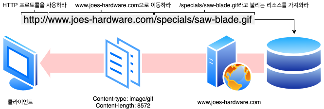
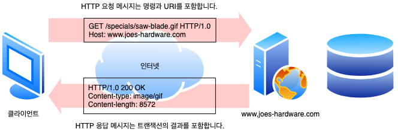
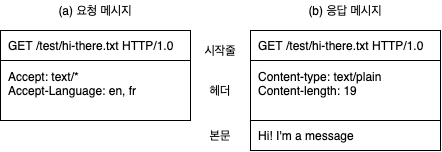
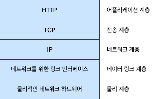
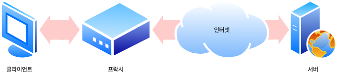
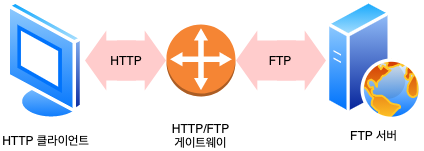
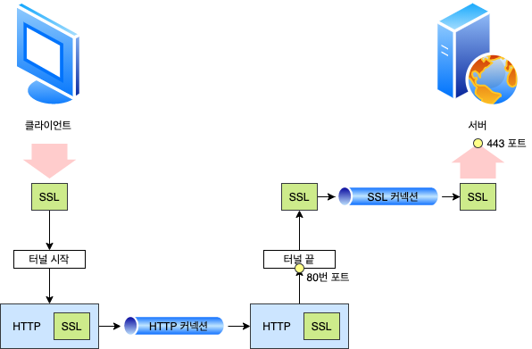
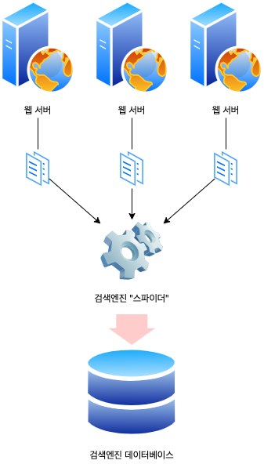

# 1. HTTP 개관

전 세계의 웹브라우저, 서버, 웹 애플리케이션은 모두 **HTTP**(Hypertext Transfer Protocol)를 통해 서로 대화합니다. HTTP는 현대 인터넷의 공용어입니다.

## 1.1 HTTP: 인터넷의 멀티미디어 배달부

HTTP는 신뢰성 있는 데이터 전송 프로토콜을 사용하기 때문에, 데이터가 지구 반대편에서 오더라도 전송 중 손상되거나 꼬이지 않음을 보장합니다. 이 덕분에 사용자는 인터넷에서 얻은 정보가 손상된 게 아닌지 염려하지 않아도 됩니다. 신뢰성 있는 전송은 인터넷 애플리케이션 개발자에게도 이로운데, HTTP 통신이 전송 중 파괴되거나, 중복되거나, 왜곡되는 것을 걱정하지 않아도 되기 때문입니다. 개발자는 인터넷의 결함이나 약점에 대한 걱정 없이 애플리케이션 고유의 기능을 구현하는데 집중할 수 있습니다.

## 1.2 웹 클라이언트와 서버

웹 콘텐츠는 웹 서벙에 존재합니다. 웹 서버는 HTTP 프로토콜로 의사소통하기 때문에 보통 HTTP 서버라고 불립니다. 이들 웹 서버는 인터넷의 데이터를 저장하고, HTTP 클라이언트가 요청한 데이터를 제공합니다. HTTP 클라이언트와 HTTP 서버는 월드 와이드 웹의 기본 요소입니다.

## 1.3 리소스

웹 서버는 웹 리소스를 관리하고 제공합니다. 웹 리소스는 웹 콘텐츠의 원천입니다. 가장 단순한 웹 리소스는 웹 서버 파일 시스템의 정적 파일입니다. 그러나 리소스는 반드시 정적 파일이어야 할 필요는 없습니다. 리소스는 요청에 따라 콘텐츠를 생산하는 프로그램이 될 수도 있습니다. 이들 동적 콘텐츠 리소스는 사용자가 누구인지, 어떤 정보를 요청했는지, 몇 시인지에 따라 다른 콘텐츠를 생성합니다 요약하자면, 어떤 종류의 콘텐츠 소스도 리소스가 될 수 있습니다.

### 1.3.1 미디어 타입

인터넷은 수천 가지 데이터 타입을 다루기 때문에, HTTP는 웹에서 전송되는 객체 각각에 신중하게 MIME 타입이라는 데이터 포맷 라벨을 붙입니다. **MIME**(Multipurpose Internet Mail Extensions, 다목적 인터넷 메일 확장)은 원래 각기 다른 전자메일 시스템 사이에서 메시지가 오갈 때 겪는 문제점을 해결하기 위해 설계되었습니다. MIME은 이메일에서 워낙 잘 동작했기 때문에, HTTP에서도 멀티미디어 콘텐츠를 기술하고 라벨을 붙이기 위해 채택되었습니다.

웹 서버는 모든 HTTP 객체 데이터에 MIME 타입을 붙입니다. 웹브라우저는 서버로부터 객체를 돌려받을 때, 다룰 수 있는 객체인지 MIME 타입을 통해 확인합니다. 대부분의 웹브라우저는 잘 알려진 객체 타입 수백 가지를 다룰 수 있습니다. 이미지 파일을 보여주고, HTML 파일을 분석하거나 포멧팅하고, 오디오 파일을 컴퓨터의 스피커를 통해 재생하고, 특별한 포맷의 파일을 다루기 위해 외부 플러그인 소프트웨어를 실행합니다.

MIME 타입은 사선(`/`)으로 구분된 **주 타입**(Primary Object Type)과 **부 타입**(Specific Subtype)으로 이루어진 문자열 라벨입니다. 예를 들면 다음과 같습니다.

- HTML로 작성된 텍스트 문서는 `text/html` 라벨이 붙습니다.
- plain ASCII 텍스트 문서는 `text/plain` 라벨이 붙습니다.
- JPEG 이미지는 `image/jpeg`가 붙습니다.
- GIF 이미지는 `image/gif`가 됩니다.
- 애플 퀵타임 동영상은 `video/quicktime`이 붙습니다.
- 마이크로소프트 파워포인트 프레젠테이션은 `application/vnd.ms-powerpoint`가 붙습니다.

### 1.3.2 URI

웹 서버 리소스는 각자 이름을 갖고 있기 때문에, 클라이언트는 관심 있는 리소스를 지목할 수 있습니다. 서버 리소스 이름은 **통합 자원 식별자**(Uniform Resource Identifier), 혹은 URI로 불립니다. URI는 인터넷의 우편물 주소 같은 것으로, 정보 리소스를 고유하게 식별하고 위치를 지정할 수 있습니다. HTTP는 주어진 URI로 객체를 찾아옵니다. URI에는 두 가지가 있는데, URL과 URN이라는 것입니다.

### 1.3.3 URL

**통합 자원 지시자**(Uniform Resource locator, URL)는 리소스 식별자의 가장 흔한 형태입니다. URL은 특정 서버의 한 리소스에 대해 구체적인 위치를 서술합니다. URL은 리소사가 정확히 어디에 있고 어떻게 접근할 수 있는지 분명히 알려줍니다. 대부분의 URL은 세 부분으로 이루어진 표준 포맷을 따릅니다.

1. URL의 첫 번째 부분은 **스킴**(Scheme)이라고 불리는데, 리소스에 접근하기 위해 사용되는 프로토콜을 서술합니다. 보통 HTTP 프로토콜입니다.
2. 두 번째 부분은 서버의 인터넷 주소를 제공합니다.
3. 마지막은 웹 서버의 리소스를 가리킵니다.



### 1.3.4 URN

URI의 두 번째 종류는 **유니폼 리소스 이름**(Uniform resource name, URN)입니다. URN은 콘텐츠를 이루는 한 리소스에 대해, 그 리소스의 위치에 영향을 받지 않는 유일무이한 이름 역할을 합니다. 이 위치 독릭적인 URN은 리소스를 여기저기로 옮기더라도 문제없이 동작합니다. 리소스가 그 이름을 변하지 않게 유지하는 한, 여러 종류의 네트워크 접속 프로토콜로 접근해도 문제없습니다.

URN은 여전히 실험 중인 상태고 아직 널리 채택되지 않았습니다. 효율적인 동작을 위해 URN은 리소스 우이치를 분석하기 위한 인프라 지원이 필요한데, 그러한 인프라가 부재하기에 URN 채택이 늦춰지고 있습니다. 그러나 URN의 전망은 분명 밝습니다.

## 1.4 트랜잭션

HTTP 트랜잭션은 **요청 명령**(클라이언트에서 서버로 보내는)과 **응답 결과**(서버가 클라이언트에게 돌려주는)로 구성되어 있습니다. 이 상호작용은 HTTP 메시지라고 불리는 정형화된 데이터 덩어리를 이용해 이루어집니다.



### 1.4.1 메서드

HTTP는 HTTP 메서드라고 불리는 여러 가지 종류의 요청 명령을 지원합니다. 모든 HTTP 요청 메시지는 한 개의 메서드를 갖습니다. 메서드는 서버에게 어떤 동작이 취해져야 하는지 말해줍니다

| HTTP 메서드 | 설명                                                                |
| ----------- | ------------------------------------------------------------------- |
| GET         | 서버에서 클라이언트로 지정한 리소스를 보내라                        |
| PUT         | 클라이언트에서 서버로 보낸 데이터를 지정한 이름의 리소스로 저장해라 |
| DELETE      | 지정한 리소스를 서버에서 작제해라                                   |
| POST        | 클라이언트 데이터를 서버 게이트웨이 애플리케이션으로 보내라         |
| HEAD        | 지정한 리소스에 대한 응답에서, HTTP 헤더 부분만 보내라              |

### 1.4.2 상태 코드

모든 HTTP 응답 메시지는 상태 코드와 함꼐 반환됩니다. 상태 코드는 클라이언트에게 요청이 성공했는지 아니면 추가 조치가 필요한지 알려주는 세 자리 숫자입니다.

| HTTP 상태 코드 | 설명                                          |
| -------------- | --------------------------------------------- |
| 200            | 좋다. 문서가 바르게 변환되었다                |
| 302            | 다시 보내라. 다른 곳에 가서 리소스를 가져가라 |
| 404            | 없음. 리소스를 찾을 수 없다                   |

HTTP는 각 숫자 상태 코드에 텍스트로 된 **사유 구절**(Reason Phrase)도 함꼐 보냅니다. 이 구문은 단지 설명만을 위해서 포함된 것일 뿐 실제 응답 처리에는 숫자로 된 코드가 사용됩니다. HTTP 소프트웨어는 다음에 열거된 상태 코드와 사유 구절을 모두 같은 것으로 취급합니다.

```
200 OK
200 Document attached
200 Success
200 All's cool, dude
```

### 1.4.3 웹페이지는 여러 객체로 이루어질 수 있습니다

애플리케이션은 보통 하나의 작업을 수행하기 위해 여러 HTTP 트랜잭션을 수행합니다. 예를 들어, 웹브라우저는 시각적으로 풍부한 웹페이지를 가져올 때 대량의 HTTP 트랜잭션을 수행합니다. 페이지 레이아웃을 서술하는 HTML 뼈대를 한 번의 트랜잭션으로 가져온 뒤, 첨부된 이미지, 그래픽 조각, 자바 애플릿 등을 가져오기 위해 추가로 HTTP 트랜잭션들을 수행합니다. 이와 같이 웹페이지는 보통 하나의 리소스가 아닌 리소스의 모음입니다.

## 1.5 메시지

HTTP 메시지는 단순한 줄 단위의 문자열입니다. 이진 형식이 아닌 일반 텍스트이기 때문에 사람이 읽고 쓰기 쉽습니다. 웹 클라이언트에서 웹 서버로 보낸 HTTP 메시지를 요청 메시지라고 부릅니다. 서버에서 클라이언트로 가는 메시지는 응답 메시지라고 부릅니다. 그 이외 다른 종류의 HTTP 메시지는 없습니다. HTTP 요청과 응답 메시지의 형식은 굉장히 비슷합니다. HTTP 메시지는 다음의 세 부분으로 이루어집니다.



#### 시작줄

메시지의 첫 줄은 시작줄로, 요청이라면 무엇을 해야 하는지 응답이라면 무슨 일이 일어났는지 나타냅니다.

#### 헤더

시작줄 다음에는 0개 이상의 헤더 필드가 이어집니다. 각 헤더 필드는 쉬운 구문분석을 위해 쌍점(`:`)으로 구분되어 있는 하나의 이름과 하나의 값으로 구성됩니다. 헤더 필드를 추가하려면 그저 한 줄을 더하기만 하면 됩니다. 헤더는 빈 줄로 끝납니다.

#### 본문

빈 줄 다음에는 어떤 종류의 데이터든 들어갈 수 있는 메시지 본문이 필요에 따라 올 수 있습니다. 요청의 본문은 웹 서버로 데이터를 실어 보내며, 응답의 본문은 클라이언트로 데이터를 반환합니다. 문자열이며 구조적인 시작줄이나 헤더와 달리, 본문은 임의의 이진 데이터를 포함할 수 있습니다.(이미지, 비디오, 오디오 트랙, 응용 스프트웨어). 물론 본문은 텍스트도 포함할 수 있습니다.

## 1.6 TCP 커넥션

### 1.6.1 TCP/IP

HTTP는 애플리케이션 계층 프로토콜입니다. HTTP는 네트워크 통신의 핵심적인 세부사항에 대해서 신경 쓰지 않습니다. 대신 대중적이고 신뢰성 있는 인터넷 전송 프로토콜인 TCP/IP에게 맡깁니다. **TCP**(Transmission Control Protocol, 전송 제어 프로토콜)는 다음을 제공합니다.

- 오류 없는 데이터 전송
- 순서에 맞는 전달 (데이터는 언제나 보낸 순서대로 도착합니다)
- 조각나지 않는 데이터 스트림 (언제든 어떤 크기로든 보낼 수 있습니다)

인터넷 자체가 전 세계의 컴퓨터와 네트워크 장치들 사이에서 대중적으로 사용되는 TCP/IP에 기초하고 있습니다. TCP/IP는 TCP와 IP가 층을 이루는, 패킷 교환 네트워크 프로토콜의 집합입니다. TCP/IP는 각 네트워크와 하드웨어의 특성을 숨기고, 어떤 종류의 컴퓨터나 네트워크든 서로 신뢰성 있는 의사소통을 하게 해줍니다. 일단 TCP 커넥션이 맺어지면, 클라이언트와 서버 컴퓨터 간에 교환되는 메시지가 없어지거나, 손상되거나, 순서가 뒤바뀌어 수신되는 일은 결코 업습니다. 네트워크 개념상, HTTP 프로토콜은 TCP 위의 계층입니다. HTTP는 자신의 메시지 데이터를 전송하기 위해 TCP를 사용합니다. 이와 유사하게 TCP는 IP 위의 계층입니다.



### 1.6.2 접속, IP 주소 그리고 포트번호

HTTP 클라이언트가 서버에 메시지를 전송할 수 있게 되기 전에, **인터넷 프로토콜**(Internet Protocol, IP) 주소와 포트번호를 사용해 클라이언트와 서버 사이에 TCP/IP 커넥션을 맺어야 합니다. TCP에서는 서버 컴퓨터에 대한 IP 서버에서 실행 중인 프로그램이 사용 중인 포트번호가 필요합니다.

HTTP 서버의 IP 주소와 포트번호를 어떻게 알아낼 수 있을까? URL을 이용하면 됩니다. URL이란 리소스에 대한 주소입니다. 따라서 당연하게도 URL은 그 리소스를 가지고 있는 장비에 대한 IP 주소를 알려줄 수 있습니다. 몇 가지 URL을 살펴봅시다.

```
http://207.200.83.29:80/index.html
http://www.netscape.com:80:/index.html
http://www.netscape.com/index.html
```

1. 첫 번째 URL은 IP 주소와 포트번호를 갖고 있습니다.₩
2. 두 번째 URL에는 숫자로 된 IP 주소가 없습니다. 대신 글자로 된 도메인 이름 혹은 호스트 명을 갖고 있습니다. 호스트 명은 IP 주소에 대한 이해하기 쉬운 형태의 별명입니다. 호스트 명은 **도메인 이름 서비스**(Domain Name Service, DNS)라 불리는 장치를 통해 쉽게 IP로 변환될 수 있습니다.
3. 마지막 URL은 포트번호가 없습니다. HTTP URL에 포트번호가 빠진 경우에는 기본값 `80`이라고 가정하면 됩니다.


## 1.7 프로토콜 버전

오늘날 쓰이고 있는 HTTP 프로토콜은 버전이 여러 가지입니다. HTTP 프로토콜의 여러 변형을 모두 잘 다루려면 HTTP 애플리케이션이 일을 열심히 해야 합니다.

#### HTTP/0.9

1991년의 HTTP 프로토타입은 HTTP/0.9로 알려져 있습니다. 이 프로토콜은 심각한 디자인 결한이 다수 있고 구식 클라이언트하고만 같이 사용할 수 있습니다. HTTP/9.0은 오직 GET 메서드만 지원하고, 멀티미디어 콘텐츠에 대한 MIMe 타입이나, HTTP 헤더, 버전 번호는 지원하지 않습니다. HTTP/9.0는 원래 간단한 HTML 객체를 받아 오기 위해 만들어진 것입니다. HTTP/9.0는 금방 HTTP/1.0으로 대체되었씁니다.

#### HTTP/1.0

1.0은 처음으로 널리 쓰이기 시작한 HTTP 버전입니다. HTTP/1.0은 버전 번호, HTTP 헤더, 추가 메서드, 멀티미디어 객체 처리를 추가했습니다. HTTP/1.0은 시각적으로 매력적인 웹페이지와 상호작용하는 폼을 실현했고, 이는 월드 와이드 웹을 대세로 만들었습니다. HTTP/1.0은 결코 잘 정의된 명세가 아닙니다. HTTP가 상업적, 학술적으로 급성장하던 시기에 만들어진, 잘 동작하는 용례들의 모음에 가깝습니다.

#### HTTP/1.0+

1990년대 중반, 월드 와이드 웹이 급격히 팽창하고 상업적으로도 성공하면서 여러 유명 웹 클라이언트 서버 들은 그에 따른 요구를 만족시키기 위해 발 빠르게 HTTP에 기능을 추가해갔습니다. 오래 지속되는 `keep-alive` 커넥션, 가상 호스팅 지원, 프락시 연결 지원을 포함해 많은 기능이 공식적이지 않지만 사실상의 표준으로 HTTP에 추가되었습니다. 이 규격 외의 확장된 HTTP 버전을 흔히 HTTP/1.0+라고 부릅니다.

#### HTTP/1.1

HTTP/1.1은 HTTP 설계의 구조적 결함 교정, 두드러진 성능 최적화, 잘못된 기능 제거에 집중했습니다. 뿐만 아니라 HTTP/1.1은 더 복잡해진 웹 애플리케이션과 배포(1990년대 후반에 이미 쓰이고 있었습니다)를 지원합니다. HTTP/1.1은 현재 HTTP 버전입니다.

#### HTTP/2.0

HTTP/2.0은, HTTP/1.1 성능 문제를 개선하기 위해 구글의 SPDY 프로토콜을 기반으로 설계가 진행 중인 프로토콜입니다.

## 1.8 웹의 구성요소

### 1.8.1 프락시

프락시는 클라이언트와 서버 사이에 위치하여, 클라이언트의 모든 HTTP 요청을 받아 서버에 전달합니다(대게 요청을 수락한 뒤에). 이 애플리케이션은 사용자를 위한 프락시로 동작하며 사용자를 대신해서 서버에 접근합니다. 프락시는 주로 보안을 위해 사용됩니다. 즉, 모든 웹 트래픽 흐름 속에서 신뢰할 만한 중개자 역할을 합니다. 또한 프락시는 요청과 응답을 필터링합니다. 예를 들어, 회사에서 무엇인가를 다운 받을 때 애플리케이션 바이러스를 검출하거나 초등학교 학생들에게 성인 콘텐츠를 차단합니다.



#### 1.8.2 캐시

웹 캐시와 캐시 프락시는 자신을 거쳐 가는 문서들 중 자주 찾는 것의 사본을 저장해 두는, 특별한 종류의 HTTP 프락시 서버입니다. 다음번에 클라이언트가 같은 문서를 요청하면 그 캐시가 갖고 있는 사본을 받을 수 있습니다. 클라이언트는 멀리 떨어진 웹 서버보다 근처의 캐시에서 훨씬 더 빨리 문서를 다운 받을 수 있습니다. HTTP는, 캐시를 효율적으로 동작하게 하고 캐시된 콘텐츠를 최신 버전으로 유지하면서 동시에 프라이버시도 보호하기 위한 많은 기능을 정의합니다.


#### 1.8.3 게이트웨이

게이트웨이는 다른 서버들의 중재자로 동작하는 특별한 서버입니다. 게이트웨이는 주로 HTTP 트래픽을 다른 프로토콜로 변환하기 위해 사용됩니다. 게이트웨이는 언제나 스스로가 리소스를 갖고 있는 진짜 서버인 것처럼 요청을 다룹니다. 클라이언트는 자신이 게이트웨이와 통신하고 있음을 알아채지 못할 것입니다. HTTP/FTP 게이트웨이는 FTP URI에 대한 HTTP 요청을 받아들인 뒤, FTP 프로토콜을 이용해 문서를 가져옵니다. 받아온 문서는 HTTP 문서에 담겨 클라이언트에게 보냅니다.



#### 1.8.4 터널

터널은 두 커넥션 사이에서 날(raw) 데이터를 열어보지 않고 그대로 전달해주는 HTTP 애플리케이션입니다. HTTP 터널은 주로 비 HTTP 데이터를 하나 이상의 HTTP 연결을 통해 그대로 전송해주기 위해 사용됩니다. HTTP 터널을 활용하는 대표적인 예로, 암호화된 SSL 트래픽을 HTTP 커넥션으로 전송함으로써 웹 트래픽만 허용하는 사내 방화벽을 통과시키는 것이 있습니다. HTTP/SSL 터널은 HTTP 요청을 받아들여 목적지의 주소와 포트번호로 커넥션을 맺습니다. 이후부터는 암호화된 SSL 트래픽을 HTTP 채널을 통해 목적지 서버로 전송할 수 있게 됩니다.



#### 1.8.5 에이전트

사용자 에이전트(혹은 그냥 에이전트)는 사용자를 위해 HTTP 요청을 만들어주는 클라이언트 프로그램입니다. 웹 요청을 만드는 애플리케이션은 뭐든 HTTP 에이전트입니다. 지금까지 우리는 한 가지 종류의 HTTP 에이전트, 웹 브라우저에 대해서만 이야기했습니다. 그러나 사용자 에이전트에는 여러 가지 종류가 더 있습니다.

예를 들어, 사람의 통제 없이 스스로 웹을 돌아다니며 HTTP 트랜잭션을 일으키고 콘텐츠를 받아오는 자동화된 사용자 에이전트가 있습니다. 이들 자동화된 에이전트는 보통 **스파이더**나 **웹로봇**과 같이 다체로운 이름을 갖고 있습니다. 스파이더는 웹을 돌아다니며, 검색엔진의 데이터베이스나 가격비교 로봇을 위한 제품 카탈로그와 같은 유용한 웹 콘텐츠 보관소를 만듭니다.


