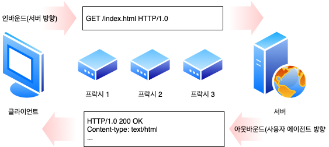
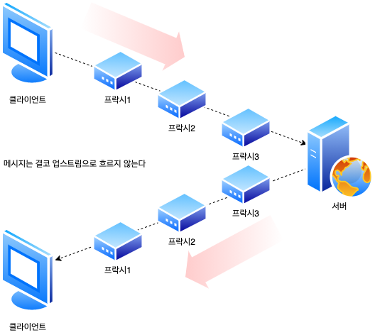

# 3. HTTP 메시지

## 3.1 메시지의 흐름

HTTP 메시지는 HTTP 애플리케이션 간에 주고받은 데이터의 블록들입니다. 이 데이터의 블록들은 메시지의 내용과 의미를 설명하는 텍스트 메타 정보로 시작하고 그 다음에 선택적으로 데이터가 올 수 있습니다. 이 메시지는 클라이언트, 서버, 프락시 사이를 흐릅니다. **인바운드**, **아웃바운드**, **업스트림**, **다운스트림**은 메시지의 방향을 의미하는 용어입니다.

### 3.1.1 메시지는 원 서버 방향을 인바운드로 하여 송신됩니다.

HTTP는 인바운드와 아웃바운드라는 용어를 트랜잭션 방향을 표현하기 위해 사용합니다. 메시지가 원 서버로 향하는 것은 인바운드로 이동하는 것이고, 모든 처리가 끝난 뒤에 메시지가 사용자 에이전트로 돌아오는 것은 아웃바운드로 이동하는는 것입니다.



### 3.1.2 다운스트림으로 흐르는 메시지

HTTP 메시지는 강물과 같이 흐릅니다. 요청 메시지냐 응답 메시지냐에 관계없이 모든 메시지는 다운스트립으로 흐릅니다. 메시지의 발송지는 수신자의 업스트림입니다.



### 3.2 메시지의 각 부분

HTTP 메시지는 단순한, 데이터의 구조화된 블록입니다. 각 메시지는 클라이언트로부터의 요청이나 서버로부터의 응답 중 하나를 포함합니다. 메시지는 시작줄, 헤더 블록, 본문 이렇게 세 부분으로 이루어집니다. 시작줄은 이것이 어떤 메시지인지 서술하며, 헤더 블록은 속성을, 본문은 데이터를 담고 있습니다. 본문은 아예 없을 수도 있습니다.

시작줄과 헤더는 그냥 줄 단위로 분리된 아스키 문자열입니다. 각 줄은 캐리지 리턴(ASCII 13)과 개행 문자(ASCII 10)로 구성된 두 글자의 줄바꿈 문자열로 끝납니다. 이 줄바꿈 문자열은 **CRLF**라고 씁니다. HTTP 명세에 따른다면 줄바꿈 문자열은 CRLF이지만 견고한 애플리케이션이라면 그냥 개행 문자도 받아들일 수 있어야 한다는 점을 언급할 필요가 있을 듯합니다. 오래되거나 잘못 만들어진 HTTP 애플리케이션들 중에서는 캐리지 리턴과 개행 문자 모두를 항상 전송하지 않는 것들도 있습니다.

엔터티 본문이나 메시지 본문은 단순히 선택적인 데이터 덩어리입니다. 시작줄이나 헤더와 달리, 본문은 텍스트나 이진 데이터를 포함할 수도 있고 그냥 비어있을 수도 있습니다. 헤더는 본문에 대한 꽤 많은 정보를 줍니다. Content-type 줄은 본문이 무엇인지 말해줍니다. Content-length 줄은 본문의 크기를 말해줍니다.

### 3.2.1 메시지 문법

모든 HTTP 메시지는 요청 메시지나 응답 메시지로 분류됩니다. 요청 메시지는 웹 서버에 어떤 동작을 요구합니다. 응답 메시지는 요청의 결과를 클라이언트에게 돌려줍니다. 요청과 응답 모두 기본저긍로 구조가 같습니다.

##### 요청 메시지

```
<메서드> <요청 URL> <버전>
<헤더>

<엔터티 본문>
```

##### 응답 메시지

```
<버전> <상태 코드> <사유 구절>
<헤더>

<엔터티 본문>
```

#### 메서드

클라이언트 측에서 서버가 리소스에 대해 수행해 주길 바라는 동작입니다. HTTP 명세는 공통 요청 메서드의 집합을 정의합니다. 메서드에 따라 요청 메시지에 본문이 있는 경우도 있고 그렇지 않은 경우도 있다는 점에 주의해야 합니다.

| 메서드  | 설명                                                      | 메시지 본문이 있는가? |
| ------- | --------------------------------------------------------- | --------------------- |
| GET     | 서버에 어떤 문서를 가져옵니다.                            | 없음                  |
| HEAD    | 서버에서 어떤 문서에 대해 헤더만 가져옵니다.              | 없음                  |
| POST    | 서버가 처리해야 할 데이터를 보냅니다.                     | 있음                  |
| PUT     | 서버에 요청 메시지의 본문을 저장합니다.                   | 있음                  |
| TRACE   | 메시지가 프락시를 거쳐 서버에 도달하는 과정을 추적합니다. | 없음                  |
| OPTIONS | 서버가 어떤 메서드를 수행할 수 있는지 확인합니다.         | 없음                  |
| DELETE  | 서버에서 문서를 제거합니다.                               | 없음                  |

모든 서버가 위의 메서드를 모두 구현한 것은 아닙니다. 더 나아가, HTTP는 쉽게 확장할 수 있도록 설계되었기 떄문에, 다른 서버는 그들만의 메서드를 추가로 구현했을 수도 있습니다. 이러한 추가 메서드는 HTTP 명세를 확장하는 것이기 때문에 확장 메서드라고 불립니다.

#### 요청 URL

요청 대상이 되는 리소스를 지칭하는 완전한 URL 혹은 URL의 경로 구성요소입니다. 완전한 URL이 아닌 URL의 경로 구성요소라고 해도, 클라이언트가 서버와 직접 대화하고 있고 경로 구성요소가 리소스를 가리키는 절대 경로이기만 하면 대체로 문제가 없습니다. 서버는 URL에서 생략된 호스트/포트가 자신을 가리키는 것으로 간주할 것입니다.

#### 버전

```
HTTP/<메이저>.<마이너>
```

이 메시지에서 사용 중인 HTTP의 버전이며, 요청과 응답 메시지 양쪽 모두에 기술됩니다. 버전 번호는 HTTP로 대화하는 애플리케이션들에게 대화 상대의 능력과 메시지의 형식에 대한 단서를 제공해주기 위한 것입니다. HTTP 버전 1.1 애플리케이션과 대화하는 HTTP 버전 1.2 애플리케이션은 1.2 버전의 새로운 기능을 사용할 수 없다는 것을 알아야합니다. 버전 1.1 애플리케이션은 아마도 1.2 버저느이 기능을 구현하지 않았을 것이기 때문입니다.

버전 번호는 아떤 애플리케이션이 지원하는 가장 높은 HTTP 버전을 가리킵니다. 때때로 이는 애플리케이션 간에 혼란을 유발하는데, HTTP/1.0 애플리케이션이 버전 번호가 HTTP/1.1로 된 응답을 받았을 때, 이를 HTTP/1.1 메시지라고 해석하는 경우가 있기 때문입니다. 응답의 프로토콜 버전이 HTTP/1.1이라는 것은 사실 응답을 보낸 애플리케이션이 HTTP/1.1까지 이해할 수 있음을 의미하는 것입니다.

메이저와 마이너 모두 정수입니다. 버전 번호는 분수로 다루어지지 않고, 메이저와 마이너는 각각 분리된 숫자로 다루어집니다. 따라서 어느 쪽이 큰지 HTTP 버전을 비교할 때 각 숫자는 반드시 따로따로 비교해야 합니다. 예를 들어, HTTP/2.22는 HTTP/2.3보다 큽니다. 왜냐하면 22는 3보다 큰 숫자이기 떄문입니다.

#### 상태 코드

요청 중에 무엇이 일어났는지 설명하는 세 자리의 숫자입니다. 각 코드의 첫 번쨰 자릿수는 상태의 일반적인 분류(성공, 에러 등)를 나타냅니다. 성탸 코드는 각 응답 메시지의 시작줄에 담겨 반환됩니다. 숫자로 된 코드와, 문자열로 되어 있어서 사람이 이해하기 쉬운 메시지 두 형태 모두로 반환됩니다. 상태 코드들은 세 자리 숫자로 된 그들의 코드값을 기준으로 묶입니다.

| 전체 범위 | 정의된 범위 | 분류            |
| --------- | ----------- | --------------- |
| 100 - 109 | 100 - 101   | 정보            |
| 200 - 299 | 200 - 206   | 성공            |
| 300 - 399 | 300 - 305   | 리다이렉션      |
| 400 - 499 | 400 - 415   | 클라이언트 에러 |
| 500 - 599 | 500 - 505   | 서버 에러       |

현재 버전의 HTTP는 각 상태 분류에 대해 적은 수의 코드만을 정의했습니다. 프로토콜이 진화하면서, 더 많은 상태 코드가 HTTP 명세에 공식적으로 정의될 것입니다. 만약 당신이 인식할 수 없는 상태 코드를 받게 되면, 누군가가 현재 프로토콜의 확장으로 그것을 정의했을 가능성이 있습니다. 그 상태 코드를 그것이 포함되는 범위의 일반적인 구성원으로 가정하고 다루어야 합니다. 예를 들어, 만약 상태 코드 515를 받게 되면, 그 응답에 다른 5XX 메시지들과 마찬가지로 서버 에러를 의미하는 것으로 간주하고 다루어야 합니다.

#### 사유 구절 (Reason-Phrase)

숫자로 된 상태 코드의 의미를 사람이 이해할 수 있게 설명해주는 짧은 문구로, 상태 코드 이후부터 줄바꿈 문자열까지 사유 구절입니다. 사유 구절은 상태 코드와 일대일로 대응합니다. 사유 구절은, 애플리케이션 개발자가 그들의 사용자에게 요청 중에 무슨 일이 일어났는지 알려주기 위해 넘겨줄 수 있는, 오로지 사람에게 읽히기 위한 목적으로 존재하는 것입니다. 예를 들어 `HTTP/1.0 200 NOT OK`와 `HTTP/1.0 200 OK`는 사유 구절이 서로 전혀 달라보임에도 불구하고 동등하게 성공을 의미하는 것으로 처리되어야 합니다.

#### 헤더들

이름, 콜론(`:`), 선택적인 공백, 값, CRLF가 순서대로 나타나는 0개 이상의 헤더가 있습니다. HTTP 헤더 필드는 요청과 응답 메시지에 추가 정보를 더합니다. 그들은 기본적으로 이름/값 쌍의 목록입니다. 이 헤더의 목록은 빈 줄(CRLF)로 끝나 헤더 목록의 끝과 엔터티 본문의 시작을 표시합니다. HTTP/1.1과 같은 몇몇 버전의 HTTP는 요청이나 응답에 어떤 특정 헤더가 포함되어야만 유효한 것으로 간주합니다.

| 헤더의 예                                  | 설명                                                         |
| ------------------------------------------ | ------------------------------------------------------------ |
| `Date: Tue, 3 Oct 1997 02:16:03 GMT`       | 서버가 응답을 만들어 낸 시각                                 |
| `Content-length: 15040`                    | 엔터티 본문은 15,040바이트의 데이터를 포함합니다.            |
| `Content-type: image/gif`                  | 엔터티 본문은 GIF 이미지입니다.                              |
| `Accept: image/gif, image/jpeg, text/html` | 클라이언트는 GIF, JPEG 이미지와 HTML을 받아들일 수 있습니다. |

##### 헤더 분류

HTTP 헤더 명세는 여러 헤더 필드를 정의합니다. 애플리케이션은 또한 자유롭게 자신만의 헤더를 만들어낼 수 있습니다. HTTP 헤더는 다음과 같이 분류됩니다.

- **일반 헤더**: 요청과 응답 양쪽에 모두 나타날 수 있습니다.
- **요청 헤더**: 요청에 대한 부가 정보를 제공합니다.
- **응답 헤더**: 응답에 대한 부가 정보를 제공합니다.
- **Entity 헤더**: 본문 크기와 콘텐츠, 혹은 리소스 그 자체를 서술합니다.
- **확장 헤더**: 명세에 정의되지 않은 새로운 헤더입니다.

##### 헤더를 여러 줄로 나누기

긴 헤더 줄은 그들을 여러 줄로 쪼개서 더 읽기 좋게 만들 수 있는데, 추가 줄 앞에는 최소 하나의 스페이스 혹은 탭 문자가 와야 합니다.

```
HTTP/1.0 200 OK
Content-Type: image/gif
Content-Length: 6572
Server: Test Server
  Version 1.0

```

#### 엔터티 본문

엔터티 본문은 임의의 데이터 블록을 포함합니다. 모든 메시지가 엔터티 본문을 갖는 것은 아니므로, 때때로 메시지는 그냥 CRLF으로 끝나게 됩니다. 헤더나 엔터티 본문이 없더라도 HTTP 헤더의 집합은 항상 빈 줄(그냥 CRLF)로 끝나야 함에 주의합니다. 그러나 역사적으로 많은 클라이언트와 서버가 엔터티 본문이 없는 경우에 마지막 CRLF를 빠드립니다. 이와 같이 널리 쓰이지만 규칙을 잘 지키지 않는 구현체와의 호환을 위해, 클라이언트와 서버는 마지막 CRLF 없이 끝나는 메시지도 받아들일 수 있어야 합니다.

### 3.2.2. 시작줄

모든 HTTP 메시지는 시작줄로 시작합니다. 요청 메시지의 시작줄은 무엇을 해야 하는지 말해줍니다. 응답 메시지의 시작줄은 무슨 일이 일어났는지 말해줍니다.

#### 요청줄

요청 메시지는 서버에게 리소스에 대해 무언가를 해달라고 부탁합니다. 요청 메시지의 시작줄, 혹은 요청줄에는 서버에서 어떤 동작이 일어나야 하는지 설명해주는 메서드와 그 동작에 대한 대상을 지칭하는 요청 URL이 들어있습니다. 또한 요청줄은 클라이언트가 ㅇ어떤 HTTP 버전으로 말하고 있는지 서버에게 알려주는 HTTP 버전도 포함합니다. HTTP/1.0 이전에는 요청줄에 HTTP 버전이 들어있을 필요가 없었습니다. 이 모든 필드는 공백으로 구분됩니다.

#### 응답줄

응답 메시지는 수행 결과에 대한 상태 정보와 결과 데이터를 클라이언트에게 돌려줍니다. 응답 메시지의 시작줄 혹은 응답줄에는 응답 메시지에 쓰인 HTTP의 버전, 숫자로 된 상태 코드, 수행 상태에 대해 설명해주는 텍스트로 된 사유 구절이 들어 있습니다. HTTP/1.0 이전 시절에는 응답에 응답줄이 들어있을 필요가 없었습니다. 이 모든 필드는 공백으로 구분됩니다.

### 3.2.4 엔티티 본문

HTTP 메시지의 세 번째 부분은 선택적인 엔티티 본문입니다. 엔티티 본문은 HTTP 메시지의 화물이라고 할 수 있습니다. HTTP 메시지는 여러 종류의 디지털 데이터를 실어 나를 수 있습니다.

### 3.2.5 버전 0.9 메시지

HTTP 버전 0.9는 HTTP 프로토콜의 초기 버전입니다. 그것은 오늘날 HTTP 가 갖고 있는 요청과 응답 메시지의 시초이지만, 훨씬 단순한 프로토콜로 되어 있습니다. HTTP/0.9 메시지도 마찬가지로 요청과 응답으로 이루어져 있지만, 요청은 그저 메서드와 요청 URL을 갖고 있을 뿐이며, 응답은 오직 엔터티로만 되어 있습니다. 버전 정보도 없고(그 시절엔 최초이지 유일한 버전이었습니다), 상태 코드나 사유 구절도 없으며, 헤더도 포함되어 있지 않습니다. 이와 같은 지나칠 정도의 단순함 때문에, HTTP/0.9로는 다양한 상황에 대응할 수 없습니다.

## 3.3 메서드

모든 서버가 모든 메서드를 구현하지는 않습는다는 것에 주의해야합니다. HTTP 버전 1.1과 호환되고자 한다면, 서버는 자신의 리소스에 대해 GET과 HEAD 메서드만 구현하는 것으로 충분합니다. 비록 서버가 모든 메서드를 구현하지 않았다 하더라도 메서드는 대부분 제한적으로 사용될 것입니다. DELETE와 PUT을 지원하는 서버는 아무나 저장된 리소스를 삭제할 수 있길 바라지 않을 것입니다. 이 제한은 일반적으로 서버 설정에 의해 정해지며, 따라서 사이트마다 또 서버마다 다를 수 있습니다.

### 3.3.1 안전한 메서드 (Safe Method)

HTTP는 안전한 메서드라 불리는 메서드의 집합을 정의합니다. GET과 HEAD 메서드는 안전하다고 할 수 있는데, 이는 GET이나 HEAD 메서드를 사용하는 HTTP 요청의 결과로 서버에 어떤 작용도 없음을 의미합니다. 안전한 메서드가 서버에 적용을 유발하지 않는다는 보장은 없습니다. 안전한 메서드의 목적은, 서버에 어떤 영향을 줄 수 있는 안전하지 않은 메서드가 사용될 떄 사용자들에게 그 사실을 알려주는 HTTP 애플리케이션을 만들 수 있도록 하는 것에 있습니다. 예를 들어, 웹브라우저는 안전하지 않은 메서드를 담은 요청이 만들어졌고, 그 결과 서버에서 어떤 일(신용카드가 결제된다거나)이 일어날 수 있음을 알려주는 경고 메시지를 띄울 것입니다.

### 3.3.2 GET

GET은 가장 흔히 쓰이는 메서드입니다. 주로 서버에게 리소스를 달라고 요청하기 위해 쓰입니다. HTTP/1.1ㅂ은 서버가 이 메서드를 구현할 것을 요구합니다.

### 3.3.3 HEAD

HEAD 메서드는 정확히 GET처럼 행동하지만, 서버는 응답으로 헤더만을 돌려줍니다. 엔터티 본문은 결코 반환되지 않습니다. 이는 클라이언트가 리소스를 실제로 가져올 필요 없이 헤더만을 조사할 수 있도록 해줍니다.

- 리소스를 가져오지 않고도 그에 대한 무엇인가(타입이라거나)를 알아낼 수 있습니다.
- 응답의 상태 코드를 통해, 개체가 존재하는지 확인할 수 있습니다.
- 헤더를 확인하여 리소스가 변경되었는지 검사할 수 있습니다.

서버 개발자들은 반드시 반환되는 헤더가 GET으로 얻은 것과 정확히 일치함을 보장해야 합나ㅣ다. 또한 HTTP/1.1 준수를 위해서는 HEAD 메서드가 반드시 구현되어 있어야 합니다.

### 3.3.4 PUT

GET 메서드가 서버로부터 문서를 읽어들이는데 반해 PUT 메서드는 서버에서 문서를 씁니다. PUT 메서드의 의미는, 서버가 요청의 본문을 가지고 요청 URL의 이름대로 새 문서를 만들거나, 이미 URL이 존재한다면 본문을 사용해서 교체하는 것입니다. PUT은 콘텐츠를 변경할 수 있게 해주기 떄문에, 많은 웹 서버가 PUT을 수행하기 전에 사용자에게 비밀번호를 입력해서 로그인을 하도록 요구할 것입니다.

### 3.3.5 POST

POST 메서드는 서버에 입력 데이터를 전송하기 위해 설계되었습니다. 실제로, HTML 폼을 지원하기 위해 흔히 사용됩니다. 채워진 폼에 담긴 데이터는 서버로 전송되며, 서버는 이를 모아서 필요로 하는 곳(예를 들면 그 데이터를 처리할 서버 게이트웨이 프로그램)에 보냅니다.

> PUT과 POST의 차이는 **Idempotent**라는 개념의 도입이 필요합니다. Idempotent는 멱등의 법칙이라하며, 몇 번이고 같은 연산을 반복해도 같은 값이 나온다는 것입니다. POST는 클라이언트가 리소스의 위치를 지정하지 않았을 떄 리소스를 생성하기 위해 사용하는 연산이며 Idempotent 하지 않습니다. 예를들어, Item을 생성하는 엔터티 본문을 `/item`으로 보내 연산을 수행하면 `/item/1`에 생기고, 그 다음번에 `/item/2` 등 매번 다른곳에 새로운 리소스가 생성될 수 있습니다. 반면 POST는 리소스의 위치가 명확히 지정된 다음 요청을 보내며 Idempotent합니다. 예를둘어, 동일한 Item을 생성하는 엔어티 본문을 `item/3`으로 보내면, 몇 번을 수행하더라도 같은 결과를 보장합니다.

### 3.3.6 TRACE

클라이언트가 어떤 요청을 할 떄, 그 용청은 방화벽, 프락시, 게이트웨이 등의 애플리케이션을 통과할 수 있습니다. 이들에게는 원래의 HTTP 요청을 수정할 수 있는 기회가 있습니다. TRACE 메서드는 클라이언트에게 자신의 요청이 서버에 도달했을 떄 어떻게 보이게 되는지 알려줍니다.

TRACE 요청은 목적지 서버에서 **루프백**(Loopback) 진단을 시작합니다. 요청 전송의 마지막 단계에 있는 서버는 자신이 받은 요청 메시지를 본문에 넣어 TRACE 응답을 되돌려줍니다. 클라이언트는 자신과 목적지 서버 사이에 있는 모든 HTTP 애플리케이션의 오청/응답 연쇄를 따라가면서 자신이 보낸 메시지가 망가졌거나 수정되었는지, 만약 그렇다면 어떻게 변경되었는지 확인할 수 있습니다.

TRACE는 진단을 위해 사용할 때는 괜찮지만, 그 대신 중간 애플리케이션이 여러 다른 종류의 요청(GET, HEAD, POST 등 각각 다른 메서드를 사용한)들을 일관되게 다룬다고 가정하는 문제가 있습니다. 많은 HTTP 애플리케이션은 메서드에 따라 다르게 동작합니다. TRACE는 메서드를 구별하는 메커니즘을 제공하지 않습니다. 어떯게 TRACE 요청을 처리할 것이지에 대해서는 일반적으로 중간 애플리케이션이 결정을 내립니다.

TRACE 요청은 어떠한 엔터티 본문도 보낼 수 없습니다. TRACE 응답의 엔터티 본문에는 서버가 받은 요청이 그대로 들어있습니다.

### 3.3.7 OPTIONS

OPTIONS 메서드는 웹 서버에게 여러 가지 종류의 자원 범위에 대해 물어봅니다. 서버에게 특정 리소스에 대해 어떤 메서드가 지원되는지 물어볼 수 있습니다. 이 메서드는 여러 리소스에 대해 실제로 접근하지 않고도 그것들을 어떠헥 접근하는 것이 최선인지 확인할 수 있는 수단을 클라이언트 애플리케이션에게 제공합니다.

### 3.3.8 DELETE

DELETE 메서드는 서버에게 요청 URL로 지정한 리소스를 삭제할 것을 요청합니다. 그러나 클라이언트는 삭제가 수행되는 것을 보장하지 못합니다. 왜냐하면 HTTP 명세는 서버가 클라이언트에게 알리지 않고 요청을 무시하는 것을 허용하기 때문입니다.

### 3.3.9 확장 메서드

HTTP는 필요에 따라 확장해도 문제가 없도록 설계되어 있으므로, 새로 기능을 추가해도 과거에 구현된 소프트웨어들의 오동작을 유발하지 않습니다. 확장 메서드는 HTTP/1.1 명세에 정의되지 않은 메서드입니다. 그들은 개발자들에게 그들의 서버가 구현한 HTTP 서비스의 서버가 관리하는 리소스에 대한 능력을 확장하는 수단을 제공합니다.

| 메서드 | 설명                                                                                                                                               |
| ------ | -------------------------------------------------------------------------------------------------------------------------------------------------- |
| LOCK   | 사용자가 리소스를 잠글 수 있게 해줍니다. 예를 들어, 문서를 편집하는 동안 다른 사람이 동시에 같은 문서를 편집하지 못하도록 문서를 잠글 수 있습니다. |
| MKCOL  | 사용자가 문서를 생성할 수 있게 해줍니다.                                                                                                           |
| COPY   | 서버에 있는 리소스를 복사합니다.                                                                                                                   |
| MOVE   | 서버에 있는 리소스를 옮깁니다.                                                                                                                     |

모든 확장 메서드가 형식을 갖춘 명세로 정의된 것은 아니라는 점에 주의해야 합니다. 만약 당신이 어던 확장 메서드를 정의한다면, 그것은 대부분의 HTTP 애플리케이션이 이해할 수 없을 것입니다. 마찬가지로, 당신의 HTTP 애플리케이션이 이해할 수 없는 확장 메서드를 사용하는 애플리케이션과 마주칠 수도 있습니다.

이런 상황에서는 확장 메서드에 대해 관용적인 것이 최고입니다. 프락시는 종단 간(End-To-End) 행위를 망가뜨리지 않을 수 있다면, 알려지지 않은 메서드가 담긴 메시지를 다운스트림 서버로 전달하려고 시도합니다. 그렇지 않다면 프락시는 501 Not Implemented 상태 코드로 응답해야 합니다. 확장 메서드를 다룰 떄는 **엄격하게 보내고 관대하게 받아들여라**라는 오랜 규칙에 따르는 것이 가장 좋습니다.

## 3.4 상태 코드

상태 코드는 클라이언트에게 그들의 트랜잭션을 이해할 수 있는 쉬운 방법을 제공합니다.

### 3.4.1 100-199: 정보성 상태 코드

정보성 상태 코드는 HTTP/1.1에서 도입되었습니다. 이들은 비교적 새로운 것이며, 복잡함을 감수할 만한 가치가 있는지에 대해 논란이 되고 있습니다.

| 상태 코드 | 사유 구절           | 의미                                                                                                                                                         |
| --------- | ------------------- | ------------------------------------------------------------------------------------------------------------------------------------------------------------ |
| 100       | Continue            | 요청의 시작 부분 일부가 받아들여졌으며, 클라이언트는 나머지를 계속 이어서 보내야 함을 의미합니다. 이것을 보낸 후, 서버는 반드시 요청을 받아 응답해야 합니다. |
| 101       | Switching Protocols | 클라이언트가 Upgrade 헤더에 나열한 것 중 하나로 서버가 프로토콜을 바꾸었음을 의미합니다.                                                                     |

특히 100 Continue 상태 코드는 약간 혼란스럽습니다. 100 Continue는 HTTP 클라이언트 애플리케이션이 서버에 엔터티 본문을 전송하기 전에 그 엔터티 본문을 서버가 받아들일 것인지 확인하려고 할 때, 그 확인 작업을 최적화하기 위한 의도로 도입된 것입니다. 이는 HTTP 프로그래머를 혼란스럽게 하는 경향이 있으므로, 여기서 좀 더 자세히 다룰 것입니다.

#### 클라이언트와 100 Continue

만약 클라이언트가 엔터티를 서버에게 보내려고 하고, 그 전에 100 Continue 응답을 기다리겠다면, 클라이언트 값을 100-continue로 하는 Expect 요청 헤더를 보낼 필요가 있습니다. 만약 클라이언트가 엔터티를 보내지 않으려 한다면, 100-continue Expect 헤더를 보내지 않아야 합니다. 왜냐하면 이것은 클라이언트가 엔터티를 보낼 것이라고 생각하게 만들어 서버를 혼란에 빠드릴 뿐이기 때문입니다.

100-continue는 여러 측면에서 최적화를 위한 것입니다. 클라이언트 애플리케이션은 100-continue를 서버가 다루거나 사용할 수 없는 큰 엔터티를 서버에게 보내지 않으려는 목적으로만 사용해야 합니다. 100 Continue 상태에 대한 초창기의 혼란 때문에, 100-continue 값이 담긴 Expect 헤더를 보낸 클라이언트가 서버가 100 Continue 응답을 보내주기를 막연히 기다리기만 해서는 안 됩니다. 약간의 타임아웃 후에 클라이언트는 그냥 엔터티를 보내야 합니다. 사실 클라이언트 개발자는 예상하지 못한 100 Continue 응답에도 대비해야 합니다. 몇몇 잘못 만들어진 HTTP 애플리케이션은 이 코드를 부적절하게 보냅니다.

##### 서버와 100 Continue

서버가 100-continue 값이 담긴 Expect 헤더가 포함된 요청을 받는다면, 100 Continue 응답 혹은 에러 코드로 답해야 합니다. 서버는 절대로 100-continue 응답을 받을 것을 의도하지 않은 클라이언트에게 100 Continue 상태 코드를 보내서는 안 됩니다. 몇몇 잘못 만들어진 서버는 그렇게 합니다.

서버가 100 Continue 응답을 보낼 기회를 갖기 전에 어떤 이유로 인해 엔터티의 일부(혹은 전체)를 수신했다면, 서버는 이 상태 코드를 보낼 필요가 없습니다. 왜냐하면 클라이언트는 이미 계속 전송하기로 결정하였기 때문입니다. 그러나 서버가 요청을 끝까지 다 읽은 후에는 그 요청에 대한 최종 응답을 보내야 합니다. (100 Continue 상태는 그냥 생략해도 됩니다)

마지막으로, 안약 서버가 100 continue 응답을 받을 것을 의도한 요청을 받고 난 상태에서 엔터티 본문을 읽기 전에 요청을 끝내기로 결정했다면(에러 등의 이유로), 서버는 그냥 응답을 보내고 연결을 닫아서는 안 됩니다. 클라이언트가 응답을 받을 수 없게 되기 때문입니다. (**4장 끊기와 리셋 에러** 참고)

#### 프락시와 100 Continue

클라이언트로부터 100-continue 응답을 의도한 요청을 받은 프락시는 몇 가지 해야 할 일이 있습니다. 만약 **다음 홉**(Next-Hop) 서버가 HTTP/1.1을 따르거나 혹은 어떤 버전을 따르는지 모른다면, Expect 헤더를 포함시켜서 요청을 다음으로 전달해야 합니다. 만약 다음 홉의 서버가 1.1보다 이전 버전의 HTTP를 따른다는 것을 알고 있다면, 프락시는 417 Expectation Failed 에러로 응답해야 합니다.

만약 프락시가 HTTP/1.0이나 이전 버전을 따르는 클라이언트를 대신하여 Expect 헤더와 100-continue 값을 요청에 포함시키기로 결정했다면, 프락시는 100 Continue 응답을 클라이언트에게 전달해서는 안 됩니다.
왜냐하면 클라이언트는 그것을 어떻게 해야 할지 모를 것이기 때문입니다. 프락시가 다음 홉 서버들에 대한 상태 몇 가지와 그들이 지원하는 HTTP 버전을 기억해둔다면, 100-continue 응답을 기대한 요청을 더 잘 다룰 수 있게 되므로 프락시에게 이득이 됩니다.

### 3.4.2 200-299: 성공 상태 코드

클라이언트가 요청을 보내면, 그 요청은 대개 성공합니다. 서버는 대응하는 성공을 의미하는 상태 코드의 배열을 갖고 있으며, 각각 다른 종류의 요청에 대응합니다.

| 상태 코드 | 사유 구절                     | 의미                                                                                                                                                                                                                                                                                                                                                                             |
| --------- | ----------------------------- | -------------------------------------------------------------------------------------------------------------------------------------------------------------------------------------------------------------------------------------------------------------------------------------------------------------------------------------------------------------------------------- |
| 200       | OK                            | 요청은 정상이고, 엔터티 본문은 요청된 리소스를 포함하고 있습니다.                                                                                                                                                                                                                                                                                                                |
| 201       | Created                       | 서버 개체를 생성하라는 요청을 위한 것입니다. 서버는 상태 코드를 보내기에 앞서 반드시 객체를 생성해야 합니다. 응답은 생상된 리소스에 대한 최대한 구체적인 참조가 담긴 Location 헤더와 함계, 그 리소스를 참조할 수 있는 여러 URL을 엔터티 본문에 포함해야 합니다.                                                                                                                  |
| 202       | Accepted                      | 요청은 받아들여졌으나 서버는 아직 그에 대한 어떤 동작도 수행하지 않았습니다. 서버가 요청의 처리를 완료할 것인지에 대한 어떤 보장도 없습니다. 이것은 단지 요청이 받아들이기에 적법해 보인다는 의미일 뿐입니다. 서버는 엔터티 본문에 요청에 대한 상태와 가급적이면 요청의 처리가 언제 완료될 것이지에 대한 추정도 포함해야 합니다.                                                 |
| 203       | Non-Authoritative Information | 엔터티 헤더에 들어있는 정보가 원래 서버가 아닌 리소스의 사본에서 왔다. 중개자의 리소스의 사본을 갖고 있었지만 리소스에 대한 메타 정보(헤더)를 검증하지 못한(혹은 안 한) 경우 이런 일이 발생할 수 있습니다. 이 응답 ㅋ모드느 ㄴ필수적으로 사용되어야 하는 것은 아닙니다. 이것은 엔터티 헤더가 원래 서버에서 온 것이였다면 응답이 200 상태였을 애플리케이션을 위한 선택사항입니다. |
| 204       | No Content                    | 응답 메시지는 헤더와 상태줄을 포함하지만 엔터티 본문은 포함하지 않습니다. 주로 웹브라우저를 새 문서로 이동시키지 않고 갣신하고자 할 때 사용합니다.                                                                                                                                                                                                                               |
| 205       | Reset Content                 | 주로 브라우저를 위해 사용되는 또 하나의 코드입니다. 브라우저에게 현재 페이지에 잇는 HTML 폼에 채워진 모든 값을 비우라고 말합니다.                                                                                                                                                                                                                                                |
| 206       | Partial Content               | 부분 혹은 범위 요청이 성공했습니다. 클라이언트는 특별한 헤더를 사용해서 문서의 부분 혹은 특정 범위를 요청할 수 있습니다. 이 상태 코드는 범위 요청이 성공했음을 의미합니다. 206 응답은 Cotent-Rage와 Date 헤더를 반드시 포함해야 하며, Etag와 Content-Location 중 하나의 헤더도 반드시 포함해야 합니다.                                                                           |

### 3.4.3 300-399: 리다이렉션 상태 코드

리다이렉션 상태 코드는 클라이언트가 관심있어 하는 리소스에 대해 다른 위치를 사용하라고 말해주거나 그 리소스의 내용 대신 다른 대안 응답을 제공합니다. 만약 리소스가 옮겨졌다면, 클라이언트에게 리소스가 옮겨졌으며 어디서 찾을 수 있는지 알려주기 위해 리다이렉션 상태 코드와 Location 헤더를 보낼 수 있습니다. 이는 브라우저가 사용자를 귀찮게 하지 않고 알아서 새 위치로 이동할 수 있게 해줍니다. 리다이렉션 상태 코드 중 몇몇은 리소스에 대한 애플리케이션의 로컬 복사본이 원래 서버와 비교했을 때 유효한지 확인하기 위해 사용됩니다. 예를 들어, HTTP 애플리케이션은 그의 리소스에 대한 로컬 복사본이 여전히 최신인지 혹은 원래 서버에 있는 리소스가 수정되었는지 검사할 수 있습니다.

일반적으로 HEAD가 아닌 요청에 대해 리다이렉션 상태 코드를 포함한 응답을 할 떄, 리다이렉트될 URL에 대한 링크와 설명을 포함시키는 것이 좋습니다.

| 상태 코드 | 사유 구절          | 의미                                                                                                                                                                                                                                                                                                                                                                                                                                    |
| --------- | ------------------ | --------------------------------------------------------------------------------------------------------------------------------------------------------------------------------------------------------------------------------------------------------------------------------------------------------------------------------------------------------------------------------------------------------------------------------------- |
| 300       | Multiple Choices   | 클라이언트가 동시에 여러 리소스를 가리키는 URL으 ㄹ요청한 경우, 그 리소스의 목록과 함꼐 반환합니다. 사용자는 목록에서 원하는 하나를 선택할 수 있습니다. 어떤 서버가 하나의 HTML 문서를 영어와 프랑스어 모두를 제공하는 경우 등에 사용할 수 있을 것입니다.                                                                                                                                                                               |
| 301       | Moved Permanently  | 요청한 URL이 옮겨졌을 때 사용합니다. 응답은 Location 헤더에 현재 리소스가 존재하고 있는 URL을 포함해야 합니다.                                                                                                                                                                                                                                                                                                                          |
| 302       | Found              | 301 상태 코드와 같습니다. 그러나 클라이언트는 Location 헤더로 주어진 URL을 리소스를 임시로 가리키기 위한 목적으로 사용해야 합니다. 이후의 요청에서는 원래 URL을 사용해야 합니다.                                                                                                                                                                                                                                                        |
| 303       | See Other          | 클라이언트에게 리소스를 다른 URL에서 가져와야 한다고 말해주고자 할 떄 쓰입니다. 새 URL은 응답 메시지의 Location 헤더에 들어있습니다. 이 상태 코드의 주 목적은 POST 요청에 대한 응답으로 클라이언트에게 리소스의 위치를 알려주는 것입니다.                                                                                                                                                                                               |
| 304       | Not Modified       | 클라이언트는 헤더를 이용해 조건부 요청을 만들 수 있습니다. 만약 클라이언트가 GET과 같은 조건부 요청을 보냈고 그 요청한 리소스가 최근에 수정된 일이 없다면, 이 코드는 리소스가 수정되지 않았음을 의미하게 됩니다. 이 상태 코드를 동반한 응답은 엔터티 본문을 가져서는 안 됩니다.                                                                                                                                                         |
| 305       | Use Proxy          | 리소스가 반드시 프락시를 통해서 접근되어야 함을 나타내기 위해 사용합니다. 프락시의 위치는 Location 헤더를 통해 주어집니다. 클라이언트느 이 응답을 특정 리소스에 대한 것이라고만 해석합니다. 클라이언트는 모든 요청에 대해 이 프락시를 통해야 한다고 상정하지 않으며, 그 리소스를 갖고 있는 서버에 대한 요청이라고 할지라도 마찬가지입니다. 프락시가 요청에 잘못 간섭한다면 이는 오동작을 유발할 수 있고 보안 문제를 일으킬 수 있습니다. |
| 306       | (사용되지 않음)    | 현재는 사용되지 않습니다.                                                                                                                                                                                                                                                                                                                                                                                                               |
| 307       | Temporary Redirect | 301 상태 코드와 비슷합니다. 그러나 클라이언트는 Location 헤더로 주어진 URL을 리소스를 임시로 가리키기 위한 목적으로 사용해야 합니다. 이후의 요청에서는 원래 URL을 사용해야 합니다.                                                                                                                                                                                                                                                      |

위 표에서, 302, 303, 307 상태 코드 사이에서 중복되는 부분이 있음을 눈치챘을 것입니다. 이 상태 코드들이 어떻게 사용되는가에 대해서는 약간 미묘한 차이가 있는데, 주로 HTTP/1.0과 HTTP/1.1 애플리케이션이 이 상태 코드를 다루는 방식의 차이점에 기인합니다. HTTP/1.0 클라이언트가 POST 요청을 보내고 302 리다이렉트 상태 코드가 담긴 응답을 받으면, 클라이언트는 Location 헤더에 들어있는 리다이렉트 URL을 GET 요청으로 따라갈 것입니다. HTTP/1.0 서버가 HTTP/1.0 클라이언트로부터 POST 요청을 받은 뒤 302 상태 코드를 보내는 상황이라면, 서버는 클라이언트가 리다이렉션 URL에 대한 GET 요청으로 리다이렉트를 다라가길 기대합니다.

그런데 HTTP/1.1이 혼란을 일으켰습니다. HTTP/1.1 명세는 그러한 리다이렉션을 위해 303 상태 코드를 사용합니다. 서버는 뒤이어 GET 요청이 오도록 POST 요청을 리다이렉션하기 위해 303 상태 코드를 보낼 수 있습니다. 이 혼란을 막기 위해 HTTP/1.1 명세는 HTTP/1.1 클라이언트의 일시적인 리다이렉트를 위해 302 상태 코드 대신 307 상태 코드를 사용하라고 합니다. 그리고 서버는 302 상태 코드를 HTTP/1.0 클라이언트에게 사용하기 위해 남겨둘 수 있을 것입니다. 결국 서버는 리다이렉트 응답에 들어갈 가장 적절한 리다이렉트 상태 코드르 선택하기 위해 클라이언트 HTTP 버전을 검사할 필요가 있습니다.

### 3.4.4 400-409: 클라이언트 에러 상태 코드

가끔 클라이언트 서버가 다를 수 없는 무엇인가를 보냅니다. 잘못 구성된 요청 메시지 같은 것일 수 있으며, 가장 흔한 것은 존재하지 않는 URL에 대한 요청입니다. 웹 브라우징을 하면서 우리는 모두 악명 높은 404 Not Found 에러를 만난 일이 있습니다. 이것 바로 서버가 우리에게 우리가 알 수 없는 리소스에 대해 요청을 했다고 말해주는 것입니다. 많은 클라이언트 에러가 당신을 귀찮게 하지 않고 브라우저에 의해 처리됩니다. 404를 비롯한 몇몇은 알아서 처리되지 않고 당신에게 전달될 것입니다.

| 상태 코드 | 사유 구절                       | 의미                                                                                                                                                                                                                                                                                    |
| --------- | ------------------------------- | --------------------------------------------------------------------------------------------------------------------------------------------------------------------------------------------------------------------------------------------------------------------------------------- |
| 400       | Bad Request                     | 클라이언트가 잘못된 요청을 보냈다고 말해줍니다.                                                                                                                                                                                                                                         |
| 401       | Unauthorized                    | 리소스를 얻기 전에 클라이언트에게 스스로 인증하라고 요구하는 내용의 응답을 적절한 헤더와 함께 반환합니다.                                                                                                                                                                               |
| 402       | Payment Required                | 현재 이 상태 코드는 스이지 않지만, 미래에 사용될 가능성을 위해 준비해 두었습니다.                                                                                                                                                                                                       |
| 403       | Forbiden                        | 요청이 서버에 의해 거부되었음을 알려주기 위해 사용합니다. 만약 서버가 왜 요청이 거부되었는지 알려주고자 한다면, 서버는 그 이유를 설명하는 엔터티 본문을 포함시킬 수 있습니다. 그러나 이 코드를 보통 서버가 거절의 이유를 숨기고 싶을 떄 사용합니다.                                     |
| 404       | Not Found                       | 서버가 요청한 URL을 찾을 수 없음을 알려주기 위해 사용합니다. 종종, 클라이언트 애플리케이션이 사용자에게 보여주기 위한 엔터티가 포함됩니다.                                                                                                                                              |
| 405       | Method Not Allowed              | 요청한 URL에 대해, 지원하지 않는 메서드로 요청받았을 때 사용합니다. 요청한 리소스에 대해 어떤 메서드가 사용 가능한지 클라이언트에게 알려주기 위해, 요청에 Allow 헤더가 포함되어야 합니다.                                                                                               |
| 406       | Not Acceptable                  | 클라이언트는 자신이 어떤 종류의 엔터티를 받아들이고자 하는지에 대해 매개변수를 명시할 수 있습니다. 이 코드는 주어진 URL에 대한 리소스 중 클라이언트가 받아들일 수 있는 것이 없는 경우 사용합니다. 종종 서버는 클라리언트에게 왜 요청이 만족될 수 없엇는지 알려주는 헤더를 포함시킵니다. |
| 407       | Proxy Authentication            | 401 상태 코드와 같으나,리소스에 대해 인증을 요구하는 프락시 서버를 위해 사용합니다.                                                                                                                                                                                                     |
| 408       | Request Timeout                 | 클라이언트의 요청을 완수하기에 시간이 너무 많이 걸리는 경우, 서버는 이 상태 코드로 응답하고 연결을 끊을 수 있습니다. 이 타임아웃의 길이는 서버마다 다르지만 대개 어떤한 적법한 요청도 받아들일 수 있을 정도로 충한히 깁니다.                                                            |
| 409       | Conflict                        | 요청이 리소스에 대해 일으킬 수 있는 몇몇 충돌을 지칭하기 위해 사용합니다.. 서버는 요청이 충돌을 일으킬 염려가 있다고 생각될 떄 이 요청을 보낼 수 있습니다. 응답은 충돌에 대해 설명하는 본문을 포함해야 합니다.                                                                          |
| 410       | Gone                            | 404와 비슷하나, 서버가 한떄 그 리소스를 갖고 있었다는 점이 다릅니다. 주로 웹 사이트를 유지보수하면서, 서버 관리자가 클라이언트에게 리소스가 제거된 경우 이를 알려주기 위해 사용합니다.                                                                                                  |
| 411       | Length Required                 | 서버가 요청 메시지에 Content-Length 헤더가 잇을 것을 요구할 댸 사용합니다.                                                                                                                                                                                                              |
| 412       | Precondition Failed             | 클라이언트가 조건부 요청을 했는데 그중 하나가 실패했을 때 사용합니다. 조건부 요청은 클라이언트가 Expect 헤더를 포함했을 때 발생합니다.                                                                                                                                                  |
| 413       | Request Entity Too Large        | 서버가 처맇라 수 있는 혹은 처리하고자 하는 한계를 넘은 크기의 요청을 클라이언트가 보냈을 떄 사용합니다.                                                                                                                                                                                 |
| 414       | Request URI Too Long            | 서버가 처리할 수 있는 혹은 처리하고자 하는 한계를 넘은 길이의 요청 URL이 포함된 요청을 클라이언트가 보냈을 때 사용합니다.                                                                                                                                                               |
| 415       | Unsupported Media Type          | 서버가 이해하거나 지원하지 못하는 내용 유형의 엔터티를 클라이언트가 보냈을 떄 사용합니다.                                                                                                                                                                                               |
| 416       | Requested Range Not Satisfiable | 요청 메시지가 리소스의 특정 범위를 요청했는데, 그 범위가 잘못되었거나 맞지 않을 떄 사용합니다.                                                                                                                                                                                          |
| 417       | Expectation Failed              | 요청에 포함된 Expect 요청 헤더에 서버가 만족시킬 수 없는 기대가 담겨있는 경우 사용합니다. 프락시나 다른 중개자 애플리케이션은 원 서버가 요청의 기대를 만족시킬 수 없을 명확한 증거가 있다면 이 응답 코드를 전송할 수 있습니다.                                                          |

### 3.4.5 500-599: 서버 에러 상태 코드

때때로 클라이언트가 올바른 요청을 보냈음에도 서버 자체에서 에러가 발생하는 경우가 있습니다. 이것은 클라이언트가 서버의 제한에 걸린 것일 수도 있고 혹은 게이트웨이 리소스와 같은 서버의 보조 구성요소에서 발생한 에러일 수도 있습니다. 프락시는 클라이언트의 입장에서 서버와 대화를 시도할 때 자주 에러를 만다게 됩니다. 프락시는 문제를 설명하기 위해 5XX 서버 에러 상태 코드를 생성합니다.

| 상태 코드 | 사유 구절                  | 의미                                                                                                                                                                                                        |
| --------- | -------------------------- | ----------------------------------------------------------------------------------------------------------------------------------------------------------------------------------------------------------- |
| 500       | Internal Server Error      | 서버가 요청을 처리할 수 없게 만드는 에러를 만났을 때 사용합니다.                                                                                                                                            |
| 502       | Not Implemented            | 클라이언트가 서버의 능력을 넘은 요청을 햇을 때 사용하빈다.                                                                                                                                                  |
| 503       | Service Unavailable        | 현재는 서버가 요청을 처리해 줄 수 없지만 나중에는 가능함을 의미하고자 할 때 사용합니다 만약 서버가 언제 그 리소스를 사용할 수 있게 될지 알고 있다면, 서버는 Retry-After 헤더를 응답에 포함시킬 수 있습니다. |
| 504       | Gateway Timeout            | 상태 코드 408과 비슷하지만, 다른 서버에게 요청을 보내고 응답을 기다리다 타임아웃이 발생한 게이트웨이나 프락시에서 온 응답이라는 점이 다릅니다.                                                              |
| 505       | HTTP Version Not Supported | 서버가 지원할 수 없거나 지원하지 않으려고 하는 버전의 프로토콜로 된 요청을 받았을 때 사용합니다. 몇몇 서버 애플리케이션들은 오래된 버전의 프로토콜은 지원하지 않는 것을 택합니다.                           |

## 3.5 헤더

헤더와 메서드는 클라이언트와 서버가 무엇을 하는지 결정하기 위해 함께 사용됩니다. 헤더에는 특정 종류의 메시지에만 사용할 수 잇는 헤더와, 더 일반 목적으로 사용할 수 있는 헤더, 그리고 응답과 요청 메시지 양쪽 모두에서 정보를 제공하는 헤더가 있습니다. 헤더는 크게 다섯 가지로 분류됩니다.

### 3.5.1 일반 헤더

일반 헤더는 클라이언트와 서버 양쪽 모두가 사용하며 메시지에 대한 아주 기본적인 정보를 제공합니다. 이 헤더들은 메시지가 어떤 종류이든 상관없이 유용한 정보를 제공합니다. 이들은 클라이언트, 서버, 그리고 어딘가에 메시지를 보내는 다른 애플리케이션들을 위해 다양한 목적으로 사용됩니다.

| 헤더                      | 설명                                                                          |
| ------------------------- | ----------------------------------------------------------------------------- |
| Connection                | 클라이언트와 서버가 요청/응답 연결에 대한 옵션을 정할 수 있게 해줍니다.       |
| Date                      | 메시지가 언제 만들어졌는지에 대한 날짜와 시간을 제공합니다.                   |
| MIME-Version              | 발송지가 사용한 MIME의 버전을 알려줍니다.                                     |
| Trailer chuncked transfer | 인코딩으로 인코딩된 메시지의 끝 부분에 위치한 헤더들의 목록을 나열합니다.     |
| Transfer-Encoding         | 수신자에게 안전한 전송을 위해 메시지에 어던 인코딩이 적용되었는지 말해줍니다. |
| Upgrade                   | 발송지가 업그레이드하길 원하는 새 번전이나 프로토콜을 알려줍니다.             |
| Via                       | 이 메시지가 어떤 중개자(프락시, 게이트웨이)를 거쳐 왔는지 보여줍니다.         |

#### 일반 캐시 헤더

HTTP/1.0은 HTTP 애플리케이션에게 매번 원 서버로부터 객체를 가져오는 대신 로컬 복사본으로 캐시할 수 있도록 해주는 최초의 헤더를 도입했습니다. 최신 버전의 HTTP는 매우 풍부한 캐시 매개변수의 집합을 가지고 있습니다.

| 헤더          | 설명                                                                    |
| ------------- | ----------------------------------------------------------------------- |
| Cache-Control | 메시지와 함꼐 캐시 지시자를 전달하기 위해 사용합니다.                   |
| Pragma        | 메시지와 함께 지시자를 전달하는 또 다른 방법, 캐시에 국한되지 않습니다. |

### 3.5.2 요청 헤더

요청 헤더는 요청 메시지에서만 의미를 갖는 헤더입니다. 그들은 요청이 최초 발생한 곳에서 누가 혹은 무엇이 그 요청을 보냈는지에 대한 정보나 클라이언트의 선호나 능력에 대한 정보를 줍니다. 서버는 요청 헤더가 준 클라이언트에 대한 그 정보를 클라이언트에게 더 나은 응답을 주기 위해 활용할 수 있습니다.

| 헤더       | 설명                                                             |
| ---------- | ---------------------------------------------------------------- |
| Client-IP  | 클라잉너트가 실행된 컴퓨터의 IP를 제공합니다.                    |
| From       | 클라이언트 사용자의 메일 주소를 제공합니다.                      |
| Host       | 요청의 대상이 되는 서버의 호스트 명과 포트를 줍니다.             |
| Referer    | 현재의 요청 URI가 들어있었던 문서의 URL을 제공합니다.            |
| UA-Color   | 클라이언트 기기 디스플레이의 색상 능력에 대한 정보를 제공합니다. |
| UA-CPU     | 클라이언트 CPU의 종류나 제조사를 알려줍니다.                     |
| UA-Disp    | 클라이언트의 디스플레이(화면) 능력에 대한 정보를 제공합니다.     |
| UA-OS      | 클라이언트 기기에서 동작 중인 운영체제 이름과 버전을 알려줍니다. |
| UA-Pixels  | 클라이언트 기기 디스플레이에 대한 픽셀 정보를 제공합니다.        |
| User-Agent | 요청을 보낸 애플리케이션의 이름을 서버에게 알려줍니다.           |

#### Accept 관련 헤더

클라이언트는 Accept 관련 헤더들을 이용해 서버에게 자신의 선호와 능력을 알려줄 수 있습니다. 즉 클라이언트가 무엇을 원하고 무엇을 할 수 있는지, 그리고 무엇보다도 원치 않는 것은 무엇인지 알려줄 수 있습니다. 서버는 그 후 이추가 정보를 활용해서 무엇을 보낼 것인가에 대해 더 똑똑한 결정을 내릴 수 있습니다. Accept 관려 헤더들은 서버와 클라이언트 양쪽 모두에게 유익합니다. 클라이언트는 그들이 원하는 것을 얻을 수 있으며, 서버는 클라이언트가 사용할 수도 없는 것을 전송하는 데 시간과 대역폭을 낭비하지 않을 수 있습니다.

| 헤더            | 설명                                                     |
| --------------- | -------------------------------------------------------- |
| Accept          | 서버에게 서버가 보내도 되는 미디어 종류를 말해줍니다.    |
| Accept-Charset  | 서버에게 서버가 보내도 되는 문자집합을 말해줍니다.       |
| Accept-Encoding | 서버에게 서버가 보내도 되는 인코딩을 말해줍니다.         |
| Accept-Language | 서버에게 서버가 보내도 되는 언어를 말해줍니다.           |
| TE              | 서버에게 서버가 보내도 되는 확장 전송 코딩을 말해줍니다. |

#### 조건부 요청 헤더

때때로 클라이언트는 요청에 몇몇 제약을 넣기도 합니다. 예를 들어, 클라이언트가 이미 어떤 문서의 사본을 갖고 있는 상태라면, 클라이언트는 서버에게 그 문서를 요청할 때 자신이 갖고 있는 사본과 다를 때만 전송해 달라고 요청하고 싶을 수 있을 것입니다. 조건부 요청 헤더를 사용하면, 클라이언트는 서버에게 요청에 응답하기 전에 먼저 조건이 참인지 확인하게 하는 제약을 포함시킬 수 있습니다.

| 헤더                | 설명                                                                                |
| ------------------- | ----------------------------------------------------------------------------------- |
| Expect              | 클라이언트가 요청에 필요한 서버의 행동을 열거할 수 있게 해줍니다.                   |
| If-Match            | 문서의 엔터티 태그가 주어진 엔터티 태그와 일치하는 경우에만 문서를 가져옵니다.      |
| If-Modified-Since   | 주어진 날짜 이후에 리소스가 변경되지 않았다면 요청을 제한합니다.                    |
| If-None-Match       | 문서의 엔터티 태그가 주언진 엔터티 태그와 일치하지 않는 경우에만 문서를 가져옵니다. |
| If-Range            | 문서의 특정 범위에 대한 요청을 할 수 있게 해줍니다.                                 |
| If-Unmodified-Since | 주어진 날짜 이후에 리소스가 변경되었다면 요청을 제한합니다.                         |
| Range               | 서버가 범위 요청을 지원한다면, 리소스에 대한 특정 범위를 요청합니다.                |

#### 요청 보안 헤더

HTTP는 자체적으로 요청을 위한 간단한 인증요구/응답 체계를 갖고 있습니다. 그것은 요청하는 클라이언트가 어느 정도의 리소스에 접근하기 전에 자신을 인증하게 함으로써 트랜잭션을 약간 더 안전하게 만들고자 합니다.

| 헤더          | 요청                                                                                                                      |
| ------------- | ------------------------------------------------------------------------------------------------------------------------- |
| Authorization | 클라이언트가 서버에게 제공하는 인증 그 자체에 대한 정보를 담고 있습니다.                                                  |
| Cookie        | 클라이언트가 서버에게 토큰을 전달할 때 사용합니다. 진짜 보안 헤더는 아니지만, 보안에 영향을 줄 수 있다는 것은 확실합니다. |
| Cookie2       | 요청자가 지원하는 쿠키의 버전을 알려줄 때 사용합니다.                                                                     |

#### 프락시 요청 헤더

인터넷에서 프락시가 점점 흔해지면서, 그들의 기능을 돕기 위해 몇몇 헤더들이 정의되어 있습니다.

| 헤더                | 설명                                                                                                                        |
| ------------------- | --------------------------------------------------------------------------------------------------------------------------- |
| Max-Forwards        | 요청이 원 서버로 향하는 과정에서 다른 프락시나 게이트웨이로 전달할 수 잇는 최대 횟수입니다. TRACE 메서드와 함꼐 사용됩니다. |
| Proxy-Authorization | Authorization과 같으나 프락시에서 인증을 할 때 쓰입니다.                                                                    |
| Proxy-Connection    | Connection과 같으나 프락시에서 연결을 맺을 때 쓰입니다.                                                                     |

### 3.5.3 응답 헤더

응답 메시지는 그들만의 응답 헤더를 갖습니다. 응답 헤덪는 클라이언트에게 부가 정보를 제공합니다. 누가 응답을 보내고 있는지 혹은 응답자의 능력은 어떻게 되는지 알려주며, 더 나아가 응답에 대한 특별한 설명도 제공할 수 있습니다. 이 헤더들은 클라이언트가 응답을 잘 다루고 나중에 더 나은 요청을 할 수 있도록 도와줍니다.

| 헤더        | 설명                                                                    |
| ----------- | ----------------------------------------------------------------------- |
| Age         | 응답이 얼마나 오래되었는지                                              |
| Public      | 서버가 특정 리소스에 대해 지원하는 요청 메서드의 목록                   |
| Retry-After | 현재 리소스가 사용 불가능한 상태일 때, 언제 가능해지는지 날짜 혹은 시각 |
| Server      | 서버 애플맄메이션의 이름과 버전                                         |
| Title       | HTML 문서에서 주어진 것과 같은 제목                                     |
| Warning     | 사유 구절에 있는 것보다 더 자세한 경고 메시지                           |

#### 협상 헤더

서버에 프랑스어와 독일어로 번역된 HTML 문서가 있는 경우와 같이 여러 가지 표현이 가능한 상황이라면, HTTP/1.1은 서버와 클라이언트가 어떤 표현을 택할 것인가에 대한 협상을 할 수 있도록 지원합니다.

| 헤더          | 설명                                                                                    |
| ------------- | --------------------------------------------------------------------------------------- |
| Accept-Ranges | 서버가 자원에 대해 받아들일 수 잇는 범위의 형태입니다.                                  |
| Vary          | 서버가 확인해 보아야 하고 그렇기 떄문에 응답에 영향을 줄 수 있는 헤더들의 목록입니다.ㅣ |

#### 응답 보안 헤더

기본적으로 HTTP 인증요구/응답 체계에서 응답 측에 해당하는 요청 보안 헤더는 이미 본 적이 있을 것입니다.

| 헤더              | 설명                                                                                                                                           |
| ----------------- | ---------------------------------------------------------------------------------------------------------------------------------------------- |
| Proxy-Auhenricate | 프락시에서 클라이언트로 보낸 인증요구 목록                                                                                                     |
| Set-Cookie        | 진짜 보안 헤더는 아니지만, 보안에 영향은 줄 수 있습니다. 서버가 클라이언트를 인증할 수 잇도록 클라이언트 측에 토큰을 설정하기 위해 사용합니다. |
| Set-Cookie2       | Set-Cookie와 비슷하게 RFC 2965로 정의된 쿠키입니다.                                                                                            |
| WWW-Authenticate  | 서버에서 클라이언트로 보낸 인증요구의 목록                                                                                                     |

### 3.5.4 엔터티 헤더

HTTP 메시지의 엔터티에 대해 설명하는 헤더들이 많습니다. 요청과 응답 양쪽 모두 엔터티를 포함할 수 있기 때문에, 이 헤더들은 양 타입의 메시지에 모두 나타날 수 있습니다. 엔터니 헤더는 엔터티와 그것의 내용물에 대한, 개체의 타입부터 시작해서 주어진 리소스에 대해 요청할 수 잇는 유효한 메서드들까지, 광범위한 정보를 제공합니다. 일반적으로 엔터티 헤더는 메시지의 수신자에게 자신이 다루고 있는 것이 무엇인지 말해줍니다.

| 헤더     | 설명                                                                                                                    |
| -------- | ----------------------------------------------------------------------------------------------------------------------- |
| Allow    | 이 엔터티에 대해 수행도리 수 있는 요청 메서드들을 나열합니다.                                                           |
| Location | 클라이언트에게 엔터티가 실제로 어디에 위치하고 있는지 말해줍니다. 수신자에게 리소스에 대한 위치를 알려줄 때 사용합니다. |

#### 콘텐츠 헤더

콘텐츠 헤더는 엔터티의 콘텐츠에 대한 구체적인 정보를 제공합니다. 콘텐츠의 종류, 크기, 기타 콘텐츠를 처리할 때 유용하게 사용할 수 있는 것들입니다.

| 헤더             | 설명                                                           |
| ---------------- | -------------------------------------------------------------- |
| Content-Base     | 본문에서 사용된 상대 URL을 계산하기 위한 기저 URL              |
| Content-Encoding | 본문에 적용된 어떤 인코딩                                      |
| Content-Language | 본문을 이해하는데 가장 적절한 저연어                           |
| Content-Length   | 본문의 길이나 크기                                             |
| Content-Location | 리소스가 실제로 어디에 위치하는지                              |
| Content-MD5      | 본문의 MD5 체크섬(Checksum)                                    |
| Content-Range    | 전체 리소스에서 이 엔터티가 해당하는 범위를 바이트 단위로 표현 |
| Content-Type     | 이 본문이 어떤 종류의 객체인지                                 |

#### 엔터티 캐싱 헤더

일반 캐싱 헤더는 언제 어떻게 캐시가 되어야 하는지에 대한 지시자를 제공합니다. 엔터티 캐싱 헤더는 엔터티 캐싱에 대한 정보를 제공합니다. 예를 들어, 리소스에 대해 캐시된 사본이 아직 유효한지에 대한 정보와, 캐시된 리소스가 더 이상 유효하지 않게 되는 시점을 더 잘 추정하기 위한 단서 같은 것입니다.

| 헤더          | 설명                                                             |
| ------------- | ---------------------------------------------------------------- |
| ETag          | 이 엔터티에 대한 엔터티 태그                                     |
| Expires       | 이 엔터티가 더 이상 유효하지 않아 원본을 다시 받아와야 하는 일시 |
| Last-Modified | 가장 최근 이 엔터티가 변경된 일시                                |
