# 4. 커넥션 관리

HTTP 명세는 HTTP 메시지에 대해서 자세히 설명하고 있지만, HTTP 커넥션과 HTTP 메시지의 흐름에 대한 내용은 충분히 다루지 않고 있습니다. HTTP 애플리케이션을 개발하고 잇다면 HTTp 커넥션과 그것이 어떻게 사용되는지에 대해 잘 이해하고 잇어야 합니다.

## 4.1 TCP 커넥션

전 세계 모든 HTTP 통신은 지구상의 컴퓨터와 네트워크 장비에서 널리 쓰이고 있는 패킷 교환 네트워크 프로토콜들의 계층화된 집합인 TCP/IP를 통해 이루어집니다. 세계 어디서든 클라이언트 애플리케이션은 서버 애플리케이션으로 TCP/IP 커넥션을 맺을 수 있습니다. 일단 커넥션이 맺어지면 클라이언트와 서버 컴퓨터 간에 주고받는 메시지들은 손실 혹은 손상되거나 순서가 바뀌지 않고 안전하게 전달됩니다.

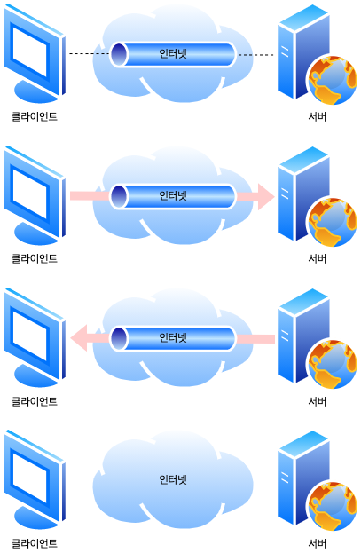

1. 브라우저가 서버로 TCP 커넥션을 생성합니다.
2. 브라우저가 서버로 HTTP 요청 메시지를 보냅니다.
3. 브라우저가 서버에서 온 HTTP 응답 메시지를 읽습니다.
4. 브라우저가 커넥션을 끊습니다.

### 4.1.1 신뢰할 수 있는 데이터 전송 통로인 TCP

HTTP 커넥션은 몇몇 사용 규칙을 제외하고는 TCP 커넥션에 불과합니다 TCP 커넥션은 인터넷을 안정적으로 연결해줍니다. 식속 정확하게 데이터를 보내고자 한다면 TCP의 기초적인 내용을 알아야 합니다. TCP는 HTTP에게 신뢰할 만한 통신 방식을 제공합니다. TCP 커넥션의 한쪽에 있는 바이트들은 반대쪽으로 순서에 맞게 전확히 전달됩니다.

### 4.1.2 TCP 스트림은 세그먼트로 나뉘어 패킷을 통해 전송됩니다.

TCP는 IP 패킷(혹은 IP 데이터그램)이라고 불리는 작은 조각을 통해 데이터를 전송합니다. HTTP는 **IP, TCP, HTTP**로 구성된 **프로토콜 스택**에서 최상위 계층입니다. HTTTP에 보안 기능을 더한 HTTPS는 TLS 혹은 SSL이라 불리기도하며 HTTP와 TCP 사이에 있는 **암호화**(Cryptographic Encryption) 계층입니다.

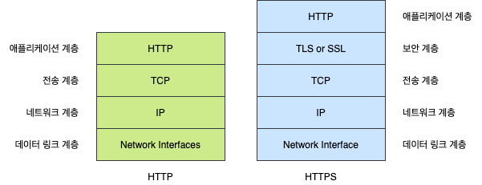

HTTP가 메시지를 전송하고자 할 경우, 현재 연결되어 잇는 TCP 커넥션을 통해서 메시지 데이터의 내용을 순서대로 보냅니다. TCP는 세그먼트라는 단위로 데이터 스트림을 잘게 나누고, 세그먼트를 IP 패킷이라고 불리는 봉투에 담아서 인터넷을 통해 데이터를 전달합니다. 이 모든 것은 TCP/IP 소프트웨어에 의해 처리되며, 그 과정은 HTTP 프로그래머에게 보이지 않습니다. IP 패킷들 각각은 다음을 포함합니다.

- IP 패킷 헤더 (보통 20바이트)
- TCP 세그먼트 헤더 (보통 20바이트)
- TCP 데이터 조각(0 혹은 그 이상의 바이트)

IP 헤더는 발신자와 목적지 IP 주소, 크기, 기타 플래그를 가집니다. TCP 세그먼트 헤더는 TCP 포트 번호, TCP 제어 플래그, 그리고 데이터의 순서와 무결성을 검사하기 위해 사용되는 숫자 값을 포함합니다.

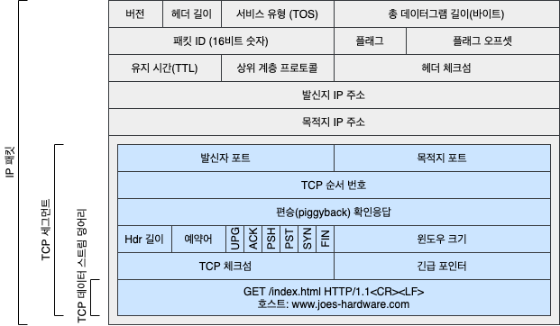

### 4.1.3 TCP 커넥션 유지하기

컴퓨터는 항상 TCP 커넥션을 여러 개 가지고 있습니다. TCP는 포트 번호를 통해서 이런 여러 개의 커넥션을 유지합니다. 포트 번호는 회사 직원의 내선 전화와 같습니다 회사의 대표 전화번호는 안내 데스크로 연결되고 내선 전화는 해당 직원으로 연결되듯이 IP 주소는 해당 컴퓨터에 연결되고 포트 번호는 해당 애플리케이션으로 연결됩니다. TCP 커넥션은 **발신자 IP 주소**, **발신자 포트**, **수신자 IP 주소**, **수신자 포트** 네 가지 값으로 식별합니다. 이 네가지 값으로 유일한 커넥션을 생성합니다 서로 다릊 두 개의 TCP 커넥션은 내가지 주소 구성요소 값이 모두 같을 수 없습니다.

### 4.1.4 TCP 소켓 프로그래밍

운영체제는 TCP 커넥션의 생성과 관련된 여러 기능을 제공합니다. 소켓 API는 HTTP 프로그래머에게 TCP와 IP의 세부사항들을 숨깁니다. 소켓 API는 유닉스 운영체제용으로 먼저 개발되었짐나, 지금은 소켓 API의 다양한 구현체들 덕분에 대부분의 운영체제와 프로그램 언어에서 이를 사용할 수 있습니다.

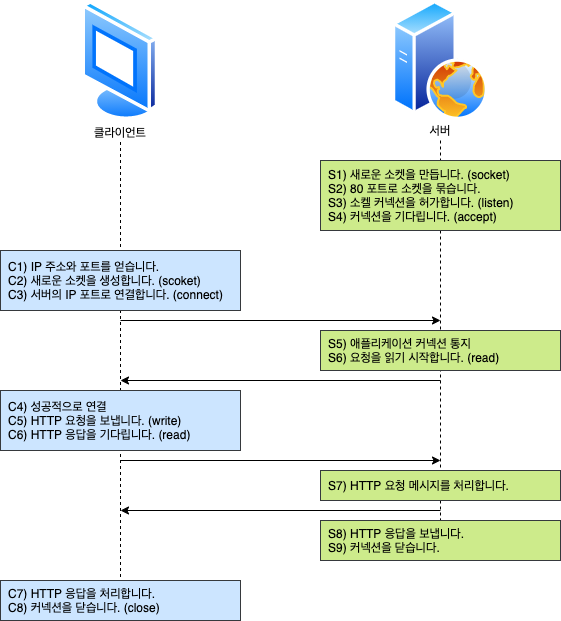

| 소켓 API 호출                  | 설명                                                       |
| ------------------------------ | ---------------------------------------------------------- |
| `s = socket(<parameters>)`     | 연결이 되지 않은 익명의 새로운 소켓 생성                   |
| `bind(s, <local IP:port>)`     | 소켓에 로컬 포트 번호와 인터페이스 할당                    |
| `connect(s, <remote IP:port>)` | 로컬의 소켓과 원격의 호스트 및 포트 사이에 TCP 커넥션 생성 |
| `listen(s, ...)`               | 커넥션을 받아들이기 위해 로컬 소켓에 허용함을 표시         |
| `s2 = accepts(s)`              | 누군가 로컬 포트에 커넥션을 맺기를 기다림                  |
| `n = read(s, buffer, n)`       | 소켓으로부터 버퍼에 n바이트 읽기 시도                      |
| `n = write(s, buffer, n)`      | 소켓으로부터 버퍼에 n바이트 쓰기 시도                      |
| `close(s)`                     | TCP 커넥션을 완전히 끊음                                   |
| `shutdown(s, <side>)`          | TCP 커넥션의 입출력만 닫음                                 |
| `getsockopt(s, ...)`           | 내부 소켓 설정 옵션값을 읽음                               |
| `setsockopt(s, ...)`           | 내부 소켓 설정 옵션값을 변경                               |

소켓 APi를 사용하면, TCP **종단**(Endpoint) 데이터 구조를 생성하고, 원격 서버의 TCP 종단에 그 종단 데이터 구조를 연결하여 데이터 스트림을 읽고 쓸 수 있습니다. TCP API는 기본적으로 네트워크 프로토콜 핸드셰이킹, 그리고 TCP 데이터 스트임과 IP 패킷 간의 분할 및 재조립에 대한 모든 세부사항을 외부로부터 숨깁니다.

## 4.2 TCP의 성능에 대한 고려

HTTP는 TCP 바로 위에 있는 계층이기 때문에 HTTP 트랜잭션의 성능은 그 아래 계층인 TCP 성능에 영향을 받습니다.

### 4.2.1 HTTP 트랜잭션 지연

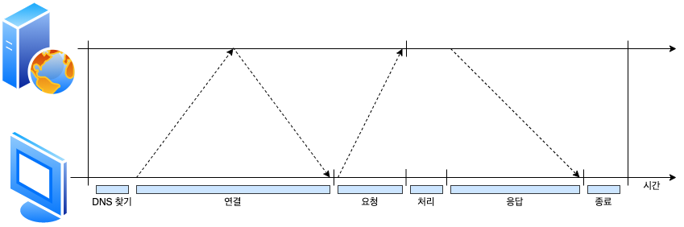

트랜잭션을 처리하는 시간은 TCP 커넥션을 설정하고, 요청을 전송하고, 응답 메시지를 보내는 것에 비하여 상당히 짧습니다. 클라이언트나 서버가 너무 많은 데이터를 내려받거나 복잡하고 동적인 자원들을 실행하지 않는 한, 대부분의 HTTP 지연은 TCP 네트워크 지연 떄문에 발생합니다. HTTP 트랜잭션을 지연시키는 원인은 여러 가지가 있습니다.

1. 클라이언트는 URI에서 웹 서버의 IP 주소와 포트 번호를 알아내야 합니다. 만약 URI에 기술되어 있는 호스트에 반문한 적이 최근에 없으면, **DNS 이름 분석**(DNS Resolution) 인프라를 사용하여 URI에 있는 호스트 명을 UP 주소로 변환하는데 수십 초의 시간이 걸릴 것입니다.
2. 다음으로, 클라이언트는 TCP 커넥션 요청을 서버에게 보내고 서버가 커넥션 허가 응답을 회신하기를 기다립니다. 커넥션 설정 시간은 새로운 TCP 커넥션에서 항상 발생합니다. 이는 보통 1~2초의 시간이 소요되지만, 수백 개의 HTTP 트랜잭션이 만들어지면 소요시간은 크게 증가할 것입니다.
3. 커넥션이 맺어지면 클라이언트는 HTTP 요청을 새로 생성된 TCP 파이프를 통해 전송합니다. 웹 서버는 데이터가 도착하는 대로 TCP 커넥션에서 요청 메시지를 읽고 처리합니다. 요청 메시지가 인터넷을 통해 전달되고 서버에 의해 처리되는데 까지는 시간이 소요됩니다.
4. 웹 서버가 HTTP 응답을 보내는 것 역시 시간이 소요됩니다.

이런 TCP 네트워크 지연은 하드웨어의 성능, 네트워크와 서버의 전송 속도, 요청과 응답 메시지의 크기, 클라이언트와 서버 간의 거리에 따라 크게 달라집니다. 또한 TCP 프로토콜의 기술적인 복잡성도 지연에 큰 영향을 끼칩니다.

### 4.2.2 TCP 커넥션 핸드셰이크 지연

어떤 데이터를 전송하든 새로운 TCP 커넥션을 열 때면, TCP 소프트웨어는 커넥션을 맺기 위한 조건을 맞추기 위해 연속으로 IP 패킷을 교환합니다. 작은 크기의 데이터 전송에 커넥션이 사용된다면 이런 패킷 교환은 HTTP 성능을 크게 저하시킬 수 있습니다.


1. 클라이언트는 새로운 TCP 커넥션을 생성하기 위해 작은 TCP 패킷(보통 40~60바이트)을 서버에게 보냅니다. 그 패킷은 **SYN**이라는 특별한 플래그를 가지는데, 이 요청이 커넥션 생성 요청이라는 듯입니다.
2. 서버가 그 커넥션을 받으면 몇 가지 커넥션 매개변수를 산출하고, 커넥션 요청이 받아들여졌음을 의미하는 **SYN**과 **ACK** 플래그를 포함한 TCP 패킷을 클라이언트에게 보냅니다.
3. 마지막으로 클라이언트는 커넥션이 잘 맺어졌음을 알리기 위해서 서버에게 다시 확인응답 신호를 보냅니다. 오늘날의 TCP 클라이언트가 이 확인응답 패킷과 함께 데이터를 보낼 수 있습니다.

### 4.2.3 확인응답 지연

인터넷 자체가 패킷 전송을 완벽히 보장하지는 않기 때문에, TCP는 성공적인 데이터 전송을 보장하기 위해서 자체적인 확인 체계를 가집니다. 각 TCP 세그먼트는 순번과 데이터 무결성 체크섬을 가집니다. 각 세그먼트의 수신자는 세그먼트를 온전히 받으면 작은 확인응답 해킷을 송신자에게 반환합니다. 만약 송신자가 특정 시간 안에 확인응답 메시지를 받지 못하면 패킷이 파기되었거나, 오류가 있는 것으로 판단하고 데이터를 다시 전송합니다.

확인응답은 그 크기가 작기 떄문에, TCP는 같은 방향으로 송출되는 데이터 패킷에 확인응답을 **편승**(Piggyback) 시킵니다. TCP는 송출 데이터 패킷과 확인응답을 하나로 묶음으로써 네트워크를 좀 더 효율적으로 사용합니다. 확인응답이 같은 방향으로 가는 데이터 패킷에 편승되는 경우를 늘리기 위해서, 많은 TCP 스택은 **확인응답 지연** 알고르즘을 구현합니다. 확인응답 지연은 송출할 확인응답을 특정 시간 동안 버퍼에 저장해 두고, 확인응답을 편승시키기 위한 송출 데이터 패킷을 찾습니다. 만약 일정 시간 안에 송출 데이터 패킷을 찾지 못하면 확인응답은 별도 패킷을 만들어 전송됩니다.

안타깝게도 요청과 응답 두 가지 형식으로만 이루어지는 HTTP 동작 방식은, 확인 응답이 송출 데이터 패킷에 편승할 기회를 감소시킵니다. 막상 편승할 패킷을 찾으려고 하면 해당 방향으로 송출될 패킷이 많지 않기 때문에, 확인응답 지연 알고리즘으로 인한 지연이 자주 발생합니다. 운영체제에 따라 다르지만, 지연의 원인이 되는 확인응답 지연 관련 기능을 수정하거나 비활성활할 수 있습니다.

TCP 스택에 있는 매개변수를 수정할 때는, 지금 무엇을 하고 있는지 항상 잘 알고 수정해야 합니다. TCP의 내부 알고리즘은 잘못 만들어진 애플리케이션으로부터 인터넷을 보호하도록 셀계되어 있습니다. TCP 설정을 수정하려고 한다면, TCP의 내부 알고리즘이 피하려고 하는 문제를 애플리케이션이 발생시키지 않을 것이라고 확신 할 수 있어야 합니다.

### 4.2.4 TCP 느린 시작(Slow Start)

TCP의 데이터 전송 속도는 TCP 커넥션이 만들어진 지 얼마나 지났는지에 따라 달라질 수 있습니다. TCP 커넥션은 시간이 지나면서 자체적으로 **튜닝**되어서, 처음에는 커넥션의 최대 속도를 제한하고 데이터가 성공적으로 전송됨에 따라서 속도 제한을 높여나갑니다. 이렇게 조율하는 것을 TCP 느린 시작이라고 부르며, 이는 인터넷의 급작스러운 부하와 혼잡을 방지하는 데 쓰입니다.

TCP 느린 시작은 TCP가 한 번에 전송할 수 있는 패킷의 수를 제한합니다. 간단히 말해서, 패킷이 성공적으로 전달되는 각 시점에 송신자는 추가로 2개의 패킷을 저 전송할 수 있는 권한을 얻습니다. HTTP 트랙잭션에서 전송할 데이터의 양이 많으면 모든 패킷을 한 번에 전송할 수 없습니다. 그 대신 한 개의 패킷만 전송하고 확인응답을 기다려야 합니다. 확인응답을 받으면 2개의 패킷을 보낼 수 있으며, 그 패킷 각각에 대한 확인응답을 받으면 총 4개의 패킷을 보낼 수 있게 됩니다. 이를 **혼잡 윈도를 연다**(Opening The Congestion Window)라고 합니다.

이 혼잡제어 기능 때문에, 새로운 커넥션은 이미 어느 정도 데이터를 주고받은 **튜닝**된 커넥션보다 느립니다. **튜닝**된 커넥션은 더 빠르기 떄문에, HTTP에는 이미 존재하는 커넥션을 재사용하는 기능이 있습니다.

### 4.2.5 네이글(Nagle)알고리즘과 TCP_NODELAY

애플리케이션이 어떤 크기의 데이터든지 TCP 스택으로 전송 할 수 있도록, TCP는 데이터 스트임 인터페이스를 제공합니다. 하지만 각 TCP 세그먼트는 40바이트 상당의 플래그 헤더를 포함하여 전송하기 떄문에, TCP가 작은 크기의 데이터를 포함한 많은 수의 패킷을 전송한다면 네트워크 성능은 크게 떨어집니다.

네이글 알고리즘은 네트워크 효율을 위해서, 패킷을 전송하기 전에 많은 양의 TCP 데이터를 한 개의 덩어리로 합칩니다. 네이글 알고리즘은 세그먼트가 최대 크기(패킷의 최대 크기는 LAN 상에서 1,500바이트 정도, 인터넷 상에서는 수백 바이트 정도입니다)가 되지 않으면 전송을 하지 않습니다. 다만 다른 모든 패킷이 확인응답을 받았을 경우에는 최대 크기보다 작은 패킷의 전송을 허락합니다. 다른 패킷들이 아직 전송 중이면 데이터는 버퍼에 저장됩니다. 전송되고 나서 확인응답을 기다리던 패킷이 확인응답을 받았거나 전송하기 충분할 만큼의 패킷이 쌓였을 때 버퍼에 저장되어 있던 데이터가 전송됩니다.

네이글 알고리즘은 HTTP 성능 관련해 여러 문제를 발생시킵니다. 첫 번째로, 크기가 작은 HTTP 메시지는 패킷을 채우지 못하기 떄문에, 앞으로 생길지 생기지 않을지 모르는 추가적인 데이터를 기다리며 지연될 것입니다. 두 번째로, 네이글 알고리즘은 확인응답 지연과 함께 쓰일 경우 형편없이 동작합니다. 네이글 알고리즘은 확인 응답이 도착할 떄까지 데이터를 전송을 멈추고 있는 반면, 확인응답 지연 알고리즘 확인응답을 100~200밀리초 지연시킵니다.

HTTP 애플리케이션은 성능 향상을 위해서 HTTP 스택에 TCP_NODELAY 파라미터 값을 설정하여 네이글 알고리즘을 비활성화하기도 합니다. 이 설정을 한다면, 작은 크기의 패킷이 너무 많이 생기지 않도록 큰 크기의 데이터 덩어리를 만들어야 합니다.

### 4.2.6 TIME_WAIT의 누적과 포트 고갈

TIME_WAIT 포트 고갈은 성능 측정 시에 심각한 성능 저하를 발생시키지만, 보통 실제 상황에서는 문제를 발생시키지 않습니다. 하지만 성능 측정을 하는 사람이라면, 결국에는 이 문제에 봉착하게 될 것이고 생각하지도 못했던 성능상의 문제가 생긴것으로 오해할 수 있으니 특별히 조심해야 합니다.

TCP 커넥션의 종단에서 TCP 커넥션을 끊으면, 종단에서는 커넥션의 IP 주소와 포트 번호를 메모리의 작은 **제어영역**(Control Block)에 기록해 놓습니다. 이 정보는 같은 주소와 포트 번호를 사용하는 새로운 TCP 커넥션이 일정 시간 동안에는 생성되지 않게 하기 위한 것으로, 보톤 세그먼트이 최대 생명주기에 두 배 정도(**2MSL**이라고 불리며 보통 2분 정도)의 시간 동안만 유지됩니다. 이는 이전 커넥션과 관련된 패킷이 그 커넥션과 같은 주소와 포트 번호를 가지는 새로운 커넥션에 삽입되는 문제를 방지합니다. 실제로 이 알고리즘은 특정 커넥션이 생성되고 닫힌 다음, 그와 같은 IP 주소와 포트 번호를 가지는 커넥션이 2분 이내에 또 생성되는 것을 막아줍니다.

현대의 빠른 라우터들 덕분에 커넥션이 닫힌 후에 중복되는 패킷이 생기는 경우는 거의 없어졌습니다. @MSL을 더 짧은 시간으로 수정하는 운영체제도 있지만, 이 값 수정은 조심해야 합니다. 만약 이전 커넥션의 패킷이 그 커넥션과 같은 연결 값으로 생성된 커넥션에 삽입되면, 패킷은 중복되고 TCP 데이터는 충돌할 것입니다.

일반적올 2MSL의 커넥션 종료 지연이 문자가 되지는 않지만, 성능시험을 하는 상황에서는 문제가 될 수 있습니다. 성능 측정 대상 서버는 클라이언트가 접속할 수 있는 IP 주소의 개수를 제한하고, 그 서버에 접속하여 부하를 발생시킬 컴퓨터의 수는 적기 때문입니다. 게다가 일반적으로 서버는 HTTP의 기본 TCP 포트인 80번을 사용합니다. 이런 상황에서는 가능한 연결의 조합이 제한되며, TIME_WAIT로 인해 서 순간순간 포트를 재활용하는 것이 불가능해집니다.

각각 한 개의 클라이언트와 웹 서버가 있고, TCP 커넥션을 맺기 위한 네 개의 값이 있다고 해봅니다. 이 중에서 세개는 고정되어 있고 반신지 포트만 변경할 수 있습니다.

```
<발신지 IP 주소, 발신지 포트, 목적지 IP 주소, 목적지 포트>
```

클라이언트가 서버에 접속할 댸마다, 유일한 커넥션을 생성하기 위해서 새로운 발신지 포트를 씁니다. 하지만 사용할 수 있는 발신지 포트의 수는 제한되어 있고(60,000개로 가정) 2MSL초 동안(120초로 가정) 커넥션이 재사용될 수 없으므로, 초당 500개(60,000 / 120 = 500)로 커넥션이 제한됩니다. 서버가 초당 500개 이상의 트랜잭션을 처리할 만큼 빠르지 않다면 TIME_WAIR 포트 고갈은 일어나지 않습니다. 이 문제를 해결하기 위해 부하를 생성하는 장비를 더 많이 사용하거나 클라이언트와 서버가 더 많은 커넥션을 맺을 수 있도록 여러 개의 가상 IP 주소를 쓸 수도 있습니다.

포트 고갈 문제를 겪지 않더라도, 커넥션을 너무 많이 맺거나 대기 상태로 있는 제어 블록이 너무 많아지는 상황은 주의해야 합니다. 커넥션이나 제어 블록이 너무 많이 생기면 극심하게 느려지는 운영체제도 있습니다.

## 4. HTTP 커넥션 관리

### 4.3.1 흔히 잘목 이해하는 Connection 헤더

HTTP 는 클라이언트와 서버 사이에 프락시 서버, 캐시 서버 등과 같은 중개 서버가 놓이는 것을 허락합니다. HTTP 메시지는 클라이언트에서 서버(혹은 리버스 서버)까지 중개 서버들을 하나하나 거치면서 전달됩니다. 어떤 경우에는 두 개의 인접한 HTTP 애플리케이션이 현재 맺고 있는 커넥션에만 적용될 옵션을 지정해야 할 때가 있습니다. HTTP Connection 헤더 필드는 커넥션 토큰을 쉼표로 구분하여 가지고 있으며, 그 값들은 다른 커넥션에 전달되지 않습니다. Connection 헤더에는 다음 세 가지 종류의 토큰이 전달될 수 있기 때문에 다소 혼란스러울 수 있습니다.

- HTTP 헤더 필드 명은, 이 커넥션에만 해당되는 헤더들을 나열합니다.
- 임시적인 토큰 값은, 커넥션에 대한 비표준 옵션을 의미합니다.
- close 값은, 커넥션이 작업이 완료되면 종료되어야 함을 의미합니다.

커넥션 토큰이 HTTP 헤더 필드 명을 가지고 있으면, 해당 필드들은 현재 커넥션만을 위한 정보이므로 다음 커넥션에 전달하면 안 됩니다. Connection 헤더에 있는 모든 헤더 필드는 메시지를 다른 곳으로 전달하는 시점에 삭제되어야 합니다. Connection 헤더에는 **홉별**(Hop-By-Hop) 헤더 명을 기술하는데, 이것을 **헤더 보호하기**라고 합니다. Connection 헤더에 명시된 헤더들이 전달되는 것을 방지하기 때문입니다.

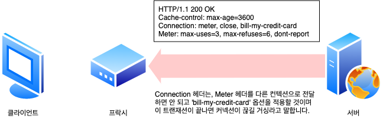

HTTP 애플리케이션이 Connection 헤더와 함께 메시지를 전달받으면, 수신자는 송신자에게 온 요청에 기술되어 있는 모든 옵션을 적용합니다. 그리고 다음 **홉**(Hop)에 메시지를 전달하기 전에 Connection 헤더와 Connection 헤더에 기술되어 있던 모든 헤더를 삭제합니다. 또한, Connection 헤더에 기술되어 있지는 않더라도, 홉별 헤더인 것들도 있습니다. 예를 들면 Proxy-Authenticate, Proxy-Connection, Transfer-Encoding, Upgrade 같은 것입니다.

### 4.3.2 순차적인 트랜재션 처리에 의한 지연

커넥션 관리가 제대로 이루어지지 않으면 TCP 성능이 매우 안 좋아질 수 있습니다. 각 트랜잭션이 새로운 커넥션을 필요로 한다면, 커넥션을 맺는데 발생하는 지연과 함께 느린 시작 지연이 발생할 것입니다.

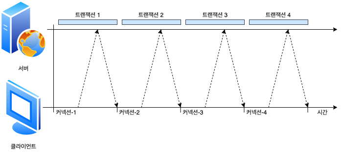

순차적인 처리로 인한 지연에는 물리적인 지연뿐 아니라, 하나의 이미지를 내려받고 잇는 중에는 웹페이지의 나머지 공간에 아무런 변화가 없어서 느껴지는 심리적인 지연도 있습니다. 사용자는 여러 개의 이미지가 동시에 로드되는 것을 더 좋아합니다. 순차적으로 로드하는 방식의 또 하나의 단점은, 특정 브라우저의 경우 객체를 화면에 배치하려면 객체의 크기를 알아야 하기 때문에, 모든 객체를 내려받기 전까지는 텅 빈 화면을 보여준다는 것입니다. 이 경우 브라우저는 객체들을 연속해서 하나씩 내려받는 것이 효율적이겠으나, 사용자는 어덯게 진행되고 잇는지 모르는 상태로 흰색의 텅 빈 화면만 보게 됩니다. HTTP 커넥션의 성능을 향상시킬 수 잇는 여러 최신 기술이 있습니다. 이제 그런 기술 네 가지에 대해 알아봅니다.

## 4.4 병렬 커넥션

HTTP 클라이언트가 여러 개의 커넥션을 맺음으로서 여러 개의 HTTP 트랜잭션을 병렬로 처리할 수 있게 합니다.

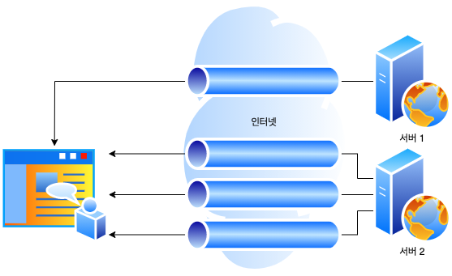

### 4.4.1 병렬 커넥션은 페이지를 더 빠르게 내려받습니다.

단일 커넥션의 대역폭 제한과 커넥션이 동작하지 않고 있는 시간을 활용하면, 객체가 여러 개 있는 웹페이지를 더 빠르게 내려받을 수 있을 것입니다. 하나의 커넥션으로 객체들을 로드할 때의 대역폭 제한과 시간을 줄일 수 있다면 더 빠르게 로드할 수 있을 것입니다. 각 커넥션의 지연 시간을 겹치게 하면 총 지연 시간을 줄일 수 있고, 클라이언트의 인터넷 대역폭을 한 개의 커넥션이 다 써버리는 것이 아니라면 나버지 객체를 내려받는 데에 남은 대역폭을 사용할 수 있습니다.

### 4.4.2 병렬 커넥션이 항상 더 빠르지는 않습니다.

병렬 커넥션이 일반적으로 더 빠르기는 하지만, 항상 그렇지는 않습니다. 클라이언트의 네트워크 대역폭이 좁을 때는 대부분 시간을 데이터를 전송하는 데만 쓸 것입니다. 여러 개의 객체를 병렬로 내려받는 경우, 이 제한된 대역폭 내에서 각 객체를 전송받는 것은 느리기 때문에 성능상의 장점은 거의 없어집니다.

또한 다수의 커넥션은 메모리를 많이 소모하고 자체적인 성능 문제를 발생시킵니다. 복잡한 웹페이지는 수십 개에서 수 백 개의 객체를 포함합니다. 클라이언트가 수백개의 커넥션을 열 수도 있겠지만, 서버는 다른 여러 사용자의 요청도 함께 처리해야 하기 때문에 수백 개의 커넥션을 호용하는 경우는 드뭅니다. 브라우저는 실제로 병렬 커넥션을 사용하기는 하지만 적은 수의 병렬 커넥션만을 허용합니다. 서버는 특정 클라이언트로부터 과도한 수의 커넥션이 맺어졌을 경우, 그것을 임의로 끊어버릴 수 있습니다.

### 4.2.3 병렬 커넥션은 더 빠르게 느껴질 수 있습니다.

병렬 커넥션이 페이지를 항상 더 빠르게 로드하지는 않습니다. 병렬 커넥션이 실제로 페이지를 더 빠르게 내려받는 것은 아니지만, 화면에 여러 개의 객체가 동시에 보이면서 내려받고 있는 상황을 볼 수 있기 때문에 사용자는 더 바르게 내려받고 있는 것처럼 느낄 수 있습니다. 사실 사람들은 페이지의 총 다운로드 시간이 더 걸린다 하더라도, 화면 전체에서 여러 작업이 일어나는 것을 눈으로 확인할 수 있으면 그 것을 더 빠르다고 여깁니다.

## 4.5 지속 커넥션

웹 클라이언트는 보통 같은 사이트에 여러 개의 커넥션을 맺습니다. 서버에 HTTP 요청을 하기 시작한 애플리케이션은 웹페이지 내의 리소스를 가져오기 위해서 그 서버에 또 요청하게 될 것입니다. 이 속성을 사이트 **지역성**(Site Locality)라 부릅니다.

따라서 HTTP/1.1을 지원하는 기기는 처리가 완료된 후에도 TCP 커넥션을 유지하여 앞으로 있을 HTTP 요청에 재사용할 수 있습니다. 처리가 완료된 후에도 계속 연결된 상태로 있는 TCP 커넥션을 지속 커넥션이라고 부릅니다. 비지속 커넥션은 각 처리가 끝날 때마다 커넥션을 끊지만, 지속 커넥션은 클라이언트나 서버가 커넥션을 끊기 전까지는 트랜잭션 간에도 커넥션을 유지합니다. 해당 서버에 이미 맺어져 있는 지속 커넥션을 재사용함으로써, 커넥션을 맺기 위한 준비작업에 따르는 시간을 절약할 수 있습니다. 게다가 이미 맺어져 있는 커넥션은 TCP의 느린 시작으로 인한 지연을 피함으로써 더 빠르게 데이터를 전송할 수 있습니다.

### 4.5.1 지속 커넥션 vs 병렬 커넥션

앞서 봤듯이, 병렬 커넥션은 여러 객체가 있는 페이지를 더 빠르게 전송합니다. 하지만 병렬 커넥션에는 다음과 같은 몇 가지 단점이 있습니다.

- 각 트랜젝션마다 새로운 커넥션을 맺고 끊기 때문에 시간과 대역폭이 소요됩니다.
- 각각의 새로운 커넥션은 TCP 느린 시작 때문에 성능이 떨어집니다.
- 시제로 연결할 수 있는 병렬 커넥션의 수에는 제한이 있습니다.

지속 커넥션은 병렬 커넥션에 비해 몇 가지 장점이 있습니다. 커넥션을 맺기 위한 사잔 작업과 지연을 줄여주고, 튜닝된 커넥션을 유지하며, 커넥션의 수를 줄여줍니다. 하지만 지속 커넥션을 잘못 관리할 경우, 곘고 연결된 상태로 잇는 수많은 커넥션이 쌀이게 될 것입니다. 이는 로컬의 리소스 그리고 원격의 클라이언트와 서버의 리소스에 불필요한 소모를 발생시킵니다.

지속 커넥션은 병렬 커넥션과 함께 사용될 때에 가장 효과적입니다. 오늘날 웹 애플리케이션은 적은 수의 병렬 커넥션만을 맺고 그것을 유지합니다. 두 가지 지속 커넥션 타입이 잇는데, HTTP/1.0에는 **keep-alive** 커넥션이 있고 HTTP/1.1에는 **지속** 커넥션이 있습니다.

### 4.5.2 HTTP/1.0+의 Keep-Alive 커넥션

많은 HTTP/1.0 브라우저와 서버들은 일찍부터 다소 실험적이었던 keep-alive 커넥션이라는 지속 커넥션을 지원하기 위해 확장되었습니다. 이 초기의 지속 커넥션은 상호 운용과 관련된 설계에 문제가 있었지만, 아직 많은 클라이언트와 서버는 이 초기 keep-alive 커넥션을 사용하고 있습니다. 그리고 그 설계상의 문제는 HTTP/1.1에서 수정되었습니다. keep-alive 커넥션의 성능상의 장점은 커넥션을 맺고 끊는 데 필요한 작업이 없어서 시간이 단축되는 것입니다.

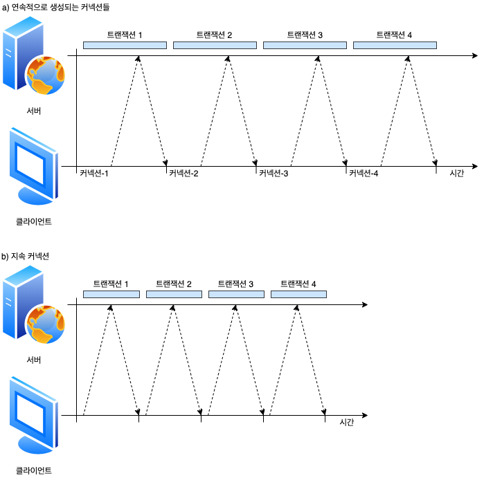

### 4.5.3 Keep-Alive 동작

keep-alive는 사용하지 않기로 결정되어 HTTP/1.1 명세에서 빠졌습니다. 하지만 아직도 브라우저와 서버 간에 keep-alive 핸드셰이크가 널리 사용되고 있기 때문에, HTTP 애플리케이션은 그것을 처리할 수 있게 개발해야 합니다. HTTP/1.0 keep-alive 커넥션을 구현할 클라이언트는 커넥션을 유지하기 위해서 요청에 `Connection: Keep-Alive` 헤더를 포함시킵니다. 이 요청을 받은 서버는 그다음 요청도 이 커넥션을 통해 받고자 한다면, 응답 메시지에 같은 헤더를 포함시켜 응답합니다. 응답에 `Connection: Keep-Alive` 헤더가 없으면, 클라이언트는 서버가 keep-alive`를 지원하지 않으며, 응답 메시지가 전송되고 나면 서버 커넥션을 끊을 것이라 추정합니다.

### 4.5.4 Keep-Alive 옵션

Keep-Alive 헤더는 커넥션을 유지하기를 바라는 요청일 뿐입니다. 클라이언트나 서버가 keep-alive 요청을 받았다고 해서 무조건 그것을 따를 필요는 없습니다. 언제든지 현재의 keep-alive 커넥션을 끊을 수 있으며 keep-alive 커넥션에서 처리되는 트랜잭션의 수를 제한할 수도 있습니다. keep-alive의 종닥은 Keep-Alive 헤더의 쉼표로 구분된 옵션들로 제어할 수 있습니다.

- **timeour 파라미터**: Keep-Alive 응답 헤더를 통해 보닙니다. 이는 커넥션이 얼마간 유지될 것인지를 의미하빈다. 하지만 이대로 동작한다는 보장은 없습니다.
- **max 파아미터**: Keep-Alive 응답 헤더를 통해 보냅니다. 이는 커넥션이 몇 개의 HTTP 트랜잭션을 처리할 떄까지 유지될 것인지를 의미합니다. 하지만 이대로 동작한다는 보장은 없습니다.
- Keep-Alive 헤더는 진단이나 디버깅을 주목적으로 하는, 처리되지는 않는 임의의 속성들을 지원하기도 합니다. 그 문법은 `이름[=값]` 같은 식입니다.

Keep-Alive 헤더 사용은 선택 사항이지만, `Connection: Keep-Alive` 헤더가 있을 때만 사용할 수 있습니다. 다음 예는 서버가 약 5개의 추가 트랜잭션이 처리될 동안 커넥션을 유지하거나, 2분 동안 커넥션을 유지하라는 내용의 Keep-Alive 응답 헤더입니다.

```
Connection: Keep-Alive
Keep-Alive: max=5, timeout=120
```

### 4.5.5 Keep-Alive 커넥션 제한과 규칙

- keep-alive는 HTTP/1.0에서 기본으로 사용되지는 않습니다. 클라이언트는 keep-alive 커넥션을 사용하기 위해 `Connection: Keep-Alive` 요청 헤더를 보내야 합니다.
- 커넥션을 계속 유지하려면 모든 메시지에 `Connection-Alive` 헤더를 보내야 합니다. 만약 클라이언트가 `Connection: Keep-Alive` 헤더를 보내지 않으면 서버는 요청을 처리한 후 커넥션을 끊을 것입니다.
- 클라이언트는 `Connection: Keep-Alive` 응답 헤더가 없는 것을 보고 서버가 응답 후에 커넥션을 끊을 것임을 알 수 있습니다.
- 커넥션이 끊어지기 전에 엔터티 본문의 길이를 알 수 있어야 커넥션을 유지할 수 있습니다. 이 말은 엔터티 본문이 정확한 Content-Length 값과 함께 **멀티파트 미디어 형식**(Multipart Media Type)을 가지거나 **청크 전송 인코딩**(Chunked Transfer Encoding)으로 인코드 되어야 함을 뜻합니다. keep-alive 커넥션에서 잘못된 Content-Length 값을 보내는 것은 좋지 않은데, 트랜잭션이 끝나느 시점에 기존 메시지의 끝과 새로운 메시지의 시작점을 정확히 알 수 없기 때문입니다.
- 프락시와 게이트웨이 Connection 헤더의 규칙을 철저히 지켜야 합니다. 프라시와 게이트웨이는 메시지를 전달하거나 캐시에 넣기 전에 Connection 헤더에 명시된 모든 헤더 필드와 Connection 헤더를 저거해야 합니다.
- 정석대로라면 keep-alive 커넥션은 Connection 헤더를 인식하지 못하는 프락시 서버와 맺어지면 안 됩니다. 이는 뒤에서 설명할 멍청한(dumb) 프락시로 인해 발생할 문제를 예방하기 위한 것이지만, 현실적으로 그것이 쉽진 않습니다.
- 기술적으로 HTTP/1.0을 따르는 기기로부터 받는 모든 Connection 헤더 필든는 무시해야 합니다. 오래된 프락시 서버로부터 실수로 전달될 수 있기 때문입니다. 실제로, 어던 클라이언트나 서버는 오래된 프락시에 행(hang)이 걸릴 수 잇는 위험이 있음에도 이 규칙을 지키지 않기도 합니다.
- 클라이언트는 응답 전체를 모두 받기 전에 커넥션이 끊어졌을 경우, 별다른 문제가 없으면 요청을 다시 보낼 수 잇게 준비되어 있어야 합니다. 그렇지 않으면 요청이 반복될 경우 문제가 발생할 수 있습니다.

### 4.5.6 Keep-Alive와 멍청한(dumb) 프락시

#### Connection 헤더의 무조건 전달

문제는 프락시에서 시작되는데, 프락시는 Connection 헤더를 이해하지 못해서 해당 헤더들을 삭제하지 않고 요청 그대로 다음 프락시에 전달합니다. 오래되고 단순한 수많은 프락시들이 Connection 헤더에 대한 처리 없이 요청을 그대로 전달합니다. 하지만 Connection 헤더는 **홉별**(Hop-By-Hop) 헤더입니다. 여기서부터 문제가 시작됩니다.

웹 서버가 프락시로부터 `Connection: Keep-Alive` 헤더를 받으면, 웹 서버는 프락시가 커넥션을 유지하자고 요청하는 것으로 잘못 판단하게 됩니다. 웹 서버는 문제될 게 없으면 프락시와 커넥션을 유지하는 것에 동의를 하고 `Connection: Keep-Alive` 헤더를 포함하여 응답합니다. 웹 서버는 프라시와 keep-alive 커넥션이 맺어져 있는 상태로 keep-alive 규칙에 맞게 통신을 하는 것으로 판단합니다. 프락시는 서버로부터 받은 `Connection: Keep-Alive` 헤더를 포함하고 잇는 응답 메시지를 클라이언트에게 전달합니다. 클라이언트는 이 헤더를 통해 프락시가 커넥션을 유지하는 것에 동의했다고 추정합니다. 이 시점에 클라이언트와 서버는 커넥션을 유지하고 있다고 생각합니다. 하지만 정작 프락시는 keep-alive를 전혀 이해하지 못합니다.

프락시는 keep-alive를 전혀 모르지만, 받았던 모든 데이터를 그대로 클라이언트에게 전달하고 나서 서버가 커넥션을 끊기를 기다립니다. 하지만 서버는 프락시가 자신에게 커넥션을 유지하기를 요청한 것으로 알고 잇기 땜누에 커넥션을 끊지 않습니다. 따라서 프락시는 커넥션이 끊어지기 전까지는 계속 커넥션이 끊어지기를 기다리게 됩니다. 클라이언트가 응답 메시지를 받으면, 다음 요청을 보내기 시작하는데-, 커넥션이 유지되고 잇는 파릭시에 그 요청을 보냅니다. 프락시는 같은 커넥션상에서 다른 요청이 오는 경우는 예상하지 못하기 때문에, 그 요청은 프락시로부터 무시되고 브라우저는 아무런 응답 없이 로드 중 이라는 표시만 나옵니다.

#### 프락시와 홉별 헤더

이런 종류의 잘못된 통신을 피하려면, 프락시는 Connection 헤더와 Connection 헤더에 명시된 헤더들을 절대 전달하면 안 됩니다. 따라서 프락시가 `Connectionn: Keep-Alive` 헤더를 받으면 Connection 헤더뿐안 아니라 Keep-Alive란 이름의 헤더도 전달하면 안됩니다. 또한, Connection 헤더의 값으로 명시되지 않는 Proxy-Authenticate, Proxy-Connection, Transfer-Encoding, Upgrade와 같은 홉별 헤더들 역시 전달하거나 캐시하면 안 됩니다.

### 4.5.7 Proxyt-Connection 살펴보기

넥스케이프의 브라우저 및 프락시 개발자들은 모든 웹 애플리케이션이 HTTP 최신 버전을 주언하지 않아도, 모든 헤더를 무조건 전달하는 문제를 해결할 수 있는 기발한 차선책을 제시했습니다. 그 차선책은, 클라이언트의 요청이 중개서버를 통해 이어지는 경우 모든 헤더를 무저건 전달하는 문제를 해결하기 위해 Proxy-Connection이라는 헤더를 사용하는 것입니다 (하지만 모든 상황에서 동작하지는 않습니다). Proxy-Connection은 프락시를 별도로 설정할 수 잇는 현대의 브라우저들에서 지원하고 있으며, 많은 프락시들도 이것을 인식합니다.

넷스케이프는 멍청한 프락시 문제를 해결하기 위해 브라우저에서 일반적으로 전달하는 Connection 헤더 대신에 비표준인 Proxy-Connection 확장 헤더를 프락시에게 전달합니다. 프락시가 Proxy-Connection 헤더를 무조건 전달하더라도 웹 서버는 그것을 무시하기 때문에 별문제가 되지 않습니다. 하지만 영리한 프락시(지속 커넥션 핸드셰이킹을 이해할 수 있는)라면, 의미 없는 Proxy-Connection 헤더를 Connection 헤더로 바꿈으로써 원하던 효과를 얻게 됩니다.

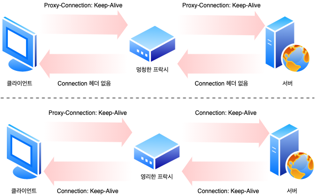

이 ㅂ아식은 클라이언트와 서버 사이에 한 개의 프락시만 있는 경우에서만 동작합니다. 하지만 멍청한 프락시의 양옆에 열리한 프락시가 있다면 잘못된 헤더를 만들어내는 문제가 다시 발생합니다. 게다 문제를 발생시키는 프락시들은 방화벽, 캐시 서버, 혹은 리버스 프락시 서버 가속기와 같이 네트워크상에서 **보이지 않는** 경우가 많습니다. 블라우저는 이러한 기기들을 볼 수 없으므로 Proxy-Connection 헤더를 보내지 못합니다. 보이지 않는 웹 애플리케이션들이 지속 커넥션을 명확히 구현하는 것은 중요합니다.

### 4.5.8 HTTP/1.1의 지속 커넥션

HTTP/1.1에서는 keep-alive 커넥션을 지원하지 않는 대신, 설계가 더 개선된 지속 커넥션을 지원합니다. 지속 커넥션의 목적은 keep-alive 커넥션과 같지만 그에 비해 더 잘 동작하빈다. HTTTP/1.0의 keep-alive 커넥션과 달리 HTTP/1.1의 지속 커넥션은 기본으로 활성화되어 있습니다. HTTP/1.1에서는 별도 설정을 하지 않는 한, 모든 커넥션을 지속 커넥션으로 취급합니다. HTTP/1.1 애플리케이션은 트랜잭션이 끝나 ㄴ다음 커넥션을 끊으려면 `Connection: close` 헤더를 명시해야 합니다. 이는 keep-alive 커넥션이 선택 사항이 아닐 뿐만 아니라 지원 자체를 하지 않는다는 점에서 이전 HTTP 프로토콜과는 크게 다릅니다.

HTTP/1.1 클라이너트는 응답에 `Connection: close` 헤더가 업으면 응답 후에도 HTTP/1.1 커넥션을 계속 유지하자는 것으로 추정합니다. 하지만 클라이언트와 서버는 언제든지 커넥션을 끊을 수 있습니다. `Connection: close`를 보내지 않는 것이 서버가 커넥션을 영원히 유지하겠다는 것을 뜻하지는 않습니다.

### 4.5.9 지속 커넥션의 제한과 규칙

- 클라이언트가 요청에 `Connection: close` 헤더를 포함해 보냈으면, 클라이언트는 그 커넥션으로 추가적인 요청을 보낼 수 없습니다.
- 클라이언트가 해당 커넥션으로 추가적인 요청을 보내지 않을 것이라면, 마지막 요청에 `Connection: close` 헤더를 보내야 합니다.
- 커넥션에 있는 모든 메시지가 자신의 길이 정보를 정확히 가지고 있을 때에만 커넥션을 지속시킬 수 있스빈다. 예를 들어 엔터티 본문은 정확한 Content-Length 값을 가지거나 **청크 전송 인코딩**(Chunked Transfer Encoding)으로 인코드 되어 있어야 합니다.
- HTTP/1.1 프락시는 클라이언트와 서버 각각에 대해 별도의 지속 커넥션을 맺고 관리해야 합니다.
- HTTP/1.1 프락시 서버는 클라이언트가 커넥션 관련 기능에 대한 클라이언트의 지원 범위를 알고 있지 않은 한 지속 커넥션을 맺으면 안 됩니다. 앞서 설명했듯이 오래된 프락시가 Connection 헤더를 전달하는 문제가 발생할 수 있기 때문입니다. 현실적으로 쉽지는 않으며, 많은 벤더가 이 규칙을 지키지 않습니다.
- 서버는 메시지를 전송하는 중간에 커넥션을 끊지 않을 것이고 커넥션을 끊기 전에 적어도 한 개의 요청에 대해 응답을 할 것이긴 하지만, HTTP/1.1 기기는 Connection 헤더의 값과는 상관없이 언제든지 커넥션을 끊을 수 있습니다.
- HTTP/1.1 애플리케이션은 중간에 끊어지는 커넥션을 복구할 수 있어야만 합니다. 클라이언트는 다시 보내도 문제가 없는 요청이라면 가능한 한 다시 보내야 합니다.
- 클라이언트는 전체 응답을 받기 전에 커넥션이 끊어지면, 요청을 반복해서 보내도 문제가 없는 경우에도 요청을 다시 보낼 준비가 되어 있어야 합니다.
- 하나의 사용자 클라이언트는 서버의 과부하를 방지하기 위해서, 넉넉잡아 두 개의 지속 커넥션만을 유지해야 합니다. 따라서 N명의 사용자가 서버로 접근하려 한다면, 프락시는 서버나 상위 프락시에 넉넉잡아 2N개의 커넥셔을 유지해야 합니다.

## 4.6 파이프라인 커넥션

HTTP/1.1은 지속 커넥션을 통해서 요청을 파이프라이닝할 수 있습니다. 이는 keep-alive 커넥션의 성능을 더 높여줍니다. 여러 개의 요청은 응답이 도착하기 전까지 큐에 쌓입니다. 첫 번째 요청이 네트워크를 통해 지구 반대편에 있는 서버로 전달되면, 거이에 이어 두 번째 세 번째 요청이 전달될 수 있습니다. 이는 대기 시간이 긴 네트워크 상황에 네트워크상의 왕복으로 인한 시간을 줄여서 성능을 높여줍니다. 파이프라인에는 여러 가지 제약 사항이 있습니다.

- HTTP 클라이언트는 커넥션이 지속 커넥션인지 확인하기 전까지는 파이프라인을 이어서는 안 됩니다.
- HTTP 응답을 요청 순서와 같게 와야 합니다. HTTP 메시지는 순번이 매겨져 있지 않아서 응답이 순서 없이 오면 순서에 맞게 정렬시킬 방법이 없습니다.
- HTTP 클라이언트는 커넥션이 언제 끊어지더라도, 완료되지 않은 요청이 파이프라인에 있으면 언제든 다시 요청을 보낼 준비가 되어 있어야 합니다. 클라이언트가 지속 커넥션을 맺고 나서 바로 10개의 요청을 보낸다고 하더라도 서버는 5개의 요청만 처리하고 커넥션을 임의로 끊을 수 있습니다. 남은 5개의 요청은 실패할 것이고 클라이언트는 예상치 못하게 끊긴 커넥션을 다시 맺고 요청을 보낼 수 있어야 합니다.
- HTTP 클라이언트는 POST 요청같이 반복해서 보낼 경우 문제가 생기는 요청은 파이프라인을 통해 보내면 안됩니다. 에러가 발생하면 파이프라인을 통한 요청 중에 어떤 것들이 서버에서 처리되었는지 클라이언트가 알 방법이 없습니다. POST와 같은 **비멱등**(Nonidempotent) 요청을 재차 보내면 문제가 생길 수 있기 때문에, 문제가 있는 상황에서 그런 위험한 메서드로 요청을 보내서는 안됩니다.

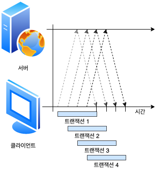

## 4.7 커넥션 끊기에 대한 미스터리

커넥션 관리에는 명확한 기준이 없습니다. 이 이슈는 수많은 개발자가 알고 있는 것보다 더 미묘하며, 그에 관한 기술 문서도 별로 없습니다.

### 4.7.1 마음대로 커넥션 끊기

어떠한 HTTP 클라이어트, 서버, 혹은 프락시든 언제든지 TCP 전송 커넥션을 끊을 수 있습니다. 보통 커넥션은 메시지를 다 보낸 다음 끊지만, 에러가 있는 상황에서는 헤더의 중간이나 다른 엉뚱한 곳에서 끊길 수 있습니다. 이 상황은 파이프라인 지속 커넥션에서와 같습니다. HTTP 애플리케이션은 언제든지 지속 커넥션을 임의로 귾을 수 있습니다. 예를 들어, 지속 커넥션이 일정 시간 동안 요청을 전송하지 않고 유휴 상태에 있으면 서버는 그 커넥션을 끊을 수 있습니다. 하지만 서버가 그 유휴상태에 있는 커넥션을 끊는 시점에, 서버는 클라이언트가 데이터를 전송하지 않을 것이라고 확신하지 못합니다. 만약 이 일이 벌어지면 클라이언트는 그 요청 메시지를 보내는 도중에 문제가 생깁니다.

### 4.7.2 Connwction-Length와 Truncation

각 HTTP 응답은 본문의 정확한 크기 값을 가지는 Content-Length 헤더를 가지고 있어야 하빈다. 일부 오래된 HTTP 서버는 자신이 커넥션을 끊으면 데이터 전송이 끝났음을 의미하는 형태로 개발되어 있기 때문에, Content-Length 헤더를 생략하거나 잘못된 길이 정보로 응답하는 경우도 있습니다.

클라이언트나 플락시가 커넥션이 끊어졌다는 HTTP 응답을 받은 후, 실제 전달된 엔터티의 길이와 Content-Length의 길이가 일치하지 않거나 Content-Length 자체가 존재하지 않으면 수신자는 데이터의 정확한 길이를 서버에게 물어봐야 합니다. 만약 수신자가 캐시 프락시일 경우 응답(잠재적인 에러가 복합적으로 발생하는 것을 최소화하기 위해)을 캐시하면 안 됩니다. 프락시는 Content-Length를 정정하려 하지 말고 메시지를 받은 그대로 전달해야 합니다.

### 4.7.3 커넥션 끊기의 허용, 재시도, 멱등성

커넥션은 심지어 에러가 없더라도 언제든지 끊을 수 있습니다. HTTP 애플리케이션은 예상치 못하게 커넥션이 끊어졌을 때에 적절히 대응할 수 있는 준비가 되어 있어야 합니다. 클라이언트가 트랜잭션을 수행 중에 전송 커넥션이 끊기게 되면, 클라이언트는 그 트랜잭션을 재시도 하더라도 문제가 없다면 커넥션을 다시 맺고 한 번 더 전송을 시도해야 합니다. 그 상황은 파이프라인 커넥션에서 좀 더 어려워집니다. 클라이언트는 여러 요청을 큐에 쌓아 놓을 수 있지만, 서버는 아직 처리되지 않고 스케줄이 조정되어야 하는 요청들을 남겨둔 채로 커넥션을 끊어버릴 수도 있습니다.

그로 이난 부작용들을 조심해야 합니다. 어떤 요청 데이터가 존송되었지만, 응답이 오기 전에 커넥션이 끊기면 클라이언트는 실제로 서버에서 얼마만큼 요청이 처리되었는지 전형 알 수 없습니다. 정적인 HTML 페이지를 GET 하는 부류의 요청들은 반복적으로 요청하더라도 결과적으로 아무런 영향을 끼치지 않습니다. 반면 온라인 서점에 주문을 POST 하는 부류의 요청들은 반복될 경우 주문이 여러 번 중복될 것이기 때문에 반복을 피해야 합니다.

한 번 혹은 여러 번 실행됐는지에 상관없이 같은 결과를 반환한다면 그 태랜잭션은 **맥등**(udempotent)하다고 합니다. GET, HEAD, PUT, DELETE, TRACE 그리고 OPTIONS 메서드들은 멱등하다고 이해하면 됩니다. 클라이언트는 POST와 같이 멱등이 아닌 요청은 파이프라인을 통해 요청하면 됩니다. 클라이언트는 POST와 같이 멱등이 아닌 요청은 파이프라인을 통해 요청하면 안 됩니다. 그렇지 않으면 전송 코넥션이 예상치 못하게 끊어져 버렸을 때, 알 수 없는 결과를 초래할 수 있습니다. 비멱등인 요청을 다시 보내야 한다면, 이전 요청에 대한 응답을 받을 때까지 기다려야 합니다.

비멱등인 메서드나 순서에 대해 에이전트가 요청을 다시 보낼 수 있도록 기능을 제공한다 하더라도, 자동을 재시도하면 안 됩니다. 예를 들어 대부분 브라우저는 캐시된 POST 요청 페이지를 다시 로드하려고 할 떄, 요청을 다시 보내기를 원하는지 묻는 대화상자를 보여줍니다.

### 4.7.4 우아한 커넥션 끊기

TCP 커넥션은 양방향입니다. TCP 커넥션의 양쪽에는 데이터를 읽거나 쓰기 위한 입력 큐와 출력 큐가 있습니다. 한쪽 출력 큐에 있는 데이터는 다른 쪽의 입력 큐에 보내집니다.

#### 전체 끊기와 절반 끊기

애플리케이션은 TCP 입력 채널과 출력 채널 중 한 개만 끊거나 둘 다 끊을 수 있습니다. `close()`를 호출하면 TCP 커넥션이 입력 채널과 출력 채널의 커넥션을 모두 끊습니다. 이를 **전체 끊기**라고 합니다. 입력 채널이나 출력 채널 중에 하나를 개별적으로 끊으려면 `shutdown()`을 호출하면 됩니다. 이를 **절반 끊기**라 고 부릅니다.

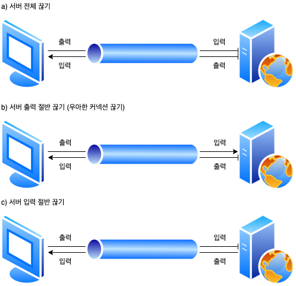

#### TCP 끊기와 리셋 에러

단순한 HTTP 애플리케이션은 전체 끊기만을 사용할 수 있습니다. 하지만 애프리케이션이 각기 다른 HTTP 클라이언트, 서버, 프라시와 통신할 때, 그리고 그들과 파이프라인 지속 커넥션을 사용할 때, 기기들이 예상하지 못한 쓰기 에러를 발생하는 것을 예방하기 위해 **절반 끊기**를 사용해야 합니다.

보통은 커넥션의 출력 채널을 끊는 것이 안전합니다. 커넥션의 반대편에 있는 기기는 모든 데이터를 버퍼로부터 읽고 나서 데이터 전송이 끝남과 동시에 당신이 커넥션을 끊었다는 것을 알게 될 것입니다. 클라이언트에서 더는 데이터를 보내지 않을 것임을 확실할 수 없는 이상, 커넥션의 입력 채널을 끊는 것은 위험합니다. 만약 클라이언트에서 이미 끊긴 입력 채널에 데이터를 전소앟면, 서버의 운영체제는 TCP `connection reset by peer` 메시지를 클라이언트에 보낼 것입니다. 대부분 운영체제는 이것을 심각한 에러로 취급하여 버퍼에 저장된, 아직 읽히지 않은 데이터를 모두 삭제합니다. 이러한 상황은 파이프라인 커넥션에서는 더 악화됩니다. 응답 데이터가 기기에 잘 도착하였어도 아직 읽히지 않은 버퍼에 있는 응답 데이터는 사라지게 됩니다.

#### 우아하게 커넥션 끊기

일반적으로 애플리케이션이 우아한 커넥션 끊기를 구현하는 것은 애플리케이션 자신의 출력 채널을 먼저 끊고 다른 쪽에 있는 기기의 출력 채널이 끊기는 것을 기다리는 것입니다. 양쪽에서 더는 데이터를 전송하지 않을 것이라고 알려주면, 커넥션은 리셋의 위험 없이 온전히 종료됩니다.

안타깝게도 상대방이 절반 끊기를 구현했다는 보장도 없고 절반 끊기를 했는지 검사해주는 보장도 없습니다. 따라서 커넥션을 우아하게 끊고자 하는 애플리케이션은 출력 채널에 절반 끊기를 하고 난 후에도 데이터나 스트림의 끝을 식별하기 위해 입력 채널에 대해 상태 검사를 주기적으로 해야 하빈다. 만약 입력 채널이 특정 타임아웃 시간 내에 끊어지지 않으면, 애플리케이션은 리소스를 보호하기 위해 커넥션을 강제로 끊을 수도 있습니다.
