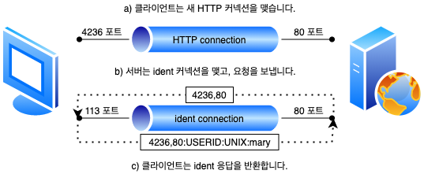
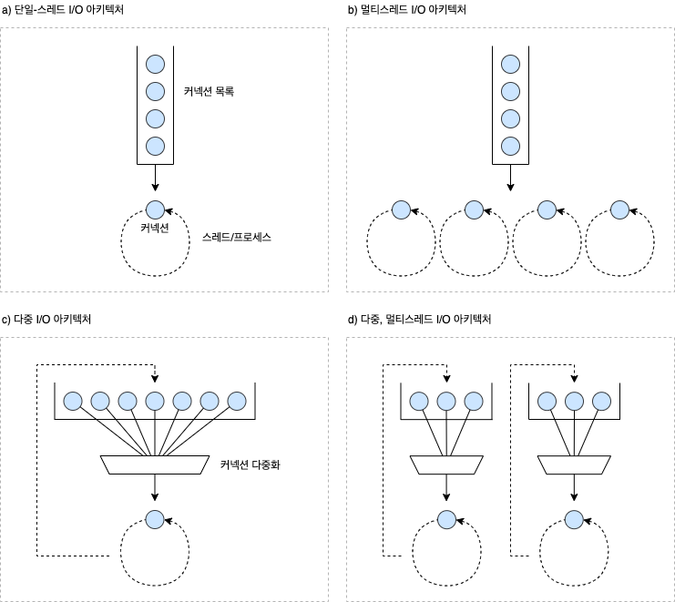

# 5. 웹 서버

## 5.1 다채로운 웹 서버

웹 서버는 HTTP 요청을 처리하고 응답을 제공합니다. **웹 서버**라는 용어는 웹 서버 소프트웨어와 웹페이지 제고엥 특화된 장비 양쪽 모두를 가리킵니다. 웹 서버는 기능, 형태, 크기가 다양합니다. 열 줄짜리 조그마한 펄 스크립트 웹 서버가 있는가 하면, 50메가바이트짜리 안전한 상용 엔진이 있고, 아주 작은 기판 위의 서버도 있습니다. 그러나 기능은 달라도, 모든 웹 서버는 리소스에 대한 HTTP 요청을 받아서 콘텐츠를 클라이언트에게 돌려줍니다.

### 5.1.1 웹 서버 구현

웹 서버는 HTTP 및 그와 관련된 TCP 처리를 구현한 것입니다. 우베 서버는 자신이 제공하는 리소스를 관리하고 웹 서버를 설정, 통제, 확장하기 위한 관리 기능을 제공합니다. 웹 서버는 HTTP 프로토콜을 구현하고, 웹 리소스를 관리하고, 웹 서버 관리 기능을 제공합니다. 웹 서버는 TCP 커넥션 관리에 대한 책임을 운영체제와 나눠 갖습니다. 운영체제는 컴퓨터 시스템의 하드웨어를 관리하고 TCP/IP 네트워크 지원, 웹 리소스를 유지하기 위한 파일 시스템, 현재 연산 활동을 제어하기 위한 프로세스 관리를 제공합니다. 웹 서버는 여러 가지 형태가 가능합니다.

### 5.1.2 다목적 소프트웨어 웹 서버

다목적 소프트웨어 웹 서버는 네트워크에 연결된 표준 컴퓨터 시스템에서 동작합니다. 아파치나 W3C의 직소 같은 오픈 소스 소프트웨어를 사용할 수도 있고, 마이크로소프트나 아이플래닛의 웹 서버 같은 상용 소프트웨어를 사용할 수도 있습니다. 웹 서버 소프트웨어는 거의 모든 컴퓨터와 운영체제에서 동작합니다.

### 5.1.3 임베디드 웹 서버

임베디드 웹 서버는 일반 소비자용 제품에 내장될 목적으로 만들어진 작은 웹 서버입니다. 임베디드 웹 서버는 사용자가 그들의 일반 소비자용 기기를 간편한 웹 브라우저 인터페이스로 관리할 수 있게 해줍니다. 몇몇 임베디드 웹 서버는 1제곱인치도 안 되는 크기로 구현되어 있고, 보통 최소한의 기능만을 제공합니다.

## 5.2 진짜 웹 서버가 하는 일

1. **커넥션을 맺습니다,** 클라이언트의 접속을 받아들이거나, 원치 않는 클라이언트라면 닫습니다.
2. **요청을 받습니다.** HTTP 요청 메시지를 네트워크로부터 읽어 들입니다.
3. **요청을 처리합니다.** 요청 메시지를 해석하고 행동을 취합니다.
4. **리소스에 접근합니다.** 메시지에서 지정한 리소스에 접근합니다.
5. **응답을 만듭니다.** 올바른 헤더를 포함한 HTTP 응답 메시지를 생성합니다.
6. **응답을 보냅니다.** 응답을 클라이언트에게 돌려줍니다.
7. **트랜잭션을 로그로 남깁니다.** 로그파일에 트랜잭션 완료에 대한 기록을 남깁니다.

## 5.3 단계 1: 클라이언트 커넥션 수락

클라이언트가 이미 서버에 대해 열려있는 지속적 커넥션을 갖고 있다면, 클라이언트는 요청을 보내기 위해 그 커넥션을 사용할 수 있습니다. 그렇지 않다면, 클라이너트는 서버에 대한 새 커넥션을 열 필요가 있습니다.

### 5.3.1 새 커넥션 다루기

클라이언트가 웹 서버에 TCP 커넥션을 요청하면, 웹 서비는 그 커넥션을 맺고 TCP 커넥션에서 IP 주소를 추출하여 커넥션 맞은편에 어떤 클라이언트가 있는지 확인합니다. 일단 새 커넥션이 맺어지고 받아들여지면, 서버는 새 커넥션을 커넥션 목록에 추가하고 커넥션에서 오가는 데이터를 지켜보기 위한 준비를 합니다.

웹 서버는 어떤 커넥션이든 마음대로 거절하거나 즉시 닫을 수 있습니다. 어떤 웹 서버들은 클라이언트의 IP 주소나 호스트 명이 인가되지 않거나 악의적이라고 알려진 것인 경우 커넥션을 닫습니다. 다른 신원 식별 기법 또한 사용될 수 있습니다.

### 5.3.2 클라이언트 호스트 명 식별

대부분의 웹 서버는 **역방향**(Revers DNS)를 사용해서 클라이언트의 IP 주소를 클라이언트 호스트 명으로 변환하도록 설정되어 있습니다. 웹 서버는 클라이언트 호스트 명을 구체적인 접근 제어와 로깅을 위해 사용할 수 있습니다. **호스트 명 룩업**(Hostname Lookup)은, 꽤 시간이 많이 걸릴 수 있어 웹 트랜잭션을 느려지게 할 수 있음을 미리 경고해둡니다. 많은 대용량 웹 서버는 **호스트 명 분석**(Hostname Resolution)을 꺼두거나 특정 콘텐츠에 대해서만 켜놓습니다.

### 5.3.3 ident를 통해 클라잉너트 사용자 알아내기

몇몇 웹 서버는 또한 IETF ident 프로토콜을 지원합니다. ident 프로토콜은 서버에게 어떤 사용자 이름이 HTTP 커넥션을 초기화했는지 찾아낼 수 있게 해줍니다. 이 정부는 특히 웹 서버 로깅에서 유용하기 때문에, 널리 쓰이는 **일반 로그 포맷**(Common Log Format)의 두 번째 필드는 각 HTTP 요청의 ident 사용자 이름을 답고 있습니다.

만약 클라이언트가 ident 프로토콜을 지원한다면, ident 결과를 위해 TCP 포트 113번을 listen 합니다. 새 커넥션이 열리면 서버는 자신의 커넥션을 클라이언트의 ident 서버 포트(113)를 향해 열고, 새 커넥션에 대응하는 사용자 이름을 묻는 간단한 요청을 보냅니다.



ident는 조직 내부에서는 잘 사용할 수 있지만, 공공 인터넷에서는 다음을 포함한 여러 이유로 잘 동작하지 않습니다.

- 많은 클라이언트 PC는 identd 신원확인 프로토콜 데몬 소프트웨어를 실행하지 않습니다.
- ident 프로토콜은 HTTP 트랜잭션을 유의미하게 지연시킵니다.
- 방화벽이 ident 트래픽이 들어오는 것을 막는 경우가 많습니다.
- ident 프로토콜은 안전하지 않고 조작하기 쉽습니다.
- ident 프로토콜은 가상 IP 주소를 잘 지원하지 않습니다.
- 클라이언트 사용자 이름의 노출로 인한 프라이버시 침해의 우려가 있습니다.

## 5.4 단계 2: 요청 메시지 수신

커넥션에 데이터가 도착하면, 웹 서버는 네트워크 커넥션에서 그 데이터를 읽어 들이고 파싱하여 요청 메시지를 구성합니다. 요청 메시지를 파싱할 때, 웹 서버는 다음과 같은 일을 합니다.

- 요청줄을 파싱하여 요청 메서드, 지정된 리소스 식별자(URI), 버전 번호를 찾습니다. 각 값은 스페이스 한 개로 분리되어 있으며, 요청줄은 캐리지 리턴 줄바꿈(CRLF) 문자열로 끝납니다.
- 메시지 헤더들을 읽습니다. 각 메시지 헤더는 CRLF로 끝납니다.
- 헤더의 끝을 의미하는 CRLF로 끝나는 빈 줄을 찾아냅니다. (존재한다면)
- 요청 본문이 있다면, 읽어 들입니다. (길이는 Content-Length 헤더로 정의됩니다).

요청 메시지를 파싱할 때, 웹 서버는 입력 데이터를 네트워크로부터 불규칙적으로 받습니다. 네트워크 커넥션은 언제라도 무효화될 수 있습니다. 웹 서버는 파싱해서 이해하는 것이 가능한 수준의 분량을 확보할 때까지 데이터를 네트워크로부터 읽어서 메시지 일부분을 메모리에 임시로 저장해 둘 필요가 있습니다.

### 5.4.1 메시지의 내부 표현

몇몇 웹 서버는 요청 메시지를 쉽게 다룰 수 있도록 내부의 자료 구조에 저장합니다. 예를 들어, 그 자료 구조는 요청 메시지의 각 조각에 대한 포인터와 길이를 담을 수 있을 것이고, 헤더는 속도가 빠른 룩업 테이블에 저장되어 각 필드에 신속하게 접근할 수 있을 것입니다.


### 5.4.2 커넥션 입력/출력 처리 아키텍처

고성능 웹 서버는 수천 개의, 커넥션을 동시에 열 수 있도록 지원합니다. 이 커넥션들은 웹 서버가 전 세계의 클라이언트들과 각각 한 개 이상의 커넥션을 통해 통신할 수 있게 해줍니다. 웹 서버는 항상 새 요청을 주시하고 있으며, 웹 서버 아키텍처의 차이에 따라 요청을 처리하는 방식도 달라집니다.



#### 단일 스레드 웹 서버

단일 스레드 웹 서버는 한 번에 하나씩 요청을 처리합니다. 트랜잭션이 완료되면, 다음 커넥션이 처리됩니다. 이 아키텍쳐는 구현하기 간단하지만 처리 도중에 모든 다른 커넥션은 무시됩니다. 이것은 심각한 성능 문제를 만들어내므로 오직 로드가 적은 서버나 type-o-serve와 같은 진단도구에서만 적당합니다.

#### 멀티프로세스와 멀티스레드 웹 서버

멀티프로세스와 멀티스레드 웹 서버는 여러 요청을 동시에 처리하기 위해 여러 개의 프로세스 혹은 고효율 스레드를 할당합니다. 스레드/프로세스는 필요할 때마다 만들어질 수도 있고 미리 만들어질 수 있습니다. 몇몇 서버는 매 커넥션마다 스레드/프로세스 하나를 할당하지만, 서버가 수백, 수천, 심지어 수만 개의 동시 커넥션을 처리할 때 그로 인해 만들어진 수많은 프로세스나 스레드는 너무 많아 메모리나 시스템 리소스를 소비합니다. 그러므로 많은 멀티스레드 웹 서비스가 스레드/프로세스의 최대 개수에 제한을 겁니다.

#### 다중 I/O 서버

대량의 커넥션을 지원하기 위해, 많은 웹 서버는 다중 아키텍처를 채택했습니다. 다중 아키텍처에서는 모든 커넥션은 동시에 그 활동을 감시당합니다. 커넥션의 상태가 바뀌면, 그 커넥션에 대해 작은 양의 처리가 수행됩니다. 그 처리가 완료되면, 커넥션은 다음번 상태 변경을 위해 열린 커넥션 목록으로 돌아갑니다. 어떤 커넥션에 대해 작업을 수행하는 것은 그 커넥션에 실제로 해야 할 일이 있을 때뿐입니다. 스레드와 프로세스는 유휴 상태의 커넥션에 매여 기다리느라 리소스를 낭비하지 않습니다.

#### 다중 멀티스레드 웹 서버

몇몇 시스템은 자신의 컨퓨터 플랫폼에 올라와 있는 CPU 여러 개의 이점을 살리기 위해 멀티스레딩과 **다중화**(Multiplexing)를 결합합니다. 여러 개의 스레드는 각각 열려있는 커넥션을 감시하고 각 커넥션에 대해 조금씩 작업을 수행합니다.

## 5.5 단계 3: 요청 처리

웹 서바가 요청을 받으면, 서버는 요청으로부터 메서드, 리소스, 헤더, 본문을 얻어내어 처리합니다. POST를 비록한 몇몇 메서드는 요청 메시지에 엔터티 본문이 있을 것을 요구합니다. 그 외 OPTIONS를 비롯한 다수의 메서드는 요청에 본문이 있는 것을 허용하되 요구하지는 않습니다. 많지는 않지만 GET과 같이 요청 메시지에 엔터티 본문이 있는 것을 금지하느 메서드도 있습니다.

## 5.6 단계 4: 리소스의 매핑과 접근

웹 서버는 리소스 서버입니다. 그들은 HTML 페이지나 JPEG 이미지 같은 미리 만들어진 콘텐츠를 제공하며, 마찬가지로 서버 위에서 동작하는 리소스 생성 애플리케이션을 통해 만들어진 동적 콘텐츠도 제공합니다. 웹 서버가 클라이언트에 콘텐츠를 전달하려면, 그전에 요청 메시지의 URI에 대응하는 알맞은 콘텐츠나 콘텐츠 생성기를 웹 서버에서 찾아서 그 콘텐츠의 원천을 식별해야 합니다.

### 5.6.1 Docroot

웹 서버는 여러 종류의 리소스 매핑을 지원합니다. 하지만 리소스 매핑의 가장 단순한 형태는 요청 URI를 웹 서버와 파일 시스템 안에 있는 파일 이름으로 사용하는 것입니다. 일반적으로 웹 서버 파일 시스템의 특별한 폴더를 웹 콘텐츠를 위해 예약해 둡니다. 이 폴더는 문서 루트 혹은 docroot로 불립니다. 웹 서버는요청 메시지에서 URI를 가져와서 문서 루트 뒤에 붙입니다.

```
docroot: /usr/local/httpd/filles
요청 URL: /specials/saw-blade.gif
서버 리소스: /usr/local/httpd/filles/specials/saw-blade.gif
```

서버는 상대적인 url이 docroot를 벗어나서 파일 시스템의 docroot 이외 부분이 노출되는 일이 생기지 않도록 주의해야 합니다.

```
http://www.joes-hardware.com/../
```

#### 가상 호스팅된 docroot

가상 호스팅 웹 서버는 각 사이트에 그들만의 분리된 docroot를 주는 방법으로 한 웹 서버에서 여러 개의 웹 사이트를 호스팅합니다. 가상 호스팅 웹 서버는 URI나 Host 헤더에서 얻은 IP 주소나 호스트 명을 이용해 올바른 docroot를 식별합니다. 이 방법으로, 하나의 웹 서버 위에서 두 개의 사이트가 완전히 분리된 콘텐츠를 갖고 호스팅 되도록 할 수 있습니다.

```
- Host가 www.joes-hardware.com인 요청이 도착했을 대, 서버는 /docs/joe를 docroot로 사용합니다.
- Host가 www.Marys-antiquescom인 요청이 도착했을 대, 서버는 /docs/mary-antiques를 docroot로 사용합니다.
```

#### 사용자 홈 디렉터리 docroots

docroot의 또 다른 대표적인 활용은, 사용자들이 한 대의 웹 서버에서 각자의 개인 웹 사이트를 만들 수 있도록 해주는 것입니다. 보통 빗금(`/`)과 물결표(`~`) 다음에 사용자 이름이 오는 것으로 시작하는 URI는 그 사용자의 개인 문서 루트를 가리킵니다. 개인 docroot는 주로 사용자 홈 디렉터리 안에 있는 public-html로 불리는 디렉터리지만, 설정에 따라 다릅니다.

```
/~bob/index.html -> /home/bob/public_html/index.html
/~betty/index.html -> /home/betty/public_html/index.html
```

### 5.6.2 디렉터리 목록

웹 서버는 경로가 파일이 아닌 디렉터리를 가리키는, 디렉터리 URL에 대한 요청을 받을 수 있습니다. 대부분의 웹 서버는 클라이언트가 디렉터리 URL을 요청했을 때 다음과 같이 몇 가지 다른 행동을 취하도록 설정할 수 있습니다.

- 에러를 반환합니다.
- 디렉터리 대신 특별한 **색인 파일**을 반환합니다.
- 디렉터리를 탐색해서 그 내용을 담은 HTML 페이지를 반환합니다.

대부분의 웹 서버는 요청한 URL에 대응되는 디렉터리 안에서 index.html 혹은 index.htm으로 이름 붙은 파일을 찾습니다. 만약 사용자가 어떤 디렉터리에 대한 URL을 요청했는데, 그 디렉터리가 index.html이란 이름을 가진 파일을 갖고 있다면, 서버는 그 파일이 콘텐츠를 반환할 것입니다.

사용자가 디렉터리 URI를 요청했을 때 기본 색인 파일이 없고 디렉터리 색인 기능이 꺼져 있지 않다면, 많은 웹 서버는 자동으로 그 디렉터리의 파일들을 키기, 변경일 및 그 파일에 대한 링크와 함께 열거한 HTML 파일을 반환합니다. 이 파일 열거는 편리하기는 하지만, 일반적으로 발견할 수 없는 파일도 드러나게 된다는 단점이 있습니다.

### 5.6.3 동적 콘텐츠 리소스 매핑

웹 서버는 URI를 동적 리소스에 매핑할 수도 있습니다. 즉, 요청에 맞게 콘텐츠를 생성하는 프로그램에 URI를 매핑하는 것입니다. 사실, 웹 서버들 중에서 애플리케이션 서버라고 불리는 것들은 웹 서버를 복잡한 백엔드 애플리케이션과 연결 하는 일을 합니다. 어던 리소스가 동적 리소스라면, 애플리케이션 서버는 그에 대한 동적 콘텐츠 생성 프로그램이 어디에 있는지, 그리고 어떻게 그 프로그램을 실행하는지 알려줄 수 있어야 합니다. 대붑분의 웹 서버는 동적 리소스를 식별하고 매핑할 수 있는 기본적인 매커니즘을 가지고 있습니다.

### 5.6.4 서버사이드 인클루드(Server-Side Includes. SSI)

많은 웹 서버가 서버사이드 인클루드도 지원합니다. 만약 어떤 리소스가 서버사이드 인클루드를 포함하고 잇는 것으로 설정되어 있다면, 서버는 그 리소스의 콘텐츠를 클라이언트에게 보내기 전에 처리합니다. 서버는 콘텐츠에 변수 이름이나 내장된 스크립트가 될 수 있는 어던 특별한 패턴이 있는지(주로 특별한 HTML 주석 안에 포함됩니다) 검사를 받습니다. 특별한 패턴은 변수 값이나 실행 가능한 스크립트의 출력 값으로 치환됩니다. 이것은 동적 콘텐츠를 만드는 쉬운 방법입니다.

### 5.6.5 접근 제어

웹 서버는 또한 각각의 리소스에 접근 제어를 할당할 수 있습니다. 접근 제어되는 리소스에 대한 요청이 도착했을 때 웹 서버는 클라이언트의 IP 주소에 근거하여 접근을 제어할 수 있고, 혹은 리소스에 접근하기 위한 비밀번호를 물어볼 수도 있습니다.

## 5.7 단계 5: 응답 만들기

한번 서버가 리소스를 식별하면, 서버는 요청 메서드로 서술되는 동작을 수행한 뒤 응답 메시지를 반환합니다. 응답 메시지는 응답 상태 코드, 응답 헤더, 그리고 응답 본문(생성되었다면)을 포함합니다.

### 5.7.1 응답 엔터티

만약 트랜잭션이 응답 본문을 생성했다면, 그 내용을 응답 메시지와 함께 돌려보냅니다. 만약 본문이 있다면, 응답 메시지는 주로 다음을 포함합니다.

- 응답 본문의 MIME 타입을 서술하는 Content-Type 헤더
- 응답 본문의 길이를 서술하는 Content-Length 헤더
- 실제 응답 본문의 내용

### 5.7.2 MIME 타입 결정하기

웹 서버에는 응답 본문의 MIME 타입을 결정해야 하는 책임이 있습니다. 다음은 MIME 타입과 리소스를 연결하는 여러 가지 방법입니다.

#### mime.types

웹 서버는 MIME 타입을 나타내기 위해 파일 이름의 확장자를 사용할 수 있습니다. 웹 서버는 각 리소스의 MIME 타입을 계산하기 위해 확장자별 MIME 타입이 담겨 있는 파일을 탐색합니다. 이러한 확장자 기반 타입 연계가 가장 흔한 방법입니다.

#### 매직 타이핑 (Magic Rtyping)

ㅇ아파치 웹 서버는 각 파일의 MIME 타입을 알아내기 위해 파일의 내용을 검사해서 알려진 패턴에 대한 테이블(매직 파일이라고 불립니다)에 해당하는 패턴이 있는지 찾아 볼 수 있습니다. 이 방법은 느리긴 하지만 파일이 표준 확장자 없이 이름 지어진 경우에는 특히 편리합니다.

#### 유형 명시 (Explicit Typing)

특정 파일이나 디렉터리 안의 파일들이 파일 확장자나 내용에 상관없이 어떤 MIME 타입을 갖도록 웹 서버를 설정할 수 있습니다.

#### 유형 협상 (Type Negotiation)

어떤 웹 서버는 한 리소스가 여러 종류의 문서 형식에 속하도록 설정할 수 있습니다. 이 때 웹 서버가 사용자와의 협상 과정을 토앻 사용하기 가장 좋은 형식(그리고 대응하는 MIME 타입)을 판별할 것이인지의 여부도 설정할 수 있습니다. 또한 웹 서버는 특정 파일이 특정 MIME 타입을 갖게끔 설정할 수도 있습니다.

### 5.7.3 리다이레션

웹 서버는 종종 성공 메시지 대신 리다이렉션 응답을 반환합니다. 웹 서버는 요청을 수행하기 위해 브라우저가 다른 곳으로 가도록 리다이렉트 할 수 있습니다. 리다이렉션 응답은 3XX 상태 코드로 자칭됩니다. Location 응답 헤더는 콘텐츠의 새로운 혹은 성호하는 위치에 대한 URI를 포함합니다. 리다이렉트는 다음의 경우에 유용합니다.

#### 영구히 리소스가 옮겨진 경우

리소스는 새 URL이 부여되어, 새로운 위치로 옮겨졌거나 이름이 바뀌었을 수 있습니다. 웹 서버는 클라이언트에게 리소스의 이름이 바뀌었으므로, 클라이언트는 북마크를 갱신하거나 할 수 있다고 말해줄 수 있습니다. `301 Moved Permanently` 상태 코드는 이런 종류의 리다이렉트를 위해 사용됩니다.

#### 임시로 리소스가 옮겨진 경우

만약 리소스가 임시로 옮겨지거나 이름이 변경된 경우, 서버는 클라이언트를 새 위치로 리다이렉트하길 원할 것입니다. 그러나 이름 변경이 임시적이기 때문에 서버는 클라이언트가 나중에는 원래 URL로 찾아오고 북마크도 갱신하지 않기를 원합니다. `303 See Ohter`와 `307 Temporary Redirect` 상태 코드는 이런 종류의 리다이렉트를 위해 사용됩니다.

#### URL 증강

서버는 종종 문맥 정보를 포함시키기 위해 재 작성된 URL로 리다이렉트합니다. 요청이 도착했을 떄, 서버는 상태 정보를 내포한 새 URL을 생성하고 사용자를 이 새 URL로 리다이렉트합니다. 클라잉너트는 리다이렉트를 따라가서, 이번엔 상태정보가 추가된 완전한 URL을 포함한 요청을 다시 보냅니다. 이것을 트랜잭션 간 상태를 유지하는 유용한 방법입니다. 이러한 종류의 리다이렉트를 위해 `303 See Other`와 `307 Temporary Redirect` 상태 코드를 사용합니다.

#### 부하 균형

만약 과부하된 서버가 요청을 받으면, 서버는 클라이언트를 좀 덜 부하가 걸린 서버로 리다이렉트할 수 있습니다. 이런 종류의 리다이렉트를 위해 `303 See Other`와 `307 Temporary Redirect` 상태 코드를 사용합니다.

#### 친밀한 다른 서버가 있을 때

웹 서버는 어떤 사용자에 대한 정보를 가질 수 있습니다. 서버는 클라이언트를 그 클라이언트에 대한 정보를 갖고 있는 다른 서버로 리다이렉트 할 수 있습니다. 이런 종류의 리다이렉트를 위해 `303 See Other`와 `307 Temporary Redirect` 상태 코드를 사용합니다.

#### 디렉터리 이름 정귷화

클라이언트가 디렉터리 이름에 대한 URL를 요청했는데 끝에 빗금(`/`)을 빠드렸다면, 대부분의 웹 서버는 상대경로가 정상적으로 동작할 수 있도록 클라잉너트를 슬래시를 추가한 URI로 리다이렉트합니다.

## 5.8 단계 6: 응답 보내기

웹 서는 받을 때와 마찬가지로 커넥션 너머로 데이터를 보낼 때도 비슷한 이슈에 직면합니다. 서버는 여러 클라이언트에 대한 많은 커넥션을 가질 수 있습니다. 그들 중 일부는 아무것도 안하고 있는 상태이고, 일부는 서버로 데이터를 보내고 있으며, 또 다른 일부는 클라잉너트로 돌려줄 응답 데이터를 실어 나르고 있을 것입니다.

서버는 커넥션 상태를 추적해야 하며, 지속적인 커넥션은 특별히 주의해서 다룰 필요가 있습니다. 비지속적인 커넥션이라면, 서버는 모든 메시지를 전송햇을 때 자신 쪽의 커넥션을 닫을 것입니다. 지속적인 커넥션이라면 서버가 `Content-Length` 헤더를 바르게 계산하기 위해 특별한 주의를 필요로 하는 경우나, 클라이언트가 응답이 언제 긑나는지 알 수 없는 경우, 커넥션은 열린 상태를 우지할 것입니다.

## 5.9 단계 7: 로깅

마지막으로, 트랜잭션이 완료되었을 때 웹 서버는 트랜잭션이 어떨게 수행되었는지에 대한 로그를 로그파일에 기록합니다. 대부분의 웹 서버는 로깅에 대해 여러 가지 설정 양식을 제공합니다.
