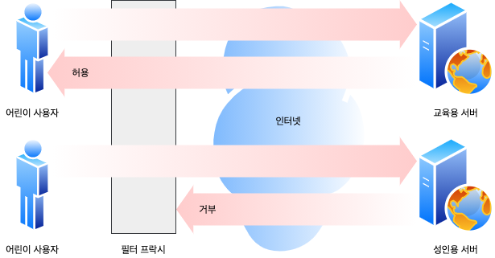
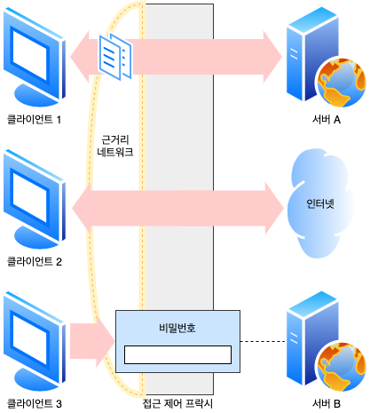
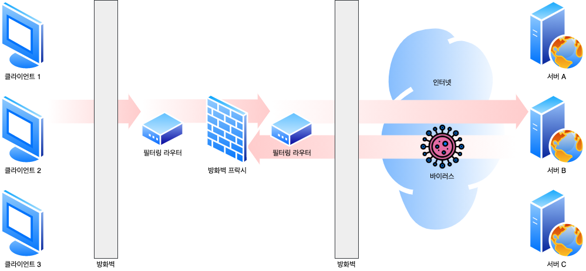
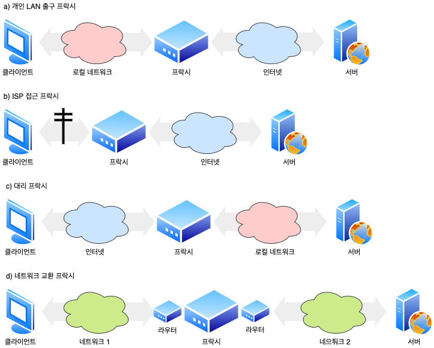
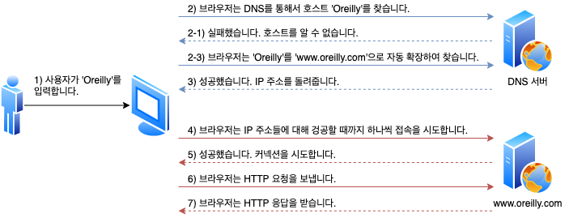
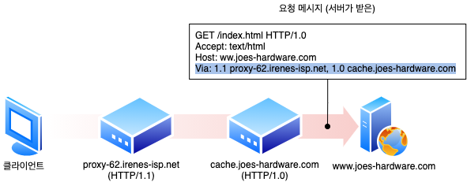
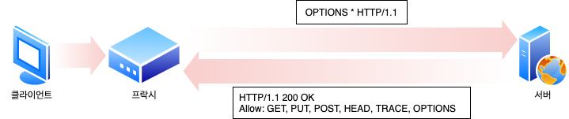

# 6. 프락시

웹 프락시 서버는 중개자입니다. 프락시는 클라이언트와 서버 사이에 위치하여 그들 사이의 HTTP 메시지를 정리하는 중개인처럼 동작합니다.

## 6.1 웹 중개자

웹 프락시 서버는 클라잉너트의 입장에서 트랜잭션을 수행해주는 중개인입니다. 웹 프락시가 없담녀, 클라이언트는 HTTP 서버와 직접 이야기합니다. 웹 프락시가 있다면, 클라이언트는 HTTP 서버와 이야기하는 대신, 자신의 입장에서 서버와 대화해주는 프락시와 이야기합니다. 트랜잭션을 완료하는 것이 클라이언트라는 점은 변하지 않지만, 프락시 서버가 제공하는 좋은 서비스를 이용하게 됩니다.

HTTP 프락시 서버는 웹 서버이기도 하고 웹 클라이언트이기도 합니다. 프락시는 HTTP 클라이언트의 요청을 받게 되므로, 반드시 웹 서버처럼 요청과 커넥션을 적절히 다루고 응답을 돌려줘야 합니다. 동시에 프락시는 요청을 서버로 보내기도 하므로, 요청을 보내고 응답을 받는 올바른 HTTP 클라이언트처럼 동작해야 합니다. 만약 직접 HTTP 프락시를 만든다면, HTTP 클라이언트와 HTTP 서버의 양쪽 규칙 모두를 주의 깊게 따라야 합니다.

### 6.1.1 개인 프락시와 공유 프락시

프락시 서버는 하나의 클라리언트가 독점으로 사용할 수도 있고, 여러 클라이언트가 공유할 수도 있습니다. 하나의 클라이언트만을 위한 프락시를 개인 프락시라고 부릅니다. 여러 클라이언트가 함께 사용하는 프락시는 공용 프락시라 부릅니다.

#### 공용 프락시

대부분의 프락시는 공용이며 공유된 프락시입니다. 중앙 집중형 프락시를 관리하는 게 더 비용효율이 높고 쉽습니다. 그리고 캐시 프락시 서버와 같은 몇몇 프락시 애플리케이션은 프락시를 이용하는 사용자가 많을수록 유리한데, 왜냐하면 여러 사용자들의 공통된 요청에서 이득을 취할 수 있기 때문입니다.

#### 개인 프락시

개인 전용 프락시는 그다지 흔하지는 않지만 꾸준히 사용되고 있습니다(특히 클라이언트 컴퓨터에서 직접 실행되는 형태로). 어떤 브라우저 보조 제품들은 몇몇 ISP 서비스와 마찬가지로 브라우저의 기능을 확장하거나 성능을 개선허가나 무료 ISP 서비스를 위한 광고를 운영하기 위해 작은 프락시를 사용자의 컴퓨터에서 직접 실행합니다.

### 6.1.2 프락시 대 게이트웨이

엄밀하게 말하면, 프락시는 같은 프로토콜을 사용하는 둘 이상의 애플리케이션을 연결하고, 게이트웨이는 서로 다른 프로토콜을 사용하는 둘 이상을 연결합니다. 게이트웨이는 클라이언트와 서버가 서로 다른 프로토콜을 말하더라도 서로 간의 트랜잭션을 완료할 수 있도록 해주는 프로토콜 변환기처럼 동작합니다.

실질적으로 프락시와 게이트웨이의 차이점은 모호합니다. 브라우저와 서버는 다른 버전의 HTTP를 구현하기 떄문에, 프락시는 때때로 약간의 포로토콜 변환을 하기도 합니다. 그리고 상용 프락시 서버는 SSL 보안 프로토콜, SOCKS 방화벽, FTP 접근, 그리고 웹 기반 애플리케이션을 지원하기 위해 게이트웨이 기능을 구현합니다.

## 6.2 왜 프락시를 사용하는가?

프락시 서버는 실용적이고 유용한 것이라면 무슨 일이든 합니다. 보안을 개선하고, 성능을 높여주며, 비용을 절약합니다. 그리고 프락시 서버는 모든 HTTP 트래픽을 들여다보고 건디를 수 있기 때문에, 프락시는 부가적인 가치를 주는 여러 유용한 웹 서비스를 구현하기 위해 트래픽을 감시하고 수정할 수 있습니다.

#### 어린이 필터

초등학교 어린이들에게 교육 사이트를 제공하면서 동시에 성인 콘텐츠를 차단하려고 필터링 프락시를 사용할 수 있습니다.



#### 문서 접근 제어자

프락시 서버는 많은 웹 서버들과 웹 리소스에 대한 단일한 접근 제어 전략을 구현하고 **감사 추적**(Audit Trail)을 하기 위해 사용될 수 있습니다. 이것은 대기업 환경이나 혹은 그 외의 분산된 관료 조직에서 유용합니다. 각기 다른 조직에서 관리되는 다양한 종류의 수많은 웹 서버들에 대한 접근 제어를 수시로 갱신할 필요 없이, 중앙 프락시 서버에서 접근 제어를 설정할 수 있습니다.



#### 보안 방화벽

네트워크 보안 엔지니어는 종종 보안을 강화하기 위해 프락시 서버를 사용합니다. 프락시 서버는 조직 안에 들어오거나 나가는응용 레벨 프로토콜의 흐름을 네트워크의 한 지접에서 통제합니다. 또한 바이러스를 제거하는 웹이나 이메일 프락시가 사용할 수 있는, 트랙픽을 세심히 살펴볼 수 있는 **후크**(Hook)을 제공합니다.



#### 웹 캐시

프락시 캐시는 인기 있는 문서의 로컬 사본을 관리하고 해당 문서에 대한 요청이 오면 빠르게 제공하여 느리고 비싼 인터넷 커뮤니키이션을 줄입니다.


#### 대리 프락시

어떤 프락시들은 웹 서버인 것처럼 위장합니다. 그렇기 떄문에 대리 혹은 리버스 프락시로 불리는 이들은 진짜 웹 서버 요청을 받지만 웹 서버와는 달리 요청 받은 콜텐츠의 위치를 찾아내기 위해 다른 서버와 커뮤니케이션을 시작합니다. 대리 프락시는 공용 콘텐츠에 대한 느린 웹 서버의 성능을 개선하기 위해 사용될 수 있습니다. 이런 시긍로 사용하는 대리 프락시를 흔히 서버 가속기라고 부릅니다. 대리 프라시는 또한 콘텐츠 라우팅 기능과 결합되어 주문형 복제 콘텐츠의 분산 네트워크를 만들기 위해 사용될 수 있습니다.

#### 콘텐츠 라우터

프락시 서버는 인터넷 트래픽 조건과 콘텐츠의 종류에 따라 요청을 특정 웹 서버로 유도하는 라우터로 동작할 수 있습니다. 콘텐츠 라우터 또한 사용자들에게 제공할 여러 서비스를 구현하는데 사용할 수 있습니다. 예를 들어 사용자나 콘텐츠 제공자가 더 높은 성능을 위해 돈을 지불했다면, 콘텐츠 라우터는 요청을 가까운 복제 캐시로 전달할 수 있을 것이빈다. 또 사용자가 필터링 서비스에 가입했다면 HTTP 요청이 필터링 프락시를 통과하도록 할 수 있을 것입니다. 많은 흥미로운 서비스가 맞춤형 콘텐츠 라우팅 프락시를 이용해 구성될 수 있습니다.

#### 트랜스코더

프락시 서버는 콘텐츠를 클라이언트에게 전달하기 전에 본문 포멧을 수정할 수 있습니다. 이와 같이 데이터의 표현 방식을 자연스럽게 변환하는 것을 트랜스코딩이라 부릅니다. 트랜스코딩 프락시는 이미지의 크기를 줄이거나, 텍스트 파일을 압축할 수 있습니다. 필요시 문서를 바로 외국어 문서로 변환하는 것 또한 가능합니다.

#### 익명화 프락시 (Anonymizer)

익명화 프락시는 HTTP 메시지에서 신원을 식별할 수 있는 특성들(클라이언트 IP 주소, From 헤더, Referer 헤더, 쿠키, URI 세션 아이디)을 적극적으로 제거함으로써 개인 정보 보호와 익명성 보장에 기여합니다.

## 6.3 프락시는 어디에 있는가?

### 6.3.1 프락시 서버 배치

어떻게 사용할지에 따라서 프락시는 어디에든 배치할 수 있습니다.



#### 출구(Egress) 프락시

로컬 네트워크와 더 큰 인터넷 사이를 오가는 트래픽을 제어하기 위해 프락시를 로컬 네트워크의 출구에 박아 넣을 수 있습니다.

#### 접근(입구) 프락시

고객으로부터의 모든 요청을 종합적으로 처리하기 위해 프락시는 ISP 접근 지점에 위치하기도 합니다. ISP는 사용자들의 다운로드 속도를 개선하고 인터넷 대역폭 비용을 줄이기 위해 키시 프락시를 사용해 많이 찾는 문서들의 사본을 저장합니다.

#### 대리 프락시

프락시는 종종 대리 프락시로 사용됩니다. 대리 프락시는 네트워크의 가장 끝에 있는 웹 서버드르이 바로 앞에 위치하여 웹 서버로 향하는 모든 요청을 처리하고 필요할 때만 웹 서버에게 지원을 요청할 수 있스빈다. 또한 웹 서버에 보안 기능을 추가하거나 빠른 웹 서버 캐시를 느린 웹 서버의 앞에 놓음으로써 성능을 개선할 수도 있습니다. 대리 프락시는 일반저긍로 웹 서버의 이름과 IP 주소로 스스로 가장하기 때문에, 모든 요청은 서버가 아닌 이 프락시로 가게 됩니다.

#### 네트워크 교환 프락시

캐시를 이용해 인터넷 교차로의 혼잡을 완화하고 트래픽 흐름을 감시하기 위해 충분한 처리 능력을 갖춘 프락시가 네트워크 사이의 인터넷 피어링 교환 지점들에 놓일 수 있습니다.

### 6.3.2 프락시 계층

프락시들은 프락시 계층이라고 불리는 연쇄를 구성할 수 있습니다. 프락시 계층에서, 메시지는 최종적으로 원 서버에 도착할 때 까지 프락시와 프락시를 거쳐 이동합니다. 프락시 계층에서 프락시 서버들은 부모와 자식의 관계를 갖습니다. 다음번 인바운드 프락시(서버에 가까운 쪽)를 부모라고 부르고 다음번 아웃바운드 프락시(클라이언트에 가까운 쪽)는 자식이라고 부릅니다.

#### 프락시 계층 콘텐츠 라우팅

계층이 반드시 정적이어야 하는 것은 아닙니다. 프락시 서버는 여러 가지 판단 근거에 의해 메시지를 다양하고 유동적인 프락시 서버와 원 서버들의 집합에게 보낼 수 있습니다. 동적 부모 선택의 몇 가지 예를 들면 다음과 같습니다.

##### 부하 균형

자식 프라시는 부하를 분산하기 위해 현재 부모들의 작업량 수준에 근거하여 부모 프락시를 고릅니다.

##### 지리적 인접성에 근거한 라우팅

자식 프락시는 원 서버의 지역을 담당하는 부모를 선택할 수도 있습니다.

##### 프로토콜/타입 라우팅

어떤 자식 프락시는 URI에 근거하여 다른 부모나 원 서버로 라우팅 할 수 있습니다. 어떤 특정 종류의 URI를 갖고 있는 요청의 경우, 특별한 프락시 서버로 보내져 특별한 프로토콜로 처리될 수도 있습니다.

##### 유료 서비스 가입자를 위한 라우팅

웹서비스 운영자가 빠른 서비스를 위해 추가금을 지불했다면, 그들의 URI는 대형 캐시나 성능 개선을 위한 압축 엔진으로 라우팅 될 수 있습니다.

### 6.3.3 어떻게 프락시가 트래픽을 처리하는가

클라이언트는 보통 웹 서버와 직접 대화하기 때문에, 우리는 먼저 어떻게 HTTP 트래픽이 프락시로 향하는 길을 찾아내는지 설명할 필요가 있습니다. 클라이언트 트래픽이 프락시로 가도록 만드는 방법에는 다음 네 가지가 있습니다.

#### 클라이언트를 수정합니다

구글 크롬과 마이크로소프트의 브라우저를 포함한 많은 웹 클라이언트들은 수동 혹은 자동 프락시 설정을 지원합니다. 만약 클라이언트가 프락시를 사용하도록 설정되어 있다면, 클라이언트는 HTTP 요청을 바로 그리고 의도적으로 원 서버가 아닌 프락시로 보냅니다.

#### 네트워크를 수정합니다

클라이언트는 알지도 못하고 간섭도 할 수 없는 상태에서, 네트워크 인프라를 가로채서 웹 트리픽을 프락시로 가도록 조정하는 몇 가지 기법이 있습니다. 이 가로챔은 일반적으로 HTTP 트래픽을 지켜보고 가로채어 클라이언트 모르게 트래픽을 프락시로 보내는 스위칭 장치와 라우팅 장치를 필요로 합니다. 이것을 인터셉트 프락시라고 부릅니다.

#### DNS 이름공간을 수정합니다

웹 서버 앞에 위치하는 프락시 서버인 대리 프락시는 웹 서버의 이름과 IP 주소를 자신이 직접 사용합니다. 그래서 모든 요청은 서버 대신 대리 프락시로 갑니다. 이는 DNS 이름 테이블을 수동으로 편집하거나 사용할 적절한 프락시나 서버를 계산해주는 특별한 동적 DNS 서버를 이용해서 조정될 수 있습니다. 몇몇 설치본에서는 실제 서버의 IP 주소와 이름은 변경되고 대리 프락시에게는 이전의 주소와 이름이 주어집니다.

#### 웹 서버를 수정합니다.

몇몇 웹 서버는 HTTP 리다이렉션 명령을 클라이언트에게 돌려줌으로서 클라이언트의 요청을 프락시로 리다이렉트 하도록 설정할 수 있습니다. 리다이렉트를 받는 즉시 클라이언트는 프락시와 트랜잭션을 시작합니다.

## 6.4 클라이언트 프락시 설정

모든 현대적인 브라우저는 프락시를 사용할 수 있도록 설정할 수 있습니다. 사실 많은 브라우저가 프락시를 설정하는 여러 가지 방법을 제공합니다.

### 6.4.1 클라이언트 프락시 설정: 수동

프락시를 사용하겠다고 명시적으로 설정합니다. 많은 웹 클라이언트가 프락시를 수동으로 설정할 수 있도록 하고 있습니다.

### 6.4.2 클라이언트 프락시 설정: PAC 파일

수동 프락시 설정은 단순하지만 반면에 유연하지 못합니다. 모든 콘텐츠를 위해 하나의 프락시 서버만을 지정할 수 있고, 장애 시 대체 작동에 대한 지원도 없습니다. 또한 수동 프락시 설정은 큰 조직에서는 관리 문제를 야기합니다. 설정된 브라우저가 매우 많다면, 그 모두를 원하는 대로 설정 변경을 하는 것은 어렵거나 불가능합니다.

**프락시 자동 설정**(Proxy Auto-Configuration, PAC) 파일은 프락시 설정에 대한 보다 동적인 해결책인데, 왜냐하면 그들은 프락시 설정을 그때그때 상황에 맞게 계산해주는 작은 자바스크립트 프로그램이기 때문입니다. 문서에 접근할 때마다, 자바스크립트 함수가 적절한 프락시 서버를 선택합니다.

PAC 파일을 사용하려면, 자바스크립트 PAC 파일의 URI를 브라우저에 설정해야 합니다. 브라우저는 URI로부터 PAC 파일을 가져와서 매 접근마다 적절한 프락시 서버를 계산하기 위해 자바스크립트 로직을 이용할 것입니다. PAC 파일은 일반적으로 `.pac` 확장자를 가지며 MIME 타입은 `application/x-ns-proxy-autoconfig`입니다.

각 PAC 파일은 반드시 URI에 접근할 때 사용할 적절한 프락시 서버를 계산해주는 `FindProxyForURL(url, host)`라는 함수를 정의해야 합니다. 이 함수의 반환값은 다음 중 하나입니다.

- **DIRECT**: 프락시 없이 연결이 직접 이루어져야 합니다.
- **PROXY host:port**: 지정한 프락시를 사용해야 합니다.
- **SOCKS host:port**: 지정한 SOCKS 서버를 사용해야 합니다.

```javascript
function FindProxyForURL(url, host) {
  if (url.slice(0, 5) === "http:") {
    return "PROXY http-proxy.mydomain.com:8080";
  } else if (url.substring(0, 4) === "ftp:") {
    return "PROXY ftp-proxy.mydomain.com:8080";
  } else {
    return "DIRECT";
  }
}
```

### 6.4.3 클라이언트 프락시 설정: WPAD

브라우저 설정을 위한 또 다른 메커니즘은 **웹 프락시 자동발견 프로토콜**(Web Proxy Autodiscovery Protocol, WPAD)입니다. WPAD는 여러 발견 메커니즘들의 상승 전략을 이용해 브라우저에게 알맞은 PAC 파일을 자동으로 찾아주는 알고리즘입니다. WPAD는 올바른 PAC 파일을 알아내기 위해 일련의 리소스 발견 기법을 사용합니다. 여러 가지 발견 기법을 사용하게 되는데, 모든 조직이 모든 기법을 사용할 수 있는 것은 아니기 때문입니다. WPAD는 성공할 때까지 각 기법을 하나씩 시도해봅니다. 현재의 WPAD 명세는 다음의 기법을 순서대로 정의합니다.

1. 동적 호스트 발견 규약(DHCP)
2. 서비스 위치 규약(SLP)
3. DNS 잘 알려진 호스트 명
4. DNS SRV 레코드
5. DNS TXT 레코드 안의 서비스 URI

## 6.5 프락시 요청의 미묘한 특징들

### 6.5.1 프락시 URI는 서버 URI와 다릅니다

웹 서버와 웹 프락시 메시지의 문법은 서로 같지만, 한 가지 예외가 있습니다. 클라이언트가 프락시 대신 서버로 요청을 보내면 요청의 URI가 달라집니다. 클라이언트가 웹 서버로 요청을 보낼 때, 요청줄은 다음의 예와 같이 스킴, 호스트, 포트번호가 없는 부분 URI를 가집니다.

```
GET /index.html HTTP/1.0
User-Agent: SuperBrowser v1.3
```

그러나 클라이언트가 프락시로 요청을 보낼 때, 요청줄을 다음의 예와 같이 완전한 URI를 갖습니다.

```
GET http://www.marys-antiques.com/index.html HTTP/1.0
User-Agent: SuperBrowser v1.3
```

왜 서버와 프락시는 각각 다른 요청 형식을 갖을까? 원래의 HTTP 설계에서, 클라이언트는 단일한 서버와 직접 대화했습니다. 가상 호스팅은 아직 존재하지 않았고, 프락시에 대한 대비도 없었습니다. 단일 서버는 자신의 호스트 명과 포트번호를 알고 있으므로, 클라이언트는 불필요한 정보 발송을 피하기 위해 스킴과 호스트가 없는 부분 URI만 보냈습니다.

프락시가 부상하면서, 부분 URI는 문제가 되었습니다. 프락시는 목적지 서버와 커넥션을 맺어야 하기 때문에, 그 서버의 이름을 알 필요가 있었습니다. 그리고 프락시 기반 게이트웨이는 FTP 리소스나 혹은 그 외의 스킴과 연결하기 위해 URI의 스킴을 알 필요가 있었습니다. HTTP/1.0은 프락시 요청의 경우 완전한 URI를 요구하는 것으로 이 문제를 해결했지만, 서버 요청의 부분 URI는 여전히 남아있었습니다.

그래서 우리는 서버로는 부분 URI를, 그리고 프락시로는 완전한 URI를 보낼 필요가 있습니다. 명시적으로 설정된 클라이언트 프락시 설정의 경우, 클라이언트는 어떻게 요청을 보내야 하는지 알고 있습니다.

- 클라이언트가 프락시를 사용하지 않도록 설정되어 있다면, 부분 URI를 보냅니다.
- 클라이언트가 프락시를 사용하도록 설정되어 있다면, 완전한 URI를 보냅니다.

### 6.5.2 가낭 호스팅에서 일어나는 같은 문제

프락시의 **스킴/호스트/포토번호 누락** 문제는 가상으로 호스팅 되는 웹 서버가 직면한 것과 같은 문제입니다. 가상으로 호스팅 되는 웹 서버는 여러 웹 사이트가 같은 물리적 웹 서버를 공유합니다. 요청 하나가 부분 URI로 오면 가상으로 호스팅되는 웹 서버는 그 요청이 접근하고자 하는 웹 사이트의 호스트 명을 알 필요가 있습니다. 이 문제들은 비슷함에도 불구하고, 다음과 같이 각각 다른 방법으로 해결되었습니다.

- 명시적인 프락시는 요청 메시지가 완전한 URI를 갖도록 함으로써 이 문제를 해결했습니다.
- 가상으로 호스팅 되는 웹 서버는 호스트와 포트에 대한 정보가 담겨져 있는 Host 헤더를 요구했습니다.

### 6.5.3 인터셉트 프락시는 부분 URI를 받습니다

클라이언트가 HTTP를 올바르게 구현했다면, 그들은 명시적으로 설정된 프락시에게는 완전한 URI를 보낼 것 입니다. 이것으로 문제의 일부분은 해결되지만, 여전히 남은 문제가 있습니다. 클라이언트는 자신이 프락시와 대화하고 있음을 항상 알고 있는 것은 아닙니다. 왜냐하면 몇몇 프락시는 클라이언트에게 보이지 않을 수 있기 때문입니다. 비록 클라이언트가 프락시를 사용한다고 설정되어 있지 않더라도, 클라이언트의 트래픽은 여전히 대리 프락시나 인터셉트 프락시를 지날 수 있습니다. 두 가지 경우 모두 클라이언트는 자신의 웹 서버와 대화하고 있다고 생각하고 완전한 URI를 보내지 않을 것입니다.

- 대리 프락시는 앞에서 설명한 바와 같이 원 서버의 호스트 명과 아이피 주소를 사용해 원 서버를 대신하는 프락시 서버입니다.
- 인터셉트 프락시는 네트워크 흐름에서 클라이언트에게 서버로 가는 트래픽을 가로채 캐시된 응답을 돌려주는 등의 일을 하는 프락시 서버입니다. 인터셉트 프락시는 클라이언트에게 서버로 가는 트래픽을 가로채기 때문에, 웹 서버로 보내는 부분 URI를 얻게 될 것입니다.

### 6.5.4 프락시는 프락시 요청과 서버 요청을 모두 다룰 수 있습니다

트리픽이 프락시 서버로 리다이렉트 될 수 있는 여러 가지 방법이 존재하기 때문에, 다목적 프락시 서버는 요청 메시지의 완전한 URI와 부분 URI를 모두 지원해야 합니다. 프락시는 명시적인 프락시 요청에 대해서는 완전한 URI를 사용하고 아니면 부분 URI를 사용해야 하며, 웹 서버 요청의 경우에는 가상 Host 헤더를 사용해야 합니다. 완전 URI와 부분 URI를 사용하는 규칙은 다음과 같습니다.

- 완전한 URI가 주어졌다면, 프락시는 그것을 사용해야 합니다.
- 부분 URI가 주어졌고 Host 헤더가 있다면, Host 헤더를 이용해 원 서버의 이름과 포트 번호를 알아내야 합니다.
- 부분 URI가 주어졌으나 Host 헤더가 없다면, 다음의 방법으로 원 서버를 알아내야 합니다.
  - 프락시가 원 서버를 대신하는 대리 프락시라면, 프락시에 실제 서버의 주소와 포트 번호가 설정되어 있을 수 있습니다.
  - 이전에 어떤 인터셉트 프락시가 가로챘던 트래픽을 받았고, 그 인터셉트 프락시가 원 IP 주소와 포트번호를 사용할 수 있도록 해두었다면, 그 IP 주소와 포트번호를 이용할 수 있습니다.
  - 모두 실패했다면, 프락시는 원 서버를 알아낼 수 있는 충분한 정보를 갖고 있지 못한 것이므로 반드시 에러 메시지를 반환해야 합니다.

### 6.5.5 전송 중 URI 변경

프락시 서버는 요청 URI의 변경에 매우 신경을 써야 합니다. 무해해 보이는 사소한 URI 변경이라도 다운스트림 서버와 상호운영성 문제를 일으킬 수 있습니다. 특히 몇몇 프락시는 URI를 다음 홉으로 보내기 전에 표준 형식으로 **정규화**하는 것으로 알려져 있습니다. URI에서 기본 HTTP 포트를 명시적인 **80**로 변경하는 것이나 잘못 사용한 예약된 글자를 올바르게 이스케이프하여 교체하는 것과 같은 무해해 보이는 변형이라 할 지라도, 상호운용성 문제를 일으킬 수 있습니다.

일반적으로 프락시 서버는 가능한 한 관대하도록 애써야 합니다. 그들은 프로토콜을 엄격하게 준수하도록 강제하는 **프로토콜 경찰**처럼 되려고 해서는 안 됩니다. 이는 기존에 잘 동작하던 기능들을 심각하게 망가뜨리는 결과를 수반할 수 있기 때문입니다. 특히 HTTP 명세는 일반적인 인터셉트 프락시가 URI를 전달할 때 절대 경로를 고쳐 쓰는 것을 금지합니다. 유일한 예외는 빈 경로를 `/`로 교체하는 것뿐입니다.

### 6.5.6 URI 클라이언트 자동확장과 호스트 명 분석 (Hostname Resolution)

브라우저는 프락시의 존재 여부에 따라 요청 URI를 다르게 분석합니다. 프락시가 없다면 사용자가 타이핑한 URI를 가지고 그에 대응하는 IP 주소를 찾습니다. 만약 호스트명이 발견되면 그에 대응하는 IP 주소를 연결에 성공할 때까지 시도해봅니다. 그러나 호스트가 발견되지 않는다면, 많은 브라우저들은 사용자가 호스트 명의 짧은 약어를 타이핑한 것으로 보고 자동화된 호스트 명의 **확장**을 제공하고자 다음과 같이 몇 가지 시도를 합니다.

- 일반적인 웹 사이트 이름의 가운데 부분만 입력했다면, 많은 브라우저는 `www.` 접두사를 붙이고 `.com` 접미사를 붙입니다.
- 심지어 몇몇 브라우저는 해석할 수 없는 URI를 서드파티 사이트로 넘기기도 하는데, 이사이트는 오타 교정을 시도하고 사용자가 의도했을 URI를 제시합니다.
- 이뿐만 아니라, 대부분의 시스템에서 DNS는 사용자가 호스트 명의 앞부분만 입력하면 자동으로 도메인을 검색하도록 설정되어 있습니다. 예를 들어 `oreily.com`이라는 도메인에 있을 때 `host7`을 입력한다면 그 도메인의 DNS는 자동으로 `host7.oreily.com`을 찾아봅니다. 이것은 완전하지도, 유효하지도 않은 호스트 명입니다.

#### 프락시 없는 URI 분석 (URI Resolution)



#### 명시적인 프락시를 사용할 때의 URI 분석

만약 명시적인 프락시를 사용한다면, 브라우저는 이와 같이 편리한 확장들 중 어느 것도 더 이상 수행할 수 없습니다. 브라우저의 URI가 프락시를 그냥 지나쳐버리기 때문입니다. 이러한 이유로, 몇몇 프락시는 `www...com` 자동확장이나 지역 도메인 접미사 추가와 같은 브랑줘의 편리한 서비스를 할 수 있다면 최대한 흉내 내려고 시도합니다.


#### 인터셉트 프락시를 이용한 URI 분석

호스트 명 분석은 보이ㅏ지 않는 인터셉트 프락시와 함꼐일 떄 약간 달라지는데, 왜냐하면 클라이언트이 입장에서 프락시는 존재하지 않는 것이기 때문입니다. 성공할 때까지 호스트 명을 자동확장하는 브라우저를 사용할 떄, 동작은 프락시 아닌 서버의 경우와 별 차이가 없습니다. 그러나 서버로의 커넥션이 만들어졌을 때는 분명한 차이가 발생합니다.

일반적으로, 클라이언트는 성공할 때까지 모든 IP 주소에 대해 접속을 시도하지만, 어떤 IP 주소들은 죽은 것일 수 있습니다. 그러나 인터셉트 프락시와 함께라면, 첫 번째 접속 시도는 원 서버가 아닌 프락시 서버에 의해 종료됩니다. 클라이언트는 성공적으로 웹 서버와 대화했다고 믿지만, 웹 서버는 살아있지 않았을 것입니다.

프락시가 최종적으로 진짜 원 서버와 상호작용할 준비가 되었을 때, 프락시는 IP 주소가 실제로는 다운된 서버를 가리키고 있음을 알게 될 것입니다. 브라우저에서 제공하는 것과 동등한 수준의 **장애 허용**(Fault Tolerance)을 제공하기 위해서, 프락시는 호스트 헤더에 들어 있는 호스트 명을 다시 분석하든 아니면 IP 주소에 대한 역방향 DNS 룩업을 해서든 다른 IP 주소를 시도해야 합니다. 인터셉트 프락시와 명시적인 프락시는 모두 죽은 서버의 DNs 분석에 대한 장애 허용을 지원해야 한다는 것은 중요한데, 왜냐하면 브라우저가 명시적인 프락시를 사용하도록 설정되어 있는 경우 장애 허용은 프락시에 달려있기 때문입니다.

## 6.6 메시지 추적

오늘날, 웹 요청이 클라이언트에서 서버로 향하는 도중에 둘 이상의 프락시를 지나게 되는 것은 드문 일이 아닙니다. 동시에 성능상의 이유로 세계 곳곳에 흩어져 있는 대리 캐시 저장고에 콘텐츠를 복제해두는 방식이 점점 더 흔해지고 있습니다. 프락시는 여러 벤더에 의해 개발됩니다. 그들은 서로 다른 기능과 버그 들을 갖고 있으며 여러 조직에 의해 관리됩니다. 프락시가 점점 더 흔해지면서, 서로 다른 스위치와 라우터를 넘나드는 IP 패킷의 흐름을 추적하는 것 못지않게 프락시를 넘나드는 메시지의 흐름을 추적하고 문제점을 찾아내는 것도 필요한 일이 되었습니다.

### 6.6.1 Via 헤더

Via 헤더 필드는 메시지가 지나는 각 중간 노드(프락시나 게이트웨이)의 정보를 나열합니다. 메시지가 또 다른 노드를 지날 때마다, 중간 노드는 Via 목록의 끝에 반드시 추가되어야 합니다. Via 헤더 필드는 메시지의 전달을 추적하고, 메시지 루프를 진단하고, 요청을 보내고 그에 대한 응답을 돌려주는 과정에서 관여하는 모든 메시지 발송자들의 프로토콜을 다루는 능력을 알아보기 위해 사용됩니다.



프락시는 또한 네트워크의 라우팅 루프를 탐지하기 위해 Via 헤더를 사용할 수 있습니다. 프락시는 요청을 보내기 전에 자신을 가리키는 **유일한**(Unique) 문자열을 Via 헤더에 삽입해야 하며 네트워크 라우팅 루프가 있는지 탐색하기 위해 이 문자열이 들어온 요청에 있는지 검사해야 합니다.

#### Via 문법

Via 헤더 필드는 쉼표로 구분된 **경유지**(Waypoint)의 목록입니다. 각 겨융지는 개별 프락시 서버나 게이트웨이 홈을 나타내며 그들 중간 노드의 프로토콜과 주소에 대한 정보를 담고 있습니다.

```
Via = "Via" ":" ( waypoint) [", " ( waypoint )...]
waypoint = ( received-protocol received-by [ comment ] )
received-protocol = [protocol-name "/"] protocol-version
received-by = ( host [ ":" prot ] ) | pseudonym
```

##### 프로토콜 이름

중개자가 받은 프로토콜입니다. 만약 프로토콜이 HTTP라면 프로토콜 이름은 없어도 됩니다. 한편, 프로토콜 이름은 버전 앞에 `/`로 구분되어 붙습니다. 비 HTTP 프로토콜은 게이트웨이가 다른 프로토콜(HTTPS/ FTP 등)을 위해 HTTP 요청에 접속할 때 발생할 수 있습니다.

##### 프로토콜 버전

수신한 메시지의 버전입니다. 버전의 포멧은 포로토콜에 달려있습니다. HTTP의 경우, 표준 버전 번호(1.0, 1.1 등)가 사용됩니다. 버전은 Via 필드에 포함되므로, 애플리케이션들은 자신 이전의 모든 중개자들이 어떤 버전을 다룰 수 있는지 알 수 있습니다.

##### 노드 이름

중개자의 호스트와 포트 번호입니다. 만약 포트가 포함되어 있지 않다면, 사용하는 프로토콜의 기본 포트라고 간주할 수 있습니다. 몇몇 조직은 정보 보호를 이유로 진짜 호스트 명을 밝히고 싶어 하지 않을 수 있는데, 그러한 경우 가명으로 대체할 수 있습니다.

##### 노드 코멘트

중개자 노드르 서술하는데 선택적인 코멘트입니다. 벤더나 버전 정보를 여기에 포함시키는 것은 흔한 일이며, 몇몇 프락시 서버는 장치에서 일어난 이벤트에 대한 진단 정보를 포함하는 데도 코멘트 필드를 사용합니다.

##### Via 요청과 응답 경로

요청 메시지와 응답 메시지는 모두 프락시를 지나므로 둘 모두 Via 헤더를 가집니다. 요청과 응답은 보통 같은 TCP 커넥션을 오가므로, 응답 메시지는 요청과 같은 경로를 되돌아갑니다.

##### Via와 게이트웨이

몇몇 프락시는 서버에게 비 HTTP 프로토콜을 사용할 수 있는 게이트웨이 기능을 제공합니다. Via 헤더는 이러한 프로토콜 변환을 기록하므로 HTTP 애플리케이션은 프락시 연쇄에서 프로토콜 능력과 변환이 있었는지 않아챌 수 있습니다.

##### Server 헤더와 Via 헤더

Server 응답 헤더 필드는 원 서버에 의해 사용되는 소프트웨어를 알려줍니다. 응답 메시지가 프락시를 통과할 때, 프락시는 Server 헤더를 수정해서는 안 됩니다.

```
Server: Apache/1.3.14 (Unix) PHP/4.0.4
Server: Netscape-Enterprose/4.1
Server: Microsoft-IIS/5.0
```

##### Via가 개인정보 보호와 보안에 미치는 영향

Via 문자열 안에 정확한 호스트 명이 들어가기를 원하지 않는 경우가 있습니다. 보통 명시적으로 이 동작이 켜져 있지 않은 이상, 프락시 서버가 네트워크 방화벽의 일부인 경우 프락시는 방화벽 뒤에 숨어있는 호스트의 이름과 포트를 전달해서는 안됩니다. 반화벽 뒤의 네트워크 아키텍처에 대한 정보가 악의적인 집단에 의해 이욜될 수 있기 때문입니다.

만약 Via 노드 이름 전달이 가능하지 않다면, 보안 경계석의 일부분인 프락시는 호스트 명을 그 호스트에 대한 적당한 가명으로 교체해야 합니다. 하지만 이로 인해 실제 이름을 알기 어렵게 되었다고 하더라도, 일반적으로 프락시는 각 프락시 서버에 대한 Via 경유지 항목을 유지하려 노력해야 합니다.

내부 네트워크 아키텍쳐의 설계와 토폴로지를 알아내기 어렵게 하리 귀한 아주 강력한 보안 요구사항을 갖고 잇는 조직들을 위해, 프락시는 정렬된 일련의 Via 경유지 항복들을 하나로 합칠 수 있습니다.

```
Via: 1.0 foo, 1.1 devirus.company.com, 1.1 access-logger.company.com
Via: 1.0 foo, 1.1 concealed-stuff
```

여러 경유지들이 모두 같은 조직의 통제하에 있고 호스트가 이미 가명으로 교체되지 않은 이상 그들에 대한 항목들을 합쳐서는 안 됩니다. 수신도니 프로토콜 값이 서로 다른 항목들도 합쳐서는 안 됩니다.

### 6.6.2 TRACE 메서드

프락시 서버는 메시지가 전달될 때 메시지를 바꿀 수 있습니다. 헤다가 추가되거나, 변경되거나, 삭제될 수 있으며, 본문이 다른 형식으로 변환될 수 있습니다. 프락시가 점점 복잡해지고 더 많은 벤더가 프락시 제품을 배치하면서, 상호운용성 문제가 증가합니다. 프락시 네트워크를 쉽게 진단하기 위해, 우리는 HTTP 프락시 네트워크를 통해 홉에서 홉으로 전달될 때마다 메시지의 내용이 어떻게 변하는지 편리하게 관찰할 방법이 필요합니다.

HTTP/1.1의 TRACE 메서드는 요청 메시지를 프락시의 연쇄를 따라가면서 어떤 프락시를 지나가고 어떻게 각 프락시가 요청 메시지를 수정하는지 관찰/추적할 수 있도록 해줍니다. TRACE는 프락시 흐름을 디버깅하는데 매우 유용합니다. TRACE 요청이 목적지 서버에 도착했을 때, 서버는 전체 요청 메시지를 HTTP 응답 메시지의 본문에 포함시켜 송신자에게 그대로 돌려보냅니다. TRACE 응답이 도착했을 때, 클라이언트는 서버가 받은 메시지와 그 메시지가 지나간 프락시들의 목록(Via 헤더 안에 있습니다)을 검사할 수 있습니다. TRACE 응답의 Content-Type은 `message/http`이며 상태는 `200 OK` 입니다.

#### Max-Forwards

일반적으로 TRACE 메시지는 중간에 프락시들이 몇 개나 있든 신경 쓰지 않고 목적지 서버로의 모든 경로를 이행합니다. TRACE와 OPTIONS 요청의 프락시 **홉**(Hop) 개수를 제한하기 위해 Max-Forwards 헤더를 사요할 수 있는데, 이는 전달되는 메시지가 무한 루프에 빠지지 않는지 프락시 연쇄를 테스트하거나 연쇄 중간의 특정 프락시 서버들의 효과를 체크할 때 유용합니다.

Max-Forwards 요청 헤더 필드는 이 요청 메시지가 몇 번 더 다음 홉으로 전달될 수 있는지 말해주는 정수 하나를 담고 있습니다. 만약 Max-Forwards 겂이 0이라면, 수신자는 자신이 원 서버가 아니라 할지라도 TRACE 메시지를 더 이상 전달하지 말고 반드시 클라이언트에게 돌려줘야 합니다. 받은 Max-Forwards 값이 0보다 크다면, 전달될 메시지의 Max-Forwards 필드는 반드시 1 감소된 값으로 갱신되어야 합니다. 모든 프락시와 게이트웨이는 Max-Forwards를 지원해야 합니다. 프락시 연쇄의 어떤 특정 홉에서의 요청을 보기 위해 Max-Forwards를 사용할 수도 있습니다.

## 6.7 프락시 인증

프락시는 접근 제어 장치로서 제공될 수 있습니다. HTTP는 사용자가 유효한 접근 권한 자격을 프락시에 제출하지 않는 한 콘텐츠에 대한 요청을 차단하는 프락시 인증이라는 메커니즘을 정의하고 있습니다.

1. 제한도니 콘텐츠에 대한 요청이 프락시 서버에 도착했을 때, 프락시 서버는 접근 자격을 요구하는 `407 Proxy Authorization Required` 상태 코드를 어떻게 그러한 자격을 제출할 수 있는지 설명해주는 Proxy-Authenticate 헤더 필드와 함께 반환할 수 있습니다.
2. 클라이언트는 407 응답을 받게 되면, 로컬 데이터베이스를 확인해서든 사용자에게 물어봐서든 요구되는 자격을 수집합니다.
3. 자격을 획득하면, 클라이언트는 요구되는 자격을 Proxy-Authorization 헤더 필드에 담아서 요청을 다시 보냅니다.
4. 자격이 유효하다면, 프락시는 원 요청 연쇄를 따라 통과시킵니다. 유효하지 않다면 407 응답을 보냅니다.

프락시 인증은 인증에 참여하는 프락시가 프락시 연쇄상에 여러 개 있을 때는 일반적으로 잘 동작하지 않습니다. 사람들은 프락시 연쇄의 특정 경유지와 인증 자격을 서로 짝지어 주는 HTTP의 기능 확장을 제안했지만, 널리 구현되지는 않았습니다.

## 6.8 프락시 상호운용성

클라이언트, 서버, 프락시는 HTTP 명세의 여러 버전에 대해 여러 벤더에 의해 만들어집니다. 그들은 여러 가지 기능을 지원하며 제각각 다른 버그를 갖고 있습니다. 프락시 서버는 서로 다른 프로토콜을 구현했을 수 도 있고 골치 아프게 이상한 동작을 할 수도 있는 클라이언트와 서버 사이를 중개해야 합니다.

### 6.8.1 지원하지 않는 헤더와 메서드 다루기

프락시 서버는 넘어오는 헤더 필드들을 모두 이해하지 못할 수도 있습니다. 몇몇 헤더는 프락시 자신보다 새로운 것일 수도 있습니다. 또 다른 헤더들은 특정 애플리케이션을 위해 특별히 만들어진 것일 수도 있습니다. 프락시는 이해할 수 없는 헤더 필드는 반드시 그대로 전달해야 하며, 같은 이름의 헤더 필드가 여러 개 있는 경우에는 그들의 상대적인 순서도 반드시 유지해야 합니다. 비슷하게, 만약 프락시가 어떤 메서드와 친숙하지 않다면, 간능한 한 그 메시지를 다음 홉으로 전달하려 시도해야 합니다.

지원하지 않는 메서드를 통과시킬 수 없는 프락시는 오늘날 대부분의 네트워크에서 살아남지 못합니다. HTTP/1.1은 메서드를 확장하는 것을 허용하고 있습니다.

### 6.8.2 OPTIONS: 어떤 기능을 지원하는지 알아보기

HTTP OPTIONS 메서드는 서버나 웹 서버의 특정 리소스가 어떤 기능을 지원하는지(예를 들면 지원하는 메서드) 클라이언트가 알아볼 수 있게 해줍니다. 서로 다른 기능 수준의 서버와 프락시가 더 쉽게 상호작용 할 수 있도록 클라이언트는 OPTIONS를 이용해 서버의 능력을 먼저 알아낼 수 있습니다.

만약 OPTIONS 요청의 URI가 별표(`*`)라면, 요청은 서버 전체의 능력에 대해 묻는 것이 됩니다. 만약 URI 시로스라면, OPTIONS 요청은 특정 리소스에 대해 가능한 기능들을 묻는 것입니다.



성공한다면, OPTIONS 메서드는 서버에서 지원하거나 지정한 리소스에 대해 가능한 선택적인 긴으들을 서술하는 여러 헤더 필드를 포함한 `200 OK` 응답을 반환합니다. 하지만 HTTP/1.1이 명시한 헤더는 서버에 의해(혹은 서버의 특정 리소스에 대해) 어떤 메서드가 지원되는지 서술하는 Allow 헤더 하나뿐입니다. 더 많은 정볼르 위해 OPTIONS는 선택적인 응답 본문을 허용하지만 이에 대해 정의된 것은 없습니다.

### 6.8.3 Allow 헤더

Allow 엔터티 헤더 필드는, 요청 URI에 의해 식별되는 자원에 대해 지원되는 메서드들이나 서버가 지원하는 모든 메서드를 열거합니다.

```
Allow: GET, HEAD, PUT
```

Allow 헤더는 새 리소스가 지원했으면 하는 메서드를 추천하기 위해 요청 헤더로 사용될 수 있습니다. 서버는 추천 받은 메서드를 모두 지원해야 할 의무는 없으며, 그 요청에 대한 응답에는 실제로 지원하는 메서드들을 열거하는 Allow 헤더를 포함시켜야 합니다. 만약 프락시가 지정된 모든 메서드를 이해할 수 없다고 해도, 프락시는 Allow 헤더 필드를 수정할 수 없습니다. 왜냐하면 클라이언트는 원 서버와 대화하는 다른 경로를 갖고 잇을 수도 있기 때문입니다.
