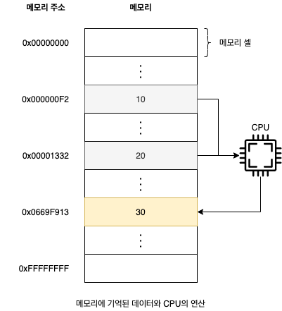
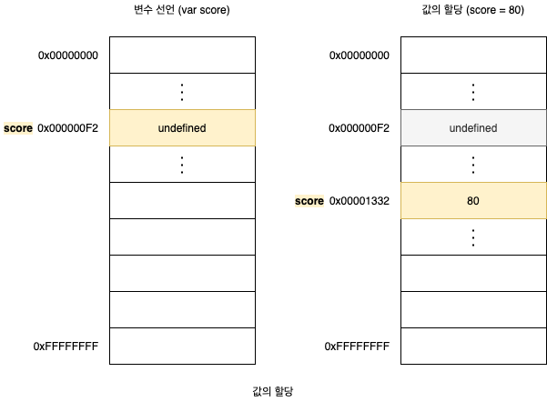

# 4. 변수

## 4.1 변수란 무엇인가? 왜 필요한가?

```
10 + 20
```

자바스크립트 엔진이 위 자바스크립트 코드를 계산(평가)하려면 먼저 `10`, `20`, `+`라는 **기호(리터럴과 연산자)**의 이미를 알고 있어야 하며, `10 + 20`이라는 **식(표현식)**의 의미도 **해석(파싱)**할 수 있어야 합니다. 자바스크립트 엔진이 `10 + 20`이라는 식의 의미를 해석하면 `+` 연산을 수행하기 위해 먼저 `+` 연산자의 좌변과 우변의 숫자 값, 즉 **피연산자**를 기억합니다.



**메모리**는 데이터를 저장할 수 있는 **메모리 셀**의 집합체입니다. 메모리 셀 하나의 크기는 1바이트(8비트)이며, 컴퓨터는 메모리 셀의 크기, 즉 1바이트 단위로 데이터를 **저장**하거나 **읽어**들입니다. 각 셀은 고유의 메모리 주소를 갖습니다. 이메모리 주소는 메모리 공간의 위치를 나타내며, 0부터 시작해서 메모리의 크기만큼 정수로 표현됩니다. 위 그림에서는 메모리에 저장된 숫자 값이 편의상 10진수로 표기됐습니다. 하지만 컴퓨터는 모든 데이터를 2진수로 처리합니다.

메모리 상의 임의의 위치에 기억된 값을 CPU가 읽어들여 연산을 수행합니다. 성공적으로 연산이 끝났고 연산 결과도 메모리에 저장되었지만 만들어낸 숫자 값 30을 재사용할 수 없는 문제가 있습니다. 메모리 주소를 통해 값에 직접 접근하는 것은 애우 위험한 일이여서 자바스크립트는 개발자의 직접적인 메모리 제어를 허용하지 않습니다. 또한 메모리 제어를 허용한다 할지라도 코드가 실행될 때마다 값이 저장될 메모리 주소가 변경되기 때문에, 값이 저장된 메모리 주소를 알 수 없습니다.

프로그래밍 언어는 **변수**라는 메커니즘을 제공합니다. 변수는 하나의 값을 저장하기 위해 확보한 메모리 공간 자체 또는 그 메모리 공간을 식별하기 위해 붙인 이름을 말합니다. 변수는 프로그래밍 언어의 컴파일러 또는 인터프리터에 의해 값이 저장된 메모리 공간의 주소로 치환되어 실행됩니다. 따라서 개발자가 직접 메모리 주소를 통해 값을 저장하고 참조할 필요가 없고 변수를 통해 안전하게 값에 접근할 수 있습니다.

```javascript
var result = 10 + 20;
```

- **변수 이름:** 메모리 공간에 저장된 값을 식별활 수 있는 고유한 이름(위 예제에서는 `result`)
- **변수 값:** 변수에 저장된 값(위 예제에서는 `30`)
- **할당:** 변수에 값을 저장하는 것(대입, 저장)
- **참조:** 변수에 저장된 값을 읽어 들이는 것

## 4.2 식별자

메모리 상에 존재하는 어떤 값을 식별할 수 있는 이름은 모두 식별자라고 부릅니다. 식별자는 값이 아니라 값이 저장되어 있는 메모리 주소와 매칭 관계를 맺으며, 이 매핑 정보도 메모리에 저장되어야 합니다. 식별자라는 용어는 변수 이름에만 군한해서 사용하지 않습니다. 에를 들어, 변수, 함수, 클래스 등의 이름은 모두 식별자입니다.

## 4.3 변수 선언

변수 선언이란 값을 저장하기 위한 메모리 공간을 확보하고 변수 이름과 확보된 메모리 공간의 주소를 연결해서 값을 저장할 수 있게 변수를 생성하는 것을 말합니다. 변수 선언에 의해 확보된 메모리 공간은 확보가 해제되기 전까지 사용할 수 없도록 보호되므로 안전하게 사용할 수 있습니다.

```javascript
var scores; // 변수 선언(변수 선언문)
```

변수를 포함한 모든 식별자는 사용하려면 반드시 선언이 필요합니다. 만약 선언하지 않은 식별자에 접근하면 **ReferenceError**(참조 에러)가 발생합니다. **var** 키워드는 뒤에 오는 변수 이름으로 새로운 변수를 선언하는 것을 지시하는 키워드입니다. 자바스크립트 엔진은 변수 선언을 다음과 같은 2단계에 거쳐 수행합니다.

1. **선언 단계:** 변수 이름을 등록해서 자바스크립트 엔진에 변수의 존재를 알립니다.
2. **초기화 단게:** 값을 저장하기 위해 메모리 공간을 확보하고 암묵적으로 `undefined`를 할당해 초기화합니다.

만약에 초기화 단계를 거치지 않으면 확보된 메모리 공간에 이전에 다른 애플리케이션이 사용했던 값이 남아 있을 수 있습니다. 이러한 값을 **쓰레기 값**(Garbage Value)이라 합니다.

## 4.4 변수 선언의 실행 시점과 변수 호이스팅

```javascript
console.log(score); // undefined

var score;
```

변수 선언은 소스코드가 한 줄씩 순차적으로 실행되는 시점, 즉 런타임(Runtime)이 아니라 그 이전 단계에서 먼저 실행됩니다. 자바스크립트 엔진은 소스코드를 한 줄씩 순차적으로 실행하기에 앞서 먼저 소스코드의 평가 과정을 거치면서 소스코드를 실행하기 위한 준비를 합니다. 이때 소스코드 실행을 위한 준비 단계인 소스코드의 평가 과정에서 자바스크립트 엔진은 변수 선언을 포함한 모든 식별자 선언문을 소스코드에서 찾아내 먼저 실행합니다. 그리고 소스코드의 평가 과정이 끝나면 비로소 선언문을 제외하고 소스코드를 한 줄씩 순차적으로 실행합니다. 따라서 변수 선언이 소스코드이 어디에 위치하는지와 상관없이 어디서든지 변수를 참조할 수 있습니다. 이처럼 변수 선언문이 코드의 선두로 끌어 올려진 것처럼 동작하는 자바스크립트의 고유 특징을 **변수 호이스팅**이라 합니다.

## 4.5 값의 할당

```javascript
var width; // 변수 선언
width = 80; // 값의 할당

var height = 80; // 변수 선언과 값의 할당
```

변수에 값을 할당(대입, 저장)할 때는 할당 연산자 `=`를 사용합니다. 할당 연산자는 우변의 값을 주변의 변수에 할당합니다. 이 때 주의할 점은 변수 선언과 값의 할당의 실해 잇점이 다르다는 것입니다. 변수 선언은 소스코드가 순차적으로 실행되는 시점인 런타임 이전에 먼저 실행되지만, 값의 할당은 소스코드가 순차적으로 실행되는 시점인 런타임에 실행됩니다.



위 그림처럼 변수에 값을 할당할 때는 이전 값 `undefined`가 저장되어 있던 메모리 공간을 지우고 그 메모리 공간에 할당 값 80을 새롭게 저장하는 것이 아니라, 새로운 메모리 공간을 확보하고 그곳에 할당 값 80으 저장한다는 점을 주의해야합니다. `undfined`와 같이 더이상 필요하지 않은 값들은 **가비지 콜렉터**에 의해 메모리에서 자동 해제됩니다. 단, 메모리에서 언제 해제될지는 예측할 수 없습니다.

```javascript
console.log(score); // undefined

score = 80;
var score;

console.log(score); // 80
```

> 프로그래밍 언어는 메모리 관리 방식에 따라 **언메니지드 언어**와 **매니지드 언어**로 분류할 수 있습니다. 언메니지드 언어는 메모리 제어를 개발자가 주도할 수 있으므로 개발자의 역량에 따라 최적의 성능을 확보할 수 있지만, 그 반대의 경우 치명적인 오류를 생산할 가능성도 있습니다. 메니지드 언어는 메모리 할당 및 해제를 위한 메모리 관리 기능을 언어 차원에서 담당하고 개발자의 직접적인 메모리 제어를 허용하지 않습니다. 이는 개발자의 역량에 의존하는 부분이 상대적으로 작아져 어느 정도 일정한 생산성을 확보할 수 있다는 장점이 있지만, 성능 면에서 어느 정도의 손실은 삼수할 수밖에 없습니다.

## 4.6 값의 재할당

```javascript
var score = 80; // 변수 선언과 값의 할당
score = 90; // 값의 재할당
```

재할당은 변수에 저장된 값을 다른 값으로 변경합니다. 만약 값을 재할당할 수 없어서 변수에 저장된 값을 변경할 수 없다면 변수가 아니라 상수라고 합니다. 엄밀히 말하자면 변수에 처음으로 값을 할당하는 것도 사실을 재할당입니다.

## 4.7 식별자 네이밍 규칙

- 식별자는 특수문자를 제외한 문자, 숫자, 언더스코어(\_), 달러 기호($)를 포함할 수 있습니다.
- 단, 식별자는 특수문자를 제외한 문자, 언더스코어(\_), 달러 기호($)로 시작해야합니다. 숫자로 시작하는 것은 허용하지 않습니다.
- 예약어는 식별자로 사용할 수 없습니다.

예약어는 프로그래밍 언어에서 사용되고 있거나 사용될 예정인 단어를 말합니다. 자바스크립트의 예약어는 다음과 같습니다.


변수는 쉼표(,)로 구분해 하나의 문서에 여러 개를 한번에 선언할 수 있습니다. 하지만 가독성이 나빠지므로 권장하지 않습니다.

```javascript
var person, $elem, _name, first_name, val1;
```

ES5부터 식별자를 만들 때 유니코드 문자를 허용하므로 알파벳 외의 한글이나 일본어 식별자도 사용할 수 있습니다. 하지만 바람직하지 않으므로 권장하지 않습니다.

```javascript
var 이름;
```

다음 식별자는 명명 규칙에 위배되므로 변수 이름으로 사용할 수 없습니다.

```javascript
var first-name; // SyntaxError: Unexpected token -
var 1st; // SyntaxError: Invalid or unexpected toen
var this; // StntaxError: Unexpected token this
```

자바스크립트는 대소분자를 구별하므로 다음 변수는 각각 별개의 변수입니다.

```javascript
var firstname;
var firstName;
var FIRSTNAME;
```

변수 이름은 변수의 존재 목적을 쉽게 이해할 수 있도록 의미를 명확히 표현해야 합니다.

```javascript
var x = 3; // NG. x 변수가 의미하는 바를 알 수 없다.
var score = 100; // OK. scores 변수는 점수를 의미한다.
```

**네이밍 컨벤션**(Naming Convention)은 하나 이상의 연어 단어로 구성된 식별자를 만들 때, 가독성 좋게 단어를 한눈에 구분하기 위해 규정한 명명 규칙입니다.

```javascript
// 카멜 케이스(camelCase)
var firstName;

// 스네이크 케이스(snake_case)
var first_name;

// 파스칼 케이스(PascalCase)
var FirstName;

// 헝가리언 케이스(typeHungarianCase)
var strFirstName; // type + identifier
var $elem = document.getElementById("myId"); // DOM 노드
var observable$ = fromEvent(document, "click"); // RXJS 옵저버블
```

일관성을 유지한다면 어떤 네이밍 컨벤션을 사용해도 좋지만, 자바스크립트에서는 일반적으로 변수나 함수의 이름에는 카멜 케이스를 사용하고, 생성자 함수, 클래스의 이름에는 파스칼 케이스를 사용합니다.
