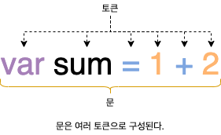

# 5. 표현식과 문

## 5.1 값

**값**은 **식**(표현식)이 **평가**되어 생성된 결과를 말합니다. 평가란 식을 해석해서 값을 생성하거나 참조하는 것을 의미합니다.

```javascript
// 변수에는 10 + 20이 평가되어 생성된 숫자 값 30이 할당됩니다.
var sum = 10 + 20; // 30
```

모든 값은 데이터 타입을 가지며, 메모리에 2진수, 즉 비트의 나열로 저장됩니다. 메모리에 저장된 값은 데이터 타입에 따라 다르게 해석될 수 있습니다. 예를 들어, 메모리에 저장된 값 `0100 0001`을 숫자로 해석하면 `65`지만 문자로 해석하면 `A`입니다.

## 5.2 리터럴

**리터럴**은 사람이 이해할 수 있는 문자(아라비어 숫자, 알파벳, 한글 등) 또는 약속된 기호('', "", ., [], {}, // 등)를 사용해 값을 생성하는 **표기법**을 말합니다. 자바스크립트 엔진은 코드가 실행되는 시점인 **런타임**에 리터럴을 평가해 값을 생성합니다. 리러럴을 사용하면 다음과 같은 다양한 종류의 값을 생성할 수 있습니다.

| 리터럴             | 에시                                | 비고                    |
| ------------------ | ----------------------------------- | ----------------------- |
| 정수 리터럴        | `100`                               |                         |
| 부동소수점 리터럴  | `10.5`                              |                         |
| 2진수 리터럴       | `0b01000001`                        | 0b로 시작               |
| 8진수 리터럴       | `0o101`                             | ES6에서 도입. 0o로 시작 |
| 16진수 리터럴      | `0x41`                              | ES6에서 도입. 0x로 시작 |
| 문자열 리터럴      | `'Hello'`, `"Wrold"`                |                         |
| 불리언 리터럴      | `true`, `false`                     |                         |
| null 리터럴        | `null`                              |                         |
| undefined 리터럴   | `undefined`                         |                         |
| 객체 리터럴        | `{ name: 'Lee', address: 'Seoul' }` |                         |
| 배열 리터럴        | `[ 1, 2, 3 ]`                       |                         |
| 함수 리터럴        | `function () {}`                    |                         |
| 정규 표현식 리터럴 | `/[A-Z]+/g`                         |                         |

## 5.3 표현식

**표현식**은 리터를, 식별자, 연산자, 함수 호출 등의 조합으로 이루어지며, 값으로 평가될 수 있는 **문**입니다. 즉, 표현식이 평가되면 새로운 값을 생성하거나 기존 값을 참조합니다. 앞서 살펴본 리터럴으 값으로 평가됩니다. 따라서 리터럴도 표현식입니다.

```javascript
// 리터럴 표현식
10;

// 삭별자 표현식(선언이 이미 존재한다고 가정)
sum;
person.name;
arr[1];

// 연산자 표현식
10 + 20;
sum = 10;
sum !== 10;

// 함수/메서드 호출 표현식(선언이 이미 존재한다고 가정)
square();
person.getName();
```

표현식과 표현식이 평가된 값은 동등한 관계, 즉 **동치**입니다. 자바스크립트 표현식 `1 + 2`와 값 `3`은 동치입니다. 따라서 표현식은 값처럼 사용할 수 있습니다. 이것은 문법적으로 값이 위차할 수 있는 자리에는 표현식도 위치할 수 있다는 것을 의미합니다.

```javascript
var x = 1 + 2;

// + 연산자 좌항과 우항애는 숫자 값이 위치해야 합니다.
// 식별자 표현식 x는 값 3으로 평가되기 때문에 사용할 수 있습니다.
x + 3; // 6
```

## 5.4 문

**문**은 프로그램을 구성하는 기본 단위이자 최소 실행 단위입니다. 문의 집합으로 이뤄진 것이 바로 프로그램이며, 문을 작성하고 순서에 맞게 나열하는 것이 프로그래밍입니다. 문은 **토큰**으로 구성됩니다. 토큰이란 문법적인 의미를 가지며, 문법적으로 더 이상 나눌 수 없는 코드의 기본 요소를 의미합니다.



문을 **명령문**일고도 부릅니다. 즉, 문은 컴퓨터에 내리는 명령입니다.

```javascript
// 변수 선언문
var x;

// 할당문
x = 5;

// 함수 선언문
function foo() {}

// 조건문
if (x > 1) {
  console.log(x);
}

// 반복문
for (var i = 0; i < 2; i += 1) {
  console.log(i);
}
```

## 5.5 세미콜론과 세미콜론 자동 삽입 기능

세미콜론(;)은 문의 종료를 나타냅니다. 즉, 자바스크립트 엔진은 세미콜론으로 문이 종료한 위치를 파악하고 순차적으로 하나씩 문을 실행합니다. 따라서 문을 끝낼 때는 세미콜론을 붙여야 합니다. 단, 0개 이상의 문을 중괄호로 묶은 **코드 블록**({ ... }) 뒤에는 세미콜론을 붙이지 않습니다. 코드 블록은 언제나 문의 종료를 의미하는 **자체 종결성**을 갖기 때문입니다.

자바스크립트 엔진은 소스코드를 해설할 때 문의 끝이라고 예측되는 지점에 세미콜론을 자동으로 붙여주는 **세미콜론 자동 삽입 기능**(Automatic Semicolon Insertion, ASI)이 암묵적으로 수행됩니다. 하지만 세미콜론 자동 사입 기능의 동작과 개발자의 예측이 일치하지 않는 경우가 간혹 있습니다.

세미콜론을 반드시 붙여야 한다는 주장이 다수를 차지하지만 붙이지 말아야 한다는 주장도 설득력이 있습니다. 하지만 ESLint 같은 정적 분석 도구에서도 세미콜론 사용을 기본으로 설정하고 있고(브래던 아이크는 반대하고 있지만) TC39(ECMAScript 기술 위원회)도 세미콜론 사용을 권장하는 분위기이므로 책에서도 세미콜론을 붙이도록 합니다.

## 추가 자료: 세미콜론 자동 삽입 규칙

> 추가 자료 출처: Effactive JavaScript - 데이브드 허먼

**첫째,** 세미콜론은 한 줄 이상의 새로운 행이나, 프로그램 입력의 마지막이나 `}` 토큰 전에만 삽입됩니다.

```
function area(r) { r = +r; return Math.PI * r * r } // OK
function area(r) { r = +r return Math.PI * r * r } // NG
```

**둘째,** 세미콜론은 다음 입력 토큰을 파싱할 수 없을 때에만 삽입됩니다. 다시 말해, 세미콜론 삽입은 오류 보정 메커니즘입니다.

```
a = b
(f());
```

위 코드는 다음과 같이 하나의 선언으로 문제없이 실행됩니다. 즉, 세미콜론은 삽입되지 않습니다.

```
a = b(f());
```

반대로 다음 코드 조작을 살펴봅시다.

```
a= b
f();
```

이 예제는 두 개의 구분된 선언으로 파싱됩니다. 왜냐하면 다음과 같이 파싱하는 것은 오류이기 때문입니다.

```
a = b f();
```

이 규칙은 유감스러운 영향을 미칩니다. 문제없이 세미콜론을 생략 가능한지 판단하기 위해서는 다음 선언의 시작 부분에 항상 주의해야 하기 때문입니다. 다음 줄의 초기 토큰이 이전 선언의 연장선으로 해석될 수 있다면 세미콜론을 생략해서는 안됩니다. 정확히 다섯 개의 문자 `(`, `[`, `+`, `-`, `/`를 조심해야 합니다. 문맥에 따라 표현식 연산자로 동작하거나 선언의 접두어로 사용될 수 있기 때문입니다.

**셋째,** 두 토큰 사이에서 새로운 행이 허용되지 않는 **문법의 제학된 생성**(Restricted Production)이 적용되는 경우가 있습니다. 다음과 같은 경우에 이 규칙이 적용됩니다.

- `return` 선언문
- `thorw` 선언문
- 명시적인 이름표가 있는 `break`이나 `continue` 선언문
- `++`나 `--` 연산자 접미어

**넷째,** 세미콜론은 for 반복문의 구분자나 빈 선언문으로 절대 삽입되지 않습니다.

```
// OK
for (var i = 0, total = 1; i < n; i += 1) {
  total *= i
}

// NG
for (var i = 0, total = 1
  i < n
  i += 1) {
  total *= i
}

// OK
function infiniteLoop() { while (true); }

// NG
function infiniteLoop() { while (true) }
```

## 5.6 표현식인 문과 표현식이 아닌 문

표현식은 문의 일부일 수도 있고 그 자체로 문이 될 수도 있습니다. 표현식인 문은 값으로 평가될 수 있는 문이며, 표현식이 아닌 문은 값으로 평가될 수 없는 문을 말합니다.

```javascript
// 변수 선언문은 표현식이 아닌 문입니다.
var x;

// 할당문은 그 자체가 표현식이지만 완전한 문이기도 합니다. 즉, 할당문은 표현식 문입니다.
x = 100;
```
