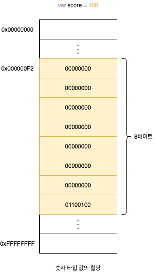

# 6. 데이터 타입

데이터 타입(타입)은 값의 종류를 말합니다. 자바스크립트의 모든 값은 데이터 타입을 갖습니다. 자바스크립트(ES6)는 7개의 데이터 타입을 제공합니다. 7개의 데이터 타입은 원시 타입(Primitive Type)과 객체 타입(Object/Reference Type)으로 분류할 수 있습니다.

| 구분      | 데이터 타입          | 설명                                                |
| --------- | -------------------- | --------------------------------------------------- |
| 원시 타입 | 숫자(Number) 타입    | 숫자. 정수와 시룻 구분 없이 하나의 숫자 타입만 존재 |
| 원시 타입 | 문자열(String) 타입  | 문자열                                              |
| 원시타입  | 불리언(Boolean) 타입 | 논리적 참(true)과 거짓(false)                       |
| 원시 타입 | undefined 타입       | var 키워드로 선언된 변수에 암묵적으로 할당되는 값   |
| 원시 타입 | null 타입            | 값이 없다는 것을 의도적으로 명시할 떄 사용하는 값   |
| 원시 타입 | 심벌(Symbol) 타입    | ES6에서 추가된 7번째 타입                           |
| 객체 타입 | 객체 타입            | 객체, 함수, 배열 등                                 |

## 6.1 숫자 타입

자바스크립트는 하나의 **숫자 타입**만 존재합니다. ECMAScript 사양에 따르면 숫자 타입의 값은 배정밀도 64비트 부동소수점 형식을 따릅니다. 즉, 모든 수를 실수로 처리하며, 정수만 표현하기 위한 데이터 타입(Integer Type)이 별도로 존재하지 않습니다.

```javascript
var integer = 10; // 정수
var double = 10.12; // 실수
var negative = -20; // 음의 정수

// 숫자 타입은 모두 실수로 처리됩니다.
console.log(1 === 1.0); // true
console.log(4 / 2); // 2
console.log(3 / 2); // 1.5
```

자바스크립트는 2진수, 8진수, 16진수를 표현하기 위한 데이터 타입을 제공하지 않기 때문에 이들 값을 참조하면 모두 10진수로 해석됩니다.

```javascript
var binary = 0b01000001;
var octal = 0o101;
var hex = 0x41;

// 표기법만 다를 뿐 모두 같은 값입니다.
console.log(binary); // 65
console.log(octal); // 65
console.log(hex); // 65
console.log(binary === octal); // true
console.log(octal === hex); // true
```

숫자 타입은 추가적으로 세 가지 특별한 값도 표현할 수 있습니다.

- `Infinity`: 양의 무한대
- `-Infinity`: 은의 무한대
- `NAN`: 산술 연산 불가(not-a-number)

### 추가 자료: NaN

> 추가 자료 출처: Effactive JavaScript - 데이브드 허먼

좌절스럽게도 `NaN` 값을 테스트하기는 특히나 어렵습니다. 두가지 이유가 있는데, 첫째로 자바스크립트 IEEE 부동 소수점 표준에 정의된 이상한 요구사항을 따라 `NaN` 자신을 동등하지 않다고 처리하기 때문입니다. 따라서 어떤 값이 `NaN`인지 테스트하기 위한 다음 식은 전혀 바르게 동작하지 않습니다.

```javascript
var x = NaN;
x === NaN; // false
```

게다가, 표준 `isNaN` 라이브러리 함수는 스스로 암묵적인 형변환, 즉 값을 테스트하기 전에 인자를 숫자로 바꾸기 때문에 신뢰할 만하지 않습니다. 이미 값이 숫자인지 알고 잇을 경우에는 `isNaN`으로 `NaN`으로 테스트할 수 있습니다. 하지만 `NaN`으로 강제 형변환할 수 있는 다른 값들은, 실제로 `NaN`이 아니라면 `isNaN`으로 구별할 수 없습니다.

```javascript
isNaN(NaN); // true
isNaN("foo"); // true
isNaN(undefined); // true
isNaN({}); // true
isNaN({ valueOf: "foo" }); // true
```

다행히도 다소 직관적이지는 않지만, `NaN`은 테스트하기 위한 간결하고 신뢰할 만한 코딩 관례가 있습니다. `NaN`은 자바스크립트에서 자기 자신과 동일하지 않은 유일한 값입니다. 다라서 값이 `NaN`인지 아닌지는 자기 자신과 동일함을 확인하여 테스트할 수 있습니다.

```javascript
var a = NaN;
a !== a; // true
```

## 6.2 문자열 타입

**문자열 타입**은 텍스트 데이터를 나타내는 데 사용합니다. 문자열은 0개 이상의 16비트 유니코드 문자(UTF-16)의 집합으로 전 세계 대부분의 문자를 표현할 수 있습니다. 문자열은 작은따옴표(''), 큰따옴표("") 또는 백틱(``)으로 텍스트를 감쌉니다.

```javascript
var string;
string = "문자열"; // 작은따옴표
string = "문자열"; // 큰따옴표
string = `문자열`; // 백틱(ES6)

string = '작은따옴표로 감싼 문자열 내의 "큰따옴표"는 문자열로 인식됩니다.';
string = "큰따옴표로 감싼 문자열 내의 '작은따옴표'는 문자열로 인식됩니다.";
```

C는 문자열 타입을 제공하지 앟고 문자의 배열로 문자열을 표현하고, 자바는 문자열을 객체로 표현합니다. 그러나 자바스크립트의 문자열은 원시 타입이며, 변경 불가능한 값(Immutable Value)입니다. 이것은 문자열이 생성되면 그 문자열을 변경할 수 없다는 것을 의미합니다.

## 6.3 템플릿 티러럴

ES6부터 **템플릿 리터럴**(Template Literal)이라고 하는 새로운 문자열 표기법이 도입되었습니다. 텔플릿 리터럴은 **멀티라인 문자열**(Multi-line String), **표현식 삽입**(Expression Interpolation), **태그드 탬플릿**(Tagged Template) 등 편리한 문자열 처리 기능을 제공합니다. 탬플릿 리터럴은 일반 문자열과 비슷해 보이지만 백틱(``)을 사용해 표현합니다.

### 6.3.1 멀티라인 문자열

일반 문자열 내에서는 줄바꿈(개행)이 허용되지 않습니다. 따라서 일반 문자열 내에서 줄바꿈 등의 공백을 표현하려면 백슬래시(\\)로 시작하는 **이스케이프 시퀀스**(Escape Sequence)를 사용해야 합니다.

| 이스케이프 시퀀스 | 의미                                                                             |
| ----------------- | -------------------------------------------------------------------------------- |
| `\0`              | Null                                                                             |
| `\b`              | 백스페이스                                                                       |
| `\f`              | 폼 피드(From Feed): 프린터로 출력할 경우 다음 페이지의 시작 지점으로 이동합니다. |
| `\n`              | 개행(Line Feed, LF): 다음 행으로 이동합니다.                                     |
| `\r`              | 개행(Carriage Return, CR): 커서를 처음으로 이동합니다.                           |
| `\t`              | 탭(수평)                                                                         |
| `\v`              | 탭(수직)                                                                         |
| `\uXXXX`          | 유니코드. 예를 들어 `\u0041`은 `A`입니다.                                        |
| `\'`              | 작은따옴표                                                                       |
| `\"`              | 큰따옴표                                                                         |
| `\\`              | 백슬래시                                                                         |

```javascript
// 이스케이프 시퀀스를 사용한 문자열
var template = '<ul>\n\t<li><a href="#">Home</a></li>\n</ul>';
console.log(template);
```

```javascript
// 탬플릿 리터럴
var template = `<ul>
  <li><a href="#">Home</a></li>
</ul>`;
console.log(template);
```

```
<ul>
  <li><a href="#">Home</a></li>
</ul>
```

### 6.3.2 표현식 삽입

문자열은 문자열 연산자 `+`를 사용해 연결할 수 있습니다. `+`연산자는 피연산자 중 하나 이상이 문자열인 경우 문자열 연결 연산자로 동작합니다. 그 외의 경우는 덧셈 연산자로 동작합니다.

```javascript
var first = "Ung-mo";
var last = "Lee";

console.log("My name is " + first + " " + last + "."); // My name is Ung-mo Lee.
```

탬플릿 리터럴 내에서는 **표현식 삽입**(Expression Interpolation)을 통해 간단히 문자열을 삽입할 수 있습니다. 이를 통해서 문자열 연산자보다 가독성 좋고 간편하게 문자열을 조합할 수 있습니다.

```javascript
var first = "Ung-mo";
var last = "Lee";

console.log(`My name is ${first} ${last}.`); // My name is Ung-mo Lee.
console.log(`1 + 2 = ${1 + 2}`); // 1 + 2 = 3
```

## 6.4 불리언 타입

**불리언 타입**의 값은 논리적 참, 거짓을 나타내는 `true`와 `false` 뿐입니다.

```javascript
var foo = true;
console.log(foo); // true

foo = false;
console.log(foo); // false
```

## 6.5 undefined 타입

**undefined 타입**의 값은 `undefined`가 유일합니다. 변수를 선언한 이후 값을 할당하지 않은 변수를 참조하면 `undefined`가 반환됩니다. `undefined`는 개발자가 의도적으로 할당하기 위한 값이 아니라 자바스크립트 엔진이 변수를 초기화할 때 사용하는 값입니다. 개발자가 의도적으로 변수에 할당한다면 본래 취지와 어긋날뿐더러 혼란을 줄 수 있으므로 권장하지 않습니다. 변수에 값이 없다는 것을 명시하고 싶다면 `null`을 할당합니다.

```javascript
var foo;
console.log(foo); // undefined
```

## 6.6 null 타입

프로그래밍 언어에서 `null`은 변수에 값이 없다는 것을 의도적으로 명시(의도적 부재)할 때 사용합니다. 변수에 `null`을 할당하는 것은 변수가 이전에 참조하던 값을 더 이상 참조하지 않겠다는 의미이며, 자바스크립트 엔진은 누구도 참조하지 않는 메모리 공간에 대해 가비지 콜렉션을 수행할 것입니다. 하지만 변수 스코프를 좁게 만들어 변수 자체를 재빨리 소멸시키는 편이 더 낫습니다.

```javascript
var foo = "Lee";
foo = null;
```

함수가 유효한 값을 반환할 수 없는 경우 명시적으로 `null`을 반환하기도 합니다.

```html
<!DOCTYPE html>
<html>
  <body>
    <script>
      var element = document.querySelector(".myClass");

      // HTML 문서에 myClass 클래스를 갖는 요소가 없다면 null을 반환합니다.
      console.log(element); // null
    </script>
  </body>
</html>
```

## 6.7 심벌 타입

**심벌**은 ES6에 추가된 7번째 타입으로, 변경 불가능한 원시 타입의 값입니다. 심벌 이외의 원시 값은 리터럴을 통해 생성하지만, 심벌은 Sybol 함수를 호출해 생성합니다. 이때 생성된 심벌 값은 외부에 노출되지 않으며, 다른 값과 절대 중복되지 않은 유일무이한 값입니다.

```javascript
// 심벌 값 생성
var key = Symbol("key");
console.log(typeof key); // symbol

// 객체를 생성합니다.
var obj = {};

// 이름이 충돌할 위험이 없는 유일무이한 값인 심벌을 프로퍼티 키로 사용합니다.
obj[key] = "value";
console.log(obj[key]); // key
```

## 6.8 객체 타입

자바스크립트는 객체 기반의 언어이며, 자바스크립트를 이루고 있는 거의 모든 것은 객체입니다. 지금까지 살펴본 6가지 원시 타입 이외의 값은 모두 객체 타입입니다. 이에 대해서는 아직 객체에 대해 살표보지 않았으므로 잠시 미뤄서 **11장 원시 값과 객체의 비교**에서 자세히 살펴보겠습니다.

## 6.9 데이터 타입의 필요성

### 6.9.1 데이터 타입에 의한 메모리 공간의 확보와 참조



값은 메모리에 저장하고 참조할 수 있어야 합니다. 메모리에 값을 저장하려면 먼저 확보해야 할 메모리 공간의 크기를 결정해야 합니다. 자바스크립트 엔진은 데이터 타입, 즉 값의 종류에 따라 정해진 크기의 메모리 공간을 확보합니다. 값을 참조하는 경우도 생각해봅시다. 식별자를 값이 저장되어 잇는 메모리 공간의 주소를 찾아 갈 수 있습니다. 정확히 말하자면 메모리 공간의 선두 메모리 셀의 주소를 찾아갈 수 있습니다. 이때 값을 참조하려면 한 번에 읽어 들여야 할 메모리 공간의 크기, 즉 메모리 셀의 개수(바이트 수)를 알아야 합니다. 단 ECMAScript 사양에 문자열 타입(2바이트)과 숫자 타입(8바이트) 이외의 원시 타입은 크기를 명확히 규정하고 있지는 않아서 브라우저 제조사의 구형에 따라 원시 타입의 크기는 다를 수 있습니다.

### 6.9.2 데이터 타입에 의한 값의 해석

뫃든 값은 데이터 타입을 가지며, 메모리에 2진수, 즉 비트의 나열로 저장됩니다. 메모리에 저장된 값은 데이터 타입에 따라 다르게 해석될 수 있습니다. 예를 들어, 메모리에 저장된 값 `0100 0001`을 숫자로 해석하면ㅇ `65`지만 문자열로 해석하면 `A`입니다.

## 6.10 동적 타이핑

C나 자바 같은 **정적 타입 언어**(Static/Strong Type)는 변수를 선언할 때 변수에 할당할 수 있는 값의 종류, 즉 데이터 타입을 사전에 선언해야 하빈다. 이를 **명시적 타입 선언**(Explicit Type Declaration)이라고 합니다. 정적 타입 언어는 변수의 타입을 변경할 수 없으며, 변수에 선언한 타입에 맞는 값만 할당할 수 있습니다. 정적 타입 언어는 컴파일 시점에서 **타입 체크**(선언한 데이터 타입에 맞는 값을 할당했는지 검사하는 처리)를 수행합니다. 이를 통해 타입의 일관성을 강제함으로써 더욱 안정적이 코드의 구현을 통해 런타임에 발생하는 에러를 줄입니다.

자바스크립트는 정적 타입 언어와 다르게 변수를 선언할 때 타입을 선언하지 않습니다. 다만 `var`, `let`, `const` 키워드를 사용해 변수를 선언할 뿐입니다. 자바스크립트의 변수는 정적 타입 언어와 같이 미리 선언한 데이터 타입의 값만 할당할 수 있는 것이 아니라, 어떠한 데이터 타입의 값이라도 자유롭게 할당할 수 있습니다. `typeof` 연산자로 변수를 연산하면 변수에 할당된 값의 데이터 타입을 반환합니다.

```javascript
var foo;
console.log(typeof foo); // undefined

foo = 3;
console.log(typeof foo); // number

foo = "Hello";
console.log(typeof foo); // string

foo = true;
console.log(typeof foo); // boolean

foo = null;
console.log(typeof foo); // object

foo = Symbol();
console.log(typeof foo); // symbol

foo = {};
console.log(typeof foo); // object

foo = [];
console.log(typeof foo); // object

foo = function () {};
console.log(typeof foo); // function
```

자바스크립트의 변수는 선언이 아닌 할당에 의해 타입이 결정(타입 추론)됩니다. 그리고 재할당에 의해 변수의 타입은 언제든지 동적으로 변할 수 있습니다. 이러한 특징을 **동적 타이핑**(Dynamic Typing)이라 하며, 자바스크립트를 정적 타입 언어와 구별하기 위해 **동적 타입 언어**(Dynamic/Weak Type)라고 합니다. 다시 말해, 기본적으로 자바스크립트 변수는 타입을 갖지 않습니다. 하지만 값은 타입을 갖습니다. 따라서 현재 변수에 할당되어 있는 값에 의해 변수의 타입이 동적으로 결정된다고 표현하는 것이 적절합니다.

### 6.10.2 동적 타입 언어와 변수

동적 타입의 언어의 변수는 값을 확인하기 전에는 타입을 확신할 수 없습니다. 그리고 잘못된 예측에 의해 작성된 프로그램은 오류를 뿜어낼 것입니다. 동적 타입 언어는 **유연성**은 높지만 **신뢰성**은 떨어집니다.

- 변수는 꼭 필요한 경우에 한해 제한적으로 사용합니다. 동적 타입 언어는 타입을 잘못 예측해 오류가 발생할 가능성이 크고, 변수의 개수가 많으면 많을수록 발생 확률도 높습니다.
- 변수의 유효 범위(스코프)는 최대한 좁게 만들어 변수의 부작용을 억제해야 합니다. 변수의 유효 범위가 넓으면 넓을수록 오류 발생 확률도 높아집니다.
- 전역 변수는 최대한 사용하지 않도록 합니다. 어디서든지 참조/변경 가능한 전역 변수는 프로그램의 복잡성을 증가시키고 처리 흐름을 추적하기 어렵게 면들며 오류가 발생할 경우 오류의 원인을 특정하기 어렵게 만듭니다.
- 변수보다는 상수를 사용해 값의 변경을 억제합니다.
- 변수 이름뿐 아니라 모든 식별자는 목적이나 존재 이유를 파악할 수 있는 적절한 이름으로 지어야 합니다.
