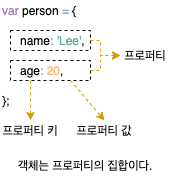

# 10. 객체 리터럴

## 10.1 객체란

자바스크립트는 **객체 기반**의 프로그래밍 언어이며, 원시 값을 제외한 모든 것이 객체입니다. 원시 타입은 단 하나의 값만 나타내지만 **객체 타입**(Object/Reference Type)은 다양한 타입의 값(원시 값 또는 다른 객체)를 하나의 단위로 구성한 복합적인 자료구조입니다. 또한 원시 값은 변경 불가능한 값(Immutable Value)이지만 객체는 **변경 가능한 값**(Mutable Value)ㅇ;ㅂㄴ;디/



객체는 0개 이상의 **프로퍼티**로 구성된 집합이며, 프로퍼티는 **키**(Key)와 **값**(Value)으로 구성됩니다. 자바스크립트에서 사용할 수 잇는 모든 값은 프로퍼티 값이 될 수 있습니다. 프로퍼티 값이 함수일 경우, 일반 함수와 구분하기 위해 **메서드**(methoe)라 부릅니다.


- **프로퍼티:** 객체의 상태를 나타내는 값(data)
- **메서드:** 프로퍼티를 참조하고 조작할 수 있는 동작(behavior)

## 10.2 객체 리터럴에 의한 객체 생성

자바스크립트는 **프로토타입 기반** 객체지향 언어로서 클래스 기반 객체지향 언어와는 달리 다양한 객체 생성 방법을 지원합니다.

1. 객체 리터럴
2. Object 생성자 함수
3. 생성자 함수
4. `Obejct.create` 메서드
5. 클래스(ES6)

이러한 객체 생성 방법 중에서 가장 일반적이고 간단한 방법은 객체 리터럴을 사용하는 방법입니다. 객체 리터럴은 중괄호(`{...}`) 내에 0개 이상의 프로퍼티를 정의합니다. 변수에 할당되는 시점에 자바스크립트 엔진은 객체 리터럴을 해석해 객체를 생성합니다. 객체 리터럴의 주괄호는 코드 블록을 의미하지 않습니다. 따라서 객체 리터럴의 닫는 중괄호 뒤에는 **세미콜론**을 붙입니다.

```javascript
var person = {
  name: "Lee",
  sayHello: function () {
    console.log(`Hello!, My name is${this.name}.`);
  },
};

console.log(typeof person); // object
console.log(person); // { name: "Lee", sayHello: f }
```

객체 리터럴은 자바스크립트의 유연함과 강력함을 대표하는 객체 생성 방식입니다. 객체 리터럴에 프로퍼티를 포함시켜 객체를 생성함과 동시에 프로퍼티를 만들 수 있고, 객체를 생성한 이후에 프로퍼티를 동적으로 추가할 수도 있습니다.

## 10.3 프로퍼티

객체는 프로퍼티의 집합이며, 프로퍼티는 키와 값으로 구성됩니다. 프로퍼티를 나열할 때는 쉼표(`,`)로 구분합니다. 일반적으로 마지막 프로퍼티 뒤에는 쉼표를 사용하지 않으나 사용해도 좋습니다. 프로퍼티 키와 프로퍼티 값으로 사용할 수 있는 값은 다음과 같습니다.

- **프로퍼티 키:** 빈 문자열을 포함하는 모든 문자열 또는 심벌 값
- **프로퍼티 값:** 자바스크립트에서 사용할 수 있는 모든 값

키를 문자열로 사용할 경우, 자바스크립트에서 사용 가능한 이름인 경우 따온표를 생략할 수 있습니다. 반대로 말하면 식별자 네이밍 규칙을 따르지 않는 이름에는 반드시 따옴표를 사용해야 합니다. 따라서 가급적 식별자 네이밍 규칙을 준사하는 프로퍼티 키를 사용할 것을 권장합니다.

```javascript
var person = {
  firstName: "Ung-mo", // 식별자 네이밍 규칙을 준수하는 프로퍼티 키
  "last-name": "Lee", // 식별자 네이밍 규칙을 주수하지 않는 프로퍼티 키
};
```

문자열 또는 문자열로 평가할 수 잇는 표현식을 사용해 프로퍼티 키를 대괄호(`[...]`)로 묶어 동적으로 생성할 수도 있습니다.

```javascript
var obj = {};
var key = "hello";

obj[key] = "world";

console.log(obj); // { hello: "world" }
```

빈 문자열을 프로퍼티 키로 상요해도 에러가 발생하지 않으나, 의미를 갖지 못하므로 권장하지 않습니다.

```javascript
var foo = {
  "": "",
};

console.log(foo); // { "": "" }
```

프로퍼티 키에 문자열이나 심벌 값 외에 값을 사용하면 암묵적으로 타입 변환을 통해 문자열이 됩니다.

```javascript
var foo = {
  0: 1,
  1: 2,
  2: 3,
};

console.log(foo); // { 0: 1, 1: 2, 2: 3 }
```

var, function과 같은 **예약어**를 프로퍼티 키로 사용해도 에러가 발생하지 않으나, 예상치 못한 에러가 발생할 여지가 있으므로 권장하지 않습니다.

```javascript
var foo = {
  var: "",
  function: "",
};

console.log(foo); // { var: "", function: "" }
```

이미 존재하는 프로퍼티 키를 중복 선언하면 나중에 선언한 프로퍼티가 먼저 선언한 프로퍼티를 덮어씁니다.

```javascript
var foo = {
  name: "Lee",
  name: "Kim",
};

console.log(foo); // { name: "Kim" }
```

## 10.4 메서드

메서드는 객체에 묶여 잇는 함수를 의미합니다. 함수는 **12장 함수**에서 자세히 살펴봅니다. 메서드 내부에서 사용하는 `this` 키워드는 객체 자신을 가리키는 **참조변수**입니다. **22장 this**에서 자세히 살펴좁니다.

```javascript
var circle = {
  radius: 5,
  getDiameter: function () {
    return 2 * this.radius;
  },
};

console.log(circle.getDiameter()); // 10
```

## 10.5 프로퍼티 접근

- **마침표 표기법:** 마침표 프로퍼티 접근 연산자(`.`)를 사용합니다.
- **대괄호 표기법:** 대괄호 프로퍼티 접근 연산자(`[ ... ]`)를 상요합니다.

르포퍼티 접근 연산자의 좌측에는 객체로 평가되는 표현식을 기술하고, 우측 또는 대괄호 내부에는 프로퍼티 키를 지정합니다. 대괄호 표기법을 사용하는 경우 프러퍼티 키는 반드시 따옴표로 감싼 문자열이어야 합니다. 그렇지 않으면 식별자로 해석합니다.

```javascript
var person = {
  name: "Lee",
};

// 마침표 표기법에 의한 프로퍼티 접근
console.log(person.name); // Lee
// 대괄호 표기법에 의한 프로퍼티 접근
console.log(person["name"]);

//  존재하지 않는 프로퍼티에 접근
console.log(person.age); // undefined
```

프로퍼티 키가 식별자 네이밍 규칙을 준수하지 않는 이름은 반드시 대괄호 표기법을 사용해야 합니다. 단, 프로퍼티 키가 숫자로 이뤄진 문자열인 경우 따옴표를 생략할 수 있습니다.

```javascript
var person = {
  "last-name": "Lee",
  1: 10,
};

console.log(person["last-name"]); // Lee
console.log(person[1]); // 10
```

## 10.6 프로퍼티 값 갱신

이미 존재하는 프로퍼티에 값을 할당하면 프로퍼티 값이 갱신됩니다.

```javascript
var person = {
  name: "Lee",
};

person.name = "Kim";

console.log(person); // { name: "Kim" }
```

## 10.7 프로퍼티 동적 생성

존재하지 않는 프로퍼티에 값을 할당하면 프러파티가 동적으로 생성되어 추가ㅚ고 값이 할당됩니다.

```javascript
var person = {
  name: "Lee",
};

person.age = 20;

console.log(person); // { name: "Lee", age: 20 }
```

## 10.8 프로퍼티 삭제

**delete 연산자**는 객체의 프로퍼티를 삭제합니다. 만약 존재하지 않는 프로퍼티를 삭제하면 아무런 에러 없이 무시됩니다.

```javascript
var person = {
  name: "Lee",
};

person.age = 20;
delete person.age;
delete person.address;

console.log(person); // { name: "Lee" }
```

## 10.9 ES6에서 추가된 객체 리터럴의 확장 기능

### 10.9.1 프로퍼티 축약 표현

ES6에서는 프로퍼티 값으로 변수를 사용하는 경우 변수 이름과 프러퍼티 키가 동일한 이름일 때 프로퍼티 키를 **생략**할 수 있습니다.

```javascript
var x = 1;
var y = 1;

const obj = { x, y };

console.log(obj); // { x: 1, y: 2 }
```

### 10.9.2 계산된 프로퍼티 이름

문자열 또는 문자열로 타입 변환할 수 있는 값으로 평가되는 표현식을 사용해 프로퍼티 키를 동적으로 생성할 수도 있습니다. 단, 프로퍼티 키로 사용할 표현식을 대괄호(`[ .. ]`)로 묶어야 합니다. 이를 **계산된 프로퍼티 이름**(Computed Property Name)이라 합니다.

```javascript
var prefix = "prop";

// ES5
var i = 0;
var obj_es5 = {};

obj[prefix + "-" + ++i] = i;
obj[prefix + "-" + ++i] = i;
obj[prefix + "-" + ++i] = i;

// ES6
i = 0;

var obj_es6 = {
  [`${prefix}-${++i}`]: i,
  [`${prefix}-${++i}`]: i,
  [`${prefix}-${++i}`]: i,
};

console.log(obj_es5); // { prop-1: 1, prop-2: 2, prop-3: 3 }
console.log(obj_es5); // { prop-1: 1, prop-2: 2, prop-3: 3 }
```

### 10.7.3 메서드 단축 표현

ES6에서는 메서드를 정의할 때 function 키워드를 생략한 **축약 표현**을 사용할 수 있습니다. 축약 표현으로 정의한 메서드는 프로퍼티에 할당한 함수와 다르게 동작합니다. 이에 대하여 **26.2절 메서드**에서 자세히 살펴봅니다.

```javascript
// ES5
var obj_es5 = {
  name: "Lee",
  sayHi: function () {
    console.log("Hi! " + this.name);
  },
};

// ES6
var obj = {
  name: "Lee",
  sayHi() {
    console.log("Hi! " + this.name);
  },
};
```
