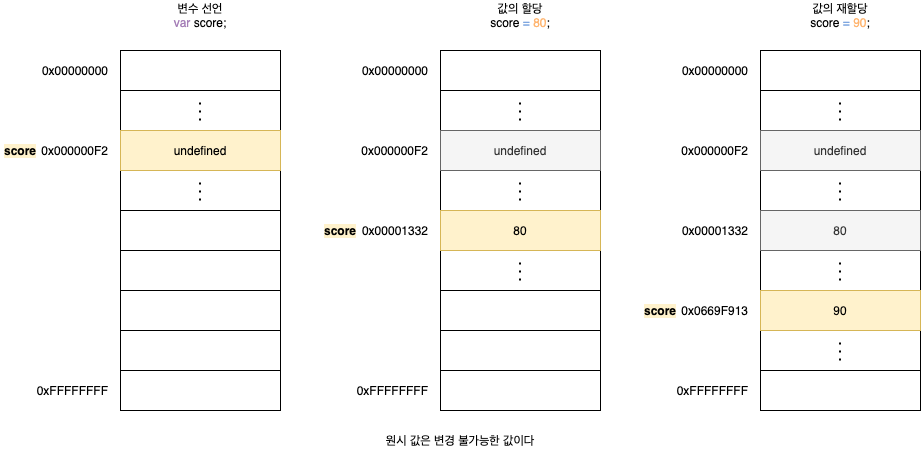
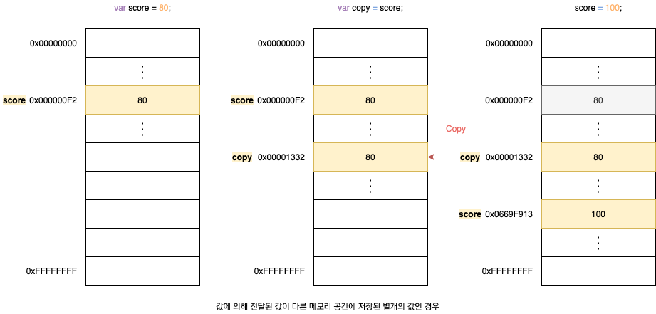
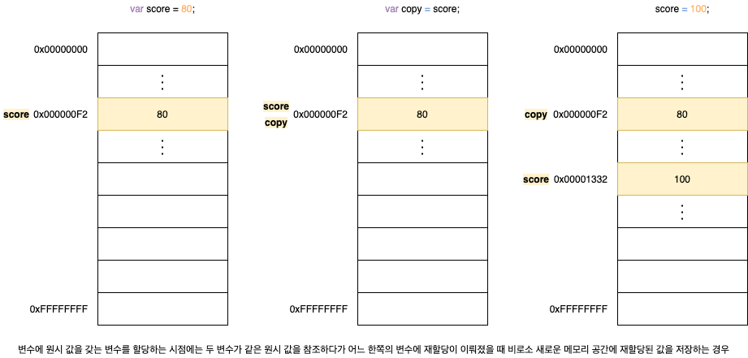
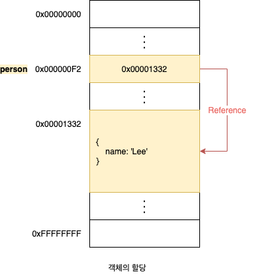
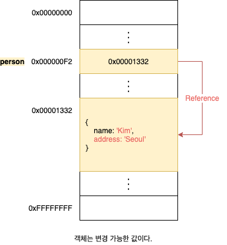
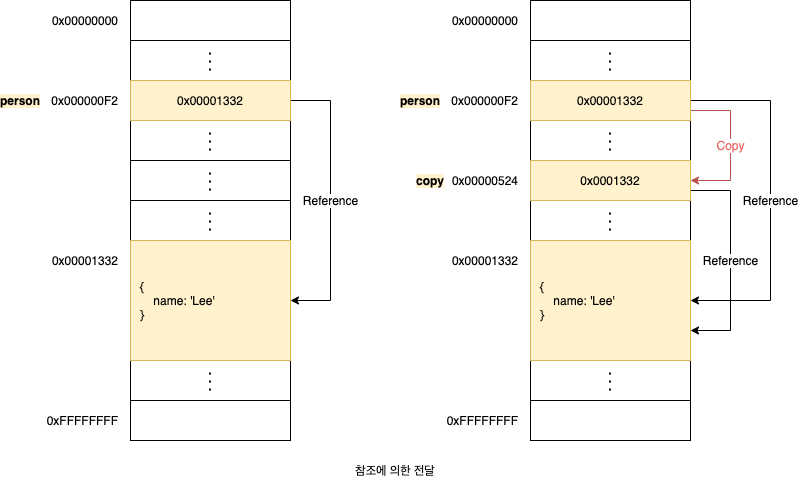

# 11. 원시 값과 객체의 비교

자바 스크립트에서 제공하는 7가지 데이터 타입은 크게 **원시 타입**(Primitive Type)과 **객체 타입**(Object.Reference Type)으로 구분할 수 있습니다.

## 11.1 원시 값

### 11.1.1 변경 불가능한 값

원시 값은 **변경 불가능한 값**(Immutable Value)이며 **읽기 전용**(Read Only) 값입니다. 이 말은 원시 값 자체를 변경할 수 없다는 것이지 변수 값을 변경할 수 없다는 것은 아닙니다. **4.5 값의 할당**에서 살표보았듯이 원시 값을 할당한 변수에 새로운 값을 재할당하면 메모리 공간에 저장되어 있는 재할당 이전의 원시 값을 변경하는 것이 아니라 새로운 메모리 공간을 확보하고 재할당한 원시 값을 저장한 후, 변수는 새롭게 재할당한 원시 값을 가리킵니다. 값의 이러한 특성을 **불변성**이라 합니다.



변수의 상대 개념인 상수는 재할당이 금지된 변수를 말합니다. 상수도 값을 저장하기 위한 메모리 공간이 필요하므로 변수라고 할 수 있습니다. 단, 변수는 언제든지 재할당을 통해 변수 값을 변경(교체)할 수 잇지만 상수는 단 한 번만 할당이 허용되므로 변수 값을 변경(교체)할 수 없습니다.

### 11.1.2 문자열과 불변성

원시 값인 문자열은 다른 원시 값과 비교할 때 독특한 특징이 있습니다. 문자열은 0개 이상의 **문자**(Character)로 이뤄진 집합을 말하며, 1개의 문자는 2바이트의 메모리 공간에 저장됩니다. 따라서 문자열은 몇 개의 문자로 이뤄졌냐에 따라 필요한 메모리 공간의 크기가 결정됩니다.

자바스크립트의 문자열은 **원시 타입**이며, 변경 불가능합니다. 따라서 이미 생성된 문자열의 일부 문자를 변경해도 반영되지 않습니다. 이는 데이터의 신뢰성을 보장합니다. 그러나 변수에 새로운 문자열을 재할당하는 것은 물론 가능합니다. 이는 기존 문자열을 변경하는 것이 아니라 새로운 문자열을 새롭게 할당하는 것이기 때문입니다.

```javascript
var string = "string";

// 문자열은 유사 배열이므로 배열과 유사하게 인덱스를 사용해 각 문자에 접근할 수 있습니다.
str[0] = "S";

console.log(str); // string
```

> 유사 배열 객체란 마치 배열처럼 인덱스로 프로퍼티 값에 접근할 수 있고 `length` 프로퍼티를 갖는 객체를 말합니다. 문자열은 마치 배열처럼 인덱스를 통해 각 문자에 접근할 수 있으며, `lnegth` 프로퍼티를 갖기 때문에 유사 배열 객체이고 `for` 문으로 순회할 수 있습니다.

### 11.1.3 갑에 의한 전달

변수에 원시 값을 갖는 변수를 항당하면 할당받는 변수에는 할당되는 변수의 원시 값이 복사되어 전달됩니다. 이를 **값에 의한 전달**이라 합니다. ECMAScript 사양에는 변수를 통해 메모리를 어떻게 관리해야 하는지 명확하게 정의되어 있지 않습니다. 따라서 자바스크립트 엔진을 구현하는 제조사에 따라 실제 내부 동작 방식은 미묘한 차이가 있을 수 있습니다. 대표적으로 두가지 평가 방식이 있습니다.

1. 새로운 값을 생성해서 메모리 주소를 전달하는 방식. 이 방식은 할당 시점에 두 변수가 기억하는 메모리 주사가 다릅니다.
2. 기존 값의 메모리 주소를 그대로 전달하는 방식. 이 방식은 할당 시점에 두 변수가 기억하는 메모리 주소가 같습니다.

```javascript
var score = 80;
var copy = score;

console.log(score, copy); // 80 80
console.log(score === copy); // true

scroe = 100;

console.log(score, copy); // 100 80
console.log(score === copy); // false
```





참고로 **값에 의한 전달**이라는 용어는 자바스크립트를 위한 용어가 아니므로 사실 오해가 있을 수도 있습니다. 엄격하게 표현하면 변수에는 값이 전달되는 것이 아니라 메모리 주소가 전달되기 때문입니다. 이는 변수와 같은 식별자는 값이 아니라 메모리 주소를 기억하고 있기 때문입니다. 이처럼 **값에 의한 전달**도 값을 전달하는 것이 아니라 메모리 주소를 전달합니다. 단, 전달된 메모리 주소를 통해 메모리 공간에 접근하면 값을 참조할 수 있습니다. 중요한 것은 두 변수 중 어느 하나의 변수에 값을 재할당하는 시점에서 결국 두 변수의 원시 값은 서로 다른 메모리 공간에 저장된 별개의 값이 되어 어느 한쪽에서 재할당을 통해 값을 변경하더라도 서로 간섭할 수 없다는 것입니다.

## 11.2 객체

객체는 프로퍼티의 개수가 정해져 있지 않으며, 동적으로 추가되고 삭제할 수 있습니다. 또한 프로퍼티의 값에도 제약이 없습니다. 따라서 객체는 원시 값과 같이 확보해야 할 메모리 공간의 크기를 사전에 정해 둘 수 없습니다.

### 11.2.1 변경 가능한 값

객체를 할당한 변수가 기억하는 메모리 주소를 통해 메모리 공간에 접근하면 **참조 값**(Reference Value)에 접근할 수 있습니다. 참조 값은 생성된 객체가 저장된 메모리 공간의 주소입니다. 객체를 할당한 변수를 참조하면 메모리에 저장되어 있는 참조 값을 통해 실제 객체에 접근합니다.

```javascript
var person = {
  name: "Lee",
};

console.log(person); // { name: "Lee" }
```



객체는 변경 가능한 값이므로 메모리에 저장된 객체를 직접 수정할 수 있습니다. 이 때 객체를 할당한 변수에 재할당을 하지 않았으므로 객체를 할당한 변수의 참조 값은 변경되지 않습니다.

```javascript
var person = {
  name: "Lee",
};

person.name = "Kim";
person.address = "Seoul";

console.log(person); // { name: "Kim", address: "Seoul" }
```



객체를 생성하고 관리하는 방식은 매우 복잡하며 비용이 많이 듭ㄴ디ㅏ. 객체를 변경할 때마다 원시 값처럼 이전 값을 복사해서 새롭게 생성한다면 명확하고 신뢰성이 확보되겠지만 비용이 많이 듭니다. 다시 말해, 메모리의 효율적 소비가 어렵고 성능이 나빠집니다. 따라서 메모리를 효율적으로 사용하기 위해, 객체는 변경 가능한 값으로 설계되어 있습니다. 하지만 원시 값과는 다르게 여러 개의 식별자가 하나의 객체를 공유할 수 있다는 부작용이 있습니다.

### 추가자료: 얕은 복사와 깊은 복사

객체를 프로퍼티 값으로 갖는 객체의 경우 얕은 복사는 한 단계까지만 복사하는 것을 말하고, 깊은 복사는 객체의 중첩되어 있는 객체까지 모두 복사하는 것을 말합니다. 얕은 복사는 객체에 중첩되어 있는 객체의 경우 참조 값을 복사하고, 깊은 복사는 객체에 중첩되어 있는 객체까지 모두 복사해서 원시 값처럼 완전한 복사본을 만든다는 차이가 있습니다.

```javascript
const o = { x: { y: 1 } };

const c1 = { ...o }; // 35장 스프레드 문법 참고
console.log(c1 === o); // false
console.log(c1.x === o.x); // true

const _ = require("lodash"); // npm install lodash
const c2 = _.cloneDeep(o);
console.log(c2 === o); // false
console.log(c2.x === o.x); // false
```

참고로 객체를 할당한 변수를 다른 변수에 할당하는 것을 얕은 복사라고 부르는 경우도 있습니다.

```javascript
const o = { x: 1 };
const c = o;

console.log(c === o); // true
```

### 11.2.2 참조에 의한 전달

객체를 가리키는 변수를 다른 변수에 할당하면 원본의 참조 값이 복사되어 잔달됩니다. 이를 **참조에 의한 전달**이라 합니다. 이것은 두 개의 식별자가 하나의 객체를 공유한다는 것을 의미합니다. 따라서 원본 또는 사본 중 어느 한 쪽에서 객체를 변경하면 서로 영향을 주고받습니다.

```javascript
var person = {
  name: "Lee",
};

var copy = person;
```



결국 **값에 의한 전달**과 **참조에 의한 전달**은 식별자가 기억하는 메모리 공간에 저장되어 있는 값을 복사해서 전달한다는 면에서 동일합니다. 다만 식별자가 기억하는 메모리 공간, 즉 변수에 저장되어 있는 값이 원시 값이냐 참조 값이냐의 차이만 있을 뿐입니다. 따라서 자바스크립트에는 **참조에 의한 전달**은 존재하지 않고, **값에 의한 전달**만이 존재한다고 말할 수 있습니다.
