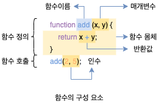
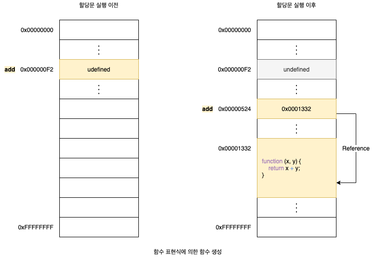
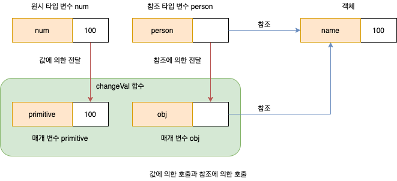
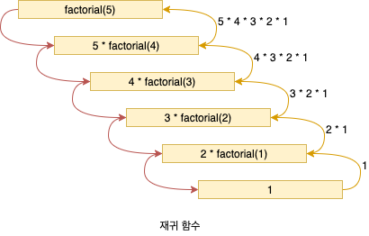

# 12. 함수

## 12.1 함수란?

프로그래밍 언어의 함수는 일련의 과정을 **문**(Statement)으로 구현하고 코드 블록으로 감싸서 하나의 실행 단위로 정의한 것입니다. 이때 함수 내부로 입력을 전달받는 변수를 **매개 변수**(Parameter), 입력을 **인수**(Aragument), 출력을 **반환값**(Return Value)이라 합니다. 또한 함수는 값이며, 여러 개 존재할 수 있으므로 특정 함수를 구별하기 위해 식별자인 함수 이름을 사용할 수 있습니다.

함수는 **함수 정의**(Function Definition)를 통해 생성합니다. 그리고 인수(Argument)를 매개변수를 통해 함수에 전달하면서 함수의 실행을 명시적으로 지시해야 합니다. 이를 **함수 호출**이라고 합니다. 함수를 호출하면 코드 블록에 담긴 문들이 일괄적으로 실행되고 반환값을 반환합니다.



```javascript
// 함수 정의
function add(x, y) {
  return x + y;
}

// 함수 호출
var result = add(1, 5);
console.log(result); // 7
```

## 12.2 함수를 사용하는 이유

함수는 몇 번이든 호출할 수 있으므로 **코드의 재사용**이라는 측면에서 매우 유용합니다. 동일한 작업을 반복적으로 수행해야 한다면 같은 코드를 중복해서 여러 번 작성하는 것이 아니라 미리 정의된 함수를 재사용하는 것이 효율적입니다. 코드의 중복을 억제하고 재사용성을 높이는 함수는 **유지보수의 편의성**을 높이고 실수를 줄여 **코드의 신뢰성**을 높이는 효과가 있습니다.

## 12.3 함수 리터럴

함수 리터럴은 평가되어 값을 생성하며, 이 값은 객체입니다. 즉, **함수는 객체**입니다. 함수는 객체지만 일반 객체와는 다릅니다. 일반 객체는 호출할 수 없지만 함수는 호춣할 수 있습니다. 그리고 일반 객체에는 없는 함수 객체만의 고유한 프로퍼티를 갖습니다. 함수가 객체라는 사실은 다른 프로그래밍 언어와 구별되는 자바스크립트의 중요한 특징입니다. 이에 대해서는 **18장 함수와 일급 객체**에서 자세히 살펴봅니다.

```javascript
// 변수에 함수 리터럴을 할당
var f = function add(x, y) {
  return x + y;
};
```

1. **함수 이름**
   - 함수 이름은 식별자입니다. 따라서 식별자 네이밍 규칙을 준수해야 합니다.
   - 함수 이름은 함수 몸체 내에서만 참조할 수 있는 식별자입니다.
   - 함수 이름은 생략할 수 있습니다. 이름이 있는 함수를 **기명 함수**(Named Function), 이름이 없는 함수를 **무명/익명 함수**(Anonymous Function)라 합니다.
2. **매개변수 목록**
   - 0개 이상의 매개변수를 소괄호로 감싸고 쉼표로 구분합니다.
   - 각 매개변수에는 함수를 호출할 때 지정한 인수가 순서대로 할당됩니다. 즉, 매개변수 목록은 순서에 의미가 있습니다.
   - 매개변수는 함수 몸체 내에서 변수와 동일하게 취급됩니다. 따라서 매개변수도 변수와 마찬가지로 식별자 네이밍 규칙을 준수해야 합니다.
3. **함수 몸체**
   - 함수가 호출되었을 때 일괄저긍로 실행될 문들을 하나의 실행 단위로 정의한 코드 블록입니다.
   - 함수 몸체는 함수 호출에 의해 실행됩니다.

## 12.4 함수 정의

함수 정의란 함수를 호출하기 이전에 인수는 전달받을 매개변수와 실행할 문들, 그리고 반환할 값을 지정하는 것을 말합니다. 정의된 함수는 자바스크립트 엔진에 의해 평가되어 함수 객체가 됩니다. 함수를 정의하는 방법에는 4가지가 있습니다.

1. 함수 선언문
2. 함수 표현식
3. `Function` 생성자 함수
4. 화살표 함수(ES6)

### 12.4.1 함수 선언문

함수 선언문은 함수 리터럴과 형태가 동일합니다. 단, 함수 리터럴은 함수 이름을 생략할 수 있으나 함수 선언문은 함수 이름을 생략할 수 없습니다.

```javascript
function add(x, y) {
  return x + y;
}
```

함수 선언문은 표현식이 아닌 문입니다. 표현식이 아닌 문은 변수에 할당할 수 없습니다. 하지만 다음 예제를 실행해보면 함수 선언문이 변수에 할당되는 것처럼 보입니다.

```javascript
var add = function add(x, y) {
  return x + y;
};
```

이렇게 동작하는 이유는 자바스크립트 엔진이 코드의 문맥에 따라 동일한 함수 리터럴을 표현식이 아닌 문인 함수 선언문으로 해석하는 경우와 표현식인 문인 함수 리터럴 표현식으로 해석하는 경우가 있기 때문입니다. 기명 함수 리터럴은 중의적인 코드입니다. 따라서 코드의 문맥에 따라 해석이 달라질 수 있습니다. 자바스크립트 엔진은 함수 이름이 있는 함수 리커럴을 단독으로 사용(값으로 평가되어야 하는 문맥에서 함수 리터럴을 사용하지 않는 경우, 다시 말해 함수 리커럴을 피연산자로 사용하지 않는 경우)라면 함수 선언문으로 해석하고, 함수 리터럴이 값으로 평가되어야 하는 문맥에서는 함수 리터럴 표현식으로 해석합니다. 이때 한수 선언문이든 함수 리터럴 표현식이든 함수가 생성되는 것은 동일합니다. 하지만 함수를 생성하는 내부 동작에 차이가 있습니다.

```javascript
// 기명 함수 리터럴을 단독으로 사용하면 함수 선언문으로 해석됩니다.
function foo() {
  console.log("foo");
}
foo(); // foo

// 함수 리터럴을 피연산자로 사용하면 함수 선언문이 아니라 함수 리터럴 표현식으로 해석됩니다.
(function bar() {
  console.log("bar");
});
bar(); // ReferenceError
```

함수는 함수 이름으로 로출하는 것이 아니라 함수 객체를 가리키는 식별자로 호출합니다. 함수 몸체 외부에서 함수 이름으로 함수를 참조할 수 없습니다. 따라서 위 예제의 `bar` 식별자가 없다는 것과 마찬가지이며 호출할 수 없습니다. 하지만 위 예제에서 함수 선언문으로 정의된 함수는 `foo`라는 이름으로 호출할 수 있습니다. 자바스크립트 엔진은 함수 선운문을 해석할 때 생성된 함수를 호출하기 위해 함수 이름과 동일한 이름의 식별자를 암묵적으로 생성하고, 거기에 함수 객체를 할당합니다.

### 12.4.2 함수 표현식

자바스크립트의 함수는 객체 타입이기 때문에 변수에 할당할 수도 있고 프로퍼티 갑싱 될 수도 있으며 배열의 요소가 될 수도 있습니다. 이처럼 값의 설질을 갖는 객체를 **일급 객체**라고 합니다. 자바스크립트의 함수는 일급 객체이므로 함수 리터럴로 생성한 함수 객체를 변수에 할당할 수 있습니다. 이러한 함수 정의 방식을 **함수 표현식**(Function Expression)이라 합니다. 함수 리터럴의 함수 이름은 생략할 수 있습니다. 이러한 함수를 **익명 함수**라 합니다. 함수 표현식의 함수 리터럴은 함수 이름을 생략하는 것이 일반적입니다.

```javascript
var add = function (x, y) {
  return x + y;
};
```

### 12.4.3 함수 생성 시점과 함수 호이스팅

```javascript
// 함수 참조
console.dir(add); // f add(x, y)
console.dir(sub); // undefined

function add(x, y) {
  return x + y;
}

var sub = function (x, y) {
  return x - y;
};
```

함수 선운문으로 정의한 함수와 함수 표현식으로 정의한 함수의 생성 시점은 다릅니다. 모든 선언문이 그렇듯 함수 선언문도 코드가 한 줄씩 순차적으로 실행되는 시점인 **런타임**(Runtime) 이전에 자바스크립트 엔진에 의해 먼저 실행됩니다. 그리고 자바스크립트 엔진은 함수 이름과 동일한 이름의 식별자를 암묵적으로 생성하고 생성된 함수 객체를 할당합니다. 즉, 런타임에는 이미 함수 객체가 생성되어 있고 함수 이름과 동일한 식별자에 할당까지 완료된 상태입니다. 따라서 함수 선언문 이전에 함수를 찹조할 수 있으며 호출할 수도 있습니다. 이처럼 한수 선언문이 코드의 선두로 끌어 올려진 것처럼 동작하는 자바스크립트 고유의 특징을 **함수 호이스팅**(Function Hoisting)이라 합니다.

함수 표현식은 변수에 할당되는 값이 함수 리터럴인 문입니다. 따라서 함수 표현식은 변수 선언문과 변수 할당문을 한 번에 기술한 축약 표현과 동일하게 동작합니다. 변수 선언은 런타임 이전에 실행되어 `undefined`로 초기화되지만 변수 할당문의 값은 할당문이 실행되는 시점, 즉 런타임에 평가되므로 함수 표현식의 함수 리터럴도 할당문이 실행되는 시점에 평가되어 함수 객체가 됩니다. 따라서 함수 표현식으로 홤수를 정의하면 함수 호이스팅이 발생하는 것이 아니라 **변수 호이스팅**이 발생합니다.



### 12.4.4 Function 생성자 함수

자바스크립트가 기본 제공하는 빌트인 함수인 `Function` 생성자 함수에 매개변수 목록과 함수 몸체를 문자열로 전달하면서 `new` 연산자와 함께 호출하면 함수 객체를 생성해서 반환합니다. `new` 연산자 없이 호출해도 결과는 동일합니다. `Function` 생성자 함수로 함수를 생성하는 방식은 일반적이지 않으며 바람직하지도 않습니다. **클로저**(Closure)를 생성하지 않는 등, 함수 선언문이나 함수 표현식으로 생성한 함수와 다르게 동작하기 때문입니다.

```javascript
var add1 = (function () {
  var a = 10;
  return function (x, y) {
    return x + y + a;
  };
})();

var add2 = (function () {
  var a = 10;
  return new Function("x", "y", "return x + y + a;");
})();

console.log(add1(1, 2)); // 13
console.log(add2(1, 2)); // ReferenceError: a is not defined
```

### 12.4.5 화살표 함수

ES6에서 도입된 **화살표 함수**(Arrow Function)는 `function` 키워드 대신 화살표(Fat Arrow) `=>`를 사용해 좀 더 간략한 방법으로 함수를 선언할 수 있습니다. 화살표 함수는 기존의 함수 선언문 또는 함수 표현식을 대체하기 위해 디자인된 것은 아닙니다. 화살표 함수는 생성자 함수로 사용할 수 없으며, 기존 함수와 `this` 바인딩 방식이 다르고, `prototype` 프로퍼티가 없으며 `arguments` 객체를 생성하지 않습니다. **26.3절 화살표 함수**에서 자세히 살펴보기로 합니다.

```javascript
const add = (x, y) => x + y;
console.log(add(2, 5)); // 7
```

## 12.5 함수 호출

함수는 함수를 가리키는 식별자와 한 쌍의 소괄호인 함수 호출 연산자로 호출합니다. 함수 호출 연산자 내에는 0개 이상의 인수를 쉼표로 구분해서 나열합니다. 함수를 호출하면 현재의 실행 흐름을 중단하고 호출된 함수로 실행 흐름을 옮깁니다. 이때 매개변수에 인수가 순서대로 할당되고 하수 몸체의 문들이 샐행되기 시작합니다.

### 12.5.1 매개변수와 인수

함수를 실행하기 위해 필요한 값을 함수 외부에서 함수 내부로 전달할 필요가 잇는 경우, **매개변수**(Parameter)를 통해 **인수**(Argument)를 전달합니다. 인수는 값으로 평가될 수 있는 표현식이어야 하며, 함수를 호출할 때 지정하고 개수와 타입에 제한이 없습니다.

```javascript
function add(x, y) {
  return x + y;
}

// 인수 1과 2가 매개변수 x와 y에 순서대로 할당되고 함수 몸체의 문들이 실행됩니다.
var result = add(1, 2);
```

매개변수는 함수르 ㄹ정의할 때 선언하며, 함수 몸체 내부에서 변수와 동일하게 취급됩니다. 즉, 함수가 호출되면 함수 몸채 내에서 암묵적으로 매개변수가 생성되고 일반 변수와 마찬가지로 `undefined`로 초기화된 이후 인수가 순서대로 할당됩니다. 함수가 호출 될 때마다 매개변수는 이와 같은 단계를 거칩니다. 매개변수는 함수 몸체 내부에서만 참조할 수 있고 외부에서는 참조할 수 없습니다.

함수는 매개변수의 개수와 인수의 개수가 일치하는지 체크하지 않습니다. 인수가 부족해서 인수가 할당되지 않은 매개변수의 값은 `undefined`입니다. 매개변수보다 인수가 더 많은 경우 초과된 인수는 무시됩니다. 모든 인수는 암묵적으로 `arguments` 객체의 프로퍼티로 보관됩니다. `arguments` 객체에 대해서는 **18.2.1절 arguments 프로퍼티**에서 자세히 살펴봅니다.

```javascript
function add(x, y) {
  return x + y;
}

console.log(add(2)); // NaN
console.log(add(2, 5, 10)); // 7
```

### 12.5.2 인수 확인

1. 자바스크립트 함수는 매개변수와 인수의 개수가 일치하는지 홗인하지 않습니다.
2. 자바스크립트는 동적 타입 언어입니다. 따라서 자바스크립트 함수는 매개변수의 타입을 사전에 지정할 수 없습니다.

자바스크립트의 경우 함수를 정의할 때 적절한 인수가 전달되었는지 확인할 필요가 있습니다. 하지만 함수 내부에서 적절한 인수가 전달되었는지 확인하더라도 부적절한 호출을 사전에 방지할 수는 없고 에러는 런타임에 발생하게 됩니다. 부적절한 호출을 방지하기 위해서 `arguments` 객체를 통해 인수 개수를 학인할 수도 있고, 인수가 전달되지 않은 경우 **단축 평가**를 사용해 매개변수에 기본값을 항당하는 방법을 사용할 수도 있습니다.

```javascript
function add(a, b, c) {
  a = a || 0;
  b = b || 0;
  c = c || 0;

  return a + b + c;
}
```

ES6에서 도입된 **매개변수 기본값**을 사용하면 함수 내에서 수행하던 인수 체크 및 초기화르 간소화 할 수 있습니다. 매개변수 기본값은 매개변수에 인수를 전달하지 않았을 경우와 `undefined`를 전닳한 경우에만 유효합니다.

```javascript
function add(a = 0, b = 0, c = 0) {
  return a + b + c;
}
```

### 12.5.3 매개변수 최대 개수

ECMAScript 사양에서는 매개변수의 최대 개수에 대해 명시적으로 제한하고 있지 않습니다. 하지만 물리적 한계는 있으므로 자바스크립트 엔진마다 매개변수의 최대 개수에 대한 제한이 있겠지만 충분히 많은 매개변수를 지정할 수 있습니다. 매개 변수의 개수가 많다는 것은 함수가 여러 가지 일을 한다는 증거이므로 바람직하지 않습니다.

이상적인 함수는 한 가지 일만 해야 하며 가급적 작게 만들어야 합니다. 따라서 매개변수는 최대 3개 이상을 넘지 않는 것을 권장합니다. 만약 그 이상의 매개변수가 필요하다면 하나의 매개변수를 선언하고 객체를 인수로 전달하는 것이 유리합니다. 객체를 인수로 사용하는 경우 프로퍼티 키만 정확히 지정하면 매개변수의 순서를 신경 쓰지 않아도 됩니다. 또한 명시적으로 인수의 의미를 설명하는 프로퍼티 키를 사용하게 되므로 코드의 가독성도 좋아지고 실수도 줄어드는 효과가 있습니다. 하지만 주의할 것은 함수 외부에서 하수 내부로 전달한 객체를 함수 내부에서 변경하면 함수 외부의 객체가 변경되는 **부수 효과**(Side Effect)가 발생한다는 것입니다.

### 12.5.4 반환문

함수는 `return` 키워드와 표현식(반환값)으로 이뤄진 반환문을 사용해 실행 결과를 함수 외부로 반환할 수 있습니다. **함수 호출은 표현식**입니다. 함수 호출 표현식은 `return` 키워드가 반환한 표현식의 평가 결과, 즉 반환값으로 평가됩니다. 반환문은 두 가지 역할을 합니다.

1. 반환문은 함수의 실행을 중단하고 몸체를 빠져나갑니다. 따라서 반환문 이후에 다른 문이 존재하면 그 문은 실행되지 않고 무시됩니다.
2. 반환문은 `return` 키워드 뒤에 오는 표현식을 평가해 반환합니다. `return` 키워드 뒤에 반환 값으로 사용할 표현식을 명시적으로 지정하지 않으면 `undefined`가 반환됩니다.

```javascript
function foo() {
  return;
  console.log("실행되지 않는다.");
}

console.log(foo()); // undefined
```

반환문은 생략할 수 있습니다. 이때 함수는 함수 몸체의 마지막 문까지 실행한 후 암묵적으로 `undefined`를 반환합니다.

```javascript
function foo() {}

console.log(foo()); // undefined
```

`return` 키워드와 반환값으로 사용할 표현식 사이에 줄바꿈이 있으면 **세미콜론 자동 삽입 기능**에 의해 세미콜론이 추가되어 의도치 않은 결과가 발생할 수 있습니다. 반환문은 함수 몸체 내부에서만 사용할 수 있습니다. 전역에서 반환문을 사용하면 **문법 에러**(SyntacError)가 발생합니다. 참고로 Node.js는 모듈 시스템에 의해 파일별로 독릭적일 파일 스코프를 갖습니다. 따라서 Node.js 환경에서는 파일의 가장 바깥 영역에 반환문을 사용해도 에러가 발생하지 않습니다.

```html
<!DOCTYPE html>
<html>
  <body>
    <script>
      return; // SyntaxError
    </script>
  </body>
</html>
```

## 12.6 참조에 의한 전달과 외부 상태의 변경

매개변수도 함수 몸체 내부에서 변수와 동일하게 취급되므로 매개변수 또한 타입에 따라 **값에 의한 전달**, **참조에 의한 전달** 방식을 그대로 따릅니다. **원시 타입 인수**는 값 자체가 복사되어 매개변수에 전달되기 때문에 함수 몸체에서 그 값을 변경(재할당을 통한 교채)해도 원본은 훼손되지 않고 어떠한 부수 효과도 발생하지 않습니다. **객체 타입 인수**는 참조 값이 복사되어 매개변수에 전달되기 때문에 함수 몸체에서 참조 값을 통해 객체를 변경할 경우 원본이 훼손되는 부수 효과가 발생합니다.

```javascript
function changeVal(primitive, obj) {
  primitive += 100;
  obj.name = "Kim";
}

var num = 100;
var person = { name: "Lee" };

console.log(num); // 100
console.log(person); // { name: "Lee" }

changeVal(num, person);

// 원시 값은 원본이 훼손되지 않습니다.
console.log(num); // 100

// 객체는 원본이 훼손됩니다.
console.log(person); // { name: "Kim" }
```



함수가 외부 상태를 변경하면 사탱 변화를 추적하기 어려워집니다. 이는 코드의 복잡성을 증가시키고 가독성을 해치는 원인이 됩니다. 객체의 변경을 추적하려면 **옵저버 패턴**(Observer) 등을 통해 객체의 참조를 공유하는 모든 이들에게 변경 사실을 통지하고 이에 대처하는 추가 대응이 필요합니다. 이러한 문제의 해결 방법 중 하나는 객체를 **불변 객체**(immutable object)로 만들어 사용하는 것입니다. 객체의 복사본을 새롭게 생성하는 비용은 들지만, 객체를 마치 원시 값처럼 변견경 불가능한 값으로 동작하게 만드는 것입니다. 이를 통해 객체의 상태 변경을 원천봉쇄하고 객체의 상태 변경이 필요한 경우에는 객체의 **방어적 복사**(Defensive Copy)를 통해 원본 객체를 완전히 복제, 즉 **깊은 복사**(Deep Copy)를 통해 새로운 객체를 생성하고 재할당을 통해 교체합니다. 이를 통해 외부 상태가 변경되는 부수 효과를 없앨 수 있습니다.

## 12.7 다양한 함수의 형태

### 12.7.1 즉시 실행 함수

함수 정의와 동시에 즉시 호출되는 함수를 **즉시 실행 함수**(Immeriately Invoked Function Expression, IIFE)라고 합니다. 즉시 실행 함수는 단 한 번만 호출되며 다시 호출할 수 없습니다. 즉시 실행 함수는 이름이 없는 **익명 함수**를 사용하는 것이 일반적이며, 그룹 연산자 `( ... )`로 감싸야 합니다. 그룹 연산자 내의 기명 함수는 함수 선언문이 아니라 함수 리터럴로 평가되어 다시 호출할 수 없습니다.

```javascript
(function () {
  var a = 3;
  var b = 5;
  return a + b;
})();
```

그룹 연산자로 감싸지 않으면, 자바스크립트 엔진이 암묵적으로 수행하는 세미콜론 자동 삽입 기능에 의해 함수 선언문이 끝나는 위치, 즉 함수 코드 블록의 닫는 중괄호 뒤에 `;`이 암묵적으로 추가되어 에러가 발생합니다. 선언문 뒤의 `( ... )`가 함수 호출 연산자가 아니라 그룹 연산자로 해석되고, 그룹 연산자에 피연산자가 없기 때문입니다.

```javascript
function foo() {}(); // => function foo() {};();
```

그룹 연산자로 함수를 묶는 이유는 먼저 함수 리터럴을 평가해서 함수 객체를 생성하기 위해서입니다. 따라서 먼저 함수 리터럴을 평가해서 함수 객체를 생성할 수 있다면 그룹 연산자 이외의 연산자를 사용해도 좋습니다. 즉시 실행 함수도 일반 함수처럼 값을 반환할 수 있고, 인수를 전달할 수 있습니다. 즉시 실행 함수 내에 코드를 모아 두면 혹시 있을 수도 있는 변수나 함수 이름의 충돌을 방지할 수 있습니다. 이에 대해서는 다음 장에서 스코프를 살펴본 다음 **14.3절 정역 변수의 사용을 억제하는 방법**에서 살펴보겠습니다.

```javascript
var res = (function (a, b) {
  return a * b;
})(3, 5);

console.log(res); // 15
```

## 12.7.2 재귀 함수

함수가 자기 자신을 호출하는 것을 **재귀 호출**(Recursive Call)이라 합니다. **재귀 함수**(Recursive Function)는 재ㅑ귀 호출을 수행하는 함수를 말합니다. 재귀 함수는 반복되는 처리를 위해 사용합니다. 함수 내부에서는 함수 이름 혹은 식별자로 자기 자신을 호출할 수 있습니다. 재귀 함수는 자신을 무한 재귀 호출합니다. 따라서 재귀 함수 내에는 재귀 호출을 멈출 수 있는 **탈출 조건**으 반드시 만들어야 합니다. 탈출 조건이 없으면 함수가 무한 호출되어 **스택 오버플로**(Stack Overflow) 에러가 발생합니다.

```javascript
function factorial(n) {
  // 탈출 조건: n이 1 이하일 때 재귀 호출을 멈춥니다.
  if (n <= 1) return 1;
  // 재귀 호출
  return n * factorial(n - 1);
}

console.log(factorial(0)); // 0! = 1
console.log(factorial(1)); // 1! = 1
console.log(factorial(2)); // 2! = 2 * 1 = 2
console.log(factorial(3)); // 3! = 3 * 2 * 1 = 6
console.log(factorial(4)); // 4! = 4 * 3 * 2 * 1 = 24
console.log(factorial(5)); // 5! = 5 * 4 * 3 * 2 * 1 = 120
```



대부분의 재귀 함수는 `for` 문이나 `while` 문으로 구현 가능합니다. 따라서 재귀 함수는 반복문을 사용하는 것보다 재귀 함수를 사용하는 편이 더 직관적으로 이해하기 쉬울 때만 한정적으로 사용하는 것이 바람직합니다.

```javascript
function factorial(n) {
  if (n <= 1) return 1;

  var res = n;
  while (--n) res *= n;
  return res;
}
```

### 12.7.3 중첩 함수

함수 내부에 정의된 함수를 **중첩 함수**(Nested Function) 또는 **내부 함수**(Inner Function)라 합니다. 그리고 중첩 함수를 포함하는 함수를 **외부 함수**(Outer Function)라 부릅니다. 중첩 함수는 외부 함수 내부에서만 호출할 수 있습니다. 일반적으로 중첩 함수는 자신을 포한하는 외부 함수를 돕는 **헬퍼 함수**(Helper Function)의 역할을 합니다.

```javascript
function outer() {
  var x = 1;

  function inner() {
    var y = 2;
    console.log(x + y);
  }

  inner();
}

outer(); // 3
```

ES6부터 함수 정의는 문이 위치할 수 있는 문잭이라면 어디든지 가능합니다. 이전에는 함수 선언문은 코드의 최상위 또는 함수 내부에서만 정의할 수 있었으나 ES6부터는 `if` 문이나 `for` 문 등의 코드 블록 내에서도 정의할 수 있습니다. 단, 호이스팅으로 인해 혼란이 발생할 수 있으므로 `if` 문이나 `for` 문 등의 코드 블록에서 함수 선언문을 통해 함수를 정의하는 것은 바람직하지 않습니다.

### 12.7.4 콜백 함수

함수의 매개변수를 통해 다른 함수의 내부로 잔달되는 함수를 **콜백 함수**(Callback Function)라고 하며, 매개변수를 통해 함수의 외부에서 콜백 함수를 전달받은 함수를 **고차 함수**(Higher-Order Function, HOF)라고 합니다. 매개변수를 통해 함수를 전달 받거나 반환값으로 함수를 반환하는 함수를 **함수형 프로그래밍 패러다임**에서 고차 함수라 합니다. 고차함수에 대해서는 **27.9 배열 고차 함수**에서 자세히 살펴볼 것입니다. 고차 함수는 매개변수를 통해 전달받은 콜백 함수의 호출 시점을 결정해서 호출합니다. 콜백 함수는 고차 함수에 의해 호출되며, 이때 고차 함수는 필요에 따라 콜백 함수에 인수를 전달할 수 있습니다. 따라서 고차함수에 콜백 함수를 전달할 때 콜백 함수를 호출하지 않고 함수 자체를 전달해야 합니다. 콜백 함수가 고차 함수 내부에만 호출된다면 콜백 함수를 익명 함수 리터럴로 정의하면서 곧바로 고차 함수에 전달하는 것이 일반적입니다.

```javascript
function repeat(n, f) {
  for (var i = 0; i < n; i += 1) {
    f(i);
  }
}

repeat(5, function (i) {
  if (i % 2) console.log(i);
}); // 1 3
```

이때 콜백 함수로서 전달된 함수 리터럴은 고차 함수가 호출될 때마다 평가되어 함수 객체를 생성합니다. 따라서 콜백 함수를 다른 곳에서도 호출할 필요가 있거나, 콜백 함수를 전달받는 함수가 자주 호출된다면 함수 외부에서 콜백 함수를 정의한 후 함수 참조를 고차 함수에 전달하는 편이 효율적입니다.

```javascript
var logOdds = function (i) {
  if (i % 2) console.log(i);
};

repeat(5, logOdds); // 1 3
```

콜백 함수는 함수형 프로그래밍 패러다임뿐만 아니라 비동기 처리,배열 고차 함수 등에서 활용되는 중요한 패턴입니다.

### 12.7.5 순수 함수와 비순수 함수

함수형 프로그래밍에서는 어떤 외부 상태에 의존하지 않고 변경하지도 않는, 즉 **부수 효과가 없는 함수**를 **순수 함수**(Pure Function)라 하고, 외부 상태에 의존하거나 외부 산태를 변경하는, 즉 **부수 효과가 있는 함수**를 **비순수 함수**(Impure Function)라 합니다. 순수 함수는 동일한 인수가 전달되면 언제나 동일한 값을 반환하는 함수입니다. 즉, 순수 함수는 어떤 외부 상태에도 의존하지 않고 오직 매개변수를 통해 함수 내부로 전달된 인수에게만 의존해 반환값을 만듭니다.

```javascript
var count = 0;

// 순수 함수는 동일한 인수가 전달되면 언제나 동일한 값을 반환합니다.
function pureIncrease(n) {
  return ++n;
}

count = pureIncrease(count);
console.log(count); // 1

count = pureIncrease(count);
console.log(count); // 2
```

```javascript
var count = 0;

// 비순수 함수는 외부 상태에 의존하거나 외부 상태를 변경합니다.
function impureIncrease() {
  return ++count;
}

impureIncrease();
console.log(count); // 1

impureIncrease();
console.log(count); // 2
```

함수가 외부 상태를 변경하면 상태 변화를 추적하기 어려워집니다. 따라서 함수 외부 상태의 변경을 지양하는 순수 함수를 사용하는 것이 좋습니다. **함수형 프로그래밍**은 순수 함수와 보조 함수의 조합을 통해 외부 상태를 변경하는 부수 효과를 최소화해서 **불변성**(Immutability)을 지향하는 프로그래밍 패러다임입니다. 로직 내에 존재하는 조건문과 반복문을 제가해서 복잡성을 해결하며, 변수 사용을 억제하거나 생명주기를 최소화해서 상태 변경을 피해 오류를 최소화하는 것을 목표로 합니다. 자바스크립트는 멀티 패러다임 언어이므로 객체지향 프로그래밍뿐만 아니라 함수형 프로그래밍을 적극적으로 활용하고 있습니다.
