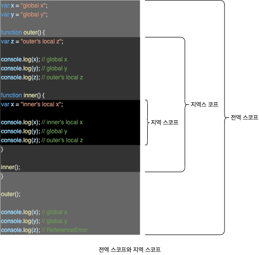
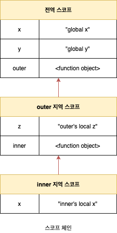

# 13. 스코프

## 13.1 스코프란?

모든 식별자(변수 이름, 함수 이름, 클래스 이름 등)는 자신이 선언된 위치에 의해 다른 코드가 자신을 참조할 수 있는 유효 범위가 결정됩니다. 이런 식별자의 유효 범위를 **스코프**라고 합니다. 자바스크립트 엔진은 이름이 같은 두 개의 변수 중에서 어떤 변수를 참조해야 할 것인지를 결정합니다. 이를 **식별자 결정**이라고 합니다. 자바스크립트 엔진은 스코프를 통해 식별자 결정을 진행합니다. 따라서 스코프는 자바스크립트 엔진이 **식별자를 검색할 때 사용하는 규칙**이라고 할 수 도 있습니다.

```javascript
var x = "global";

function foo() {
  var x = "local";
  console.log(x); // local
}

console.log(x); // global
```

식별자는 어떤 값을 구별할 수 있어야 하므로 **유일**(Unique)해야 합니다. 따라서 식별자인 변수 이름은 중복될 수 없습니다. 즉, 하나의 값은 유일한 식별자에 **연결**(Name Binding)되어야 합니다. 프로그래밍 언어에서는 스코프(유효 범위)를 통해 식별자인 변수 이름의 충돌을 방지하여 같은 이름의 변수를 사용할 수 있게 합니다. 스코프 내에서 식별자는 유일해야 하지만 다른 스코프에는 같은 이름의 식별자를 사용할 수 있습니다. 즉, 스코프는 **네임스페이스**입니다.

```javascript
function foo() {
  // var 키워드로 선언된 변수는 스코프 내에서 중복 선언을 허용합니다.
  // 뒤에 오는 변수 선언문은 var 키워드가 없는 것처럼 동작하여, 재할당이 이루어집니다.
  var x = 1;
  var x = 2;

  console.log(x); //2
}
```

```javascript
function foo() {
  // let이나 const 키워드로 선언한 변수는 같은 스코프 내에서 중복 선언을 허용하지 않습니다.
  let x = 1;
  let x = 2; // SyntaxError
}
```

## 13.2 스코프의 종류



### 13.2.1 전역과 전역 스코프

**전역**이란 코드의 가장 바깥쪽 영역을 말합니다. 전역은 **전역 스코프**(Global Scope)를 만듭니다. 전역에 변수를 선언하면 전역 스코프를 갖는 **전역 변수**(Global Variable)가 됩니다. 전역 변수는 **어디서든지 참조**할 수 있습니다.

### 13.2.2 지역과 지역 스코프

지역이란 **함수 몸체 내부**를 말합니다. 지역은 **지역 스코프**(Local Scope)를 만듭니다. 지역에 변수를 선언하면 지역 스코프를 갖는 **지역 변수**(Local Variable)가 됩니다. 지역 변수는 자신의 **지역 스코프와 하위 지역 스코프에서 유효**합니다.

## 13.3 스코프 체인

함수는 중첩될 수 있으므로 함수의 지역 스코프도 중첩될 수 있습니다. 중첩 함수의 지역 스코프는 중첩 함수를 포함하는 외부 함수의 지역 스코프와 **계층적 구조**를 갖습니다. 이때 외부 함수의 지역 스코프를 중첩 함수의 **상위 스코프**라고 합니다.



모든 스코프는 하나의 계층적 구조로 연결되며, 모든 지역 스코프의 **최상위 스코프는 전역 스코프**입니다. 스코프가 계층적으로 연결된 것을 **스코프 체인**(Scope Chain)이라 합니다. 변수를 참조할 때 자바스크립트 엔진은 스코프 체인을 통해 변수를 참조하는 코드의 스코프에서 시작하여 상위 스코프 방향으로 이동하며 **선언된 변수를 검색**(Identifier Resolution)합니다. 이를 통해 상위 스코프에서 선언한 변수를 하위 스코프에서도 참조할 수 있습니다.

스코프 체이은 물리적인 실체로 존재합니다. 자바스크립트 엔진은 코드(전역 코드와 함수 코드)를 실행하기에 앞서 위 그림과 유사한 자료구조인 **렉시컬 환경**(Lexical Environment)을 실제로 생성합니다. 변수 선언이 실행되면 변수 식별자가 이 자료구조(렉시컬 환경)에 **키**(Key)로 등록되고, 변수 할당이 일어나면 이 자료구조의 변수 식별자에 해당하는 값을 변경합니다. 변수의 검색도 이 자로구조 상에서 이뤄집니다.

### 13.3.1 스코프 체인에 의한 변수 검색

자바스크립트 엔진은 스코프 체인을 따라 변수를 참조하는 코드의 스코프에서 시작해서 상위 스코프 방향으로 이동하며 선언된 변수를 검색합니다. 절대 하위 스코프로 내려가면서 식별자를 검색하는 일은 없습니다. 스코프 체인으로 연결된 스코프의 계층적 구조는 부자 관계로 이뤄진 **상속**(Inheritance)와 유사합니다. 상속을 통해 부모의 자산을 자식이 자유롭게 사용할 수 있지만 자식의 자산을 부모가 사용할 수는 없습니다.

### 13.3.2 스코프 체인에 의한 함수 검색

```javascript
function foo() {
  console.log("global function foo");
}

function bar() {
  function foo() {
    console.log("local function foo");
  }

  foo(); // local function foo
}

bar();
```

함수 선언문으로 함수를 정의하면 런타임 이전에 함수 객체가 먼저 생성됩니다. 그리고 자바스크립트 엔진은 함수 이름과 동일한 이름의 식별자를 암묵적으로 선언하고 생성된 함수 객체를 할당합니다. 함수를 호출하면 자바스크립트 엔진은 함수르 ㄹ호출하기 위해 먼저 함수를 가리키는 식별자를 검색합니다. 사실 함수는 식별자에 함수 객체가 할당된 것 외에는 일반 변수와 다를 바 없습니다.

## 13.4 함수 레벨 스코프

C나 Java 등을 비롯한 대부분의 프로그래밍 언어는 함수 몸체만이 아니라 모든 코드 블록(`if`, `for`, `while`, `try/catch` 등)이 지역 스코프를 만듭니다. 이러한 특성을 **블록 레벨 스코프**(Block Level Scope)라 합니다. 하지만 `var` 키워드로 선언된 변수는 오로지 함수의 코드 블록(함수 몸체)만을 지역 스코프로 인정합니다. 이러한 특성을 **함수 레벨 스코프**(Function Level Scope)라 합니다.

```javascript
var x = 1;

if (true) {
  // 함수 밖에서 var 키워드로 선언된 변수는 코드 블록 내에서 선언되었다 할지라도 모두 정역 변수입니다.
  // 따라서 x는 전역변수입니다. 이미 선언된 전역 변수 x가 있으므로 x 변수는 중복 선언됩니다.
  var x = 10;
}

console.log(x); // 10
```

```javascript
var i = 10;

// for 문에서 서언한 i는 전역 변수입니다. 이미 선언된 전역 변수 i가 있으므로 중복 서언됩니다.
for (var i = 0; i < 5; i += 1) {
  console.log(i); // 0 1 2 3 4
}

console.log(i); // 5
```

`var` 키워드로 선언된 변수는 오로지 함수의 코드 블록만을 지역 스코프로 인정하지만 ES6에서 도입된 `let`, `const` 키워드는 블록 레벨 스코프를 지원합니다. 이에 대해서는 **15장 let, const 키워드와 블록 레벨 스코프**에서 자세히 살펴봅니다.

## 13.5 렉시컬 스코프

```javascript
var x = 1;

function foo() {
  var x = 10;
  bar();
}

function bar() {
  console.log(x);
}

foo(); // 1
bar(); // 1
```

- **동적 스코프**(Dynamic Scope): 함수를 어디서 호출했는지에 따라 함수의 상위 스코프를 결정합니다. 함수가 호출되는 시점에 동적으로 상위 스코프를 결정해야 합니다.
- **렉시컬 스코프**(Lexical Scope): 정적 스코프라고도 하며, 함수를 어디서 정의했는지에 따라 함수의 상위 스코프를 결정합니다. 함수 정의가 평가되는 시점에 상위 스코프가 정적으로 결정됩니다.

자바스크립트는 렉시컬 스코프를 따릅니다. 함수가 호출된 위치는 상위 스코프 결정에 어떠한 영향도 주지 않습니다. 함수 정의(함수 선언문 또는 함수 표현식)가 실행되어 생성된 함수 객체는 이렇게 결정된 상위 스코프를 기억합니다. 함수가 호출될 때마다 함수의 상위 스코프를 참조할 필요가 있기 때문입니다.
