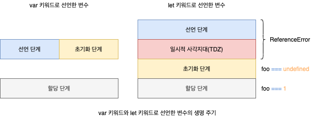

# 15. let, const 키워드와 블록 레벨 스코프

## 15.1 var 키워드로

### 15.1.1 변수 중복 선언 허용

`var` 키워드로 선언한 변수를 종복 선언하면 초기화문(변수 선언과 동시에 초기값을 할당하는 문) 유무에 따라 다르게 동작합니다. 초기화문이 있는 변수 선언문은 자바스크립트 엔진에 의해 `var` 키워드가 없는 것처럼 동작하고 초기화문이 없는 변수 선언문은 무시됩니다. 이 때 에러는 발생하지 않습니다.

```javascript
var x = 1;
var y = 1;

// 초기화문이 있는 변수 선언문은 자바스크립트 엔진에 의해 var 키워드가 없는 것처럼 동작합니다.
var x = 100;
// 초기화문이 없는 변수 선언문은 무시됩니다.
var y;

console.log(x); // 100
console.log(y); // 1
```

### 15.1.2 함수 레벨 스코프

`var` 키워드로 선언한 벼수는 오로지 함수의 블록만을 지역 스코프로 인정합니다. 따라서 함수 외부에서 `var` 키워드로 선언한 변수는 코드 블록 내에서 선언해도 모두 전역 변수가 됩니다.

```javascript
var x = 1;
var i = 10;

if (true) {
  var x = 10;
}

for (var i = 0; i < 5; i += 1) {
  console.log(i); // 0 1 2 3 4
}

console.log(x); // 10
console.log(i); // 5
```

### 15.1.3 변수 호이스팅

`var` 키워드로 변수를 선언하면 변수 호이스팅에 의해 변수 선언문이 스코프의 선드로 끌어 올려진 것처럼 동작합니다. 즉, 변수 호이스팅에 의해 `var` 키워드로 선언한 변수는 변수 선언문 이전에 참조할 수 있습니다. 단, 할당문 이전에 변수를 참조하면 언제나 `undefined`를 반환합니다.

```javascript
console.log(foo); // undefined

foo = 123;

console.log(foo); // 123

var foo;
```

## 15.2 let 키워드

`var` 키워드의 단점을 보완하기 위헤 ES6에서는 새로운 변수 선언 키워드인 `let`과 `const`를 도입했습니다.

### 15.2.1 변수 중복 선언 금지

`let` 키워드로 이름이 같은 변수를 중복 선언하면 **문법 에러**(SyntaxERror)가 발생합니다.

```javascript
let bar = 123;
let bar = 456; // SyntaxError
```

### 15.2.2 블록 레벨 스코프

`let` 키워드로 선언한 변수는 모든 코드 블록(함수, `if` 문, `for` 문, `while` 문, `try/catch` 문 등)을 지역 스코프로 인정하는 **븕록 레벨 스코프**(Block-Level Scipe)를 따릅니다. 함수도 코드 블록이므로 스코프를 만듭니다. 이때 함수 내의 코드 블록은 함수 레벨 스코프에 중첩됩니다.

```javascript
let foo = 1; // 전역 변수

{
  let foo = 2; // 지역 변수
  let bar = 3; // 지역 변수
}

console.log(foo); // 1
console.log(bar); // ReferenceError
```

### 15.2.3 변수 호이스팅

`let` 키워드로 선언한 변수는 변수 호이스팅이 발생하지 않는 것처럼 동작합니다. `let` 키워드로 선언한 변수를 변수 선언문 이전에 참조하면 **참조 에러**(ReferenceError)가 발생합니다. `let` 키워드로 선언한 변수는 **선언 단계**와 **초기화 단계**가 분리되어 진행됩니다. 즉, 런타임 이전에 자바스크립트 엔진에 의해 암묵적으로 선언 단계가 먼저 실행되지만 초기화 단계는 변수 선언문에 도달했을 때 실행 됩니다. 스코프의 시작 지점부터 초기화 시작 지점까지 변수를 참조할 수 없는 구간을 **일시적 사각지대**(Temporal Dead Zone, TDZ)라고 부릅니다.

```javascript
console.log(foo); // ReferenceError

let foo; // 변수 선운문에서 초기화 단계가 실행됩니다.
console.log(foo); // undefined

foo = 1; // 할당문에서 할당 단계가 실행됩니다.
console.log(foo); // 1
```



### 15.2.4 전역 객체와 let

`let` 키워드로 선언한 전역 변수는 전역 객체의 프로퍼티가 아닙니다. 즉 `window.foo`와 같이 접근할 수 없습니다. `let` 전역 변수는 보이지 않는 개념적인 블록(전역 렉시컬 환경의 선언적 환경 레코드. 이에 대해서는 **23장 실행 컨텍스트**에서 자세히 셜펴봅니다) 내에 존재합니다.

```javascript
let x = 1;
console.log(window.x); // undefined
```

## 15.3 const 키워드

`const` 키워드는 **상수**(Constant)를 선언하기 위해 사용합니다. `const` 키워드의 특징은 `let` 키워드와 대부분 동일하므로 `let` 키워드와 다른 점을 중심으로 살펴봅니다.

### 15.3.1 선언과 초기화

`const` 키워드로 선언한 변수는 반드시 선언과 동시에 초기화해야 합니다. 그렇지 않으면 문법 에러가 발생합니다. `const` 키워드로 선언한 변수는 `let` 키워드로 선언한 변수와 마찬가지로 블록 레벨 스코프를 가지며, 변수 호이스팅이 발생하지 않는 것처럼 동작합니다.

```javascript
const foo = 1;
const bar; // SyntaxError

{
  console.log(foo); // ReferenceError
  const foo = 2;
  console.log(foo); //2
}

console.log(foo); // 1
```

### 15.3.2 재할당 금지

`var` 또는 `let` 키워드로 선언한 변수는 재할당이 자유로우나 `const` 키워드로 선언한 변수는 재할당이 금지됩니다.

```javascript
const foo = 1;
foo = 2; // TypeError
```

### 15.3.3 상수

`const` 키워드로 선언한 변수에 원시 값을 할당한 경우 변수 값을 변경할 수 없습니다. 원시 값은 **변경 불가능한 값**(Immutable Value)이므로 재할당 없이 값을 변경할 수 있는 방법이 없기 때문입니다. 이러한 특징을 이용해 `const` 키워드를 상수를 표현하는 데 사용하기도 합니다. 상수는 상태 유지와 가독성, 유지보수의 편의를 위해 적극적으로 사용해야 합니다. 일반적으로 상수의 이름은 대문자로 선언해 상수임을 명확히 나타냅니다. 여러 단어로 이뤄진 경우에는 언더스코어(`_`)로 구분해서 스테이크 케이스로 표현하는 것이 일반적입니다.

```javascript
const TAX_RATE = 0.1;

let preTaxPrice = 100;
let afterTaxPrice = preTaxPrice + preTaxPrice * TAX_RATGE;

console.log(afterTaxPrice); // 110
```

### 15.3.4 const 키워드와 객체

`const` 키워드로 선언된 변수에 객체를 할당한 경우 값을 변경할 수 있습니다. 변경 가능한 값인 객체는 재할당이 없어도 직접 변경이 가능하기 때문입니다. `const` 키워드는 재할당을 금지할 뿐 **불변**을 의미하지는 않습니다.

```javascript
const person = {
  name: "Lee",
};

person.name = "Kim";
console.log(person); // { name: "Kim" }
```

## 15.4 var vs. let vs. const

- ES6를 사용한다면 `var` 키워드는 사용하지 않습니다.
- 재할당이 필요한 경우에 한정해 `let` 키워드를 사용합니다. 이때 변수의 스코프는 최대한 좁게 만듭니다.
- 변경이 발생하지 않고 읽기 전용으로 사용하는 원시 값과 객체는 `const` 키워드를 사용합니다. `const` 키워드는 재할당을 금지하므로 `var`, `let` 키워드보다 안전합니다.

변수를 선언하는 시점에서는 재할당이 필요할지 잘 모르는 경우가 많습니다. 그리고 객체는 의외로 재할당하는 경우가 드뭅니다. 따라서 변수를 선언할 때는 일단 `const` 키워드를 사용합니다. 반드시 재할당이 필요하다면 그때 `const` 키워드를 `let` 키워드로 변경해도 결코 늦지 않습니다.
