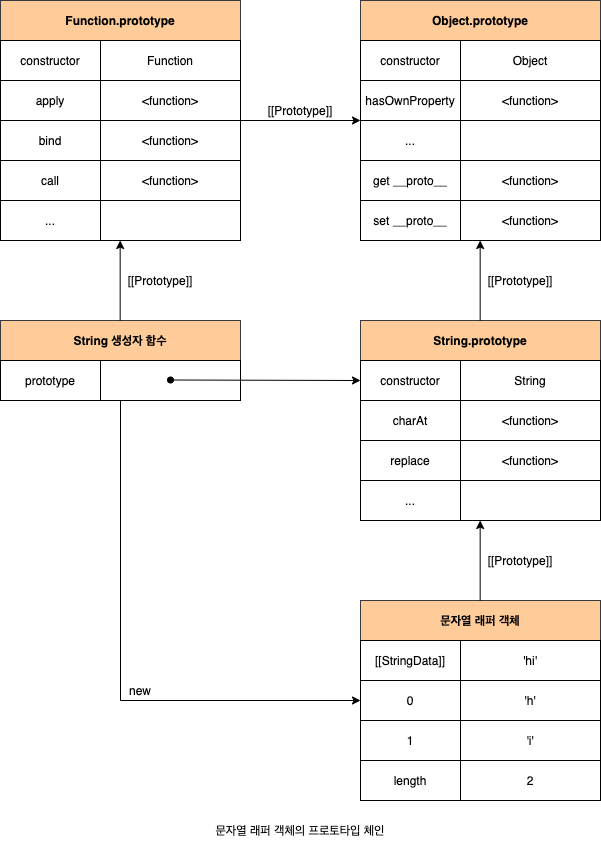
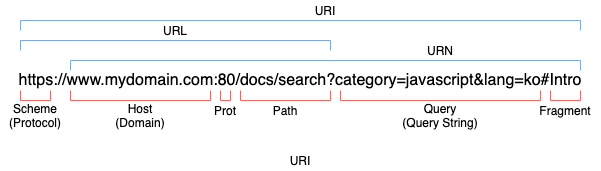

# 21. 빌트인 객체

## 21.1 자바스크립트 객체의 분류

- **표준 빌트인 객체**(Standard Built-in Objects/Native Objects/Global Objects)
  - ECMAScript 사용에 정의된 객체를 말하며, 애플리케이션 전역의 공통 기능을 제공합니다.
  - ECMAScript 사양에 정의된 객체이므로 자바스크립트 실행 환경(브라우저 또는 Node.js 환경)과 관계없이 언제나 사용할 수 있습니다.
  - 전역 객체의 프로퍼티로서 제공됩니다. 따라서 별도의 선언 없이 변수처럼 언제나 참조할 수 있습니다.
- **호스트 객체**(Host Objects)
  - ECMAScript 사양에 정의되어 있지 않지만 자바스크립트 실행 환경(브라우저 또는 Node.js 환경)에서 추가로 제공되는 객체를 말합니다.
  - 브라우저 환경에서는 DOM, BOM, Canvas, XMLHttpRequest, fetch, requestAdimationFrame, SBG, Web Storage, Web Component, Web Worker와 같은 클라이언트 사이드 Web API를 호스트 객체로 제공합니다.
  - Node.js 환경에서는 Node.js 고유의 API를 호스트 객체로 제공합니다.
- **사용자 정의 객체**(User-Defined Objects)
  - 표준 빌트인 객체와 호스트 객체처럼 기본 제공되는 객체가 아닌 사용자가 직접 정의한 객체를 말합니다.

## 21.2 표준 빌트인 객체

자바스크립트는 40여 개의 표준 빌트인 객체를 제공합니다. `Math`, `Reflact`, `JSON`을 제외한 표준 빌트인 객체는 모두 인스턴스를 생성할 수 있는 생성자 함수 객체입니다. 생성자 함수 객체인 표준 빌트인 객체는 프로토타입 메서드와 정적 메서드를 제공하고, 생성자 함수 객체가 아닌 표준 빌트인 객체는 정적 메서드만 제공합니다.

생성자 함수인 표준 빌트인 객체가 생성한 인스턴스의 프로토타입은 표준 빌트인 객체의 `prototype` 프로퍼티에 바인딩된 객체입니다. 표준 빌트인 객체의 `prototype` 프로퍼티에 바인딩된 객체는 다양한 기능의 빌트인 포로토타입 메서드를 제공합니다. 그리고 표준 빌트인 객체는 인스턴스 없이도 호출 가능한 빌트인 정적 메서드를 제공합니다.

```javascript
const strObj = new String("Lee"); // String {"Lee"}
console.log(typeof strObj); // object
console.log(Object.getPrototypeOf(strObj) === String.prototype); // true

const numObj = new Number(1.5); // Number {1.5}
console.log(typeof numObj); // object
console.log(numObj.toFixed()); // 2
console.log(Number.isInteger(0.5)); // false
```

## 21.3 원시값과 래퍼 객체

원시값을 객체처럼 사용하면 자바스크립트 엔진은 암묵적으로 연관된 객체를 생성하여 생성된 객체로 프로퍼티에 접근하거나 메서드를 호출하고 다시 원시값으로 되돌립니다. 이처럼 문자열, 숫자, 불리언 값에 대해 객체처럼 접근하면 생성되는 임시 객체를 **래퍼 객체**(Wrapper Object)라 합니다.

1. 원시값에 대해 마침표 표기법으로 접근하면 그 순간 래퍼 객체가 생성되고 원시값은 래퍼 객체의 내부 슬롯(`[[StringData]]`, `[[NumberData]]`)에 할당됩니다.
2. 래퍼 객체는 `prototype` 메서드를 상속받아 사용할 수 있습니다.
3. 래퍼 객체의 처리가 종료되면 래퍼 객체의 내부 슬롯에 할당된 원시값으로 원래의 상태, 즉 식별자가 원시값을 갖도록 되돌리고 래퍼 객체는 가비지 컬렉션의 대상이 됩니다.

```javascript
const str = "hi";

// 원시 타입인 문자열이 래퍼 객체인 String 인스턴스로 변환됩니다.
console.log(str.length); // 2
console.log(str.toUpperCase()); // HI

// 래퍼 객체로 프로퍼티에 접근하거나 메서드를 호출한 후, 다시 원시값으로 되돌립니다.
console.log(typeof str); // string
```



ES6에서 새롭게 도입된 원시값인 심벌도 래퍼 객체를 생성합니다. 심벌은 일반적인 원시값과는 달리 리터럴 표기법으로 생성할 수 없고 `Symbol` 함수를 통해 생성해야 하므로 다른 원시값과는 차이가 있습니다. 심벌에 대해서는 **33장 7번째 데이터 타입 Symbol**에서 살펴보오록 합니다.

이처럼 문자열, 숫자, 불리언, 심벌은 암묵적으로 생성되는 레퍼 객체에 의해 마치 객체처럼 사용할 수 있으며, 표준 빌트인 객체인 `String`, `Number`, `Boolean`, `Symbol`의 프로토타입 메서드 또느 ㄴ프로퍼티를 참조할 수 있습니다. 따라서 `String`, `Number`, `Boolran` 생성자 함수를 `new` 연산자와 함께 호출하여 문자열, 숫자 불리언 신스턴스를 생성할 필요가 없으며 권장하지 않습니다. `Symbol`은 생성자 함수가 아니므로 이 논의에서 제외하도록 합니다. 참고로 `null`과 `undefined`는 래퍼 객체를 생성하지 않습니다. 따라서 `null`과 `undefined` 값을 객체처럼 사용하면 에러가 발생합니다.

## 추가 자료: 객체 레퍼보다 원시 데이터형을 우선시하라

> 추가 자료 출처: Effactive JavaScript - 데이비드 허먼

표준 라이브러리는 불리언, 숫자 그리고 문자열을 객체처럼 래핑하는 생성자를 제공합니다. 다음과 같이 문자열 값을 감싸서 String 객체를 만들 수 있습니다.

```javascript
const s = new String("hello world");
```

어떤 면에서, `String` 객체는 그 자신이 감싼 문자열 값과 비슷하게 동작합니다. 하지만 원시 데이터형 문자열과 다르게 `String` 객체는 진짜 객체입니다. 이 차이점은 매우 종요합니다. 두 개의 서로 다른 `String` 객체를 내장 연산자를 사용해서 비교할 수 없다는 의미이기 때문입니다.

```javascript
const s1 = new String("hello");
const s2 = new String("hello");

console.log(s1 == s2); // false
console.log(s1 === s2); // false
```

이런 래퍼들은 꽤나 이상하게 동작하기 때문에 별로 유용하지 않습니다. 이들이 존재하는 주된 이유를 합리화하자면 유틸리티 메서드들 때문입니다. 자바스크립트는 또 다른 암묵적인 강제 형변환에 이런 래퍼들을 편리하게 사용합니다. 이로인해 원시 데이터형의 메서드를 호출하거나 프로퍼티를 추출할 수 있게 되고, 값을 적당한 객체 타입으로 감싸서 사용한 것처럼 동작하게 됩니다.

```javascript
"hello".toUpperCase(); // "HELLO"
```

이런 암묵적인 감싸기의 결과로 원시 데이터 값에 기본적으로 아무런 영향을 주지 않고 프로퍼티를 설정할 수 있습니다. 하지만 암묵적인 감싸기는 매번 새로울 객체를 생성하기 때문에, 처음 감싸진 래퍼 객체를 갱신하더라도 효과는 지속되지 않습니다. 결국 실제로는 원시 데이터 값에 프로퍼티를 설정할 수 없습니다.

```javascript
"hello".someProperty = 17;
console.log("hello".someProperty); // undefined
```

## 21.4 전역 객체

**전역 객체**는 코드가 실행되기 이전 단계에 자바스크립트 엔진에 의해 어떤 객체보다도 먼저 생성되는 특수한 객체이며, 어떤 객체에도 속하지 않은 최상위 객체입니다. 전역 개체는 자바스크립트 환경에 따라 지칭하는 이름이 제각각입니다. 브라우저 환경에서는 `window`(도는 `self`, `this`, `frames`)가 전역 객체를 가리키지만, Node.js 환경에서는 `global`이 전역 객체를 가리킵니다.

> ES11(ECMAScript 11)에서 도입된 `globalThis`는 브라우저 환경과 Node.js 환경에서 전역 객체를 가리키던 다양한 식별자를 통일한 식별자입니다.

- 전역 객체는 개발자가 의도적으로 생성할 수 없습니다. 즉, 전역 객체를 생성할 수 있는 생성자 함수가 제공되지 않습니다.
- 전역 객체의 프로퍼티를 참조할 때 `window`(또는 `global`)를 생략할 수 있습니다.
- 전역 객체는 모든 표준 빌트인 객체를 프로퍼티로 가지고 있습니다.
- 자바스크립트 실행 환경에 따라 추가적으로 프로퍼티와 메서드를 갖습니다.
- 선언하지 않은 변수에 값을 할당하는 암묵적 전역, 그리고 브라우저 환경에서 `var` 키워드로 선언한 전역 변수와 함수는 전역 객체의 프로퍼티가 됩니다.
- `let`이나 `const` 키워드로 선언한 전역 변수는 전역 객체의 프로퍼티가 아닙니다. `let`이나 `const` 키워드로 선언한 전역 변수는 보이지 않는 개념적인 블록 내에 존재하게 됩니다.
- 브라우저 환경에서 모든 자바스크립트 코드는 하나의 전역 객체 `window`를 공유합니다. 여러 개의 `script` 태그를 통해 자바스크립트 코드를 분리해도 하나의 전역 객체 `window`를 공유하는 것은 변함이 없습니다.

### 21.4.1 빌트인 전역 프로퍼티

#### Infinity

`Infinity` 프로퍼티는 무한대를 나타내는 숫자값 Infinity를 갖습니다.

```javascript
console.log(window.Infinity === Infinity); // true
console.log(typeof Infinity); // number
console.log(3 / 0); // Infinity
console.log(-3 / 0); // -Infinity
```

#### NaN

`NaN` 프로퍼트는 숫자가 아님(Not-A-Number)을 나타내는 숫자값 NaN을 갖습니다. `NaN` 프로퍼티는 `Number.NaN` 프로퍼티와 갖습니다.

```javascript
console.log(window.NaN); // NaN
console.log(typeof NaN); // number
console.log(Number("xyz")); // NaN
console.log(1 * "string"); // NaN
```

#### undefined

`undefined` 프로퍼티는 원시 타입 undefined를 값으로 갖습니다.

```javascript
console.log(window.undefined); // undefined
console.log(typeof undefined); // undefined
```

### 21.4.2 빌트인 전역 함수

#### eval

`eval` 함수는 자바스크립트 코드를 나타내는 문자열을 인수로 전달받습니다. 전달받은 문자열 코드가 표현식이라면 `eval` 함수는 문자열 코드를 런타임에 평가하여 값을 생성하고, 전달받은 인수가 표현식이 아니라 문이라면 `eval` 함수는 문자열 코드를 런타임에 실행합니다. 문자열 코드가 여러 개의 문으로 이루어져 있다면 모든 문을 실행합니다.

```javascript
/**
 * @description 주어진 문자열 코드를 런타임에 평가 또는 실행합니다.
 * @param {string} code 코드를 나타내는 문자열
 * @returns {*} 문자열 코드를 평가/실행한 결과값
 */
eval(code);
```

```javascript
// 표현식 문
eval("1 + 2;"); // 3
// 표현식이 아닌 문
eval("var x = 5;"); // undefined
console.log(x); // 5
```

`eval` 함수는 자신이 호출된 위치에 해당하는 기존의 스코프를 런타임에 동적으로 수정합니다. 그리고 `eval` 함수에 전달된 코드는 이미 그 위치에 존재하던 코드처럼 동작합니다. 즉, `eval` 함수가 호출된 함수의 스코프에서 실행됩니다.

```javascript
const x = 1;

function foo() {
  eval("var x = 2;");
  console.log(x); // 2
}

foo();
console.log(x); //1
```

단, strict mode(엄격 모드)에서 `eval` 함수는 기존의 스코프를 수정하지 않고 `eval` 함수 자신의 자체적인 스코프를 생성합니다.

```javascript
const x = 1;

function foo() {
  "use strict";

  eval("var x = 2; console.log(x);"); // 2
  console.log(x); // 1
}

foo();
console.log(x); // 1
```

또한 인수로 전달받은 문자열 코드가 `let`, `const` 키워드를 사용한 변수 선언문이라면 암묵적으로 strict mode가 적용됩니다.

```javascript
const x = 1;

function foo() {
  eval("var x = 2; console.log(x);"); // 2
  eval("const x = 3; console.log(x)"); // 3
  console.log(x); // 2
}

foo();
console.log(x); // 1
```

`eval` 함수를 통해 사용자로부터 입력받은 콘텐츠를 실행하는 것은 보안에 매우 취약합니다. 또한 `eval` 함수를 통해 실행되는 코드는 자바스크립트 엔진에 의해 최적화가 수행되지 않으므로 일반적이 코드 실행에 비해 처리 속도가 느립니다. 따라서 `eval` 함수의 사용은 금지해야 합니다.

#### 추가 자료: 직접적인 eval보다 간접적인 eval을 사용하라

> 추가 자료 출처: Effactive JavaScript - 데이비드 허먼

대부분의 함수는 자신이 선언된 스코프에 접근할 수 있고, 이 외에는 아무 데도 접근할 수 없습니다. 하지만 `eval`은 자신이 호출된 시점의 전체 스코프에 접근할 수 있습니다. 표준안에서는 `eval`을 실행하느 방법을 둘로 나누어 진화시켜 왔습니다. 식별자 `eval`을 포함하는 함수 호출은 다음과 같이 **직접적인** 호출로 간주됩니다. 이 경우 컴파일러는 반드시, 실행된 프로그램의 호출자의 지역 스코프에서 접슨을 끝마치게 해야 합니다.

```javascript
var x = "global";

function test() {
  var x = "local";
  return eval("x");
}

console.log(test()); // local
```

다른 방법으로 `eval`을 호출하면 **간접적인** 호출로 간두되고, 그 인자를 전역 스코프에서 평가합니다. 예를 들어. `eval` 함수를 다른 변수 이름으로 바인딩하고, 대체된 이름을 통해 호출하면 코드는 지역 스코프의 모든 접근을 잃게 됩니다.

```javascript
var x = "global";

function test() {
  var x = "local";
  var f = eval;
  return f("x");
}

console.log(test()); // global
```

직접적인 `eval`의 정확한 정의는 ECAMScript 표준의 특이한 언어 명세에 기인한다고 할 수 있습니다. 실제로는, 직접적인 `eval`을 만들어 낼 수 있는 유일한 문법은 (몇 개의) 괄호로 둘러싸일 수도 있는 `eval`이라는 이름을 가진 식별자입니다. 간접적인 `eval` 호출을 작성하기 위한 정확한 방법은 다음과 같이 소수점이 없는 숫자 리터럴과 쵸현식 연속 연산자(`,`) 뒤에 `eval`을 두는 것입니다.

```javascript
(0, eval)(src);
```

숫자 리터럴 `0`은 평과되지만 그 값은 무시되고, 괄호로 감싸진 연속 표현식은 `eval` 함수를 만들어 냅니다. 따라서 `(0, eval)`은 일반적인 `eval` 식별자와 거의 완전히 똑같이 동작합니다. 전체적인 호출 표현식이 간젒적인 `eval`로 처리되는 유일한 차이점을 제외하고 말입니다.

경우에 따라 직접적인 `eval`을 사용해야 할 이유가 있을 수도 있습니다. 하지만 지역 스코프를 조사해야 하는 추가적인 능력이 확실히 필요할 경우에만 사용하고, 그렇지 않다면 비교적 오용되기 어렵고 비용이 적게 드는 간접적인 `eval`을 사용합니다.

#### isFinite

전달받은 인수가 정상적인 유한수인지 검사하여 유한수이면 `true`를 반환하고, 무한수이면 `false`를 반환합니다. 전달받은 인수의 타입이 숫자가 아닌 경우, 숫자로 타입을 변환한 후 검사를 수행합니다. 이때 인수가 `NaN`으로 평가되는 값이라면 `false`를 반환합니다.

```javascript
/**
 * @description 전달받은 인수가 유한수인지 확인하고 그 결과를 반환합니다.
 * @param {number} testValue 검사 대상 값
 * @returns {boolean} 유한수 여부 확인 결과
 */
isFinite(testValue);
```

```javascript
isFinite(0); // true
isFinite(2e64); // true
isFinite("10"); // true '10' -> 10
isFinite(null); // true: null -> 0

isFinite(Infinity); // false
isFinite(-Infinity); // false

isFinite(NaN); // false
isFinite("Hello"); // false
```

#### isNaN

전달받은 인순가 `NaN`인지 검사하여 그 결과를 불리언 타입으로 반환합니다. 전달받은 인수의 타입이 숫자가 아닌 경우 숫자로 타입을 변환한 후 검사를 수행합니다.

```javascript
/**
 * @description 주어진 숫자가 NaN인지 확인하고 그 결과를 반환합니다.
 * @param {number} testValue 검사 대상 값
 * @returns {boolean} NaN 여부 확인 결과
 */
isNaN(testValue);
```

```javascript
isNaN(NaN); // true
isNaN(10); // false

isNaN("blabla"); // true
isNaN("10"); // false: '10' -> 10
isNaN(""); // true: '' -> 0
isNaN(" "); // true: ' ' -> 0

isNaN(true); // flase: true -> 1
isNaN(undefined); // true
isNaN(new Data()); // false: new Data() -> Number
```

#### 추가 자료: 암묵적인 형변환을 주의하라

> 추가 자료 출처: Effactive JavaScript - 데이비드 허먼

좌절스럽게도 `NaN` 값을 테스트하기는 특히나 어렵습니다. 두가지 이유가 있는데, 첫째로 자바스크립트 IEEE 부동 소수점 표준에 정의된 이상한 요구사항을 따라 `NaN` 자신을 동등하지 않다고 처리하기 때문입니다. 따라서 어떤 값이 `NaN`인지 테스트하기 위한 다음 식은 전혀 바르게 동작하지 않습니다.

```javascript
var x = NaN;
x === NaN; // false
```

게다가, 표준 `isNaN` 라이브러리 함수는 스스로 암묵적인 형변환, 즉 값을 테스트하기 전에 인자를 숫자로 바꾸기 때문에 신뢰할 만하지 않습니다. 이미 값이 숫자인지 알고 잇을 경우에는 `isNaN`으로 `NaN`으로 테스트할 수 있습니다. 하지만 `NaN`으로 강제 형변환할 수 있는 다른 값들은, 실제로 `NaN`이 아니라면 `isNaN`으로 구별할 수 없습니다. 다행히도 다소 직관적이지는 않지만, `NaN`은 테스트하기 위한 간결하고 신뢰할 만한 코딩 관례가 있습니다. `NaN`은 자바스크립트에서 자기 자신과 동일하지 않은 유일한 값입니다. 다라서 값이 `NaN`인지 아닌지는 자기 자신과 동일함을 확인하여 테스트할 수 있습니다.

```javascript
var a = NaN;
a !== a; // true
```

#### parseFloat

전달받은 문자열 인수를 **부동 소수점 숫자**(Floating Point Number), 즉 실수로 **해석**(Parsing)하여 변환합니다.

```javascript
/**
 * @description 전달받은 문자열 인수를 실수로 해석하여 변환합니다.
 * @param {string} string 변환 대상 값
 * @returns {number} 변환 결과
 */
parseFloat(string);
```

```javascript
// 문자열을 실수로 해석하여 변환합니다.
parseFloat("3.14"); // 3.14
parseFloat("10.00"); // 10

// 공백으로 구분된 문자열은 첫 번째 문자열만 변환합니다.
parseFloat("34 45 66"); // 34
parseFloat("40 years"); // 40

// 첫 번째 문자열을 숫자로 변환할 수 없다면 NaN을 반환합니다.
parseFloat("He was 40"); // NaN

// 앞뒤 공백은 무시됩니다.
partseFloat(" 60 "); // 60
```

#### parseInt

전달받은 문자열 인수를 **정수**(Intiger)로 **해석**(Parsing)하여 반환합니다.

```javascript
/**
 * @description 전달받은 문자열 인수를 정수로 해석하여 변환합니다.
 * @param {string} string 변환 대상 값
 * @param {number} [radix] 진법을 나타내는 기수 (2 ~ 36, 기본값 10)
 * @returns {number} 변환 결과
 */
parseInt(string, radix);
```

```javascript
// 문자열을 정수로 해석하여 반환합니다.
parseInt("10"); // 10
parseInt("10.123"); // 10

// 문자열이 아니면 문자열로 변환한 다름, 정수로 해석하여 변환합니다.
parseInt(10); // 10
parseInt(10.123); // 10
```

두 번째 인수로 진법을 나타내는 기수(2 ~ 36)를 전달할 수 있습니다. 기수를 지정하면 첫 번쟤 인수로 전달된 문자열을 해당 기수의 숫자로 해석하여 반환합니다. 이때 반환값은 언제나 10진수입니다. 기수를 생략하면 첫 번째 인수로 전달된 문자열을 10진수로 해석하여 반환합니다.

```javascript
parseInt("10"); // 10
parseInt("10", 2); // 2
parseInt("10", 8); // 8
parseInt("10", 16); // 16
```

참고로 기수를 지정하여 10진수 숫자를 해당 기수의 문자열로 변환하여 반환하고 싶을 때는 `Number.prototype.toString` 메서드를 사용합니다.

```javascript
const x = 15;

x.toString(2); // '1111'
x.toString(8); // '17'
x.toString(16); // 'f'
x.toString(); // 15
```

두 번째 인수로 진법을 나타내는 기수를 지정하지 않더라도 첫 번쨰 인수로 전달된 문자열이 `0x` 또는 `0X`로 시작하는 16진수 리터럴이라면 16진수로 해석하여 10진수 정수로 반환합니다. 하짐나 2진수 리터럴과 8진수 리터럴은 제대로 해석하지 못합니다. ES5 이전까지는 비록 사용을 금지하고는 있었지만 `0`으로 시작하는 숫자를 8진수로 해석했습니다. ES6부터는 `0`으로 시작하는 숫자를 8진수로 해석하지 않고 10진수로 해석합니다. 따라서 문자열을 8진수로 해석하려면 지수를 반드시 지정해야 합니다.

```javascript
parseInt("0xf"); // 15
parseInt("f", 16); // 15

parseInt("0b10"); // 0
parseInt("0o10"); // 0
```

첫 번째 인수로 전달한 문자열의 첫 번째 문자가 해당 지수의 숫자로 변환될 수 없다면 `NaN`을 반환합니다. 하지만 문자열의 두 번째 문자부터 해당 진수를 나타내는 숫자가 아닌 문자와 마주치면 이 문자와 계속되는 문자들은 번주 무시되며 해석된 정수값만 반환합니다.

```javascript
// 'A'는 10진수로 해설할 수 없습니다.
parseInt("A0"); // NaN
parseInt("1A0"); // 1

// '2'는 2진수로 해석할 수 없습니다.
parseInt("20", 2); // NaN
parseInt("102", 2); // 2

// 공백과 숫자로 해석할 수 없는 문자도 동일합니다.
parseInt("34 45 66"); // 34
parseInt("40 years"); // 40
parseInt("He was 40"); // NaN

// 앞뒤 공백은 무시됩니다.
parseInt(" 60 "); // 60
```

#### encodeURI / decodeURI

`encodeURI` 함수는 완전한 **URI**(Uniform Resource Identifier)를 문자열로 전달받아 이스케이프 처리를 위해 인코딩합니다. URI는 인터넷에 있는 자원을 나타내는 유일한 주소를 말합니다. URI의 하위개념으로 URI, URN이 있습니다.



이스케이프 처리는 네트워크를 통해 정보를 공유할 때 어떤 시스템에서도 읽을 수 있는 아스키 문자 셋으로 변환하는 것입니다. UTF-8 특수 문자의 경우 1문자당 1~3바이트 UTF-8 한글 표현의 경우 1문자당 3바이트입니다. 예를 들어, 특수 문자인 공백 문자는 `%20`, 한글 가는 `%EC%9E%90`으로 인코딩됩니다.

URI 문법 현식 표준 RFC3986에 따르면 URL은 아스키 문자 셋으로만 구성되어야 하며 한글을 포함한 대부분의 외국어나 아스키 문자 셋에 정의되지 않은 특수 문자의 경우 URL에 포함될 수 없습니다. 따라서 URL 내에서 의미를 갖고 있는 문자(%, ?, #)나 URL에 올 수 없는 문자(한굴, 공백 등) 또는 시스템에 의해 해석될수 있는 문자(<. >)를 이스케이프 처리하여 야기될 수 있는 문제를 예방하기 위해 이스케이프 처리가 필요합니다. 단, 알파벳, 0~9의 숫자, -\_.!~\*'() 문자는 이스케이프 처리에서 제외됩니다.

```javascript
/**
 * @description 완전한 URI 문자열로 전달받아 이스케이프 처리를 위해 인고딩합니다.
 * @param {string} uri 완전한 URI
 * @returns {string} 인코딩된 URI
 */
encodeURI(uri);
```

```javascript
const uri = "http://example.comn?name=이웅모&job=programmer&teacher";
const enc = encodeURI(uri);
console.log(enc); // http://example.con?name=%EC%9D%B4%EC%9B%85%EB%AA%A8&job=programmer&teacher
```

`decideURI` 함수는 인코딩된 URI를 인수로 전달받아 이스케이프 처리 이전으로 디코딩합니다.

```javascript
/**
 * @description 인코딩된 URI를 전달받아 이스케이프 처리 이전으로 디코딩합니다.
 * @param {string} encodedURI 인코딩된 URI
 * @returns {string} 디코딩된 URI
 */
decodeURI(encodedURI);
```

```javascript
const dec = decodeURI(enc);
console.log(dec); // "http://example.comn?name=이웅모&job=programmer&teacher"
```

#### encodeURIComponent / decodeURIComponent

`encodeURIComponent` 함수는 URI 구성 요소를 인수로 전달받아 인코딩합니다. `ebcideURIComponent` 함수는 인수로 전달된 문자열을 URI의 구성요소인 쿼리 스트링의 일부로 간주합니다. 따라서 쿼리 스트링 구분자로 사용되는 =, ?, &까지 인코딩합니다. 반면 `encodeURI` 함수는 매개 변수로 전달된 문자열을 완전한 URI 전체라고 간주합니다. 따라서 쿼리 스트링 구분자로 사용되는 =, ?, &은 인코딩하지 않습니다. `decodeURIComponent` 함수는 매개변수로 전달된 URI 구성 요소를 디코딩합니다.

```javascript
/**
 * @description URI의 구성요소를 전달받아 이스케이프 처리를 위해 인코딩합니다.
 * @param {string} uriComponent URI의 구성요소
 * @returns {string} 인코딩된 URI의 구성요소
 */
encodeURIComponent(uriComponent);

/**
 * @description 인코딩된 URI의 구성요소를 전달받아 이스케이프 처리 이전으로 디코딩합니다.
 * @param {string} encodedURIComponent 인코딩된 URI 구성요소
 * @returns {string} 디코딩된 URI의 구성요소
 */
decodedURIComponent(encodedURIComponent);
```

```javascript
const uriComp = "name=이웅모&job=promgrammer&teacher";
const enc = encodeURIComponent(uriComp);
console.log(enc); // name%3D%EC%9D%B4%EC%9B%85%EB%AA%A8%26job%3Dprogrammer%26teacher

const dec = decodeURIComponent(enc);
console.log(dec); // name=이웅모&job=promgrammer&teacher
```

#### 21.4.3 암묵적 전역

선언하지 않은 식별자에 값을 할당하면 전역 객체의 프로퍼티가 됩니다. 자바스크립트 엔진은 변수에 값을 할당하기 위해 먼저 스코프 체인을 통해 선언된 변수인지 확인합니다. 이때 어디에도 변수의 선언을 찾을 수 없으면, 전역 객체 프로퍼티를 동적 생성합니다. 결국 식별자는 전역 객체의 프로퍼티가 되어 마치 전역 변수처럼 동작합니다. 이러한 현상을 **암묵적 전역**(Implict Global)이라 합니다.

하지만 변수 선언 없이 단지 전역 객체의 프로퍼티로 추가되었을 뿐입니다. 따라서 식별자는 변수가 아니고, 변수 호이스팅이 발생하지 않습니다. 또한 변수가 아니라 단지 프로퍼티인 식별자는 `delete` 연산자로 삭제할 수 있습니다. 브라우저 환경에서 전역 변수는 프로퍼티이지만, `delete` 연산자로 삭제할 수 없습니다.

```javascript
console.log(y); // ReferenceError: y is not defined

function foo() {
  console.log(y); // ReferenceError: y is not defined
  y = 20;
}

foo();
console.log(y); // 20

delete y;
console.log(y); // ReferenceError: y is not defined
```
