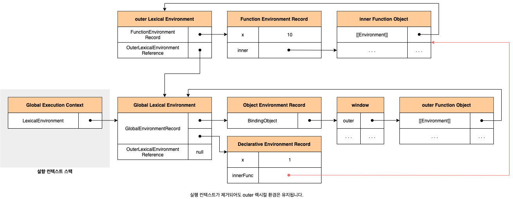
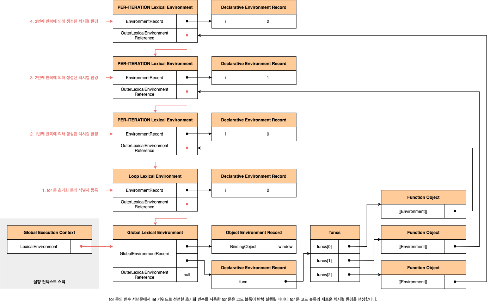

# 24. 클로저

클로저는 자바스크립트 고유의 개념이 아닙니다. 함수를 일급 객체로 취급하는 함수형 프로그래밍 언어에서 사용되는 중요한 특성입니다. 클로저는 자바스크립트 고유의 개념이 아니므로 클러자의 정의가 ECMAScript 사양에 등장하지 않았습니다. MDN에서는 클로저에 대해 다음과 같이 정의하고 있습니다.

> 클로저는 함수와 그 함수가 선언된 렉시컬 환경과의 조합입니다. (A closure is the combination of a function and the lexical environment within which that function was declared)

## 24.1 렉시컬 스코프

자바스크립트 엔진은 함수를 어디서 호출했는지가 아니라 함수를 어디에 정의했는지에 따라 상위 스코프를 결정합니다. 이를 **렉시컬 스코프**(정적 스코프)라고 합니다. 스코프에 실체는실행 켄텍스트의 렉시컬 환경입니다. 이 렉시컬 환경은 자신의 **외부 렉시컬 환경에 대한 참조**(Outer Lexical Environment Reference)를 통해 상위 렉시컬 환경과 연결됩니다. 렉시컬 환경의 **외부 렉시컬 환경에 대한 참조**에 저장할 참조값이 바로 상위 렉시컬 환경에 대한 참조이며, 이것이 상위 스코프입니다.

## 24.2 함수 객체의 내부 슬롯 \[[Environment]]

함수의 정의가 평가되어 함수 객체를 생성할 떄 자신이 정의된 환경에 의해 결정된 상위 스코프의 참조를 함수 객체 자신의 내부 슬롯 `[[Evnironment]]`에 저장합니다. 이때 자신의 내부 슬롯 `[[Environment]]`에 저장된 상위 스코프의 참조는 현재 실행 중인 실행 컨텍스트의 렉시컬 환경을 가리킵니다. 함수 렉시컬 환경의 구성 요소인 외부 렉시컬 환경에 대한 참조에는 함수 객체의 내부 슬롯 `[[Environment]]`에 저장된 렉시컬 환경의 참조가 할당됩니다.

```javascript
const x = 1;

function foo() {
  const x = 10;
  bar();
}

function bar() {
  console.log(x);
}

foo();
```

![함수 객체의 내부 슬롯 [[Environment]]에는 상위 스코프가 저장됩니다.](../_images/javascript2401.png)

## 24.3 클로저와 렉시컬 환경

외부 함수보다 중첩 함수가 더 오래 유지되는 경우 중첩 함수는 이미 생명 주기가 종료한 외부 함수의 변수를 참조할 수 있습니다. 이러한 중첩 함수를 **클로저**(Closure)라고 부릅니다. 자바스크립트의 모든 함수는 자신의 산위 스코프를 기억한다고 했습니다. 가비지 컬렉터는 누군가가 참조하고 있는 메모리 공간을 함부로 헤제하지 않습니다. 따라서 모든 함수가 기억하는 상위 스코프는 함수를 어디서 호출하든 산관없이 유지됩니다. 따라서 함수는 언제나 자신이 기억하는 상위 스코프의 식별자를 참조할 수 있으며, 식별자에 바인딩된 값을 변경할 수도 있습니다.

```javascript
const x = 1;

function outer() {
  const x = 10;
  const inner = function () {
    console.log(x);
  };

  return inner;
}

const innerFunc = outer();
innerFunc(); // 10
```



자바스크립트의 모든 함수는 상위 스코프를 기억하므로 이론적으로 모든 함수는 클로저입니다. 하지만 일반적으로 모든 함수를 크로저라고 하지는 않습니다. 상위 스코프의 어떤 식별자도 참조하지 않는 경우 대부분의 모던 브라우저는 최적화를 통해 상위 스코프를 기억하지 않습니다. 참조하지도 않는 식별자를 기억하는 것은 메모리 낭비이기 때문입니다. 따라서 이런 경우는 클로저라고 할 수 없습니다. 외부 함수보다 중첩 함수의 생명주기가 짧은 경우, 중첩 함수는 클러저였지만 외부 함수보도 일찍 소멸되기 때문에 생명 주기가 종료된 외부 함수의 식별자를 참조할 수 있다는 클로저의 본질에 부합하지 않습니다. 따라서 이런 경우도 일반적으로 클로저라고 하지 않습니다. 클로저는 중첩 함수가 상위 스코프의 식별자를 참조하고 있고 중첩 함수가 외부 함수보다 더 오래 유지되는 경우에 한정하는 것이 일반적입니다.

클로저에 의해 참조되는 상위 스코프의 변수를 **자유 변수**(Free Variable)라고 부릅니다. **클로저**(Closure)란 **함수가 자유 변수에 대해 닫혀있다**라는 의미입니다. 이를 좀 더 알기 쉽게 의역하자면 **자유 변수에 묶여있는 함수**라고 할 수 있습니다. 이론적으로 클로저는 상위 스코프를 기억해야 하므로 불필요한 메모리의 점유를 걱정할 수도 있겠습니다. 하지만 모던 자바스크립트 엔진은 최적화가 잘 되어 있어서 클로저가 참조하고 있지 않는 식별자는 기억하지 않습니다. 즉, 상위 스코프의 식별자 주에서 기억해야 할 식별자만 기억합니다.

## 24.4 클로저의 활용

클로저는 **상태**를 안전하게 변경하고 유지하기 위해 사용합니다. 다시 말해, 상태가 의도치 않게 변경되지 않도록 상태를 안전하게 **은닉**(Infromation Hiding)하고 특정 함수에게만 상태 변경을 허용하기 위해 사용합니다.

```javascript
const counter = (function () {
  let num = 0;

  return {
    increase() {
      return ++num;
    },
    decrease() {
      return num > 0 ? --num : 0;
    },
  };
})();

console.log(counter.increase()); // 1
console.log(counter.increase()); // 2

console.log(counter.decrease()); // 1
console.log(counter.decrease()); // 0
```

위 예제의 `increase`, `decrease` 메서드의 상위 스코프는 `increase`, `decrease` 메서드가 평가되는 시점에 실행중인 실행 컨텍스트인 즉시 실행 함수 실행 컨텍스트의 렉시컬 환경입니다. 따라서 `increase`, `decrease` 메서드가 언제 어디서 호출되든 상관없이 `increase`, `decrease` 함수는 즉시 실행 함수의 스코프의 식별자를 참조할 수 있습니다.

변수 값은 누군가에 의해 언제든지 변경될 수 있어 오류 발생의 근본적 원인이 될 수 있습니다. 상태 변경이나 **가변**(Mutable) 데이터를 피하고 **불변성**(Immutability)을 지향하는 함수형 프로그래밍에서 부수 효과를 최대한 억제하여 오류를 피하고 프로그램의 안정성을 높이기 위해 클로저는 적극적으로 사용됩니다. 다음은 함수형 프로그래밍에서 클로저를 활용하는 간단한 예제입니다.

```javascript
// 함수를 인수로 전달받고 함수를 반환하는 고차 함수
function makeCounter(predicate) {
  let counter = 0;

  return function () {
    couter = predicate(counter);
    return counter;
  };
}

// 보조 함수
function increase(n) {
  return ++n;
}

function decrease(n) {
  return --n;
}

const increaser = makeCounter(increase);
console.log(increase()); // 1
console.log(decrease()); // 2

const decrease = makeCounter(decrease);
console.log(decreaser()); // -1
console.log(decreaser()); // -2
```

`makeCounter` 함수는 보조 함수를 인자로 전달받고 함수를 반환하는 고차 함수입니다. `makeCounter` 함수가 반환하는 함수는 자신이 생성됐을 때의 렉시컬 환경인 `makeCounter` 함수의 스코프에 속함 `counter` 변수를 기억하는 클로저입니다. 전역 변수 `increaser`와 `decreaser`에 할당된 함수는 각각 자신만의 독립된 렉시컬 환경을 갖기 때문에 카운트를 유지하기 위한 자유 변수 `counter`를 공유하지 않아 카운터의 증감이 연동되지 않습니다. 따라서 독립된 카운터가 아니라 연동하여 증감이 가능한 카운터를 만들려면 렉시컬 환경을 공유하는 클로저를 만들어야 합니다.

```javascript
const counter = (function () {
  let counter = 0;

  return function (predicate) {
    counter = predicate(counter);
    return counter;
  };
})();

function increase(n) {
  return ++n;
}

function decrease(n) {
  return --n;
}

console.log(counter(increase)); // 1
console.log(counter(increase)); // 2

console.log(counter(decrease)); // 1
console.log(counter(decrease)); // 0
```

## 24.5 캡슐화와 정보 은닉

**캡슐화**(Encapsulation)는 객체의 **상태**(State)를 나타내는 프로퍼티와 프러퍼티를 참조하고 조작할 수 있는 **동작**(Behavior)인 메서드를 하나로 묶는 것을 말합니다. 캠슐화는 객체의 특정 프로퍼티나 메서드를 감출 목적으로 사용하기도 하는데 이를 **정보 은닉**이라 합니다. 정보 은닉은 외부에 공개할 필요가 없는 구현의 일부를 외부에 공개되지 않도록 감추어 적절치 못한 접근으로부터 객체의 상태가 변경되는 것을 방지해 정보를 보호하고, 객체 간의 상호 의존성, 즉 **결합도**를 낮추는 효과가 있습니다.

대부분의 객체지향 프로그래밍 언어는 클래스를 정의하고 그 클래스를 구성하는 맴버(프러퍼티와 메서드)에 대한여 `public`, `private`, `protected` 같은 **접근 제한자**(Access Modifier)를 선언하여 공개 범위를 한정할 수 있습니다. `public`으로 선언된 프로퍼티와 메서드는 클래스 외부에서 참조할 수 있지만 `private`으로 선언된 경우는 클래스 외부에서 참조할 수 없습니다.

자바스크립트는 `public`, `private`, `protected` 같은 접근 제한자를 제공하지 않습니다. 따라서 자바스크립트 객체의 모든 프로퍼티와 메서드는 기본적으로 외부에 공개되어 있습니다.

```javascript
function Person(name, age) {
  this.name = name; // public
  let _age = age; // private

  this.sayHi = function () {
    console.log(`Hi! My name is ${this.name}. I am ${_age}.`);
  };
}

const me = new Person("Lee", 20);
my.sayHi(); // Hi! My name is Lee. I am 20.
console.log(me.name); // Lee
console.log(me._age); // undefined
```

위 예제의 `nmae` 프로퍼티는 현재 외부로 공개되어 잇어서 자유롭게 참조하거나 변경할 수 있습니다. 즉, `nmae` 프로퍼티는 `public`합니다. 하지만 `_age` 변수는 `Person` 생성자 함수의 지역 변수이므로 `Person` 생서앚 함수 외부에서 참조하거나 변경할 수 없습니다. 즉 `_age`는 `private`합니다. 하지만 `sayHi` 메서드는 인슨턴스 메서드이므로 `Person` 객체가 생성될 때마다 중복 생성됩니다. `sayHi` 메서드를 프로토타입 메서드로 변경하여 `sayHi` 메서드의 중복 생성을 방지해 봅시다.

```javascript
function Person(name, age) {
  this.name = name; // public
  let _age = age;
}

Person.prototype.sayHi = function () {
  console.log(`Hi! My name is ${this.name}. I am ${_age}.`);
};
```

이때 `Person.prototype.sayHi` 메서드 내에서 `Person` 생성자 함수의 지역 변수 `_age`를 참조할 수 없는 문제가 발생합니다. 따라서 즉시 실행 함수를 사용하여 `Person` 생성자 함수와 `Person.prototype.sayHi` 메서드를 하나의 함수 내에 모아 봅니다.

```javascript
const Perosn = (function () {
  let _age = 0;

  function Person(name, age) {
    this.name = name;
    _age = age;
  }

  Person.prototype.sayHi = function () {
    console.log(`Hi! My name is ${this.name}. I am ${_age}.`);
  };

  return Person;
})();

const me = new Person("Lee", 20);
const you = new Person("Kim", 30);

me.sayHi(); // Hi! My name is Lee. I am 30.
```

위 코드도 문제가 잇습니다. `Person` 생성자 함수가 여러 개의 인스턴스를 생성할 경우 위와 같이 `_age` 변수의 상태가 유지되지 않는다는 것입니다. 이는 `Person.prototype.sayHi` 메서드가 단 한번 생성되는 클로저이기 때문에 발생하는 현상입니다. 이처럼 자바스크립트는 정보 은닉을 완전하게 지원하지 않습니다. 인스턴스 메서드를 사용한다면 자유 변수를 통해 `private`을 흉내 낼 수 있지만 프로토타입 메서드를 사용하면 이마저도 불가능해집니다. ES6의 `Symbol` 또는 `WeakMap`을 사용하여 `private`한 프로퍼티를 흉내 내기도 했으나 근본적인 해결책이 되지는 않습니다.

디행히도 2020년 5월 현재, TC39 프로세스의 stage 3(candidate)에는 클래스에 `private` 필드를 정의할 수 있는 새로운 표준 사양이 제안되어 있습니다. 표준 사양으로 승급이 확실시되는 이 제안은 현재 최신 브라우저(Chrome 74 이상)와 최신 Node.js(버전 12 이상)에 이미 구현되어 있습니다. 이에 대해서는 **25.7.4절 private 필드 정의 제안**에서 살펴보도록 합니다.

## 24.6 자주 발생하는 실수

```javascript
var funcs = [];

for (var i = 0; i < 3; i += 1) {
  funcs[i] = function () {
    return i;
  };
}

for (var j = 0; j < funcs.length; j += 1) {
  console.log(focus[j]());
}
```

이때 `funcs` 배열의 요소로 추가된 3개의 함수가 `0`, `1`, `2`를 반환할 것으로 기대했다면 아쉽지만 그렇지 않습니다. `for` 문의 변수 선운문에서 `var` 키워드로 선언한 `i` 변수는 블록 레벨 스코프가 아닌 함수 레벨 스코프를 갖기 때문에 전역 변수입니다. 전역 분수 `i`에는 `0`, `1`, `2`가 순차적으로 할당됩니다. 따라서 `funcs` 배열의 요소로 추가한 함수를 호출하면 전역 변수 `i`를 참조하여 `i`의 값 `3`이 출력됩니다. 클러저를 사용해 위 예제를 바르게 동작하는 코드로 만들어봅시다.

```javascript
var funcs = [];

for (var i = 0; i < 3; i += 1) {
  funcs[i] = (function (id) {
    return function () {
      return id;
    };
  })(i);
}

for (var j = 0; j < funcs.length; j += 1) {
  console.log(funcs[j]());
}
```

즉시 실행 함수의 매개변수 `id`는 즉시 실행 함수가 반환한 중첩 함수의 상위 스코프에 존재합니다. 즉시 실행 함수가 반환한 중첩 함수는 자신의 상위 스코프(즉시 실행 함수의 렉시컬 환경)를 기억하는 클로저이고, 매개변수 `id`는 즉시 실행 함수가 반환한 중첩 함수에 묶여있는 자유 변수가 되어 그 값이 유지됩니다. ES6의 `let` 키워드를 사용하면 이 같은 번거로움이 깜끔하게 해겷됩니다.

```javascript
const funcs = [];

for (let i = 0; i < 3; i += 1) {
  funcs[i] = function () {
    return i;
  };
}

for (let i = 0; i < funcs.length; i += 1) {
  console.log(funcs[i]());
}
```

`for` 문의 벼수 선운문에서 `let` 키워드로 선언한 변수를 사용하면 `for` 문의 코드 블록이 반복 실행될 때마다 `for` 문 코드 블록의 새로운 렉시컬 환경이 생성됩니다. 만약 `for` 문의 코드 블록 내에서 정의한 함수가 있다면 이 함수의 상위 스코프는 `for` 문의 코드 블록이 반복 실행될 때마다 생성된 `for` 문 코드 블록의 새로운 렉시컬 환경입니다.



이처럼 `var` 키워드로 사용하지 않는 ES6 반복문(`for...in`문, `for ... of`문, `while` 문 등)은 코드 블록을 반복 실행할 때마다 새로운 렉시컬 환경을 생서앟여 반복할 당시의 상태를 마치 스냅숏 찍는 것처럼 저장합니다. 단, 이는 반복문의 코드 블록 내부에서 함수를 정의할 때 의미가 있습니다. 반복문의 코드 블록 내부에 함수 정의가 없는 반복문이 생성하는 새로운 렉시컬 환경은 반복 직후, 아무도 참조하지 않기 떄문에 가비지 컬렉션의 대상이 됩니다.
