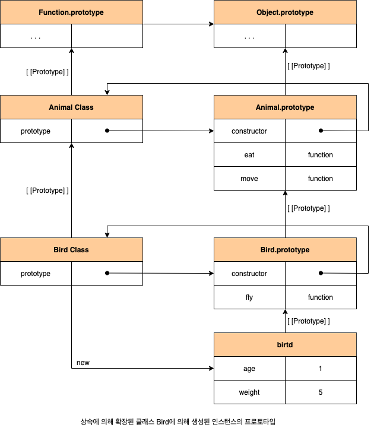
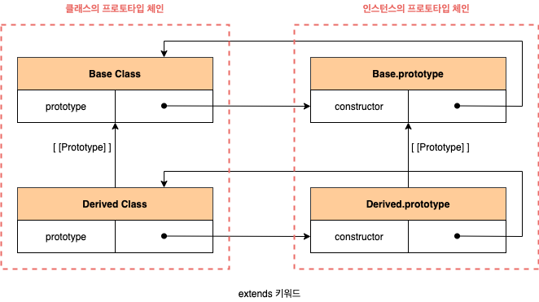

# 25. 클래스

## 25.1 클래스틑 프로토타입의 문법적 설탕인가?

ES6에서 도입된 클래스는 기존 프로토타입 기반 객체지향 프로그래밍보다 자바나 C#과 같은 클래스 기반 객체지향 프로그래밍에 익숙한 프로그래머가 더욱 빠르게 학습할 수 있도록 클래스 기반 객체지향 프로그래밍 언어와 매우 흡사한 새로운 객체 생성 메커니즘 입니다. 그렇다고 ES6의 클래스가 기존의 프로토타입 기반 객체지향 모델을 폐지하고 새롭게 클래스 기반 객체지향 모델을 제공하는 것은 아닙니다. 사실 클래스는 함수이며 기존 프로토타입 기반 패턴을 클래스 기반 패턴처럼 사용활 수 있도록 하는 **문법적 설탕**(Syntatic Sugar)이라고 볼 수도 있습니다.

클래스는 생성자 함수와 매우 유사하게 동작하지만 다음과 같이 몇 가지 차이가 있습니다.

1. 클래스는 `new` 연산자 없이 호출하면 에러가 발생합니다. 하지만 생성자 함수를 `new` 연산자 없이 호출하면 일반 함수로서 호춣됩니다.
2. 클래스는 상속을 지원하는 `extends`와 `super` 키워드를 제공홥니다. 하지만 생성자 함수는 `extends`와 `super` 키워드를 지원하지 않습니다.
3. 클래스는 호이스팅이 발생하지 않는 것처럼 동작합니다. 하지만 함수 선운문으로 정의된 생성자 함수는 함수 호이스팅이, 함수 표현식으로 정의한 생성자 함수는 변수 호이스팅이 발생홥니다.
4. 클래스 내의 모든 코드에 암묵적으로 strcit mode가 지정되어 실행되며 strict mode를 해제할 수 없습니다. 하지만 생성자 함수는 암묵적으로 strict mode가 지정되지 않습니다.
5. 클래스의 `constructor`, 프로토타입 메서드, 정적 메서드는 모두 프로퍼티 어트리뷰트 `[[Enumerable]]`의 값이 `false`입니다. 다시 말해, 열거되지 않습니다.

## 25.2 클래스 정의

클래스는 `class` 키워드를 사용하여 정의합니다. 클래스 이름은 생성자 함수와 마찬가지로 파스칼 케이스를 사용하는 것이 일반적입니다. 파스칼 케이스를 사용하지 않아도 에러가 발생하지는 않습니다.

```javascript
class Person {}
```

일반적이지는 않지만 함수와 마찬가지로 표현식으로 클래스를 정의할 수도 있습니다. 이때 클래스는 함수와 마찬가지로 이름을 가질 수도 있고, 갖지 않을 수도 있습니다.

```javascript
const Person = class {};
const Person = class MyClass {};
```

클래스를 표현식으로 정의할 수 있다는 것은 클래스가 값으로 사용할 수 있는 일급 객체라는 것을 의미합니다. 즉, 클래스는 일급 객체로서 다음과 같은 특징을 갖습니다.

- 무명의 리터럴로 생성할 수 있습니다. 런타임에 생성이 가능합니다.
- 변수나 자료구조(객체, 배열 등)에 저장할 수 있습니다.
- 함수의 매개변수에게 전달할 수 있습니다.
- 함수의 반환값으로 사용할 수 있습니다.

클래스 몸체에 정의할 수 있는 메서드는 constructor(생성자), 프로토타입 메서드, 정적 메서드 세 가지가 있습니다.

```javascript
class Person {
  // 생성자
  constructor(name) {
    this.name = name;
  }

  // 프로토타입 메서드
  sayHi() {
    console.log(`Hi! My name is ${this.name}`);
  }

  // 정적 메서드
  static sayHello() {
    console.log("Hello");
  }
}

const me = new Person("Lee");

console.log(me.name); // Lee
me.sayHi(); // Hi! My name is Lee
Person.sayHello(); // Hello!
```

## 25.3 클래스 호이스팅

클래스는 함수로 평가됩니다. 클래스 선언문으로 정의한 클래스는 함수 선언문과 같이 소스코드 평가 과정, 즉 런타임 이전에 먼저 평가되어 함수 객체를 생성합니다. 이때 클래스가 평가되어 생성된 함수 객체는 생성자 함수로서 호출할 수 있는 함수, 즉 constructor입니다. 생성자 함수로서 호출할 수 있는 함수는 함수 정의가 평가되어 함수 객체를 생성하는 시점에 프로토타입도 더불어 생성됩니다. 프로토타입과 생성자 함수는 단독으로 존재할 수 없고 언제나 싸응로 존재하기 때문입니다.

```javascript
class Person {}
console.log(typeof Person); // function
```

클래스 선언도 변수 선언, 함수 정의와 마찬가지로 호이스팅이 발생합니다. 단, 클래스는 `let`, `const` 키워드로 선언한 변수처럼 호이스팅됩니다. 따라서 클래스 선운문 이전에 **일시적 사각지대**(Temporal Dead Zone, TDZ)에 빠지기 때문에 호이스팅이 발생하지 않는 것처럼 동작합니다.

```javascript
console.log(Person); // ReferenceError
class Person {}
```

## 25.4 인스턴스 생성

클래스는 생성자 함수이며 `new` 연산자와 함께 호출되어 인스턴스를 생성하며, 인스턴스를 생성하는 것이 유일한 존재 이유이므로 반드시 `new` 연산자와 함께 호출홰야 합니다.

```javascript
class Person {}

const me = new Person();
const you = Person(); // TypeError
```

클래스 표현식으로 정의된 클래스의 경우 다음 예제와 같이 클래스를 가리키는 식별자(Person)를 사용해 인스턴스를 생성하지 않고 기명 클래스 표현식의 클래스 이름을 사용해 인스턴스를 생성하면 에러가 발생합니다. 이는 기명 함수 표현식과 마찬가지로 클래스 표현식에서 사용한 클래스 이름은 외부 코드에서 접근 불가능하기 때문입니다.

```javascript
const Person = class MyClass {};

const me = new MyClass(); // ReferenceError
```

## 25.5 메서드

### 25.5.1 constructor

`constructor`는 인스턴스를 생성하고 초기화하기 위한 특수한 메서드입니다. `constructor`는 이름을 변경할 수 없습니다. 생성자 함수와 마찬가지로 `constructor` 내부에서 `this`에 추가한 프로퍼티는 인스턴스 프로퍼티가 됩니다. `constructor` 내부의 `this` 생성자 함수와 마찬가지로 클래스가 생성한 인스턴스를 가리킵니다. `constructor`는 메서드로 해석되는 것이 아니라 클래스가 평가되어 생성한 함수 객체 코드의 일부가 됩니다. 다시 말해, 클래스 정의가 평가되면 `constructor`의 기술된 동작을 하는 함수 객체가 생성됩니다. `con

```javascript
class Person {
  constructor(name) {
    this.name = name;
  }
}
```

`constructor`는 클래스 내에 최대 한 개만 존재할 수 있습니다. 만약 클래스가 2개 이상의 `constructor`를 포함하면 **문법 에러**(SyntaxError)가 발생합니다. `constructor`는 생략할 수 있습니다. `constructor`를 생략하면 클래스에 다음과 같이 빈 `constructor`가 암묵적으로 정의됩니다. `constructor`를 생략한 클래스는 빈 `constructor`에 의해 빈 객체를 생성합니다.

```javascript
class Person {
  constructor() {}
}

const me = new Person();
console.log(me); // Person {}
```

프로퍼티가 추가되어 초기화된 인스턴스를 생성하려면 `constructor` 내부에서 `this`에 인스턴스 프로퍼티를 추가합니다. 인스턴스를 생성할 때 클래스 외부에서 인스턴스 프로퍼티의 초기값을 전달하려면 다음과 같이 `constructor`에 매개변수를 선언하고 인스턴스를 생성할 때 초기값을 전달합니다. 이때 초기값은 `constructor`의 매개변수에게 전달됩니다.

```javascript
class Person {
  constructor(name, address) {
    this.name = name;
    this.address = address;
  }
}

const me = new Person("Lee", "Seoul");
console.log(me); // Person { name: "Lee", address: "Seoul" }
```

`constructor`는 별도의 반환문을 갖지 않아야 합니다. `new` 연산자와 함께 클래스가 호출되면 생성자 함수와 동일하게 암묵젃으로 `this`, 즉 인스턴스를 반환하기 때문입니다. 만약 `this`가 아닌 다른 객체를 명시적으로 반환하면 `this`, 즉 인스턴스가 반환되지 못하고 `return` 문에 명시한 객체가 반환됩니다. 하지만 명시적으로 원시값을 반환하면 원시값 반환은 무시되고 암묵적으로 `this`가 반환됩니다.

```javascript
class Person {
  constructor(name) {
    this.name = name;

    return {};
  }
}

const me = new Person("Lee");
console.log(me); // {}
```

### 25.5.2 프로토타입 메서드

클래스 몸체에서 정의한 메서드는 생성자 함수에 의한 객체 생성 방식과는 다르게 클래스의 `prototype` 프로퍼티에 메서드를 추가하지 않아도 기본적으로 프로토타입 메서드가 됩니다. 프로토타입 체인은 기존의 모든 객체 생성 방식(객체 리터럴, 생성자 함수, `Object.create` 메서드 등)뿐만 아니라 클래스에 의해 생성된 인스턴스에도 동일하게 적용됩니다.

```javascript
class Person {
  constructor(name) {
    this.name = name;
  }

  sayHi() {
    console.log(`Hi! My name is ${this.name}`);
  }
}

const me = new Person("Lee");
me.sayHi(); // Hi! My name is Lee

Object.getPrototype(me) === Person.prototype; // true
me instanceof Person; // true

Object.getPrototypeOf(Person.prototype) === Object.prototype; // true
me instanceof Object; // true

me.constructor === Person;
```

### 25.5.3 정적 메서드

클래스에서는 메서드에 `static` 키워드를 붙이면 정적 메서드(클래스 메서드)가 됩니다. 정적 메서드는 클래스에 바인딩된 메서드가 됩니다. 클래스는 클래스의 정의(클래스 선언문이나 클래스 표현식)가 평가되는 시점에 함수 객체가 되므로 인스턴스와 달리 별다른 생성 과정이 필요 없습니다. 따라서 정적 메서드는 클래스 정의 이후 인스턴스를 생성하지 않아도 호출할 수 있습니다.

정적 메서드는 인스턴스로 호출할 수 없습니다. 정적 메서드가 바인딩된 클래스는 인스턴스의 프로토타입 체인상에 존재하지 않기 때문입니다. 다시 말해, 인스턴스의 프로토타입 체인 상에는 클래스가 존재하지 않기 때문에 인스턴스로 클래스의 메서드를 상속 받을 수 없습니다.

```javascript
class Person {
  constructor(name) {
    this.name = name;
  }

  static sayHi() {
    console.log("Hi!");
  }
}

Person.sayHi(); // Hi!

const me = new Person("Lee");
me.sayHi(); // TypeError
```

### 25.5.4 정적 메서드와 프로토타입 메서드의 차이

1. 정적 메서드와 프로토타입 메서드는 자신이 속해 있는 포로토타입 체인이 다릅니다.
2. 정적 메서드는 클래스로 호출하고 프로토타입 메서드는 인스턴스로 호출합니다.
3. 정적 메서드는 인스턴스 프로퍼티를 참조할 수 없지만, 프로토타입 메서드는 인스턴스 프로퍼티를 참조할 수 있습니다.

메서드 내부에서 인스턴스 프로퍼티를 참조할 필요가 있다면 `this`를 사용해야 하며, 이러한 경우 프로토타입 메서드로 정의해야 합니다. 하지만 메서드 내부에서 인스턴스 프로퍼티를 참조해야 할 필요가 없다면 `this`를 사용하지 않게 됩니다. 물론 메서드 내부에서 `this`를 사용하지 않더라도 프로토타입 메서드로 정의할 수 있습니다. 하지만 반드시 인스터스를 생성한 다음 인스턴스를 호출해야 하므로 `this`를 사용하지 않는 메서드는 정적 메서드로 정의하는 것이 좋습니다.

표준 빌트인 객체인 `Math`, `Number`, `JSON`, `Object`, `Reflect` 등은 다양한 정적 메서드를 가지고 있습니다. 이들 정적 메서드는 애플리케이션 전역에서 사용할 **유틸리티**(Utility) 함수입니다. 아초롬 클래스 또는 생성자 함수를 하나의 **네임스페이스**(Namespace)로 사용하여 정적 메서드를 모아 놓으면 이름 충돌 가능성을 줄여 주고 관련 함수들을 구조화할 수 있는 효과가 있습니다. 이 같은 이유로 정적 메서드는 애플리케이션 전역에서 사용할 유틸리티 함수를 전역 함수로 정의하지 않고 메서드로 구조화할 때 유용합니다.

```javascript
Math.max(1, 2, 3); // 3
Number.isNaN(NaN); // true
JSON.stringify({ a: 1 }); // "{"a":1}"
Object.is({}, {}); // false
Reflect.has({ a: 1 }, "a"); // true
```

### 25.5.5 클래스에서 정의한 메서드의 특징

1. `function` 키워드를 생략한 메서드 축약 표현을 사용합니다.
2. 객체 리터럴과는 다르게 클래스에서 메서드를 정의할 때는 콤마가 필요 없습니다.
3. 암묵적으로 strict mode로 실행됩니다.
4. `for...in` 문이나 `Object.keys` 메서드 등으로 열거할 수 없습니다. 즉, 프로퍼티의 열거 가능 여부를 나타내며, 불리언 값을 갖는 프로퍼티 어트리뷰트 `[[Enumerable]]`의 값이 `false`입니다.
5. 내부 메서드 `[[Contruct]]`를 갖지 않는 non-constructor입니다. 따라서 `new` 연산자와 함께 호출할 수 없습니다.

## 25.6 클래스의 인스턴스 생성 과정

#### 1. 인스턴스 생성과 this 바인딩

`new` 연산자와 함께 클래스를 호출하면 `constructor`의 내부 코드가 실행되기에 앞서 암묵적으로 빈 객체가 생성됩니다. 이 빈 객체가 바로 (아직 완성되지는 않았지만) 클래스가 생성한 인스턴스입니다. 이떄 클래스가 생성한 인스턴스의 프로토타입으로 클래스의 `prototype` 프로퍼티가 가리키는 객체가 설정됩니다. 그리고 암묵적으로 생성된 빈 객체, 즉 인스턴스는 `this`에 바인딩됩니다. 따라서 `constructor` 내부의 `this`는 클래스가 생성한 인스턴스를 가리킵니다.

#### 2. 인스턴스 초기화

`contructor`의 내부 코드가 실행되어 `this`에 바인딩되어 있는 인스턴스를 초기화합니다. 즉, `this`에 바인딩되어 있는 인스턴스에 프로퍼티를 추가하고 `constructor`가 인수로 전달받은 초기값으로 인스턴스의 프로퍼티 값을 초기화합니다. 만약 `constructor`가 생략되었다면 이 과정도 생략됩니다.

#### 3. 인스턴스 반환

클래스의 모든 처리가 끝나면 완성된 인스턴스가 바인딩된 `this`가 암묵적으로 반환됩니다.

```javascript
class Person {
  constructor(name) {
    // 1. 암묵적으로 인스턴스가 생성되고 this에 바인딩됩니다.
    console.log(this); // Person {}
    console.log(Object.getPrototypeOf(this) === Person.prototype); // true

    // 2. this에 바인딩되어 잇는 인스턴스를 초기화합니다.
    this.name = name;

    // 3. 완성된 인스턴스가 바인딩된 this가 암묵적으로 반환됩니다.
  }
}
```

## 25.7 프로퍼티

### 25.7.1 인스턴스 프로퍼티

생성자 함수에서 생상자 함수가 생성할 인스턴스의 프로퍼티를 정의하는 것과 마찬가지로 `constructor` 내부에서 `this`에 인스턴스 프로퍼티를 추가합니다. 이러써 클래서가 암묵적으로 생성한 빈 객체, 즉 인스턴스에 프로퍼티가 추가되어 인스턴스가 초기화됩니다.

```javascript
class Person {
  constructor(name) {
    this.name = name;
  }
}
```

### 25.7.2 점근자 프로퍼티

**점근자 프로퍼티**(Accessor Property)는 자체적으로 값(`[[Value]]` 내부 슬롯)을 갖지 않고 다른 데이터 프로퍼티의 값을 읽거나 저장할 때 사용하는 **젒근자 함수**(Accessor Function)로 구성돈 프로퍼티입니다. 접근자 프로퍼티는 클래스에서도 사용할 수 있습니다.

```javascript
class Person {
  constructor(firstName, lastName) {
    this.firstName = firstName;
    this.lastName = lastName;
  }

  get fullNmae() {
    return `${this.firstName} ${this.lastName}`;
  }

  set fullName() {
    [this.firstName, this.lastName] = name.split(" ");
  }
}

const me = new Person("Ungmo", "Lee");

me.fullName = "Heegun Lee";
console.log(me.fullName); // Heegun Lee
```

getter는 인스턴스 프로퍼티에 접근할 때마다 프로퍼티 값을 조작하거나 별도의 행위가 필요할 때 사용합니다. getter는 메서드 이름 앞에 `get` 키워드를 사용해 정의합니다. setter는 인스턴스 프로퍼티에 값을 할당할 때마다 프로퍼티 값을 조작하거나 별도의 행위가 필요할 때 사용합니다. setter 메서드 이름 앞에 `set` 키워드를 사용해 정의합니다. 이때 getter와 setter 이름은 인스턴스 프로퍼티처럼 사용됩니다. 다시 말해 getter는 호출하는 것이 아니라 프로퍼티처럼 참조하는 형식으로 사용하여, 참조 시에 내부적으로 getter가 호출됩니다. setter도 호출하는 것이 아니라 프로퍼티처럼 값을 할당하는 형식으로 사용하며, 할당 시에 내부적으로 setter가 호출돕니다. setter는 단 하나의 값만 할당받기 때문에 단 하나의 매개변수만 선언할 수 있습니다.

클래스의 메서드는 기본적으로 프로토타입 메서드가 됩니다. 따라서 클래스의 접근자 프로퍼티 또한 인스턴스 프로퍼티가 아닌 프로토타입 프로퍼티가 됩니다.

```javascript
Object.getOwnPropertyNames(me); // ["firstName", "lastName"]
Object.getOwnPropertyNames(Object.getPrototypeOf(me)); // ["constructor", "fullName"]
```

### 25.7.3 클래스 필드 정의 제안

**클래스 필드**(Class Field)는 클래스 기반 객체지향 언어에서 클래스가 생성할 인스턴스의 프로퍼티를 가리키는 용어입니다. 자바스크립트의 **클래스 몸체**에는 메서드만 선언할 수 있습니다. 따라서 클래스 몸체에 자바와 유사하게 클래스 필드를 선언하면 **문법 에러**(SyntaxError)가 발생합니다. 클래스 몸체에서 클래스 필드를 정의할 수 있는 **클래스 필드 정의**(Class Field Definitions) 제안은 아직 ECMAScript의 정식 표준 사양으로 승급되지 않았습니다. 하지만 최신 브라우저(Chrome 72 이상)와 최신 Node.js(버전 12 이상)는 표준 사양으로 승급이 확실시되는 이 제안을 선제적으로 미리 구현해 놓았습니다.

```javascript
class Person {
  name = "Lee";
}

const me = new Person();
console.log(me); // Person {name: "Lee"}
```

클래스 몸체에서 클래스 필드를 정의하는 경우 `this`에 클래스 필드를 바인딩해서는 안됩니다. `this`는 클래스의 `constructor`와 메서드 내에서만 유효합니다.

```javascript
class Person {
  this.name = ''; // SyntaxError
}
```

클래스 필드를 참조하는 경우 자바와 같은 클래스 기반 객체지향 언어에서는 `this`를 생략할 수 있으나 자바스크립트에서는 `this`를 반드시 사용해야 합니다.

```javascript
class Person {
  name = "Lee";

  constructor() {
    console.log(name); // ReferenceError
  }
}
```

클래스 필드에 초기값을 할당하지 않으면 `undefined`를 갖습니다. 인스턴스를 생성할 때 외부의 초기값으로 클래스 필드를 초기화해야 할 필요가 있다면 `constructor`에서 클래스 필드를 초기화해야 합니다. 따라서 인스턴스를 생성할 때 클래스 필드를 초기화할 필요가 있다면 `constructor` 밖에서 클래스 플드를 정의할 필요가 없습니다.

```javascript
class Person {
  name;

  constructor(name) {
    this.name = name;
  }
}
```

함수는 일급 객체이므로 함수를 클래스 필드에 할당할 수 있습니다. 이 경우, 함수는 프로퍼티 메서드가 아닌 인스턴스 메서드가 됩니다. 따라서 클래스 필드에 함수를 할당하는 것은 권장하지 않습니다.

```javascript
class Person {
  name = "Lee";

  getName = function () {
    return this.name;
  };
}
```

클래스 필드 정의 제안으로 인해 인스턴스 프로퍼티를 정의하는 방식은 두 가지가 되었습니다. 인스턴스를 생성할 때 외부 초기값으로 클래스 필드를 초기화할 필요가 있담녀 `constructor`에서 인스턴스 프로퍼티를 정의하는 기존 방식을 사용하고, 인스턴스를 생성할 때 외부 초기값으로 클래스 필드를 초기화할 필요가 없다면 기존의 `constructor`에서 인스턴스 프로퍼티를 정의하는 방식과 클래스 필드 정의 제안 모두 사용할 수 있습니다.

### 25.7.4 private 필드 정의 제안

2020년 7월 현재, TC39 프로세스 stage 3(candidate)에는 private 필드를 정의할 수 있는 새로운 표중 사양이 제안되어 있습니다. 표준 사양으로 승급이 확실시되는 이 제안도 최신 브라우저(Chrome 74 이상)와 최신 Node.js(버전 12 이상)에 이미 구현되어 있습니다.

```javascript
class Person {
  #name = "";

  constructor(name) {
    this.#name = name;
  }
}

const me = new Person("Lee");
console.log(me.#name); // SyntaxError
```

public 필드는 어디서든 참조할 수 있지만 private 필드는 클래스 내부에서만 참조할 수 있습니다. 클래스 외부에서 private 필드에 직접 접근할 수 있는 방법은 없습니다. 다만 접근자 프로퍼티를 통해 간접적으로 접근하는 방법은 유효합니다.

| 접근 가능성                 | public | private |
| --------------------------- | :----: | :-----: |
| 클래스 내부                 |   O    |    O    |
| 자식 클래스 내부            |   O    |    X    |
| 클래스 인스턴스를 통한 접근 |   O    |    X    |

private 필드는 반드시 클래스 몸체에 정의해야 합니다. private 필드를 직접 `constructor`에 정의하면 에러가 발생합니다.

```javascript
class Person {
  constructor(name) {
    this.#name = name; // SyntaxError: Private field '#name' must be declared in an enclosing class
  }

  get naem() {
    return this.#name;
  }
}
```

### 25.7.5 static 필드 정의 제안

`static public` 필드, `static private` 필드, `static private` 메서드를 정의할 수 있는 새로운 표준 사양인 **Static Class Features**기 2020년 7월 현재, TC39 프로세스 stage 3(candidate)에 제안되어 있습니다. 이 제안 중에서 static public/private 필드는 2020년 7월 현재, 최신 브라우저(Chrome 72 이상)와 최신 Node.js(버전 12 이상)에 이미 구현되어 있습니다.

```javascript
class MyMath {
  static PI = 22 / 7;
  static #num = 10;

  static increment() {
    return ++MyMath.#name;
  }
}
```

## 25.8 상속에 의한 클래스 확장

### 25.8.1 클래스 상속과 생성자 함수 상속

상속에 의한 클래스 확장은 지금까지 살펴본 프로토타입 기반 상속과는 다른 개념입니다. 프로토타입 기반 상속은 프로토타입 체인을 통해 다른 객체의 자산을 상속받는 개념이지만 상속에 의한 클래스 확장은 기존 클래스를 상속받아 새로운 클래스를 **확장**(Extends)하여 정의하는 것입니다. 클래스와 생성자 함수는 인스턴스를 생성할 수 있는 함수라는 점에서 매우 유사합니다. 하지만 클래스는 상속을 통해 기존 클래스를 확장할 수 있는 문법인 `extends` 키워드가 기본적으로 제공되지만 생성자 함수는 그렇지 않습니다.

```javascript
class Animal {
  constructor(age, weight) {
    this.age = age;
    this.weight = weight;
  }

  eat() {
    return "eat";
  }

  move() {
    return "move";
  }
}

class Bird extends Animal {
  fly() {
    return "fly";
  }
}

const bird = new Bird(1, 5);

console.log(bird instanceof Bird); // true
console.log(bird instanceof Anumal); // true

console.log(bird.ear()); // eat
console.log(bird.move()); // move
console.log(bird.fly()); // fly
```



자바스크립트는 클래스 기반 언어가 아니므로 생성자 함수를 사용하여 클래스를 흉내 내려는 시도를 권장하지는 않지만 의사 **클래스 상속**(Pseudo Classical Inheritance) 패턴을 사용하여 상속에 의한 클래스 확장을 흉내 내기도 했습니다.

```javascript
var Animal = (function () {
  function Animal(age, weight) {
    this.age = age;
    this.weight = weight;
  }

  Animal.prototype.eat = function () {
    return "eat";
  };

  Animal.prototype.move = function () {
    return "move";
  };

  return Animal;
})();

var Bird = (function () {
  function Bird() {
    Animal.apply(this, arguments);
  }

  Bird.prototype = Object.create(Animal.prototype);
  Bird.prototype.constructor = Bird;

  Bird.prototype.fly = function () {
    return "fly";
  };

  return Bird;
})();

var Bird = new Bird(1, 5);
```

### 25.8.2 extends 키워드

상속을 통해 확장된 클래스를 **서브클래스**(Subclass)라 부르고, 서브클래스에게 상속된 클래스를 **수퍼클래스**(Superclass)라 부릅니다. 서브클래스를 **파생 클래스**(Derived Class) 또는 **자식 클래스**(Child Class), 수퍼크래스를 **베이스 클래스**(Base Class) 또는 **부모 클래스**(Parent Class)라고 부릅니다. `extends` 키워드의 역할은 수퍼클래스와 서브클래스 간의 상속 관계를 설정하는 것입니다. 수퍼 클래스와 서브클래스는 인스턴스의 프로토타입 체인뿐 아니라 클래스 간의 프로토타입 체인도 생성합니다. 이를 통해 프로토타입 메서드 , 정적 메서드 모두 상속이 가능합니다.



### 25.8.3 동적 상속

`extends` 키워드 다음에는 클래스뿐만 아니라 `[[Construct]]` 내부 메서드를 갖는 함수 객체로 평가될 수 잇는 모든 표현식을 사용할 수 있습니다. 단, `extends` 키워드 앞에는 반드시 클래스가 와야 합니다.

```javascript
function Base(a) {
  this.a = a;
}

class Derived extends Base {}

const derived = new Derived();
console.log(derived); // Derived {a: 1}
```

### 25.8.4 서브클래스의 constructor

클래스의 `constructor`를 생략하면 클래스에 비어있는 `constructor`가 암묵적으로 정의됩니다. 서브 클래스에서는 `constructor`를 생략하면 클래스에 다음과 같은 `constructor`가 암묵적으로 정의됩니다.

```javascript
constructor(...args) {
  super(...args);
}
```

### 25.8.5 super 키워드

`super` 키워드는 함수처럼 호출할 수도 있고 `this`와 같이 식별자처람 참조할 수 있는 특수한 키워드입니다. `super`는 다음과 같이 동작합니다.

#### super 호춣

`super`를 호출하면 수퍼클래스의 `constructor`를 호출합니다. `super`를 호출할 때 주의할 사항은 다음과 같습니다.

##### 1. 서븤클래스에서 constructor를 생략하지 않는 경우 서브클래스의 contructor에서는 반드시 super를 호출해야 합니다.

```javascript
class Base {}

class Derived extends Base {
  constructor() {
    // ReferenceError: Must call super constructor in derived class before accessing 'this' or returning from derived contructor
    console.log("constructor call");
  }
}
```

##### 2. 서브클래스의 constructor에서 super를 호출하기 전에는 this를 참조할 수 없습니다.

```javascript
class Base {}

class Derived extends Base {
  constructor() {
    // ReferenceError: Must call super constructor in derived class before accessing 'this' or returning from derived contructor
    this.a = 1;
    super();
  }
}
```

##### 3. super는 반드시 서브클래스의 constructor에서만 호출합니다. 서브클래스가 아닌 클래스의 constructor나 함수에서 super를 호출하면 에러가 발생합니다.

```javascript
class Base {
  constructor() {
    super(); // SynraxError: 'super' keyword unexpected here
  }
}

function Foo() {
  super(); // SyntaxError: 'super' keyword unexpected here
}
```

#### super 참조

메서드 내에서 `super`를 참조하면 수퍼클래스의 메서드를 호출할 수 있습니다.

##### 1. 서브클래스의 프로토타입 메서드 내에서 super.sayHi는 수퍼클래스의 프로토타입 메서드 sayHi를 가리킵니다.

```javascript
class Base {
  constructor(name) {
    this.name = name;
  }

  sayHi() {
    return `Hi! ${this.name}`;
  }
}

class Derived extends Base {
  sayHi() {
    return `${super.sayHi()}. how are you doing?`;
  }
}

const derived = new Derived("Lee");
console.log(derived.sayHi()); // Hi! Lee. how are you doing?
```

`super` 참조를 통해 수퍼클래스의 메서드를 참조하려면 `super`가 수퍼클래스의 메서드가 바인딩된 객체, 즉 수퍼클래스의 `prototype` 프로퍼티에 바인딩된 프로토타입 객체를 참조할 수 있어야 합니다. 위 예제는 아래와 동일하게 동작합니다.

```javascript
class Derived extends Base {
  sayHi() {
    const __super = Object.getPrototypeOf(Derived.prototype);
    return `${__super.sayHi.call(this)}. how are you doing?`;
  }
}
```

이처럼 `super` 참조가 동작하기 위해서 `super`를 참조하고 있는 메서드(위 예제의 경우 `Derived.sayHi`)가 바인딩되어 있는 객체(위 예제의 경우 `Derived.prototype`)의 포로토타입(위 예제의 경우 `Base.prototype`)을 찾을 수 있어야 합니다. 이를 위해 메서드는 내부 슬롯 `[[HomeObjcet]]`를 가지며, 자신을 바인딩하고 있는 객체를 가리킵니다. `super` 참조를 의사 코드로 표현하면 다음과 같습니다.

```javascript
super = Object.getPrototypeOf([[HomeObject]]);
```

`[[HomeObject]]`를 가지는 함수만이 `super`를 참조할 수 있습니다. 따라서 `[[HomeObject]]`를 가지는 ES6의 메서드 축약 표현으로 정의된 함수만이 `super` 참조를 할 수 있습니다. 단, `super` 참조는 수퍼클래스의 메서드를 참조하기 위해 사용하므로 서브클래스의 메서드에서 사용해야 합니다.

```javascript
const base = {
  name: "Lee",
  sayHi() {
    return `Hi, ${this.name}`;
  },
};

const derived = {
  __proto__: base,
  sayHi() {
    return `${sper.sayHi()}. how are you doing?`;
  },
};

console.log(derived.sayHi()); // Hi! Lee/ how are you doing?
```

##### 2. 서브클래스의 정적 메서드 내에서 super.sayHi는 수퍼클래스의 정적 메서드 sayHi를 가리킵니다.

```javascript
class Base {
  static sayHi() {
    return "Hi!";
  }
}

class Derived extends Base {
  static sayHi() {
    return `${super.sayHi()} how are you doing?`;
  }
}

console.log(Derived.sayHi());
```

정적 메서드의 `[[HoemObject]]`는 `Derived` 생성자 함수를 참조할 것이고, `[[HomeObject]]`의 프로토타입은 `Base` 생성자 함수 입니다. 고로 정적 메서드의 `super` 참조는 `Base` 생성자 함수를 가리킵니다.

### 25.8.6 상속 클래스의 인스턴스 생성 과정

##### 1. 서브클래스의 super 호출

자바스크립트 엔진은 클래스를 평가할 때 수퍼클래스와 서브클래스를 구분하기 위해 **base** 또는 **derived**를 값으로 갖는 내부 슬롯 `[[ConstructorKind]]`를 갖습니다. 다른 클래스를 상속받지 않는 클래스(그리고 생성자 함수)는 내부 슬롯 `[[ConstructorKind]]`의 값이 **base**로 설정되지만 다른 클래스를 상속받는 서브클래스는 내부 슬롯 `[[ConstructorKind]]`의 값이 **derived**로 설정됩니다. 이를 통해 수퍼클래스와 서브클래스는 `new` 연산자와 함께 호출되었을 때의 동작이 구분됩니다.

다른 클래스를 상속받지 않는 클래스는 `new` 연산자와 함께 호출되었을 때 암묵적으로 빈 객체, 즉 인스턴스를 생성하고 이를 `this`에 바인딩합니다. 하지만 서브클래스는 자신이 직접 인스턴스를 생성하지 않고 수퍼클래스에게 인스턴스 생성을 위임합니다. 이것이 바로 서브클래스의 `constructor`에서 반드시 `super`를 호출해야 하는 이유입니다.

만약 서브클래스 `constructor` 내부에 `super` 호출이 없으면 에러가 발생합니다. 실제로 인스턴스를 생성하는 주체는 수퍼클래스이므로 수퍼클래스의 `constructor`를 호출하는 `super`가 호출되지 않으면 인스턴스를 생성할 수 없기 때문입니다.

##### 2. 수퍼클래스의 인스턴스 생성과 this 바인딩

수퍼클래스의 `constructor` 내부의 코드가 실행되기 이전에 암묵적으로 빈 객체를 생성합니다. 이 빈 객체가 바로 클래스가 생성한 인스턴스입니다. 그리고 암묵적으로 생성된 빈 객체, 즉 인스턴스는 `this`에 바인딩됩니다. 따라서 수퍼클래스의 `constructor` 내부의 `this`는 생성된 인스턴스를 가리킵니다. 이때 인스턴스는 수퍼클래스가 생성한 것입니다. 하지만 `new` 연산자와 함께 호출된 클래스가 서브클래스라는 것이 중요합니다. 즉, `new` 연산자와 함께 호출된 함수를 가리키는 `new.target`은 서브클래스를 가리킵니다. 따라서 인스턴스는 `new.target`이 가리키는 서브클래스가 생성한 것으로 처리됩니다. 따라서 생성된 인스턴스의 프로토타입은 수퍼클래스의 `prototype` 프로퍼티를 가리키는 객체가 아니라 `new.target`, 즉 서브클래스의 `prototype` 프로퍼티가 가리키는 객체입니다.

##### 3. 수퍼클래스의 인스턴스 초기화

수퍼클래스의 `constructor`가 실행되어 `this`에 바인딩되어 있는 인스턴스를 초기화합니다. 즉, `this`에 바인딩되어 있는 인스턴스에 프로퍼티를 추가하고 `constructor`가 인수로 전달받은 초기값으로 인스턴스의 프로퍼티를 초기화합니다.

##### 4. 서브클래스 constructor로의 복귀와 this 바인딩

`super`의 호출이 종료되고 제어 흐름이 서브클래스 `constructor`로 돌아옵니다. 이때 `super`가 반환한 인스턴스가 `this`에 바인딩됩니다. 서브클래스는 별도의 인스턴스를 생성하지 않고 `super`가 반환한 인스턴스를 `this`에 바인딩하여 그대로 사용합니다.

##### 5. 서브클래스의 인스턴스 초기화

`super` 호출 이후, 서브클래스의 `constructor`에 기술되어 있는 인스턴스 초기화가 실행됩니다. 즉, `this`에 바인딩되어 있는 인스턴스에 프로퍼티를 추가하고 `constructor`가 인수로 전달받은 초기값으로 인스턴스의 프로퍼티를 초기화합니다.

##### 6. 인스턴스 반환

클래스의 모든 차리가 끝나면 완성된 인스턴스가 바인딩된 `this`가 암묵적으로 반환됩니다.

### 25.8.7 표준 빌트인 생성자 함수 확장

`extends` 키워드 다음에는 클래스뿐만 아니라 `[[Construct]]` 내부 메서드를 갖느 함수 객체로 평가될 수 있는 모든 표현식을 사용할 수 있습니다. `String`, `Number`, `Array` 같은 표준 빌트인 객체도 `[[Construct]]` 내부 메서드를 갖느 ㄴ생성자 함수이므로 `extends` 키워드를 사용하여 확장할 수 있습니다.

```javascript
class MyArray extends Array {
  uniq() {
    return this.filter((v, i, self) => self.indexOf(v) === i);
  }

  average() {
    return this.reduce((pre, cur) => pre + cur, 0) / this.length;
  }
}
```

`Array.prototype`의 메서드 중에서 `map`, `filter`와 같이 새로운 배열을 반환하는 메서드는 `MuArray` 클래스의 인스턴스를 반환합니다. 따라서 **메서드 체이닝**(Method Chaining)이 가능합니다.

```javascript
console.log(myArray.filter((v) => v % 2) instanceof MyArray); // true

myArray
  .filter((v) => v % 2)
  .uniq()
  .average();
```

만약 `MyArray` 클래스의 `uniq` 메서드가 `MyArray` 클래스가 생성한 인스턴스가 아닌 `Array`가 생성한 인스턴스를 반환하게 하려면 다음과 같이 `Symbol.species`를 사용하여 정적 접근자 프로퍼티를 추가합니다.

```javascript
class MyArray extends Array {
  static get [Symbol.species]() {
    return Array;
  }
}
```
