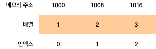
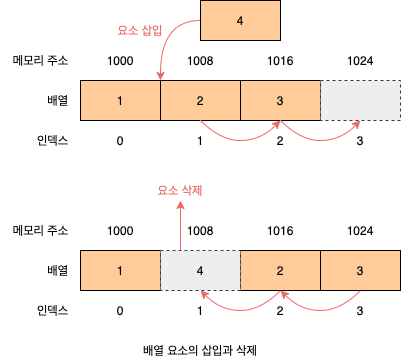
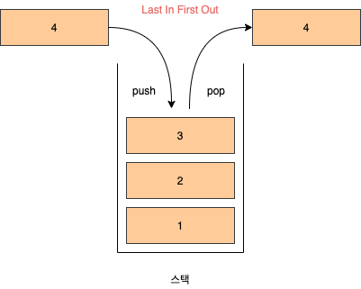
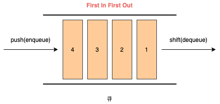
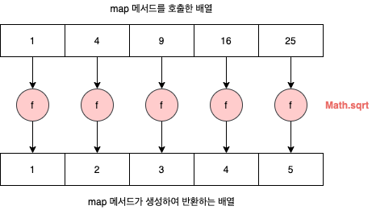
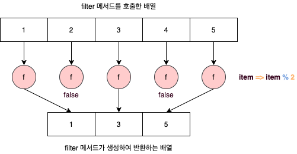
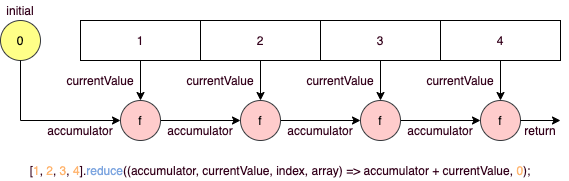
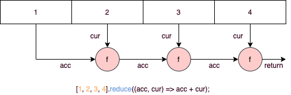

# 27. 배열

## 27.1 배열이란?

**배열**(Array)은 여러 개의 값을 순차적으로 나열한 자료구조입니다. 베열이 가지고 있는 값을 **요소**(Element)라고 부릅니다. 자바스크립트에서 모든 값은 배열의 요소가 될 수 있습니다. 즉, 원시값은 물론 객체, 함수, 배열 등 자바스크립트에서 값으로 인정하는 모든 것은 배열의 요소가 될 수 있습니다. 배열의 요소는 배열에서 자신의 위치를 나타내는 0 이상의 정수 **인덱스**(Index)를 갖습니다. 인덱스는 배열의 요소에 접근할 때 사용합니다. 대부분의 프로그래밍 언어에서 인덱스는 0부터 시작합니다.

요소에 접근할 때는 대괄호 표기법을 사용합니다. 대괄호 내에는 접근하고 싶은 요소의 인덱스를 지정합니다.

```javascript
const arr = ["apple", "banana", "orange"];

console.log(arr[0]); // apple
console.log(arr[1]); // banana
console.log(arr[2]); // orange
```

배열은 요소의 개수, 즉 배열의 길이를 나타내는 `length` 프로퍼티를 갖습니다.

```javascript
console.log(arr.length); // 3
```

배열은 인덱스와 `length` 프로퍼티를 갖기 때문에 `for` 문을 통해 순차적으로 요소에 접근할 수 있습니다.

```javascript
for (let i = 0; i < arr.length; i += 1) {
  console.log(arr[i]);
}
```

자바스크립트에 배열이라는 타입은 존재하지 않습니다. 배열은 객체 타입입니다.

```javascript
console.log(typeof arr); // object
```

배열은 배열 리터럴, `Array` 생성자 함수, `Array.of`, `Array.from` 메서드로 생성할 수 있습니다. 배열의 생성자 함수는 `Array`이며, 배열의 프로토타입 객체는 `Array.prototype`입니다. `Array.prototype`은 배열을 위한 빌트인 메서드를 제공합니다.

```javascript
const arr = [1, 2, 3];

console.log(arr.constructor === Array); // true
console.log(Object.getPrototypeOf(arr) === Array.prototype); // true
```

배열은 객체지만 일반 객체와는 구별되는 독특한 특징이 있습니다.

| 구분            |           객체            |     배열      |
| --------------- | :-----------------------: | :-----------: |
| 구조            | 프로퍼티 키와 프러퍼티 값 | 인덱스와 요소 |
| 값의 참조       |        프로퍼티 키        |    인덱스     |
| 값의 순서       |             X             |       O       |
| length 프로퍼티 |             X             |       O       |

배열의 장점은 처음부터 순차적으로 요소에 접근할 수도 있고, 마지막부터 역순으로 요소에 접근할 수도 있으며, 특정 위치부터 순차적으로 요소에 접금할 수도 있다는 것입니다. 이는 배열이 인덱스, 즉 값의 순서와 `length` 프로퍼티를 갖기 때문에 가능한 것입니다.

## 27.2 자바스크립트 배열은 배열이 아니다

**자료구조**(Data Structure)에서 말하는 배열은 동일한 크기의 메머리 공간이 빈틈없이 연속적으로 나열된 자료구조를 말합니다. 즉, 배열의 요소는 하나의 데이터 타입으로 통일되어 있으며 서로 연속적으로 인접해 있습니다. 이러한 배열을 **밀집 배열**(Dense Array)이라 합니다. 일반적인 의미의 배열은 임의의 요소에 접근(**임의 접근**(Random Access), 시간 복잡도 O(1))할 수 있습니다. 이는 매우 효율적이며, 고속으로 동작합니다.

```
검색 대상 요소의 메모리 주소 = 배열의 시작 메모리 주소 + 인덱스 * 요소의 바이트 수
```



하지만 정렬되지 않은 배열에서 특정한 요소를 검색하는 경우 배열의 모든 요소를 처음부터 특정 요소를 발견할 때까지 차례대로 검색(**선형 검색**(Line Search), 시간 복잡도 O(n))해야 합니다. 또한 배열에 요소를 삽입하거나 삭제하는 경우 배열의 요소를 연속적으로 유지하기 위해 요소를 이동시켜야 하는 단점도 있습니다.



자바스크립트의 배열은 일반적인 의미의 배열과 다릅니다. 즉, 배열의 요소를 위한 각각의 메모리 공간은 동일한 크기를 갖지 않아도 되며, 연속적으로 이어져 있지 않을 수도 있습니다. 배열의 요소가 연속적으로 이어져 있지 않는 배열을 **희소 배열**(Sparse Array)이라 합니다. 자바스크립트의 배열은 일반적인 배열의 동작을 흉내 낸 특수한 객체입니다.

```javascript
console.log(Object.getOwnPropertyDescriptors([1, 2, 3]));
/*
{
  '0': {value: 1, writable: true, enumerable: true, configurable: true},
  '1': {value: 2, writable: true, enumerable: true, configurable: true},
  '2': {value: 3, writable: true, enumerable: true, configurable: true},
  length: {value: 3, writable: true, enumerable: false, configurable: false}
}
*/
```

자바스크립트 배열은 인덱스를 나타내는 문자열을 프로퍼티 키로 가지며, `length` 프로퍼티를 갖는 특수한 객체입니다. 자바스크립트 배열의 요소는 사실 프로퍼티 값입니다. 자바스크립트에서 사용할 수 잇는 모든 값은 객체의 프로퍼티 값이 될 수 있으므로 어떤 값이라도 배열의 요소가 될 수 있습니다.

```javascript
const arr = [
  "string",
  10,
  true,
  null,
  undefined,
  NaN,
  Infinity,
  [],
  {},
  function () {},
];
```

자바스크립트 배열은 해시 테이블로 구현된 객체이므로 인덱스로 요소에 접근하는 경우 일반적인 배열보다 성능적인 면에서 느릴 수밖에 없는 구조적인 단점이 있습니다. 하지만 특정 요소를 검색하거나 요소를 삽입 또는 삭제하는 경우에는 일반적인 배열보다 빠른 성능을 기대할 수 있습니다. 인덱스로 배열 요소에 접근할 때 일반적인 배열보다 느릴 수밖에 없는 구조적인 단점을 보완하기 위해 대부분의 모던 자바스크립트 엔진은 배열을 일반 객체와 구별하여 좀 더 배열처럼 동작하도록 최적화하여 구현했습니다. 다음과 같이 배열과 일반 객체의 성능을 테스트해 보면 배열이 일반 객체보다 약 2배 정도 빠르다는 것을 알 수 있습니다.

```javascript
const arr = [];

console.time("Array Performance Test");

for (let i = 0; i < 10000000; i += 1) {
  arr[i] = i;
}
console.timeEnd("Array Performance Test"); // 약 340ms

const obj = {};

console.time("Object Preformace Test");

for (let i = 0; i < 10000000; i += 1) {
  obj[i] = i;
}

console.timeEnd("Object Preformace Test"); // 약 600ms
```

## 27.3 length 프로퍼티와 희소 배열

`length` 프로퍼티는 요소의 개수, 즉 배열의 길이를 나타내는 0 이상의 정수를 값으로 갖습니다. `length` 프로퍼티의 값은 빈 배열일 경우 0이며, 빈 배열이 아닌 경우 가장 큰 인덱스에 1을 더한 것과 같습니다. `length` 프로퍼티의 값은 0과 2^32^ - 1(4,294,967,296 - 1) 미만의 양의 정수입니다. 즉, 배열은 요소를 최대 2^32^ - 1(4,294,967,296 - 1)개 가질 수 있습니다. `length` 프로퍼티의 값은 배열에 요소를 추가하거나 삭제하면 자동 갱신됩니다.

```javascript
const arr = [1, 2, 3];
console.log(arr.length); // 3

// 요소 추가
arr.push(4);
console.log(arr.length); // 4

// 요소 삭제
arr.pop();
console.log(arr.length); // 3
```

`length` 프로퍼티 값은 요소의 개수, 즉 배열의 길이를 바탕으로 결정되지만 임의의 숫자 값을 명시적으로 할당할 수도 있습니다. 현재 `length` 프로퍼티 값보다 작은 숫자 값을 할당하면 배열의 길이가 줄어듭니다. 주의할 것은 현재 `length` 프로퍼티 값보다 큰 숫자 값을 할당하는 경우입니다. 이때 `length` 프로퍼티에 값은 성공적으로 변경되지만 실제 배열에는 아무런 변함이 없습니다. 값 없이 비어 있는 요소를 위해 메모리 공간을 확보하지 않으며 빈 요소를 생성하지도 않습니다.

```javascript
const arr = [1, 2, 3, 4, 5];

arr.length = 1;
console.log(arr); // [1]

arr.length = 3;
console.log(arr.length); // 3
console.log(arr); // [1, empty * 2]
console.log(Object.getOwnPropertyDescriptors(arr));
/*
{
  '0': {value: 1, writable: true, enumerable: true, configurable: true},
  length: {value: 3, writable: true, enumerable: false, configurable: false}
}
*/
```

이처럼 배열의 요소가 연속적으로 위치하지 않고 일부가 비어 있는 배열을 희소 배열이라 합니다. 자바스크립트는 희소 배열을 문법적으로 허용합니다. 희소 배열은 `length`와 배열 요소의 개수가 일치하지 않습니다.

```javascript
const sparse = [, 2, , 4];

console.log(sparse.length); // 4
console.log(aprse); // [empty, 2, empty, 4]
console.log(Object.getPropertyDescriptors(sparse));
/*
{
  '1': {value: 2, writable: true, enumerable: true, configurable: true},
  '3': {value: 4, writable: true, enumerable: true, configurable: true},
  length: {value: 4, writable: true, enumerable: false, configurable: false}
}
*/
```

자바스크립트는 문법적으로 희소 배열을 허용하지만 희소 배열은 사용하지 않는 것이 좋습니다. 의도적으로 희소배열을 만들어야 하는 상황은 발생하지 않습니다. 희소 배열은 연속적인 값의 집합이라는 배열의 기본적인 개념과 맞지 않으며, 성능에도 좋지 않은 영향을 줍니다. 최적화가 잘 되어 있는 모던 자바스크립트 엔진은 요소의 타입이 일치하는 배열을 생성할 때 일반적인 의미의 배열처럼 연속된 메모리 공간을 확보하는 것으로 알려져 있습니다.

## 27.4 배열 생성

### 27.4.1 배열 리터럴

배열 리터럴은 0개 이상의 요소를 쉼표로 구분하여 대괄호(`[]`)로 묶습니다. 배열 리터럴은 객체 리터럴과 달리 프로퍼티 키가 없고 값만 존재합니다.

```javascript
const arr = [1, 2, 3];
console.log(arr.length); // 3
```

### 27.4.2 Array 생성자 함수

`Object` 생성자 함수를 통해 객체를 생성할 수 있듯이 `Array` 생성자 함수를 통해 배열을 생성할 수도 있습니다.

###### 전달된 인수가 없는 경우 빈 배열을 생성합니다. 리터럴 []과 같습니다.

```javascript
new Array(); // []
```

###### 전달된 인수가 1개이고 숫자인 경우 length 프로퍼티 값이 인수인 배열을 생성합니다.

이떄 생성된 배열은 희소 배열입니다. length 값은 0이 아니지만 실제로 배열의 요소는 존재하지 않습니다. 배열은 요소를 최대 2^32^ - 1개 가질 수 있습니다. 전달된 인수가 범위를 벗어나면 RangeError가 발생합니다.

```javascript
const arr = new Array(10);

console.log(arr); // [empty * 10]
console.log(arr.length); // 10
console.log(Object.getPropertyDescriptors(arr));
/*
{
  length: {value: 10, writable: true, enumerable: false, configurable: false}
}
*/
```

###### 전달된 인수가 2개 이상이거나 숫자가 아닌 경우 인수를 요소로 갖는 배열을 생성합니다.

```javascript
const numArr = new Array(1, 2, 3);
console.log(numArr); // [1, 2, 3]

const objArr = new Array({});
console.log(objArr); // [{}]
```

###### 일반 함수로서 호출해도 배열을 생성하는 생성자 함수로 동작합니다.

이는 `Array` 생성자 함수 내부에서 `new.target`을 확인하기 때문입니다.

```javascript
const arr = Array(1, 2, 3);
```

### 27.4.3 Array.of

ES6에서 도입된 `Array.of` 메서드는 전달된 인수를 요소로 갖는 배열을 생성합니다. `Array.of`는 `Array` 생성자 함수와 다르게 전달된 인수가 1개이고 숫자이더라도 인수를 요소로 갖는 배열을 생성합니다.

```javascript
Array.of(1); // [1]
Array.of(1, 2, 3); // [1, 2, 3]
Array.of("string"); // ['string']
```

### 27.4.4 Array.from

ES6에서 도입된 Array.from 메서드는 **유사 배열 객체**(Array-Like Object) 또는 **이터러블 객체**(Iterable Object)를 인수로 전달받아 배열로 변환하여 반환합니다.

```javascript
Array.from({ length: 2, 0: "a", 1: "b" }); // ['a', 'b']
Array.from("Hello"); // ['H', 'e', 'l', 'l', 'o']
```

`Array.from`을 사용하면 두 번째 인수로 전달한 콜백 함수를 통해 값을 만들면서 요소를 채울 수 있습니다. `Array.from` 메서드는 두 번째 인수로 전달한 콜백 함수에 첫 번째 인수에 의해 생성된 배열의 요소값과 인덱스를 순차적으로 전달하면서 호출하고, 콜백 함수의 반환값으로 구성된 배열을 반환합니다.

```javascript
Array.from({ length: 3 }, (_, i) => i); // [0, 1, 2]
```

## 27.5 배열 요소의 참조

배열의 요소를 참조할 때에는 대괄호(`[]`) 표기법을 사용합니다. 대괄호 안에는 인덱스가 와야 합니다. 정수로 평가되는 표현식이라면 인덱스 대신 사용할 수 있습니다. 인덱스는 값을 참조할 수 있다는 의미에서 객체의 프로퍼티 키와 같은 역할을 합니다. 따라서 존재하지 않는 프로퍼티 키로 객체의 프로퍼티에 접근했을 때 `undefined`를 반환하는 것처럼 배열도 존재하지 않는 요소를 참조하면 `undefined`를 반환합니다.

```javascript
const arr = [1, 2];

console.log(arr[0]); // 1
console.log(arr[1]); // 2
console.log(arr[2]); // undefined
```

## 27.6 배열 요소의 추가와 갱신

객체에 프로퍼티를 동적으로 추가할 수 있는 것처럼 배열에도 요소를 동적으로 추가할 수 있습니다. 존재하지 않는 인덱스를 사용해 값을 할당하면 새로운 요소가 추가됩니다. 이때 `length` 프로퍼티 값은 자동 갱신됩니다. 만약 현재 배열의 `length` 프로퍼티 값보다 큰 인덱스로 새로운 요소를 추가하면 희소 배열이 됩니다. 이때 인덱스로 요소에 접근하여 명시적으로 값을 할당하지 않은 요소는 생성되지 않는다는 것에 주의합니다.

```javascript
const arr = [0];

arr[1] = 1;
console.log(arr); // [0, 1]
console.log(arr.length); // 2

arr[100] = 100;
console.log(arr); // [0, 1, empty * 98, 100]
console.log(arr.length); // 101
```

이미 요소가 존재하는 요소에 값을 재할당하면 요소값이 갱신됩니다.

```javascript
arr[1] = 10;
console.log(arr); // [0, 10, empty * 98, 100]
```

인덱스는 요소의 위치를 나타내므로 반드시 0 이상의 정수(또는 정수 형태의 문자열)를 사용해야 합니다. 만약 정수 이외의 값을 인덱스처럼 사용하면 요소가 생성되는 것이 아니라 프로퍼티가 생성됩니다. 이때 추가된 프로퍼티는 `length` 프로퍼티 값에 영향을 주지 않습니다.

```javascript
const arr = [];

arr[0] = 1;
arr["1"] = 2;
arr["foo"] = 3;
arr.bar = 4;
arr[1.1] = 5;
arr[-1] = 6;

console.log(arr); // [1, 2, foo: 3, bar: 4, '1.1': 5, '-1': 6]
console.log(arr.length); // 2
```

## 27.7 배열 요소의 삭제

배열은 사실 객체이기 때문에 배열의 특정 요소를 삭제하기 위해 `delete` 연산자를 사용할 수 있습니다. 이때 배열은 희소 배열이 되며 `length` 프로퍼티 값은 변하지 않습니다. 따라서 희소 배열을 만드는 `delete` 연산자는 사용하지 않는 것이 좋습니다.

```javascript
const arr = [1, 2, 3];

delete arr[1];
console.log(arr); // [1, empty, 3]
```

## 27.8 배열 메서드

배열 메서드는 결과물을 반환하는 패턴이 두 가지이므로 주의가 필요합니다. 배열에는 원본 배열(배열 메서드를 호출한 배열, 즉 배열 메서드의 구현체 내부에서 `this`가 가리키는 객체)을 **직접 변경하는 메서드**(Mutator Method)와 원본 배열을 직접 변경하지 않고 **새로운 배열을 생성하여 반환하는 메서드**(Axxessor Method)가 있습니다. ES5부터 도입된 배열 메서드는 대부분 원본 배열을 직접 변경하지 않지만, 초창기 배열 메서드는 원본 배열을 직접 변경하는 경우가 많습니다. 원본 배열을 직접 변경하는 메서드는 외부 상태를 직접 변경하는 부수 효과가 있으므로 사용할 때 주의해야 합니다. 따라서 가급적 원본 배열을 직접 변경하지 않는 메서드를 사용하는 편이 좋습니다.

### Array.isArray

`Array.isArray`는 `Array` 생성자 함수의 정적 메서드입니다. `Array.isArray` 메서드는 전달된 인수가 배열이면 `true`, 배열이 아니면 `false`를 반환합니다.

```javascript
// true
Array.isArray([]);
Array.isArray(new Array());

// false
Array.isArray();
Array.isArray({});
Array.isArray({ 0: 1, length: 1 });
```

### 27.8.2 Array.prototype.indexOf

`indexOf` 메서드는 원본 배열에서 인수로 전달된 요소를 검색하여 인덱스를 반환합니다.

- 원본 배열에 인수로 전달한 요소와 중복되는 요소가 여러 개 있다면 첫 번째로 검색된 요소의 인덱스를 반환합니다.
- 원본 배열에 인수로 전달한 요소가 존재하지 않으면 `-1`을 반환합니다.
- 두 번째 인수는 검색을 시작할 인덱스입니다. 두 번째 인수를 생략하면 처음부터 검색합니다.

```javascript
const arr = [1, 2, 2, 3];

arr.indexOf(2); // 1
arr.indexOf(4); // -1
arr.indexOf(2, 2); // 2
```

`indexOf` 메서드는 배열에 특정 요소가 존재하는 확인할 때 유용합니다. 하지만 `indexOf` 메서드 대신 ES7에서 도입된 `Array.prototype.includes` 메서드를 사용하면 가독성이 더 좋습니다.

### 27.8.3 Array.prototype.push

`push` 메서드는 인수로 전달받은 모든 값을 원본 배열의 마지막 요소로 추가하고 변경된 `length` 프로퍼티 값을 반환합니다. `push` 메서드는 원본 배열을 직접 변겅합니다.

```javascript
const arr = [1, 2];
const result = arr.push(3, 4);

console.log(result); // 4
console.log(arr); // [1, 2, 3, 4]
```

`psuh` 메서드는 성능 면에서 좋지 않습니다. 마지막 요소로 추가할 요소가 하나뿐이라면 `push` 메서드를 사용하지 않고 `length` 프로퍼티를 사용하여 배열의 마지막에 요소를 직접 추가할 수도 있습니다. 이 방법이 `push` 메서드보다 빠릅니다.

```javascript
const arr = [1, 2];

arr[arr.length] = 3;
console.log(arr); // [1, 2, 3]
```

`push` 메서드는 원본 배열을 직접 변경하는 부수 효과가 있습니다. 따라서 `push` 메서드보다는 ES6의 스프레드 문법을 사용하는 편이 좋습니다. 스프레드 문법을 사용하면 함수 호출 없이 표현식으로 마지막에 요소를 추가할 수 있으며 부수 효과도 없습니다. 이에 대해서는 **35장 스프레드 문법**에서 자세히 살펴볼 것입니다.

```javascript
const arr = [1, 2];

const newArr = [...arr, 3];
console.log(newArr); // [1, 2, 3]
```

### 27.8.4 Array.prototype.pop

`pop` 메서드는 원본 배열에서 마지막 요소를 제거하고 요소를 반환합니다. 원본 배열이 빈 배열이면 `undefined`를 반환합니다. `pop` 메서드는 원본 배열을 직접 변경합니다.

```javascript
const arr = [1, 2];
const result = arr.pop();

console.log(result); // 2
console.log(arr); // [1]
```

`pop` 메서드와 `push` 메서드를 사용하면 스택을 쉽게 구현할 수 있습니다. **스택**(Stack)은 데이터를 마지막에 밀어 넣고, 마지막에 밀어 넣은 데이터를 먼저 꺼내는 후입 선출(Last In First Out, LIFO) 방식의 자료구조입니다. 스택에 데이터를 밀어 넣는 것을 **푸시**(Psuh)라 하고 스택에서 데이터를 꺼내는 것을 **팝**(Pop)이라고 합니다. 스택을 클래스로 구현해 보면 다음과 같습니다.

```javascript
class Stack {
  #array;

  constructor(array = []) {
    if (!Array.isArray(array)) {
      throw new TypeError(`${array} is not an array`);
    }

    this.#array = [...array];
  }

  push(value) {
    return this.#array.push(value);
  }

  pop() {
    return this.#array.pop();
  }

  entries() {
    return [...this.#array];
  }
}

const stack = new Stack([1, 2, 3]);

stack.push(4);
console.log(stack.entries()); // [1, 2, 3, 4]

stack.pop();
console.log(stack.entries()); // [1, 2, 3]
```



### 27.8.5 Array.prototype.unshift

`unshift` 메서드는 인수로 전달받은 모든 값을 원본 배열의 선두에 요소로 추가하고 변경된 `length` 프로퍼티 값을 반환합니다. `unshift` 메서드는 원본 배열을 직접 변경합니다.

```javascript
const arr = [1, 2];
const result = arr.unshift(3, 4);

console.log(result); // 4
console.log(arr); // [3, 4, 1, 2]
```

`unshift` 메서드는 원본 배열을 직접 변경하는 부수 효과가 있습니다. 따라서 `unshift` 메서드보다는 ES6의 스프레드 문법을 사용하는 편이 좋습니다.

```javascript
const arr = [1, 2];

const newArr = [3, 4, ...arr];
console.log(newArr); // [3, 4, 1, 2]
```

### 27.8.6 Array.prototype.shift

`shift` 메서드는 원본 배열에서 첫 번째 요소를 제거하고 제거한 요소를 반환합니다. 원본 배열이 빈 배열이면 `undefined`를 반환합니다. `shift` 메서드는 원본 배열을 직접 변경합니다.

```javascript
const arr = [1, 2];
const result = arr.shift();

console.log(result); // 1
console.log(arr); // [2]
```

`shift` 메서드와 `push` 메서드를 사용하면 큐를 쉽게 구현할 수 있습니다. **큐**(Queue)는 데이터를 마지막에 밀어 넣고, 처음 데이터, 즉 가장 먼저 밀어 넣은 데이터를 먼저 꺼내는 선입 선출(First In First Out, FIFO) 방식의 차료구조입니다. 스택은 언제나 마지막에 밀어 넣은 최신 데이터를 취득하지만 큐는 언제나 데이터를 밀어 넣은 순서대로 취득합니다. 큐를 클래스로 구현해 보면 다음과 같습니다.

```javascript
class Queue {
  #array;

  constructor(array = []) {
    if (!Array.isArray(array)) {
      throw new TypeError(`${array} is not an array`);
    }

    this.#array = [...array];
  }

  enqueue(value) {
    return this.#array.push(value);
  }

  dequeue() {
    return this.#aaray.shift();
  }

  entries() {
    return [...this.#array];
  }
}

const queue = new Queue([1, 2, 3]);

queue.enqueue(4);
console.log(queue.entries()); // [1, 2, 3, 4]

queue.dequeue();
console.log(queue.entries()); // [2, 3, 4]
```



### 27.8.7 Array.prototype.concat

`concat` 메서드는 인수로 전달된 값들(배열 또는 원시값)을 원본 배열의 마지막 요소로 추가한 새로운 배열을 반환합니다. 인수로 전달한 값이 배열인 경우 배열을 해체하여 새로운 배열의 요소로 추가합니다. 원본 배열은 변경되지 않습니다.

```javascript
const arr1 = [1, 2];
const arr2 = [3, 4];

const result1 = arr1.concat(arr2);
console.log(result1); // [1, 2, 3, 4]

const result2 = arr1.concat(3);
console.log(result2); // [1, 2, 3]

const result3 = arr1.concat(arr2, 5);
console.log(result3); // [1, 2, 3, 4, 5]

console.log(arr1); // [1. 2]
```

`push`와 `unshift` 메서드는 `concat` 메서드로 대체할 수 있습니다. `push`와 `unshift` 메서드는 `concat` 메서드와 유사하게 동작하지만 다음과 같이 미묘한 차이가 있습니다.

- `push`와 `unshift` 메서드는 원본 배열을 직접 변경하지만, `concat` 메서드는 원본 배열을 변경하지 않고 새로운 배열을 반환합니다.
- 인수로 전달받은 값이 배열린 경우 `push`와 `unshift` 메서드는 배열을 그대로 원본 배열의 마지막/첫 번째 요소로 추가하지만 `concat` 메서드는 인수로 전달받은 배열을 해체하여 새로운 배열의 마지막 요소로 추가합니다.

`concat` 메서드는 ES6 스프레드 문법으로 대체할 수 있습니다.

```javascript
const result1 = [1, 2].concat([3, 4]);
console.log(result1); // [1, 2, 3, 4]

const result2 = [...[1, 2], ...[3, 4]];
console.log(result2); // [1, 2, 3, 4]
```

### 27.8.8 Array.prototype.splice

원본 배열의 중간에 요소를 추가하거나 중간에 잇는 요소를 제거하는 경우 `splice` 메서드를 사용합니다. `splice` 메서드는 3개의 매개변수가 있으며 원본 배열을 직접 변경합니다.

- **start:** 원본 배열의 요소를 제거하기 시작할 인덱스입니다. start만 지정하면 원본 배열의 start부터 모든 요소를 제거합니다. start가 음수인 경우 배열의 끝에서의 인덱스를 나타냅니다. 만약 start가 `-1`이면 마지막 요소를 가리키고 `-n`이면 마지막에서 n번째 요소를 가리킵니다.
- **deleteCount:** 원본 배열의 요소를 제거하기 시작할 인덱스인 start부터 제거할 요소의 개수입니다. deleteCount가 `0`인 경우 아무런 요소도 제거되지 않습니다.(옵션)
- **items:** 제거한 위치에 삽입할 요소들의 목록입니다. 생략할 셩우 원본 배열에서 요소들을 제거하기만 합니다.(옵션)

```javascript
const arr = [1, 2, 3, 4];

// 원본 배열의 인덱스 1부터 3개의 요소를 제거하고 그 자리에 새로운 요소 20, 30을 삽입합니다.
const result = arr.splice(1, 2, 20, 30);

// 제거한 요소가 배열로 반환됩니다.
console.log(result); // [2, 3]
// 원본 배열을 직접 변경합니다.
console.log(arr); // [1, 20, 30, 4]
```

`splice` 메서드의 두 번째 인수, 즉 제거할 요소의 개수를 생략하면 첫 번째 인수로 전달된 시작 인덱스부터 모든 요소를 제거합니다.

```javascript
const arr = [1, 2, 3, 4];
const result = arr.splice(1);

console.log(result); // [2, 3, 4]
console.log(arr); // [1]
```

배열에서 특정 요소를 제거하려면 `indexOf` 메서드를 통해 특정 요소의 인덱스를 취득한 다음 `splice` 메서드를 사용합니다.

```javascript
const arr = [1, 2, 3, 1, 2];

function remove(array, item) {
  const index = array.indexOf(item);
  if (index !== -1) array.splice(index, 1);
  return array;
}

console.log(remove(arr, 2)); // [1, 3, 1, 2]
console.log(remove(arr, 10)); // [1, 3, 1, 2]
```

### 27.8.9 Array.prototype.slice

`slice` 메서드는 인수로 전달된 범위의 요소들을 복사하여 배열로 반환합니다. 원본 재열은 변경되지 않습니다. `slice` 메서드는 두 개의 변수를 갖습니다.

- **start:** 복사를 시작할 인덱스입니다. 음수인 경우 배열의 끝에서의 인덱스를 나타냅니다. 예를 들어 `slice(-1)`는 배열의 마지막 두 개의 요소를 복사하여 배열로 반환합니다.
- **end:** 복사를 종료할 인덱스입니다. 이 인덱스에 해당하는 요소는 복사되지 않습니다. end는 생략 가능하며 생략 시 기본값은 `length` 프로퍼티 값입니다.

```javascript
const arr = [1, 2, 3];

console.log(arr.slice(0, 1)); // [1]
console.log(arr.slice(1, 2)); // [2]
console.log(arr); // [1, 2, 3]
```

`slice` 메서드의 인수르 모두 생략하면 원본 배열의 복사본을 생성하여 반환합니다. 이때 생성된 복사본은 **얕은 복사**(Shallow Copy)를 통해 생성됩니다.

```javascript
class Todo {
  constructor(id, content, completed) {
    this.id = id;
    this.content = content;
    this.completed = completed;
  }
}

const todos = [
  new Todo(1, "HTML", false),
  new Todo(2, "CSS", true),
  new Todo(3, "JavaScript", false),
];

const _todos = todos.slice();

console.log(_todos === todos); // false
console.log(_todos[0] === todos[0]); // true
```

`slice` 메서드가 복사본을 생성하는 것을 이용하여 `arguments`, `HTMLCollection`, `NodeList` 같은 유사 배열 객체를 배열로 변환할 수 있습니다. 하지만 `Array.from` 메서드를 사용하면 더욱 간단하게 유사 배열 객체를 배열로 변환할 수 있습니다. `Array.from` 메서드는 유사 배열 객체 또는 이터러블 객체를 배열로 변환합니다. 이터러블 객체는 ES6 스프레드 문법을 사용하여 간단하게 배열로 변환할 수도 있습니다.

```javascript
function useSlice() {
  const arr = Array.prototype.slice.call(arguments);
  console.log(arr);
}

function useArrayFrom() {
  const arr = Array.from(arguments);
  console.log(arr);
}

function useSpread() {
  const arr = [...arguments];
  console.log(arr);
}

useSlice(1, 2, 3); // [1, 2, 3]
useArrayFrom(1, 2, 3); // [1, 2, 3]
useSpread(1, 2, 3); // [1, 2, 3]
```

### 27.8.10 Array.prototype.join

`join` 메서드는 원본 배열의 모든 요소를 문자열로 변환한 후, 인수로 전달받은 문자열, 즉 **구분자**(Separator)로 연결한 문자열을 반환합니다. 구분자는 생략 가능하며 기본 구분자는 콤마(`,`)입니다.

```javascript
const arr = [1, 2, 3, 4];

console.log(arr.join()); // 1,2,3,4
console.log(arr.join(":")); // 1:2:3:4
```

### 27.8.11 Array.prototype.reverse

`reverse` 메서드는 원본 배열의 순서를 반대로 뒤집습니다. 이때 원본 배열이 변경됩니다. 반환값은 변경된 배열입니다.

```javascript
const arr = [1, 2, 3];
const result = arr.reverse();

console.log(arr); // [3, 2, 1]
console.log(result); // [3, 2, 1]
```

### 27.8.12 Array.prototype.fill

ES6에서 도입된 `fill` 메서드는 인수로 전달받은 값을 배열의 처음부터 끝까지 요소로 채웁니다. 이때 원본 배열이 변경됩니다.

```javascript
const arr = [1, 2, 3];
arr.fill(9);
console.log(arr); // [0, 0, 0]
```

두 번째 인수로 요소 채우기를 시작할 인덱스를 전달할 수 있습니다.

```javascript
const arr = [1, 2, 3];
arr.fill(0, 1);
console.log(arr); // [1, 0, 0]
```

세 번째 인수로 요소 채우기를 멈출 인덱스를 전달할 수 있습니다.

```javascript
const arr = [1, 2, 3, 4, 5];
arr.fill(0, 1, 3);
console.log(arr); // [1, 0, 0, 4, 5]
```

`fill` 메서드를 사용하면 배열을 생성하면서 특정 값으로 요소를 채울 수 있습니다.

```javascript
const arr = new Array(3).fill(3);

// fill 메서드는 변경된 원본 배열을 반환합니다.
console.log(arr); // [1, 1, 1]
```

### 27.8.13 Array.prototype.includes

ES7에서 도입된 `includes` 메서드는 배열 내에 특정 요소가 포함되어 있는지 확인하여 `true` 또는 `false`를 반환합니다. 첫 번째 인수로 검색할 대상으 검색할 대상을 지정합니다.

```javascript
const arr = [1, 2, 3];

console.log(arr.includes(2)); // true
console.log(arr.includes(100)); // false
```

두 번째 인수로 검색을 시작할 인덱스를 전달할 수 있습니다. 두 번째 인수를 생략할 경우 기본값 `0`이 설정됩니다. 만약 두 번쟤 인수에 음수를 전달하면 `lnegth` 프로퍼티 값과 음수 인덱스를 합산하여(length + index) 검색 시작 인덱스를 설정합니다.

```javascript
const arr = [1, 2, 3];

console.log(arr.includes(1, 1)); // false
console.log(arr.includes(3, -1)); // true
```

벼열에서 인수로 전달된 요소를 검색하여 인덱스를 반환하는 `indexOf` 메서드를 사용하여도 배열 내에 특정 요소가 포함되어 있는지 확인할 수 있습니다. 하지만 `indexOf` 메서드를 사용하면 반환값이 `-1`인지 확인해 보아야 하고 배열에 `NaN`이 포함되어 있는지 확인할 수 없다는 문제가 있습니다.

```javascript
[NaN].indexOf(NaN); // -1
[NaN].includes(NaN); // true
```

### 27.8.14 Array,prototype.flat

ES10(ECMAScript 2019)에서 도입된 `flat` 메서드는 인수로 전달한 깊이만큼 재귀적으로 배열을 평찬화합니다. 인수를 생략할 경우 기본값은 `1`입니다. 인수로 `Infinity`를 전달하면 중첩 배열 모두를 편탄화 합니다.

```javascript
[1, [2, [3, [4]]]].flat(); // [1, 2, [3, [4]]]
[1, [2, [3, [4]]]].flat(1); // [1, 2, [3, [4]]]

[1, [2, [3, [4]]]].flat(2); // [1, 2, 3, [4]]
[1, [2, [3, [4]]]].flat().flat(); // [1, 2, 3, [4]]

[1, [2, [3, [4]]]].flat(Infinity); // [1, 2, 3, 4]
```

## 27.9 배열 고차 함수

**고차 함수**(Higher-Order Function, HOF)는 함수를 인수로 전달받거나 함수를 반환하는 함수를 말합니다. 자바스크립트의 함수는 일급 객체이므로 함수를 값처럼 인수로 전달할 수 있으며 반환할 수도 있습니다. 고차 함수는 외부 상태의 **변경이나 가변**(Mutable) 데이터를 피하고 **불변성**(Immutability)을 지향하는 함수형 프로그래밍에 기반을 두고 있습니다.

함수형 프로그래밍은 **순수 함수**(Pure Function)와 보조 함수의 조합을 통해 로직 내에 존재하는 조건문과 반복문을 제거하여 복잡성을 해결하고 변수의 사용을 억제하여 상태 변경을 피하려는 프로그래밍 패러다임입니다. 조건문이나 반복문은 로직의 흐름을 이해하기 어렵게 하여 가독성을 해치고, 변수는 누군가에 의해 언제든지 변경될 수 있어 오류 발생의 근본적 원인이 될 수 있기 때문입니다. 함수형 프로그래밍은 결국 순수 함수를 통해 부수 효과를 최대한 억제하여 오류를 피하고 프로그램의 안정성을 높이려는 노력의 일환이라고 할 수 있습니다.

### 27.9.1 Array.prototype.sort

`sort` 메서드는 배열의 요소를 정렬합니다. 원본 배열을 직접 변경하여 정렬된 배열을 반환합니다. `sort` 메서드는 기본적으로 오름차순으로 요소를 정렬합니다.

```javascript
const fruitsEn = ["Banana", "Orange", "Apple"];
const fruitsKo = ["바나나", "오렌지", "사과"];

fruitsEn.sort();
fruitsKo.sort();

console.log(fruitsEn); // ['Apple', 'Banana', 'Orange']
console.log(fruitsKo); // ['바나나', '사과', '오렌지']
```

`sort` 메서드의 기본 정렬 순서는 유니코드 코드 포인트의 순서를 따릅니다. 배열의 요소가 순자 타입이라 할지라도 배열의 요소를 일시적으로 문자열로 반환한 후 유티코드 코드 포인트의 순서를 기준으로 정렬합니다.

```javascript
["2", "10"].sort(); // ["10", "2"]
[2, 10].sort(); // [10, 2]
```

따라서 문자가 아닌 요소를 정렬할 때는 `sort` 메서드에 정렬 순서를 정의하는 비교 함수를 인수로 전달해야 합니다. 비교 함수는 양수나 음수 또는 0을 반환해야 합니다. 비교 함수의 반환값이 0보다 작으면 비교 함수의 첫 번째 인수를 우선하여 정렬하고, 0기면 정렬하지 않으며, 0보다 크면 두 번째 인수를 우선하여 정렬합니다.

```javascript
const points = [40, 100, 1, 5, 2, 25, 10];

points.sort((a, b) => a - b);
console.log(points); // [1, 2, 5, 10, 25, 40, 100]

points.sort((a, b) => b - a);
console.log(points); // [100, 40, 25, 10, 5, 2, 1]
```

### 27.9.2 Array.prototype.forEach

`forEach`는 `for` 문을 대체할 수 있는 고차 함수입니다. `forEach` 메서드는 자신의 내부에서 반복문을 실행합니다. `forEach` 메서드는 반복문을 추상화한 고차함수로서 내부에서 반복문을 통해 자신을 호출한 배열을 순회하면서 수행해야 할 처리를 콜백 함수로 전달받아 반복 호출합니다. `forEach` 메서드의 콜백 함수는 `forEach` 메서드를 호출한 배열의 요소값과 인덱스, `forEach` 메서드를 호출한 배열 자체, 즉 `this`를 순차적으로 전달받을 수 있습니다.

```javascript
[1, 2, 3].forEach((item, index, arr) => {
  console.log(
    `요소값: ${item}, 인덱스: ${index}, this: ${JSON.stringify(arr)}`
  );
});
/*
요소값: 1, 인덱스: 0, this: [1,2,3]
요소값: 2, 인덱스: 1, this: [1,2,3]
요소값: 3, 인덱스: 2, this: [1,2,3]
*/
```

`forEach` 메서드는 원본 배열(`forEach` 메서드를 호출한 배열, 즉 `this`)를 변경하지 않습니다. 하지만 콜백 함수를 통해 원본 배열을 변경할 수 있습니다.

```javascript
const numbers = [1, 2, 3];

numbers.forEach((item, index, arr) => {
  arr[index] = item ** 2;
});

console.log(numbers); // [1, 4, 9]
```

`forEach` 메서드의 반환값은 언제나 `undefined`입니다.

```javascript
const result = [1, 2, 3].forEach(console.log);
console.log(result); // undefined
```

`forEach` 메서드의 두 번째 인수로 `forEach` 메서드의 콜백 함수 내부에서 `this`로 사용할 객체를 전달할 수 있습니다.

```javascript
class Numbers {
  numberArray = [];

  multiply(arr) {
    arr.forEach(function (itme) {
      this.numberArray.push(item * item);
    }, this);
  }
}

const numbers = new Numbers();
numbers.multiply([1, 2, 3]);
console.log(numbers.numberArray); // [1, 4, 9]
```

더 나은 방법은 ES6의 화살표 함수를 사용하는 것입니다. 화살표 함수는 함수 자체의 `this` 바인딩을 갖지 않습니다. 따라서 화살표 함수 내부에서 `this`를 참조하면 상위 스코프, 즉 `multiply` 메서드 내부 `this`를 그대로 참조합니다.

```javascript
class Numbers {
  numberArray = [];

  multiply(arr) {
    arr.forEach((itme) => this.numberArray.push(item * item));
  }
}

const numbers = new Numbers();
numbers.multiply([1, 2, 3]);
console.log(numbers.numberArray); // [1, 4, 9]
```

`forEach` 메서드 내부에서는 반복문(`for` 문)을 통해 배열을 순회할 수밖에 없습니다. 단, 반복문을 메서드 내부로 은닉하여 로직의 흐름을 이해하기 쉽게 하고 복잡성을 해결합니다. `forEAch` 메서드의 동작을 이해하기 위해 `forEach` 메서드의 폴리필을 살표봅니다.

```javascript
if (!Array.prototype.forEach) {
  Array.prototype.forEach = function (callback, thisArg) {
    if (typeof callback !== "function") {
      throw new TypeError(callback + " is not a function");
    }

    thisArg = thisArg || window;

    for (var i = 0; i < this.length; i += 1) {
      callback.call(thisArg, this[i], i, this);
    }
  };
}
```

`forEach` 메서드는 `for` 문과 달리 `break`, `continue` 문을 사용할 수 없습니다. 다시 말해, 배열의 모든 요소를 빠짐없이 모두 순회하며 중간에 순회를 중단할 수 없습니다. 희소 배열의 경우 존재하지 않는 요소는 순회 대상에서 제외됩니다. 이는 앞으로 살펴볼 배열을 순회하는 `map`, `filter`, `reduce` 메서드 등에서도 마찬가지입니다.

```javascript
const arr = [1, , 3];
arr.forEach((v) => console.log(v)); // 1, 3
```

`forEach` 메서드는 `for` 문에 비해 성능이 좋지는 않지만 가독성은 더 좋습니다. 따라서 요소가 대단히 많은 배열을 순회하거나 시간이 많이 걸리는 복잡한 코드 또는 높은 성능이 필요한 경우가 아니라면 `for` 문 대신 `forEach` 메서드를 사용할 것을 권장합니다.

### 27.9.3 Array.prototype.map

`map` 메서드는 자신을 호출한 배열의 모든 요소를 순회하면서 인수로 전달받은 콜백 함수를 반복 호출합니다. `forEach` 메서드는 언제나 `undefined`를 반환하고, `map` 메서드는 콜백 함수의 반환값들로 구성된 새로운 배열을 반환하는 차이가 있습니다. 즉, `forEach` 메서드는 단순히 반복문을 대체하기 위한 고차 함수이고, `map` 메서드는 요소값을 다른 값으로 **매핑**(Mapping)한 새로운 배열을 생성하기 위한 고차 함수입니다. `map` 메서드가 생성하여 반환하는 새로운 배열의 `length` 프로퍼티 값은 `map` 메서드를 호출한 배열의 `length` 프로퍼티 값과 반드시 일치합니다. 즉, `map` 메서드를 호출한 배열과 `map` 메서드가 생성하여 반환한 배열은 1:1 매핑합니다.



`forEach` 메서드와 마찬가지로 `map` 메서드의 콜백 함수는 `map` 메서드를 호출한 배열의 요소값과 인덱스, `map` 메서드를 호출한 배열 자체, 즉 `this`를 순차적으로 전달받을 수 있습니다.

```javascript
const numbers = [1, 4, 9, 16, 25];
const roots = numbers.map((item, index, arr) => {
  console.log(
    `요소값: ${item}, 인덱스: ${index}, this: ${JSON.stringify(arr)}`
  );
  return Math.sqrt(item);
});
/*
요소값: 1, 인덱스: 0, this: [1,4,69,16,25]
요소값: 4, 인덱스: 1, this: [1,4,69,16,25]
요소값: 9, 인덱스: 2, this: [1,4,69,16,25]
요소값: 16, 인덱스: 3, this: [1,4,69,16,25]
요소값: 25, 인덱스: 4, this: [1,4,69,16,25]
*/

console.log(roots); // [1, 2, 3, 4, 5]
```

`forEach` 메서드와 마찬가지로 `map` 메서드의 두 번째 인자로 `map` 메서드의 콜백 함수 내부에서 `this`로 사용할 객체를 전달할 수 있습니다. `map` 메서드에서 살펴보았듯이 더 나은 방법은 화살표 함수를 사용하는 것입니다.

### 27.9.4 Array.prototype.filter

`filter` 메서드는 자신을 호출한 배열의 모든 요소를 순회하면서 인수로 전달받은 콜백 함수를 반복 호출합니다. 그리고 콜백 함수의 반환값이 `true`인 요소로만 구성된 새로운 배열을 반환합니다. 이때 원본 배열은 변경되지 않습니다. `filter` 메서드는 자신을 호출한 배열에서 필터링 조건을 만족하는 특정 요소만 추출하여 새로운 배열을 만들고 싶을 때 사용합니다. 따라서 `filter` 메서드가 생성하여 반환한 새로운 배열의 `length` 프로퍼티 값은 `filter` 메서드를 호출한 배열의 `length` 프로퍼티 값과 같거나 작습니다.



`forEach`, `map` 메서드와 마찬가지로 `filter` 메서드의 콜백 함수는 `filter` 메서드를 호출한 배열의 요소값과 인덱스, `filter` 메서드를 호출한 배열 자체, 즉 `this`를 순차적으로 전달받을 수 있습니다.

```javascript
const numbers = [1, 2, 3, 4, 5];
const result = numbers.filter((item, index, arr) => {
  console.log(
    `요소값: ${item}, 인덱스: ${index}, this: ${JSON.stringify(arr)}`
  );
  return item % 2;
});
/*
요소값: 1, 인덱스: 0, this: [1,2,3,4,5]
요소값: 2, 인덱스: 1, this: [1,2,3,4,5]
요소값: 3, 인덱스: 2, this: [1,2,3,4,5]
요소값: 4, 인덱스: 3, this: [1,2,3,4,5]
요소값: 5, 인덱스: 4, this: [1,2,3,4,5]
*/

console.log(result); // [1, 3, 5]
```

`forEach`, `map` 메서드와 마찬가지로 `filter` 메서드의 두 번째 인자로 `filter` 메서드의 콜백 함수 내부에서 `this`로 사용할 객체를 전달할 수 있습니다. `map` 메서드에서 살펴보았듯이 더 나은 방법은 화살표 함수를 사용하는 것입니다.

### 27.9.5 Array.prototype.reduce

`reduce` 메서드는 자신을 호출한 배열을 모든 요소를 순회하며 인수로 전달받은 콜백 함수를 반복 호출합니다. 그리고 콜백 함수의 반환값을 다음 순회 시에 콜백 함수의 첫 번째 인수로 전달하면서 콜백 함수를 호출하여 **하나의 결과값을 만들어 반환합니다.** 이때 원본 배열은 변경되지 않습니다.



`reduce` 메서드는 첫 번째 인수로 콜백 함수, 두 번째 인수로 초기값을 전달받습니다. `reduce` 메서드의 콜백 함수에는 4개의 인수, 초기값 또는 콜백 함수의 이전 반환값, `reduce` 메서드를 호출한 배열의 요소값과 인덱스, `reduce` 메서드를 호출한 배열 자체, 즉 `this`가 전달됩니다.

```javascript
const sum = [1, 2, 3, 4].reduce(
  (accumulator, currentValue, index, array) => accumulator + currentValue,
  0
);

console.log(sum); // 10
```

`reduce` 메서드의 두 번째 인수로 전달하는 초기값은 첫 번재 순회에 콜백 함수의 펏 번째 인수로 전달됩니다. 주의할 것은 두 번째 인수로 전달하는 초기값이 옵션이라는 것입니다. 즉, `reduce` 메서드의 두 번째 인수로 전달하는 초기값은 생략할 수 있습니다.

```javascript
const sum = [1, 2, 3, 4].reduce((acc, cur) => acc + cur);
console.log(sum); // 10
```



하지만 `reduce` 메서드를 호출할 때는 언제나 초기값을 전달하는 것이 안전합니다.

```javascript
let sum = [].reduce((acc, cur) => acc + cur, 0);
console.log(sum); // 0

sum = [].reduce((acc, cur) => acc + cur); // TypeError: Reduce of empty array with no initial value
```

### 27.9.6 Array.prototype.some

`som` 메서드는 자신을 호출한 배열의 요소를 순회하면서 인수로 전달된 콜백 함수를 호출합니다. 이때 `some` 메서드는 콜백 함수의 변환값이 단 한번이라도 참이면 `true`, 모두 거짓이면 `false`를 반환합니다. 단, `some` 메서드를 호출한 배열이 빈 배열인 경우 언제나 `false`를 반환하므로 주의하기 바랍니다.

`forEach`, `map`, `filter` 메서드와 마찬가지로 `some` 메서드의 콜백 함수는 `some` 메서드를 호출한 요소값과 인덱스, `some` 메서드를 호출한 배열 자체, 즉 `this`를 순차적으로 전달받을 수 있습니다.

```javascript
[5, 10, 15].some((item) => item > 10); // true
[5, 10, 15].some((item) => item < 0); // false
[].some((item) => item > 3); // false
```

`forEach`, `map`, `filter` 메서드와 마찬가지로 `some` 메서드의 두 번째 인자로 `some` 메서드의 콜백 함수 내부에서 `this`로 사용할 객체를 전달할 수 있습니다. 더 나은 방법은 화살표 함수를 사용하는 것입니다.

### 27.9.7 Array.prototype.every

`every` 메서드는 자신을 호출한 배열의 요소를 순회하면서 인수로 전달된 콜백 함수를 호출합니다. 이때 `every` 메서드는 콜백 함수의 반환값이 모두 참이면 `true`, 단 한번이라도 거짓이면 `false`를 반환합니다. 단, `every` 메서드를 호출한 배열이 빈 배열인 경우 언제나 `true`를 반환하므로 주의하기 바랍니다.

`forEach`, `map`, `filter` 메서드와 마찬가지로 `every` 메서드의 콜백 함수는 `every` 메서드를 호출한 요소값과 인덱스, `every` 메서드를 호출한 배열 자체, 즉 `this`를 순차적으로 전달받을 수 있습니다.

```javascript
[5, 10, 15].every((item) => item > 3); // true
[5, 10, 15].every((item) => item > 10); // false
[].every((item) => item > 3); // true
```

`forEach`, `map`, `filter` 메서드와 마찬가지로 `every` 메서드의 두 번째 인자로 `every` 메서드의 콜백 함수 내부에서 `this`로 사용할 객체를 전달할 수 있습니다. 더 나은 방법은 화살표 함수를 사용하는 것입니다.

### 27.9.8 Array.prototype.find

ES6에서 도입된 `find` 메서드는 자신을 호출한 배열의 요소를 순회하면서 인수로 전달된 콜백 함수를 호출하여 반환값이 `true`인 첫 번째 요소를 반환합니다. 콜백 함수의 반환값이 `true`인 요소가 존재하지 않는다면 `undefined`를 반환합니다.

`forEach`, `map`, `filter` 메서드와 마찬가지로 `find` 메서드의 콜백 함수는 `find` 메서드를 호춣한 요소값과 인덱스, `find` 메서드를 호출한 배열 자체, 즉 `this`를 순차적으로 전달받을 수 있습니다.

```javascript
class User {
  constructor(id, nmae) {
    this.id = id;
    this.name = name;
  }
}

const users = [
  new User(1, "Lee"),
  new User(2, "Kim"),
  new User(2, "Choi"),
  new User(3, "Park"),
];

user.find((user) => user.id === 2); // User{id: 2, name: 'Kim'}
```

`forEach`, `map`, `filter` 메서드와 마찬가지로 `find` 메서드의 두 번째 인자로 `find` 메서드의 콜백 함수 내부에서 `this`로 사용할 객체를 전달할 수 있습니다. 더 나은 방법은 화살표 함수를 사용하는 것입니다.

### 27.9.9 Array.prototype.findIndex

ES6에서 도입된 `findIndex` 메서드는 자신을 호출한 배열의 요소를 순회하면서 인수로 전달된 콜백 함수를 호출하여 반환값이 `true`인 첫 번째 요소의 인덱스를 반환합니다. 콜백 함수의 반환값이 `true`인 요소가 존재하지 않는다면 `-1`을 반환합니다.

`forEach`, `map`, `filter` 메서드와 마찬가지로 `findIndex` 메서드의 콜백 함수는 `findIndex` 메서드를 호춣한 요소값과 인덱스, `findIndex` 메서드를 호출한 배열 자체, 즉 `this`를 순차적으로 전달받을 수 있습니다.

```javascript
class User {
  constructor(id, nmae) {
    this.id = id;
    this.name = name;
  }
}

const users = [
  new User(1, "Lee"),
  new User(2, "Kim"),
  new User(2, "Choi"),
  new User(3, "Park"),
];

user.find((user) => user.id === 2); // 1
```

`forEach`, `map`, `filter` 메서드와 마찬가지로 `findIndex` 메서드의 두 번째 인자로 `findIndex` 메서드의 콜백 함수 내부에서 `this`로 사용할 객체를 전달할 수 있습니다. 더 나은 방법은 화살표 함수를 사용하는 것입니다.

### 27.9.10 Array.prototype.flatMap

ES10(ECMAPScript2019)에서 도입된 `flatMap` 메서드는 `map` 메서드를 통해 생성된 새로운 배열을 편탄화합니다. 즉, `map` 메서드와 `flat` 메서드를 순차적으로 실행하는 효과가 있습니다. 단, `flatMap` 메서드는 `flat` 메서드처럼 인수를 전달하여 평탄화 깊이를 지정할 수는 없고, 1단계만 평탄화합니다. `map` 메서드를 통해 생성된 중첩 배열의 평탄화 깊이를 지정해야 하면 `flatMap` 메서드를 사용하지 말고 `map` 메서드와 `flat` 메서드를 각각 호출해야 합니다.

```javascript
const arr = ["hello", "world"];

arr.map((x) => x.split("")).flat(); // ['h', 'e', 'l', 'l', 'o', 'w', 'o', 'r', 'l', 'd']
arr.flatMap((x) => x.split("")); // ['h', 'e', 'l', 'l', 'o', 'w', 'o', 'r', 'l', 'd']
```
