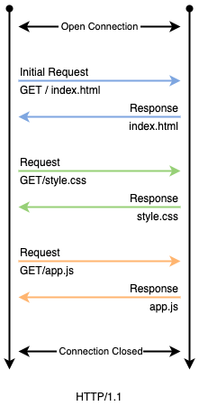
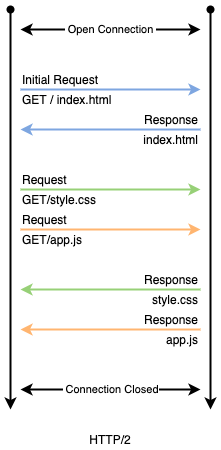
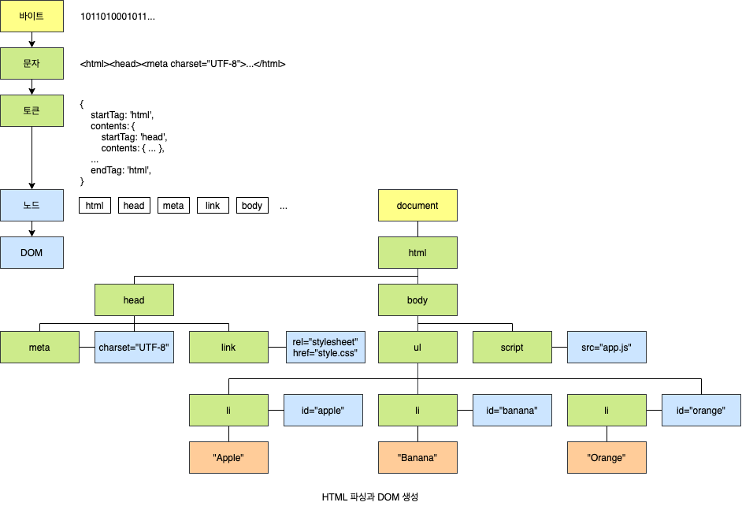
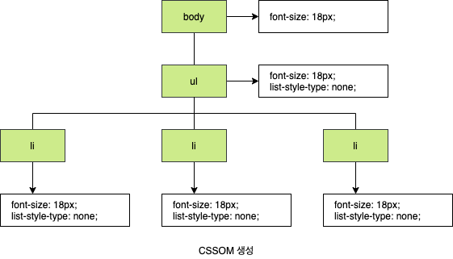
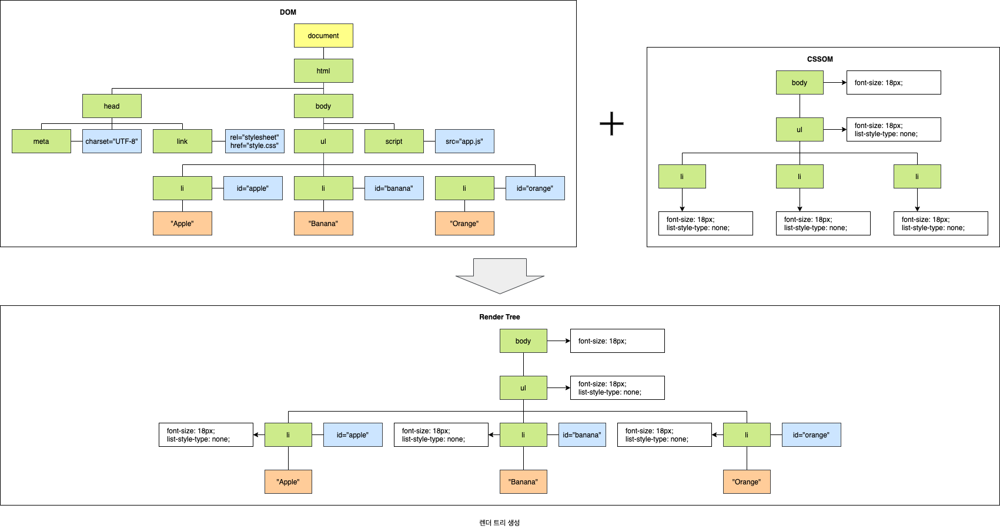
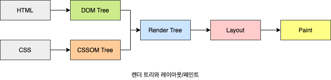
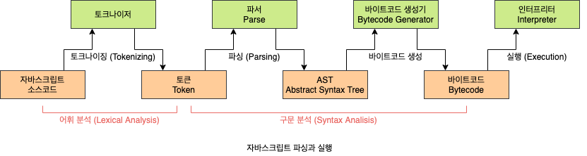

# 38. 브라우저의 렌더링 과정

대부분의 프로그래밍 언어는 **운엉체제**(Operating System, OS)나 **가상 머신**(Virtual Machine, VM) 위에서 실행되지만 웹 애플리케이션의 클라이언트 사이드 자바스크립트는 브라우저에서 HTML, CSS와 함께 실행됩니다. 따라서 브라우저 환경을 고려할 때 더 효율적인 클라이언트 사이드 자바스클비트 프로그래밍이 가능합니다.

- **파싱**(Parsing): 파싱은 프로그래밍 언어의 문법에 맞게 작성된 텍스트 문서를 읽어 들여 실행하기 위해 텍스트 문서의 문자열을 **토큰**(Token)으로 분해하고, 토큰에 문법적 의미와 구조를 반영하여 트리 구조의 자료구조인 **파스 트리**(Parse Tree/Syntax Tree)를 생성하는 일련의 과정을 말합니다. 일반적으로 파싱이 완료된 이후에는 파스 트리를 기반으로 **중간 언어**(Intermediate Code)인 **바이트코드**(Bytecode)를 생성하고 실행합니다.
- **렌더링**(Rendering): 렌더링은 HTML, CSS, 자바스크립트로 작성된 문서를 파싱하여 브라우저에 시각적으로 출력하는 것을 말합니다.

브라우저는 다음과 같은 과정을 거쳐 렌더링을 수행합니다.

1. 브라우저는 HTML, CSS, 자바스크립트, 이미지, 폰트 파일 등 렌더링에 필요한 리소스를 용청하고 서버로부터 응답을 받습니다.
2. 브라우저의 렌더링 엔진은 서버로부터 응답된 HTMl과 CSS를 파싱하여 DOM과 CSSOM을 생성하고 이들을 결합하여 렌더 트리를 생성합니다.
3. 브라우저의 자바스크립트 엔진은 서버로부터 응답된 자바스크립트를 파싱하여 **AST**(Abstract Syntax Tree)를 생성하고 바이트코드로 변환하여 실행합니다. 이떄 자바스크립트 DOM API를 통해 DOM이나 CSSOM을 변경할 수 있습니다. 변경된 DOM과 CSSOM은 다시 렌더 트리로 결합됩니다.
4. 렌더 트리를 기반으로 HTML 요소의 레이아웃(위치와 크기)를 계산하고 브라우저 화면에 HTML 요소를 페인팅합니다.

## 38.1 요청과 응답

브라우저의 핵심 기능은 필요한 리소스(HTML, CSS, 자바스크립트, 이미지, 폰트 등의 정적 파일 또는 서버가 동적으로 생성한 데이터)를 서버에 **요청**(Request)하고 서버로부터 **응답**(Response)받아 브라우저에 시각적으로 렌더링하는 것입니다. 즉, 렌더링에 핑요한 리소스는 모두 서버에 존재하므로 필요한 리소스를 서버에 요청하고 서버가 응답한 리소스를 파싱하여 렌더링하는 것입니다.

브라우저 렌더링 엔진은 HTML을 파싱하는 도 중에 외부 리소스를 로드하는 태그, 즉 CSS 파일을 로드하는 `link` 태그, 이미지 파일을 로드하는 `img` 태그, 자바스크립트를 로드하는 `script` 태그 등을 만나면 HTMl 파싱을 일시 중단하고 해당 리소스 파일을 서버로 요청합니다. 요청과 응답은 개발자 도구의 Network 패널에서 확인할 수 있습니다. 개발자 도구의 Network 패널을 활성화하기 이전에 브라우저가 이미 응답을 받은 경우 응답된 리소스가 표시되지 않습니다. 따라서 Network 패널에 아무런 리소스가 표시되지 않았다면 페이지를 새로고침해야 합니다.

## 38.2 HTTP 1.1과 HTTP 2.0

**HTTP**(HyperText Transfer Protocol)는 웹에서 브라우저와 서버가 통신하기 위한 프로토콜(규약)입니다. 1989년 HTML, URL과 함께 팀 버너스 리 경(Dir Tim Verners-Lee)이 고안한 HTTP는 1991년 최초로 문서화되었고 1996년 HTTP/1.0, 1999년 HTTP/1.1, 2015년 HTTP/2가 발표되었습니다.

HTTP/1.1은 기본적으로 **커넥션**(Connection)당 하나의 요청과 응답만 처리합니다. 즉, 여러 개의 요청을 한번에 전송할 수 없고 응답 또한 마찬가지입니다. 따라서 HTML 문서 내에 포함된 여러 개의 리소스 요청이 개별적으로 전송되고 응답 또한 개별적으로 전송됩니다. 이처럼 HTTP/1.1은 리소스의 동시 전송이 불가능한 구조이므로 요청할 리소스의 개수에 비례하여 응답 시간도 증가하는 단점이 있습니다.



이처럼 HTTP/1.1은 다중 요청/응답이 불가한다는 단점이 있지만 HTTP/2는 커넥션당 여러 개의 요청과 응답, 즉 다중 요청/응답이 가능합니다. 따라서 HTTP/2.0은 여러 리소스의 동시 전송이 가능하므로 HTTP/1.1q에 비해 페이지 로드 속도가 약 50% 정도 빠르다고 알려져 있습니다.



## 38.3 HTML 파싱과 DOM 생성

브라우저의 요청에 의해 서버가 응답한 HTML 문서는 문자열로 이루어진 순수한 텍스트입니다. 순수한 텍스트인 HTML 문서를 브라우저에 시각적인 픽셀로 렌더링하려면 HTML 문서를 브라우저가 이해할 수 있는 자료구조(객체)로 변환하여 메모리에 저장해야 합니다. 예를 들어, 다음과 같은 index.html이 서버로부터 응답되었다고 가정해봅니다.

```html
<!DOCTYPE html>
<html>
  <head>
    <meta charset="UTF-8" />
    <link rel="stylesheet" href="style.css" />
  </head>
  <body>
    <ul>
      <li id="apple">Apple</li>
      <li id="banana">Banana</li>
      <li id="orange">Orange</li>
    </ul>
  </body>
</html>
```

브라우저의 렌더링 엔진은 다음 그림과 같은 과정을 통해 응답받은 HTMl 문서를 파싱하여 브라우저가 이해할 수 있는 자료구조인 **DOM**(Document Object Model)을 생성합니다.



1. 서버에 존재하던 HTML 파일이 브라우저의 요청에 의해 응답됩니다. 이떄 서버는 브라우저가 요청한 HTML 파일을 읽어 들여 메모리에 저장한 다음 메모리에 저장된 바이트(2진수)를 인터넷을 경유하여 응답합니다.
2. 브라우저는 서버가 응답한 HTML 문서를 바이트(2진수) 형태로 응답받습니다. 그리고 응답된 바이트 형태의 HTML 문서는 `meta` 태그의 `charset` 어트리뷰트에 의해 지정된 인코딩 방식(예: UTF-8)을 기준으로 문자열로 변환합니다. `meta` 태그의 `charset` 어트리뷰트에 선언된 인코딩 방식은 `content-type: text/html; charset=utf-8`과 같이 **응답 헤더**(Response Header)에 담겨 응답됩니다. 브라우저는 이를 확인하고 문자열로 변환합니다.
3. 문자열로 변환된 HTML 문서를 읽어 들여 문법적 의미를 갖는 코드의 최소 단위인 **토큰**(Token)들로 분해합니다.
4. 각 토큰들을 객체로 변환하여 **노드**(Node)들을 생성합니다. 토큰의 내용에 따라 문서 노드, 요소 노드, 어트리뷰트 노드, 텍스트 노드가 생성됩니다. 노드는 이후 DOM을 구성하는 기본 요소가 됩니다.
5. HTMl 문서는 HTML 요소들의 집합으로 이루어지며 HTML 요소는 중첩 관계를 갖습니다. 즉, HTML 요 소의 콘텐츠 영역(시작 태그와 종료 태그 사이)에는 텍스트뿐만 아니라 다른 HTML 요소도 포함될 수 있습니다. 이때 HTML 요소 간에는 중첩 관계에 의해 부자 관계가 형성됩니다. 이러한 HTML 요소 간의 부자 관계를 반영하여 모든 노드들을 **트리 자료구조**로 구성합ㄴ디ㅏ. 이 노드들로 구성된 트리 자로구조를 **DOM**(Document Object Model)이라 부릅니다.

## 38.4 CSS 파싱과 CSSOM 생성

렌더링 엔진은 HTML을 처음부터 한 줄씩 순차적으로 파싱하여 DOM을 생성해 나갑니다. 이처럼 렌더링 엔진은 DOM을 생성해 나가다가 CSS를 로드하는 `link`나 `style` 태그를 만나면 DOM 생성을 일시 중단합니다. 그리고 `link` 태그의 `href` 어트리뷰트에 지정된 CSS 파일을 서버에 요청하여 로드한 CSS 파일이나 `style` 태그 내의 CSS를 HTML과 동일한 파싱 과정(바이트 -> 문자 -> 토큰 -> 노드 -> CSSOM)을 거치며 해성하여 **CSSOM**(CSS Object Model)을 생성합니다. 이후 CSS 파싱을 완료하면 HTML 파싱이 중단된 지점부터 다시 HTML을 파싱하기 시작하여 DOM 생성을 재개합니다.

```css
body {
  font-size: 18px;
}

ul {
  list-style-type: none;
}
```



## 38.5 렌더 트리 생성

랜더링 엔진은 서버로부터 응답된 HTML과 CSS를 파싱하여 각각 DOM과 CSSOM를 생성합니다. 그리고 DOM과 CSSOM은 렌더링을 위해 **렌더 트리**(Render Tree)로 결합됩니다. 렌더 트리는 렌더링을 위한 트리 구조의 자료구조입니다. 따라서 브라우저 화면에 렌더링되지 않는 노드(예: `meta` 태그, `script` 태그 등)와 CSS에 의해 비표시(예: `display: none`)되는 노드들은 포함하지 않습니다. 다시 말해, 렌더 트리는 브라우저 화면에 렌더링되는 노드만으로 구성됩니다.



이후 완성된 렌더 트리는 각 HTML 요소의 **레이아웃**(위치와 크기)을 계산하는 데 사용되며 브라우저 화면에 픽셀을 렌더링하는 **페인팅**(Painting) 처리에 입력됩니다.



지금까지 살펴본 브라우저 렌더링 과정은 반복해서 실행될 수 있습니다. 레이아웃 계산과 페인팅을 다시 실행하는 리렌더링은 비용이 많이 드는, 즉 성능에 악영향을 주는 작업입니다. 따라서 가급적 리렌더링이 빈번하게 발생하지 않도록 주의할 필요가 있습니다.

- 자바스크립트에 의한 노드 추가 또는 삭제
- 브라우저 창의 리사이징에 의한 **뷰포트**(Viewport) 크기 변경
- HTML 요소의 레이아웃(위치, 크기)에 변경을 발생시키는 `width`, `height`, `margin`, `padding`, `border`, `display`, `position`, `top`, `right`, `bottom`, `left` 등의 스타일 변경

## 38.6 자바스크립트 파싱과 실행

HTMl 문서를 파싱할 결과물로서 생성된 DOM은 HTMl 문서의 구조와 정보뿐만 아니라 HTML 요소와 스타일 등을 변경할 수 있는 프로그래밍 인터페이스로서 DOM API를 제공합니다. 즉, 자바스크립트 코드에서 DOM API를 사용하면 이미 생성된 DOM을 동적으로 조작할 수 있습니다.

CSS 파신 과정과 마찬가지로 렌더링 엔진은 HTML을 한 줄씩 순차적으로 파싱하여 DOm을 생성해 나가다가 자바스크립트 파일을 로드하는 `script` 태그나 자바스크립트 코드를 콘텐츠로 담은 `script` 태그를 만나면 DOM 생성을 일시 중단합니다. 그리고 `script` 태그의 `src` 어트리뷰트에 정의된 자바스클비트 파일을 서버에 요청하여 로드한 자바스크립트 파일이나 `script` 태그 내의 자바스크립트 코드를 파싱하기 위해 자바스크립트 엔진에 제어권을 넘깁니다. 이후 자바스크립트 파싱과 실행이 종료되면 렌더링 엔진으로 다시 제어권을 넘겨 HTML 파싱이 중단된 지점부터 다시 HTML 파싱을 시작하여 DOM 생성을 재개합니다.

자바스크립트 파싱과 실행은 브라우저의 렌더링 엔진이 아닌 자바스크립트 엔진이 처리합니다. 자바스크립트 엔진은 자바스크립트 코드를 파싱하여 CPU가 이해할 수 있는 **저수준 언어**(Low-Level Language)로 변환하고 실행하는 역할을 합니다. 자바스크립트 엔진은 구글 크롬과 Node.js의 V8, 파이어폭스의 SpiderMonkey, 사파리의 JavaScriptCore 등 다양한 종류가 있으며, 모든 자바스크립트 엔진은 SCMAScript 사양을 준수합니다.



#### 토크나이징 (Tokenizing)

단순한 문자열인 자바스크립트 소스코드를 **여휘 분석**(Lexical Analysis)하여 문법적 의미를 갖는 코드의 최소 단위인 **토큰**(Token)들로 분해합니다. 이 과정을 **렉싱**(Lexing)이라고 부르기도 하지만 토크나이징과 미묘한 차이가 있습니다.

#### 파싱(Parsing)

토큰들의 집합을 **구문 분석**(Syntatic Analysis)하여 **AST**(Abstract Syntax Tree, 추상적 구분 트리)를 생성합니다. AST는 토큰에 문법적 의미와 구조를 반영한 트리 구조의 자료구조입니다. AST는 인터프리터나 컴파일러만이 사용하는 것은 아닙니다. AST를 사용하면 Typescript, Babel, Prettier 같은 **트랜스파일러**(Transpiler)를 구현할 수도 있습니다. [AST Explorer 웹사이트](https://astexplorer.net)에 방문하면 다양한 오픈소스 자바스크립트 파서를 사용하여 AST를 생성해 볼 수 있습니다.

#### 바이트코드 생성과 실행

파싱의 결과물로서 생성된 AST는 인터프리터가 실행할 수 있는 중간 코드인 바이트코드로 변환되고 인터프리터에 의해 실행됩니다. 참고로 V8 엔진의 경우 자주 사용되는 코드는 **터보팬**(TurboFan)이라 불리는 컴파일러에의해 **최적화된 머신 코드**(Optimized Machine Code)로 컴파일되어 성능을 최적화합니다. 만약 코드의 사용 빈도가 적어지면 다시 **디옵티마이징**(Deoptimizing)하기도 합니다.

## 38.7 리플로우와 리페인트

만약 자바스크립트 코드에 DOM이나 CSSOM을 변경하는 DOM API가 사용된 경우 DOM이나 CSSOM이 변경됩니다. 이때 변경된 DOM과 CSSOM은 다시 렌더 트리로 결합되고 변경된 렌더 트리를 기반으로 레이아웃과 페인트 과정을 거쳐 브라우저의 화면에 다시 렌더링합니다. 이를 **리플로우**(Reflow), **리페인트**(Repaint)라 합니다.

리플로우는 레이아웃 계산을 다시 하는 것을 말하며, 노드 추가/삭제, 요소의 크기/위치 변경, 윈도우 리사이징 등 레이아웃에 영향을 주는 변경이 발생한 경우에 한하여 실행됩니다. 리페인트는 재결합된 렌더 트리를 기반으로 다시 페인트를 하는 것을 말합니다. 따라서 리플로우와 리페인트가 반드시 순차적으로 동시에 실행되는 것은 아닙니다. 레이아웃에 영향이 없는 변경은 리플로우 없이 리페인트만 실행됩니다.

### 38.8 자바스클비트 파싱에 의한 HTML 파싱 중단

브라우저는 **동기적**(Synchronous)으로, 즉 위에서 아래 방향으로 순차적으로 HTML, CSS, 자바스크립트를 파싱하고 실행합니다. 이것은 `script` 태그의 위치에 따라 HTML 파싱이 블로킹되어 DOM 생성이 지연될 수 있다는 것을 의미합니다. 따라서 `script` 태그의 위치는 중요한 의미를 갖습니다.

자바스크립트 코드에서 DOM이나 CSSOM을 변경하는 DOM API를 사용할 경우 DOM이나 CSSOM이 이미 생성되어 있어야 합니다. 만약 DOM을 변경하는 DOM API를 사용할 때 DOM의 생성이 완료되지 않은 상태라면 문제가 발생할 수 있습니다.

```html
<!DOCTYPE html>
<html>
  <head>
    <meta charset="UTF-8" />
    <link rel="stylesheet" href="style.css" />
    <script>
      // DOM API가 실행되는 시점에 아직 id가 'apple'인 HTML 요소를 파싱하지 않았습니다.
      // 따라서 아래 코드는 정장적으로 id가 'apple'인 HTML 요소를 취득하지 못했습니다.
      const $apple = document.getElementById("apple");
      $apple.style.color = "red"; // TypeError: Cannot read property 'style' of null
    </script>
  </head>
  <body>
    <ul>
      <li id="apple">Apple</li>
      <li id="banana">Banana</li>
      <li id="orange">Orange</li>
    </ul>
  </body>
</html>
```

이러한 문제를 회피하기 위해 `body` 요소의 가장 아래에 자바스크립트를 위치시키는 것은 좋은 아이디어입니다.

- DOM이 완성되지 않은 상태에서 자바스크립트가 DOM을 조작하는 에러가 발생할 우려가 없습니다.
- 자바스크립트 로딩/파싱/실행으로 인해 HTML 요소들의 렌더링에 지장받는 일이 발생하지 않아 페이지 로딩 시간이 단축됩니다.

```html
<!DOCTYPE html>
<html>
  <head>
    <meta charset="UTF-8" />
    <link rel="stylesheet" href="style.css" />
  </head>
  <body>
    <ul>
      <li id="apple">Apple</li>
      <li id="banana">Banana</li>
      <li id="orange">Orange</li>
    </ul>
    <script>
      const $apple = document.getElementById("apple");
      $apple.style.color = "red";
    </script>
  </body>
</html>
```

## 38.9 script 태그의 async/defer 어트리뷰트

자바스클비트 파싱에 의한 DOM 생성이 **중단**(Blocking)되는 문제를 근본적으로 해결하기 위해 HTML5부터 `script` 태그에 `async`와 `defer` 어트리뷰트가 추가되었습니다. `async`와 `defer` 어트리뷰트는 다음과 같이 `src` 어트리뷰트를 통해 외부 자바스크립트 파일을 로드하는 경우에만 사용할 수 있습니다. 즉, `src` 어트리뷰트가 없는 인라인 자바스크립트에는 사용할 수 없습니다.

```html
<script async src="extern.js"></script>
<script defer src="extern.js"></script>
```

#### async 어트리뷰트

HTML 파싱과 외부 자바스크립트 파일의 로드가 비동기적으로 동시에 진행됩니다. 단, 자바스크립트의 파싱과 실행은 자바스크립트 파일의 로드가 완료된 직후 진행되며, 이떄 HTML 파싱이 중단됩니다.


여러 개의 `script` 태그에 `async` 어트리뷰트를 지정하면 `script` 태그의 순서와는 상관없이 로드가 완료된 자바스크립트부터 먼저 실행되므로 순서가 보장되지 않습니다. 따라서 순서 보장이 필요한 `script` 태그에는 `async` 어트리뷰트를 지정하지 않아야 합니다. `async` 어트리뷰트는 IE10 이상에서 지원됩니다.

#### defer 어트리뷰트

`async` 어트리뷰트와 마찬가지로 HTML 파싱과 외부 자바스크립트 파일의 로드가 비동기적으로 동시에 진행됩니다. 단, 자바스크립트의 파싱과 실행은 HTML 파싱이 완료된 직후, 즉 DOM 생성이 완료된 직후(이때 DOMContentLoaded 이벤트가 발생합니다) 진행됩니다. 따라서 DOM 생성이 완료된 이후 실행되어야 할 자바스크립트에 유용합니다. `defer` 어트리뷰트는 IE10 이상에서 지원됩니다. IE6 ~ 9에서도 지원되기는 하지만 정상적으로 동작하지 않을 수 있습니다.


