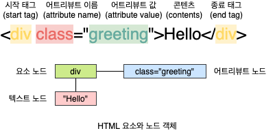
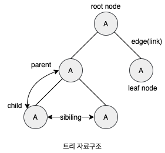
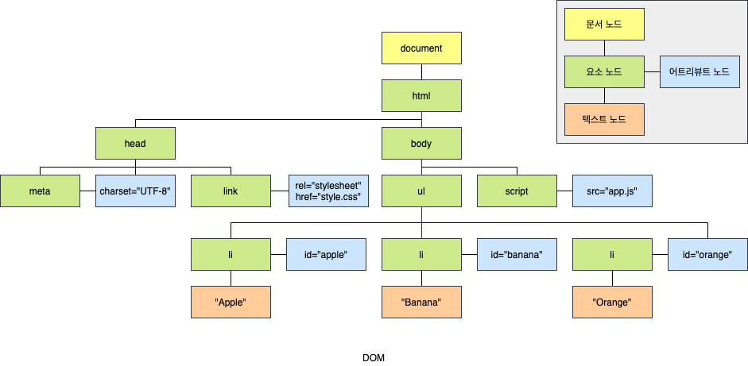
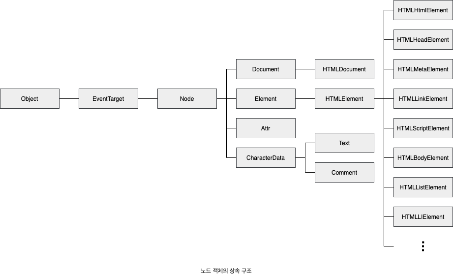
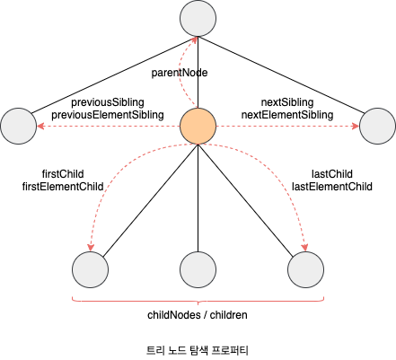
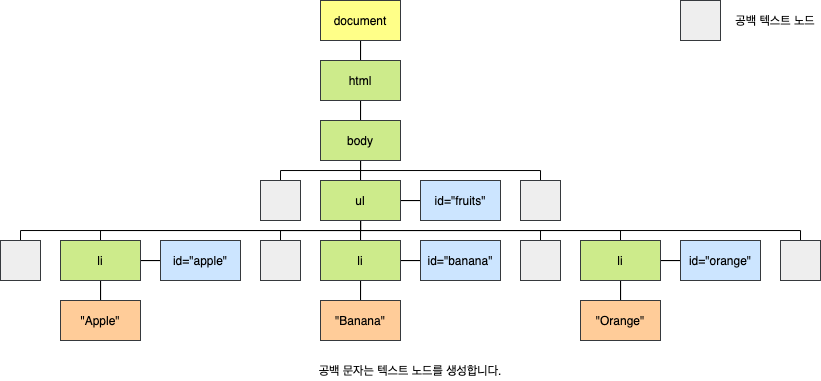
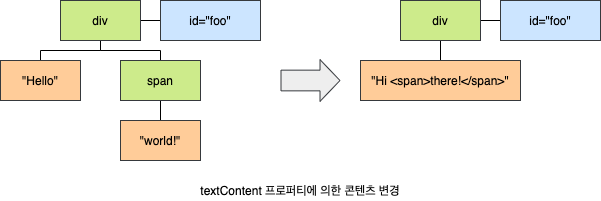
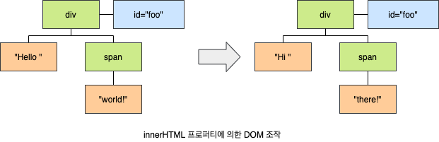
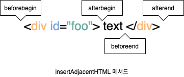
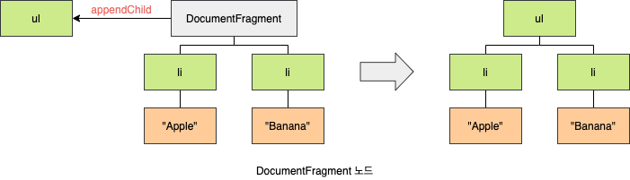

# 39. DOM

## 39.1 노드

### 39.1.1 HTML 요소와 노드 객체

**HTML 요소**(HTML Element)는 HTML 문서를 구성하는 개별적인 요소를 의미합니다. HTML 요소는 렌더링 엔진에 의해 파싱되어 DOM을 구성하는 요소 노드 객체로 변환됩니다. 이떄 HTML 요소의 어트리뷰트는 어트리뷰트 노드로, HTML 요소의 텍스트 콘텐츠는 텍스트 노드로 변환됩니다.



HTML 문서는 HTML 요소들의 집합으로 이뤄지며, HTML 요소는 중첩 관계를 갖습니다. 즉, HTML 요쇼의 콘텐츠 영역(시작 태그와 종료 태그 사이)에는 텍스트뿐만 아니라 다른 HTML 요소도 포함할 수 있습니다. 이때 HTMl 요소 간에는 중첩 관계에 의해 계층적인 **부자**(Parnet-Child) 관계가 형성됩니다. 이러한 HTMl 요소 간의 부자 관계를 반영하여 HTML 문서의 구성 요소인 HTML 요소를 객체화한 모든 노드 객체들을 트리 자료 구조로 구성합니다.

노드 객체들로 구성된 트리 자료구조를 **DOM**(Document Object Model)이라 합니다. 노드 객체의 트리로 구조화되어 있기 때문에 DOM을 DOM 트리라고 부르기도 합니다.

#### 트리 자료구조

**트리 자료구조**(Tree data structure)는 노드들의 계층 구조로 이뤄집니다. 즉, 트리 자료구조는 **부모 노드**(Parent Node)dhk **자식 노드**(Child Node)로 구성되어 노드 간의 계층적 구조(부자, 형제 관계)를 표현하는 비선형 자료구조를 말합니다. 트리 자료구조는 하나의 최상위 노드에서 시작합니다. 최상위 노드는 부모 노드가 없으며, **루트 노드**(Root Node)라 합니다. 루트 노드는 0개 이상의 자식 노드를 갖습니다. 자식 노드가 없는 노드를 **리프 노드**(Leaf Node)라 합니다.



### 39.1.2 노드 객체의 타입

DOM은 노드 객체의 계층적인 구조로 구성됩니다. 노드 객체는 종류가 있고 상속 구조를 갖습니다. 노드 객체는 총 12개의 종류(노드 타입)가 있습니다. 이 중에서 중요한 노드 타입은 4가지 입니다. 이 4가지 노드 타입 외에도 주석을 위한 Comment 노드, DOCTYPE을 위한 DocumentType 노드, 복수의 노드를 생성하여 추가할 때 사용하는 DocuemntFragment 노드 등이 있습니다.



#### 문서 노드 (Document Node)

문서 노드는 DOM 트리의 최상위에 존재하는 루트 노드로서 `document` 객체를 가리킵니다. `document` 객체는 브라우저가 렌더링한 HTML 문서 전체를 가리키는 객체로 전역 객체 `window`의 `document` 프로퍼티에 바인딩되어 있습니다. 따라서 문서 노드는 `window.document` 또는 `document`로 참조할 수 있습니다.

브라우저 환경의 모든 자바스크립트 코드는 `script` 태그에 의해 분리되어 있어도 하나의 전역 객체 `window`를 공유합니다. 따라서 모든 자바스크립트 코드는 전역 객체 `window`의 `document` 프로퍼티에 바인딩되어 있는 하나의 `document` 객체를 바라봅니다. 즉 HTML 문서당 `document` 객체는 유일합니다.

문서 노드, 즉 `doucment` 객체는 DOM 트리의 루트 노드이므로 DOM 트리의 노드들에 접근하기 위한 **진입점**(Entry Point) 역할을 담당합니다. 즉, 요소, 어트리뷰트, 텍스트 노드에 접근하려면 문서 노드를 통해야 합니다.

#### 요소 노드 (Element Node)

요소 노드는 HTML 요소를 가리키는 객체입니다. 요소 노드는 HTML 요소 간의 중첩에 의해 부자 관계를 가지며, 이 부자 관계를 통해 정보를 구조화합니다. 따라서 요소 노드는 문서의 구조를 표현한다고 할 수 있습니다.

#### 어트리뷰트 노드 (Attribute Node)

어트리뷰트 노드는 HTML 요소의 어트리뷰트들 가리키는 객체입니다. 어트리뷰트 노드는 어트리뷰트가 지정된 HTML 요소의 요소 노드와 **형제**(Sibiling) 관계를 갖습니다. 단, 요소 노드는 부모 노드와 연결되어 있지만 어트리뷰트 노드는 부모 노드와 연결되어 있지 않고 형제 노드인 요소 노드에만 연결되어 있습니다. 따라서 어트리뷰트 노드에 접근하여 어트리뷰트를 참조하거나 변경하려면 먼저 형제 노드인 요소 노드에 접근해야 합니다.

#### 텍스트 노드 (Text Node)

텍스트 노드는 HTML 요소의 텍스트를 가리키는 객체입니다. 요소 노드가 문서의 구조를 표현한다면 텍스트 노드는 문서의 정보를 표현한다고 할 수 있습니다. 텍스트 노드는 요소 노드의 자식 노드이며, 자식 노드를 가질 수 없는 **리프 노드**(Leaf Node)입니다. 즉, 텍스트 노드는 DOM 트리의 최종단입니다. 따라서 텍스트 노드에 접근하려면 먼저 부모 노드인 요소 노도에 접근해야 합니다.

### 39.1.3 노드 객체의 상속 구조

DOM을 구성하는 노드 객체는 자신의 구조와 정보를 제어할 수 있는 DOM API를 사용할 수 있습니다. 이를 통해 노드 객체는 자신의 부모, 형제, 자식을 탐색할 수 있으며, 자신의 어트리뷰트와 텍스트를 조작할 수도 있습니다. DOM을 구성하는 노드 객체는 ECMAScript 사양에 정의된 **표준 빌트인 객체**(Standard Built-in Object)가 아니라 브라우저 환경에서 추가적으로 제공하는 **호스트 객체**(Host Object)입니다. 하지만 노드 객체도 자바스클비트 객체이므로 프로토타입에 의한 상속 구조를 갖습니다.



이를 프로토타입 체인 관점에서 살펴보면, `input` 요소를 파싱하여 객체화한 `input` 요소 노드 객체는 프로토타입 체인에 있는 모든 프로토타입의 프로퍼티나 메서드를 상속받아 사용할 수 있습니다.

| input 요소 노드 객체의 특성                                                | 프로토타입을 제공하는 객체 |
| -------------------------------------------------------------------------- | -------------------------- |
| 객체                                                                       | `Object`                   |
| 이벤트를 발생시키는 객체                                                   | `EventTarget`              |
| 트리 자료구조의 노드 객체                                                  | `Node`                     |
| 브라우저가 렌더링할 수 있는 웹 문서의 요소(HTML, XML, SVG)를 표현하는 객체 | `Element`                  |
| 웹 문서의 요소 중에서 HTML 요소를 표현하는 객체                            | `HTMLElement`              |
| HTML 요소 중에서 `input` 요소를 표현하는 객체                              | `HTMLInputElement`         |

## 39.2 요소 노드 취득

HTML의 구조나 내용 또는 스타일 등을 동적으로 조작하려면 먼저 요소 노드를 취득해야 합니다. 텍스트 노드는 요소 노드의 자식 노드이고, 어트리뷰트 노드는 요소 노드의 형제 노드이기 때문에 텍스트 노드나 어트리뷰트 노드를 조작하고자 할 때도 마찬가지입니다. 이를 위해 DOM으 ㄴ요소 노드를 취득할 수 있는 다양한 메서드를 제공합니다.

### 39.2.1 id를 이용한 요소 노드 취득

`Document.prototype.getElementById` 메서드는 인수로 전달한 `id` 어트리뷰트 값(이하 id 값)을 갖는 하나의 요소 노드를 탐색하여 반환합니다. `getElementBytId` 메서드는 `Document.prototype`의 프로퍼티입니다. 따라서 반드시 문서 노드인 `document`를 통해 호출해야 합니다.

`id` 값은 HTML 문서 내에서 유일한 값이어야 하며, `class` 어트리뷰트와는 달리 공백 문자로 구분하여 여러 개의 값을 가질 수 없습니다. 단, HTML 문서 내에 중복된 `id` 값을 갖는 HTML 요소가 여러 개 존재하더라도 어떠한 에러도 발생하지 않습니다. 즉, HTML 문서 내에는 중복된 `id` 값을 갖는 요소가 여러 개 존재할 가능성이 있습니다. 이러한 경우 `getElementById` 메서드는 인수로 전달된 `id` 값을 갖는 첫 번째 요소 노드만 반환합니다. 즉, `getElementById` 메서드는 언제나 단 하나의 요소 노드를 반환합니다. 만약 인수로 전달된 `id` 값을 갖는 HTML 요소가 존재하지 않는 경우 `getElementById` 메서드는 `null`을 반환합니다.

```html
<!DOCTYPE html>
<html>
  <body>
    <ul>
      <li id="apple">Apple</li>
      <li id="banana">Banana</li>
      <li id="orange">Orange</li>
    </ul>
    <script>
      const $elem = document.getElementById("banana");
      $elem.style.color = "red";
    </script>
  </body>
</html>
```

HTML 요소에 `id` 어트리뷰트를 부여하면 `id` 값과 동일한 이름의 전역 변수가 암묵적으로 선언되고 해당 노드 객체가 할당되는 부수 효과가 있습니다. 단, `id` 값과 동일한 이름의 전역 변수가 이미 선언되어 있으면 이 전역 변수에 노드 객체가 재할당되지 않습니다.

```html
<!DOCTYPE html>
<html>
  <body>
    <div id="foo"></div>
    <div id="bar"></div>
    <script>
      let bar = 1;

      console.log(foo); // <div id="foo"></div>
      console.log(bar); // 1

      // 암묵적 전역으로 생성된 프로퍼티는 삭제되지만 전역 변수는 삭제되지 않습니다.
      delete foo;
      console.log(foo); // <div id="foo"></div>
    </script>
  </body>
</html>
```

### 39.2.2 태그 이름을 이용한 요소 노드 취득

`Document.prototype/Element.prototype.getElementsByTagName` 메서드는 인수로 전달한 태그 이름을 갖는 모든 요소 노드들을 탐색하여 반환합니다. `Document.prototype.getElemntsByTageName` 메서드는 DOM의 루트 노드인 문서 노드, 즉 `document`를 통해 호출하며 DOM 전체에서 요소 노드를 탐색하여 반환합니다. 하지만 `Element.prototype.getElementsByTagName` 메서드는 특정 요소 노드를 통해 호출하며, 특정 요소 노드의 자손 노드 중에서 요소 노드를 탐색하여 반환합니다.

메서드 이름에 포함된 `Elements`가 복수현인 것에서 할 수 있듯이 `getElementsByTagName` 메서드는 여러 개의 요소 노드 객체를 갖는 DOM 컬렉션 객체인 `HTMLCollection` 객체를 반환합니다. `HTMLCollection` 객체는 유사 배열 객체이면서 이터러블입니다. 만약 인수로 전달된 태그 이름을 갖는 요소가 존재하지 않는 경우 `getElementByTagName` 메서드는 빈 `HTMLCollection` 객체를 반환합니다.

```html
<!DOCTYPE html>
<html>
  <body>
    <ul>
      <li id="apple">Apple</li>
      <li id="banana">Banana</li>
      <li id="orange">Orange</li>
    </ul>
    <script>
      const $elems = document.getElementsByTagName("li");

      [...$elems].forEach((elem) => {
        elem.style.color = "red";
      });
    </script>
  </body>
</html>
```

HTML 문서의 모든 요소 노드를 취득하려면 `getElementsByTagName` 메서드의 인수로 `*`를 전달합니다.

```javascript
const $all = docuemnt.getElementsByTagName("*");
```

### 39.2.3 class를 이용한 요소 노드 취득

`Document.prototype/Element.prototype.getElementsByClassName` 메서드는 인수로 전달한 `class` 어트리뷰트 값(이하 class 값)을 갖는 모든 요소 노드들을 탐색하여 반환합니다. 인수로 전달한 `class` 값은 공백으로 구분하여 여러 개의 `class`를 지정할 수 있습니다. `getElementsByTagName` 메서드와 마찬가지로 `getElementsByClassName` 메서드는 `Document.prototype`에 정의된 메서드와 `Element.prototype`에 정의된 메서드가 있습니다.

`getElementsByTagName` 메서드와 마찬가지로 `getElementsByClassName` 메서드는 여러 개의 요소 노드 객체를 갖는 DOM 컬렉션 객체인 `HTMLCollection` 객체를 반환합니다. 만약 인수로 전달된 `class` 값을 갖는 요소가 존재하지 않는 경우 `getElementsByClassName` 메서드는 빈 `HTMLCollection` 객체를 반환합니다.

```html
<!DOCTYPE html>
<html>
  <body>
    <ul>
      <li class="fruit apple">Apple</li>
      <li class="fruit banana">Banana</li>
      <li class="fruit orange">Orange</li>
    </ul>
    <script>
      const $elems = document.getElementsByClassName("fruit");

      [...$elems].forEach((elem) => {
        elem.style.color = "red";
      });
    </script>
  </body>
</html>
```

### 93.2.4 CSS 선택자를 이용한 요소 노드 취득

CSS **선택자**(Selector)는 스타일을 적용하고자 하는 HTML 요소를 특정할 때 사용하는 문법입니다.

| 선택자             | 예시               | 설명                                                                                          |
| ------------------ | ------------------ | --------------------------------------------------------------------------------------------- |
| 전체 선택자        | `*`                | 모든 요소를 선택                                                                              |
| 태그 선택자        | `p`                | 모든 `p` 태그 요소를 모두 섡택                                                                |
| ID 선택자          | `#foo`             | id 값이 `foo`인 요소를 모두 선택                                                              |
| Class 선택자       | `.foo`             | class 값이 `foo`인 요소를 모두 선택                                                           |
| 어트리뷰트 선택자  | `input[type=test]` | `input` 요소 중에 type 어트리뷰트 값이 `text`인 요소를 모두 선택                              |
| 후손 선택자        | `div p`            | `div` 요소의 후손 요소 중 `p` 요소를 모두 선택                                                |
| 자식 선택자        | `div > p`          | `div` 요소의 자식 요소 중 `p` 요소를 모두 선택                                                |
| 인접 형제 선택자   | `p + ul`           | `p`요소의 형제 요소 중에 `p` 요소 바로 뒤에 위치하는 `ul` 요소를 선택                         |
| 일반 형제 선택자   | `p ~ ul`           | `p` 요소의 형제 요소 중에 `p` 요소 뒤에 위치하는 `ul` 요소를 모두 선택                        |
| 가상 클래스 선택자 | `a:hover`          | hover 상태인 `a` 요소를 모두 선택                                                             |
| 가상 요소 선택자   | `p::before`        | `p` 요소의 콘텐츠의 앞에 위치하는 공간을 선택. 일반적으로 content 프로퍼티와 함께 사용됩니다. |

`Document.prototype/Element.prototype.querySelector` 메서드는 인수로 전달한 CSS 선택자를 만족시키는 하나의 요소 노드를 탐색하여 반환합니다.

- 인수로 전달한 CSS 선택자를 만족시키는 요소 노드가 여러 개인 경우 첫 번쨰 요소 노드만 반환합니다.
- 인수로 전달된 CSS 선택작를 맍고시키는 요소 노드가 존재하지 않는 경우 `null`을 반환합니다.
- 인수로 전달한 CSS 선택자가 문법에 맞지 않는 경우 DOMException 에러가 발생합니다.

```html
<!DOCTYPE html>
<html>
  <body>
    <ul>
      <li class="apple">Apple</li>
      <li class="banana">Banana</li>
      <li class="orange">Orange</li>
    </ul>
    <script>
      const $elem = document.querySelector(".banana");
      $elem.style.color = "red";
    </script>
  </body>
</html>
```

`Document.prototype/Element.prototype.querySelectorAll` 메서드는 인수로 전달한 CSS 선택자를 만족시키는 모든 요소 노드를 탐색하여 반환합니다. `querySelectorAll` 메서드는 여러 개의 요소 노드 객체를 갖는 DOM 컬렉션 `NodeList` 객체를 반환합니다. `NodeList` 객체는 유사 배열 객체이면서 이터러블입니다.

- 인수로 전달된 CSS 선택자를 만족시키는 요소가 존재하지 않는 경우 빈 `NodeList` 객체를 반환합니다.
- 인수로 전달된 CSS 선택자가 문법에 맞지 않는 경우 DOMException 에러가 발생합니다.

```javascript
const $elems = document.querySelectorAll("ul > li");
console.log($elems); // NodeL:ist(3) [li.apple, li.banana, li.orange]

// NodeList는 forEach 메서드를 제공합니다.
$elems.forEach((elem) => {
  elem.style.color = "red";
});
```

CSS 선택자 문법을 사용하는 `querySelector`, `querySelectorAll` 메서드는 `getElementById`, `getElementBy***` 메서드보다 다소 느린 것으로 알려져 있습니다. 하지만 CSS 선택자 문법을 사용하여 좀 더 구체적인 조건으로 요소 노드를 취득할 수 있고, 일관된 방식으로 요소 노드를 취득할 수 있다는 장점이 있습니다. 따라서 `id` 어트리뷰트가 있는 요소 노드를 취득하는 경우에는 `getElemntById` 메서드를 사용하고 그 외의 경우에는 `querySelector`, `querySelectorAll` 메서드를 사욯나느 것을 권장합니다.

### 39.2.5 특정 요소 노드를 취득할 수 있는지 확인

`Element.prototype.matches` 메서드는 인수로 전달한 CSS 선택자를 통해 특정 요소 노드를 취득할 수 있는가 확인합니다.

```html
<!DOCTYPE html>
<html>
  <body>
    <ul id="fruits">
      <li class="apple">Apple</li>
      <li class="banana">Banana</li>
      <li class="orange">Orange</li>
    </ul>
    <script>
      const $apple = document.querySelector(".apple");

      console.log($apple.matches("#fruits > li.apple")); // true
      console.log($apple.matches("#fruits > li.banana")); // false
    </script>
  </body>
</html>
```

### 39.2.6 HTMLCollection과 NodeList

DOM 컬렉션 객체인 `HTMLCollection`과 `NodeList`는 DOM API가 여러 개의 결과값을 반환하기 위한 DOM 컬렉션 객체입니다. `HTMLCollection`과 `NodeList`는 모두 유사 배열 객체이면서 이터러블입니다. 따라서 `for...of` 문으로 순회할 수 있으며 스프레드 문법을 사용하여 간단히 배열로 변환할 수 있습니다.

#### HTMLCollection

`getElementsByTagName`, `getElementsByClassName` 메서드가 반환하는 HTMLCollection 객체는 노드 객체의 상태 변화를 실시간으로 반영하는 **살아있는**(Live) 컬렉션 객체입니다. 따라서 `HTMLCollection` 객체를 살아있는 객체라고 부르기도 합니다.

```html
<!DOCTYPE html>
<html>
  <head>
    <style>
      .red {
        color: red;
      }
      .blue {
        color: blue;
      }
    </style>
  </head>
  <body>
    <ul id="fruits">
      <li class="red">Apple</li>
      <li class="red">Banana</li>
      <li class="red">Orange</li>
    </ul>
    <script>
      const $elems = document.getElementByClassName("red");

      for (let i = 0; i < $elems.length; i += 1) {
        $elems[i].className = "blue";
      }

      console.log($elems); // HTMLCollection(1) [li.red]
    </script>
  </body>
</html>
```

위 예제가 에러 없이 실행되면 두 번째 `li` 요소만 `class` 값이 변경되지 않습니다. `HTMLCollection` 객체는 실시간으로 노드 객쳉듸 상태 변경을 반영하여 요소를 제거할 수 있기 때문에 `HTMLCollection` 객체를 `for` 문으로 순회하면서 노드 객체의 상태를 변경해야 할 때 쥐의해야 합니다. 이 문제는 `for` 문을 역방향으로 순회하는 방법으로 회피하거나 `while` 문을 사용하여 `HTMLCollection` 객체에 노드 객체가 남아 있지 않을 때까지 반복하는 방법으로 회피할 수 있습니다.

#### NodeList

`qureySelecorAll` 메서드는 DOM 컬렉션 객체인 `NodeList` 객체를 반환합니다. `NodeList` 객체는 대부분의 경우 노드 객체의 상태 변경을 실시간으로 반영하지 않고 과거의 정적 상태를 유지하는 non-live 객체로 동작합니다. NodeList 객체는 NodeList.prototype.forEach 메서드를 상속받아 사용할 수 있습니다.

```javascript
const $elem = document.qeurySelectorAll(".red");

// NodeList 객체는 NodeList.prototype.forEach 메서드를 상속받아 사용할 수 있습니다.
$elems.forEach((elem) => (elem.className = "blue"));
```

하지만 `chilNodes` 프로퍼티가 반환하는 `NodeList` 객체는 `HTMLCollection` 객체와 같이 실시간으로 노드 객체의 상태 변경을 반영하는 live 객체로 동작하므로 주의가 필요합니다.

```html
<!DOCTYPE html>
<html>
  <body>
    <ul id="fruits">
      <li>Apple</li>
      <li>Banana</li>
    </ul>
    <script>
      const $fruits = document.getElementById("fruits");

      const { childNodes } = $fruits;
      console.log(childNodes instanceof NodeList);

      // 자식 노드는 공백 텍스트 노드를 포함해 모두 5개입니다.
      console.log(childNodes); // NodeList(5) [text, li, text, li, text]

      for (let i = 0; i < childNodes.length; i += 1) {
        $fruits.removeChild(childNodes[i]);
      }

      console.log(childNodes); // NodeList(2) [li, li]
    </script>
  </body>
</html>
```

이처럼 `HTMLCollection`이나 `NodeList` 객체는 예상과 다르게 동작할 때가 있어 다루기 까다롭고 실수하기 쉽습니다. 따라서 노드 객체의 상태 변경과 상관없이 안전하게 DOM 컬렉션을 사용하려면 `HTMLCollection`이나 `NodeList` 객체를 배열로 변환하여 사용하는 것을 권장합니다. `HTMLCollection`이나 `NodeList` 객체가 메서드를 제공하기는 하지만 배열의 고차 함수만큼 다양한 기능을 제공하지는 않습니다. `HTMLCollection`이나 `NodeList` 객체를 배열로 변환하면 유용한 고차함수(`forEach`, `map`, `filter`, `reduuce` 등)를 사용할 수 있다는 장점도 있습니다.

```javascript
[...$elems].forEach((elem) => (elem.className = "blue"));
```

## 39.3 노드 탐색

요소 노드를 취득한 다음, 취득한 요소 노드를 기점으로 DOM 트리의 노드를 옯겨 다니며 부모, 형제, 자식 노드 등을 **탐색**(Traversing. node Waliking)해야 할 때가 있습니다. DOM 트리 상이 노드를 탐색할 수 있도록 `Node`, `Element` 인터페이스는 트리 탐색 프로퍼티를 제공합니다.



노드 탐색 프로퍼티는 모두 접근자 프로퍼티입니다. 단, 노드 탐색 프로퍼티는 setter 없이 getter만 존재하여 참조만 가능한 읽기 전용 접근자 프로퍼티입니다. 어트리뷰트 노드는 요소 노드의 형제 노드이지만 부모 노드가 같은 형제 노드가 아니기 때문에 반환되지 않습니다. 즉, 아래 프로퍼티는 텍트스 토드 또는 요소 노드만 반환합니다.

| 프로퍼티                                   | 설명                                                                                                                                                                                |
| ------------------------------------------ | ----------------------------------------------------------------------------------------------------------------------------------------------------------------------------------- |
| `Node.prototype.childNodes`                | 자식 노드를 모두 탐색하여 DOM 컬렉션 객체인 NodeList에 담아 반환합니다. `childNodes` 프로퍼티가 반환한 `NodeList`에는 요소 노드뿐만 아니라 텍스트 노드도 포함되어 있을 수 있습니다. |
| `Element.prototype.children`               | 자식 노드 중에서 요소 노드만 모두 탐색하여 DOM 컬렉션 객체인 `HTMLCollection`에 담아 반환합니다. `children` 프로퍼티가 반환한 `HTMLCollection`에는 텍스트 노드가 포함되지 않습니다. |
| `Node.prototype.firstChild`                | 첫 번째 자식 노드를 반환합니다. `firstChild` 프로퍼티가 반환한 노드는 텍스트 노드이거나 요소 노드입니다.                                                                            |
| `Node.prototype.lastChild`                 | 마지막 자식 노드를 반환합니다. `lastChild` 프로퍼티가 반환한 노드는 텍스트 노드이거나 요소 노드입니다.                                                                              |
| `Element.prototype.firstElementChild`      | 첫 번째 자식 요소 노드를 반환합니다. `firstElementChild` 프로퍼티는 요소 노드만 반환합니다.                                                                                         |
| `Element.prototype.lastElementChild`       | 마지막 자식 요소 노드를 반환합니다. `lastElementChild` 프로퍼티는 요소 노드만 반환합니다.                                                                                           |
| `Node.prototype.previousSibling`           | 부모 노드가 같은 형제 노드 중에서 자신의 이전 형제 노드를 탐색하여 반환합니다.`previousSibling` 프로퍼티가 반환하는 형제 노드는 요소 노드뿐만 아니라 텍스트 노드일 수도 있습니다.   |
| `Node.prototype.nextSibling`               | 부모 노드가 같은 형제 노드 중에서 자신의 다음 형제 노드를 탐색하여 반환합니다. `nextSibling` 프로퍼티가 반환하는 형제 노드는 요소 노드뿐만 아니라 텍스트 노드일 수도 있씁니다.      |
| `Element.prototype.previousElementSibling` | 부모 노드가 같은 형제 요소 노드 중에서 자신의 이전 형제 요소 노드를 탐색하여 반환합니다. `previsousElementSibling` 프로퍼티는 요소 노드만 반환합니다.                               |
| `Element.prototype.nextElementSibling`     | 부모 노드가 같은 형제 요소 노드 중에서 자신의 다음 형제 요소 노드를 탐색하여 반환합니다. `nextElementSibling` 프로퍼티는 요소 노드만 반환합니다.                                    |

```html
<!DOCTYPE html>
<html>
  <body>
    <ul id="fruits">
      <li class="apple">Apple</li>
      <li class="banana">Banana</li>
      <li class="orange">Orange</li>
    </ul>
    <script>
      const $banana = document.querySelector(".banana");
      const { parentNode: $fruits } = $banana;
      console.log($fruits); // ul#fruits

      console.log($fruits.childNodes); // NodeList(7)[text, li.apple, text, li.banana, text, li.orange, text]
      console.log($fruits.children); // HTMLCollection(#) [li.apple, li.banana, li.orange]
      console.log($fruits.firstChild); // #text
      console.log($fruits.lastChild); // #text
      console.log($fruits.firstElementChild); // li.apple
      console.log($fruits.lastElementChild); // li.orange

      const { firstChild } = $fruits;
      console.log(firstChild); // #text

      const { nextSibling } = firstChild;
      console.log(nextSibling); // li.apple

      const { previousSibling } = nextSibling;
      console.log(previousSibling); // #text

      const { firstElementChild } = $fruits;
      console.log(firstElementChild); // li.apple

      const { nextElementSibling } = firstElementChild;
      console.log(nextElementSibling); // li.banana

      const { previousElementSibling } = nextElementSibling;
      console.log(previousElementSibling); // li.apple
    </script>
  </body>
</html>
```

### 39.3.1 공백 텍스트 노드

지금까지 언급하지 않았지만 HTML 요소 사이의 스페이스, 탭, 줄바꿈(개행) 등의 **공백**(White Space) 문자는 텍스트 노드를 생성합니다. 이를 공백 텍스트 노드라 합니다.

```html
<!DOCTYPE html>
<html>
  <body>
    <ul id="fruits">
      <li class="apple">Apple</li>
      <li class="banana">Banana</li>
      <li class="orange">Orange</li>
    </ul>
  </body>
</html>
```



이처럼 HTML 문서의 공백 문자는 공백 텍스트 노드를 생성합니다. 따라서 노드를 탐색할 때는 공백 문자가 생성한 공백 텐스트 노드에 주의해야 하비낟. 다음과 같이 인위적으로 HTML 문서의 공백 문자를 제거하면 공백 텐스트 노드를 생성하지 않습니다. 하지만 가독서잉 좋지 않으므로 권장하지 않습니다.

```
<ul id="fruits"><li
  class="apple">Apple</li><li
  class="banana">Banana</li><li
  class="orange">Orange</li></ul>
```

### 39.3.2 자식 노드 존재 확인

자식 노드가 존재하는지 확인하려면 `Node.prototype.hasChildNodes` 메서드를 사용합니다. `hasChildNodes` 메서드는 자식 노드가 존재하면 `true`, 자식 노드가 존재하지 않으면 `false`를 반환합니다. 단, `hasChildNodes` 메서드는 `childNodes` 프로퍼티와 마찬가지로 텍스트 노드를 포함하여 자식 노드의 존재를 확인합니다. 자식 노드 중에 텍스트 노드가 아닌 요소 노드가 존재하는지 확인하려면 `hasChildNodes` 메서드 대신 `children.length` 또는 `Element` 인터페이스의 `childElementCount` 프로퍼티를 사용합니다.

```html
<!DOCTYPE html>
<html>
  <body>
    <ul id="fruits"></ul>
    <script>
      const $fruits = document.getElementById("fruits");

      console.log($fruits.hasChildNodes()); // true
      console.log($firsts.children.length); // 0
      console.log($fruits.childElementCount); // 0
    </script>
  </body>
</html>
```

### 39.3.3 요소 노드의 텍스트 노드 탐색

텍스트 노드는 DOM 트리의 최종단 노드인 **리프 노드**(Leaf Node)이므로 부모 노드가 텍스트 노드인 경우는 없습니다. 요소 노드의 텍스트 노드는 요소 노드의 자식 노드입니다. 따라서 요소 노드의 텍스트 노드는 `firstChild` 프로퍼티로 접근할 수 있습니다. `firstChild` 프로퍼티는 첫 번째 자식 노드를 반환합니다. `firstChild` 프로퍼티가 반환한 노드는 텍스트 노드이거나 요소 노드입니다.

```html
<!DOCTYPE html>
<html>
  <body>
    <div id="foo">Hello</div>
    <script>
      console.log(document.getElementById("foo").firstChild); // #text
    </script>
  </body>
</html>
```

## 39.4 노드 정보 취득

노드 객체에 대한 정보를 취득하려면 다음과 같은 노드 정보 프로퍼티를 사용합니다.

| 프로퍼티                  | 설명                                                                                                    |
| ------------------------- | ------------------------------------------------------------------------------------------------------- |
| `Node.prototype.nodeType` | 노드 객체의 종류, 즉 노드 타입을 나타내는 상수를 반환합니다. 노드 타입 상수는 Node에 정의되어 있습니다. |
| `Node.prototype.nodeName` | 노드의 이름을 문자열로 반환합니다.                                                                      |

```html
<!DOCTYPE html>
<html>
  <body>
    <script>
      // ELEMENT_NODE = 1
      // TEXT_NODE = 3
      // DOCUMENT_NODE = 9
      console.log(document.nodeType); // 9

      // 요소 노드: 대문자 문자열로 태그 이름
      // 텍스트 노드:" 문자열 "#text"
      // 문서 노드: 문자열 "#document"
      console.log(document.nodeName); // #document
    </script>
  </body>
</html>
```

## 39.5 요소 노드의 텍스트 조작

### 39.5.1 nodeValue

지금까지 살펴본 노드 탐색, 노드 정보 프로퍼티는 모두 읽기 전용 접근자 프로퍼티입니다. 지금부터 살펴볼 `Node.prototype.nodeValue` 르포퍼티는 setter와 getter 모두 존재하는 접근자 프로퍼티입니다. 따라서 `nodeValue` 프로퍼티는 참조와 할당 모두 가능합니다. 노드 객체의 `nodeValue` 프로퍼티를 참조하면 노드 객체의 값을 반환합니다. 노드 객체의 값이란 텍스트 노드의 텍스트입니다. 따라서 텍스트 노드의 텍스트입니다. 따라서 텍스트 노드가 아닌 노드, 즉 문서 노드나 요소 노드의 `nodeValue` 프로퍼티를 참조하면 `null`을 반환합니다.

1. 텍스트를 변경할 요소 노드를 취득한 다음, 취득한 요소 노드의 텍스트 노드를 탐색합니다. 텍스트 노드는 요소 노드의 자식 노드이므로 `firstChild` 프로퍼티를 사용하여 탐색합니다.
2. 탐색한 텍스트 노드의 `nodeValue` 프로퍼티를 사용하여 텍스트 노드의 값을 변경합니다.

```html
<!DOCTYPE html>
<html>
  <body>
    <div id="foo">Hello</div>
    <script>
      const $textNode = document.getElementById("foo").firstChild;
      $textNode.nodeValue = "world";
      console.log($textNode.nodeValue); // World
    </script>
  </body>
</html>
```

### 39.5.2 textContent

`Node.porototype.textContent` 프로퍼티는 setter와 getter 모두 존재하는 접근자 프로퍼티로서 요소 노드의 텍스트와 모든 자손 노드의 텍스트를 모두 취득하거나 변경합니다. 요소 노드의 `textContent` 프로퍼티를 참조하면 요소 노드의 콘텐츠 영역(시작 태그와 종료 태그 사이) 내의 텍스트를 모두 반환합니다. 다시 말해, 요소 노드의 `childNodes` 프러퍼티가 반환한 모든 노드들의 텍스트 노드의 값, 즉 텍스트를 모두 반환합니다. 이떄 HTML 마크업은 무시됩니다. 요소 노드의 `textContent` 프로퍼티에 문자열을 할당하면 모든 자식 노드가 제거되고 할당한 문자열이 텍스트로 추가됩니다. 이떄 할당한 문자열에 HTML 마크업이 포함되어 있더라도 문자열 그대로 인식되어 텍스트로 취급됩니다. 즉, HTML 마크업이 파싱되지 않습니다.

```html
<!DOCTYPE html>
<html>
  <body>
    <div id="foo">Hello <span>world!</span></div>
    <script>
      const $foo = document.getElementById("foo");
      console.log($foo.textContent); // Hello world!

      $foo.textContent = "Hi <span>there!</span>";
    </script>
  </body>
</html>
```



참고로 `textContent` 프로퍼티와 유사한 동작을 하는 `innerText` 프로퍼티가 있습니다. `innerText` 프로퍼티는 다음과 같은 이유로 사용하지 않는 것이 좋습니다.

- `innerText` 프로퍼티는 CSS에 순종적입니다. 예를 들어, `innerText` 프로퍼티는 CSS에 의해 비표시(`visivility: hidden`)로 지정된 요소 노드의 텍스트를 반환하지 않습니다.
- `innerText` 프로퍼티는 CSS를 고려해야 하므로 `textContent` 프로퍼티보다 느립니다.

## 39.6 DOM 조작

**DOM 조작**(DOM Manipulation)은 새로운 노드를 생성하여 DOM에 추가하거나 기존 노드를 삭제 또는 교체하는 것을 말합니다. DOM 조작에 의해 DOM에 새로운 노드가 추가되거나 삭제되면 리플로우와 리페인트가 발생하는 원인이 되므로 성능에 영향을 줍니다. 따라서 복잡한 콘텐츠를 다루는 DOM 조작은 성능 최적화를 위해 주의해서 다루어야 합니다.

### 39.6.1 innterHTML

`Element.prototype.innerHTML` 프러퍼티는 setter와 getter 모두 존재하는 접근자 프로퍼티로서 요소 노드의 HTML 마크업을 취득하거나 변경합니다. 요소 노드의 `innerHTML` 프로퍼티를 참조하면 요소 노드의 콘텐츠 영역(시작 태그와 종료 태그 사이) 내에 포함된 모든 HTML 마크업을 문자열로 변환합니다. 요소 노드의 `innerHTML` 프로퍼티에 문자열을 할당하면 요소 노드의 모든 자식 노드가 제거되고 할당한 문자열에 포함되어 있는 HTML 마크업이 파싱되어 요소 노드의 자식 노드로 DOM에 반영됩니다.

```html
<!DOCTYPE html>
<html>
  <body>
    <div id="foo">Hello <span>world!</span></div>
    <script>
      const $foo = document.getElementById("foo");
      console.log($foo.innerHTML); // "Hello <span>world!</span>

      $foo.innerHTML = ""; // 노드 삭제
      $foo.innerHTML = "Hi <span>there!</span>"; // 노드 추가
    </script>
  </body>
</html>
```



요소 노드의 `innerHTML` 프로퍼티에 할당한 HTML 마크업 문자열은 렌더링 엔진에 의해 파싱되어 요소 노드의 자식으로 DOM에 반영됩니다. 이때 **사용자로부터 입력받은 데이터**(Untrusted Input Data)를 그대로 `innerHTML` 프로퍼티에 할당하는 것은 **크로스 사이트 스크립트 공격**(Cross-Site Scripting Attacks, XSS)에 취약하므로 위험합니다. HTML 마크업 내에 자바스크립트 악성 코드가 포함되어 있다면 파싱 과정에서 그대로 실행될 가능성이 있기 때문입니다.

```javascript
const $foo = document.getElementById("foo");
$foo.innerHTML = "<script>alert(document.cookie)</script>";
```

HTML5는 `innerHTML` 프러퍼티로 삽입된 `script` 요소 내의 자바스크립트 코드를 실행하지 않습니다. 따라서 HTML5를 지원하는 브라우저에서 위 예제는 동작하지 않습니다. 하지만 `script` 요소 없이도 크로스 사이트 스크립팅 공격은 가능합니다. 다음의 간단한 크로스 스크립팅 공격은 모던 브라우저에서도 동작합니다.

```javascript
const $foo = document.getElementById("foo");
$foo.innerHTML = '';
```

이처럼 `innerHTML` 프로퍼티를 사용한 DOM 조작은 구현이 간단한고 직관적이라는 장점이 있지만 크로스 사이트 스크립팅 공격에 취약한 단점도 있습니다.

> **HTML 새니티제이션**(HTML Sanitization)은 사용자로부터 입력받은 데이터에 의해 발생할 수 있는 크로스 사이트 스크립팅 공격을 예방하기 위해 잠재적 위험을 제거하는 기능을 말합니다. 새니티제이션 함수를 직접 구현할 수도 있겠지만 [DOMPurify](https://github.com/cure53/DOMPurify) 라이브러리를 사용하는 것을 권장합니다. DOMPurify는 잠재적 위험을 내포한 HTML 마크업을 새니티제이션(살균)하여 잠재적인 위험을 제거합니다.

`innerHTML` 프러파티의 또 다른 잔점은 요소 노드의 `innerHTML` 프로퍼티에 `HTML` 마크업 문자열을 할당하는 경우 요소 노드의 모든 자식 도으를 제거하고 할당한 HTML 마크업 문자열을 파싱하여 DOM을 변경한다는 것입니다.

```javascript
const $fruits = document.getElementById("fruits");
$fruits.innerHTML += '<li class="banana">Banana</li>';
```

위 예제는 `#fruits` 요소에 자식 요소 `li.banana`를 추가합니다. 이떄 `#fruit` 요소의 자식 요소 `li.apple`은 아무런 변경이 없으므로 다시 생성할 필요가 없습니다. 다만 새롭게 추가할 `li.banana` 요소 노드만 생성하여 `#fruits` 요소의 자식 요소로 추가하면 됩니다. 위 예제를 얼핏 보면 그렇게 동작할 것처럼 보이지만 사실은 `#furits` 요소의 모든 자식 노드를 제거하고 새롭게 요소 노드들을 생성하여 `#fruits` 요소의 자식 요소로 추가합니다. 위 코드는 다음 코드의 축약 표현입니다.

```javascript
const $fruits = document.getElementById("fruits");
$fruits.innerHTML = $fruits.innerHTML + '<li class="banana">Banana</li>';
```

이처럼 `innerHTML` 프포퍼티에 HTML 마크업 문자열을 할당하면 유지되어도 좋은 기존의 자식 노드까지 모두 제거하고 다시 처음부터 새롭게 자식 노드를 생성하여 DOM에 반영합니다. 이는 효율적이지 않습니다. `innerHTML` 프로퍼티의 단점은 이뿐만이 아닙니다. `innerHTML` 프로퍼티는 새로운 요소를 삽입할 때 삽입될 위치를 지정할 수 없다는 단점도 있습니다. 이처럼 `innerHTML` 프로퍼티는 복잡하지 않은 요소를 새롭게 추가할 때 유용하지만 기존 요소를 제거하지 않으면서 위치를 짖정해 새로운 요소를 삽입해야 할 때는 사용하지 않는 것이 좋습니다.

### 39.6.2 insertAdjacentHTML 메서드

`Element.prototype.insertAdjacentHTML(position, DOMString)` 메서드는 기존 요소를 제거하지 않으면서 위치를 지정해 새로운 요소를 삽입합니다. `insertAdjacentHTML` 메서드는 두 번째 인수로 전달한 HTML 마크업 문자열(DOMSring)을 파싱하고 그 결과로 생성된 노드를 첫 번째 인수로 전달한 위치(position)에 삽입할여 DOM에 반영합니다. 첫 번쨰 인수로 전달할 수 있는 문자열은 `beforebegin`, `afterbegin`, `beforeend`, `afterent`의 4가지 입니다.



```javascript
const $foo = document.getElementById("foo");

foo.insertAdjacentHTML("beforebegin", "<p>beforebegin</p>");
foo.insertAdjacentHTML("afterbegin", "<p>afterbegin</p>");
foo.insertAdjacentHTML("beforeend", "<p>beforeend</p>");
foo.insertAdjacentHTML("afterent", "<p>afterent</p>");
```

`inertAdjacentHTML` 메서드는 기존 요소에는 영향을 주지 않고 새옵게 삽입될 요소만을 파싱하여 자식 요소로 추가하므로 `innerHTML` 프로퍼티보다 빠릅니다. 하지만 `innerHTML` 프로퍼티와 마찬가지로 `insertAdjacentHTML` 메서드는 HTML 마크업 문자열을 파싱하므로 크로스 사이트 스크립팅 공격에 취약하다는 점은 동일합니다.

### 36.6.3 노드 생성과 추가

지금까지 살펴본 `innerHTML` 프로퍼티와 `inertAdjacentHTML` 메서드는 HTML 마크업 문자열을 파싱하여 노드를 생서않고 DOM에 반영합니다. DOM은 노드를 직접 생성/삽입/치환하는 메서드도 제공합니다.

#### 요소 노드 생성

`Document.prototype.createElement(tagName)` 메서드는 요소 노드를 생성하여 반환합니다. `createElement` 메서드의 매개변수 `tagName`에는 태그 이름을 나타내는 문자열을 인수로 전달합니다. `createElement` 메서드로 생성한 요소 노드는 기존 DOM에 추가되지 않고 홀로 존재하는 상태입니다. 따라서 이후 생성된 노드를 DOM에 추가하는 처리가 별도로 필요합니다. 그리고 `createElement` 메서드로 생성한 요소 노드는 아무런 자식 노드를 가지고 있지 않습니다. 따라서 요소 노드의 자식 노드인 텍스트 노드도 없는 상태입니다.

```javascript
const $li = document.createElement("li");
console.log($li.childNodes); // NodeList []
```

#### 텍스트 노드 생성

`Document.prototype.createTextNode(text)`메서드는 텍스트 노드를 생성하여 반환합니다. `createTextNode` 메서드의 매개변수 `text`에는 텍스트 노드의 값으로 사용할 문자열을 인수로 전달합니다.

```javascript
const textNode = document.createTextNode("Banana");
```

#### 텍스트 노드를 요소 노드의 자식 노드로 추가

`Node.prototype.appendChild(childNode)` 메서드는 매개변수 `childNode` 에게 인수로 전달한 노드를 `appendChild` 메서드를 호출한 노드의 마지막 자식 노드로 추가합니다.

```javascript
$li.appendChild(textNode);
```

요소 노드에 자식 노드가 하나도 없는 경우에는 텍스트 노드를 생성하여 요소 노드의 자식 노드로 텍스트 노드를 추가하는 것보다 `textContent` 프로퍼티를 사용하는 편이 더욱 간편합니다. 단, 요소 노드에 자식 노드가 잇는 경우 요소 노드의 `textContent` 프로퍼티에 문자열을 할당하면 요소 노드의 모든 자식 노드가 제거되고 할당한 문자열이 텍스트로 추가되므로 주의해야합니다.

```javascript
$li.textContent = "Bananan";
```

#### 요소 노드를 DOM에 추가

`Node.prototype.appendChild` 메서드를 사용하여 텍스트 노드와 부자 관계로 연결할 요소 노드를 기존의 DOM 요소의 마지막 자식 요소로 추가합니다. 하나의 요소 노드를 생성하여 DOM에 한번 추가하면 DOM은 한 번 변경됩니다. 이때 리플로우와 리페인트가 실행됩니다.

```javascript
const $fruits = document.getElementById("fruits");
$fruits.appendChild($li);
```

### 39.6.4 복수의 노드 생성과 추가

```javascript
const $fruits = document.getElementById("fruits");

["Apple", "Banana", "Orange"].forEach((text) => {
  const $li = document.createElement("li");
  const textNode = document.createElement(text);

  $li.appendChild(textNode);
  $fruits.appendChild($li);
});
```

위 예제는 3개의 요소 노드를 생성하여 DOM에 3번 추가하므로 DOM이 3번 변경됩니다. 이때 리플로우와 리페인트가 3번 실행됩니다. DOM을 변경하는 것은 높은 비용이 드는 처리이므로 가급적 횟수를 줄이는 편이 성능에 유리합니다. 따라서 위 예제와 같이 기존 DOM에 요소 노드를 반복하여 추가하는 것은 비효율적입니다.

이처럼 DOM을 여러 번 변경하는 문제를 회피하기 위해 컨테이너 요소를 사용해 봅시다. 컨테이너 요소를 미리 생성한 다음, DOM에 추가해야 할 3개의 요소 노드를 컨테이너 요소에 자식 노드로 추가하고, 컨테이너 요소를 `#fruits` 요소에 자식으로 추가한다면 DOM은 한 번만 변경됩니다.

```javascript
const $fruits = document.getElementById("fruits");
const $container = document.createElement("div");

["Apple", "Banana", "Orange"].forEach((text) => {
  const $li = document.createElement("li");
  const textNode = document.createElement(text);

  $li.appendChild(textNode);
  $container.appendChild($li);
});

$fruits.appendChild($container);
```

위 예제는 DOM을 한 번만 변경하므로 성능에 유리하기는 하지만 불필요한 컨테이너 요소(`div`)가 DOM에 추가되는 부작용이 있습니다. 이는 바랍직하지 않습니다. 이러한 문제는 `DocumentFragment` 노드를 통해 해결할 수 있습니다. `DocumentFragment` 노드는 문서, 요소, 어트리뷰트, 텍스트 노드와 같ㅇ이 노드 객체의 일종으로, 부모 노드가 없어서 기존 DOM과는 별도로 존재합니다. `DocumentFragment` 노드는 위 예제의 컨테이너 요소와 같이 자식 노드들의 부모 노드로서 별도의 서브 DOM을 구성하는 기존 DOM에 추가하기 위한 용도로 사용합니다. 또한 `DocumentFragment` 노드를 DOM에 추가하면 자신은 제거되고 자신의 자식 노드만 DOM에 추가됩니다.

```javascript
const $fruits = document.getElementById("fruits");
const $fragment = document.createDocumentFragment();

["Apple", "Banana", "Orange"].forEach((text) => {
  const $li = document.createElement("li");
  const textNode = document.createElement(text);

  $li.appendChild(textNode);
  $fragment.appendChild($li);
});

$fruits.appendChild($fragment);
```



### 39.6.5 노드 삽입

#### 마지막 노드로 추가

`Node.prototype.appendChild` 메서드는 인수로 전달받은 노드를 자신을 호출한 노드의 마지막 자식 노드로 DOM에 추가합니다. 이때 노드를 추가할 위치를 지정할 수 없고 언제나 마지막 자식 노드로 추가합니다.

```javascript
const $ul = document.querySelector("ul");
const $li = docuemnt.createElement("li");

$li.textContent = "Orange";
$ul.appendChild($li);
```

#### 지정한 위치에 노드 삽입

`Node.prototype.insertBefore(newNode, childNode)` 메서드는 첫 번째 인수로 전달받은 노드를 두 번째 인수로 전달받은 노드 앞에 삽입합니다. 두 번쨰 인수로 전달받은 노드는 반드시 `insertBefore` 메서드를 호출한 노드의 자식 노드이어야 합니다. 그렇지 않으면 DOMException 에러가 발생합니다. 만약 두 번째 인수로 전달받은 노드가 `null` 첫 번쨰 인수로 전달받은 노드를 `insertBefore` 메서드를 호춣한 노드의 마지막 자식 노드로 추가합니다.

```javascript
const $ul = document.querySelector("ul");
const $li = docuemnt.createElement("li");

$li.textContent = "Orange";
$ul.appendChild($li);

// li 요소 노드를 ul 요소 노드의 마지막 자식 요소 앞에 삽입
$ul.insertBefore($li, $fruit.lastElementChild);
```

### 39.6.6 노드 이동

DOM에 이미 존재하는 노드를 `appendChild` 또는 `insertBefore` 메서드를 사용하여 DOM에 다시 추가하면 현재 위치에서 노드를 제거하고 새로운 위치에 노드를 추가합니다. 즉, 노드가 이동합니다.

```html
<!DOCTYPE html>
<html>
  <body>
    <ul id="fruits">
      <li class="apple">Apple</li>
      <li class="banana">Banana</li>
      <li class="orange">Orange</li>
    </ul>
    <script>
      const $fruits = document.getElementById("fruits");
      const [$apple, $banana] = $fruits.children;

      $fruits.appendChild($apple); // Banana - Orange - Apple
      $fruits.insertBefore($banana, $fruits.lastElementChild); // Orange - Banana - Apple
    </script>
  </body>
</html>
```

### 39.6.7 노드 복사

`Node.prototype.cloneNode([deep: true | false])` 메서드는 노드의 사본을 생성하여 반환합니다. 매개변수 `deep`에 `true`를 인수로 전달하면 노드를 **깊은 복사**(Deep Copy)하여 모든 자손 노드가 포함된 사본을 생성하고 `false`를 인수로 전달하거나 생략하면ㅁ 노드를 **얕은 복사**(Shallow Copy)하여 노드 자신만의 사본을 생성합니다. 얕은 복사로 생성된 요소 노드는 자손 노드를 복사하지 않으므로 텍스트 노드도 없습니다.

```html
<!DOCTYPE html>
<html>
  <body>
    <ul id="fruits">
      <li>Apple</li>
    </ul>
  </body>
  <script>
    const $fruits = document.getElementById("fruits");
    const $apple = $fruits.firstElementChild;

    const $shallowClone = $apple.cloneNode();
    $shallowClone.textContent = "Banana";
    $fruits.appendChild($shallowClone);

    const $deepClone = $fruits.cloneNode(true);
    $fruits.appendChild($deepClone);
  </script>
</html>
```

### 39.6.8 노드 교체

`Node.prototype.replaceChild(newChild, oldChild)` 메서드는 자신을 호출한 노드의 자식 노드를 다른 노드로 교체합니다. 첫 번째 매개변수 `newChild`에는 교체할 새로운 노드를 인수로 전달하고, 두 번째 매개변수 `oldChild`에는 이미 존재하는 교체될 노드를 인수로 전달합니다. `oldChild` 매개변수에 인수로 전달한 노드는 `replaceChild` 메서드를 호출한 노드의 자식 노드이어야 합니다. 이때 `oldChild` 노드는 DOM에서 제거됩니다.

```html
<!DOCTYPE html>
<html>
  <body>
    <ul id="fruits">
      <li>Apple</li>
    </ul>
  </body>
  <script>
    const $fruits = document.getElementById("fruits");

    const $newChild = document.createElement("li");
    $newChild.textContent = "Banana";

    $fruits.replaceChild($newChild, $fruits.firstElementChild);
  </script>
</html>
```

### 39.6.9 노드 삭제

`Node.prototype.removeChild(child)` 메서드는 `child` 매개변수에 인수로 전달한 노드를 DOM에서 삭제합니다. 인수로 전달한 노드는 `removeChild` 메서드를 호출한 노드의 자식 노드이어야 합니다.

```html
<!DOCTYPE html>
<html>
  <body>
    <ul id="fruits">
      <li>Apple</li>
      <li>Banana</li>
    </ul>
  </body>
  <script>
    const $fruits = document.getElementById("fruits");
    $fruits.removeChild($fruits.lastElementChild);
  </script>
</html>
```

## 39.7 어트리뷰트

### 39.7.1 어트리뷰트 노드와 attributes 프로퍼티

HTML 문서의 구성 요소인 HTML 요소는 여러 개의 **어트리뷰트**(Attribute)를 가질 수 있습니다. HTML 요소의 동작을 제어하기 위한 추가적인 정보를 제공하는 HTML 어트리뷰트는 HTML 요소의 **시작 태그**(Start/Opening Tag)에 `어트리뷰트 이름="어트리뷰트 값"` 형식으로 정의합니다.

```html
<input id="user" type="text" value="ungmo2" />
```

**글로벌 어트리뷰트**(id, class, style, title, lang, tabindex, draggable, hidden 등)와 **이벤트 헨들러 어트리뷰트**(onclick, onchange, onfocus, onblur, oninput, onkeypress, onkeydown, onkeyup, onmouserover, onsubmit, onload 등)는 모든 HTML 요소에서 공통적으로 상요할 수 있지만 특정 HTML 요소에만 한정적으로 사용 가능한 어트리뷰트도 있습니다. 에를 들어, id, class, style 어트리뷰트는 모든 HTML 요소에 사용할 수 있지만 type, value, checked 어트리뷰트는 `input` 요소에만 사용할 수 있습니다.

HTML 문서가 파싱될 때 HTML 요소의 어트리뷰트(이하 HTML 어트리뷰트)는 어트리뷰트 노드로 변환되어 요소 노드의 형제 노드로 추가됩니다. 이때 HTML 어트리뷰트당 하나의 어트리뷰트 노드가 생성됩니다. 즉, 위 `input` 요소는 3개의 어트리뷰트가 있으므로 3개의 어트리뷰트 노드가 생성됩니다. 이때 모든 어트리뷰트 노드의 참조는 유사 배열 객체이자 이터러블인 `NameNodeMap` 객체에 담겨서 요소 노드의 `Attributes` 프러퍼티에 저장됩니다.

따라서 요소 노드의 모든 어트리뷰트 노드는 요소 노드의 `Element.prototype.attributes` 프로퍼티로 취득할 수 있씁니다. `attributes` 프로퍼티는 getter만 존재하는 읽기 전용 접근자 프러퍼티이며, 요소 노드의 모든 어트리뷰트 노드의 참조가 담긴 `NamedNodeMap` 객체를 반환합니다.

```html
<!DOCTYPE html>
<html>
  <body>
    <input id="user" type="text" value="ungmo2" />
  </body>
  <script>
    const { attributes } = document.getElementById("user");
    console.log(attributes);
    // NamedNodeMap { 0: id, 1: type, 2: value, id: id, type: type, value: value, length: 3 }

    console.log(attributes.id.value); // user
    console.log(attributes.type.value); // text
    console.log(attributes.value.value); // ungmo2
  </script>
</html>
```

### 39.7.2 HTML 어트리뷰트 조작

앞에서 살펴본 바와 같이 요소 노드의 `attribute` 프로퍼티는 getter만 존재하는 읽기 전용 접근자 프로퍼티이므로 HTML 어트리뷰트 값을 취득할 수 있지만 변경할 수는 없습니다. 또한 `attributes.id.value`와 같이 `attributes` 프로퍼티를 통해야만 HTML 어트리뷰트 값을 취득할 수 있기 때문에 불편합니다. `Element.prototype.getAttribute/setAttribute` 메서드를 사용하면 `attributes` 프로퍼티를 통하지 않고 요소 노드에서 메서드를 통해 직접 HTML 어트리뷰트 값을 취득하거나 변경할 수 있어서 편리합니다.

```javascript
const $input = document.getElementById("user");

let inputValue = $input.getAttribute("value");
console.log(inputValue); // ungmo2

$input.setAttribute("value", "foo");
inputValue = $input.getAttribute("value");
console.log(inputValue); // foo
```

특정 HTML 어트리뷰트가 존재하는지 확인하려면 `Element.prototype.hasAttribute(attributeName)` 메서드를 사용하고, 특정 HTML 어트리뷰트를 삭제하려면 `Element.prototype.removeAttribute(attributeName)` 메서드를 사용합니다.

```javascript
const $input = document.getElementById("user");

if ($input.hasAttribute("value")) {
  $input.removeAttribute("value");
}

console.log($input.hasAttribute("value")); // false
```

### 39.7.3 HTML 어트리뷰트 vs. DOM 프로퍼티

요소 노드 객체에는 HTML 어트리뷰트에 대응하는 프로퍼티(이하 DOM 프로퍼티)가 존재합니다. 이 DOM 프로퍼티들은 HTML 어트리뷰트 값을 초기값으로 가지고 있습니다. DOM 프로퍼티는 setter와 getter 모두 존재하는 접근자 프로퍼티입니다. 따라서 DOM 프로퍼티는 참조와 변경이 가능합니다.

```html
<!DOCTYPE html>
<html>
  <body>
    <input id="user" type="text" value="ungmo2" />
  </body>
  <script>
    const $input = document.getElementById("user");

    console.log($input.id); // user
    console.log($input.type); // text
    console.log($input.value); // ungmo2

    $input.value = "foo";
    console.log($input.value); // foo
  </script>
</html>
```

결론부터 말하자면 HTML 어트리뷰트는 DOM에서 중복 관리되고 있지 않습니다. 요소 노드는 2개의 상태, 즉 초기 상태와 최신 상태를 관리해야 합니다.

- **어트리뷰트 노드**: HTML 어트리뷰트로 지정한 HTML 요소의 초기 상태는 어티이뷰트 노드에서 관리합니다. 어티르뷰트 노드에서 관리하는 어트리뷰트 값은 사용자의 입력에 의해 상태가 변경되어도 변하지 않고 HTML 어트리뷰트로 지정한 HTML 요소의 초기 상태를 그대로 유지합니다. 어티리뷰트 노드가 관리하는 초기 상태 값을 취득학서나 변경하려면 `getAttribute.setAttribute` 메서드를 사용합니다.
- **DOM 프로퍼티**: 사용자가 입력한 최신 상태는 HTML 어트리뷰트에 대응하는 요소 노드의 DOM 프로퍼티가 관리합니다. DOM 프러퍼티는 사용자의 입력에 의한 상태 변화에 반응하여 언제나 최신 상태를 유지합니다.

단, 모든 DOM 프로퍼티가 사용자의 입력에 의해 변경되는 최신 상태를 관리하는 것은 아닙니다. 예를 들어, `input` 요소의 사용자 입력에 의한 상태 변화는 `value` 프로퍼티가 관리하고 `checkbox` 요소의 사용자 입력에 의한 상태 변화는 `checked` 프로퍼티가 관리합니다. 하지만 `id` 어트리뷰트에 대응하는 `id` 프로퍼티는 사용자의 입력과 아무런 관계가 없습니다. 따라서 사용자 입력에 의한 상태 변화와 관계없는 `id` 어트리뷰트와 `id` 프로퍼티는 사용자 입력과 관계없이 항상 동일한 값을 유지합니다. 즉, `id` 어트리뷰트 값이 변하면 `id` 프로퍼티 값도 변하고 그 반대도 마찬가지입니다.

#### HTML 어트리뷰트와 DOM 프로퍼티의 대응 관계

대부분의 HTML 어트리뷰트는 HTML 어트리뷰트 이름과 동일한 DOM 프러퍼티와 1:1로 대응합니다. 단, 다음과 같이 HTML 어트리뷰트와 DOM 프로퍼티가 언제나 1:1로 대응하는 것은 아니며 HTML 어트리뷰트 이름과 DOM 프로퍼티 키가 반드시 일치하는 것도 아닙니다.

- `id` 어트리뷰트와 `id` 프러피티는 1:1 대응하며, 동일한 갑승로 연동합니다.
- `input` 요소의 `value` 어트리뷰트는 `value` 프러피티와 1:1 대응합니다. 하지만 `value` 어트리뷰트는 초기 상태를 `value` 프로퍼티는 최신 상태를 갖습니다.
- `class` 어티르뷰트는 `classNAme`, `classList` 프로퍼티와 대응합니다.
- `for` 어트리뷰트는 `htmlFor` 프로퍼티와 1:1 대응합니다.
- `td` 요쇼의 `colspan` 어트리뷰트는 대응하는 프로퍼티가 존재하지 않습니다.
- `textContent` 프로퍼티는 대응하는 어트리뷰트가 존재하지 않습니다.
- 어트리뷰트 이름은 대소문자를 구별하지 않지만 대응하는 프로퍼티 키는 카멜 케이스를 따릅니다.

#### DOM 프로피티 값의 타입

`getAttribute` 메서드로 취득한 어티르뷰트 값은 언제나 문자열입니다. 하지만 DOM 프로퍼티로 취득한 최신 상태 값은 문자열이 아닐 수도 있습니다.

```html
<!DOCTYPE html>
<html>
  <body>
    <input type="checkbox" checked />
  </body>
  <script>
    const $checkbox = document.querySelector("input[type=checkbox]");

    console.log($checkbox.getAttribute("checked")); // ""
    console.log($checkbox.checked); // true
  </script>
</html>
```

### 39.7.4 data 어트리뷰트와 dataset 프로퍼티

`data` 어트리뷰트와 `dataset` 프로피티를 사용하면 HTML 요소에 정의한 사용자 정의 어트리뷰트와 자바스크립트 간에 데이터를 교환할 수 있습니다. `data` 어트리뷰트는 `data-user-id`, `data-role`과 같이 `data-` 접두사 다음에 임의의 이름을 붙여 사용합니다.

`data` 어트리뷰트의 값은 `HTMLElement.dataset` 프로퍼티로 취득할 수 있습니다. `dataset` 프로퍼티는 HTML 요소의 모든 `data` 어트리뷰트의 정보를 제공하는 `DOMStringMap` 객체를 반환합니다. `DomStringMap` 객체는 `data` 접두사 다음에 붙임 임의의 이름을 **카멜 케이스**(CamelCase)로 변환한 프로퍼티를 가지고 있습니다. 이 프로퍼티로 `data` 어티르뷰트의 값을 취득하거나 변경할 수 있습니다. `data` 어티리뷰트의 `data-` 접두사 다음에 존재하지 않는 이름을 키로 사용하여 `dataset` 프로퍼티에 값을 할당하면 HTML 요소에 `data` 어트리뷰트의 `data-` 접두사 다음에 케밥케이스로 자동 변경되어 추가됩니다.

```html
<html>
  <body>
    <ul class="users">
      <li id="1" data-user-id="7621" data-role="admin">Lee</li>
      <li id="2" data-user-id="9524" data-role="subscriber">Kim</li>
    </ul>
  </body>
  <script>
    const users = [...document.querySelector(".users").children];
    const user = users.find((user) => user.dataset.userId === "7621");
    console.log(user.dataset.role); // "admin"

    user.dataset.role = "subscriber";
    console.log(user.dataset); // DOMStringMap { userId: "7621", role: "subscriber" }
  </script>
</html>
```

## 39.8 스타일

### 39.8.1 인라인 스타일 조작

`HTMLElement.prototype.style` 프로퍼티는 setter와 getter 모두 존재하는 접근자 프로퍼티로서 요소 노드의 **인라인 스타일**(Inline Style)을 취득하거나 추가 또는 변경합니다.

```html
<html>
  <body>
    <div style="color: red">Hello World</div>
  </body>
  <script>
    const $div = document.querySelector("div");
    console.log($div.style); // CSSStyleDeclaration { 0: "color", ... }
  </script>
</html>
```

`style` 프로퍼티를 참조하면 `CSSStyleDeclaration` 타입의 객체를 반환합니다. `CSSStyleDeclaration` 객체는 다양한 CSS 프로퍼티에 대응하는 프로퍼티를 가지고 있으며, 이 프러피티에 값을 할당하면 해당 CSS 프로퍼티가 인라인 스타일로 HTML 요소에 추가되거나 변경됩니다. CSS 프러퍼티는 **케밥 케이스**(Kebab-case)를 따릅니다. 이에 대응하는 `CSSStyleDeclaration` 객체의 프로퍼티는 카멜 케이스를 따릅니다. 케밥 케이스의 CSS 프로퍼티를 그대로 사용하려면 객체의 마침표 표기법 대신 대괄호 표기법을 사용합니다.

```javascript
$div.style.backgroundColor = "yellow";
$div.style["background-color"] = "yellow";
```

단위 지정이 필요한 CSS 프로퍼티의 값은 반드시 단위를 지정해야 합니다. 예를 들어, `px`, `em`, `%` 등의 크기 단위가 필요한 `width` 프로퍼티에 값을 할당할 때 단위를 생략하면 해당 CSS 프로퍼티는 적용되지 않습니다.

```javascript
$div.style.width = "100px";
```

### 39.8.2 클래스 조작

HTML 요쇼의 `class` 어트리뷰트를 조작하려면 `class` 어트리뷰트에 대응하는 요소 노드의 DOM 프로퍼티를 사용합니다. 단, class 어트리뷰트에 대응하는 DOM 프로퍼티는 class가 아니라 `className`과 `classList`입니다. 자바스크립트에서 `class`는 예약어이기 때문입니다.

#### className

`Element.prototype.className` 프로퍼티는 setter와 getter 모두 존재하는 접근자 프로퍼티로서 HTML 요소의 `class` 어트리뷰트 값을 취득하거나 변경합니다. 요소 노드의 `className` 프로퍼티를 참조하면 `class` 어트리뷰트 값을 문자열로 반환하고, 요소 노드의 `className` 프로퍼티에 문자열을 할당하면 `class` 어트리뷰트 값을 할당한 문자열로 변경합니다. `className` 프로퍼티는 문자열을 반환하므로 공백으로 구분된 여러 개의 클래스를 반환하는 겨웅 다루기가 불편합니다.

```html
<html>
  <head>
    <style>
      .box {
        width: 100px;
        height: 100px;
        background-color: antiquewhite;
      }

      .red {
        color: red;
      }

      .blue {
        color: blue;
      }
    </style>
  </head>
  <body>
    <div class="box red">Hello World</div>
  </body>
  <script>
    const $box = document.querySelector(".box");
    console.log($box.className); // 'box red'

    $box.className = $box.className.replace("red", "blue");
  </script>
</html>
```

#### classList

`Element.prototype.classList` 프로퍼티는 `class` 어트리뷰트의 정보를 담은 `DOMTokenList` 객체를 반환합니다. `DOMTokenList` 객체는 `class` 어티르뷰트의 정보를 나타내는 컬렉션 객체로서 유사 배열 객체이면서 이터러블입니다.

```javascript
const $box = document.querySelector(".box");
console.log($box.classList); // DOMTokenList(2) [length: 2, value: "box blue", 0: "box", 1: "blue"]
```

##### add(...className)

`add` 메서드는 인수로 전달한 1개 이상의 문자열을 `class` 어티르뷰트 값으로 추가합니다.

```javascript
$box.classList.add("foo");
$box.classList.add("bar", "baz");
```

###### remove(className)

`remove` 메서드는 인수로 전달한 1개 이상의 문자열과 일치하는 클래스를 `class` 어트리뷰트에서 삭제합니다. 인수로 전달한 문자열과 일치하는 클래스가 `class` 어트리뷰트에 없으면 에러 없이 무시됩니다.

```javascript
$box.classList.remove("foo");
$box.classList.remove("bar", "baz");
```

##### item(index)

`item` 메서드는 인수로 전달한 `index`에 해당하는 클래스를 `class` 어트리뷰트에서 반환합니다. 예름 들어, `index`가 0이면 첫 번쨰 클래스를 반환하고 `index`가 1이변 두 번째 클래스를 반환합니다.

```javascript
$box.classList.item(0);
$box.classList.item(1);
```

##### contains(className)

`contain` 메서드는 인수로 전달한 문자열과 일치하는 클래스가 `class` 어트리뷰트에 포함되어 있는지 확인합니다.

```javascript
$box.classList.contains("box"); // true
$box.classList.contains("blue"); // false
```

##### replace(oldClassName, newClassNmae)

`replace` 메서드는 `class` 어트리뷰트에서 첫 번쨰 인수로 전달한 문자열을 두 번째 인수로 전달한 문자열로 변경합니다.

```javascript
$box.classList.replace("red", "blue");
```

##### toggle(className[, force])

`toggle` 메서드는 `class` 어트리뷰트에 인수로 전달한 문자열과 일치하는 클래스가 존재하면 제거하고, 존재하지 않으면 추가합니다.

```javascript
$box.classList.toggle("foo"); // box blue foo
$box.classList.toggle("foo"); // box blue
```

두 번째 인수로 불리언 값으로 평가되는 조건식을 전달할 수 있습니다. 이때 조건식의 평가 결과가 `true`이면 `class` 어티르뷰트에 강제로 첫 번쨰 인수로 전달받은 문자열을 추가하고, `false`이면 `class` 어트리뷰트에서 강제로 첫 번째 인수로 전달받은 문자열을 제거합니다.

### 39.8.3 요소에 적용되어 있는 CSS 스타일 참조

`style` 프로퍼티는 인라인 스타일만 반환합니다. 따라서 클래스를 적용한 스타일이나 상속을 통해 암묵적으로 적용된 스타일은 `style` 프로퍼티로 참조할 수 없습니다. HTML 요소에 적용되어 있는 모든 CSS 스타일을 참조해야 할 경우 `getComputedStyle` 메서드를 사용합니다.

`window.getCoputedStyle(element[, pseudo])` 메서드는 첫 번쨰 인수(`element`)로 전달한 요소 노드에 적용되어 있는 평가된 스타일을 `CSSStyleDeclaration` 객체에 담아 반환합니다. **평가된 스타일**(Computed Style)이랑 요소 노드에 적용되어 있는 모든 스타일, 즉 링크 스타일, 임베딩 스타일, 인라인 스타일, 자바스크립트에서 적용한 스타일, 상속된 스타일, 기본 스타일 등 모든 스타일이 조합되어 최종적으로 적용된 스타일을 말합니다.

```html
<html>
  <head>
    <style>
      body {
        color: red;
      }
      .box {
        width: 100px;
        height: 50px;
        background-color: cornsilk;
        border: 1px solid black;
      }
    </style>
  </head>
  <body>
    <div class="box">Boc</div>
  </body>
  <script>
    const $box = document.querySelector(".box");
    const computedStyle = window.getComputedStyle($box);
    console.log(computedStyle); // CSSStyleDeclaration

    // 임베딩 스타일
    console.log(computedStyle.width); // 100px
    console.log(computedStyle.height); // 50px
    console.log(computedStyle.backgroundColor); // rgb(255, 248, 220)
    console.log(computedStyle.border); // 1px solid rgb(0, 0, 0)

    // 상속 스타일
    console.log(computedStyle.color); // rgb(255, 0, 0)

    // 기본 스타일
    console.log(computedStyle.display); // block
  </script>
</html>
```

`getComputedStyle` 메서드의 두 번째 인수(`pseudo`)로 `:affter`, `:before`와 같은 의사 요소를 지정하는 문자열을 전달할 수 있습니다. 의사 요소가 아닌 일반 요소의 경우 두 번째 인수는 생략합니다.

## 39.9 DOM 표준

HTML과 DOM 표준은 **W3C**(World Wide Web Consortium)과 **WHATWG**(Web Hypertext Application Technology Working Group)이라는 두 단체가 나름대로 협력하면서 공통된 표준을 만들어 왔습니다. 그런데 약 1년 전부터 두 단체가 서로 다른 결과물을 내놓기 시작했습니다. 별개의 HTML과 DOM 표준을 만드는 것은 이롭지 않으므로 2018년 4월부터 구글, 애플, 마이크로소프트, 모질라로 구성된, 4개의 주류 브라우저 밴더사가 주도하는 WHATWG이 단일 표준을 내놓기로 두 단체가 합의했습니다.

| 레벨       | 표준 문서 URL                                                                    |
| ---------- | -------------------------------------------------------------------------------- |
| DOM Level1 | [https://www.w3.org/TR/REC-DOM-Level-1](https://www.w3.org/TR/REC-DOM-Level-1)   |
| DOM Level2 | [https://www.w3.org/TR/DOM_Level-2-Core](https://www.w3.org/TR/DOM_Level-2-Core) |
| DOM Level3 | [https://www.w3.org/TR/DOM-Level-3-Core](https://www.w3.org/TR/DOM-Level-3-Core) |
| DOM Level4 | [https://dom.spec.whatwg.org](https://dom.spec.whatwg.org)                       |
