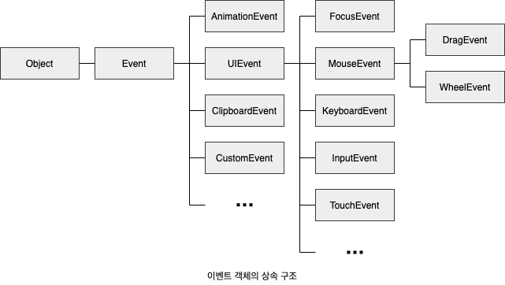
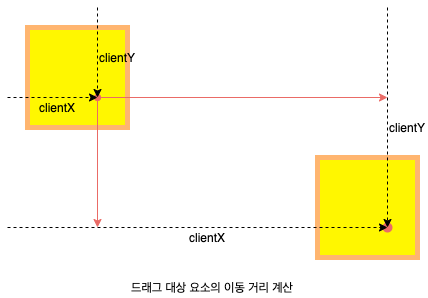
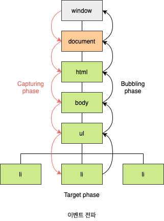

# 40. 이벤트

## 40.1 이벤트 드리븐 프로그래밍

브라우저는 처리해야 할 특정 사건이 발생하면 이를 감지하여 **이벤트**(Event)를 **발생**(Trigger) 시킵니다. 만약 애플리케이션이 특정 타입의 이벤트에 대해 반응하여 어떤 일을 하고 싶다면 해당하는 타입의 이벤트가 발생했을 때 호출될 함수를 브라우저에게 알려 호출을 위임합니다. 이때 이벤트가 발생했을 때 호출될 함수를 **이벤트 핸들러**(Event Handler)라 하고, 이벤트가 발생했을 때 브라우저에게 이벤트 핸들러의 호출을 위임하는 것을 **이벤트 핸들러 등록**이라 합니다.

이벤트와 그에 대앙하는 함수(이벤트 핸들러)를 통해 사용자와 애플리케이션은 **상호작용**(Interaction)을 할 수 있습니다. 이와 같이 프로그래밍의 흐름을 이벤트 중심으로 제어하는 프로그래밍 방식을 **이벤트 드리븐 프로그래밍**(Event-Driven Programming)이라 합니다.

## 40.2 이벤트 타입

**이벤트 타입**(Event Type)은 이벤트의 종류를 나타내는 문자열입니다. 이벤트 타입은 약 200여 가지가 있습니다. 다음 소개하는 이벤트 타입은 사용 빈도가 높은 이벤트입니다. 이벤트 타입에 대한 상세 목록은 MDN의 [Event Reference](https://developer.mozilla.org/ko/docs/Web/Events)에서 확인할 수 있습니다.

### 40.2.1 마우스 이벤트

| 이벤트 타입 | 이벤트 발생 시점                                                 |
| ----------- | ---------------------------------------------------------------- |
| click       | 마우스 버튼을 클릭했을 떄                                        |
| dblclick    | 마우스 버튼을 더블 클릭했을 때                                   |
| mousedown   | 마우스 버튼을 눌렀을 때                                          |
| mouseup     | 누르고 있던 마우스 버튼을 놓았을 떄                              |
| mousemove   | 마우스 커서를 움직였을 떄                                        |
| mouseenter  | 마우스 커서를 HTML 요소 안으로 이동했을 때 (버블링되지 않습니다) |
| mouseover   | 마우스 커서를 HTML 요소 안으로 이동했을 때 (버블링됩니다)        |
| mouseleave  | 마우스 커서를 HTML 요소 밖으로 이동했을 때 (버블링되지 않습니다) |
| mouseout    | 마우스 커서를 HTML 요소 밖으로 이동했을 때 (버블링됩니다)        |

### 40.2.2 키보드 이벤트

| 이벤트 타입 | 이벤트 발생 시점                                                                                                                             |
| ----------- | -------------------------------------------------------------------------------------------------------------------------------------------- |
| keydown     | 모든 키를 눌렀을 때 발생합니다. 단 문자, 숫자, 특수 문자 키를 눌렀을 때는 연속적으로 발생하지만 그 외의 키를 눌렀을 때는 한 번만 발생합니다. |
| keypress    | 문자 키를 눌렀을 때 연속적으로 발생합니다.                                                                                                   |
| keyup       | 누르고 있던 키를 놓았을 때 한 번만 발생합니다.                                                                                               |

### 40.2.3 포커스 이벤트

| 이벤트 타입 | 이벤트 발생 시점                                     |
| ----------- | ---------------------------------------------------- |
| focus       | HTML 요소가 포커스를 받았을 때 (버블링되지 않습니다) |
| blur        | HTML 요소가 포커스를 잃었을 때 (버블링되지 않습니다) |
| focusin     | HTML 요소가 포커스를 받았을 때 (버블링됩니다)        |
| focusout    | HTML 요소가 포커스를 잃었을 때 (버블링됩니다)        |

### 40.2.4 폼 이벤트

| 이벤트 타입 | 이벤트 발생 시점                                                  |
| ----------- | ----------------------------------------------------------------- |
| submit      | `form` 요소 내의 `submit` 버튼을 클릭했을 때                      |
| reset       | `form` 요소 내의 `reset` 버튼을 클릭했을 때 (최근에는 사용 안 함) |

### 40.2.5 값 변경 이벤트

| 이벤트 타입      | 이벤트 발생 시점                                                                                                                                                                                                                                                                                     |
| ---------------- | ---------------------------------------------------------------------------------------------------------------------------------------------------------------------------------------------------------------------------------------------------------------------------------------------------- |
| input            | `input`(text, checkbox, radio), `select`, `textarea` 요소의 값이 입력되었을 때                                                                                                                                                                                                                       |
| change           | `input`(text, checkbox, radio), `select`, `textarea` 요소의 값이 변경되었을 때. input 이벤트와 달리 HTML 요소가 포커스를 잃었을 때 사용자 입력이 종료되었다고 인식하여 발생. 즉 사용자가 입력을 하고 있을 때는 `input` 이벤트가 발생하고 사용자 입력이 종료되어 값이 변경되면 `change` 이벤트가 발생 |
| readystatechange | HTML 문서의 로드와 파싱 상태를 나타내는 readyState 프로퍼티 값(`loading`, `interactive`, `complete`)이 변경될 때                                                                                                                                                                                     |

### 40.2.6 DOM 뮤테이션 이벤트

| 이벤트 타입      | 이벤트 발생 시점                                            |
| ---------------- | ----------------------------------------------------------- |
| DOMContentLoaded | HTML 문서의 로드와 파싱이 완료되어 DOM 생성이 완료되었을 때 |

### 40.2.7 뷰 이벤트

| 이벤트 타입 | 이벤트 발생 시점                                                                                   |
| ----------- | -------------------------------------------------------------------------------------------------- |
| resize      | 브라우저 윈도우의 크기를 리사이즈할 때 연속적으로 발생합니다. 오직 `window` 객체에서만 발생합니다. |
| scroll      | 웹페이지 또는 HTML 요소를 스크롤할 때 연속적으로 발생합니다.                                       |

### 40.2.8 리소스 이벤트

| 이벤트 타입 | 이벤트 발생 시점                                                                                                     |
| ----------- | -------------------------------------------------------------------------------------------------------------------- |
| load        | DOMContentLoaded 이벤트가 발생한 이후, 모든 리소스(이미지, 폰트)의 로딩이 완료되었을 때. 주로 `window` 객체에서 발생 |
| unload      | 리소스가 언로드될 때. 주로 새로운 웹페이지를 요청한 경우                                                             |
| abort       | 리소스 로딩이 중단되었을 때                                                                                          |
| error       | 리소스 로딩이 실패했을 떄                                                                                            |

## 40.3 이벤트 핸들러 등록

**이벤트 핸들러**(Event Handler, Event Listener)는 이벤트가 발생했을 때 브라우저에 호출을 위임한 함수입니다. 이벤트 핸들러를 등록하는 방법은 3가지 입니다.

### 40.3.1 이벤트 핸들러 어트리뷰트 방식

HTML 요소의 어트리뷰트 중에는 이벤트에 대응하는 이벤트 핸들러 어트리뷰트가 있습니다. 이벤트 핸들러 어트리뷰트의 이름은 `onclick`과 같이 on 접두사와 이벤트 종류를 나타내는 이벤트 타입으로 이루어져 있습니다. 주의할 점은 이벤트 핸들러 어트리뷰트 값으로 함수 참조가 아닌 함수 호출문 등의 문을 할당하는 것입니다.

```html
<!DOCTYPE html>
<html>
  <body>
    <button onclick="sayHi('Lee')">Click me!</button>
  </body>
  <script>
    function sayHi(name) {
      console.log(`Hi! ${name}.`);
    }
  </script>
</html>
```

이벤트 핸들러 어트리뷰트 값은 사실 암묵적으로 생성될 이벤트 핸들러의 함수 몸체를 의미합니다. 즉, `onclick="sayHi('Lee')"` 어트리뷰트는 파싱되어 다음과 같은 함수를 암묵적으로 생성하고, 이벤트 핸들러 어트리뷰트를 이름과 동일한 키 `onclick` 이벤트 핸들러 프로퍼티에 할당합니다. 이처럼 동작하는 이유는 이벤트 핸들러에 인수를 전달하기 위해서입니다.

```javascript
function onclick(event) {
  sayHi("Lee");
}
```

이벤트 핸들러 어트리뷰트 방식은 오래된 코드에서 간혹 이 방식을 사용한 것이 있기 때문에 알아둘 필요는 있지만 더는 사용하지 않는 것이 좋습니다. HTML과 자바스크립트는 관심사가 다르므로 혼재하는 것보다 분리하는 것이 좋습니다. 하지만 모던 자바스크립트에서는 이벤트 핸들러 어트리뷰트 방식을 사용하는 경우가 있습니다. **CBD**(Component Based Development) 방식의 Angular/React/Svelte/Vue.js 같은 프레임워크/라이브러리에서는 이벤트 핸들러 어트리뷰트 방식으로 이벤트를 처리합니다. CBD에서는 HTML, CSS 자바스크립트를 관심사가 다른 개별적인 요소가 아닌, 뷰를 구성하기 위한 구성 요소로 보기 때문에 관심사가 다르다고 생각하지 않습니다.

### 40.3.2 이벤트 핸들러 프로퍼티 방식

`window` 객체와 `Domcumet`, `HTMLElement` 타입의 DOM 노드 객체는 이벤트에 대응하는 이벤트 핸들러 프로퍼티를 가지고 있습니다. 이벤트 핸들러 프로퍼티의 키는 이벤트 핸들러 어트리뷰트와 마찬가지로 `on` 접두사와 이벤트 종류를 나타내는 이벤트 타입으로 이루어져 있습니다. 이벤트 핸들러 프로퍼티에 함수를 바인딩하면 이벤트 핸들러가 등록됩니다.

```html
<!DOCTYPE html>
<html>
  <body>
    <button>Click me!</button>
  </body>
  <script>
    const $button = document.querySelector("button");

    $button.onclick = function () {
      console.log("button click");
    };
  </script>
</html>
```

앞서 살펴본 **이벤트 핸들러 어트리뷰트 방식**도 결국 DOM 노드 객체의 이벤트 핸들러 프로퍼티로 변환되므로 결과적으로 이벤트 핸들러 프로퍼티 방식과 동일하다고 할 수 있습니다. **이벤트 핸들러 프로퍼티 방식** 은 **이벤트 핸들러 어트리뷰트 방식**의 HTML과 자바스크립트가 뒤섞이는 문제를 해결할 수 있습니다. 하지만 입네트 핸들러 프로퍼티에 하나의 이벤트 핸들러만 바인딩할 수 있다는 단점이 있습니다.

### 40.3.3 addEventListener 메서드 방식

DOM Level 2에서 도입된 `EventTarget.prototype.addEventListener` 메서드를 사용하여 이벤트 핸들러를 등록할 수 있습니다. 앞서 살펴본 **이벤트 핸들러 어트리뷰트 방식**과 **이벤트 핸들러 프로퍼티 방식**은 DOM Level 0부터 제공되던 방식입니다.

```
EventTarget.addEventListener('eventType', functionName [, useCaputer]);
```

- `addEventListener` 메서드의 첫 번쨰 매개변수에는 이벤트의 종류를 나타내는 문자열인 이벤트 타입을 전달합니다. 이떄 이벤트 핸들러 프로퍼티 방식과는 달리 `on` 접두사를 붙이지 않습니다.
- 두 번째 매개변수에는 이벤트 핸들러를 전달합니다.
- 마지막 매개변수에는 이벤트를 캐치할 이벤트 전파 단계(캡처링 또는 버블링)를 지정합니다. 생략하거나 `false`를 지정하면 버블링 단계에서 이벤트를 캐치하고, `true`를 지정하면 캡처링 단계에서 이벤트를 캐치합니다.

이벤트 핸들러 프로퍼티 방식은 이벤트 핸들러 프로퍼티에 이벤트 핸들러를 바인딩하지만 `addEventListener` 메서드에는 이벤트 핸들러를 인수로 전달합니다. 동일한 HTML 요소에서 발생한 동일한 이벤ㅂ트에 대해 인벤트 핸들러 프로퍼티 방식과 `addEventListener` 메서드 방식을 모두 사용하여 이벤트 핸들러를 등록하면 서로 아무런 영향을 주지 않습니다. 따라서 2개의 이벤트 핸들러가 모두 호출됩니다.

동일한 HTML 요소에서 발생한 동일한 이벤트에 대해 이벤트 핸들러 프로퍼티 방식은 하나 이상의 이벤트 핸들러를 등록할 수 없지만, `addEventListener` 메서드는 하나 이상의 이벤트 핸들러를 등록할 수 있습니다. 단, `addEventListener` 메서드를 통해 참조가 동일한 이벤트 핸들러를 중복 등록하면 하나의 이벤트 핸들러만 등록됩니다.

```html
<!DOCTYPE html>
<html>
  <body>
    <button>Click me!</button>
  </body>
  <script>
    const $button = document.querySelector("button");

    $button.onclick = function () {
      console.log("[이벤트 핸들러 프로퍼티 방식] button click");
    };

    $button.addEventListener("click", function () {
      console.log("[addEventListener 메서드 방식] button click 1");
    });

    $button.addEventListener("click", function () {
      console.log("[addEventListener 메서드 방식] button click 2");
    });
  </script>
</html>
```

## 40.4 이벤트 핸들러 제거

`addEventListener` 메서드로 등록한 이벤트 핸들러르 제거하려면 `EventTarget.prototype.removeEventListener` 메서드를 사용합니다. `removeEventListener` 메서드에 전달할 인수는 `addEventListener` 메서드와 동일합니다. 단, `addEventListener` 메서드에 던달한 인수와 `removeEventListener` 메서드에 전달한 인수가 일치하지 않으면 이벤트 핸들러가 제거되지 않습니다. 따라서 무명 홤수를 이벤트 핸들러로 등록한 경우 제거할 수 없습니다. 이벤트 헨들러를 제거하려면 이벤트 핸들러의 참조를 변수나 자료구조에 저장하고 있어야 합니다.

```html
<!DOCTYPE html>
<html>
  <body>
    <button>Click me!</button>
  </body>
  <script>
    const $button = document.querySelector("button");
    const handleClick = () => console.log("button click");

    $button.addEventListener("click", handleClick);

    // 전달한 인수가 일치하지 않으면 이벤트 핸들러가 제거되지 않습니다.
    $button.removeEventListener("click", handleClick, true); // 실패
    $button.removeEventListener("click", handleClick); // 성공
  </script>
</html>
```

기명 이벤트 핸들러 내부에서 `removeEventListner` 메서드를 호출하여 이벤트 핸들러를 제거하는 것은 가능합니다. 이때 이벤트 핸들러는 단 한번만 호출됩니다. 기명 함수를 이벤트 핸들러로 등록할 수 없다면 호출된 함수, 즉 함수 자신을 가리키는 `argument.callee`를 사용할 수도 있습니다. `arguments.callee`는 코드 최적화를 방해하므로 strict mode에서 사용이 금지됩니다. 따라서 가급적 이벤트 핸들러의 참조를 변수나 자료구조에 저장하여 제거하는 편이 좋습니다.

```javascript
$button.addEventListener("click", function foo() {
  console.log("button click");

  $button.removeEventListener("click", foo);
  // $button.removeEventListener("click", arguments.callee);
});
```

이벤트 핸들러 프로퍼티 방식으로 등록한 이벤트 핸들러는 `removeEventListener` 메서드로 제거할 수 없습니다. 이벤트 핸들러 프로퍼티 방식으로 등록한 핸들러르 제거하려면 이벤트 핸들러 프로퍼티에 `null`을 할당합니다.

## 40.5 이벤트 객체

이벤트가 발생하면 입네트에 관련한 다양한 정보를 담고 있는 이벤트 객체가 동적으로 생성합니다. 생성된 이벤트 객체는 입네트 핸들러의 첫 번째 인수로 전달됩니다.

```html
<!DOCTYPE html>
<html>
  <body>
    <p>클릭하세요. 클릭한 곳의 좌표가 표시됩니다.</p>
  </body>
  <script>
    const $msg = document.querySelector(".message");

    function showCoords(e) {
      $msg.textContent = `clientX: ${e.clientX}, clientY: ${e.clientY}`;
    }

    document.onclick = showCoords;
  </script>
</html>
```

이벤트 핸들러 어트리뷰트 방식의 경우 이벤트 객체를 전달받으려면 이벤트 핸들러의 첫 번째 매개변수 이름이 반드시 `event`이어야 합니다. `event`가 아닌 다른 이름으로 매개변수를 선언하면 이벤트 객체를 전달받지 못합니다. 그 이유는 이벤ㅂ트 핸들러 어트리뷰트 값은 사실 암묵적으로 생성되는 이벤트 핸들러의 함수 몸체를 의미하기 때문입니다.

```html
<body onclick="showCoords(event)"></body>
```

### 40.5.1 이벤트 객체의 상속

이벤트가 발생하면 이벤트 타입에 따라 다양한 타입의 이벤트 객체가 생성됩니다. 이벤트 객체 중 일부는 사용자의 행위에 의해 생성된 것이고 일부는 자바스크립트 코드에 의해 인위적으로 생성된 것입니다. 예를 들어, `MouseEvent` 타입의 이벤트 객체는 사용자가 마우스를 클릭하거나 이동했을 때 생성되는 이벤트 객체이며, `CustomEvent` 타입의 이벤트 객체는 자바스크립트 코드에 의해 인위적으로 생성한 이벤트 객체입니다. 이벤트 객체는 다음과 같은 상속 구조를 갖습니다.



```javascript
const event = new Event("foo");
console.log(event); // Event { isTrusted: false, type: "foo", target: null, ... }
console.log(event.type); // foo
console.log(event instanceof Event); // true
console.log(event instanceof Object); // true

const focusEvent = new FocusEvent("focus");
console.log(e); // FocusEvent { isTrusted: false, relatedTarget: null, view: null, ... }

const mouseEvent = new MouseEvent("click");
console.log(mouseEvent); // MouseEvent { istTrusted: false, screenX: 0, screenY: 0, clientX: 0, ... }
```

### 40.5.2 이벤트 객체의 공통 프로퍼티

`Event` 인터페이스는 DOM 내에서 발생한 이벤트에 의해 생성되는 이벤트 객체를 나타냅니다. `Event` 인터페이스, 즉 `Event.prototype`에 정의되어 있는 이벤트 관련 프로퍼티는 `UIEvent`, `CustomEvent`, `MouseEvent` 등 모든 파생 이벤ㅂ트 객체에 상속됩니다. 즉, `Event` 인터페이스의 이벤트 관련 프로퍼티는 모든 이벤트 객체가 상속받는 공통 프로퍼티입니다.

| 공통 프로퍼티      | 설명                                                                                                                                                              | 타입          |
| ------------------ | ----------------------------------------------------------------------------------------------------------------------------------------------------------------- | ------------- |
| `type`             | 이벤트 타입                                                                                                                                                       | String        |
| `target`           | 이벤트를 발생시킨 DOM 요소                                                                                                                                        | DOM 요소 노드 |
| `currentTarget`    | 이벤트 핸들러가 바인딩된 DOM 요소                                                                                                                                 | DOM 요소 노드 |
| `eventPhase`       | 이벤트 전파 단계 (0: 이벤트 없음, 1: 캡처링 단계, 2: 타깃 단계: 3: 버블링 단계)                                                                                   | Number        |
| `bubbles`          | 이벤트를 버블링으로 전파하는지 여부                                                                                                                               | Boolean       |
| `cancelable`       | `preventDefault` 메서드를 호출하여 이벤트 기본 동작을 취소할 수 있는지 여부                                                                                       | Boolean       |
| `defaultPrevented` | `preventDefault` 메서드를 호출하여 이벤트를 취소했는지 여부                                                                                                       | Boolean       |
| `isTrusted`        | 사용자의 행위에 의해 발생한 이벤트인지 여부. 예를 들어, `click` 메서드 또는 `dispatchEvent` 메서드를 통해 인위적으로 발생시킨 이벤트인 경우 `isTrusted`는 `fasle` | Boolean       |
| `timeStamp`        | 이벤트가 발생한 시각 (1970/01/01/00:00부터 경과한 밀리초)                                                                                                         | Number        |

일반적으로 이벤트 객체의 `target` 프로퍼티와 `currentTarget` 프로퍼티는 동일한 DOM 요소를 가리키지만 나중에 살펴볼 이벤트 위임에서는 이벤트 객체의 `target` 프러파티와 `currentTarget` 프로퍼티가 서로 다른 DOM 요소를 가리킬 수 있습니다.

### 40.5.3 마우스 정보 취득

`MouseEvent` 타입의 이벤트 객체는 다음과 같은 고유의 프로퍼티를 갖습니다.

- **마우스 포인터의 좌표를 나타내는 프로퍼티:** `screenX`/`screenY`, `clientX`/`clientY`, `pageX`/`pageY`, `offsetX`/`offsetY`
- **버튼 정보를 나타내는 프로퍼티:** `altKey`, `ctrlKey`, `shiftKey`, `button`

이 프로퍼티 중에서 `clientX`/`clientY`는 **뷰포트(Viewport)**, 즉 웹페이지의 가시 영역을 기준으로 마우스 포인터 좌표를 나타냅니다.



```html
<!DOCTYPE html>
<html>
  <style>
    .box {
      width: 100px;
      height: 100px;
      background-color: #fff700;
      border: 5px solid orange;
      cursor: pointer;
    }
  </style>
  <body>
    <div class="box"></div>
  </body>
  <script>
    const $box = document.querySelector(".box");
    const initailMousePos = { x: 0, y: 0 };
    const offset = { x: 0, y: 0 };

    const move = (e) => {
      offset.x = e.clientX - initailMousePos.x;
      offset.y = e.clienty - initailMousePos.y;

      $box.style.transform = `translate3d(${offset.x}px, ${offset.y}px, 0)`;
    };

    $box.addEventListener("mousedown", (e) => {
      // 한 번 이상 드래그로 이동한 경우 offset.x와 offset.y를 빼주어야 합니다.
      initailMousePos.x = e.clientX - offset.x;
      initailMousePos.y = e.clientX - offset.y;

      docuemnt.addEventListener("mousemove", move);
    });

    document.addEventListener("mouseup", () => {
      document.removeEventListner("mousemove", move);
    });
  </script>
</html>
```

### 40.5.4 키보드 정보 취득

`keydown`, `keyup`, `keypress` 이벤트가 발생하면 생성되는 `KeyboardEvent` 타입의 이벤트 객체는 `altKey`, `ctrlKey`, `shiftKey`, `metaKey`, `key`, `keyCode` 같은 고유의 프로퍼티를 갖습니다.

```html
<!DOCTYPE html>
<html>
  <body>
    <input type="text" />
    <em class="message"></em>
  </body>
  <script>
    const $input = document.querySelector("input[type=text]");
    const $msg = docuement.querySelector(".message");

    $input.onkeyup = (e) => {
      if ((e.key = "Enter")) return;

      $msg.textContent = e.target.value;
      e.target.value = "";
    };
  </script>
</html>
```

## 40.6 이벤트 전파

이벤트 객체는 이벤트를 발생시킨 DOM 요쇼인 **이벤트 타깃**(Event Target)을 중심으로 DOM 트리를 통해 전파됩니다. 이를 **이벤트 전파**(Event Popagation)라고 합니다. 이벤트 전파는 이벤트 객체가 전파되는 방향에 따라 다음과 같이 3단계로 구분한 수 있습니다.



1. **캡쳐링 단계**(Capturing Phase): 이벤트가 상위 요소에서 하위요소 방향으로 전파됩니다.
2. **타깃 단계**(Target Phase): 이벤트가 이벤트 타깃에 도달합니다.
3. **버블링 단계**(Bubbling phase): 이벤트가 하위 요소에서 상위요소 방향으로 전파됩니다.

요소를 클릭하면 클릭 이벤트가 발생하여 클릭 이벤트 객체가 생성되고 클릭된 요소가 이벤트 타깃이 됩니다. 이떄 클릭 이벤트 객체는 `window`에서 시작해서 이벤트 타깃 방향으로 전파됩니다. 이것이 캡처링 단계입니다. 이후 이벤트 객체는 이벤트를 발생시킨 이벤트 타깃에 도달합니다. 이것이 타깃 단계입니다. 이후 이벤트 객체는 이 이벤트 타깃에서 시작해서 `window` 방향으로 전파됩니다. 이것이 버블링 단계입니다.

이벤트 핸들러 어트리뷰트/프로퍼티 방식으로 등록한 이벤트 핸들러는 타깃 단계와 버블링 단계의 이벤트만 캐치할 수 있습니다. 하지만 `addEventListener` 메서드 방식으로 등록한 이벤트 핸들러는 타깃 단계와 버블링 단계뿐만 아니라 캡쳐링 단계의 이벤트도 선별적으로 캐치할 수 있습니다. 캐처림 당계의 이벤트를 캐치하려면 `addEventListener` 메서드의 3번쨰 인수로 `true`를 전달해야 합니다. 3번째 인수를 생략하거나 `false`를 전달하면 타깃 단계와 버블링 단계의 이벤트만 캐치할 수 있습니다.

```html
<!DOCTYPE html>
<html>
  <body>
    <ul id="furits">
      <li id="apple">Apple</li>
      <li id="banana">Banana</li>
      <li id="oramge">Orange</li>
    </ul>
  </body>
  <script>
    const $fruits = document.getElementById("fruits");
    const $banana = document.getElementById("banana");

    $fruits.addEventListener(
      "click",
      (e) => {
        console.log(e.eventPhase); // 1: 캡쳐링 단계
      },
      true
    );

    $banana.addEventListener("click", (e) => {
      console.log(e.eventPhase); // 2: 타깃 단계
    });

    $fruits.addEventListener("click", (e) => {
      console.log(e.eventPhase); // 3: 버블링 단계
    });
  </script>
</html>
```

대부분의 이벤트는 캡처링과 버블링을 통해 전파됩니다. 하지만 몇가지 이벶트는 버블링을 통해 전파되지 않습니다. 하지만 다음 이벤트는 버블링을 통해 전파되지 않습니다. 이 이벤트들은 버블링을 통해 이벤트를 전파하는지 여부를 나타내는 이벤트 객체의 공통 프로퍼티 `event.bubbles`의 값이 모두 `false`입니다.

- **포커스 이벤트**: `focus`, `blur`
- **리소스 이벤트**: `load`, `unload`, `abort`, `error`
- **마우스 이벤트**: `mouseenter`, `mouseleave`

위 이벤트는 버블링되지 않으므로 이1벤트 타깃의 상위 요소에서 위 이벤트를 캐치하려면 캠처링 단계의 이벤트를 캐치해야 합니다. 하지만 위 이벤트를 상위 요소에서 캐치해야 할 경우는 그리 많지 않지만 위 이벤트를 상위 요소에서 캐치해야 한다면 대체할 수 있는 이벤트가 존재합니다. 예를 들어, `focus`/`blur` 이벤트는 `focusin`/`focusout`으로, `mouseenter`/`mouseleave`는 `mouseover`/`mouseout`으로 대체할 수 있습니다. 따라서 캡처링 단계에서 이벤트를 캐치해야 할 경우는 거의 없습니다.

## 40.7 이벤트 위임

**이벤트 위임**(Event Delegation)은 여러 개의 하위 DOM 요소에 각각 이벤트 핸들러를 등록하는 대신 하나의 상위 DOM 요소에 이벤트 핸들러를 등록하는 방법을 맗합니다. 이벤트는 이벤트 타깃은 물론 상위 DOM 요소에서도 캐치할 수 있습니다. 이벤트 위임을 통해 상위 DOM 요소에 이벤트 핸들러를 등록하면 여러 개의 하위 DOM 요소에 이벤트 핸들러를 등록할 필요가 없습니다. 또한 동적으로 하위 DOM 요소를 추가하더라도 일일이 추가된 DOM 요소에 이벤트 핸들러를 등록할 필요가 없습니다.

일반적으로 이벤트 객체의 `target` 프로퍼티와 `currentTarget` 프로퍼티는 동일한 DOM 요소를 가리키지만 이벤트 위임을 통해 상위 DOM 요소에 이벤트를 바인딩한 경우 이벤트 객체의 `target` 프로퍼티와 `currentTarget` 프로퍼티는 다른 DOM 요소를 가리킬 수 있습니다.

```html
<!DOCTYPE html>
<html>
  <head>
    <style>
      #fruits {
        display: flex;
        list-style-type: none;
        padding: 0;
      }

      #fruits li {
        width: 100px;
        cursor: pointer;
      }

      #fruits .active {
        color: red;
        text-decoration: underline;
      }
    </style>
  </head>
  <body>
    <nav>
      <ul id="fruits">
        <li id="apple" class="active">Apple</li>
        <li id="banana">Banana</li>
        <li id="orange">Orange</li>
      </ul>
    </nav>
    <div>선택된 내비게이션 아이템: <em class="msg">apple</em></div>
  </body>
  <script>
    const $fruits = document.getElementById("fruits");
    const $msg = document.querySelector(".msg");

    function activate({ target }) {
      if (!target.matches("#fruits > li")) return;
      $msg.textContent = target.id;

      [...$fruits.children].forEach(($fruit) => {
        $fruit.claassList.toggle("active", $fruit === target);
      });
    }

    $fruits.onclick = activate;
  </script>
</html>
```

## 40.8 DOM 요소의 기본 동작의 조작

### 40.8.1 DOM 요소의 기본 동작 중단

DOM 요소는 저마다 기본 동작이 있습니다. 예를 들어 `a` 요소를 클릭하면 `href` 어트리뷰트에 지정된 링크로 이동하고, `checkbox` 또는 `radio` 요소를 클릭하면 체크 또는 헤제됩니다. 이벤트 객체의 `preventDefault` 메서드는 이러한 DOM 요소의 기본 동작을 중단시킵니다.

```javascript
document.querySelector("a").onclick = (e) => {
  e.preventDefault();
};
```

### 40.8.2 이벤트 전파 방지

이벤트 객체의 `stopPropagation` 메서드는 이벤트 전파를 중지시킵니다.

```javascript
document.querySelector(".btn").onclick = (e) => {
  e.stopPropagation();
  e.target.style.color = "blue";
};
```

## 40.9 이벤트 핸들러 내부의 this

### 40.9.1 이벤트 핸들러 어트리뷰트 방식

```html
<!DOCTYPE html>
<html>
  <body>
    <button class="btn" onclick="handleClick(this)">Click me</button>
    <script>
      function handleClick(thisArg) {
        console.log(thisArag); // 이벤트를 바인딩한 button 요소
        console.log(this); // window
      }
    </script>
  </body>
</html>
```

이벤ㅂ트 핸드러 어트리뷰트의 값으로 지정한 문자열은 사실 암묵적으로 생성되는 이벤트 핸들러의 문이라고 했습니다. 따라서 `handleClick` 함수는 이벤트 핸들러에 의해 일반 함수로 호출됩니다. 일반 함수로서 호출되는 함수 내부의 `this`는 전역 객체를 가리킵니다. 단, 입네트 핸들러를 호출할 때 인수로 전달한 `this`는 이벤트를 바인딩한 DOM 요소를 가리킵니다. 이는 이벤트 핸들러 프로퍼티 방식과 동일합니다.

### 40.9.2 이벤트 핸들러 프로퍼티 방식과 addEventListener 메서드 방식

이벤트 핸들러 프로퍼티 방식과 `addEventListener` 메서드 방식 모두 이벤트 핸들러 내부의 `this` 이벤트를 바인딩한 DOM 요소를 가리킵니다. 즉, 입네트 핸들러 내부의 `this`는 이벤트 객체의 `currentTarget` 프로퍼티와 같습니다.

```javascript
const $btn = document.querySelector(".btn");

$btn.onclick = function (e) {
  console.log(this); // 이벤트를 바인딩한 button 요소
  console.log(e.currentTarget); // 이벤트를 바인딩한 button 요소
  console.log(this === e.currentTarget); // true
};
```

화살표 함수로 정의한 이벤트 핸들러 내부의 `this`는 상위 스코프의 `this`를 가리킵니다. 화살표 함수는 함수 자체의 `this` 바인딩을 갖지 않습니다.

```javascript
const $btn = document.querySelector(".btn");

$btn.addEventListener("click", (e) => {
  console.log(this); // window
  console.log(e.currentTarget); // 이벤트를 바인딩한 button 요소
  console.log(this === e.currentTarget); // false
});
```

## 40.10 이벤트 핸들러에 인수 전달

함수에 인수를 전달하려면 함수를 호출할 때 전달해야 합니다. 이벤트 핸들러 어트리뷰트 방식은 함수 호출문을 사용할 수 있기 때문에 인수를 전달할 수 있지만 인벤트 핸들러 프로퍼티 방식과 `addEventListener` 메서드 방식의 경우 이벤트 핸들러를 브라우저가 호출하기 때문에 함수 호출문이 아닌 함수 자체를 등록해야 합니다. 따라서 인수를 전달할 수 없습니다. 그러나 인수를 전달할 방법이 전혀 없는 것은 아닙니다. 다음 예제와 같이 이벤트 핸들러 내부에서 함수를 호출하면서 인수를 전달할 수 있습니다.

```html
<!DOCTYPE html>
<html>
  <body>
    <label>User name <input type="text" /></label>
    <em class="message"></em>
    <script>
      const MIN_USER_NAME_LENGTH = 5;
      const $input = document.querySelector("input[type=text]");
      const $msg = document.querySelector(".message");

      const checkUserNameLength = (min) => {
        $msg.textContent =
          $input.value.length < min
            ? `이름은 ${min}자 이상 입력해 주세요.`
            : "";
      };

      $input.onblur = () => {
        checkUserNameLength(MIN_USER_NAME_LENGTH);
      };
    </script>
  </body>
</html>
```

또는 입네트 핸들러를 반환하는 함수를 호출하면서 인수를 전달할 수도 있습니다.

```javascript
const MIN_USER_NAME_LENGTH = 5;
const $input = document.querySelector("input[type=text]");
const $msg = document.querySelector(".message");

const checkUserNameLength = (min) => (e) => {
  $msg.textContent =
    $input.value.length < min ? `이름은 ${min}자 이상 입력해 주세요.` : "";
};

$input.onblur = checkUserNameLength(MIN_USER_NAME_LENGTH);
```

## 40.11 커스텀 이벤트

### 40.11.1 커스텀 이벤트 생성

이벤트가 발생하면 암묵적으로 생성되는 이벤트 객체는 발생한 이벤트의 종류에 따라 이벤트 타입이 결정됩니다. 하지만 `Event`, `UIEvent`, `MouseEvent` 같은 이벤트 생성자 함수를 호출하여 명시적으로 생성한 이벤트 객체는 임의의 이벤트 타입을 지정할 수 있습니다. 이처럼 개발자의 의도로 생성된 이벤트를 커스텀 이벤트라 합니다.

이벤트 생성자 함수는 첫 번째 인수로 이벤트 타입을 나타내는 문자열을 전달받습니다. 이떄 이벤트 타입을 나타내는 문자열은 기존 이벤트 타입을 사용할 수도 있고, 기존 이벤트 타입이 아닌 임의의 문자열을 사용하여 새로운 이벤트 타입을 지정할 수도 있습니다. 이 경우 일반적으로 `CustomEvent` 이벤트 생성자 함수를 사용합니다.

```javascript
const keyboardEvent = new KeyboardEvent("keyup");
console.log(keyboardEvent.type); // keyup

const customEvent = new CustomEvent("foo");
console.log(customEvent.type); // foo
```

생성된 커스텀 이벤트 객체는 버블링되지 않으며 `preventDefault` 메서드로 취소할 수도 없습니다. 즉, 커스텀 이벤트 객체는 `bubbles`와 `cancelable` 프로퍼티의 값이 `false`로 기본 설정됩니다. 커스텀 이벤트 객체의 `bubbles` 또는 `cancelable` 프로퍼티를 `true`로 설정하려면 이벤트 생성자 함수의 두 번째 인수로 `bubbles` 또는 `cancelable` 프로퍼티를 갖는 객체를 전달합니다. 두번째 인수는 `bubbles` 또는 `cancelable` 프러퍼티뿐만 아니라 이벤트 타입에 따라 가지는 이벤트 고유의 프로퍼티 값을 지정할 수 있습니다.

```javascript
const customEvent = new MouseEvent("click", {
  bubbles: true,
  cancelable: true,
  clientX: 50,
  clientY: 100,
});
```

이벤트 생성자 함수로 생성한 커스텀 이벤트는 `isTrusted` 프러퍼티의 값이 언제나 `false`입니다. 커스텀 이벤트가 아닌 사용자의 행위에 의해 발생한 이벤트에 의해 생성된 이벤트 객체의 `isTrusted` 프러퍼티 값은 언제나 `true`입니다.

```javascript
const customEvent = new InputEvet("foo");
console.log(customEvent.isTrusted); // false
```

### 40.11.2 커스텀 이벤트 디스패치

생성된 커스텀 이벤트는 `dispatchEvent` 메서드로 **디스패치**(Dispatch, 이벤트를 발생시키는 행위)할 수 있습니다. `dispatchEvent` 메서드에 이벤트 객체를 인수로 전달하면서 호출하면 인수로 전달한 이벤트 타입의 이벤트가 발생합니다.

```javascript
const customEvent = new MouseEvent("click");
$button.dispatchEvent(customEvent);
```

일반적으로 이벤트 핸들러는 **비동기**(Asynchronous) 처리 방식으로 동작하지만 `dispatchEvent` 메서드는 입ㅂ네트 핸들러를 **동기**(Synchronous) 처리 방식으로 호출합니다. 다시 말해, `dispatchevent` 메서드를 호출하면 커스텀 이벤트에 바인딩된 이벤트 핸들러를 직접 호출하는 것과 같습니다. 따라서 `dispatchEvent` 메서드로 이벤트를 디스패치하기 이전에 커스텀 이벤트를 처리할 이벤트 핸들러를 등록해야 합니다.

기존 이벤트 타입이 아닌 임의의 이벤트 타입을 지정하여 커스텀 이벤트 객체를 생성한 겨웅 반드시 `addEventListener` 메서드 방식으로 이벤트 핸들러를 등록해야 합니다. 이벤트 핸들러 어트리뷰트/프로퍼티 방식을 사용할 수 없는 이유는 `on + 이벤트 타입`으로 이루어진 이벤트 핸들러 어트리뷰트/프로퍼티가 요소 노드에 존재하지 않기 때문입니다. `CustomEvent` 이벤트 생성자 함수에는 두 번쨰 인수로 이벤트와 함꼐 전달하고 싶은 정보들을 담은 `detail` 프로퍼티를 포함하는 객체를 전달할 수 있습니다.

```javascript
$button.addEventListener("foo", (e) => {
  alert(e.detail.message);
});

const customEvent = new CustomEvent("foo", {
  detail: { message: "Hello" },
});

$button.dispatchEvent(customEvent);
```
