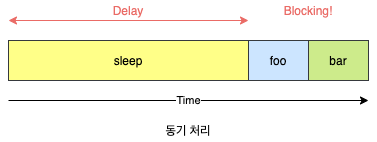
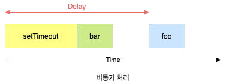
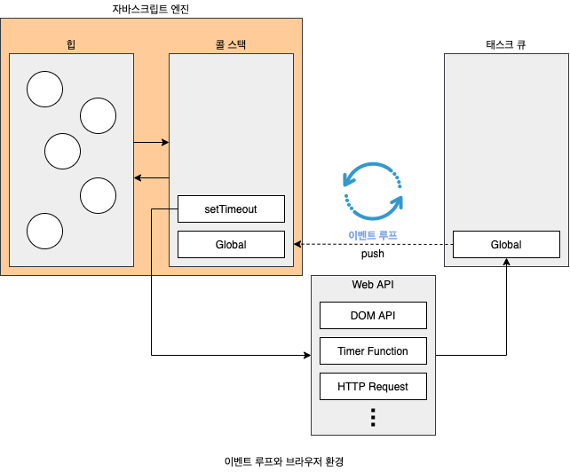

# 42. 비동기 프로그래밍

## 42.1 동기 처리와 비동기 처리

함수가 실행되려면 **함수 코드 평가 과정**에서 생성된 함수 실행 컨텍스트가 실행 컨텍스트 스택에 푸시되어야 합니다. 다시 말해, 실행 컨텍스트 스택에 함수 실행 컨텍스트가 푸시되는 것은 바로 함수 실행의 시작을 의미합니다. 함수가 호출된 순서대로 순차적으로 실행되는 이유는 함수가 호출된 순서대로 함수 실행 컨텍스트가 실행 컨텍스트 스택에 푸시되기 때문입니다. 이처럼 함수의 실행 순서는 실행 컨텍스트 스택으로 관리힙니다.

자바스크립트 엔진은 단 하나의 실행 컨텍스트 스택을 갖습니다. 이는 함수를 실행할 수 있는 창구가 단 하나이며, 동시에 2개 이상의 함수를 실행할 수 없다는 것을 의미합니다. 실행 컨텍스트 스택의 최상위 요소인 **실행 중인 실행 컨텍스트**를 제외한 모든 실행 컨텍스트는 모두 실행 대기 중인 **테스크**(Task)들입니다. 대기 중인 태스크들은 현재 실행 중인 실행 컨텍스트가 팜되어 실행 컨텍스트 스택에서 제거되면, 다시 말해 현재 실행중인 함수가 졸료되면 비로서 실행되기 시작합니다.

이처럼 자바스크립트 엔진은 한 번에 하나의 테스크만 실행할 수 있는 **싱글 스레드**(Single Thread) 방식으로 동작합니다. 싱글 스레드 방식은 한 번에 하나의 테스크만 실행할 수 있기 때문에 처리에 시간이 걸리는 테스크를 실행하는 경우 **블로킹**(Blocking)이 발생합니다. 이처럼 현재 실행 중인 테스크가 종료될 때까지 다음에 실행될 테스크가 대기하는 방식을 **동기**(Synchronous) 처리라고 합니다. 동기 처리 방식은 테스크를 순서대로 하나씩 처리하므로 실행 순서가 보장된다는 장점이 있지만, 앞선 테스크가 종료할 때까지 이후 태스크들이 블로킹되는 단점이 있습니다.

```javascript
function sleep(func, delay) {
  const delayUnitl = Data.now() + delay;
  while (Data.now() < deldelayUnitl);
  func();
}

function foo() {
  console.log("foo");
}

function bar() {
  console.log("bar");
}

sleep(foo, 3 * 1000);
bar();
```



현재 실행 중인 테스크가 종료되지 않은 상태라 해도 다음 태스크를 곧바로 실행하는 방식을 **비동기**(Asnychronous)처리라고 합니다. 비동기 처리 방식은 현재 실행 중인 테스크가 종료되지 않은 상태라 해도 다음 테스크를 곧 바로 실행하므로 블로킹이 발생하지 않는다는 장점이 있지만, 태스크의 실행 순서가 보장되지 않는 단점이 있습니다. 비동기 처리를 수행하는 비동기 함수는 전통적으로 콜백 패턴을 사용합니다. 비동기 처리를 위한 콜백 패턴은 **콜백 헬**(Callback Hell)을 발생시켜 가독성을 나쁘게 하고, 비동기 처리 중 발생한 에러의 예외 처리가 곤란하며, 여러 개의 비동기 처리를 한 번에 처리하는 데도 한계가 있습니다. 이에 대해서는 45장 **프로미스**에서 자세히 살펴봅니다.

```javascript
function foo() {
  console.log("foo");
}

function bar() {
  console.log("bar");
}

setTimeout(foo, 3 * 1000);
bar();
```



## 42.2 이벤트 루프와 태스크 큐



**이벤트 루프**(Event Loop)는 브라우저에 내장되어 있는 기능 중 하나이며, 자바스크립트의 **동시성**(Concurrency)을 지원합니다. 구글의 V8 자바스크립트 엔진을 비롯한 대부분의 자바스크립트 엔진은 크게 2개의 영역으로 구분할 수 있습니다.

- **콜 스택**(Call Stack): 소스코드(전역 코드나 함수 코드 등) 평가 과정에서 생성된 실행 컨텍스트가 추가되고 제고되는 스택 자료구조인 실행 컨텍스트 스택이 바로 콜 스택입니다. 함수를 호출하면 함수 실행 컨텍스트가 순차적으로 콜 스택에 푸시되어 순차적으로 실행됩니다. 자바스크립트 엔진은 단 하나의 콜 스택을 사용하기 때문에 최상위 컨텍스트(실행 중인 컨텍스트)가 종료되어 콜 스택에서 제거되기 전까지 다른 어떤 태스크도 실행되지 않습니다.
- **힙**(Heap): 힙은 객체가 저장되는 메모리 공간입니다. 콜 스택의 요소인 실행 컨텍스트는 힙에 저장된 객체를 참조합니다. 메모리에 값을 저장하려면 먼저 값을 저장할 메모리 공간의 크기를 결정해야 합니다. 객체는 원시 값과는 달리 크기가 정해져 있지 않으므로 할당해야 할 메머리 공간의 크기를 런타임에 결정(동적 할당)해야 합니다. 따라서 객체가 저장되는 메모리 공간인 힙은 구조화 되어 있지 않다는 특징이 있습니다.

콜 스택과 힙으로 구성되어 있는 자바스크립트 엔진은 단순히 태스크가 요청되면 콜 스택을 통해 요청된 작업을 순차적으로 실행할 뿐입니다. 비동기 처리에서 소스코드의 평가와 실행을 제외한 모든 처리는 자바스크립트 엔진을 구동하는 환경인 브라우저 또는 Node.js가 담당합니다.

- **태스크 큐**(Task Queue/Event Queue/Callback Queue): `setTimeout`이나 `setInterval`과 같은 비동기 함수의 콜백 함수 또는 이벤트 핸들러가 일시적으로 보관되는 영역입니다. 테스크 큐와는 별도로 프로미스의 후속 처리 메서드의 콜백 함수가 일시적으로 보관되는 마이크로태스크 큐도 존재합니다. 이에 대해서는 **45.7절 마이크로태스크 큐**에서 살펴봅니다.
- **이벤트 루프**(Event Loop): 이벤트 루프는 콜 스택에 현재 실행 중인 실행 컨텍스트가 있는지, 그리고 태스크 큐에 대기 중인 함수(콜백 함수, 이벤트 핸들러 등)가 있는지 반복해서 확인합니다. 만약 콜 스택이 비어 있고 태스크 큐에 대기 중인 함수가 있다면 이벤트 루프는 순차적으로 태스크 큐에 대기 중인 함수를 콜 스택으로 이동시킵니다. 이때 콜 스택으로 이동한 함수는 실행됩니다. 즉, 태스크 큐에 일시 보관된 함수들은 비동기 처리 방식으로 동작합니다.

브라우저 환경에서 다음 예제가 어떻게 동작할지 살펴봅시다.

```javascript
function foo() {
  console.log("foo");
}

function bar() {
  console.log("bar");
}

setTimeout(foo, 0);
bar();
```

1. 전역 코드가 평가되어 전역 실행 컨텍스트가 생성되고 콜 스택에 푸시됩니다.
2. 전역 코드가 실행되기 시작하여 `setTimeout` 함수가 호출됩니다. 이때 `setTimeout` 함수의 함수 실행 컨택스트가 생성 되고 콜 스택에 푸시되어 현재 실행 중인 실행 컨텍스트가 됩니다. 브라우저의 Web API(호스트 객체)인 타이머 함수도 함수이므로 함수 실행 컨텍스트를 생성합니다.
3. `setTimeout` 함수가 실행되면 콜백 함수를 호출 스케줄링하고 종료되어 콜 스택에서 팝됩니다. 이때 호출 스케줄링, 즉 타이머 설정과 타이머가 만료되면 콜백 함수를 태스크 큐에 푸시하는 것은 브라우저의 역할입니다.
4. 브라우저가 수행하는 4-1과 4-2는 병행 처리됩니다.
   1. 브라우저는 타이머를 설정하고 타이머의 만료를 기다립니다. 이후 타이머가 만료되면 콜백 함수 `foo`가 태스크 큐에 푸시됩니다. 위 예에의 경우 지연 시간이 0이지만 지연 시간이 4ms 이하인 경우 최소 지연 시간이 4ms가 지정됩니다. 따라서 4ms 후에 콜백 함수 `foo`가 태스크 큐에 푸시되어 대기하게 됩니다. 이 처리 또한 자바스크립트 엔진이 아니라 브라우저가 수행합니다. 이처럼 `setTimeout` 함수로 호출 스케줄링한 콜백 함수는 정확히 지연 시간 후에 호출된다는 보장은 없습니다. 지연 시간 이후에 콜백 함수가 테스크 큐에 푸싱되어 대기하게 되지만 콜 스택이 비어야 호출되므로 약간의 시간차가 발생할 수 있기 때문입니다.
   2. `bar` 함수가 호출되어 `bar` 함수의 함수 실행 컨텍스트가 생성되고 콜 스택에 푸시되어 현재 실행 중인 실행 컨텍스트가 됩니다. 이후 `bar` 함수가 종료되어 콜 스택에서 팝됩니다. 이때 브라우저가 타이머를 설정한 후 4ms가 경과했다면 `foo` 함수는 아직 태스크 큐에서 대기 중입니다.
5. 전역 코드 실행이 종료되고 정역 실행 컨텍스트가 콜 스택에서 팝됩니다. 이로서 콜 스택에는 아무런 실행 컨텍스트도 존재하지 않게 됩니다.
6. 이벤트 루프에 의해 콜 스택이 비어 있음이 감지되고 테스크 큐에서 대기 중인 콜백 함수 `foo`가 이벤트 루프에 의해 콜 스택에 푸시됩니다. 다시 말해, 콜백 함수 `foo`의 함수 실행 컨텍스트가 실행되고 콜 스택에 푸시되어 현재 실행중인 실행 컨텍스트가 됩니다. 이후 `foo` 함수가 종료되어 콜 스택에서 팝 됩니다.

자바스크립트는 싱글 스레드 방식으로 동작합니다. 이때 싱글 스레드 방식으로 동작하는 것은 브라우저가 아니라 브라우저에 내장된 자바스크립트 엔진이라는 것에 주의하기 바랍니다. 만약 모든 자바스크립트 코드가 자바스크립트 엔진에서 싱글 스레드 방식으로 동작한다면 자바스크립트는 비동기로 동작할 수 없습니다. 즉, 자바스크립트 엔진은 싱글 스레드로 동작하지만 브라우저는 멀티 스레드로 동작합니다.
