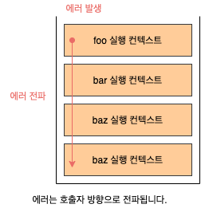

# 47. 에러 처리

## 47.1 에러 처리의 필요성

**에러**(Error)는 언제나 발생할 수 있으며, 발생하지 않는 코드를 작성하는 것은 불가능합니다. 발생한 에러에 대해 대처하지 않고 방치하면 프로그램은 강제 종료됩니다. 따라서 우리는 작성한 코드에서 언제나 에러나 예외적인 상황이 발생할 수 있다는 것을 전제하고 이에 대응하는 코드를 작성하는 것이 중요합니다.

## 47.2 try ... catch ... finally 문

기본적으로 에러 처리를 구현하는 방법은 크게 두 가지가 있습니다. `querySelector`나 `Array.find` 메서드처럼 예외적인 상황이 발생하면 반환하는 값(`null` 또는 `-1`)을 `if` 문이나 단축 평가 또는 옵셔널 체이닝 연산자를 통해 확인해서 처리하는 방법과 에러 처리 코드를 미리 등록해 두고 에러가 발생하면 에러 처리 코드로 점프하도록 하는 방법이 있습니다.

`try ... catch ... finally` 문은 두 번째 방법입니다. 일반적으로 이 방법은 **에러 처리**(Error Handling)라고 합니다. `try ... catch ... finally` 문은 다음과 같이 33개의 코드 블록으로 구성됩니다. `finally` 문은 불칠요하다면 생략 가능합니다. `catch` 문도 생략 가능하지만 `catch` 문이 없는 `try` 문은 의미가 없으므로 생략하지 않습니다.

`try ... catch ... finally` 문을 실행하면 먼저 `try` 코드 블록이 실행됩니다. 이떄 `try` 코드 블록에 포함된 문 중에서 에러가 발생하면 발생한 에러는 `catch` 문의 `error` 변수에 전달되고 `catch` 코드 블록이 실행됩니다. `catch` 문의 `error` 변수(변수 이름은 무엇이든 상관없습니다)는 `try` 코드 블록에 포함된 문 중에서 에러가 발생하면 생성되고 `catch` 코드 블록에서만 유효합니다. `finally` 코드 블록은 에러 발생과 상관없이 반드시 한 번 실행 됩니다. `try ... catch ... finally` 문으로 에러를 처리하면 프로그램이 강제 종료되지 않습니다.

```javascript
try {
  // 실행할 코드(에러가 발생할 가능성이 있는 코드)
  foo();
} catch (error) {
  // try 코드 블로게서 에러가 발생하면 이 코드 블록의 코드가 실행됩니다.
  // error에너느 try 코드 블록에서 발생한 Error 객체가 전달됩니다.
  console.error(error); // ReferenceError: foo is not defined
} finally {
  // 에러 발생과 상관없이 반드시 한 번 실행됩니다.
  console.log("finally");
}
```

## 47.3 Error 객체

`Error` 생성자 함수는 에러 객체를 생성합니다. `Error` 생성자 함수에는 에러를 상세히 설명하는 에러 메시지를 인수로 전달할 수 있습니다.

```javascript
const error = new Error("invalid");
```

`Error` 생성자 함수가 생성한 에러 객체는 `message` 프로퍼티와 `stack` 프로퍼티를 갖습니다. `message` 프로퍼티의 값은 `Error` 생성자 함수에 인수로 전달한 에러 메시지이고, `stack` 프로퍼티의 값은 에러를 발생시킨 콜스택의 호출 정보를 나타내는 문자열이며 디버깅 목적으로 사용합니다. 자바스크립트는 `Error` 생성자 함수를 포함해 7가지의 에러 객체를 생성할 수 있는 `Error` 생성자 함수를 제공합니다.
이들은 모두 `Error.prototype`을 상속받습니다.

| 생성자 함수      | 인스턴스                                                                           |
| ---------------- | ---------------------------------------------------------------------------------- |
| `Error`          | 일반적 에러 객체                                                                   |
| `SyntaxError`    | 자바스크립트 문법에 맞지 않는 문을 해석할 댸 발생하는 에러 객체                    |
| `ReferenceError` | 참조할 수 없는 식별자를 참조했을 떄 발생하는 에러 객체                             |
| `TypeError`      | 피연산자 또는 인수의 데이터 타입이 유효하지 않을 떄 발생하는 에러 객체             |
| `RangeError`     | 숫자값의 허용 범위를 벗어났을 때 발생하는 에러 객체                                |
| `URIError`       | `encodeURI` 또는 `decodeURI` 함수에 부적절한 인수를 전달했을 떄 발생하는 에러 객체 |
| `EvalError`      | `eval` 함수에서 발생하는 에러 객체                                                 |

```javascript
1 @ 1; // SyntaxError: Invalid or unexpected token
foo(); // ReferenceError: foo is not defined
null.foo; // TypeError: Cannot read property 'foo' of null
new Array(-1); // RangeError: Invalid array length
decodeURIComponent('%'); // URIError: URI malformed
```

## 47.4 throw 문

`Error` 생성자 함수로 에러 객체를 생성한다고 에러가 발생하는 것은 아닙니다. 에러를 발생시키려면 `try` 코드 블록에서 `throw` 문으로 에러 객체를 던져야 합니다. `throw` 문의 표현식은 어던 값이라도 상관없지만 일반적으로 에러 객체를 지정합니다. 에러를 던지면 `catch` 문의 에러 변수가 생성되고 던져진 에러 객체가 할당됩니다. 그리고 `catch` 코드 블록이 실행되기 시작합니다.

```javascript
try {
  throw new Error("something wrong");
} catch (error) {
  console.log(error);
}
```

## 47.5 에러의 전파

에러는 **호춣자**(Caller) 방향으로 전파됩니다. 즉, 콜 스택의 아래 방향(실행 중인 실행 컨텍스트가 푸시되기 직전에 푸시된 실행 컨텍스트 방향)으로 전파됩니다. `thow`된 에러를 어디에서도 캐치하지 않으며 ㄴ프로그램은 강제 종료됩니다.

```javascript
const foo = () => {
  throw Error("foo에서 발생한 에러");
};

const bar = () => {
  foo();
};

const baz = () => {
  bar();
};

try {
  baz();
} catch (error) {
  console.error(error);
}
```



주의할 것은 비동기 함수인 `setTimeout`이나 프로미스 후속 처리 메서드의 콜백 함수는 호출자가 없다는 것입니다. `setTimeout`이나 프로미스 후속 처리 메서드의 콜백 함수는 태스크 큐나 마이크로태스크 큐에 일시 저장되었다가 콜 스택이 비며 ㄴ이벤트 루프에 의해 콜 스택으로 푸시되어 실행됩니다. 이때 콜 스택에 푸시된 콜백 함수의 실행 컨텍스트는 콜 스택의 가장 하부에 존재하게 됩니다. 따라서 에러를 전파할 호출자가 존재하지 않습니다.
