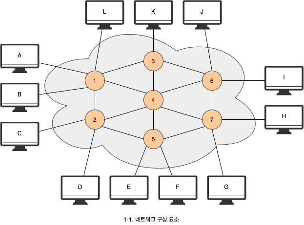
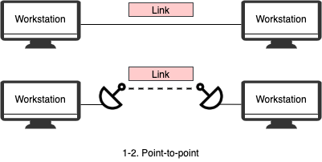
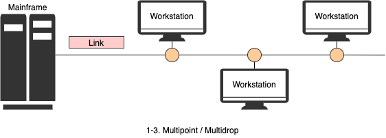
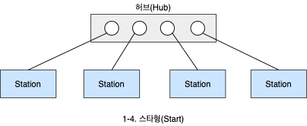
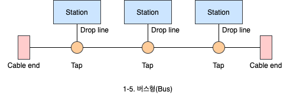
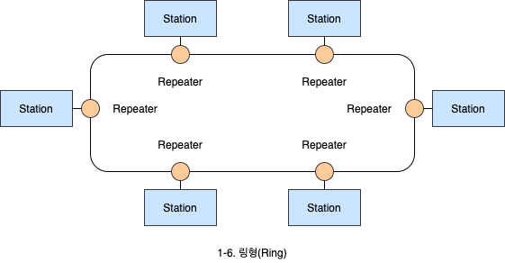
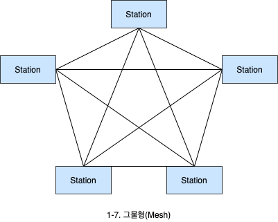
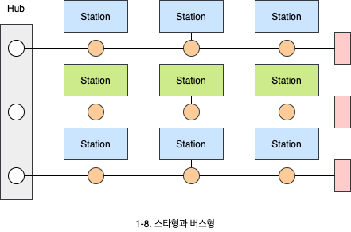

# 네트워크 구조와 종류

1. 네트워크 구성 요소
   - 네트워크 평가 기준과 링크의 연결 형태
2. 네트워크 구조
   - 네트워크 토폴로지와 분류

## 1. 네트워크 구성 요소

네트워크는 크게 **장치와 링크**로 구분합니다. 네트워크는 노드라고 불리는 장치들이 통신 링크로 연결된 **집합체**입니다.

1. **장치**: 네트워크 내부에 있는 장치와 네트워크에 붙어 있는 장치가 있습니다.
   - **종단 장치**: PC, 노트북, 스마트폰, 단말기 등
   - **노드**: 서버, 라우터, 스위치 등
2. **링크**: 통신 링크는 무선, 유선으로 나뉩니다.

### 1.1 네트워크 평가 기준

#### 1.1.1 성능(Performance)

네트워크에서 성능은 크게 처리량과 지연시간으로 구분합니다.

- **처리량**: 링크를 통해 전달되는 단위 시간당 데이터 양입니다. 많은 트래픽을 통과 시킬 수 있는, 즉 처리량이 많은 네트워크가 좋은 네트워크입니다.
- **지연시간**: 경유시간, 응답시간, 왕복시간이 짧은 네트워크가 좋은 네트워크입니다.
  - **경유시간**: 한 장치에서 다른 장치로 데이터가 전달되는데 걸리는 시간입니다.
  - **응답시간**: 요청과 이에 대한 응답에 소요된 시간입니다.
  - **왕복시간**(Round trip time, RTT): 출발지에서 목적지까지 갔다가 돌아오는데 걸리는 시간입니다.

#### 1.2.2 신뢰성(Reliability)

네트워크 신뢰성은 장애 빈도와 장애 발생 후 회복 시간, 재난에 대한 견고성 등으로 측정할 수 있습니다.

#### 1.2.3 보안성(Security)

불법적인 침입이나 정보 유출에 대한 보안을 확보해야 합니다.

### 1.3 링크의 연결 형태

링크는 데이터를 한 장치에서 다른 장치로 전달하는 통신 경로를 의미합니다. 연결 형태는 **일대일**(Point-to-point) 연결과 **멀티 포인트**(Multipint, Multidrop) 연결이 있습니다.

#### 1.3.1 일대일 연결

일대일 연결은 두 장치에만 사용되는 연결이 존재하는 것을 의미합니다.

#### 1.3.2 멀티 포인트 연결

멀티 포인트 연결은 하나의 링크를 여러 장치들이 **상호 공유**하는 연결형태를 의미합니다.

### 2.1 네트워크 구조

네트워크 **토폴로지**(Topology)란 네트워크의 구성 요소인 장치와 링크가 어떻게 배치되어 있는가를 의미합니다.

#### 2.1.1 스타형(Star)

허브라는 네트워크 연결장치로 케이블을 통해 컴퓨터를 일대일로 연결합니다. 허브를 중심으로 컴퓨터 배치 모양이 별과 같다하여 스타 토폴로지라고 합니다.

#### 2.1.2 버스형(Bus)

하나의 케이블에 여러 장치들이 멀티포인트 링크 형태로 연결되어 있습니다.

#### 2.1.3 링형(Ring)

장치들과 링크들이 링의 형태로 구성되어 있는 구조입니다.

#### 2.1.4 그물형(Mesh)

각 장치가 서로 상관없이 일대일 연결 링크로 연결되어 있는 구조입니다.

#### 2.1.5 실제 네트워크 토폴로지

스타형, 버스형, 링형, 그물형의 토폴로지들이 서로 유기적으로 연결되어 있는 형태입니다.

### 2.2 네트워크 분류

네트워크는 크기, 소유권, 구조 등에 의해서 분류합니다. 일반적으로 네트워크의 크기와 영역을 기준으로 LAN, MAN, WAN으로 구분합니다.

1. **LAN**(Local-area network): 한 사무실, 건물, 캠퍼스 등에서 장치들이 서로 연결되며 개인적으로 소유합니다.
2. **MAN**(Metropolitan-area network): 도시정도의 크기를 포함하는 규모를 갖고 있습니다.
3. **WAN**(Wide-area network): 지역적으로 넓은 범위에서 데이터를 전송하기 위해 구성합니다. 전국, 전세계 규모의 광법위한 네트워크로, 인터넷이 여기에 속합니다.
