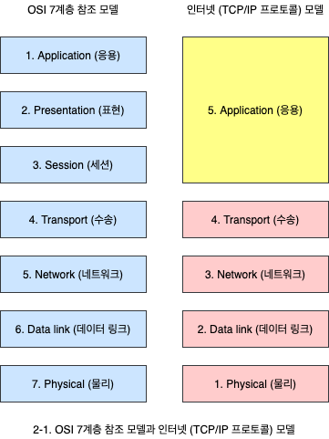
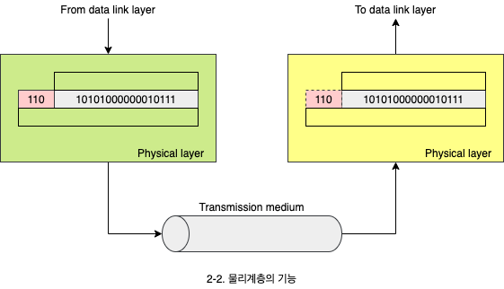
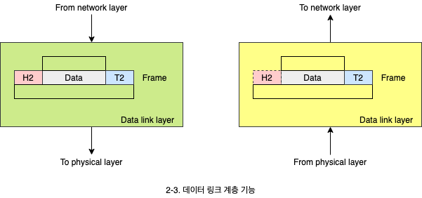
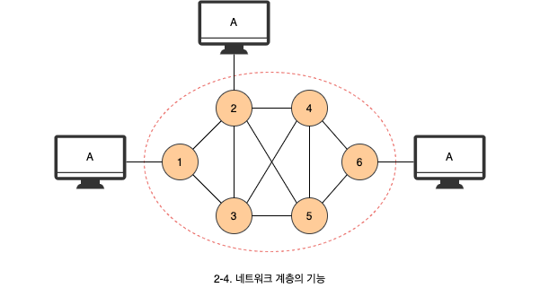
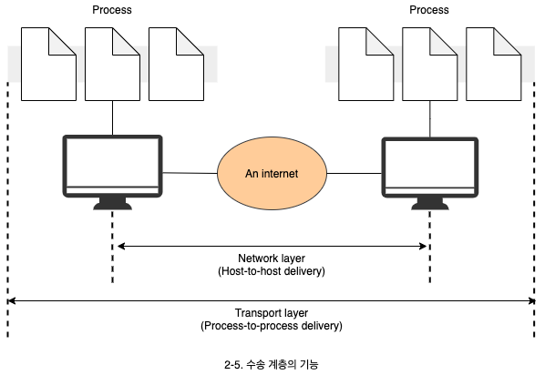
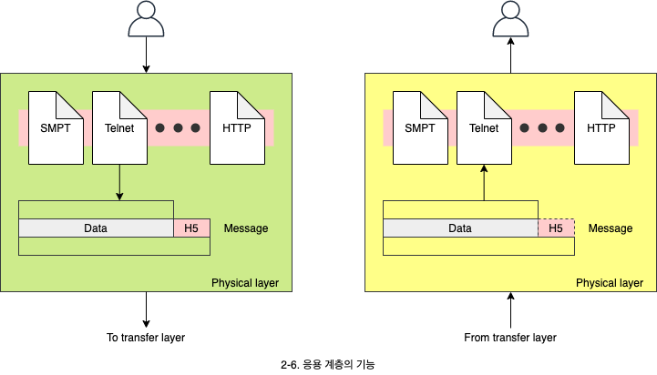

# 네트워크 모델과 표준 프로토콜

1. 계층화의 개념
2. 네트워크 모델
   - OSI 표준 모델과 인터넷 모델
3. 표준 프로토콜
   - 프로토콜의 의미와 표준화 기구

## 1. 계층화의 개념

계층화란 컴퓨터 사이의 대화를 계층으로 나누는 것 입니다. 특정 계층의 내용을 다른 것으로 바꿔도 다른 계층에 영향을 주지 않습니다. 특정 영역을 부품 갈아 끼우듯 교체가 가능합니다.

## 2. 네트워크 모델

1. **OSI 표준 모델**(Open system interconnection): 개방형 시스템을 서로 연결하는 모델입니다. 일곱 개의 계층으로 구성됩니다.
   - **개방형 시스템**: 표준 프로토콜에 따라 만든 시스템입니다. 서로 다른 기종의 두 컴퓨터간 연결이 가능합니다.
2. **TCP/IP**(인터넷): OSI 표준 모델보다 먼저 개발됐습니다. 다섯개의 계층으로 구성됩니다.

### 2.1 물리계층의 기능

1. 장치 연결 부분의 물리적인 특성을 명시합니다.
2. 비트의 전기적 혹은 광학적 표현을 명시합니다.
3. 데이터 속도, 비트의 동기화, 토폴로지, 전송모드, 선로 구성에 관한 사항을 명시합니다.

### 2.2 데이터 링크 계층의 기능

1. **에러 제어**: 비트에 대한 에러 검출하고 복구합니다.
2. **흐름 제어**: 장치의 수신 능력 이상으로 비트들이 유입되지 않도록 조절합니다.
3. **접근 제어**: 여러 장치들이 동일한 링크를 공유할 때 충돌이 발생하지 않도록 조정합니다.

### 2.3 네트워크 계층의 기능

1. 송신지에서 수신지로 데이터를 전달하는 계층입니다.
2. 송수신 주소를 명시하고 라우팅을 수행합니다.
   - **라우팅**: 패킷을 최종 목적이로 전달하는 경로를 설정합니다.

### 2.4 수송 계층의 기능

1. 프로세스간 데이터 수송신 기능
2. 송신지에서 보낸 전체 메시지가 온전하게 최종 목적지로 전달 되도록 합니다.
3. 연결 제어, 종단간 흐름 제어 및 에러 제어를 수행합니다.

#### 2.4.1 네트워크 계층과 수송 계층의 차이

네트워크 계층은 라우팅까지 책임지고, 그 안에 프로그램들은 수송 계층에서 담당합니다.

### 2.5 응용 계층의 기능

FTP, Telnet, SMTP, HTTP 등 다양한 네트워크 서비스가 존재합니다.

- **FTP**(File transfer protocol): 파일을 송수신하는 프로토콜입니다.
- **SMPT**(Simple mail transfer protocol): 전자 우편을 주고 받는 프로토콜입니다.
- **Telnet**: 원격지 접속 프로토콜입니다.
- **HTTP**(Hypertext transfer protocol): World Wide Web 서비스를 제공하는 프로토콜입니다.

## 3. 표준 프로토콜

프로토콜이란 데이터를 주고 받는데 이용하는 규칙의 집합을 의미합니다.

- **De jure 표준**: 의사소통이 가능하도록 임의로 만들어낸 프로토콜입니다.
- **De facto 표준:** 이미 많이 사용하고 있어 사실상 표준으로 채택된 프로토콜입니다.
- **표준화 기구**: SO, ITU-T, IEEE, EIA, ANSI 등
