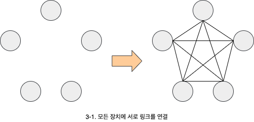
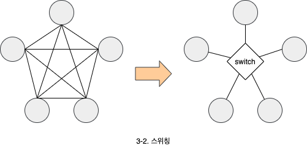
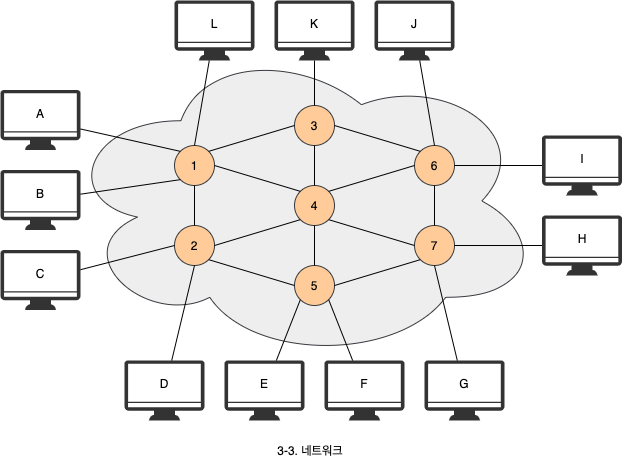
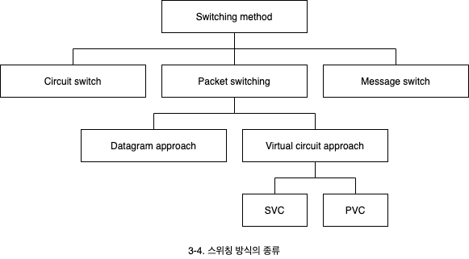
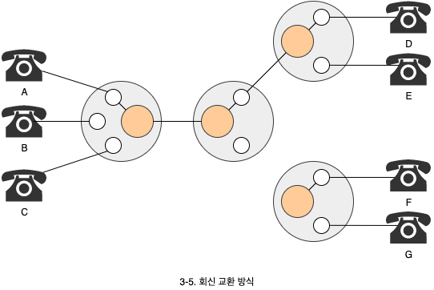
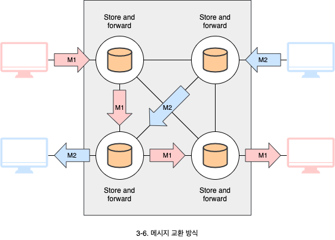
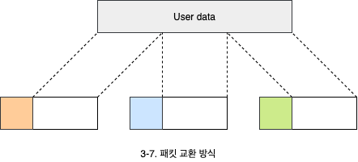

# 스위칭 방법과 종류

1. 스위칭의 필요성
2. 스위칭 방식의 종류
   - 회신 교환, 메시지 교환, 패킷 교환

## 1. 스위칭의 필요성

여러 개의 장치가 있는 경우, 서로 데이터를 주고 받게 하기 위해서는 선을 연결해야 합니다. 하지만 모든 장치에 서로 링크를 연결하는 것은 문제점이 있습니다.

1. 장치가 많아질수록 (큰 네트워크일수록) 링크가 많이 필요하여 비용이 많이 들어 현실적이지 못합니다.
2. 링크의 대다수는 유휴 시간이 많아서 효울이 떨어집니다.

따라서 **스위치**(Switch)라는 것을 두어 여러 장치들이 이 스위치에 연결되도록 구성하면 효율적입니다.

- **스위치**: 스위칭이 필요할 때마다 연결해 주는 장치입니다.
- **스위칭**: 그때그때 필요할 때마다 송신자와 수신자를 연결해주는 행위입니다.

스위치들이 연결되어 큰 규모의 너트워크를 만들 수 있습니다.

## 2. 스위칭 방식의 종류

스위칭 방식은 **회선 교환**(Circuit switching), **패킷 교환**(Packet switching), **메시지 교환**(Message switching) 방식으로 나뉩니다. 패킷 교환 방식은 **데이터 그램 방식**(Datagram approach)과 **가상회선 방식**(Virtual-curcuit approach)으로 다시 세분화 됩니다.

### 2.1 회선 교환 방식 (Circuit switching)

회선 교환은 두 장치 사이에 물리적인(논리적인) 선을 연결하는 방식입니다. 전화망(Public switched telephone network, PSTN)이 이 방식을 사용합니다.

- 회선이 연결되면, 데이터를 주고 받는 동안 계속 유지됩니다. 즉, 자원이 연결되어 있는 동안 계속 점유됩니다.
- 두 장치 사이에 고정된 속도를 갖습니다.
- 연결을 설정하는데 시간이 소요되고, 그 후에는 지연 시간이 없습니다.
- 데이터 전송이 많은 경우 유용합니다.

### 2.2 메시지 교환 방식 (Message switching)

전달한 메시지 전체를 한 번에 인접 노드에게 모두 보냅니다. 메시지를 수신한 노드는 다음 노드로 메시지를 전달합니다.

- Store and forwoard
- 유휴 링크는 다른 메시지 전송에 사용할 수 있어서 효율이 좋아집니다.
- 각 노드는 메시지를 저장할 공간을 확보하고 있어야 합니다.

### 2.3 패킷 교환 방식 (Packet switching)

전체 메시지를 각 노드가 수용할 수 있는 크기(패킷)로 잘라서 보내는 방식입니다.

- 트래픽의 특성이 집중적으로 한번씩 소규모로 발송되는 형태(Bursty)인 경우 회신 교환 방식은 적합하지 않습니다.
- 두 장치가 하나의 전송 속도를 갖지 않을 수 있습니다. 즉, 우선 순위 적용이 가능합니다.
- 회신 교환 방식은 링크에 문제가 발생하면 중간에 다른 링크를 선택할 수 없습니다. 하지만 패킷 교환 방식은 가능합니다.

#### 2.3.1 데이터그램 방식 (Datagram approach)

- 각 패킷이 서로 독립적으로 처리됩니다. 따라서 목적지에 순서와 상관없이 도착할 수 있습니다.
- 연결 설정 과정이 없습니다.
- 인터넷 프로토콜은 데이터그램 방식을 사용합니다.

#### 2.3.2 가상 회선 방식 (Virtual circuit approach)

- 데이터를 보내기 전에 연결 설정을 합니다.
- 모든 패킷들이 가상회선을 따라서 앞뒤의 순서를 갖고 전송됩니다. 즉, 동일한 경로로 순서대로 목적지까지 도착합니다.

##### 교환 가상 회선 (Switched virtual circuit)

- 회선 교환의 dial-up 방식과 유사합니다.
- 가상 회선이 필요할 때만 연결되는 것을 의미합니다.

##### 영구 가상 회선 (Permanent virtual circuit)

- 회선 교환의 전용선(Leased lines)과 유사합니다.
- 가상회선이 이미 연결설정 되어있어서 항상 데이터를 보낼 수 있는 상태를 유지하는 것을 의미합니다.
