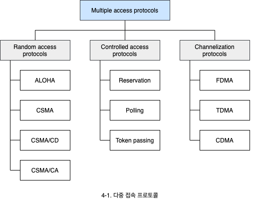
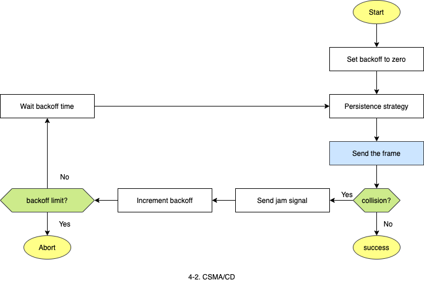
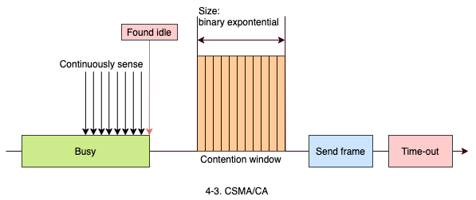

# 다중 접속 프로토콜

1. 다중 접속
2. 무작위 접근
3. 통제된 접근
4. 채널화

## 1. 다중 접속

다중 접속은 링크를 여러 장치들이 공유하는 환경에서 충돌 없이 데이터 전송을 시도하는 경우를 의미합니다. 여러 시스템이 공통의 링크에 연결된 경우 멀티 포인트 연결이라 하는데, 이때 발생하는 매체 접근 문제를 해결해야 합니다. 일반적으로 데이터 링크 계층에서 수행되며, 두 개의 부계층을 갖고 있습니다.

- **상위 부계층**: 데이터 링크를 제어합니다.
- **하위 부계층**: 공유 매체에 대한 접근 문제를 해결합니다.

## 2. 무작위 접근 방식

- 서로 대등한 관계의 통신입니다.
- 전송 시간을 정해두지 않습니다.
- 보낼 차례를 전하는 규칙이 없습니다. (경쟁)
- 충돌(Collision)이 생길 수 있습니다.

### 2.1 CSMA/CD (CSMA with collision detection)

- 단순 CSMA 방식은 충돌 발생에 대한 절차가 명시되어 있지 않습니다.
- 데이터를 전송한 시스템은 전송이 성공적으로 이루어지고 있는지 계속해서 매체를 감시합니다.
- 충돌이 감지(Coolision detection)되면 즉시 전송을 중단합니다.

- **Presistance strategy**: 누군가 데이터를 보내고 있을 때 대처법과 타이밍을 결정합니다.
- **Send jam signal**: 전송을 중단하고 충돌을 네트워크에 붙어있는 모든 시스템에게 알립니다.

### 2.2 CSMA/CA (CSMA with collision avoidance)

- CSMA/CD에서 충돌을 감지하는 방법은 충돌시 에너지가 두 배라 되기 때문에 가능합니다.
- 무선 네트워크의 충돌은 에너지 손실로 인해 충돌을 감지하기 어렵습니다.
- 충돌을 피하기 위해 CSMA/CA에서는 3가지 기법을 사용합니다.
  - **IFS**(Interframe space): 채널이 빈 경우라도 다른 시스템이 이미 데이터를 전송 중에 있을 수 있으므로 바로 보내지 않고 잠시 기다리는 기간을 의미합니다.
  - **충돌 윈도우**(Contention window): 데이터를 보내기 전에 기다려야 하는 시간(A random number of slots)을 의미합니다.
  - **ACK**(Acknowledgments): 데이터를 수신한 시스템이 보내는 응답을 의미하는데, ACK가 없는 경우 송신 시스템은 데이터가 유실되었다고 판단합니다.

## 3. 통제된 접근 (Controlled access)

누가 데이터를 전송할 수 있는지 정해주는 통제가 존재합니다.

1. **예약**(Reservation): 데이터 전송을 사전에 예약합니다.
2. **폴링**(Polling): 데이터 전송을 물어봅니다. (중재자가 물어봅니다)
3. **토큰 전달**(Token passing): 토큰을 가져야 전달 가능합니다.

## 4. 채널화 (Channelization)

링크를 시간, 주파수, 코드로 나누어서 여러개의 채널을 만들고 이들을 서로 다른 시스템이 이용하는 방법입니다.

1. **FDMA**(Frequency-division multiple access): 주파수를 나누어 채널을 사용합니다.
2. **TDMA**(Time-division multiple access): 시간을 나누어 채널을 사용합니다.
3. **CDMA**(Code-division multiple access): 코드를 나누어 채널을 사용합니다.
