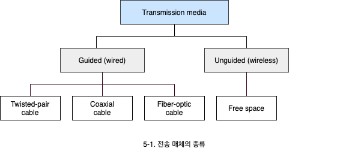
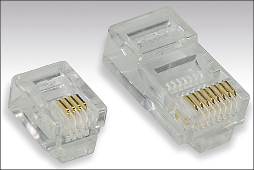
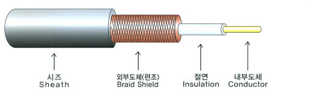
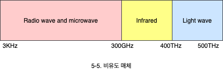

# LAN에서 사용하는 매체

1. 전송 매체의 종류
2. 유도 매체
3. 비유도 매체

## 1. 전송 매체의 종류

- 매체는 송신자와 수신자 사이에서 신호(에너지)를 전달하는 물질입니다.
- 네트워크에서도 전송자와 수신자 사이에 매체가 존재하며, 매체는 물리 계층과 연결되어 있습니다.
- 매체는 디지털, 아날로그 신호를 수용하여 전달합니다.

## 2. 유도 매체 (Guided media)

신호를 한 장치에서 다른 장치로 전달하는 관(Pipe)과 같은 역할을 하는 매체입니다.

### 2.1 꼬임선 (Twisted-pair Cable, TP)

- 두 개의 도체가 절연체로 감싸져 꼬인 것을 의미합니다.
- 신호는 두 개의 선(한 쌍)이 있어야 전달됩니다.
- 잡음의 영향을 균등하게 받기 위해 선이 꼬여있습니다.
- LAN 케이블(8 가닥, 4 Pair), 전화선 등에서 볼 수 있습니다.

#### 2.1.1 UTP (Unshileded twisted-pair)

- 가장 흔하게 사용되는 것으로 각 꼬임 쌍을 차폐시키지 않은 것입니다.
- UTP는 품질에 따라 여러 등급(Category)을 갖습니다. 숫자가 높을 수록 품질이 좋습니다.
- CAT3는 10Mbps 이내로, CAT5는 100Mbps 이내의 속도로 운영되도록 규정하고 있습니다. CAT5는 가장 많이 쓰이는 케이블입니다.

#### 2.1.2 STP (Shielded twisted pair)

- 각 꼬임 쌍을 외부 잡음의 침투를 막기 위해 차폐(Metal Shield)시킨 것을 의미합니다.
- 안정적 통신의 서버 및 Gbps를 사용할 때 쓰입니다.

#### 2.1.3 꼬임선의 케이블

RJ45(RJ standards for registered jack) 커넥터가 많이 사용됩니다.

### 2.2 동축 케이블 (Coaxial cable)

- TV와 비디오 등을 연결하는 케이블로 TP 케이블보다 주파수 영역이 넓어 고속 전송이 가능합니다.
- 신호의 감쇄가 심해서 많이 이용되지 않습니다. 심호의 감새란 매체를 타고 이동하면서 신호가 약해지는 것을 의미합니다.
- 구리선(내외부 도체), 절연체(도체 사이), 비닐 피복(외부)로 구성됩니다.

#### 2.2.1 동축 케이블의 커넥터

- **BNC T 커넥터**: T자형 커넥터
- **DB15 커넥터**: 랜카드에 연결된 커넥터

### 2.3 광 케이블 (Fiber-optic cable)

- 광 케이블은 유리나 플라스틱으로 만들어진 것으로 빛 신호를 전달하는데 사용합니다.
- 열이 없고, 대역폭이 넓어 고속 전송이 가능합니다. 매체 중 가장 고속으로 전송합니다.
- 해저 케이블, 유선 통신 등 많은 영역에서 다양하게 사용됩니다.
- 빛 신호가 코어(Core)를 따라 클래딩(Cladding)에 반사되며 보내집니다.

#### 2.3.1 광 케이블 커넥터

- SC connector
- ST connector
- MY-RJ connector

## 3. 비유도 매체 (Unsigned media)

물리적 도체 없이 신호를 전달하는 매체를 의미합니다.

- **라디오파**: 3KHz ~ 1GHz, 단방향성 입니다.
- **마이크로파**: 1GHz ~ 3000GHz, 단방향성 입니다.

