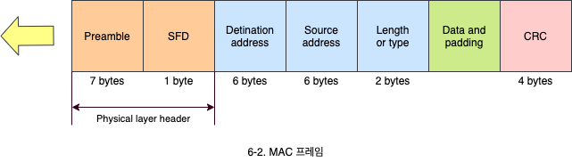
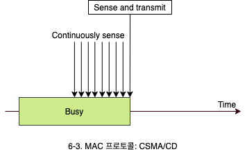
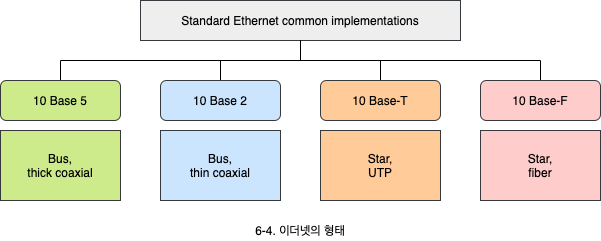
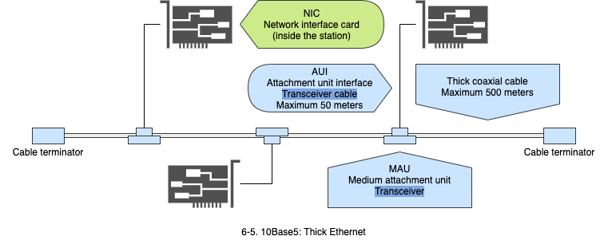
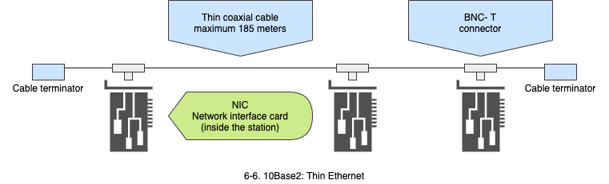
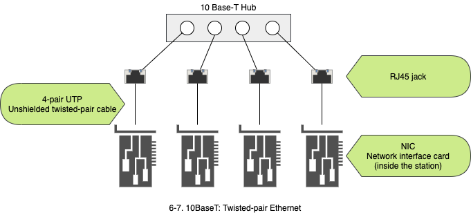
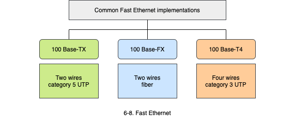
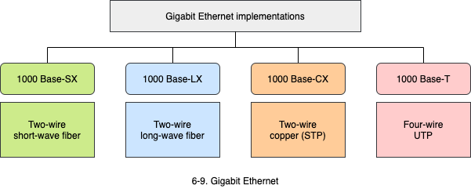

# 유선 LAN: Ethernet

1. IEEE 표준 프로토콜
   - 계층화 구조와 위킹 그룹
2. 이더넷
   - 프레임 구조, 주소 지정, 프로토콜, 개발된 형태
3. Fast 이더넷
4. Gigabit 이더넷

## 1. IEEE 표준 프로토콜

- 미국 Xerox사 팔로알토 연구소의 로버트 멧칼프가 1973년에 이더넷을 발명했습니다.
- 초기에 Digital Equipment, Intel, Xerox 3사(DIX)는 이더넷을 표준으로 제안했으며, 미국 표준 기구인 IEEE에서 표준으로 정했습니다. 이어서 국제표준화 기구인 ISO에서 국제 표준으로 채택했습니다.
- 이더넷은 LLC(Logical link control)와 MAC(Media access control)으로 구성된 2개의 부계층을 갖고 있습니다.

### 1.1 MAC 계층

매체의 특성, 운용 방시에 따라 여러개의 프로토콜이 존재합니다. (Ethernet, Token ring, Token bus)

### 1.2 LLC 계층

- 매체의 특성과 관계없이 공통적으로 사용하는 부분으로, 모든 LAN에서 공통의 계층입니다.
- LAN에서 흐름 제어, 에러 제어 등 각종 제어에 대한 행위를 수행합니다.

### 1.3 IEEE

- 미국 표준 기관입니다. 학술활동 뿐 아니라 LAN의 표준을 만듭니다.
- LAN 표준별 위원회를 따로 둡니다. 802 위원회 산하에 세부 위원회가 존재합니다.
  - **IEEE의 802.3**: Ethernet의 CSMA/CD 프로토콜 담당
  - **IEEE의 802.2**: LCC 담당

| Working Group | Subject                    | Working Group | Subject                                 |
| :-----------: | -------------------------- | :-----------: | --------------------------------------- |
|     802.1     | High Level Layer Protocols |     802.6     | Metropolitan Area Network (DQDB)        |
|    802.1Q     | Virtual LANs               |    802.11     | Wireless LAN                            |
|     802.2     | Logical Link Control       |    802.11a    | An extension to 8702.11                 |
|     802.3     | CSMA/CD                    |    802.11b    | 11Mbps in the 2.4GHz band               |
|    802.3u     | Fast Ethernet              |    802.11g    | 6 to 54Mbps in the 2.4GHz band          |
|    802.3z     | Gigabit Ethernet           |    802.11n    | 300Mbps / 600Mbps                       |
|    802.3ad    | Link aggregation           |    802.15     | Wireless Personal Area Network (WPAN)   |
|    802.3ae    | 10Gbps Ethernet            |   802.15.1    | Bluetooth                               |
|    802.3af    | Power over Ethernet(PoE)   |    802.5.4    | ZigBee                                  |
|    802.3ba    | 40Gbps and 100Gbps         |    802.16     | Broadband Wireless Access               |
|     802.4     | Token Bus                  |    802.20     | Mobile Broadband Wirelss Access (Wibro) |
|     802.5     | Toekn Ring                 |               |                                         |

## 2. Ethernet

초기 이더넷은 10Mbps를 제공하였고 그 후 Fast Ethernet(100Mbps), Gigabit Ethernet(1Gbps) 그리고 Ten-Gigabit Ethernet(10Gbps)으로 발전했습니다.

### 2.1 MAC 프레임

이더넷 프레임은 7개의 필드로 구성되어 있습니다. Preamble과 SFD(Start fram delimiter) 필드를 제외하는 경우도 있습니다. Preamble과 SFD는 준비되지 않은 상황에서 앞부분의 유실없이 데이터를 받기위해 물리 계층에서 임의로 첨가하는 비트이기 때문입니다.

- **Preamble 필드**: 프레임이 곧 도착하니 준비하라는 의미 (7바이트)
- **SFD 필드**(Start fram delemiter): 프레임의 시작을 알림 (1바이트)
- **DA 필드**: 목적지 주소 (2바이트)
- **length/type 필드**: 데이터 필드 길이, 네트워크 계층 프로토콜 명시 (2바이트)
- **Data 필드**: 최소 46바이트에서 최대 1500바이트까지 가능
- **CRC 필드**: 에러를 검출하는 기능을 수행합 (4바이트)

### 2.2 주소 지정

- 각 시스템은 **NIC**(Network Interface card)라는 것을 갖고 있습니다. LAN 카드라고도 불립니다.
- LAN 카드에는 주소가 설정되어 있는데, 이를 MAC 주소, Ethernet 주소, 또는 하드웨어 주소라고 합니다.
  - 6바이트로 이루어져 있으며 보통 16진수로 표기합니다.
  - 브로드캐스트 주소는 모든 비트가 1인 `ff-ff-ff-ff-ff-ff`로 구성됩니다.

### 2.3 MAC 프로토콜: CSMA/CD

이더넷은 1-persistent CSMA/CD를 사용합니다. 1-persistent CSMA/CD는 다른 데이터 전송을 기다렸다가, 끊기면 즉시 보내는 방식이며, 유선 LAN에서 사용합니다.

### 2.4 이더넷의 형태

기본이 10Mbps이며, 사용 매체에 따라 여러 종류로 나뉩니다.

#### 2.4.1 10Base5: Thick Ethernet

10 Base 5는 처음에 만들어진 이더넷으로 Thick Ethernet 또는 Thick Net으로 불렸습니다.

- 동축 케이블을 여러 시스템들이 공유 매체로 사용하는 LAN입니다.
- 10Mbps의 속도, 베이스밴드 신호 방식, 한 세그먼트(최대 길이)가 500M에 달합니다. (`10` `Base` `5`)
  - **베이스밴드 신호 방식**: 디지털 신호 형태로 전송하는 방식이며 TP나 동축 케이블에 적용됩니다.
- NIC(Network interface card)에서 나오는 케이블을 동축 케이블에 연결해 사용합니다.

#### 2.4.2 10Base2: Thin Ethernet

두번째 개발된 형태는 10Base2로, Thne Ethernet 또는 Cheaper Net이라고 불렸습니다.

- 동축 케이블을 여러 시스템들이 사용하는 LAN입니다. 단, 두께가 10Base5보다 얇습니다.
- 10Mbps의 속도, 베이스밴드 신호 방식, 한 세그먼트가 200m(실제 185m)에 달합니다.

#### 2.4.3 10BaseT: Twisted-pair Ethernet

- 10Mbps의 속도, 베이스밴드 신호 방식, Twisted pair cable을 이용합니다.
- 허브는 LAN에서 많이 사용되는 네트워크 장비이며, 보통 포트 수에 따라서 16포트 허브, 24포트 허브 등으로 불립니다.

#### 2.4.4 10BaseF: Fiber Ethernet

시스템과 허브를 연결하는 케이블로서 광 케이블을 이용합니다.

## 3. Fast Ethernet

- 기존 이더넷보다 10배 빠른 것으로 100Mbps를 제공합니다.
- Fast Ethernet은 기존 이더넷과 호환됩니다.
  - 프레임 형태, 최소/최대 프레임 크기, 주소 지정, CSMA/CD 사용 등이 모두 동일합니다.
  - 버스 토폴로지를 사용하지 않고 스타형 토폴로지만을 사용합니다.
- **자동 협상**(Autonegotiation) 기능이 있어서 속도 등을 조정할 수 있습니다.

## 4. Gigabit Ethernet

- Fast Ethernet보다 10배 빠른 것으로 1Gbps를 제공합니다.
- 이전 시스템과 호환됩니다.

### 4.1 Ten-Gigabit Ethernet

10Gbps 속도로 상향되었으나, 기존 시스템과 호환되도록 설계되었습니다.
