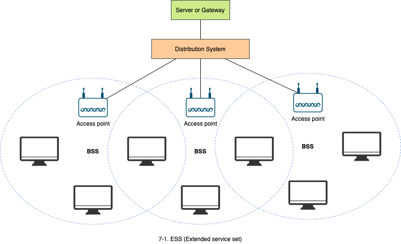
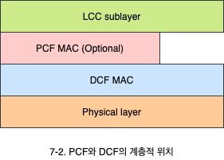
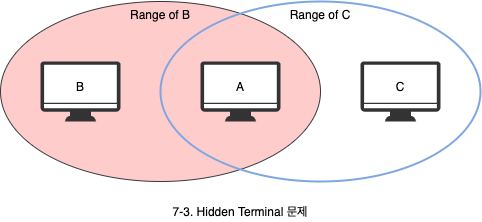
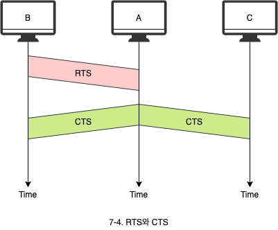
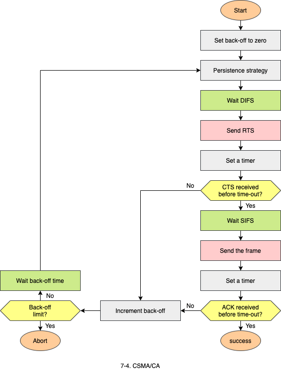

# 무선 LAN

1. 무선 LAN 구조
   - Infrastructure 모드와 Ad hoc 모두
2. MAC 부계층
   - DCF와 PCF의 기능과 동작
3. Bluetooth
   - 기능과 링크의 종류

## 1. 무선 LAN 구조

- 무선 LAN은 BSS와 ESS라는 두 종류의 서비스를 지원합니다.
- **BSS**(Basice service set): 무선랜을 사용하는 기본 영역의 단위입니다. 하나의 AP 내에서의 서비스를 의미하며, 2개의 모드가 존재합니다.
  - **Infrastructure 모드**: AP(Acess Point)라는 중앙의 기지국을 이용하는 모드입니다. AP를 유무선 공유기라고 부리기도 합니다.
  - **Ad hoc 모드**: AP가 없는 모드입니다.
- **ESS**(Extended Service): AP를 갖는 여러 BSS로 구성된 서비스를 의미합니다.

## 2. MAC 부계층

무선 LAN 표준인 IEEE 802.11에서는 2개의 MAC 부계층을 정의하고 있습니다.

- **DCF**(Distributed coordination function): PCF는 선택사항으로, 복잡한 접근제어를 수행하며 Infrastructure 모드에서만 운용이 가능합니다. 즉 Ad hoc 모드에서는 안됩니다.
  - 제어를 통한 경쟁(Contention)이 발생하지 않습니다.
- **PCF**(Point coordination function): CSMA/CA와 유사합니다.

### 2.1 DCF (Distributed coordination function)

#### 2.1.1 무선랜에서 CSMA/CD를 사용하지 못하는 이유

- 숨겨진 단말기를 문제로 충돌을 인지하지 못합니다.
- 신호가 약해져서 다른 컴퓨터에서 발생한 충돌을 감지하지 못할 수 있습니다.

#### 2.1.2 숨겨진 단말기 문제 (Hidden Terminal Problem)

- B가 A로 데이터를 보낼 때, C는 이 신호를 들을 수 없습니다. 따라서, C는 A로 데이터를 보내게 됩니다. 그 결과 A에서 충돌이 발생합니다.
  - B와 C는 A에 대해 서로 숨겨져있습니다.
- 숨겨진 단말기 문제는 충돌 가능성을 올리기 때문에 무선 LAN의 효율을 떨어뜨립니다.
  - 신호가 잡히지 않는다고 매체가 유휴(Idle)하다고 확신할 수 없습니다.
- 이 문제를 해결하기 위해 **RTS**(Request to send)와 **OTS**(Clear to send)를 주고받는 과정이 필요합니다.

- C는 A가 보내는 CTS를 통해서 자신이 모르는 위치에 시스템(Hidden terminal)이 있다는 것을 알 수 있습니다.
- 데이터를 보내기 전에 RTS를 보내고 CTS로 확인해 충돌을 회피합니다.
- 같은 속도라도 유선이 더 효율적입니다.

### 2.2 PCF (Point coordination function)

- PCF는 선택사항으로 Infrastructure 네트워크에서만 운용이 가능합니다.
- 보통 **시간에 민감한 전송**(Time intensive transmission)을 하고자 할 떄 사용합니다.
- 중앙 집중식으로 충돌이 발생하지 않도록 폴링 방법을 사용합니다.
  - 무선 LAN의 컴퓨터들이 AP에 의해 하나씩 차례로 폴링되며, 이때 AP로 데이터를 전송할 수 있습니다.

## 3. Bluetooth

- Bluetooth는 서로 다른 기능을 하는 기기들이 서로 연결할 수 있도록 고안된 무선 LAN 기술입니다.
- Bluethooth Lan은 Ad hoc 네트워크 입니다.
  - 네트워크가 즉시 만들어지며, 이러한 네트워크를 piconet이라 합니다.
- IEEE 802.15 표준은 **WPAN**(Wireless personal-area network)을 정의하고 있습니다.

### 3.1 Piconet

Piconet은 8개의 시스템으로 구성되며, 하나는 **마스터**(Primary)가 되고 나머지는 **종속 시스템**(Secondaries 또는 Salves)이 됩니다.

### 3.2 링크의 종류

마스터와 종속 시스템 사이에 2가지 형태의 링크가 존재합니다.

- **CSO**(Synchronous connection-oriented): 실시간 음성과 같이 자연의 에너지보다 중요한 경웨 사용합니다.
- **ACL**(Asynchronous connectionless link): 데이터 에러가 발생하지 않도록 무결성이 중요한 경우 사용됩니다.
