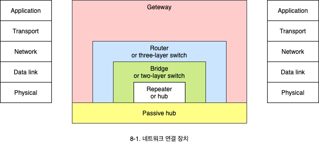
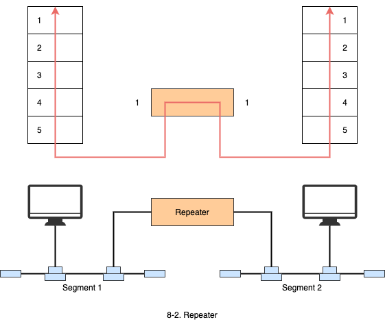
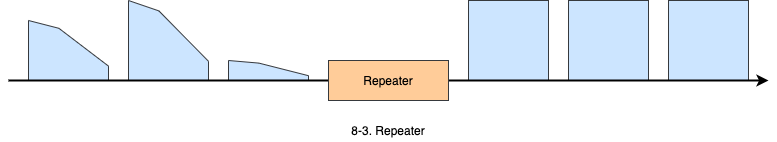
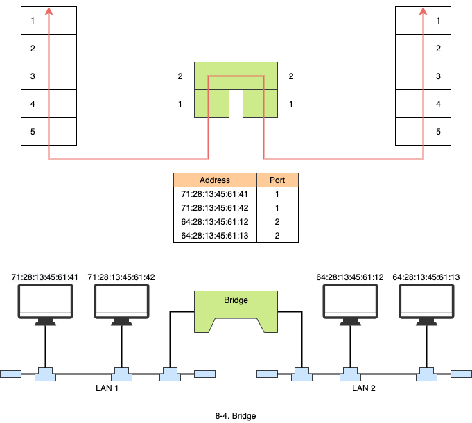
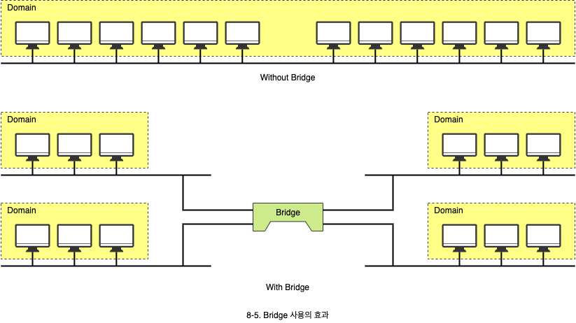
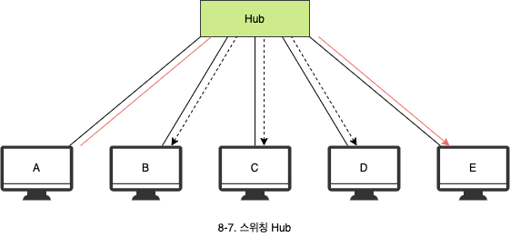
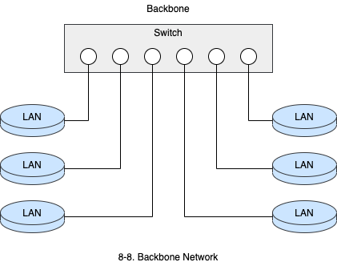
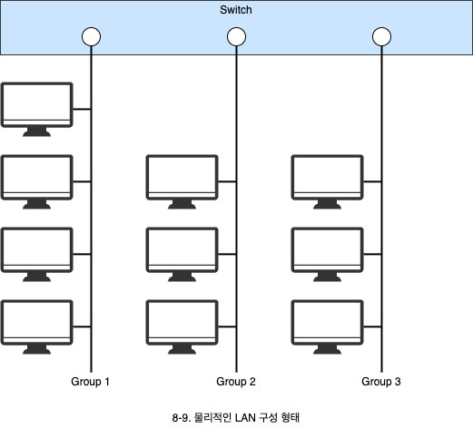
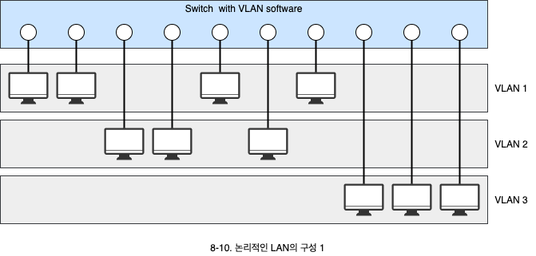
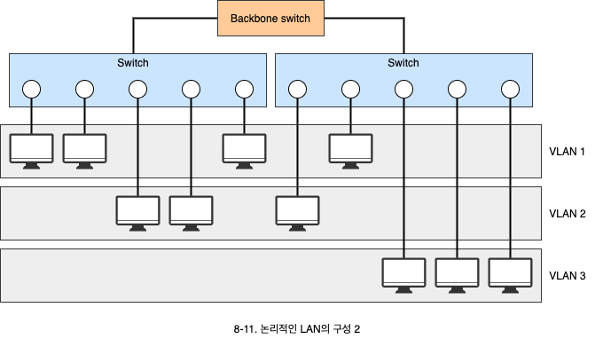

# 네트워크 연결 장치

1. 네트워크 연결장치
   - 네트워크로 연결장치와 계층 구조와의 관계
2. 백본 네트워크
   - 백본 네트워크 의미와 구성
3. 가상 LAN
   - 가상 LAN 의미와 장점

## 1. 네트워크 연결장치

- 어떤 계층에서 연결하는가에 따라서 4가지 종류가 존재하며, 그에 따라 장치들이 하는 역할과 기능, 의미가 완전히 달라집니다.
- 네트워크 연결 장치는 네트워크를 설계 또는 분석할 때 가장 중요한 역할을 합니다.

### 1.1 Repeater

- 물리 계층에서 네트워크를 연결해주는 장치로 **재생 중계기**라고도 불립니다.
- 리피터는 서로 다른 프로토콜을 사용하는 LAN을 연결하지는 못합니다.

- 리피터는 미약해진 신호를 받아서 원래 비트 형태로 재생산 해줍니다.
- **증폭기**(Amplifier)는 잡음 신호도 같이 증폭시킬 수 있지만, 리피터는 들어온 신호만큼만 깨끗하게 내보냅니다.
- 리피터는 애매한 신호의 경우 원래의 신호를 구분하지 못합니다. 즉, 에러를 검출해 내는 기능이 없습니다.
- 허브는 실제로 리피터 기능을 수행합니다.

### 1.2 Bridge

- 브리지는 물리계층과 데이터 링크 계층에서 동작합니다.
  - 최근에는 **L2 스위치**로 불리는 Hub들이 있습니다.
  - Layer 2까지 제공하는 허브를 L2 스위치라고 합니다.
- 브리지는 **필터링**(Filtering) 기능을 갖고 있습니다.
  - 목적지 주소를 검색해서 프레임을 전달할 포트를 결정할 수 있습니다.
  - 브리지는 포트와 MAC 주소를 서로 매핑시킨 테이블을 갖고 있습니다.

- 브리지는 LAN을 분리시켜 줍니다.
- 브리지는 대역폭 상승효과를 주고, 충돌 도메인(Collision domain)을 분리시켜 줍니다.

#### 1.2.1 대역폭 상승 효과

- 브릿지를 사용하지 않는 Ethernet에서는 전체 대역폭을 모든 시스템들이 공유합니다.
- 브릿지를 효과적으로 사용하면, 사용하지 않는 다른 쪽에 트래픽을 넘기지 않으므로 대역폭을 상승시키는 효과를 줍니다.

#### 1.2.2 충돌 도메인 분리

- 한 세그먼트에 2개 이상의 장비가 동시에 통신을 시도할 때 충돌이 발생하는데, 이 충돌한 프레임이 전파되어 영향을 받게되는 영역을 충돌 도메인이라고 합니다.
- 브리지를 쓰면 충돌 도메인이 작아져서 충돌 확률이 적어집니다.

### 1.3 Router

- 라우팅을 전문적으로 처리 해주는 장치입니다.
  - **라우팅**: 송신지에서 수신자에 이르는 여러가지의 경로 중에 어느 한 경로를 선택하는 과정입니다.
- 라우터는 IP 주소를 기반으로 패킷을 전달하는 3계층 장치입니다.
- 라우터는 통상 LAN이나 WAN 등 네트워크를 연결하는 장치입니다.
  - LAN 화경에서는 하드웨어 구현에 따른 고속 패킷 처리가 가능한 **L3 스위치**가 많이 사용됩니다.
  - Layer 3까지 제공하는 허브를 L3 스위치라고 합니다.

#### 1.3.1 스위칭 Hub

- 일반 허브는 수신한 메시지를 모든 포트로 전송합니다.
- 스위칭 허브는 목적지 주소를 인식하여 해당 포트로만 메시지를 전달합니다.
- Layer 2까지 지원하면 L2 스위치, Layer 3까지 지원하면 L3 스위치라고 합니다.

### 1.5 Gateway

- 게이트웨이는 사용하는 프로토콜 스택이 다른 시스템이나 네트워크를 연결하는데 사용합니다.
  - Internet의 5계층이나, OSI 모델의 7계층에서 동작합니다.
  - **L7 Switch**라고도 불립니다.
- 게이트웨이는 계층 구조에 따라 해석된 메시지를 다른 계층 구조로 전달합니다.

## 2. Backbon network

- 백본 네트워크는 여러 네트워크를 연결하는데 사용되는 네트워크를 의미합니다.
- 허브를 사용하면 스타 백본, Collaped backbone 이라고 합니다.

## 3. Virtual LAN

가상 LAN은 물리적인 연결과 상관없이 논리적인 구성에 따라서 LAN을 구성할 수 있는 형태를 의미합니다.

### 3.1 물리적인 LAN 구성 형태

### 3.2 논리적인 LAN 구성 형태

