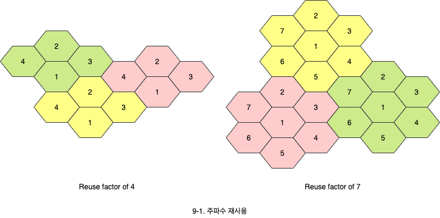

# 이동전화와 위성 네트워크

1. 이동전화
   - 이동전화 서비스 구조와 4G에 이르는 세대별 진화
2. 위성 네트워크
   - 궤도의 위치에 따른 분류와 특징

## 1. 이동전화

- 각 이동전화 서비스 영역은 **Cell**이라 불리는 작은 영역으로 나위어져 있습니다. 각 셀은 **기지국**(Base station)으로 제어됩니다.
- 각 기지국은 **MSC**(Mobile switching center)로 제어됩니다. MSC는 기지국과 전화국 사이에 통신을 조정합니다.
  - 전화연결, 요근 관련 처리 등

### 1.1 주파수 재사용

셀에서 신호의 출력을 조절하게되면 동일 주파수를 재사용할 수 있습니다.

### 1.2 Handoff

이동전화가 한 셀에서 다른 셀로 이동하는 것을 말합니다. 이때, 신호가 한 셀에서 약해지게 되며, MSC는 통신하기 적절한 다른 셀을 찾습니다.

- **Hard handoff**: 이전 기지국과의 통신을 우선 단절하고 새로운 기지국과의 연결을 시도합니다.
- **Safe handoff**: 이전 기지국과의 통신을 단절하기 전에 새로운 기지국과의 연결을 시도합니다. 이동 단말이 동시에 두 기지국과 연결을 합니다.

### 1.3 First Generation

1세대는 아날로그 신호를 사용한 음성 통신을 위해 설계되었습니다.

- 보내는 주파수와 받는 주파수를 정해놓고 기지국을 통해 아날로그로 서로 주고 받는 형태입니다.
- **AMPS**(Advanced mobile phone system)
  - FOMA를 사용하여 각 채널당 주파수를 단말에 할당합니다.
  - AMPS는 800MHz 주파수 밴드에서 동작합니다.
  - **순방향**(Base station to mobile station) 채널과 **역방향**(Mobile station to base station) 채널 등 2개의 아날로그 채널을 사용합니다.

### 1.4 Second Generation

2세대는 주로 디지털화된 음성신호를 위해 섫계되었습니다.

- **GSM**(Global system for mobile communication)은 유럽 표준입니다. 다양한 1세대 이동전화를 대체하기 위해 개발됬습니다.
- **CDMA**(Code division multiple access)를 사용하면서 **GPS**(Global positioning system)를 사용하고, **SMS**(Short message service)를 사용하게 되었으며, 인터넷 사용이 가능하게 되었습니다.

### 1.5 Third Generation

3세대는 디지털 데이터와 음성 통신을 위해 설계되었습니다.

- 음성 품질이 기존 전화망에 견줄만하게 되었습니다.
- 데이터 전송 속도가 2Mbps까지 빨라졌습니다.
- 인터넷 접속이 원활해졌습니다.
- CDMA에서 확장한 Wideband CDMA와 북미 표준인 CDMA 2000이 나타났습니다.

## 2. 위성 네트워크

- 인공위성을 이용한 통신 형태를 말하며, 지구를 도는 궤도의 위치에 따라서 GEO, MEO, LEO 3가지로 구분됩니다.
  - **GEO**(Geosynchronous earth orbit)는 가장 지구에서 멀리 위치하고, **MEO**(Medium-earth orbit), **LEO**(Low-earth orbit) 순으로 가까이 위치합니다.
- 이렇게 위치가 다른 것은 2개의 Van Allen 벨트 때문입니다.
  - Van Allen 벨트는 하전 입자를 갖는 계층을 의미합니다.
  - 이 벨트에 인공위성이 위치하면 하전 입자에 의해 파괴될 수 있습니다.

### 2.1 Geo statelites

- 정지 궤도라고도 불리는 위성으로 지구의 자전속도와 동일하게 움직입니다.
  - 북극에서 봤을 때, 각 위성이 120도 차이로 존재합니다.

### 2.2 MEO statelites

- 2개의 Van Allen 벨트 사이에 위치합니다.
- 6~8 시간에 한번씩 지구를 돌며, **GPS**(Global positioning system)로 주로 사용됩니다.
  - 8개의 궤도로 24개의 위성이 돌고 있습니다.
- GPS에서는 4개의 위성으로부터 정보를 받아야 위치 계산이 가능합니다.
  - 평면에서는 3개의 점으로부터 거리를 알면 위치 추적이 가능하나, 공간에서는 4개가 필요합니다.

### 2.3 LEO statelites

- 지구와 가낭 가까이 인접해 있기 때문에 전파 지연이 적어서 음성 통신에 주로 사용합니다.
  - 왕복 저뉴ㅏ 시간이 20ms 이내입니다.
- 90~120분에 한번 씩 지구를 돕니다.
