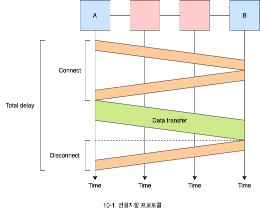
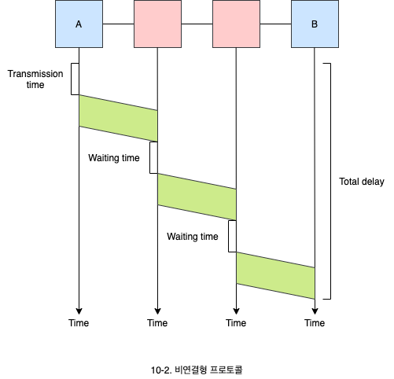
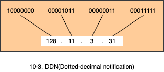
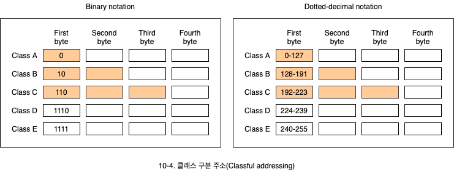
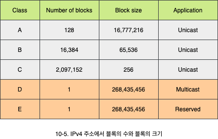
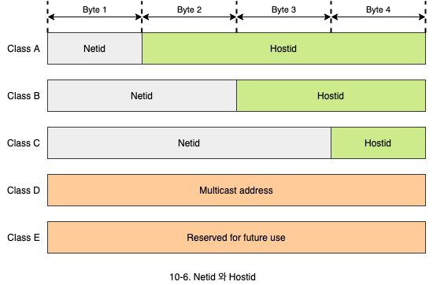

# 네트워크 프로토콜과 주소 지정

1. 네트워크 프로토콜
   - 연결 지향과 비연결 지향 프로토콜의 속성과 특징
2. IP 주소
   - IP 주소의 의미와 클래스 별 구조

## 1. 네트워크 프로토콜

- 네트워크 프로토콜의 핵심적인 기능은 송신지에서 목적지까지 패킷을 전달하는 라우팅에 있습니다.
- 네트워크 프로토콜은 **연결 지향**(Connection-oriented) 프로토콜과 **비연결형**(Connectionless) 프로토콜로 구분됩니다.
- 연결 지향 프로토콜은 데이터를 전송하기 전에 반드시 연결 설정을 해야하며, 비연결형 프로토콜은 연결 설정 과정 없이 데이터 전송만이 존재합니다.

### 1.1 연결 지향 프로토콜

- **연결 설정**(Connection settup, Connection establishment, Call settup), **데이터 전송**, **연결 해제**(Dissconnect, Connection clear, Call clear)의 3단계를 거칩니다.
- 목적지 시스템의 파워가 꺼져있으면 연결이 되지 않아 데이터 전송이 불가능합니다.

- 연결 설정 단계에서 자원을 할당하게 됩니다. 즉, 연결을 설정할 때 라우팅합니다.
  - 자원을 연결하는 동안 계속 할당되어 있습니다.
  - 따라서, 다른 연결에 자원이 사용되지 못합니다.
  - 미리 자원이 할당되어 있어 지연시간이 최소화됩니다.
- 모든 패킷들이 동일한 경로로 전달됩니다.
  - 패킷들이 순서대로 전달됩니다.
  - 패킷들의 관계가 유지됩니다.

### 1.2 비연결형 포로토콜

- 연결 설정 과정이 존재하지 않습니다.
  - 네트워크 장치들이 연결 상태에 대한 정보를 보유하지 않습니다.
  - 연결형 프로토콜에 비해 지연이 있을 수 있습니다.
- 목적지 시스템의 파워가 꺼져있어도 데이터 전송이 가능합니다.

- 각 패킷들이 서로 독립적으로 처리됩니다.
  - 각 패킷마다 경유하는 경로가 다를 수 있습니다.
  - 그러다보니 지연 시간이 일정하지 않을 수 있습니다.
- 데이터들이 목적지에 순서대로 도착하지 않을 수 있습니다.
  - 비연결형 프로토콜을 사용하는 경우 데이터그램 네트워크라고도 합니다.
  - 인터넷은 데이터그램 방식을 사용합니다.
  - IP는 비연결형 프로토콜을 사용하지만, TCP가 순서대로 데이터를 정리합니다.

## 2. IP 주소

- 네트워크에서는 연결된 시스템을 식별하기 위해 네트워크 주소가 필요합니다.
  - 네트워크 주소를 통해 송신자와 수신자를 구별할 수 있습니다.
- 인터넷 프로토콜인 IP는 인터넷에 연결된 장치를 유일하게 구분하기 위해 32비트 주소를 사용합니다.
  - 이를 IP 주소라 합니다.
  - IP 주소가 없으면 패킷을 보낼 수 없습니다. 인터넷에서 IP 주소는 중복될 수 없습니다.
- IP 주소를 할당하기 위한 국내 기관은 한국인터넷진흥원입니다.
  - KISA(Korea internet & security agency)
- IP 주소는 연결 주소입니다.
  - 시스템의 연결 당 하나씩 할당되는 주소입니다.
- IP 주소는 **DDN**(Dotted-decimal notation)으로 표기됩니다.

### 2.1 클래스 구분 주소

- 클래스 구분 주소(Classful addressing)에서는 IP 주소가 A, B, C, D, E 5개의 클래스로 구분됩니다.
  - 첫번째 바이트만 보면 클래스 확인이 가능합니다.

- 클래스에 따라서 네트워크 부분과 호스트 부분을 구분합니다.
  - 클래스 A는 규모가 큰 네트워크, 클래스 C는 규모가 작은 네트워크입니다.

- 네트워크 식별자인 **Netid**는 네트워크마다 할당되어 각 네트워크를 구분하는데 사용됩니다.
- 호스트 식별자인 **hostid**는 시스템마다 할당되어 네트워크 내의 호스트를 구분하는데 사용됩니다.

### 2.2 할당되지 않는 IP 주소

IP 주소 중에는 특별한 용도로 사용되는 주소들이 있어서, 이들은 시스템에 할당되지 않습니다.

- 브로드 캐스트 주소는 `netid.255.255.255`와 같이 hostid 부분이 모두 `1`인 주소입니다.
  - **브로드 캐스트**: 데이터를 동시에 네트워크 내부 모든 시스템에게 전송합니다.
- `netid.0`과 같이 hostid가 `0`인 주소는 해당 네트워크를 의미하므로 특정 시스템에 할당하지 않습니다.
- netid가 `127`인 경우 loopback을 의미하며 특정 시스템에 할당하지 않습니다.

