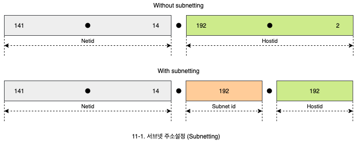
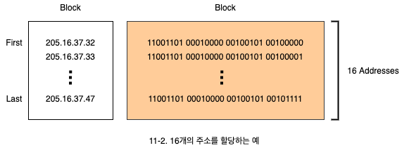

# 서브넷, 슈퍼넷, 가변길이 주소 지정

- 서브넷 주소 지정
  - 실제 기관 네트워크에서의 필요성
  - 마스크의 의미와 표기
- 슈퍼넷 주소 설정
  - 주소 고갈에 따른 대표 C 클래스 주소 설정 방법
  - 주소 할당 규칙과 예제
- 가변길이 주소 지정
  - 클래스 구분 없는 주소 지정
  - 주소 할당 규칙과 예제

## 1. 서브넷 주소 설정 (Subnetting)

- IP 주소는 netid와 hostid로 구분된 주소 구조를 갖고 있습니다.
  - 기관의 외부에서는 netid만 식별하여 라우팅을 수행합니다.
- 기관 내부는 사실 여러 개의 서브 네트워크로 구성되어 있습니다.
  - 따라서 서브 네트워크를 구분할 방법이 필요합니다.
- **서브넷팅**(Subnetting)은 hostid의 일부를 사용하여 네트워크를 서브넷(Subnet)으로 구분하고, 각 서브넷에 식별자를 할당하는 방법을 의미합니다.
- `141.14.0.0`과 같은 B 클래스 주소를 아래 그림과 같이 시스템에 할당할 수 있습니다.
  - 실제 기업의 네트워크가 하나의 LAN으로 구성된 것은 아닙니다.
  - `141.14.1.0`은 영업부, `141.14.2.0`은 기술부, `141.14.3.0`은 기획부 등, hostid 일부를 subnet id로 사용할 수 있습니다.
  - hostid 부분을 사용하여 내부 네트워크의 식별자로 사용하는 것은 관리의 효율을 증가시킵니다.

### 1.1 마스크

- 서브넷팅은 서브넷이 많으면 비트 수가 많이 필요하고, 서브세이 적으면 비트 수가 적게 필요합니다.
- 서브넷팅을 사용하는 경우, hostid의 일부분을 사용하기 때문에 몇 비트를 subnet id로 사용하고 있는지 확인하는 방법이 필요합니다.
- 기존의 클래스 구분에서는 첫번째 바이트로 netid와 hostid가 구분이 가능합니다. 이때의 마스크를 **기본 마스크**(Default mask)라 합니다.
- 마스크는 DDN으로 표기하기도 하며 **선선**(Slash) 표기나 **CIDR**(Classless interdomain routing) 표기를 사용하기도 합니다.
- 사선이나 CIDR 표기는 netid나 subnet id 위치를 `1` 비트 수로 표기하는 방식입니다. hostid는 `0` 비트로 표기합니다.

| Class | Binary                              | Dotted-Decimal | CIDR |
| :---: | ----------------------------------- | -------------- | :--: |
|   A   | 11111111 00000000 00000000 00000000 | 255.0.0.0      |  /8  |
|   B   | 11111111 11111111 00000000 00000000 | 255.255.0.0    | /16  |
|   C   | 11111111 11111111 11111111 00000000 | 255.255.255.0  | /24  |

## 2. 슈퍼넷 주소 설정 (Supernetting)

- A나 B 클래스 주소가 고갈되어 감에 따라서 새로운 주소 할당이 C 클래스로 이루어 졌습니다.
  - 하나의 네트워크에 하나의 주소가 할당되던 원칙이 사라지고, 다수의 C 클래스 주소를 하나의 기업에 할당하게 되었습니다.
- 슈퍼넷 주소 지정은 여러 개의 C 클래스 주소를 묶어서 하나의 대표 주소도 표기하게 해줍니다.

### 2.1 슈퍼넷 주소 지정을 위한 주소 할당 규칙

- 할당하는 C 클래스 주소의 수가 2의 n승이어야 합니다.
- 할당하는 블록이 연속적이어야 합니다.
- 대표 주소의 3번째 바이트는 할당하는 블록의 수로 나누어 덜어져야 합니다. 블록 수가 N일 때 3번째 바이트가 N으로 나누어서 나머지가 없어야 합니다.
- 슈퍼넷 마스크는 DDN이나 사선 표기로 합니다.
- 블록 시작인 첫 번쨰 주소와 슈퍼넷 마스크가 주어져야 합니다.
- 예를 들어, 4개의 C 클래스 주소인 `198.47.32.0`, `198.47.33.0`, `198.47.34.0`, `198.47.35.0`이 하나의 기업에 할당된다고 합니다.
  - 첫째 조건인 4개의 블록은 2의 n승에 해당합니다.
  - 두 번째 조건인 연속 블록도 만족합니다.
  - 마지막으로 시작 주소 `198.47.32.0`의 3번째 바이트인 `32`가 할당 받은 블록의 수인 `4`로 나누어 떨어집니다.
- 시작 주소인 `198.47.32.0`과 슈퍼넷 마스크 `255.255.252.0`가 주어지면 완성입니다.
  - `252`는 비트 형태가 `1111 1100`입니다.
  - `00`는 4사기 종류의 비트를 표현할 수 있습니다.

## 3. 가변길이 주소 지정 (Classless addressing)

- 클래스를 구분한 IP 주소는 문제점을 갖고 있습니다.
  - 할당 받은 IP 주소는 항상 클래스를 기반으로 하고 있어서 정확한 양의 IP 주소를 받을 수 없습니다.
  - 따라서 16개의 주소만 할당 받는 등의 방법은 존재하지 않습니다.
- 새로운 주소 구조인 가변길이 주소 지정 방법은 원하는 수만큼의 주소만 받을 수 있습니다.
  - 더 이상 클래스 구분이 필요 없습니다.
  - 32 비트 전체 주소 공간에 대해서 효율적으로 주소 할당이 가능합니다.

### 3.1 가변길이 주소 할당 규칙

- 할당하는 주소의 수는 2의 n승입니다.
- 할당하는 주소는 연속적이어야 합니다.
- 시작 주소의 4번째 바이트는 할당하는 주소의 수로 나누어 떨어져야 합니다.
- 마스크는 통상 Slash 표기법으로 나타냅니다.
- 시작 주소와 마스크가 주어져야 합니다.
  - 주소와 마스크가 주어지면 네트워크 주소를 구할 수 있습니다.
  - 예를 들어 임의의 주소와 마스크가 `205.16.37.36/28`로 주어진 경우 네트워크 주소는 `205.16.37.32`입니다.

