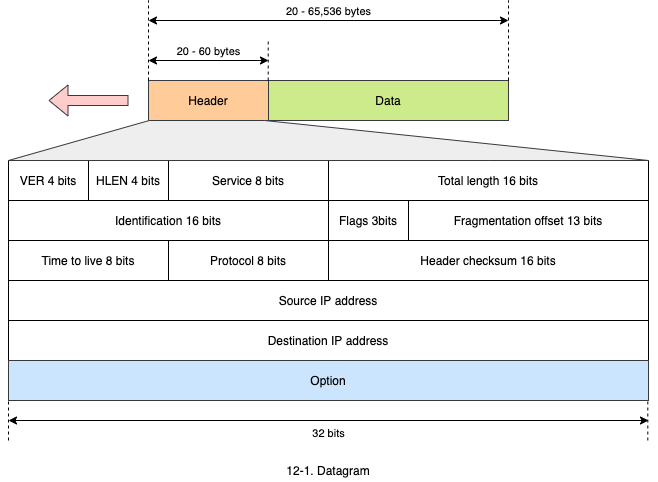
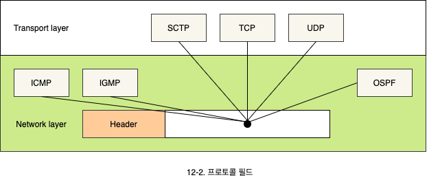
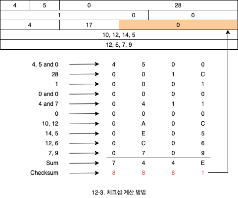
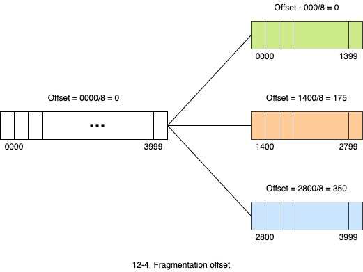
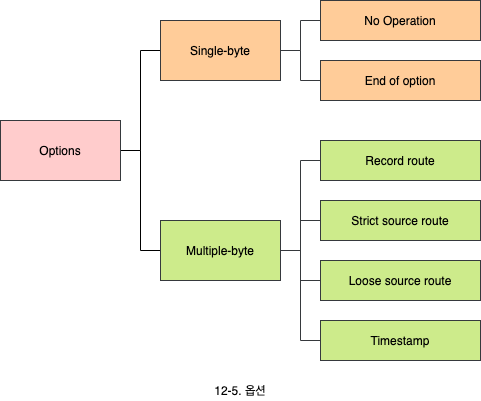

# 인터넷 프로토콜: IP

- IP 패킷의 형태
  - 헤더에 포함된 다양한 필드에 대한 설명
- 단편화와 옵션
  - MTU의 의미와 단편화의 필요성
  - 단편화의 구체적 방법
  - IP 패킷의 옵션 종류와 의미

## 1. 패킷의 형태

- 인터넷 프로토콜인 IP는 **비신뢰성**(Unreliable), **비연결성**(Connectionless) 데이터그램 프로토콜 입니다.
  - best-effort 전달 서비스를 제공합니다. best-effort는 최선을 다해서 패킷을 보내지만 못갈 수 있다는 의미입니다.
  - 에러제어나 흐름제어가 없습니다. 즉 에러 검출과 회복시키는 에러 제어 기능과 송신자가 보낸 데이터를 알맞게 보낼수 있도록 제어하는 흐름 제어 기능이 없습니다.
  - 에러 검출만하고 만일 발견되면 폐기합니다.
- 신뢰성이 중요한 전송에는 TCP를 함께 사용해야 합니다.
- IP에서 패킷을 데이터그램이라고도 합니다.

### 1.1 버전 (Version, VER)

- IP 프로토콜의 버전을 나타내는 것으로, 4 혹은 6이 될 수 있습니다.

### 1.2 헤더의 크기 (Header length, HLEN)

- 허데의 크기를 나타내는 것으로, 4바이트 단위로 나타낸 크기입니다.
- 헤더의 크기는 20에서 60바이트로 가변됩니다.

### 1.3 서비스

- IP 패킷이 가져야 하는 서비스의 형태를 의미합니다.
- 서비스 형태는 응용 서비스별로 주요하게 다루어야 하는 특성으로, 지연시간, 신뢰성, 처리량 등 어떤 특성을 고려해야 할지 명시합니다.

### 1.4 전체 길이

- IP 데이터그램을 바이트 단위로 나타낸 전체 길이입니다.
- 전체 필드 크기가 16비트로 이루어져 있기 때문에 표시할 수 있는 최대 수는 6533 바이트까지 가능합니다.

### 1.5 생존 시간 (Time to live, TTL)

- IP 데이터그램이 지나가는 최대 홉(Hop)의 수 입니다.
- 각 라우터는 데이터그램이 지나갈 때마다 1씩 감소시킵니다.
- 이 값이 0이되면 라우터는 해당 데이터그램을 폐기합니다.

### 1.6 프로토콜

- IP 계층 위에서 존재하는 상위 프로토콜이 무엇인지를 나타냅니다.

### 1.7 체크섬 (Checksum)

- IP 패킷의 헤더에 대한 오류 검사를 위해서 사용됩니다. 헤더에 에러가 발생하면 폐기시킵니다.
- 계산 방법
  - 처음에 체크섬의 값을 0으로 합니다.
  - 전체 헤더를 16비트 단위로 구분하여 1의 보수 연산을 수행합니다.
  - 결과 값을 보수로 만들어서 체크섬 필드에 저장합니다.

### 1.8 송신자 주소와 목적지 주소

- 송신자와 수신자의 IP 주소를 의미합니다.

## 2. 단편화와 옵션

- 프레임의 크기와 형태는 네트워크에 따라서 다를 수 있습니다.
  - IP 패킷은 여러 네트워크를 경유하기 때문에 다양한 데이터 링크 프로토콜을 거쳐 갈 수 있습니다.
  - IP 패킷은 네트워크가 수용할 수 있는 크기로 분할되어야 하는데, 이를 단편화(Frgmentation)라 합니다.
- IP 패킷이 프레임으로 만들어질 때, 전체 크기는 데이터 링크 프로토콜에서 수용하는 최대 크기보다 작아야 합니다.
  - 최대로 보낼 수 있는 크기, 즉 최대로 보낼 수 있는 메시지의 단위를 **MTU**(Maximum transfer unit)라 합니다.

### 2.1 플래그 (Flags)

- 3비트로 구성되며 첫번째 비트는 사용하지 않습니다.
- 두번째 비트는 **단편화 금지**(Do not Fragment)를 의미합니다.
  - 값이 1이면 단편화하지 말라는 의미입니다.
  - 단편화하지 않고는 네트워크로 전달할 수 없다면, 해당 패킷을 폐기하고 ICMP 에러 메시지를 전송합니다.
- 세번째 비트는 **단편이 더 있다**(More fragment)는 것을 의미합니다.
  - 값이 1이면 마지막 단편이 아니라는 의미입니다.
  - 값이 0이면 마지막 단편을 의미합니다.

### 2.2 단편화 위치 값 (Fragmentation offset)

- 13 비트로 구성되어 있으며, 전체 패킷에서 해당 단편이 차지하는 위치 값을 의미합니다.
- 위치 값은 첫 번째부터 시작하며 8바이트 단위로 표시합니다.

### 2.3 옵션

옵션은 최대 40 바이트까지 가능합니다.

- **Record route**: IP 패킷이 이동하면서 경로를 기록합니다.
- **Strict source route**: 거쳐갈 라우터를 지정합니다.
- **Loose source route**: 필수로 거쳐갈 라우터를 지정합니다. 이 라우터들 외에 다른 라우터를 추가적으로 거쳐가도 괜찮습니다.
