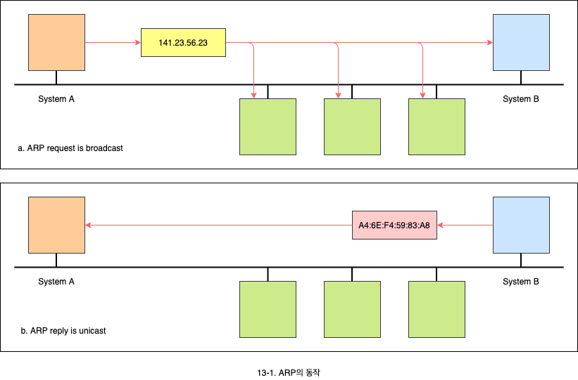
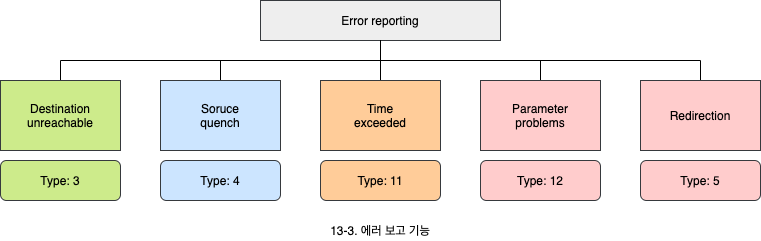
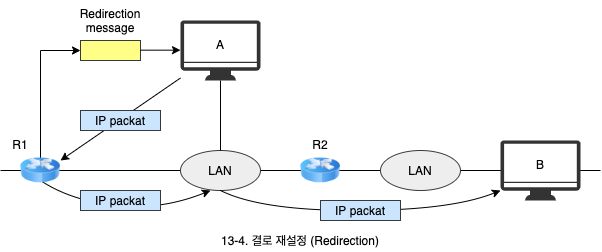
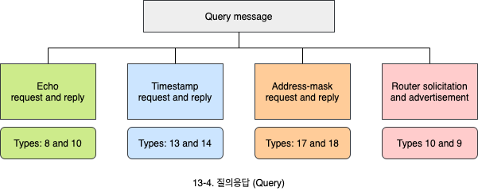

# 주소 매핑과 에러보고

1. 주소 매핑
   - 정적 매핑과 동적 매핑의 차이점
   - ARP와 RARP, BOOTP, DHCP의 필요성과 동작
2. 에러보고
   - 에러보고의 필요성
   - 에러보고 기능의 종류와 의미
   - 질의응답 기능의 종류와 의미

## 1. 주소 매핑

- IP 주소는 인터넷에 접속된 컴퓨터를 구분하기 위한 주소입니다.
- Ethernet 주소와 같은 물리적인 주소는 해당 LAN에 접속된 컴퓨터를 구분하기 위한 주소입니다.
  - MAC 주소는 LAN에서만 유일하게 식별되며 인터넷 전체에서는 IP 주소로 식별합니다.
- 인터넷은 여러 네트워크들의 집합으로 되어 있어서 각 네트워크 내부의 장치들을 구분하기 위한 주소가 사용됩니다.
  - MAC 주소는 LAN 내에서 각 장치를 구분합니다.
- IP 패킷이 해당 LAN을 통과하기 위해서는 IP 주소에 대응하는 이더넷 주소와의 관계가 설정되어야 합니다.
- 매번 네트워크를 통과할 때마다 IP 주소와 MAC 주소의 매핑이 필요합니다.

### 1.1 정적 매핑 (Static mapping)

- IP 주소와 MAC 주소를 연결시키는 테이블을 고정적으로 생성하는 방법입니다.
  - 수작업으로 직접 입력할 수도 있습니다.
- 이 방법에는 문제점이 존재합니다.
  - 컴퓨터가 **NIC**(Network interface card)를 교환할 수 있습니다.
  - 노트북과 같이 이동이 가능한 컴퓨터는 하나의 네트워크에서 다른 네트워크로 이동할 수 있습니다.

### 1.2 동적 매핑 (Dynamic mapping)

컴퓨터가 매번 IP 주소와 MAC 주소의 관계를 프로토콜을 이용하여 구합니다.

#### 1.2.1 ARP (Address resolution protocol)

- IP 주소에 대응하는 MAC 주소를 구하는 프로토콜입니다.
- 요청은 모든 시스템에 브로드케스트로 보내고, 그에 해당되는 시스템이 자신의 Ethernet address를 유니케스트로 보냅니다.

#### 1.2.2 RARP, BOOTP, DHCP

- MAC 주소에 대응하는 IP 주소를 구하는 프로토콜입니다.
- 자신의 하드웨어 주소를 알지만 IP 주소를 모르는 경우가 있을 수 있습니다.
  - IP 주소는 디스크에 저장되는데, 디스크가 없는 컴퓨터가 있을 수 있습니다.
  - IP 주소가 충분하지 않아서 필요할 때마다 IP 주소를 할당하고자 하는 경우가 있을 수 있습니다.

##### RARP (Reserved address resoultion protocol)

- RPRP 서버는 MAC 주소에 대한 IP 주소를 갖고 있다가 응답해줍니다.
- BOOTP와 DHCP가 RARP를 대체하였습니다.

##### BOOTP (The bootstrap protocol)

- RARP를 확장하여 주소에대한 해결 뿐만 아니라, 부팅 관련 정보(부팅 이미지, 주소 사용 시간 결정 등)도 전달할 수 있도록 설계되었습니다.
- BOOTP는 하드웨어 주소에 대한 IP 주소 할당이 미리 정해진 테이블에 따라 정적으로 할당합니다.

##### DHCP (Dynamic host cofiguration protocol)

- BOOTP와 같은 정적 할당과 동적 할당이 모두 가능합니다.
  - IP 주소 풀(Pool)에서 주소 할당이 가능합니다.

## 2. 에러 보고

- IP 프로토콜은 에러 제어와 관리 기능이 부족하다는 2가지 단점을 갖고 있습니다.
  - Best-effort 전달 서비스를 제공함에 따라 에러 보고와 질의 기능이 있습니다.
- **ICMP**(The insternet control message protocol)는 IP의 이러한 단점을 보완하기 위해서 제공됩니다.
- ICMP는 2가지 기능을 제공합니다.
  - 에러 보고 메시지(Error-reporting message)
  - 질의 응답 메시지(Query message)

### 2.1 에러 보고 기능

- **목적지 도달 불가** (Destination unreachable)
  - 라우터나 컴퓨터가 IP 패킷을 전달할 수 없을 때, 해당 패킷은 폐기되며 라우터나 컴퓨터는 목적지 도달 불가 메시지를 송신지로 보냅니다.
- **송신지 조절** (Source quench)
  - IP는 흐름 제어나 혼잡 제어를 제공하지 않습니다.
  - 라추터나 컴퓨터는 혼잡이 발생하면, 해당 패킷을 폐기하고 송신지로 송신지 조절 메시지를 보냅니다.
- **시간 초과** (Time exceeded)
  - 라우터는 TTL 필드의 값이 0인 패킷은 폐기 시킵니다. 이때 송신지로 시간 초과 메시지가 발생합니다.
  - 목적지 컴퓨터에서 단편화된 메시지가 모두 도착하지 못해서 완전한 하나의 패킷을 조합할 수 없을 때, 시간 초과 메시지가 발생합니다.
- **파라미터 문제** (Parameter problem)
  - 라우터나 목적지 컴퓨터가 IP 패킷 헤더의 정보 중에서 처리할 수 없는 부분을 발견하면 이 메시지가 발생합니다.
- **경로 재설정** (Redirection)
  - 컴퓨터에서 잘못된 라우터로 패킷을 전달하는 경우, 라우터는 올바른 라우터로 전달되도록 라우팅 테이블을 변경할 것을 요구할 수 있습니다.

### 2.2 질의응답

- **에코 요청 및 응답** (Echo request and reply)
  - 에코 요청을 보내면 받은 시스템은 이에 대한 응답 메시지를 보내야 합니다.
- **타임 스탬프 요청 및 응답** (Time-stamp request and reply)
  - 응답 시간을 구하는데 사용할 수 있습니다.
- **주소 마스크 요청 및 응답** (Address mask request and reply)
  - 주소 마스크 정보를 요청하면 응답해야 합니다.
- **라우터 요청 및 응답** (Router solution and advertisement)
  - 컴퓨터는 라우팅 정보를 보내 줄 라우터를 찾기 위해 라우터 요청 메시지를 보냅니다.
