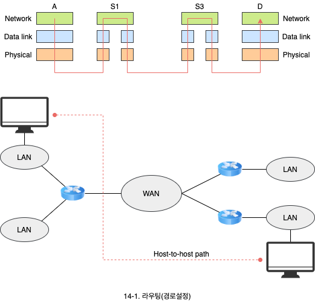
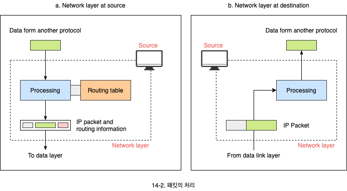
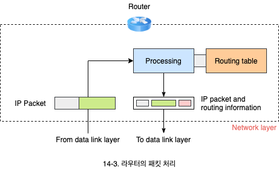
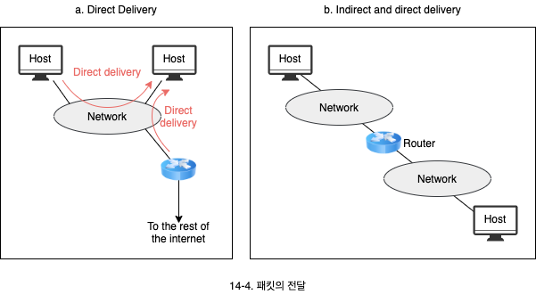
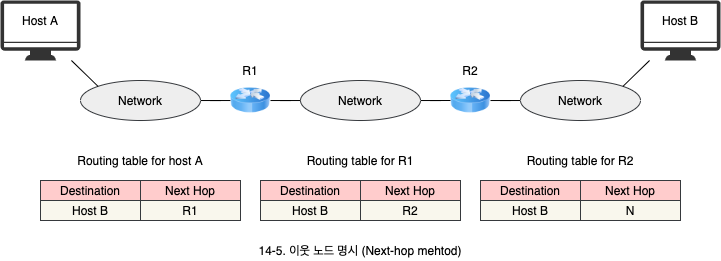
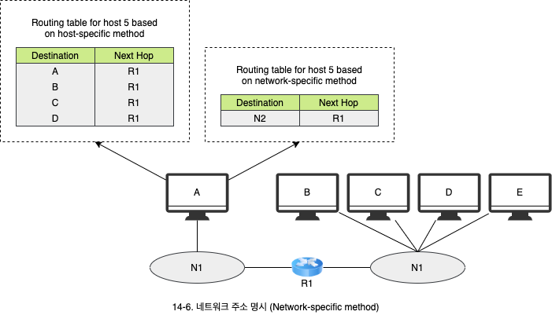
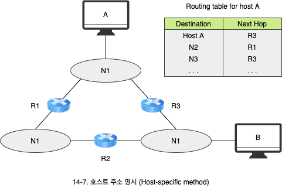

# 패킷의 전달과 라우팅

1. 패킷의 처리
   - 송수신자 및 중간장치의 처리
2. 패킷의 전달
   - 직접 전달과 간접 전달의 의미
   - 패킷의 전달 방법
3. 라우팅 테이블과 라우팅 프로토콜
   - 정적 라우팅과 동적 라우팅의 차이점
   - 유니케스트 라우팅 프로토콜과 멀티캐스트 라우팅 프로토콜의 차이점

## 1. 패킷의 처리

- 인터넷은 여러 네트워크의 연결로 구성되어 있어서 송신자에서 목적지까지 가는 경로가 여럿 있을 수 있습니다.
- 네트워크 계층은 여러 네트워크를 통한 패킷의 전달 문제를 해결해 줍니다.
  - 송진지에서 수신지에 이르는 여러 경로 중에 어느 하나를 선택하는 과정을 **라우팅**(경로 설정)이라 합니다.

- 송신자의 네트워크 계층은 패킷을 생성합니다.
  - 패킷이 너무 크다면 단편화가 발생합니다.
  - 목적지에 패킷을 전달하기 위해 라우팅 테이블을 참조합니다.
- 어디로 가야할지 경로 설정을 할 수 있도록 표 형태로 구성되어 있는 것을 **라우팅 테이블**이라 합니다.
  - 목직지 IP 주소에 대한 최적의 경로를 지정해 주는 기능인 테이블을 참조해서 해당 패킷을 보내게 되어있습니다.
- 목적지에 네트워크 계층은 주소를 확인하여 자신에게 온 패킷인지 검사합니다.
  - IP 패킷의 헤더들을 검사합니다.
  - 단편화된 패킷을 받는다면, 단편들을 모아서 온전한 패킷을 조립합니다.

- 스위치나 라우터와 같은 중간 장치들은 패킷을 라우팅합니다.
  - 채킷이 도착하면 라우팅 테이블을 검사하여 보내야하는 인터페이스(포트)를 확인합니다.

## 2. 패킷의 전달

- 패킷의 전달은 직접 전달과 간접 전달로 나뉩니다.
- **직접 전달**(Direct dilivery)은 패킷의 최종 목적지가 전달자와 바로 인접한 경우로써 동일한 네트워크에 연결되어 있습니다.
- **간접 전달**(Indirect dilivery)는 패킷의 최종 목적지에 전달될 때까지 라우터에서 라우터로 전달되는 경우입니다.

### 2.1 이웃 노드 명시 (Net-hop method)

- 라우팅 테이블은 전체 경로상의 라우터를 명시하지 않고 다음 라우터를 명시합니다.

### 2.2 네트워크 주소 명시(Network-specific method)

- 동일한 네트워크에 연결된 컴퓨터들을 하나하나 모두 명시하는 것이 아니라 목적지 네트워크 주소만 명시합니다.
- 테이블 사이즈가 줄면 검색도 빨라지고, 메모리도 줄어드는 효과를 얻을 수 있습니다.
- 예를 들어, `192.168.10.11`의 C 클래스 IP 주소의 경우, `192.168.10`으로 네트워크 주소만 라우팅 테이블에 등록합니다.

### 2.3 호스트 주소 명시 (Host-specific method)

- 라우팅 테이블에 목적지 컴퓨터 주소를 직접 명시할 수 있습니다.
- 컴퓨터 주소를 라우팅 테이블에 갖는 것이 비효율적이라 하더라도 특별한 목적이 있는 경우 이를 포함할 수 있습니다. (보안)

### 2.4 디폴트 지정 (Default method)

- 인터넷에 있는 모든 목적지를 지정할 수 없으므로 지정된 목적지 이외의 모든 지역을 지정하는 라우팅 엔트리를 디폴트라고 합니다. (보통 네트워크 주소가 `0.0.0.0`로 표기됩니다)

## 3. 라우팅 테이블과 라우팅 프로토콜

### 3.1 라우팅 테이블

- 라우팅 테이블은 정적 혹은 동적으로 구성됩니다.
- **정적 라우팅**(Static routing) 테이블은 직접 입력합니다.
  - 자동으로 갱신될 수 없습니다.
  - 보통 호스트 컴퓨터에서 사용합니다.
  - LAN에 접속된 호스트는 외부 인터넷으로 접속하는 출구가 하나로 되어있어 구성할 필요성이 없습니다.
- **동적 라우팅**(Dynamic routing) 테이블은 **RIP**, **OSPF**, **BGP** 같은 동적 라우팅 프로토콜에 의해서 주기적으로 갱신됩니다.

### 3.2 라우팅 프로토콜

- 라우팅 정보를 판단해서 라우팅 테이블을 만들어 주는 것이 주요 임무입니다.
- 라우팅 프로토콜에는 **유니캐스트**(Unicast) 라우팅 프로토콜과 **멀티캐스트** 라우팅 프로토콜이 있습니다.
- **유니캐스트 라우팅 프로토콜**
  - 보통 그냥 라우팅 브로토콜이라 합니다.
  - 목적지가 하나입니다.
  - 두 노드 사이의 경로를 선택하기 위해 어떻게 라우팅 정보를 교환하여 라우팅 테이블을 구축하는 것인가를 명시합니다.
- **멀티캐스트 라우팅 프로토콜**
  - 목적지가 동일한 그룹에 속한 여러 호스트가 될 수 있습니다.
