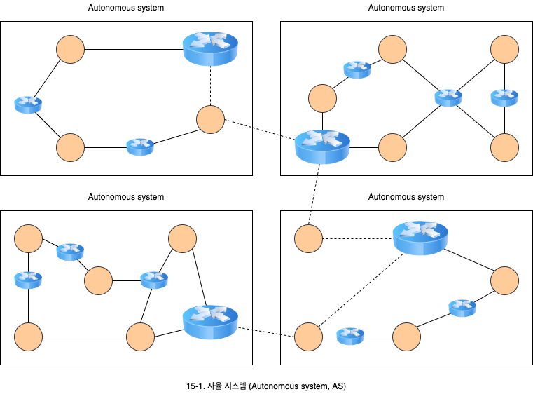
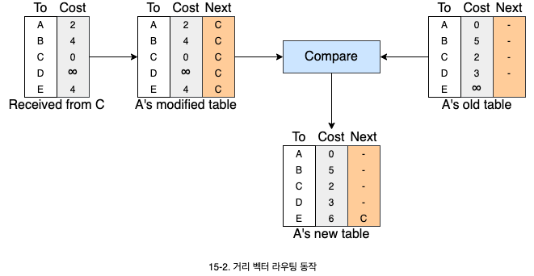
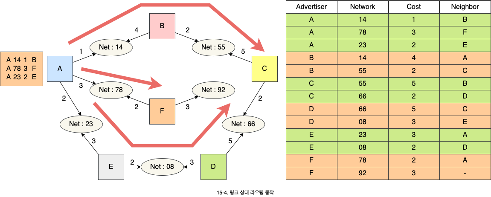

# 라우팅 프로토콜

1. 라우팅 프로토콜과 자율 시스템
   - 내/외부 게이트웨이 프로토콜과 AS의 의미
2. 거리 백터 라우팅
   - 알고리즘의 동작, 예제, 실제 사용 프로토콜
3. 링크 상태 라우팅
   - 알고리즘의 동작, 예제, 실제 사용 프로토콜
4. 경로 벡터 라우팅
   - 외부 게이트웨이 프로토콜의 동작

## 1. 라우팅 프로토콜과 자율 시스템

- 라우팅 패킷을 전달하기 위한 경로를 선택하는 과정입니다.
- 라우팅 프로토콜은 내부 게이트웨이 프로토콜과 외부 게이트웨이 프로토콜로 구분됩니다.
  - **내부 게이트웨이 프로토콜**(Interior gateway protocol, IGP): **자율 시스템**(Autonomous system) 내부에서 사용되는 라우팅 프로토콜입니다. IS-IS, OSPF, IGRP, EIGRP, RIP 등이 이에 속합니다.
  - **외부 게이트웨이 프로토콜**(Exterior gateway protocol, EGP): 자율 시스템 간에 사용되는 라우팅 프로토콜입니다. BGP가 이에 속합니다.

### 1.1. 자율 시스템 (Autonomous system, AS)

- 하나의 라우팅 프로토콜이 전체 인터넷에서 통용 되도록 할 수는 없습니다.
- **AS**(Autonomous system)는 하나의 기관 내부를 나타내는 것으로, 네트워크와 라우터의 집합으로 구성됩니다.
  - 인터넷은 여러 기관의 네트워크로 구성되며, 각 기관은 AS로 볼 수 있습니다.
- 걱 AS는 하나 또는 여러 개의 라우팅 프로토콜을 사용할 수 있습니다. 하지만 AS 간에는 반드시 하나의 라우팅 프로토콜만 사용해야 합니다.

## 2. 거리 벡터 라우팅 (Distance vector routing)

- 거리 백터 라우팅에서 두 노드 사이의 최소 비용 경로는 최소 거리를 갖는 경로입니다.
  - 경로를 계산하기 위해서 Ballan-Ford 알고리즘을 사용합니다.
- 거리 벡터 라우팅을 사용하는 프로토콜은 **RIP v1/v2**(Routing information protocol) 그리고 **IGRP**(Interior gateway routing protocol)가 있습니다.
  - **BGP**(Border gateway protocol)도 거리 벡터 라우팅과 개념상 유사합니다.

### 2.1 알고리즘의 동작

각 라우터는 주기적으로 자신이 보유한 전체 인터넷에 대한 정보를 이웃 라우터와 공유합니다.

- 전체 AS에 대한 정보를 공유합니다.
- 이웃 라우터하고만 공유합니다.
- 주기적으로 공유합니다.

### 2.2 RIP (Routing information protocol)

- 거리 벡터 라우팅 방법을 사용하며 라우팅 테이블에서 목적지는 일반적으로 네트워크가 됩니다.
- 사용되는 메트릭은 홉수로 말합니다. 도달 불가능한 경우 메트릭의 값을 16으로 합니다. 이웃 노드는 라우터의 주소가 됩니다.

| Destination | Hop Count | Next Router | Other information |
| :---------: | :-------: | :---------: | :---------------: |
|  163.5.0.0  |     7     | 172.6.23.4  |                   |
| 197.5.13.0  |     5     | 176.3.6.17  |                   |
| 189.45.0.0  |     4     |  200.5.1.6  |                   |
|  115.0.0.0  |     6     | 131.4.7.19  |                   |

## 3. 링크 상태 라우팅 (Link state routing)

- 링크 상태 라우팅에서는 모든 노드가 전체 네트워크에 대한 구성도를 만들어서 경로를 구합니다.
  - 각 노드는 다른 모든 노드로의 최단 경로를 구합니다.
  - 각 노드는 Dijkstra's 최단 경로 알고리즘을 사용하여 라우팅 테이블을 구축합니다.
- **OSPF**(Open shortest path first) 라우팅 프로토콜은 링크 상태 라우팅 방법을 사용합니다.

### 3.1 알고리즘 동작

- 전체 네트워크 토폴로지는 각 노드의 부분정보를 모아서 구할 수 있습니다.
- 각 라우터는 이웃에 관한 정보를 전체 라우터와 공유합니다. 변화가 발생하면 다시 정보를 공유합니다.
- 구성도를 완성하면 최단 경로 알고리즘을 사용하여 라우팅 테이블을 만듭니다.

## 4. 경로 벡터 라우팅 (Path vector routing)

BGP(Border gateway protocol)은 AS간 라우팅 프로토콜로 현재 사용되는 버전은 BGP 4입니다.

| Network | Next Router |          Path          |
| :-----: | :---------: | :--------------------: |
|   N01   |     R01     |    AS14, AS23, AS67    |
|   N02   |     R05     | AS22, AS67, AS05, AS89 |
|   N03   |     R06     | AS67, AS89, AS09, AS34 |
|   N04   |    R012     |    AS62, AS02, AS09    |
