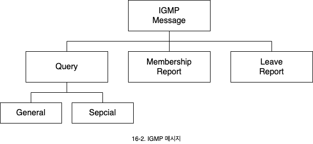
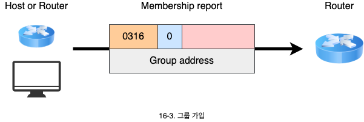
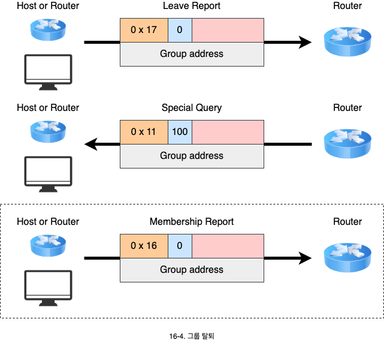
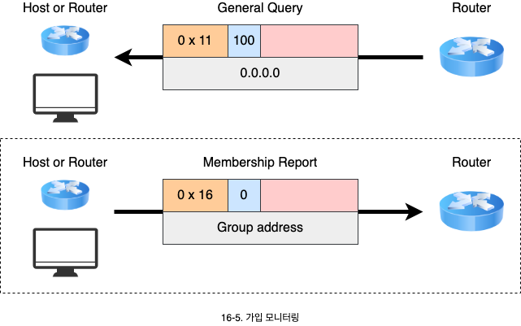
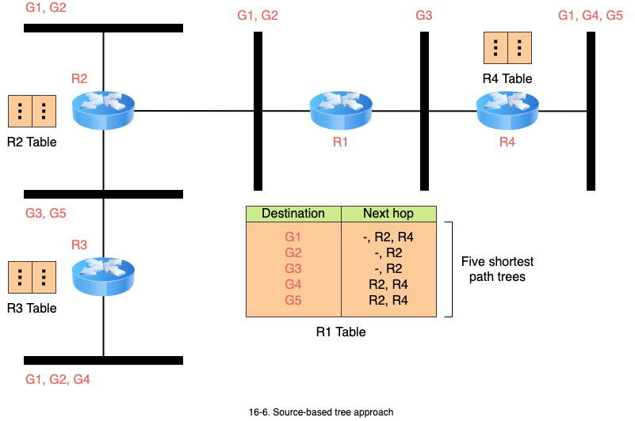
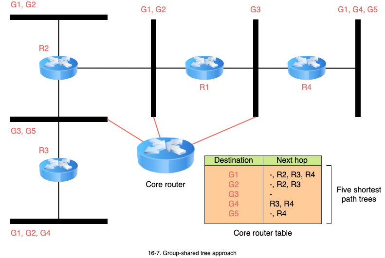

# 멀티캐스팅

1. 멀티캐스팅
   - 멀티캐스팅의 의미와 주소 사용
2. 멀티캐스트 그룹 관리
   - 그룹 관리 프로토콜을 사용한 가입/탈퇴/모니터링 방법
3. 멀티캐스트 라우팅
   - 멀티캐스트 라우터의 라우팅 종류와 방법
   - 멀티캐스트 라우팅의 트리 구성 방법

## 1. 멀티캐스팅

- 멀티캐스팅 전송은 하나의 송시나좌 그룹에 속한 다수의 수신자와의 통신 형태를 의미합니다.
  - 일대 다의 관계입니다.
  - 송신자는 유니캐스트 주소를 사용하지만 목적지는 그룹 주소인 D 클래스 주소를 사용합니다.
- 멀티캐스팅과 유사한 것이 **다중 유니캐스팅**(Multiple unicasting) 입니다.
  - 유니캐스팅을 이용한 **애뮬레이션**(Emulation)
  - 목적지가 1000곳이라면, 처음 패킷과 마지막 패킷의 지연 시간이 발생합니다.
  - 이에 따라 대역폭을 소모합니다.
  - 멀티캐스팅에서는 하나의 패킷만 송신 측에서 전송하여 패킷간 지연이 없으며, 대역폭도 효율적으로 사용합니다.

## 2. 멀티캐스트 그룹 관리

- 멀티캐스트 그룹에 속한 시스템들의 가입과 탈퇴를 관리하기 위한 프로토콜로 **IGMP**(Internet group Management protocol)를 사용합니다.
- IGMP 멀티캐스트 라우터에게 그룹에 속한 시스템들에 대한 정보를 제공합니다.
  - IGMP는 멀티캐스팅 라우팅 프로토콜이 아니라 그룹에대한 관리만을 담당합니다.
  - 현재 최신버전은 IGMPv3 입니다.

### 2.1 멀티캐스트 라우터

- 해당 네트워크에 소속된 멀티캐스트 그룹에 대한 목록을 보유합니다.
- 해당 멀티캐스트 IP를 사용하는 컴퓨터의 유무를 관리하여 패킷의 송신 여부를 결정합니다.

### 2.2. 그룹 가입

호스트는 그룹에 가입하기 위해 **가입 요청 메시지**(Membership report)를 보냅니다.

### 2.3 그룹 탈퇴

- 호스트는 그룹에서 탈퇴하기 위한 **탈퇴 요청 메시지**(Leave report)를 멀티캐스트 라우터에 송신합니다.
- 탈퇴 요청을 받은 멀티캐스트 라우터는 즉시 그룹을 삭제하지 않습니다.
- 해당 네트워크의 다른 호스트가 아직 그룹에 가입해 있을 수 있습니다.
- 멀티캐스트 라우터는 네트워크 내에 그룹 가입자를 확인하기 위해, **특별 질의 메시지**(Special query)를 보냅니다.
- 질의에 대한 응답이 온다면 목록을 유지학, 응답이 없다면 해당 클래스 D 주소를 삭제 합니다.

### 2.4 일반 질의 메시지 (General query)

시스템이 갑자기 종료하여 탈퇴 메시지를 보내지 못할 상황을 대비하여 주기적으로 확인합니다.

- 이떄 그룹 주소는 `0.0.0.0`으로 설정합니다.
- 이 메시지를 받는 모든 시스템은 그룹에 대한 가입 상황을 보고해야 합니다.

## 3. 멀티캐스팅 라우팅

- 유니캐스트 라우터에서는 라우터가 하나의 목적지에 대한 하나의 최적 경로를 갖습니다.
- 멀티캐스트 라우팅에서는 라우터가 각 그룹(여러 목적지)에 대한 하나의 최적 경로를 가져야 합니다.
  - N개의 그룹이 있다면, N개의 최적의 경로가 필요합니다.
  - 그룹에 소속된 네트워크가 여러 개 존재할 수 있습니다. 트리를 구성하여 멀티캐스트 패킷을 전달합니다.

### 3.1 송신자 기반 트리 (Source-based tree)

- 트리의 구성은 송신자와 그룹을 이용하여 구성합니다.
  - 라우터가 그룹별로 하나의 최적 경로를 구합니다.
- 멀티캐스트 라우팅 프로토콜
  - **DVMRP**(Distance vecor multicast protocol): RIP와 같은 거리 벡터 라우팅 방식을 확장
  - **MOSPF**(Multicast OSPF): OSPF와 같은 링트 상태 라우팅 방식을 확장
  - **PIM-DM**(Protocol independent mulitcast-dense mode): RIP나 OSPF를 사용

### 3.2 그룹 공유 트리 (Group-shared tree)

- 각 라우터가 그룹 별로 최적 경로를 구성하지 않고 **센터 코어**(Centercore) 혹은 랑데부 라우터만 그룹에 대한 최적 경로를 구성합니다.
  - 임의의 라우터가 멀티캐스트 패킷을 받으면 코어 라우터로 유니캐스트 패킷으로 포장하여 보내며, 코어 라우터 멀티캐스트 패킷을 전달합니다.
- 동일한 트리를 각 그룹이 하나씩 가지며 이를 공유합니다.
- 멀티캐스트 라우팅 프로토콜: **CBT**(Core-based tree)와 **PIM-SM**(Sparse mode)

