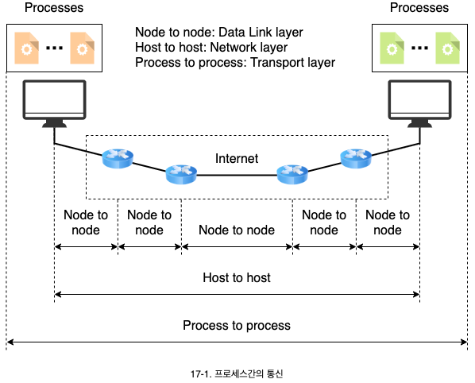
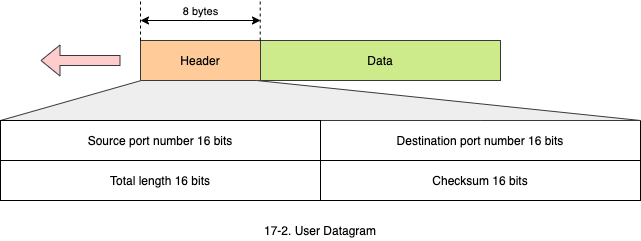
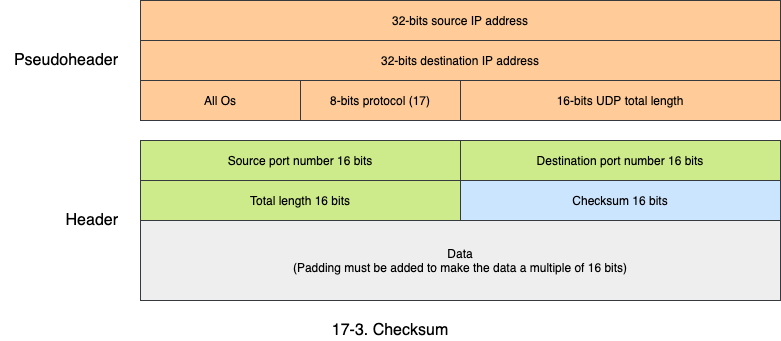
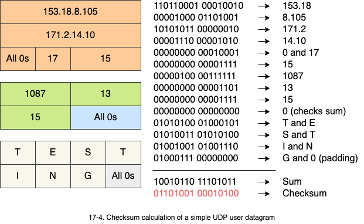

# 전송 프로토콜과 UDP

1. 프로세스 간의 통신
   - 수송계층 프로토콜과 프로세스 간의 통신의 의미
   - 포트 번호의 종류와 클라이언트/서버 모델
2. 사용자 데이터그램 프로토콜 (UDP)
   - 메시지 형태와 필드 설명
   - UDP의 특징과 사용되는 영역

## 1. 프로세스간의 통신

- 데이터 링크 계층은 이웃한 두 노드 사이의 프레임 전달에 관여합니다.
  - 노드에서 노드로 전달(Node-to-node delivery)
- IP와 같은 네트워크 계층은 두 호스트 사이의 패킷 전달에 관여합니다.
  - 호스트에서 호스트로 전달(host-to-host delivery)
- 수송 계층 프로토콜은 프로세스 사이의 메시지 전달에 관여합니다.
  - 프로세스에서 프로세스로 전달(Process-to-process delivery)
  - 포트 번호가 프로세스간의 전달에 사용됩니다.

### 1.1 클라이언트/서버 구성

- 프로세스간의 통신은 클라이언트/서버 구성을 통해서 이루어 집니다.
- 포트 번호는 수송 계층에서 사용하는 주소로서 특정 호스트에서 실행되는 프로세스를 구분하기 위해 사용합니다.
  - 포트 번호는 16비트 정수로 0에서 65535 사이의 값을 갖습니다.
- 클라이언트 프로그램은 포트 번호를 갖게 되는데 운영체제에 의해 선택됩니다.
  - 이러한 포트는 일시적으로 할당되고 사라져서 **임시 포트 번호**(Ephemeral port number)라 합니다.
- 서버 프로그램은 인터넷에서 식별을 위해 동일한 포트 번호를 갖습니다.
  - 이러한 포트는 고정적으로 할당되고 모두 알고 있어야 하기 때문에 **알려진 포트 번호**(Well-known port number)라 합니다.

### 1.2 포트 번호

**IANA**(Internet Assigned Numbers Authority)는 포트 번호를 3개의 영역으로 구분하고 있습니다.

- **Well-known ports**: 이 포트는 0 ~ 1023이 할당되며 인터넷 서비스를 위해 사용됩니다.
- **Registered ports**: 이 포트는 1024 ~ 49151의 범위를 가지며 특정 응용을 위해 기업이 사용합니다.
- **Dynamic ports**: 이 포트는 49152 ~ 65535의 범위를 가지며 등록되거나 통계되지 않습니다. **임시 포트**(Ephemeral ports)로 이용됩니다.

## 2. User Datagram

- UDP는 비연결형, 비신뢰성 수송 프로토콜로서 흐름 제어나 에러 제어가 없습니다.
  - UDP가 에러를 검출하면 단순히 폐기됩니다.
- UDP는 오버헤드가 작은 아주 단순한 프로토콜에 이용됩니다.

| Port |  Protocol  | Description                                   |
| :--: | :--------: | --------------------------------------------- |
|  7   |    Echo    | Echoes a received datagram back to the sender |
|  9   |  Discard   | Discards any datagram that is received        |
|  11  |   Users    | Acture users                                  |
|  13  |  DayTime   | Returns the date and the time                 |
|  17  |   Quote    | Returns a qutoe of the day                    |
|  19  |  Chargen   | Returns a string of characters                |
|  53  | Nameserver | Domain name server                            |
|  67  |   BOOTPs   | Server port to download bootstrap information |
|  68  |   BOOTPc   | Client port to download bootstrap information |
|  69  |    TFTP    | Trivial file transfer protocol                |
| 111  |    RPC     | Remote procedure call                         |
| 123  |    NTP     | Network time protocol                         |
| 161  |    SNMP    | Simple network management protocol            |
| 162  |    SNMP    | Simple network management protocol (trap)     |

- UDP는 8바이트의 고정된 크기의 헤더를 갖습니다.
- 체크섬의 값이 계산되지 않으면, 해당 필드의 값이 0이 됩니다.

### 2.1 Checksum

- UDP 체크섬 계산은 IP나 ICMP와 달리 가상헤더를 만들어서 계산합니다.
  - 가상헤더, UDP 헤더, 데이터에 대해서 체크섬을 수행합니다.
- 가상헤더는 IP 패킷의 헤더에서 가져온 정보로 구성합니다.
  - 송신자 IP 주소, 목적지 IP 주소, 프로토콜 필드, 전체 길이 필드로 구성됩니다.
  - IP 헤더가 잘못되면 잘못된 호스트나 잘못된 수송계층 프로토콜로 전달되므로 한번 더 검사합니다.

### 2.2 UDP 동작

- UDP는 비연결형 서비스를 제공합니다.
  - 데이터 그램들 사이에 서로 관련이 없습니다.
  - 번호를 붙이지 않습니다.
  - 연결 설정이나 종료 과정이 없습니다.
  - 각 UDP 데이터그램은 서로 다른 경로로 전달될 수 있습니다.
- UDP는 흐름 제어나 에러 제어가 없습니다.
  - 수신자는 수신 메시지로 오버플로우 될 수 있습니다.
  - 송신자는 메시지가 유실되거나 중복되었는지 알 수 없습니다.

### 2.3 UDP의 사용

- UDP는 간단한 요청/응답 서비스에 적합합니다.
  - 연결 설정/해제 과정의 오버헤드가 없습니다.
- UDP는 프로세스에서 내부 흐름제어와 에러제어를 갖는 경우 적합합니다.
  - 응용 프로그램이 자체적으로 갖고 있는 기능을 중복해서 가질 필요가 없습니다.
- UDP는 멀티캐스팅에 적합합니다.
  - 그룹에 속한 모든 시스템과 연결 설정할 필요가 없습니다.
- UDP는 SNMP 같은 관리 시스템에 사용됩니다.
- UDP는 RIP에서 사용됩니다.
