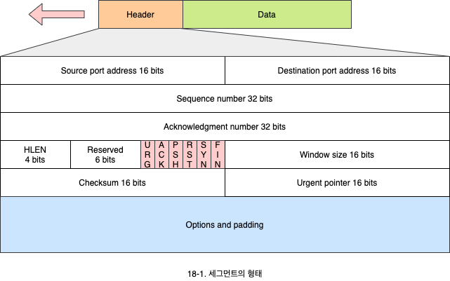
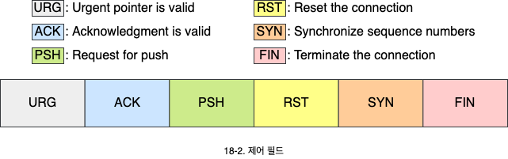
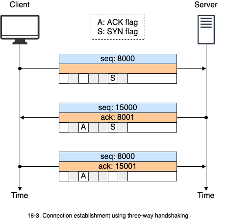
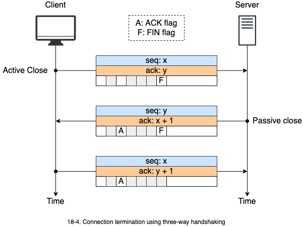
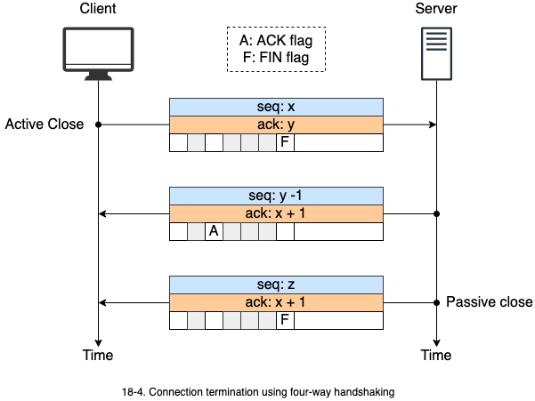

# TCP 프로토콜

1. TCP의 기능
   - 수송 프로토콜로서 제공하는 서비스
2. 세그먼트의 형태
   - 각 필드의 의미와 주요 기능
3. 연결 설정과 해제
   - TCP 연결설정 과정과 해제 과정
4. 흐름제어
   - 세그먼트 흐름을 조절하기 위한 윈도우 흐름제어 방법

## 1. TCP의 기능

- TCP는 프로세스간 통신, 스트림 전달 서비스, 전이중 통신, 연결 지향 서비스, 신뢰성 있는 서비스를 제공합니다.
  - 연결 설정과 해제 과정이 존재합니다.
  - 데이터의 안전한 도착을 확인하는 ACK를 사용하여 신뢰성 있는 전송을 제공합니다.
- TCP는 프로세스간의 통신을 위해 포트 번호를 사용합니다.

| Port |   Protocol   | Description                                    |
| :--: | :----------: | ---------------------------------------------- |
|  7   |     Echo     | Echoes, a received datagram back to the sender |
|  9   |   Discard    | Discards any datagram that is received         |
|  11  |    Users     | Active users                                   |
|  13  |   Daytime    | Returns the date and the time                  |
|  17  |    Quote     | Returns a quote of the day                     |
|  19  |   Chargen    | Returns a string of characters                 |
|  20  |  FTP, Data   | File transfer protocol (data connection)       |
|  21  | FTP, Control | File transfer protocol (control connection)    |
|  23  |    TELNET    | Terminal network                               |
|  25  |     SMTP     | Simple mail transfer protocol                  |
|  53  |     DNS      | Domain name server                             |
|  67  |    BOOTP     | Bootstrap protocol                             |
|  79  |    Finger    | Finger                                         |
|  80  |     HTTP     | Hypertext transfer protocol                    |
| 111  |     RPC      | Remote procedure call                          |

### 1.1 스트림 전달 서비스

TCP는 데이터를 바이트 나열로 전달합니다. 효율성을 위해 여러 바이트를 블록으로 구성된 세그먼트를 만들어 전송합니다.

### 1.2 TCP 특징

- TCP는 모든 바이트에 번호를 부여합니다.
  - 시작 번호는 0 ~ 2^23^ - 1 사이의 임의의 번호를 갖습니다.
  - 번호는 흐름 제어와 에러 제어에 사용됩니다.
  - 세그먼트의 순서 번호는 해당 세그먼트가 나르는 데이터의 첫번째 바이트 번호입니다.
- ACK 번호는 수신해야할 다음 바이트 번호입니다.
  - ACK 번호는 누적 값으로서 수신자는 해당 번호 이전의 모든 바이트를 안전하게 받았음을 의미합니다.
  - 예를 들어 1234가 ACK 번호라면, 1233 바이트까지 모두 받았음을 의미합니다.

## 2. 세그먼트의 형태

- TCP는 송신자 포트번호와 수신자 포트번호를 사용해서 TCP 위에 올라가는 어떤 응용 프로세서가 통신 하는건지 구분하는 식별자로 사용합니다.
- 헤더는 20 바이트이며 옵션이 있으면 60 바이트까지 존재할 수 있습니다.
  - 헤더 길이는 4 바이트 단위로 표시합니다.
- TCP가 비정상적인 상황이나 오랫동안 통신이 없으면 현재의 연결을 끊는데, 이때 Reset이 사용됩니다.
- 제어 필드는 TCP 연결 설정과 연결 해제 메시지를 구분하는 기능을 가지며, 6개의 필드로 구성되어 있습니다.
  - 여러 비트가 동시에 설정될 수 있습니다.
  - 부정적 ACK(NACK)가 없습니다.

### 2,1 긴급 데이터 (URG)

- 송신자는 수신자가 순서에 관계없이 우선적으로 데이터가 처리되길 원할 수 있습니다.
- 긴급 데이터를 포함하면 제어 필드의 **URG**와 **긴급 포인터**(Urgent pointer)가 사용됩니다.

### 2.2 즉시 전달 (PSH)

- 송신 TCP는 수신 TCP가 버퍼링을 하지 말고 즉시 데이터를 응용에게 전달할 것을 요구할 수 있습니다.
- 제어 필드의 **PSH** 비트를 설정합니다.
- 지연된 전송은 **대화식 전송**(Interactive applications)에서는 바람직하지 않습니다.

### 2.3 체크섬

- 데이터에 대한 오류를 검사하여 재전송에 의한 복구를 수행할 수 있습니다.
- TCP에서 체크섬은 강제 사항입니다.
- UDP에서와 같은 가상 헤더를 포함하여 계산합니다.

## 3. 연결 설정과 해제

- TCP는 **3단계 메시지 교환**(Three-way handshake)를 통해서 연결을 설정합니다.
  - 클라이언트는 연결을 요청하는 SYN 세그먼트를 전송합니다.
  - 서버는 SYN과 ACK를 포함하는 세그먼트로 응답합니다.
  - 클라이언트는 ACK를 보냅니다.

- TCP는 연결헤제를 위해서 3단계(Three-way handshaking)와 4단계(Four-way handshaking) 메시지 교환을 제공합니다.
  - 제어 필드의 FIN을 사용하여 연결을 헤제합니다.
  - 4단계 메시지 교환을 통한 연결 헤제는 half-dose 상태를 만들어 수신은 가능하게 할 수 있습니다.
  - 3단계 메시지 교환을 통한 연결 헤제는 즉시 연결을 종료시킬 수 있습니다.

## 4. 흐름 제어

송신 TCP가 목적지로부터 ACK를 수신하기 전에 보낼 수 있는 데이터 양을 정합니다.

- TCP는 **슬라이딩 윈도우 프로토콜**(Sliding window protocol)을 이용합니다.
- TCP는 바이트 단위로 윈도우 크기(수신 가능한 데이터 양)을 명시합니다.
- 윈도우 크기는 시간에 따라 변할 수 있습니다.
