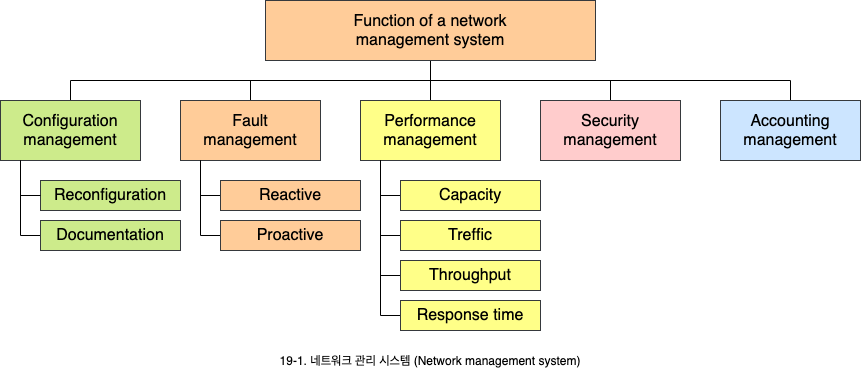
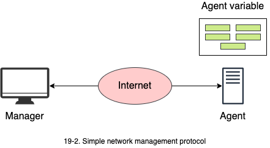
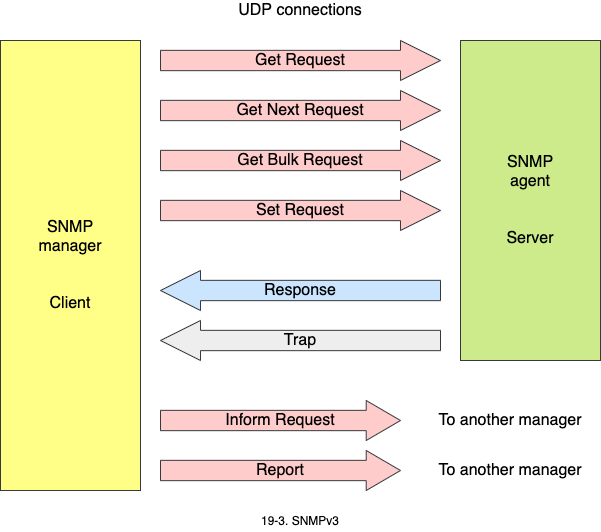
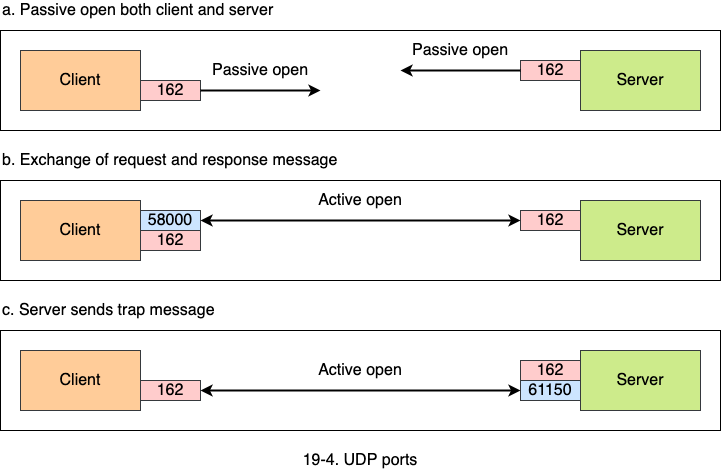

# 네트워크 관리자: SNMP

1. 네트워크 관리 시스템
   - NMS/EMS의 차이점과 5대 관리 기능
2. SNMP
   - 인터넷 관리 표준의 구성 요소
   - 관리 프로토콜의 동작 모델
3. SNMP의 동작
   - 8개 프로토콜 메시지의 종류와 의미
   - UDP 포트의 용도

## 1. 네트워크 관리 시스템 (Network management system)

네트워크 관리는 기관이 정한 요구사항을 만족하기 위해 네트워크 장비에 대해 모니터링, 시험검사, 설정, 문제 진단 행위를 하는 것입니다.

- **NMS**(Network management system): 네트워크 관리를 수행하는 시스템입니다.
- **EMS**(Element management system): 단위 장비 집합을 관리하는 시스템입니다.

### 1.1 구성 관리 (Configuration management)

- 방대한 네트워크는 물리적으로 혹은 놀리적으로 연결된 수많은 시스템들을 갖고 있습니다.
  - 이들 시스템은 초기 설정에서 환경 등의 변화에 따라 설정을 변경할 경우가 많이 발생합니다.
  - 하드웨어 교체나 이동에 따른 재설정이 있을 수 있으며, 새로운 소플트웨어가 설치될 수 있습니다.
- 네트워크 구성도(map)의 변경과 네트워크 장치의 가시화 기능 등은 NMS의 주요 기능 중 하나입니다.

### 1.2 장애 관리 (Fault management)

- 장애는 시스템의 비정상적인 상황으로 정의할 수 있습니다.
- **사후 장애 관리** (Reactive fault management)
  - 장애를 검출, 분리, 복구, 기록하는 행위입니다.
- **사전 장애 관리** (Proactive fault management)
  - 장애가 발생하지 않도록 사전 관리합니다.
  - 자애가 특정 부분에서 자주 발생한다면, 다시 일어나지 않도록록 네트워크를 재구성할 필요가 있습니다.

### 1.3 성능 관리 (Performance management)

- 네트워크를 모니터링하고 제어하며 효율적으로 운영되도록 하는 행위를 의미합니다.
- 네트워크 속도, 트래픽, 처리량, 응답 시간 등의 측정 가능한 기준으로 성능을 나타냅니다.

### 1.4 바안 관리 (Security management)

- 정해진 정책에 따라 네트워크의 접근을 통제하는 행위를 합니다.
- 비인가된 접근으로부터 통신 네트워크와 시스템을 보호하는 일련의 기능들로 구성됩니다.
  - 보안 서비스의 생성, 삭제, 통제와 같은 여러 행위들을 수행하게 됩니다.
  - 보안 관련 정보 전파, 보안 관련 사건 보고, 암호화 키의 분배 제어, 가입자 접근 권한의 인가 등을 포함합니다.

### 1.5 계정 관리

- 과금을 통해 네트워크 자원에 대한 사용자 접근을 통제합니다.

## 2. SNMP (Simple network management protocol)

- SNMP는 TCP/IP 프로토콜을 사용하는 인터넷 장치를 관리하기 위한 프레임 워크입니다.
- SNMP는 관리자/에이전트 개념을 사용합니다.
  - 관리자는 여러 에이전트를 모니터링하고 제어합니다.
  - Manager가 정보를 요청하는 Client가 되고, 피관리 시스템이 서버, 즉 Agent가 됩니다.

- SNMP는 응용계층 프로토콜입니다.
  - 응용 계층에서 동작하도록 설계되어 제조사가 다른 장치도 모니터링 할 수 있고, 네트워크 프로토콜이 달라도 설치될 수 있습니다.
- 피관리 시스템(Agent)은 SNMP 서버가 동작하는 라우터(혹은 호스트)입니다.
  - 에이전트는 관리 정보를 갖고 있습니다.
- 관리 시스템은 관리자(Manager)로서 SNMP 클라이언트 프로그램이 동작하는 호스트입니다.
  - 관리자는 에이전트가 보유한 정보를 요청 가능합니다.

### 2.1 관리 구성 요소

인터넷 관리는 SNMP, SMI, MIB 3가지 프로토콜로 구성됩니다. SNMP는 NMP 프로토콜을 의미하기도 하고, SNMP, SMI, MIB를 통틀어 의미하기도 합니다.

- **SNMP**: 관리자와 에이전트간에 교환되는 메시지 형태를 정의합니다.
- **SMI**(Structure of management information): 관리 정보에 대한 식별과 부호화 방법 등에 대한 규칙을 정의합니다.
- **MIB**(Management information base): 관리 정보의 집합입니다.
  - system, Interface, Address translation, IP, ICMP, TCP, UDP, EGP, Transmission, SNMP 등 10개의 그룹으로 이루어져 있습니다.

## 4. SNMP의 동작

SNMPv3는 8종류의 메시지 형태가 존재합니다.

- **GetRequest PDU**: 관리자가 에이전트에게 특정 정보를 요구할 떄 사용합니다.
- **GetNextRequest PDU**: 관리자가 에이전트에게 표와 같은 여러 개의 정보를 요구할 떄 사용합니다.
- **GetBulkRequest PDU**: 관리자가 에이전트에게 대량의 데이터를 요구할 때 사용합니다.
- **SetRequest PDU**: 관리자가 에이전트에게 특정 관리 정보의 값을 설정할 때 사용합니다.
- **Response PDU**: 에이전트가 관리자에게 GetRequest, GetNextRequest, 혹은 SetRequest에 대한 응답을 할 때 사용합니다.
- **Trap PDU**: 에이전트가 특정 이벤트를 관리자에게 보고할 댸 사용합니다.
- **InformationREquest PDU**: 다른 관리자에게 해당 관리자의 통제하에 있는 에이전트의 관리 정보를 요구하기 위해 사용합니다.
- **Request PDU**: 관리자들 간에 에러를 보고하기 위해 사용합니다.

### 4.1 UDP Port

SNMP는 UDP 161본ㄱ허 162번 포트를 사용합니다.

- **161번 포트**: 관리자(클라이언트)가 에이전트(서버)에게 정보를 요구할 떄 사용합니다.
- **162번 포트**: 에이전트(서버)가 Trap과 같은 서전보고가 발생했을 때, 관리자(클라이언트)에게 보고하기 위해 사용합니다.

