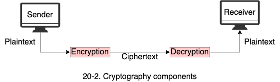
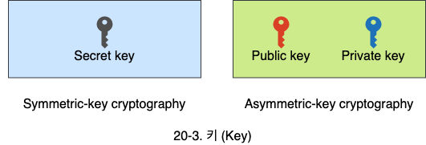
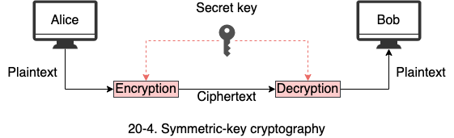
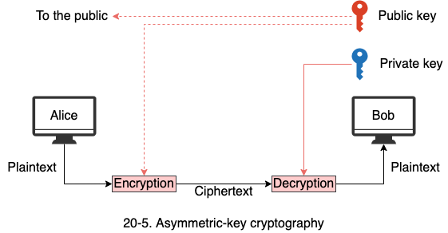
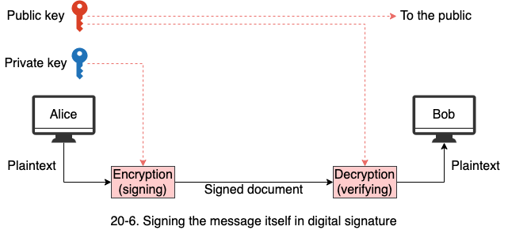
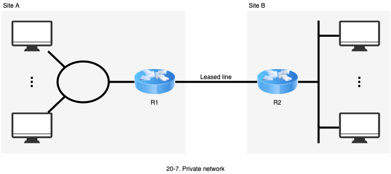
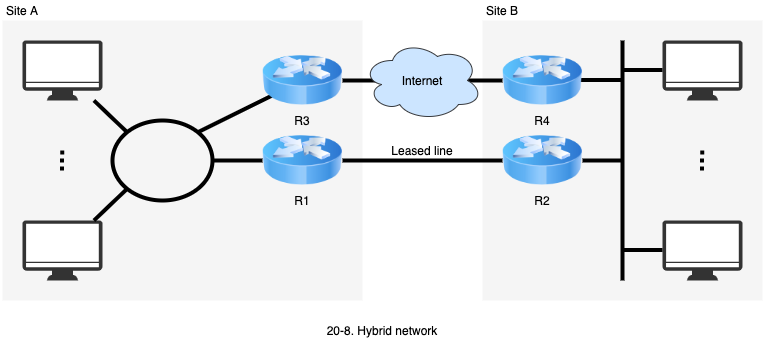
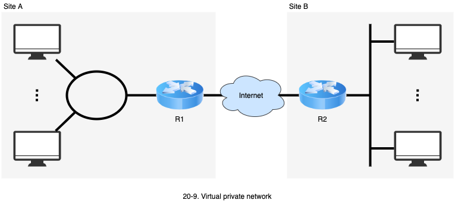

# 네트워크 보안

1. 보안 서비스
   - 메시지와 대상에 대한 4가지 보안 서비스
2. 암호
   - 대칭키 암호 방식과 공개키 암호 방식의 개념과 차이점
3. 디지털 서명
   - 디지털 서명의 필요성과 방법
4. 가상 사설 네트워크
   - VPN의 필요성과 효과

## 1. 보안 서비스

- 보안은 공격으로부터 안전하고 내성을 갖도록 메시지를 변환하는 과학입니다.
- 암호학은 메시지의 **기밀성**(Confidentiality), **무결성**(Integrity), **인증**(Authentication), **부인 방지**(Nonrepudiation)를 제공합니다.
  - 기밀성, 무결성, 인증, 부인 방지는 네트워크로 교환되는 메시지와 관련됩니다.
  - 인증은 대상에 대한 인증이나 식별을 제공합니다.

- **메시지 기밀성**: 송신자가 교환하는 메시지가 의도한 수신자에게만 유효할 것을 기대합니다.
- **메시지 무결성**: 수신자에게 메시지가 정확히 보낸 그대로 도착해야 한다는 것을 의미합니다.
  - 전송중에 우연히 혹은 의도적으로 변경이 없어야 합니다.
- **메시지 부인방지**: 송신자가 자신이 보냈던 메시지에 대해서 부인할 수 없어야 합니다.
- 인증은 데이터나 대상의 진실성을 확인하는 행위입니다.
  - 메시지 인증에서 수신자는 송신자가 맞다는 것을 식별할 필요가 있습니다. (남의 이름을 사칭하지 않았다는 것을 확신하는 행위)
  - 대상 이증(또는 사용자 인증)에서는 대상이나 사용자가 시스템 자원에 대한 접근을 하기 전에 확인하는 것입니다.

## 2. 암호

- 암호는 **Security writing**이란 의미로서 제 3자가 존재하는 상황에서 안전한 통신을 위한 기술입니다.
- 암호라는 행위는 **암호화**(Encryption)와 **복호화**(Decryption)를 둘 다 의미합니다.

- **평문**(Plaintext): 암호화 하기 전의 전문
- **암호문**(Ciphertext): 변형되어 암호화 된 메시지
- **암호화 알고리즘**: 평문을 암호문으로 변경하는 것
- **복호화 알고리즘**: 암호문을 다시 평문으로 변경하는 것

### 2.1 키 (Key)

- 키는 암/복호화 알고리즘의 기능적 출력을 결정하는 정보를 의미합니다.
- 메시지를 암호화 할 때 암호 알고리즘, 암호화 키, 평문이 필요합니다.
- 메시지를 복호화 할 때 복호 알고리즘, 복호화 키, 암호문이 필요합니다.
- 비밀 키는 대칭 키 암호 시스템에서 사용되며 손수신자가 공유합니다.
  - 대칭 키 암호 시스템의 대표적인 암호 알고리즘인 DES(Data Encryption Standard)
- 공개 키와 비밀 키는 비대칭 암호 시스템에서 사용됩니다.
  - 비대칭 키 암호 시스템의 대표적인 안호 알고리즘인 RSA(Rivest, Hamir, and Adleman)

### 2.2 대칭 키 암호 시스템 (Symmetric-key cryptography)

동일한 키가 송수신자에게 사용됩니다.

- 암호화 키와 복호화 키가 동일하며, 암호를 위해 송신자에서 사용되고 복호를 위해서 수신자에서 사용됩니다.
- 키는 공유됩니다.

### 2.3 비대칭 암호 시스템 (Asymmetric-key cryptography)

**공개 키 암호 시스템**(Public cryptography)으로 **비밀 키**(Private key)와 **공개 키**(Public key)가 별개로 사용됩니다.

- 비밀키(개인키)는 수신자가 갖고 있습니다.
- 공개키는 외부에 공개됩니다.

## 3. 디지털 서명

- 서명은 문서가 정확한 서명자가 작성했다는 것을 수신자에게 알여주는 증명입니다.
- 전자적 서명은 메시지의 송시자에 대한 신분 확인 역할을 함니다.
  - 송신자는 메시지와 서명을 보냅니다.
- 디지털 서명에서 서멍자는 자신의 비밀 키를 사용하여 문서에 서명(암호화) 합니다.
  - 증명자는 서명자의 공개 키를 사용하여 문서를 확인할 수 있습니다.

## 4. 가상 사설 네트워크 (VPN)

- VPN (Virtual private network)은 인터넷이나 타 기관의 네트워크를 사용하여 원격지의 컴퓨터나 네트워크를 연결하기 위한 기술입니다.
  - 보안 기술을 사용하여 외부 시스템은 접근 불가능 합니다.
  - VPN 사용자는 네트워크에 일댈일로 직접 연결된 것과 같은 효과를 줍니다.
  - 가정의 컴퓨터에서 직장의 시스템(내부 업무 시스템, 프린터, 파일, 내부 메일 등)을 사용할 수 있도록 해줍니다.
- 기관(혹은 회사)이 소유한 사설 네트워크는 전용선으로 연결되어 트레픽에 상관없이 비용이 지불 됩니다.

- 대부분의 기관은 인터넷 연결과 내부 네트워크를 보유하고 있습니다. 여러 사이트를 연결하기 위해서는 여러 개의 전용선이 필요합니다.

- VPN을 이용하면 사이트가 증가해도 여러 전용선이 필요 없습니다.

