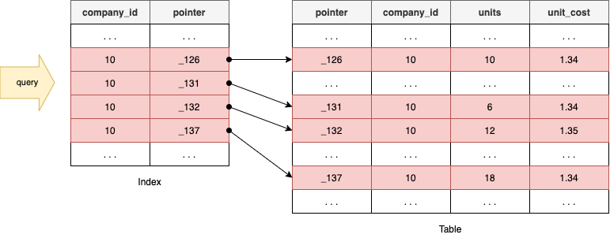

# Index

## 1. 인덱스란?

인덱스란 추가적인 쓰기 작업과 저장 공간을 활용하여 데이터베이스 테이블의 검색 속도를 향상시키기 위한 자료구조입니다. 데이터 베이스의 index는 책의 색인과 같으며, 데이터와 데이터의 위치를 포함한 자료구조를 생성하여 빠르게 조회헐 수 있도록 돕습니다. 인덱스를 활용하면 데이터를 조회하는 SELECT 이외에도 UPDATE나 DELETE의 성능이 함께 향상됩니다. 그러한 이유는 해당 연산을 수행하려면 해당 대상을 조회해야만 작업을 할 수 있기 때문입니다.

## 2. Index의 성능과 고려해야할 사항

SELECT 쿼리의 성능을 월등히 향상시키는 Index는 항상 좋은 것일까요? 쿼리문의 성능을 향상시킨다는데 모든 컬럼에 Index를 생성해두면 빠르지 않을까요? 결론부터 말하자면 그렇지 않습니다. 우선 첫 번째 이유는 Index를 생성하게 되면 INSERT, DELETE, UPDATE 쿼리문을 실행할 때 별도의 과정이 추가적으로 발생합니다. INSERT의 경우 Index에 대한 데이터도 추가해야 하므로 그만큼 성능에 손실이 따릅니다. DELETE의 경우 Index에 존재하는 값은 삭제하지 않고 사용 안한다는 표시로 남게 됩니다. 즉 Row의 수는 그대로인 것입니다. 이 작업이 반복되면 어떻게 될까요?

실제 데이터는 10만 건인데 데이터가 100만건 있는 결과를 낳을 수도 있습니다. 이렇게 되면 인덱스는 더 이상 제 역할을 못하게 되는 것입니다. UPDATE의 경우는 INSERT의 경우, DELETE의 경우의 문제점을 동시에 수반합니다. 이전 데이터가 삭제되고 새 데이터가 들어오는 개념이기 때문입니다. 즉 변경 전 데이터는 삭제되지 않고 INSERT로 인한 Split도 발생하게 됩니다.

하지만 더 중요한 것은 컬럼을 이루고 있는 데이터의 형식에 따라서 인덱스의 성능이 악영향을 미칠 수 있다는 것입니다. 즉, 데이터의 형식에 따라 인덱스를 만들면 효율적이고 만들면 비효율적인 것은 데이터의 형식에 존재한다는 것입니다. 어떤 경우 그럴까요?

이름, 나이, 성별 세가지의 필드를 가지고 있는 테이블을 생각해봅시다. 이름은 온갖 경우의 수가 존재할 것이며 나이는 INT 타입을 가질 것이고, 성별은 남/녀 두 가지 경우에 대해서만 데이터가 존재할 것입니다. 이 경우 어떤 컬럼에 대해서 인덱스를 생성하는 것이 효율적일까요? 결론부터 말하자면 이름에 대해서만 인덱스를 생성하면 효율적입니다.

왜 성별이나 나이는 인덱스를 생성하면 비효율적일까요? 10000 레코드에 해당하는 테이블에 대해서 2000 단위로 성별 인덱스를 생성한다고 가정합시다. 값의 Range가 적은 성별은 인덱스로 읽고 다시 한 번 디스크 I/O가 발생하기 때문에 그 만큼 비효율적입니다.

## 3. Index 자료 구조

### 2.1 B+-Tree 인덱스 알고리즘

일반적으로 사용되는 인덱스 알고리즘은 B+-Tree 알고리즘입니다. B+-Tree 인덱스는 칼럼의 값을 변형하지 않고(사실 값의 이부분만 잘라서 관리합니다), 원래의 값을 이용해 인덱싱하는 알고리즘입니다.

#### 2.1.1 B- Tree

각 Node에는 여러개의 Key를 갖고 있고 각 Key에 대응하는 Data도 함께 가지고 있습니다. B-tree는 균형트리이기 때문에 어떤 값에 대해서도 같은 시간에 결과를 얻을 수 있습니다(트리 높이가 다른 경우, 약간의 차이는 있겠지만 O(logN)이라는 시간 복잡도를 구할 수 있습니다). 그러나, B-tree 처음 생성 당시는 균형 트리이지만 테이블 갱신(INSERT/UPDATE/DELETE)의 반복을 통해 서서히 균형이 깨지고, 성능도 악화됩니다. 어느 정도 자동으로 균형을 회복하는 기능이 있지만, 갱신 빈도가 높은 테이블에 작성되는 인덱스 같은 경우 인덱스 재구성을 해서 트리의 균형을 되찾는 작업이 필요합니다.

B-tree는 Binary search tree와 유사하지만, 한 노드 당 자식 노드가 2개 이상 가능합니다. 또한 하나의 Node에 여러개의 Key을 가지고 있기 때문에 Block 단위로 Data를 Read/Write하는 Data 환경에서는 Binary Search Tree 보다는 B- Tree를 이용하는 것이 유리합니다.

#### 2.1.2 B+ Tree

B+ Tree는 B- Tree를 개량한 Tree입니다. B- Tree 처럼 모든 Leaf Node는 동일한 Depth를 갖습니다. B- Tree와의 가장 큰 차이점은 Inner Node에는 Key만 저장되고, Leaf Node에 Key와 Data를 함께 저장한다는 점입니다. 리프노드들은 LinkedList로 연결되어 있다. 데이터베이스의 인덱스 컬럼은 부등호를 이용한 순차 검색 연산이 자주 발생될 수 있다. 이러한 이유로 BTree의 리프노드들을 LinkedList로 연결하여 순차검색을 용이하게 하는 등 B- Tree를 인덱스에 맞게 최적화하였다. (물론 Best Case에 대해 리프노드까지 가지 않아도 탐색할 수 있는 B- Tree에 비해 무조건 리프노드까지 가야한다는 단점도 있다.)

### 2.2 Hash 인덱스 알고리즘

칼럼의 값으로 해시 값을 계산해서 인덱싱하는 알고리즘으로 매우 빠른 검색을 지원합니다. 하지만 값을 변형해서 인덱싱하므로, 특정 문자로 시작하는 값으로 검색을 하는 등 전방 일치와 같이 값의 일부분만으로 검색하고자 할 때는 해시 인덱스를 사용할 수 없습니다. 주로 메모리 기반의 데이터베이스에서 많이 사용합니다.

## 3. 왜 Index를 생성하는 B- Tree를 사용하는가?

데이터에 접근하는 시간 복잡도가 O(1)인 Hash Table이 더 효율적인 것 같은 생각이 듭니다. SELECT 질의의 조건에는 부등호(`<>`) 연산도 포함됩니다. Hash Table을 사용하게 된다면 등호(`=`) 연산이 아닌 부등호 연산의 경우에 문제가 발생합니다. 동등 연산(`=`)에 특화된 Hash Table은 데이터베이스의 자료구조로 적합하지 않습니다.

## 4. Primary Index vs Secondary Index

**클러스터**(Cluster)란 여러 개를 하나로 묶는다는 의미로 주로 사용되는데, 클러스터드 인덱스도 크게 다르지 않습니다. 인덱스에서 클러스터드는 비슷한 것들을 묶어서 저장하는 형태로 구현되는데, 이는 주로 비슷한 값들을 동시에 조회하는 경우가 많다는 점에서 착안된 것 입니다. 여기서 비슷한 값들은 물리적으로 인접한 장소에 저장되어 있는 데이터들을 말합니다.

클러스터드 인덱스는 테이블 프라이머리 키에 대해서만 적용되는 내용입니다. 즉 프라이머리 키 값이 비슷한 레코드끼리 묶어서 저장하는 것을 클러스터드 인덱스라고 표현합니다. 클러스터드 인덱스에서 프라이머리 키 값에 의해 레코드의 저장 위치가 결정되며 프라이머리 키 값이 변경되면, 그 레코드의 물리적인 저장 위치 또한 변경되어야 합니다. 그렇기 때문에 프라이머리 키를 신중하게 결정하고 클러스터드 인덱스를 사용해야 합니다.

클러스터드 인덱스는 테이블 당 한 개만 생성할 수 있습니다. 프라이머리 키에 대해서 적용되기 때문입니다. 이에 반해 non 클러스터드 인덱스는 테이블당 여러개를 생성할 수 있습니다.

## 6. 출처

- [Interview_Question_for_Beginner - JaeYeopHan](https://github.com/JaeYeopHan/Interview_Question_for_Beginner/tree/master/Database#index)
- [[Database] 인덱스(index)란? - 망나니개발자](https://mangkyu.tistory.com/97)
- [B-Tree, B+ Tree - Ssup2 Blog](https://ssup2.github.io/theory_analysis/B_Tree_B+_Tree/)
- [[MySQL] B-tree, B+tree란? (인덱스와 연관지어서) - Carry On Programming](https://zorba91.tistory.com/293)
