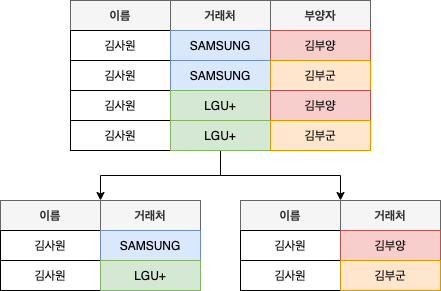

# 정규화에 대해서

한 릴레이션에서 여러 엔티티의 애트리뷰트들을 혼합하게 되면 정보가 중복 저장되며, 저장 공간을 낭비하게 됩니다. 또 중복된 정보로 인해 갱신 이상이 발생하게 됩니다. 동일한 정보를 한 릴레이션에는 변경하고, 나머지 릴레이션에서는 변경하지 않는 경우 어느 것이 정확한지 알 수 없게 되는 것입니다. 이러한 문제를 해결하기 위해 정규화 과정을 거치는 것입니다.

## 1. 갱신 이상

- **삽입 이상**(Insertion anomalies): 원하지 않는 자료가 삽입된다든지, 삽입하는데 자료가 부족해 삽입이 되지 않아 발생하는 문제점을 말합니다.
- **삭제 이상**(Deletion anomalies): 하나의 자료만 삭제하고 싶지만, 그 자료가 포함된 튜플 전체가 삭제됨으로 원하지 않는 정보 손실이 발생하는 문제점을 말합니다.
- **수정(갱신) 이상**(Modification anomalies): 정확하지 않거나 일부의 튜플만 갱신되어 정보가 모호해지거나 일관성이 없어져 정확한 정보 파악이 되지 않는 문제점을 말합니다.

## 2. 정규화

관계형 데이터베이스에서 중복을 최소화하기 위해 데이터를 구조화하는 작업입니다. 좀 더 구체적으로 불만족스러운 나쁜 릴레이션의 애트리뷰트들을 나누어서 작고 좋은 릴레이션으로 분해하는 작업을 말합니다. 정규화 광정을 거치게 되면 정규형을 만족하게 됩니다. 정규형이란 특정 조건을 만족하는 릴레이션의 스키마의 형태를 말하며 제 1 정규형, 제 2 정규형, 제 3 정규형 등이 존재합니다.

### 2.1 나쁜 릴레이션

엔티티를 구성하고 있는 애트리뷰트 간에 **함수적 종속성**(Functional Dependency)을 판단합니다. 판단된 함수적 종속성은 좋은 릴레이션 설계의 전형적 기준으로 사용됩니다. 즉, 각각의 정규형마다 어떠한 함수적 종속성을 만족하는지에 따라 정규형이 정의되고, 그 정규형을 만족하지 못하는 릴레이션을 나쁜 릴레이션이라고 파악합니다.

### 2.2 함수적 종속성

함수적 종속성이랑 애트리뷰트 데이터들의 의미와 애트리뷰트들 간의 상호 관계로부터 유도되는 제약조건의 일종입니다. 함수적 종속이란 어떤 릴레이션 R이 있을 때 X와 Y를 각각 속성의 부분집합이라고 가정해 봅니다. 여기서 X의 값을 알면 Y의 값을 바로 식별할 수 있고, X의 값에 Y의 값이 달라질 때, Y는 X에 함수적 종속이라고 합니다. 이 경우 X를 **결정자**, Y를 **종속자**라고 합니다. 이를 기호로 표현하면 `X -> Y` 입니다. 이런 함수적 종속관계에는 **완전 함수적 종속**, **부분 함수적 종속**, **이행적 함수 종속**이 있습니다.

- **완전 함수적 종속**(Full Functional Dependency): 어떤 릴레이션 R에서 속성 Y가 다른 속성 집합 X 전체에 대해 함수적 종속이면서 속성 집합 X의 어떠한 진부분 집합 Z에도 함수적 종속이 아닐 때, 속성 Y는 속성집합 X에 대해 완전 함수적 종속이라 합니다. 여러 개의 속성이 모여서 하나의 기본키를 이룰 경우 기본키 전체가 있어야지만 어떤 속성이 결정될 때 완전 함수적 종속입니다.
- **부분 함수적 종속**(Partial Functional Dependency): 어떤 릴레이션 R에서 속성 Y가 다른 속성 집합 X 전체에 대해 함수적 종속이면서 속성 집합 X의 진부분 집합에 대해 함수적 종속일 때, 속성 Y는 속성 집합 X에 부분 함수적 종속이라 한다. 여러 개의 속성이 모여서 하나의 기본키를 이룰 경우, 기본키를 구성하는 부분 속성만으로도 결정되어지면 부분 함수적 종속입니다.
- **이행적 함수 종속**(Transitive Functional Dependency): 릴레이션에서 X, Y, Z라는 3개의 속성이 있을 때, `X -> Y`, `Y -> Z`란 종속 관계가 있을 경우, `X -> Z`가 성립될 때 이행적 함수 종속이라고 합니다. X를 알면 Y를 알고 그 Y를 통해 Z를 알 수 있는 경우를 말합니다.

## 3. 정규형

정규화는 테이블의 속성들이 상호 종속적인 관계를 같는 특성을 이용하여 테이블을 **무손실 분해**(나뉘어진 2개의 관계를 합쳤을 때, 원래 가지고 있던 테이블에서 어떠한 데이터 손실이 없다는 것을 의미) 하는 과정입니다. 부분 집합들은 함수적 종속성을 보존해야 합니다.

### 3.1 제 1 정규형

애트리뷰트의 도메인이 오직 **원자값**만을 포함하고, 튜플의 모든 애트리뷰트가 도메인에 속하는 하나의 값을 가져야합니다. 즉, 복합 애트리뷰트, 다중 애트리뷰트, 중첩 릴레이션 등 비 원자적인 애트리뷰트들을 허용하지 않는 릴레이션 형태를 말합니다.

#### 3.1.1 애트리뷰트 종류

- **단순 애트리뷰트**: 더이상 분해할 수 없는 애트리뷰트를 말합니다. (학년, 전화번호는 더이상 분해할 수 없습니다.)
- **복합 애트리뷰트**: 더 분해할 수 있는 애트리뷰트를 말합니다. (주소는 도, 시 , 동 등으로 분해할 수 있습니다.)
- **단일 값 애트리뷰트**: 하나의 애트리뷰트가 하나의 값을 가질 수 있을 떄 말하빈다.
- **다중 값 애트리뷰트**: 하나의 애트리뷰트가 여러 값을 가질 수 있을 떄 말합니다. (이메일 주소를 여러 개 가질 수 있는 경우가 있습니다.)

### 3.2 제 2 정규형

모든 비주요 애트리뷰트들이 주요 애트리뷰트에 대해서 완전 함수적 종속이면 제 2 정규형을 만족한다고 볼 수 있습니다. 즉, 키가 아닌 열들이 각각 후보키에 대해 결정되는 릴레이션 형태를 말합니다.

### 3.3제 3 정규형

어떠한 비주요 애트리뷰트도 기본키에 대해서 이행적으로 종속되지 않으면 제 3 정규형을 만족한다고 볼 수 있습니다. 즉 비주요 애트리뷰트가 비주요 애트리뷰트에 의해 종속되는 경우가 없는 릴레이션 형태를 말합니다.

### 3.4 BCNF(Boyce-codd) 정규형

여러 후보 키가 존재하는 릴레이션에 해당하는 정규화 내용입니다. 복잡한 식별자 관계에 의해 발생하는 문제를 해결하기 위해 제 3 정규형을 보완하는데 의미가 있습니다. 모든 결정자가 후보키 집합에 속한 정규형입니다. 각 정규형은 그의 선행 정규형보다 더 엄격한 조건을 갖습니다.

- 모든 제 2 정규형 릴레이션은 제 1 정규형을 갖습니다.
- 모든 제 3 정규형 릴레이션은 제 2 정규형을 갖습니다.
- 모든 BCNF 정규형 릴레이션은 제 3 정규형을 갖습니다.

### 3.5 제 4 정규형

다치 종속성을 제거하고, 특정 속성값에 따라 선택적인 속성들을 분리합니다.

#### 3.5.1 다치 종속성

릴레이션 R의 속성 X, Y, Z가 있을 때, (X, Y)에 대응하는 Z의 집합이 X 값에만 종속되고, Y 값에는 무관하면 Z는 X에 다치종속이라고 합니다. 다치 종속은 다중 값 애트리뷰트를 가지지 못하게하는 제 1 정규형의 함수 종속성에 기인합니다.

### 3.6 제 5 정규형

테이블의 모든 조인 종속은 후보키를 통해서만 성립됩니다. 조인 종속은 테이블을 분해한 결과를 다시 존인했을 때 테이블과 동일하게 복원되는 제약조건입니다.

## 4. 정규화의 장점

1. **데이터베이스 변경 시 이상 현상(Anomaly) 제거**: 위에서 언급했던 각종 이상 현상들이 발생하는 문제점을 해결할 수 있습니다.
2. **데이터베이스 구조 확장 시 새 디자인 최소화**: 정규화된 데이터베이스 구조에서는 새로운 데이터 형의 추가로 인한 확장 시, 그 구조를 변경하지 않아도 되거나 일부만 변경해도 됩니다. 이는 데이터베이스와 연동된 응용 프로그램에 최소한의 영향만을 미치게 되며 응용프로그램의 생명을 연장시킵니다.
3. **사용자에게 데이터 모델을 더욱 의미있게 제공**: 정규화된 테이블과 정규화된 테이블간의 관계들은 현실 세계에서의 개념들과 그 들간의 관계를 반영합니다.

## 5. 정규화의 단점

릴레이션의 분해로인해 릴레이션 간의 연산(JOIN)이 많아집니다. 이로 인해 질의에 대한 응답 시간이 느려질 수 있습니다. 조금 덧붙이자면, 정규화를 수행한다는 것은 데이터를 결정하는 결정자에 의해 함수적 종속을 가지고 있는 속성을 의존자로 하여 입력/수정/삭제 이상을 제거하는 것입니다. 데이터 중복 속성을 제거하고 결정자에 의해 동일한 의미의 일반 속성이 하나의 테이블로 집약되므로 한 테이블의 데이터 용량이 최소화 되는 효과가 있습니다. 따라서 정규화된 테이블은 데이터 처리 속도가 빨라질 수도 있고 느려질 수도 있는 특성이 있습니다.

## 6. 반정규화 진행 시점

SQL 문자에서 조인이 많이 발생하여 이로 인한 성능 저하가 나타나는 경우에 반정규화를 적용하는 전략이 필요합니다.

### 6.1 반정규화(De-normalization, 비정규화)

비정규화는 정규화된 엔티티, 속성, 관계를 시스템의 성능 향상 및 개발과 운영의 단순화를 위해 중복 통합, 분리 등을 수행하는 데이터 모델링 기법 중 하나입니다. 디스크 I/O량이 많아서 조회 시 성능이 저하되거나, 테이블끼리 경로가 너무 멀어 조인으로 인한 성능 저하가 예상되거나, 칼럼을 계산하여 조회할 떄 성능이 저하될 것이 예상되는 경우 반정규화를 수행하게 됩니다. 일반적으로 조회에 대한 처리 성능이 중요하다고 판단될 때 부분적으로 비정규화를 고려하게 됩니다.

### 6.2 반정규화 대상

1. 자주 사용되는 테이블에 엑세스하는 프로세스의 수가 가장 많고, 항상 일정한 범위만을 조회하는 경우
2. 테이블에 대량 데이터가 있고 대량의 범위를 자주 처리하는 경우, 성능 상 이슈가 있을 경우
3. 테이블에 지나치게 조인을 많이 사용하게 되어 데이터 조회하는 것이 기술적으로 어려울 경우

### 6.3 반경규화 주의사항

반경규화를 과도하게 적용하다보면 데이터의 무결성이 깨질 수 있습니다. 또한 입력, 수정, 삭제의 질의문에 대한 응답 시간이 늦어질 수 있습니다.

## 7. 출처

- [함수적 종속(Functional Dependency) - dodo000](https://dodo000.tistory.com/20)
- [데이터베이스 애트리뷰트 종류(단순, 복합, 유도, NULL) - 나다움](https://life-with-coding.tistory.com/279)
- [제10절 정규화 - LIB](https://m.blog.naver.com/gkenq/220739794662)
