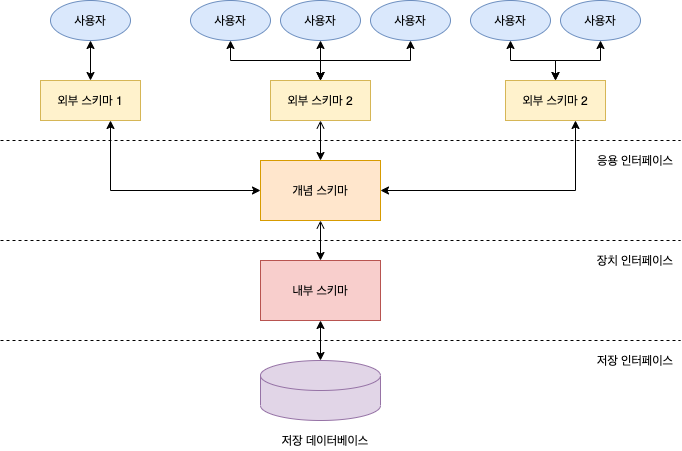

# Schema

데이터 베이스의 구조와 제약조건에 관해 전반적인 명세를 기술한 것입니다. 즉, DB내 어떤 구조로 데이터가 저장되는가를 나타내는 데이터베이스 구조를 스키마라고 합니다.

- 개체의 특성을 나타내는 **속성**(Attribute)
- 속성들의 집합으로 이루어진 **개체**(Entity)
- 개체 사이에 존재하는 **관계**(Relation)
- 이들이 유지해야 할 **제약조건**

## 1. 특징

1. 스키마는 **데이터 사전**(Data Dictionary)에 저장됩니다. 데이터 사전이란 시스템 전체에서 나타나는 데이터 항목들에 대한 정보를 지정한 중앙 저장소입니다. 이 정보에는 항목을 참조하는데 사용되는 식별자, 항목에 대한 엔티티의 구성요소, 항목이 저장되는 곳, 항목을 참조하는 곳 등을 포함합니다.
2. 현실 세계의 특정한 한 부분의 표현으로서 특정 데이터 모델을 이용해서 만들어지게 됩니다.
3. 시간에 따라 불변인 특성을 갖습니다. (시불변성)
4. 데이터의 구조적 특성을 의미합니다.
5. 인스턴스(실제 데이터, 테이블의 각 행을 의미)에 의해 규정됩니다.

## 2. 개념 스키마(Conceptual Schema) = 전체적인 뷰(View)

- 데이터 베이스의 전체적인 논리적 구조이며, 조직체 전체를 관장하는 입장에서 DB를 정의한 것입니다.
- 조직의 모든 응용시스템에서 필요로 하는 개체 관계, 그리고 제약조건들을 포함하고 있게 됩니다.
- DB를 효율적으로 관리하는데 필요한 접근권한, 보안정책, 무결성 규칙등에 관한 사항들도 추가적으로 포함됩니다.
- 따라서 단순한 스키마라고 하면 개념스키마를 의미하기도 하며, DB 전체를 기술한 것이기 때문에 한 개밖에 존재할 수 없습니다.
- 데이터베이스 관리자(DBA)에 의해 구성됩니다.

## 3. 내부 스키마(Internal Schema) = 저장 스키마(Storage Schema)

- 물리적인 저장장치 입장에서 DB가 저장되는 방법을 기술한 구조로, 물리적인 저장장치와 밀접한 계층입니다.
- 구체적으로 개념 스키마를 디스크 기억장치에 물리적으로 구현하기 위한 방법을 기술한 것으로 주된 내용은 실제로 저장될 내부레코드 형식, 내부레코드의 물리적 순서, 인덱스의 유/무 등에 관한 것입니다.
- DB는 내부 스키마에 의해서 곧바로 구현되는 것이 아니라 내부 스키마에 기술한 내용에 따라 운영체제의 파일시스템에 의해 물리적 저장장치에 기록합니다.
- 실무적으로 내부스키마에 의해 DB의 실행 속도가 결정적으로 영향을 받기 때문에 DB의 구축목적에 따라 내부 스키마를 결정해야 할 필요가 있습니다.
- 시스템 프로그래머나 시스템 설계자가 보는 관점의 스키마입니다.

## 4. 외부 스키마(External Schema) = 사용자 뷰(View)

- 사용자나 응용프로그래머가 각 개인의 입장에서 필요로 하는 데이터베이스의 논리적 구조를 정의한 것이다
- 전체 데이터베이스의 한 논리적인 부분으로 볼 수 있으므로 서브 스키마(Sub Schema)라고도 한다.
- 하나의 데이터베이스에는 여러 개의 외부 스키마가 존재 가능하고, 하나의 외부스키마를 여러 개의 응용 프로그램이나 사용자가 공용 가능합니다.
- 같은 데이터베이스에 대해서도 서로 다른 관점으로 정의할 수 있도록 허용합니다.
- 일반 사용자는 질의어를 이용해 DB를 쉽게 사용할 수 있습니다.

## 5. 출처

- [[DB기초] 스키마란 무엇인가? - 코딩팩토리](https://coding-factory.tistory.com/216)
- [스키마란? (개념스키마, 내부스키마, 외부스키마) - 개발자를 꿈꾸는 프로그래머](https://jwprogramming.tistory.com/47)
