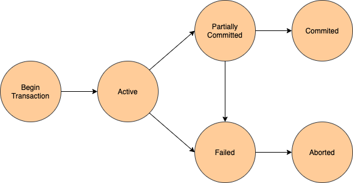

# Transaction

트랜잭션은 작업의 **완전성**을 보장해주는 것입니다. 즉, 논리적인 작업 셋을 모두 완벽하게 처리하거나 또는 처리하지 못할 경우에는 원 상태로 복구해서 작업의 일부만 적용되는 현상이 발생하지 않게 만들어주는 기능입니다. 사용자의 입장에서는 작업의 논리적 단위로 이해할 수 있고, 시스템의 입장에서는 데이터들을 접근 또는 변경하는 프로그램의 단위가 됩니다.

## 1. Transaction and Lock

**잠금**(Lock)과 트랜잭션은 서로 비슷한 개념 같지만 사실 잠금은 동시성을 제어하기 위한 기능이고, 트랜잭션은 데이터의 정합성을 보장해주기 위한 기능입니다. 잠금은 여러 커넥션에서 동시에 동일한 자원을 요청할 경우 순서대로 한 시점에는 하나의 커넥션만 변경할 수 있게 해주는 역할을 합니다. 여기서 자원은 레코드나 테이블을 말합니다. 이와는 조금 다르게 트랜잭션은 꼭 여러 개의 변경 작업을 수행하는 쿼리가 조합되었을 때만 의미있는 개념은 아닙니다. 트랜잭션은 하나의 논리적인 작업 셋 중 하나의 쿼리가 있든 두 개 이상의 쿼리가 있든 관계없이 논리적인 작업 셋 자체가 100% 적용되거나 아무것도 적용되지 않아야 함을 보장하는 것입니다. 예를 들면 HW 에러 또는 SW 에러와 같은 문제로 인해 작업에 실패가 있을 겨우, 특별한 대책이 필요하게 되는데 이러한 문제를 해결하는 것입니다.

## 2. 트랜잭션의 특성

### 2.1 원자성 (Atomicity)

만약 트랜잭션 중간에 어떠한 문제가 발생한다면 트랜잭션에 해당하는 어떠한 작업 내용도 수행되어서는 안되며 아무런 문제가 발생되지 않았을 경우에만 모든 작업이 수행되어야 합니다.

### 2.2 일관성 (Consistency)

트랜잭션이 완료된 다음의 상태에서도 트랜잭션이 일어나기 전의 상황과 동일하게 데이터의 일관성을 보장해야 합니다.

### 2.3 고립성 (Isolation)

각각의 트랜잭션은 서로 간섭없이 독립적으로 수행되어야 합니다.

### 2.4 지속성 (Durability)

트랜잭션이 정상적으로 종료된 다음에는 영구적으로 데이터베이스에 작업의 결과가 저장되어야 합니다.

## 3. 트랙잭션의 상태

- **Active**: 트랜잭션 활동 상태. 트랜잭션이 실행중이며 동작중인 상태를 말합니다.
- **Failed**: 트랜잭션 실패 상태. 트랜잭션이 더이상 정상적으로 진행 할 수 없는 상태를 말합니다.
- **Partially Committed**: 트랜잭션의 Commit 명령이 도착한 상태. 트랜잭션의 `commit` 이전 `sql`문이 수행되고 `commit`만 남은 상태를 말합니다.
- **Committed**: 트랜잭션 완료 상태. 트랜잭션이 정상적으로 완료된 상태를 말합니다.
- **Aborted**: 트랜잭션 취소 상태. 트랜잭션이 취소되고 트랜잭션 실행 이전 데이터로 돌아간 상태를 말합니다.

### 3.1 Partially Committed와 Committed

Commit 요청이 들어오면 상태는 Partial Commited 상태가 됩니다. 이후 Commit을 문제없이 수행할 수 있으면 Committed 상태로 전이되고, 만약 오류가 발생하면 Failed 상태가 됩니다. 즉 Partial Committed는 Commit 요청이 들어왔을 때를 말하며, Committed는 Commit을 정상적으로 완료한 상태를 말합니다.

## 4. 트랜잭션을 사용할 때 주의할 점

트랜잭션은 꼭 필요한 최소의 코드에만 적용하는 것이 좋습니다. 즉 트랜잭션의 범위를 최소화하라는 의미입니다. 일반적으로 데이터베이스 커넥션은 개수가 제한적입니다. 그런데 각 단위 프로그램이 커넥션을 소유하는 시간이 길어진다면, 사용 가능한 여유 커넥션의 개수는 줄어들게 됩니다. 그러다 어느 순간에 각 단위 프로그램에서 커넥션을 가져가기 위해 기다려야 하는 상황이 발생할 수도 있습니다.

### 4.1 교착상태

복수의 트랜잭션을 사용하다보면 교착상태가 일어날 수 있습니다. 교착상태란 두 개 이상의 트랜잭션이 특정 자원(테이블 또는 행)의 잠금(Lock)을 획득한 채 다른 트랜잭션이 소유하고 있는 잠금을 요구하면 아무리 기다려도 상황이 바뀌지 않는 상태가 되는데, 이를 **교착상태**라고 합니다.

### 4.2 교착 상태의 빈도를 낮추는 방법

- 트랜잭션을 자주 커밋합니다.
- 정해진 순서로 테이블에 접근합니다. 트랜잭션들이 동일한 테이블 순으로 접근하게 합니다.
- 읽기 잠근 획득의 사용을 피합니다.
- 한 테이블의 복수 행을 복수의 연결에서 순서 없이 갱신하면 교착상태가 발생하기 쉽습니다. 이 경우에는 테이블 단위의 잠금을 획득해 갱신을 직렬화 하면 동시성이 떨어지지만 교착상태를 회피할 수 있습니다.
