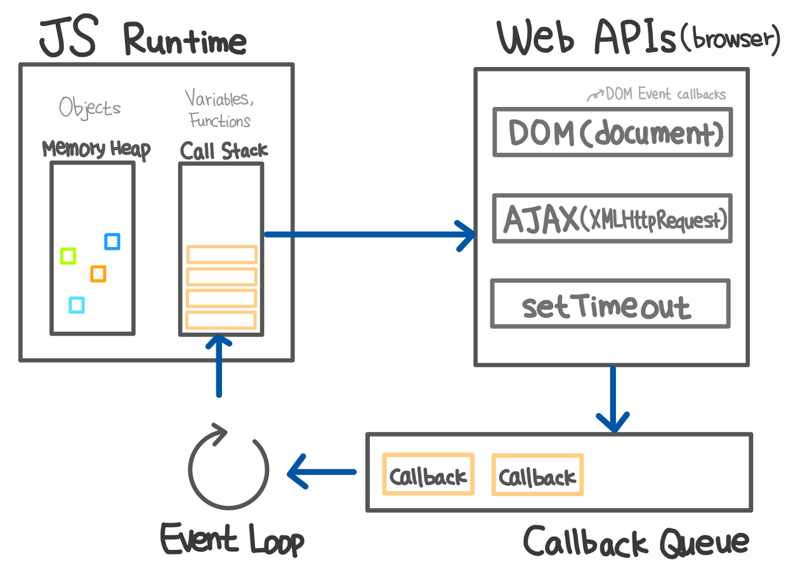

# Event Loop

## 1. Call Stack

자바스크립트는 기본적으로 싱글 스레드 프로그래밍 언어입니다. 여기서 싱글 스레드라는 것은 한 번에 하나의 작업만 할 수 있다는 뜻입니다. **Call Stack**은 프로그램 상에서 우리가 어떤 순서로 작업을 수행하는지 기록하는 작업 스케줄링과 관련된 자료구조입니다. 우리가 어떤 함수를 실행하게 되면 우리는 그 함수를 스택의 맨 위에 놓는데, 이것을 `push`라고 합니다. 만약에 함수가 어떤 값을 리턴하거나 실행을 종료하면 우리는 다시 그 함수를 스택 맨 위에서부터 꺼내는데 이것을 `pop`이라고 합니다. 이러한 구조로 함수가 호출되기 때문에 만약에 우리가 잘못해서 무한 호출되는 재귀 함수를 실행시키면 스택에 함수 호춯이 계속해서 쌓이다가 **Maximum Call Stack Size Exceeded**라는 에러 메시지를 만나게 됩니다.


## 2. Event Loop

자바스크립트는 이렇게 싱글 스레드 언어이기 때문에, 함수를 실행하면 함수 호출이 스택에 순차적으로 쌓이고 스택의 맨 위에서부터 차례대로 한 번에 하나의 함수만 처리할 수 있습니다. 간단한 프로그램이라면 상관없지만 만약에 우리가 아주 복잡한 프로그램을 구동한다면, 시간이 매우 오래 걸리는 작업이 스택에 쌓이고 실행되면 그 다음 작업은 **무한정 대기**할 수밖에 없습니다. 이렇게 다른 작업을 실행하기 위해서 이 전 작업이 완료될 때까지 기다려야만 하는 상황을 **블로킹**이라고 합니다. 이러한 점을 극복하기 위한 해결 방안이 바로 **비동기 콜백**(Asynchronous Callback)입니다. 자바스크립트가 싱글 스레드 언어임에도 불구하고 우리가 웹 사이트에서 끊임없이 여러 작업을 동시에 할 수 있는 것은 바로 브라우저가 Web APIs 같은 것들을 제공하여 비동기 작업을 가능하게 해주기 때문입니다.



우리가 AJAX나 setTimeout 혹은 DOM event 함수를 실행하면 자바스크립트 엔진은 **Call Stack**에서 **Web APIs**로 보내지고 정해진 시간 혹은 이벤트가 발생하는 순간에 순차적으로 **Callback Queue**에 적재합니다. **Callback Queue**에 줄을 선 함수들은 **Call Stack**에 쌓여있던 것들이 모두 제거되어 깨끗해지면 차례대로 스택에 쌓여서 실행됩니다. 이 점을 항상 유의해야합니다. 자바스크립트가 단일 스레드 기반의 언어라는 말은, 자바스크립트 엔진이 단일 호출 스택을 사용한다는 관점에서만 사실입니다. 실제 자바스크립트가 구동되는 환경에서는 주로 여러 개의 스레드가 사용되며, 이러한 구동 환경이 단일 호출 스택을 사용하는 자바 스크립트 엔진과 상호 연동하기 위해 사용하는 장치가 바로 **이벤트 루프(Event Loop)** 입니다.

## 3. setTimeout(fn, 0)

프론트엔드 환경의 자바스크립트 코드를 보다 보면 `setTimeout(fn, 0)`와 같은 코드를 종종 보게됩니다. 관용적으로 쓰이는 코드이지만, 사실 처음 보는 사람에게는 직관적으로 이해하기 힘든 코드일 것입니다. 실제 이 코드는 그냥 `fn`을 실행하는 것과는 상당히 다른 결과를 가져옵니다. 위에서 보았겠지만 `setTimeout` 함수는 콜백 함수를 바로 실행하지 않고 **Callback Queue**에 추가합니다. 그렇기 때문에 아래의 코드는 콘솔에 B -> A 순서로 출력하게 됩니다.

```javascript
setTimeout(function () {
  console.log("A");
}, 0);
console.log("B");
```

프론트엔드 환경에서는 렌더링 엔진과 관련해서 이런 코드가 특히 요긴하게 쓰일 때가 있습니다. 브라우저 환경에서는 자바스크립트 엔진뿐만 아니라 다른 여러 가지 프로세스가 함께 구동되고 있습니다. 렌더링 엔진도 그 중의 일부이며, 이 렌더링 엔진의 태스크는 대부분의 브라우저에서 자바스크립트 엔진과 동일한 단일 **Callback Queue**를 통해 관리됩니다. 이로 인해 가끔 예상치 못한 문제가 생길 경우가 있습니다.

```javascript
showWaitingMessage();
longTakingProcess();
hideWaitingMessage();
showResult();
```

`longTakingProcess`가 너무 오래 걸리는 작업이기 때문에 그 전에 `showWaitingMessage`를 호출해서 로딩 메시지를 보여주려고 합니다. 하지만 실제로 이 코드를 실행해 보면 화면에 로딩 메시지가 표시되는 일은 없습니다. 그 이유는 `showWaitingMessage` 함수의 실행이 끝나고 렌더링 엔진이 렌더링 요청을 보내도, 해당 요청은 **Callback Queue**에서 이미 실행중인 태스크가 끝나기를 기다리고 있기 때문입니다. 실행중인 태스크가 끝나는 시점은 호춣 스택이 비워지는 시점인데, 그 때는 이미 `showResult`까지 실행이 끝나 있을 것이고, 결국 렌더링이 진행되는 시점에는 `hideWaitingMessage`로 인해 로딩 메시지가 숨겨진 상태일 것입니다. 이를 해결하기 위해서 `setTimeout`를 사용할 수 있습니다.

```javascript
showWaitingMessage();
setTimeout(function () {
  longTakingProcess();
  hideWaitingMessage();
  showResult();
}, 0);
```

이 경우에는 `longTakingProcess`가 바로 실행되지 않고 **Callback Queue**에 추가될 것입니다. 하지만 `showWaitingMessage`로 인해 **Callback Queue**에는 렌더링 요청이 먼저 추가되기 때문에 `longTakingProcess`는 그 다음 순서로 **Callback Queue**에 추가될 것입니다. 이제 이벤트 루프는 **Callback Queue**에 있는 렌더링 요청을 먼저 처리하게 되고 로딩 메시지가 먼저 화면에 보여지게 됩니다.

꼭 렌더링 관련이 아니라도, 실행이 너무 오래 걸리는 코드를 `setTimeout`을 사용하여 적절하게 다른 테스크로 나누어 주면 전체 어플리케이션이 멈추거나 스크립트가 너무 느리다며 경고창이 뜨는 상황을 방지할 수 도 있습니다. 한가지 짚고 넘어갈 사실은 `0`이라는 숫자가 실제롤 **즉시**를 의미하지 않는다는 점입니다.

## 4. Promise

```javascript
setTimeout(function () {
  console.log("A");
}, 0);

Promise.resolve()
  .then(function () {
    console.log("B");
  })
  .then(function () {
    console.log("C");
  });
```

콘솔에 찍히는 순서는 B -> C -> A 입니다. 이유는 바로 Promise가 마이크로 태스크를 사용하기 때문입니다. 마이크로 태스크는 쉽게 말해 일반 태스크보다 더 높은 우선순위를 갖는 태스크라고 할 수 있습니다. 즉, **Callback Queue**에 대기중인 태스크가 있더라도 마이크로 태스크가 먼저 실행됩니다. 위의 예제를 통해 좀더 자세히 알아봅시다. `setTimeout()` 함수는 콜백 A를 **Callback Queue**에 추가하고, Promise의 `then()` 메소드는 콜백 B를 **Callback Queue**가 아닌 **마이크로 태스크 큐**에 추가합니다. 위의 코드의 실행이 끝나면 이벤트 루프는 **Callback Queue** 대신 **마이크로 태스크 큐**가 비었는지 먼저 확인하고, 큐에 있는 콜백 B를 실행합니다.

## 5. 추가사항

이벤트 루프는 실제로 자바스크립트 언어의 명세보다는 구동 환경과 더 관련된 내용이기 때문에 다른 프로세스들(렌더링, IO등)과 밀접하게 연관되어 있어 잘 정리된 자료를 찾기가 쉽지 않습니다. 또한 Node.js의 libuv는 HTML 스펙을 완벽히 따르지 않기 때문에 브라우저 환경의 이벤트 루프와 상세 구현이 조금씩 다릅니다. 심지어 브라우저 별로도 구형이 조금씩 다릅니다. 또한, 최근에는 ES6에 Promise와 잡 큐라는 항목이 추가되며 마이크로 테스크의 개념과 혼동되며 이해하기 한 층 더 복잡해졌습니다. 여기서 끝이 아닙니다. 사실 이 글에서는 브라우저가 **단일 이벤트 루프**를 사용한다고 가정하고 설명했지만, 엡 워커(Web Worker)는 각각이 독힙적인 이벤트 루프를 사용하며, 이와 관련된 내용을 추가하면 더더욱 복잡해집니다. 하지만 자바스크립트의 비동기적 특성을 잘 활용하기 위해서는 이벤트 루프를 제대로 이해하는 것이 중요합니다.

## 6. 출처

- [자바스크립트, 이벤트 루프(Event Loop)와 동시성(concurrency)에 대하여 - Code Playground](https://im-developer.tistory.com/113)
- [자바스크립트와 이벤트 루프 - 김동우](https://meetup.toast.com/posts/89)
