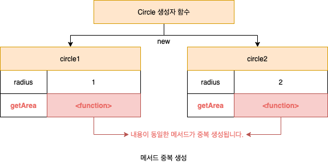
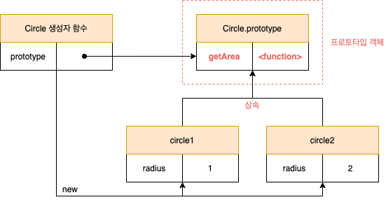
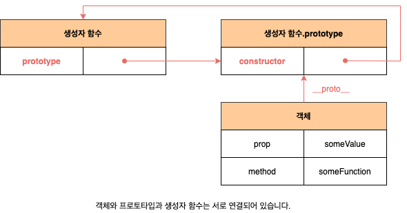
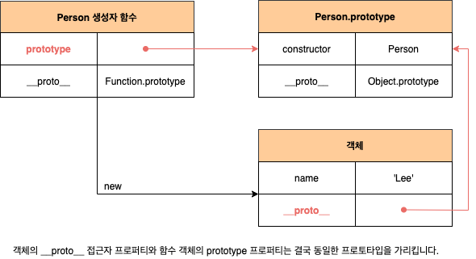
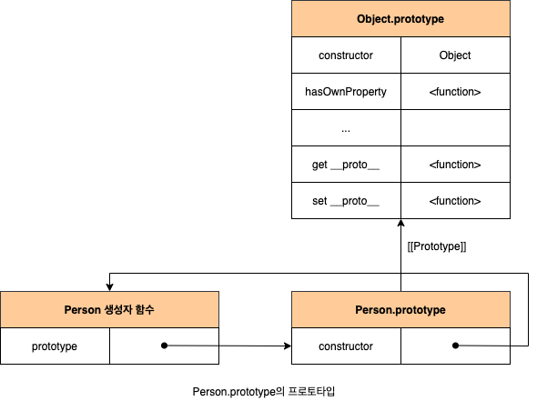
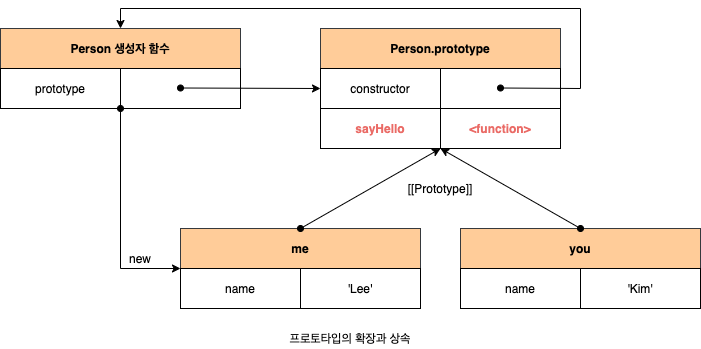
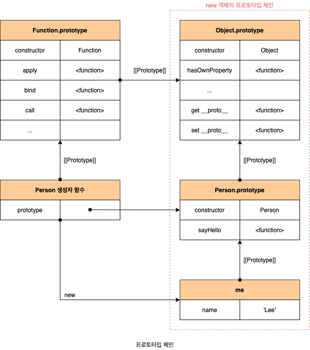
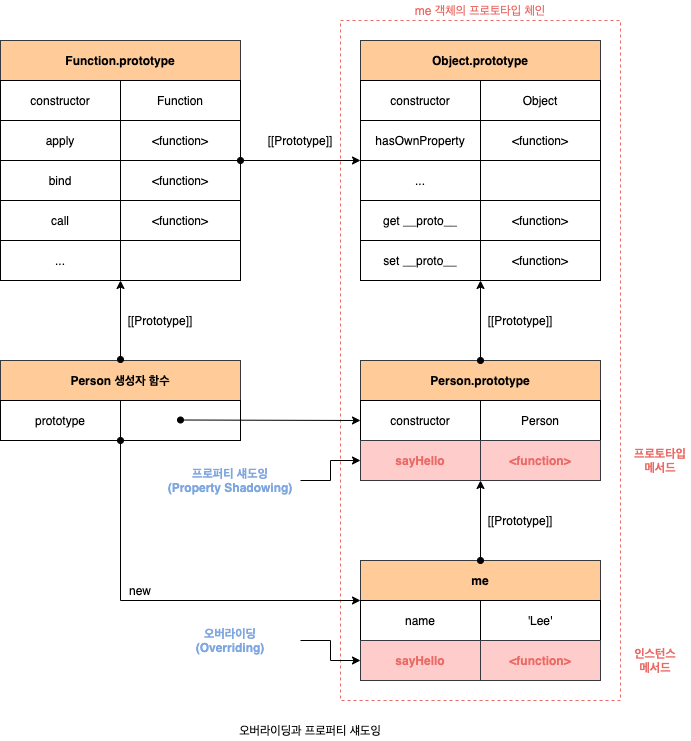
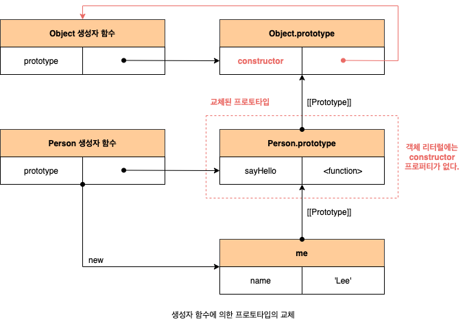
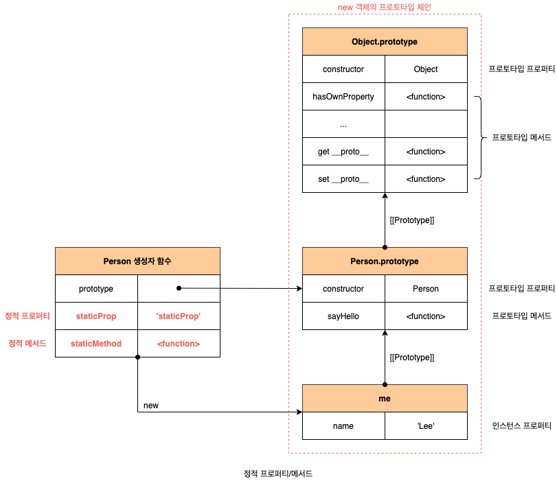

# 프로토타입

자바스크립트 **명령어**(Impreative), **함수형**(Functional), 프로토타입 기반 **객체지향 프로그래밍**(Object Oriented Programming)을 지원하는 멀티 패러다임 프로그래밍 언어입니다.

## 1. 객체지향 프로그래밍

객체지향 프로그래밍은 프로그램을 명령어 또는 함수적 목록으로 보는 전통적인 **명령형 프로그래밍**(Impreative Programming)의 절차지향적인 관점에서 벗어나 여러 개의 독립적 단위, 즉 **객체**(Object)의 집합으로 프로그램을 표현하려는 프로그래밍 패러다임입니다.

객체지향 프로그래밍은 실체(사물이나 개념)을 인식하는 철학적 사고를 프로그래밍에 접목하려는 시도에서 시작합니다. 실체는 특징이나 성질을 나타내는 **속성**(Attribute/Property)을 가지고 있고, 이를 통해 실체를 인식하거나 구별할 수 있습니다. 다양한 속성 중에서 프로그래밍에 필요한 속성만 간추려 내어 표현하는 것을 **추상화**라고 합니다. 이떄 프로그래머는 속성으로 표현된 객체를 다른 객체와 구별하여 인식할 수 있습니다. 이처럼 속성을 통해 여러 개의 값을 하나의 단위로 구성한 복합적인 자료구조를 객체라하며, 객체지향 프로그래밍은 독립적인 객체의 집합으로 프로그램을 표현하려는 프로그래밍 패러다임입니다.

```javascript
// 이름과 주소 속성을 갖는 객체
const person = {
  name: "Lee",
  address: "Seoul",
};
```

객체지향 프로그래밍은 객체의 **상태**(State)를 나타내는 데이터와 상태 데이터를 조작할 수 있는 **동작**(Behavior)을 하나의 논리적 단위로 묶어 생각합니다. 이때 객체의 상태 데이터를 **프로퍼티**(Property), 동작을 **메서드**(Method)라고 부릅니다.

```javascript
const cricle = {
  radius: 5,
  getDiameter() {
    return 2 * this.radius;
  },
};
```

각 객체는 고유의 기능을 갖는 독립적인 부품으로 볼 수 있지만 자신의 고유한 기능을 수행하면서 다른 객체와 **관계성**(Relationship)을 가질 수 있습니다. 다른 객체와 메시지를 주고받거나 데이터를 처리할 수도 있습니다. 또는 다른 객체의 상태 데이터나 동작을 상속받아 사용하기도 합니다.

## 2. 상속과 프로토타입

**상속**(Inheritance)은 객체지향 프로그래밍의 핵심 개념으로, 어떤 객체의 프로퍼티 또는 메서드를 다른 객체가 상속받아 그대로 사용할 수 있는 것을 말합니다. 자바스크립트는 프로토타입을 기반으로 상속을 구현하여 불필요한 중복을 제가합니다. 중복을 제거하는 방법은 기존의 코드를 적극적으로 재사용하는 것입니다. 코드 재사용은 개발 비용을 현저히 줄일 수 있는 잠재력이 있으므로 매우 중요합니다.

```javascript
function Circle(radius) {
  this.radius = radius;
  this.getArea = function () {
    return Math.PI * this.radius ** 2;
  };
}

const circle1 = new Circle(1);
const circle2 = new Circle(2);

// getArea 메서드를 중복 생성하고 모든 인스턴스가 중복 소유합니다.
console.log(circle1.getArea === circle2.getArea); // false
console.log(circle1.getArea()); // 3.141592653589793
console.log(cricle2.getArea()); // 12.566370614359172
```

생성자 함수는 동일한 프러피티(메서드 포함) 국조를 갖는 객체를 여러 개 생성할 떄 유용합니다. 하지만 위 예제의 생성자 함수는 문제가 있습니다. `getArea` 메서드는 모든 인스턴스가 동일한 내용의 메서드를 사용하므로 단 하나만 생성하여 모든 인스턴스가 공유해서 사용하는 것이 바람직합니다. 그런데 `Circle` 생성자 함수는 인스턴스를 생성할 때마다 `getArea` 메서드를 중복 생성하고 모든 인스턴스가 중복 소유합니다.



이처럼 동일한 생성자 함수에 의해 생성된 모든 인스턴스가 동일한 메서드를 중복 소유하는 것은 메모리를 불필요하게 낭비합니다. 또한 인스턴스를 생성할 때마다 메서드를 생성하므로 퍼포먼스에도 악영향을 줍니다. 만약 10개의 인스턴스를 생서앟면 내용이 동일한 메서드도 10개가 생성됩니다. 상속을 통해 불필요한 중복을 제거할 수 있습니다. 자바스크립트는 **프로토타입**(Prototype)을 기반으로 상속을 구현합니다.

```javascript
// 프로토타입은 Circle 생성자 함수의 prototype 프로퍼티에 바인딩되어 있습니다.
function Circle(radius) {
  this.radius = radius;
}

Cilcle.prototype.getArea = function () {
  return Math.PI * this.radius ** 2;
};
```



상속은 코드의 재사용이란 관점에서 매우 유용합니다. 생성자 함수가 생성할 모든 인스턴스가 공통적으로 사용할 프로퍼티나 메서드를 프로토타입에 미리 구현해 두면 생성자 함수가 생성할 모든 인스턴스는 별도의 구현 없이 상위(부모) 객체임 프로토타입의 자산을 공유하여 사용할 수 있습니다. 즉 자신의 상태를 나타내는 프로퍼티만 개별적으로 소윺하고 내용이 동일한 메서드는 상속을 통해 공유하여 사용하는 것입니다.

## 3. 프로토타입 객체

모든 객체는 `[[Prototype]]` 이라는 내부 슬롯을 가지며, 이 내부 슬롯의 값은 프로토타입의 참조(`null`인 경우도 있습니다)입니다. `[[Prototype]]`에 저장되는 프로토타입은 객체 생성 방식에 의해 결정됩니다. 즉 객체가 생성될 때 객체 생성 방식에 따라 프로토타입이 결정되고 `[[Prototype]]`에 저장됩니다. 모든 객체는 하나의 프로토타입을 갖습니다. 그리고 모든 프로토타입은 생성자 함수와 연결되어 있습니다.



`[[Prototype]]` 내부 슬롯에는 직접 접근할 수 없지만, 위 그림처럼 `__proto__` 접근자 프로퍼티를 통해 자신의 프로토타입, 즉 자신의 `[[Prototype]]` 내부 슬롯이 가리키는 프로토타입에 간접적으로 접근할 수 있습니다. 그리고 프로토타입은 자신의 `constructor` 프로퍼티를 통해 생성자 함수에 접근할 수 있고, 생성자 함수는 자신의 `prototype`을 통해 프로토타입에 접근할 수 있습니다.

### 3.1 \_\_proto\_\_ 접근자 프로퍼티

#### 3.1.1 \_\_proto\_\_는 접근자 프로퍼티입니다.

내부 슬롯은 프로퍼티가 아닙니다. 따라서 자바스크립트는 원칙적으로 내부 슬롯과 내부 메서드에 직접적으로 접근하거나 호출할 수 있는 방법을 제공하지 않습니다. 단, 일부 내부 슬롯과 내부 메서드에 한하여 간접적으로 접근할 수 있는 수단을 제공하기는 합니다. `[[Prototype]]` 내부 슬롯에도 직접 접근할 수 없으며 `__proto__` 접근자 프로퍼티를 통해 간접적으로 `[[Prototype]]` 내붓 슬롯의 값, 즉 프로토타입에 접근할 수 있습니다.

접근자 프로퍼티는 자체적으로 값(`[[Value]]` 프로퍼티 어트리뷰트)를 갖지 않고 다른 데이터 프로퍼티의 값을 읽거나 저장할 때 사용하는 **접근자 함수**(Accessor Function), 즉 `[[Get]]`, `[[Set]]` 프로퍼티 어트리뷰트로 구성된 프로퍼티입니다. `__proto__` 접근자 프로퍼티를 통해 프로토타입에 접근하면 내부적으로 `__proto__` 접근자 프로퍼티의 getter 함수인 `[[Get]]`이 호출됩니다. `__proto__` 접근자 프로퍼티를 통해 새로운 프로토타입을 할당하면 `__proto__` 접근자 프로퍼티의 setter 함수인 `[[Set]]`이 호출됩니다.

```javascript
const obj = {};
const parent = { x: 1 };

// setter 함수인 set __proto__가 호춣되어 obj 객체의 프로토타입으로 교체합니다.
obj.__proto__ = parent;
console.log(obj.x); // 1
```

#### 3.1.2 \_\_proto\_\_ 접근자 프로퍼티는 상속을 통해 사용됩니다.

`__proto__` 접근자 프로퍼티는 객체가 직접 소유하는 프로퍼티가 아니라 `Object.prototype`의 프로퍼티입니다. 모든 객체는 상속을 통해 `Object.prototype.__proto__` 접근자 프로퍼티를 사용할 수 있습니다. 프로토타입 체인의 최상위 객체는 `Object.prototype`이며, 이 객체의 프로퍼티와 메서드는 모든 객체에 상속됩니다.

```javascript
const person = { name: "Lee" };

console.log(pserson.hasOwnProperty("__proto__")); // false
console.log(Object.getOwnPropertyDescriptor(Object.prototype, "__proto__"));
// {get: f, set: f, enumerable: false, configurable: true}
```

#### 3.1.3 \_\_proto\_\_ 접근자 프로퍼티를 통해 프로토타입에 접근하는 이유

`[[Prototype]]` 내부 슬롯의 값, 즉 프로토타입에 접근하기 위해서 접근자 프로퍼티를 사용하는 이유는 상호 참조에 의해 프로토타입 체인이 생성되는 것을 방지하기 위해서입니다.

```javascript
const parent = {};
const child = {};

child.__proto__ = parent;
parent.__proto__ = child; // TypeError: Cyclic __proto__ value
```

프로토타입 체인은 단방향 링크드 리스트로 구현되어야 합니다. 즉, 프러퍼티 검색 방향이 한쪽 방향으로만 흘러가야 합니다. 하지만 위 코드와 같은 서로가 자신의 프로토타입이 되는 비정상적인 프로토타입 체인, 다시말해 **순환 참조**(Circular Reference)하는 프로토타입 체인이 만들어지면 프로토타입 체인 종점이 존재하지 않기 떄문에 프로토타입 체인에서 프로퍼티를 검색할 때 무한 루프에 빠집니다. 따라서 아무런 체크 없이 무조건적으로 프로토타입을 교체할 수 없도록 `__proto__` 접근자 프로퍼티를 통해 프로토타입에 접근하고 교체하도록 구현되어 있습니다.

#### 3.1.4 \_\_proto\_\_ 접근자 프로퍼티를 코드 내에서 사용하는 것은 권장하지 않습니다.

`__proto__` 접근자 프로퍼티는 ES5까지 ECMAScript 사양에 포함되지 않는 비표준이었습니다. 하지만 일부 브라우저에서 `__proto__`를 지원하고 있었기 때문에 브라우저 호환성을 고려하여 ES6에서 `__proto__`를 표준으로 채택했습니다. 현재 대부분의 브라우저(IE 11 이상)가 `__proto__`를 지원합니다.

하지만 코드 내에서 `__proto__` 접근자 프로퍼티를 직접 사용하는 것은 권장하지 않습니다. 모든 객체가 `__proto__` 접근자 프로퍼티를 사용할 수 있는 것은 아니기 떄문입니다. 직접 상속을 통해 다음과 같이 `Object.prototype`을 상속받지 않는 객체를 생성할 수도 있습니다.

```javascript
// obj는 프로토타입 체인의 종점입니다. 따라서 Object.__proto__를 상속받을 수 없습니다.
const obj = Object.create(null);
console.log(obj.__proto__); // undefined
```

따라서, `__proto__` 접근자 프로퍼티 대신 프로토타입의 참조를 취득하고 싶은 경우에는 `Object.getPrototypeOf` 메서드를 사용하고, 프로토타입을 교체하고 싶은 경우에는 `Object.setPrototypeOf` 메서드를 사용할 것을 권장합니다. `Object.getPrototypeOf` 메서드는 ES5에서 도입된 메서드이며, IE9 이상에서 지원합니다. `Object.setPortotypeOf` 메서드는 ES6에서 도입된 메서드이며, IE11 이상에서 지원합니다.

```javascript
const obj = {};
const parent = { x: 1 };

// obj 객체의 프로토타입을 취득
Object.getPrototypeOf(obj);
// obj 객체의 프로토타입을 교채
Object.setPrototypeOf(obj, parent);

console.log(obj.x); // 1
```

### 3.2 함수 객체의 prototype 프로퍼티

함수 객체만 소유하는 `prototype` 프로퍼티는 생성자 함수가 생성할 인스턴스의 프로토타입을 가리킵니다. 따라서 생성자 함수로서 호출할 수 없는 함수, 즉 `non-constructor`인 화살표 함수와 ES6 메서드 축약 표현으로 정의한 메서드는 `prototype` 프로퍼티를 소유하지 않으며 프로토타입도 생성하지 않습니다. 모든 객체가 가지고 있는(엄밀히 말하면 `Object.prototype` 으로부터 상속받은) `__proto__` 접근자 프로퍼티와 함수 객체만이 가지고 있는 `prototype` 프로퍼티는 결국 동일한 프로토타입을 가리킵니다. 하지만 이들 프로퍼티를 사용하는 주체가 다릅니다.

| 구분                        | 소유        | 값              | 사용 주체   | 사용 목적                                                                    |
| --------------------------- | ----------- | --------------- | ----------- | ---------------------------------------------------------------------------- |
| `__proto__` 접근자 프로퍼티 | 모든 객체   | 프로토타입 참조 | 모든 객체   | 객체가 자신의 프로토타입에 접근 또는 교체하기 위해 사용                      |
| `prototype` 프로퍼티        | constructor | 프로토타입 참조 | 생성자 함수 | 생성자 함수가 자신이 생성할 객체(인스턴스)의 프로토타입을 할당하기 위해 사용 |

```javascript
function Person(name) {
  this.name = name;
}

const me = new Person("Lee");

console.log(Person.prototype === me.__proto__); // true
```



### 3.3 프로토타입 constructor 프로퍼티와 생성자 함수

모든 프로토타입은 `constructor` 프로퍼티를 갖습니다. 이 `constructor` 프로퍼티는 `prototype` 프로퍼티로 자신을 참조하고 잇는 생성자 함수를 가리킵니다. 이 연결은 생성자 함수가 생성될 때, 즉 함수 객체가 생성될 떄 이뤄집니다. 객체에는 `constructor` 프로퍼티가 없지만 프로토타입의 `constructor` 프로퍼티를 상속받아 사용할 수 있습니다.

```javascript
function Person(name) {
  this.name = name;
}

const me = new Person("Lee");
console.log(me.constructor === Person); // true
```

## 4. 리터럴 표기법에 의해 생성된 객체의 생성자 함수와 프로토타입

리터럴 표기법에 의한 객체 생성 방식과 같이 명시적으로 `new` 연산자와 함계 생성자 함수를 호출하여 인스턴스를 생성하지 않는 객체 생성 방식도 있습니다. 리터럴 표기법에 의해 생성된 객체도 상속을 위해 프로토타입이 필요합니다. 따라서 리터럴 표기법에 의해 생성된 객체도 생성자 함수를 갖습니다. 프로토타입과 생성자 함수는 단독으로 존재할 수 없고 언제나 쌍으로 존재하기 떄문입니다. 리터럴 표기법(객체 리터럴, 함수 리터럴, 배열 리터럴, 정규 표현식 리터럴 등)에 의해 생성된 객체는 생성자 함수에 의해 생성된 객체는 아닙니다. 하지만 큰 틀에서 생각해보면 리터럴 표기법으로 생성한 객체도 생성자 함수로 생성한 객체와 본질적인 면에서 큰 차이는 없습니다.

예를 들어, 객체 리터럴에 의해 생성한 객체와 `Object` 생성자 함수에 의해 생성한 객체는 생성 과정에서 미묘한 차이는 있지만 결국 객체로서 동잉ㄹ한 특성을 갖습니다. ECMAScript 사양을 살펴보면, `Object` 생성자 함수는 다음과 같이 구현하도록 정의되어 있습니다.

```
19.1.1.1 Object([value])
When the Object function is called with optional argument value, the following steps are taken:

1. if NewTarget is neither undefined nor the active function, then
  a. Return ? OrdinaryCreateFromConstructor(NewTarget, "%Object.prototype%").
2. if value is undefned or null, return OrdinaryObjectCreate(%Object.prototype%).
3. Return ! ToObject(value)

The "length" property of the Object constructor function is 1.
```

```javascript
// 1. new.target이 undefined나 Object가 아닌 경우
// 인스턴스 -> Foo.prototype -> Object.prototype 순으로 프로토타입 체인이 생성됩니다.
class Foo extends Object {}
const obj1 = new Foo();
console.log(obj1); // Foo {}

// 2. Object 생서앚 함수에 의한 객체 생성
// 인수가 전달되지 않았을 때 추산 연산 OrdinaryObjectCreate를 호출하여 빈 객체를 생성합니다.
const obj2 = new Object();
console.log(obj2); // {}

// 3. 인수가 전달된 경우에는 인수를 객체로 변환합니다.
// Number 객체 생성
const obj3 = new Object(123);
console.log(obj3); // Number {123}
```

추상 연산은 ECMAScript 사양에서 내부 동작의 구현 알고리즘을 표현한 것입니다. `Object` 생성자 함수에 인수를 전달하지 않거나 `undefined` 또는 `null`을 인수로 전달하면서 로출하면 내부적으로 추상 연산 `OrdinaryObjectCreate`를 호출하여 `Object.prototype`을 프로토타입으로 갖는 빈 객체를 생성합니다. 객체 리터럴이 평가될 때는 다음과 같이 추상 연산 `OrdinaryObjectCreate`를 호출하여 빈 객체를 생성하고 프로퍼티를 추가하도록 정의되어 있습니다.

```
12.2.6.7 Runtime Sematics: Evaluation
ObjectLiteral: {}

1. Retrun OrdinaryObjectCreate(%Object.prototype%).

ObjectLiteral:
  { PropertyDefinitionList }
  { PropertyDefinitionList , }

1. Let obj be OrdinaryObjectCreate(%Object.prototype%).
2. Perform ? PropertyDefinitionEvaluation of PropertyDefinitonList witth arguments obj and true.
3. Retrun obj.
```

이처럼 `Object` 생성자 함수 호출과 객체 리터럴의 평가는 추상 연산 `OrdinaryObjectCreate`를 호출하여 빈 객체를 생성하는 점에서 동일하나, `new.target`의 확인이나, 프로퍼티를 추가하는 처리 등 세부 내용은 다릅니다. 따라서 객체 리터럴에 의해 생성된 객체는 `Object` 생성자 함수가 생성한 객체가 아니지만, `Object` 생성자 함수를 리터럴 표기법으로 생성한 객체의 생성자 함수로 생각해도 크게 무리는 없습니다.

| 리터럴 표기법      | 생성자 함수 | 프로토타입           |
| ------------------ | ----------- | -------------------- |
| 객체 리터럴        | `Object`    | `Object.prototype`   |
| 함수 리터럴        | `Function`  | `Function.prototype` |
| 배열 리터럴        | `Array`     | `Array.prototype`    |
| 정규 표현식 리터럴 | `RegExp`    | `RegExp.prototype`   |

## 5. 프로토타입의 생성 시점

생성자 함수는 사용자가 직접 정의한 사용자 정의 생성자 함수와 자바스크립트가 기본 제공하는 빌트인 생성자 함수로 구분할 수 있습니다.

### 5.1 사용자 정의 생성자 함수의 프로토타입 생성 시점

생성자 함수로서 호출할 수 있는 함수, 즉 `constructor` 함수 정의가 평가되어 함수 객체가 생성되는 시점에 프로토타입도 더불어 생성됩니다. 생성자 함수로서 호출할 수 없는 함수 즉 `non-constructor`는 프로토타입이 생성되지 않습니다. 생성된 프로토타입은 생성자 함수의 `prototype` 프로퍼티에 바인딩됩니다. 프로토타입도 객체이고 모든 객체는 프로토타입을 가지므로 프로토타입도 자신의 프로토타입을 갖습니다. 생성된 프로토타입의 프로토타입은 `Object.prototype`입니다.

```javascript
console.log(Person.prototype); // {constructor: f}

function Person(name) {
  this.name = name;
}
```



### 5.2 빌트인 생성자 함수와 프로토타입 생성 시점

모든 빌트인 생성자 함수는 전역 객체가 생성되는 시점에 생성됩니다. 생성된 프로토타입은 빌트인 생성자 함수의 `prototype` 프로퍼티에 바인딩됩니다. 이후 생성자 함수 또는 리터럴 표기법으로 객체를 생성하면 프로토타입은 생성된 객체의 `[[Prototype]]` 내부 슬롯에 할당됩니다. 이로써 생성된 객체는 프로토타입을 상속받습니다.

## 6. 객체 생성 방식과 프로토타입 결정

추상 연산 `OrdinaryObjectCreate`는 필수적으로 자신이 생성할 객체의 프로토타입을 인수로 전달받습니다. 그리고 자신이 생성할 객체에 추가할 프로퍼티 목록을 옵션으로 전달할 수 있습니다. 추상 연산 `OrdinaryObjectCreate`는 빈 객체를 생성한 후, 객체에 추가할 프로퍼티 목록이 인수로 전달된 겨우 프로퍼티를 객체에 추가합니다. 그리고 인수로 전달받은 프로토타입을 자신이 생성한 객체의 `[[Prototype]]` 내부 슬롯에 할당한 다음, 생성한 객체를 반환합니다.

### 6.1 객체 리터럴에 의해 생성된 객체의 프로토타입

자바스크립트 엔진은 객체 리터럴을 평가하여 객첵를 생성할 때 추산 연산 `OrdinaryObjectCreate`를 호출합니다. 이떄 추상 연산 `OrdinaryObjectCreate`에 전달되는 프로토타입은 `Object.prototype`입니다.

### 6.2 Object 생성자 함수에 의해 생성된 객체의 프로토타입

`Object` 생성자 함수를 인수 없이 호출하면 빈 객체가 생성됩니다. `Object` 생성자 함수를 호출하면 객체 리터럴과 마찬가지로 추상 연산 `OrdinaryObjectCreate`가 호출됩니다. 이떄 추산 연산 `OrdinaryObjectCreate`에 전달되는 프로토타입은 `Object.prototype`입니다. 객체 리터럴과 `Object` 생성자 함수에 의한 객체 생성 방식의 차이는 프로퍼티를 추가하는 방식에 있습니다. 객체 리터럴 방식은 객체 릴터럴 내부에 프로퍼티를 추가하지만 `Object` 생성자 함수 방식은 일단 객체를 생성한 이후에 프로퍼티를 추가해야 합니다.

### 6.3 생성자 함수에 의해 생성된 객체의 프로토타입

`new` 연산자와 함께 생성자 함수를 호출하여 인스턴스를 생성하면 다른 객체 생성 방식과 마찬가지로 추상 연산 `OrdinaryObjectCreate`가 호출됩니다. 이에 추상 연산 `OrdinaryObjectCreate`에 전달되는 프로토타입은 생성자 함수의 `prototype` 프로퍼티에 바인딩되어 있는 객체입니다. 프로토타입은 객체입니다. 따라서 일반 객체와 같이 프로토타입에도 프로퍼티를 추가/삭제할 수 있습니다. 그리고 이렇게 추가/삭제한 프로퍼티는 프로토타입 체인에 즉각 반영됩니다.

```javascript
function Person(name) {
  this.name = name;
}

Person.prototype.sayHello = function () {
  console.log(`Hi! My name is ${this.name}`);
};

const me = new Person("Lee");
const you = new Person("Kim");

me.sayHello(); // Hi, My name is Lee
you.sayHello(); // Hi, My name is Kim
```



## 7. 프로토타입 체인



자바스크립트 객체의 프로퍼티(메서드 포함)에 접근하려고 할 때 해당 객체에 접근하려는 프로퍼티가 없다면 `[[Prototype]]` 내부 슬록의 참조를 따라 자신의 부모 역할을 하는 프로토타입 프로퍼티를 순차적으로 검색합니다. 이를 프로토타입 체인이라고 합니다. 모든 객체는 `Object.prototype`을 상속받습니다. 따라서 `Object.protoype`을 프로토타입 체인의 종점이라 합니다.

1. 객체에 프로퍼티가 없다면 프로토타입 체인을 따라, 다시 말해 `[[Prototype]]` 내부 슬롯에 바인딩되어 있는 프로토타입으로 이동하여 프로퍼티를 검색하빈다.
2. 부모 역할을 하는 프로토타입에도 프로퍼티가 없다면 프로토타입 체인을 따라, 다시 말해 `[[Prototype]]` 내부 슬롯에 바인딩되어 있는 프로토타입으로 이동하여 프로퍼티를 검색합니다.
3. 프로토타입 체인의 최상위에 위치하는 객체는 언제나 `Object.prototype`입니다. `Object.prototype`의 프로토타입, 즉 `[[Prototype]]` 내부 슬롯의 값은 `null`입니다.
4. 프로토타입 체인의 종점에서도 프로퍼티를 검색할 수 없는 경우 `undefined`를 반환합니다.

자바스크립트 엔진은 객체 간의 상속 관계로 이루어진 프로토타입의 계층적인 구조에서 객체의 프로퍼티를 검색합니다. 따라서 프로토타입 체인은 상속과 프로퍼티 검색을 위한 메커니즘이라고 할 수 있습니다.

## 8. 오버라이딩과 프로퍼티 섀도잉

프로토타입이 소유한 프로퍼티(메서드 포함)를 **프로토타입 프로퍼티**, 인스턴스가 소유한 프로퍼티를 **인스턴스 프로퍼티**라고 부릅니다. 프로토타입 프로퍼티와 같은 이름의 프로퍼티를 인스턴스에 추가하면 프로토타입 체인을 다라 프로토타입 프로퍼티를 검색하여 프로토타입 프로퍼티를 덮어쓰는 것이 아니라 인스턴스 프로퍼티로 추가합니다. 이때 인스턴스 프로퍼티는 프로토타입 프로퍼티를 **오바라이딩**했고 프로토타입 프로퍼티는 가려집니다. 이처럼 상속 관계에 의해 프로퍼티가 가려지는 현상을 **프로퍼티 셰도잉**(Property Shadowing)이라 합니다.

```javascript
const Person = (function () {
  function Person(name) {
    this.name = name;
  }

  Person.prototype.sayHello = function () {
    console.log(`Hi! My name is ${this.name}`);
  };

  return Person;
})();

const me = new Person("Lee");

me.sayHello = function () {
  console.log(`Hey! My name is ${this.name}`);
};

me.sayHeelo(); // Hey! My name is Lee
```



하위 객체를 통해 프로토타입의 프로퍼티를 변경 또는 삭제하는 것은 불가능합니다. 다시 말해 하위 객체를 통해 프로토타입에 get 엑세스는 허용되나 set 엑세스는 허용되지 않습니다. 프로토타입 프로퍼티를 변경 또는 삭제하려면 하위 객체를 통해 프로토타입 체인으로 접근하는 것이 아니라 프로토타입에 직접 접근해야 합니다.

```javascript
const me = new Person("Lee");
delete me.sayHello; // 삭제되지 않습니다.
delete Person.prototype.sayHello; // 삭제 됩니다.
```

## 9. 프로토타입 교체

프로토타입은 임의의 다른 객체로 변경할 수 있습니다. 이러한 특징을 활용하여 객체 간의 상속 관계를 동적으로 변경할 수 있습니다. 프로토타입은 생성자 함수 또는 인스턴스에 의해 교체할 수 있습니다.

### 9.1 생성자 함수에 의한 프로토타입의 교체

```javascript
const Person = (function () {
  function Person(name) {
    this.name = name;
  }

  Person.prototype = {
    sayHello() {
      console.log(`Hi! My name is ${this.name}`);
    },
  };

  return Person;
})();

const me = new Person("Lee");
```



프로토타입으로 교체한 객체 리터럴에는 `constructor` 프로퍼티가 없습니다. `constructor` 프로퍼티는 자바스크립트 엔진이 프로토타입을 생성할 때 암묵적으로 추가한 프로퍼티입니다. 따라서 `me` 객체의 생성자 함수를 검색하면 `Person`이 아닌 `Object`가 나옵니다.

```javascript
console.log(me.constructor === Person); // false
console.log(me.constructor === Object); // true
```

이처럼 프로토타입을 교체하면 `constructor` 프로퍼티와 생성자 함수 간의 연결이 파괴됩니다. 프로토타입으로 교체한 객체 리터럴에 `constructor` 프로퍼티를 추가하여 프로토타입의 `constructor` 프로퍼티를 되살립니다.

```javascript
Person.prototype = {
  constructor: Person,
  sayHello() {
    console.log(`Hi! My name is ${this.name}`);
  },
};
```

### 9.2 인스턴스에 의한 프로토타입의 교체

생성자 함수의 `prototype` 프로퍼티에 다른 임의의 객체를 바인딩하는 것은 미래에 생성할 인스턴스의 프로토타입을 교체하는 것입니다. `__proto__` 접근자 프로퍼티(또는 `Object.setPrototypeOf` 메서드)를 통해 프로토타입을 교체하는 것은 이미 생성된 객체의 프로토타입을 교체하는 것입니다.

```javascript
function Person(name) {
  this.name = name;
}

const me = new Person("Lee");

// constructor 프로퍼티를 추가하여 프로토타입의 constructor 프로퍼티를 되살립니다.
const parent = {
  constructor: Person,
  sayHello() {
    console.log(`Hi! My name is ${this.name}`);
  },
};

Object.setPrototypeOf(me, parent);
// me.__proto__ = parent;

console.log(me.constructor === Person); // true
console.log(Person.prototype === Object.getPrototypeOf(me)); // false
```

## 10. instanceof 연산자

`instanceof` 연산자는 이항 연산자로서 좌변에 객체를 가리키는 식별자, 우변에 생성자 함수를 가리키는 식별자를 피연산자로 받습니다. 만약 우변의 피연산자가 함수가 아닌 경우 TypeError가 발생합니다. 우변의 생성자 함수의 `prototype`에 바인딩된 객체가 좌변의 객체의 프로토타입 체인 상에 존재하면 `true`로 평가되고, 그렇지 않은 경우에 `false`로 평가됩니다.

```javascript
function Person(name) {
  this.name = name;
}

const me = new Person("Lee");
console.log(me instanceof Person); // true
console.log(me instanceof Object); // true

const parent = {};
Object.setPrototypeOf(me, parent);
console.log(me instanceof Person); // false
console.log(me instanceof Object); // true
```

`instanceof` 연산자는 프로토타입의 `constructor` 프로퍼티가 가리키는 생성자 함수를 찾는 것이 아닙니다. 따라서 생성자 함수에 의해 프로토타입이 교체되어 `constructor` 프로퍼티와 생성자 함수 간의 연결이 파괴되어도 생성자 함수의 `prototype` 프로퍼티와 프로토타입 간의 견결은 파괴되지 않으믄로 `instanceof`는 아무런 영향을 받지 않습니다. `instanceof` 연산자를 함수로 표현하면 다음과 같습니다.

```javascript
function isInstanceof(instance, constructor) {
  // 프로토타입 취득
  const prototype = Object.getPrototypeOf(instance);

  // 재귀 탈출 조건
  // prototype이 null이면 프로토타입 체인의 종점에 다다른 것입니다.
  if (prototype === null) return false;

  // 프로토타입이 생성자 함수의 prototype 프로퍼티에 바인딩된 객체라면 true를 반환합니다.
  // 그렇지 않다면 재귀 호출로 프로토타입 체인 상위 프로토타입으로 이동하여 확인합니다.
  return (
    prototype === constructor.prototype || isInstanceof(prototype, constructor)
  );
}
```

## 11. 직접 상속

### 11.1 Object.create에 의한 상속

`Object.create` 메서드는 명시적으로 포로토타입을 지정하여 새로운 객체를 생성합니다. `Object.create` 메서드도 다른 객체 생성 방식과 마찬가지로 추상 연산 `OrdinaryObjectCreate`를 호출합니다. `Object.create` 메서드의 첫 번째 매개변수에는 생성할 객체의 프로토타입으로 지정할 객체를 전달합니다. 두번째 매개변수에는 생성할 객체의 프로퍼티 키와 프로퍼티 디스크립터 객체로 이뤄진 객체를 전달합니다. 이 객체 형식은 `Object.defineProperties` 메서드의 두 번째 인수와 동일합니다. 두 번째 인수는 옵션이므로 생략 가능합니다.

```javascript
// 프로토타입이 null인 객체를 생성합니다. 생성된 객체는 프로토타입 체인의 종점에 위치합니다.
// obj1 -> null
const obj1 = Object.create(null);
console.log(Object.getPrototypeOf(Obj1) === null); // true

// obj2 = {};와 동일합니다.
// obj2 -> Object.prototype -> null
const obj2 = Object.create(Object.prototype);
console.log(Object.getPrototypeOf(obj2) === Object.prototype); // true

// obj = { x: 1};와 동일합니다.
const obj3 = Object.create(Object.prototype, {
  x: { value: 1, writable: true, enumerable: true, configurable: true },
});

// 임의의 객체를 직접 상속받습니다.
// obj4 -> obj3 -> Object.prototype -> null
const obj4 = Object.create(obj3);
console.log(obj4.x); // 1
console.log(Object.getPrototypeOf(obj4) === obj3); // true

function Person(name) {
  this.name = name;
}

// obj5 = new Person('Lee');와 동이합니다.
// obj5 -> Person.prototype -> Object.prototype -> null
const obj5 = Object.create(Person.prototype);
obj5.name = "Lee";
```

이 메서드의 장점은 다음과 같습니다.

- `new` 연산자 없이도 객체를 생성할 수 있습니다.
- 프로토타입을 지정하면서 객체를 생성할 수 있습니다.
- 객체 리터럴에 의해 생성된 객체도 상속받을 수 있습니다.

`Object.prototype`의 빌트인 메서드(`Object.prototype.hasOwnProperty`, `Object.prototype.isPrototypeOf` 등)는 모든 객체의 포로토타입 체인의 종점, 즉 `Object.prototype`의 메서드이므로 모든 객체가 상속받아 호출할 수 있습니다. 그런데 ESLint에서는 `Object.prototype`의 빌트인 메서드를 객체가 직접 호출하는 것을 권장하지 않습니다. 그 이유는 `Object.create` 메서드를 통해 프로토톼입 체인의 종점에 위취하는 객체를 생성할 수 있기 떄문입니다. 프로토타입 체인의 종점에 위치하는 객체는 `Object.prototype`의 빌트인 메서드를 사용할 수 없습니다. 따라서 이 같은 에러를 발생시킬 위험을 없애기 위해 `Object.prototype`의 빌트인 메서드는 간접적으로 호출하는 것이 좋습니다.

```javascript
// 프로토타입이 null인 객체를 생성합니다. 생성된 객체는 프로토타입 체인의 종점에 위치합니다.
const obj = Object.create(null);
obj.a = 1;

console.log(obj.hasOwnProperty("a")); // TypeError
console.log(Object.prototype.hasOwnProperty.call(obj, "a")); // true
```

`Function.prototype.call` 메서드에 대해서는 **22.2.4절 Function.prototype.apply/call/bind 메서드에 의한 간접 호출**에서 살펴봅니다.

### 11.2 객체 리터럴 내부에서 \_\_proto\_\_에 의한 직접 상속

ES6에서는 객체 리터럴 내부에서 `__proto__` 접근자 프로퍼티를 사용하여 직접 상속을 구현할 수 있습니다.

```javascript
const myProto = { x: 10 };

const obj = {
  y: 20,
  __proto__: myProto,
};

console.log(obj.x, obj.y); // 10 20
console.log(Object.getPrototypeOf(obj) === myProto); // true
```

## 12. 정적 프로퍼티/메서드

**정적**(Static) 프로퍼티/메서드는 생성자 함수로 인스턴스를 생성하지 않아도 참조/호출할 수 있는 프로퍼티/메서드를 말합니다. 생성자 함수가 생성한 인스턴스는 자신의 프로토타입 체인에 속한 객체의 프로퍼티/메서드에 접근할 수 있습니다. 하지만 정적 프로퍼티/메서드는 인스턴스의 프로토타입 체인에 속한 객체의 프로퍼티/메서드가 아니므로 인스턴스에 접근할 수 없습니다.

만약 인스턴스/프로토타입 메서드 내에서 `this`를 사용하지 않는다면 그 메서드는 정적 메서드로 변경할 수 있습니다. 인스턴스가 호출한 인스턴스/프로토타입 메서드 내에서 `this`는 인스턴스를 가리킵니다. 메서드 내에서 인스턴스를 참조할 필요가 없다면 정적 메서드로 변경하여도 동작합니다. 프로토타입 메서드를 호출하려면 인스턴스를 생성해야 하지만 정적 메서드는 인스턴스를 생성하지 않아도 호출할 수 있습니다.

앞에서 살펴본 `Object.create` 메서드는 `Object` 생성자 함수의 정적 메서드이고 `Object.prototype.hasOwnProperty` 메서드는 `Object.prototype`의 메서드입니다. 따라서 `Object.create` 메서드는 인스턴스, 즉 `Object` 생성자 함수가 생성한 객체로 호출할 수 없습니다. 참고로 프로토타입 프로퍼티/메서드를 표기할 때 `prototype`을 **#**으로 표기(예를 들어, Object.prototype.isPrototypeOf를 Object#isPrototypeOf으로 표기)하는 경우도 있으니 알아두도록 합니다.

```javascript
function Person() {
  this.name = name;
}

// 프로토타입 메서드
Person.prototype.sayHello = function () {
  console.log(`Hi, My name is ${this.name}`);
};

// 정적 프로퍼티
Person.staticProp = "static prop";

// 정적 메서드
Person.staticMethod = function () {
  console.log("staticMethod");
};

const me = new Person("Lee");

Person.staticMethod(); // staticMethod
me.staticMethod(); // TypeError
```



## 13. 출처

- 모던 자바스크립트 Deep Dive - 이웅모
