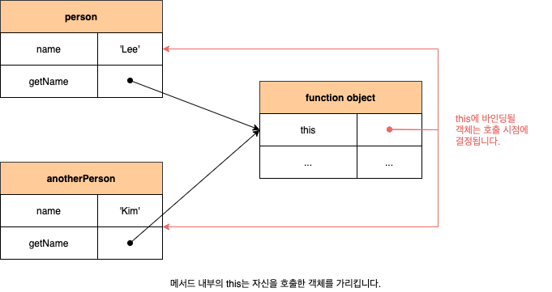
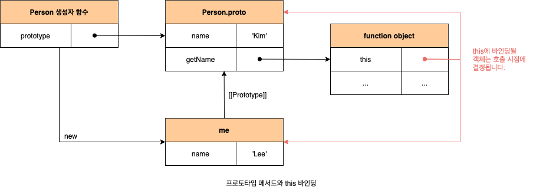

# this

객체는 **상태**(State)를 나타내는 프로퍼티와 **동작**(Behvior)을 나타내는 메서드를 하나의 논리적인 단위로 묶은 복합적인 자료구조입니다. 동작을 나타내는 메서드는 자신이 속한 객체의 프로퍼티를 참조하려면 먼저 자신이 속한 객체를 가리키는 식별자를 참조할 수 있어야 합니다. 객체 리터럴 방식으로 생성한 객체의 경우 메서드 내부에서 메서드 자신이 속한 객체를 가리키는 식별자를 재귀적으로 참조할 수 있습니다.

```javascript
const circle = {
  radius: 5,
  getDiameter() {
    return 2 * circle.radius;
  },
};

console.log(circle.getDiameter()); // 10
```

하지만 자기 자신이 속한 객체를 재귀적으로 참조하는 방식을 일반적이지 않으며, 바람직하지도 않습니다. 생성자 함수에 의한 객체 생성 방식은 먼저 생성자 함수를 정의한 이후 `new` 연산자와 함계 생성자 함수를 호출하는 단계가 추가로 필요합니다. 다시 말해, 생성자 함수로 인스턴스를 생성하려면 먼저 생성자 함수가 존재해야 합니다. 생성자 함수를 정의하는 시점에서 아직 인스턴스를 생성하기 이전이므로 생성자 함수가 생성할 인스턴스를 가리키는 식별자를 알 수 없습니다. 따라서 자신이 속한 객체 또는 자신이 생성할 인스턴스를 가리키는 특수한 식별자가 필요합니다. 이를 위해 자바스크립트는 `this`라는 특수한 식별자를 제공합니다. `this`는 자신이 속한 객체 또는 자신이 생성할 인스턴스를 가리키는 **자기 참조 변수**(Self-Referencing Variable)입니다. `this`를 통해 자신이 속한 객체 또는 자신이 생성할 인스턴스의 프로퍼티나 메서드를 참조할 수 있습니다.

```javascript
const circle = {
  radius: 5,
  getDiameter() {
    return 2 * this.radius;
  },
};
```

`this`는 자바스크립트 엔진에 의해 암묵적으로 생성되면, 코드 어디서든 참조할 수 있습니다. 함수를 호출하면 `arguments` 객체와 `this`가 암묵적으로 함수 내부에 전달됩니다. 함수 내부에서 `arguments` 객체를 지역 변수처럼 사용할 수 잇는 것처럼 `this`도 지역 변수처럼 사용할 수 있습니다. 단, `this`가 가리키는 값, 즉 `this` 바인딩은 함수 호출 방식에 의해 동적으로 결정됩니다. 또한 strct mode(엄격 모드)역시 `this` 바인딩에 영향을 줍니다.

## 2 함수 호출 방식과 this 바인딩

### 2.1 일반 함수 호출

일반 함수로 호출된 모든 함수(중첩 함수, 콜백 함수 포함) 내부의 `this`에는 **전역 객체**(global object)가 바인딩됩니다. 다만 `this`는 객체의 프로퍼티나 메서드를 참도하기 위한 자기 참조 변수이므로 객체를 생성하지 않는 일반 함수에서 `this`는 의미가 없습니다. 따라서 strct mode가 적용된 일반 함수 내부의 `this`에는 `undefined`가 바인딩됩니다.

```javascript
function foo() {
  console.log("foo's this: ", this); // window
  function bar() {
    console.log("bar's this: ", this); // window
  }
  bar();
}
foo();
```

하지만 메서드 내에서 정의한 중첩 함수 또는 메서드에게 전달한 콜백 함수(보조 함수)가 일반 함수로 호출될 때 메서드 내의 중첩 함수 또는 콜백 함수의 `this`가 전역 객체를 바인딩하는 것은 문제가 있습니다. 메서드 내부의 중첩 함수나 콜백 함수의 `this` 바인딩을 메서드의 `this` 바인딩과 일치시키기 위한 방법은 다음과 같습니다.

```javascript
const obj = {
  value: 100,
  foo() {
    const thah = this;

    setTimeout(function () {
      console.log(this.value); // undefined
    }, 100);

    setTimeout(function () {
      console.log(that.value); // 100
    }, 100);
  },
};
```

### 2.2 메서드 호출

메서드 내부의 `this`에는 메서드를 소유한 객체가 아닌 메서드를 호출한 객체, 즉 메서드를 호출할 때 메서드 이름 앞의 마침표(`.`) 연산자 앞에 기술한 객체가 바인딩됩니다. 메서드는 프로퍼티에 바인딩된 함수입니다. 즉 함수 객체는 객체에 포함된 것이 아니라 독립적으로 존재하는 별도의 객체이고, 프로퍼티가 함수 객체를 가리키고 있을 뿐입니다. 따라서 메서드는 다른 객체의 프로퍼티에 할당하는 것으로 다른 객체의 메서드가 될 수도 있고, 일반 변수에 할당하여 일반 함수로 호출될 수도 있습니다.

```javascript
const person = {
  name: "Lee",
  getName() {
    return this.name;
  },
};

console.log(person.getName()); // Lee

const anotherPerson = {
  name: "Kim",
};

anotherPerson.getName = person.getName;
console.log(anotherPerson.getName()); // Kim

const getName = person.getName;
console.log(getNam());
// 브라우저 환경에서 window.name은 브라우저 창의 이름을 나타내는 빌트인 프로퍼티이며 기본값을 ''입니다.
// Node.js 환경에서 this.name은 undefined입니다.
```



프로토타입 메서드 내부에서 사용된 `this`도 일반 메서드와 마찬가지로 해당 메서드를 호출한 객체에 바인딩됩니다.

```javascript
function Person(name) {
  this.name = name;
}

Person.prototype.getName = function () {
  return this.name;
};

const me = new Person("Lee");
console.log(me.getName()); // Lee

Person.prototype.name = "Kim";
console.log(Person.prototype.getName()); // Kim
```



### 2.3 생성자 함수 호출

생성자 함수 내부의 `this`에는 생성자 함수가 (미래에) 생성할 인스턴스가 바인딩됩니다. 만약 `new` 연산자와 함께 생성자 함수를 호출하지 않으면 생성자 함수가 아니라 일반 함수로 동작합니다.

```javascript
function Circle(radius) {
  this.radius = radius;
  this.getDiameter = function () {
    return 2 * this.radius;
  };
}

const cricle1 = new Circle(5);
const circle2 = new Circle(10);

console.log(circle1.getDiameter()); // 10
console.log(circle2.getDiameter()); // 20
```

### 2.4 Function.prototype.apply/call/bind 메서드에 의한 간접 호출

`apply`, `call`, `bind` 메서드는 `Function.prototype`의 메서드입니다. 즉, 이들 메서드는 모든 함수가 상속바당 사용할 수 있습니다. `Function.prototype.apply`, `Function.prototype.call` 메서드는 `this`로 사용할 객체와 인수 리스트를 인수로 전달받아 함수를 호출합니다. `apply`와 `call` 메서드는 호출할 함수에 인수를 전달하는 방식만 다를 뿐 동일하게 동작합니다.

```javascript
/**
 * @description 주어진 this 바인딩과 인수 리스트 배열을 사용하여 함수를 호출합니다.
 * @param thisArg this로 사용할 객체
 * @param argsArray 함수에게 전달할 인수 리스트의 배열 또는 유사 배열 객체
 * @returns 호출된 함수 반환값
 */
 Function.prototype.apply(thisArg[, argsArray]);

/**
 * @description 주어진 this 바인딩과 ,로 구분된 인수 리스트를 사용하여 함수를 호출합니다.
 * @param thisArg this로 사용할 객체
 * @param arg1, arg2, ... 함수에게 전달할 인수 리스트
 * @returns 호출된 함수의 반환값
 */
Function.prototype.call(thisArg[, ar1[, arg2[, ... ]]])
```

```javascript
function getThisBinding() {
  console.log(arguments);
  return this;
}

const thisArg = { a: 1 };

console.log(getThisBinding.apply(thisArg, [1, 2, 3]));
// Arguments(3) [1, 2, 3, callee: f, Symbol(Symbol.iterator): f]
// { a: 1 }

console.log(getThisBinding.call(thisArg, 1, 2, 3));
// Arguments(3) [1, 2, 3, callee: f, Symbol(Symbol.iterator): f]
// { a: 1 }
```

`apply`와 `call` 메서드의 대표적인 용도는 `arguments` 객체와 같은 유사 배열 객체에 배열 메서드를 사용하는 경우입니다. `arguments` 객체는 배열이 아니기 때문에 `Array.prototyp.slice` 같은 배열의 메서드를 사용할 수 없으나 `apply`와 `call` 메서드를 이용하면 가능합니다.

```javascript
function convertArgsToArray() {
  const arr = Array.prototype.slice.call(arguments);
  return arr;
}

console.log(convertArgsToArray(1, 2, 3)); // [1, 2, 3]
```

`Function.prototype.bind` 메서드는 `apply`와 `call` 메서드와 달리 함수를 호출하지 않고 `this`로 사용할 객체만 전달합니다. `bind` 메서드는 메서드의 `this`와 메서드 내부의 중첩 함수 또는 콜백 함수의 `this`가 불일치하는 문제를 해결하기 위해 유용하게 사용됩니다. `Function.prototype.bind` 메서드를 사용하면, 수신자 객체를 받아들이고 원본 함수를 수신자 객체의 메서드로써 호출하는 래퍼 함수를 만들 수 있습니다. 함수를 수정하지 않고 새로운 함수를 만든다는 점을 기억합니다. 새로운 함수는 이전의 함수와 거의 동일하게 동작하지만 이전 함수와 달리 수신자 객체가 전달받은 객체로 바인딩됩니다.

```javascript
const person = {
  name: "Lee",
  foo(callback) {
    setTimeout(callback.bind(this), 100);
  },
};

person.foo(function () {
  console.log(`Hi!, my name is ${this.name}.`); // Hi! my name is Lee.
});
```
