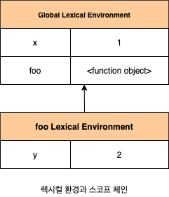
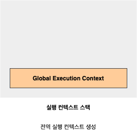
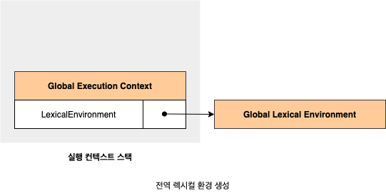
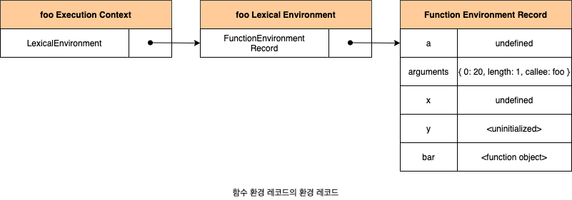
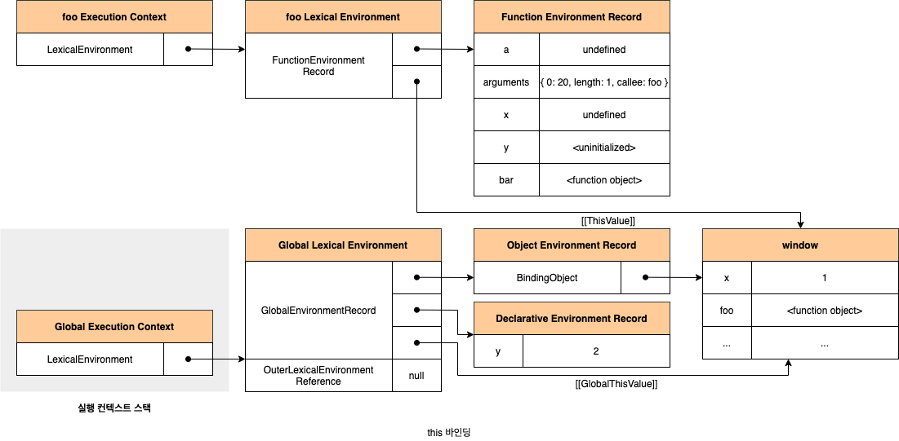
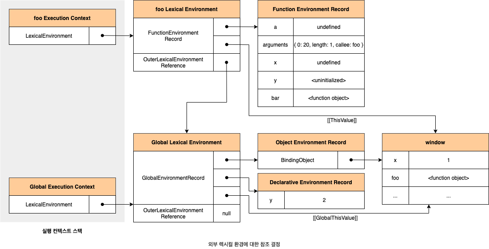
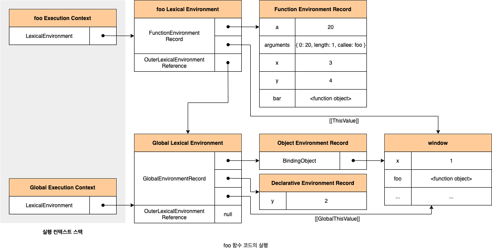
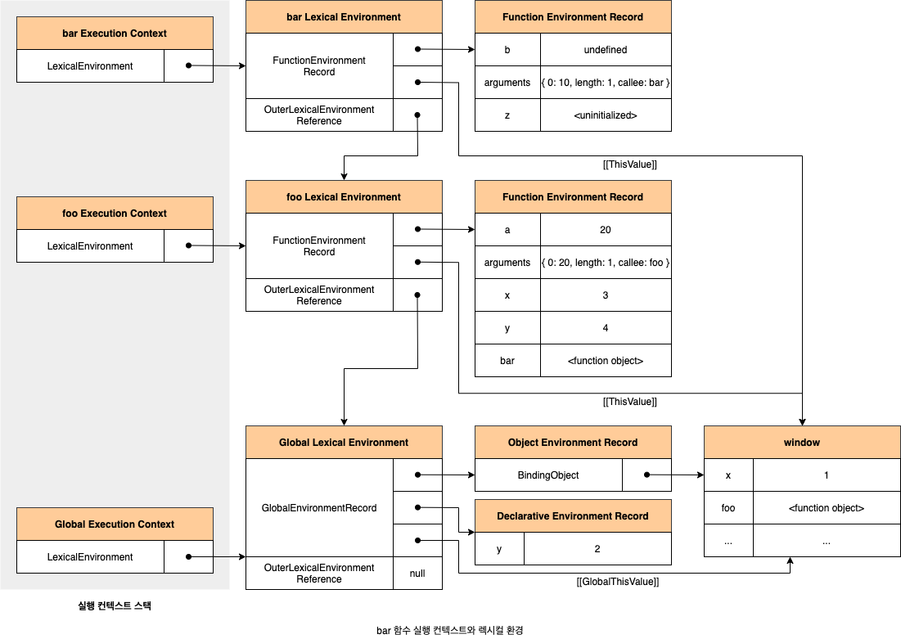
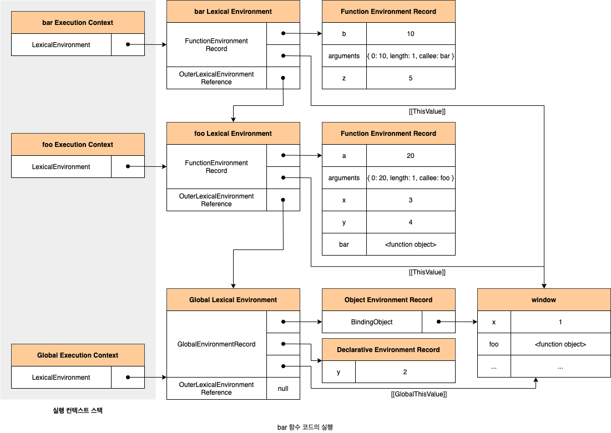
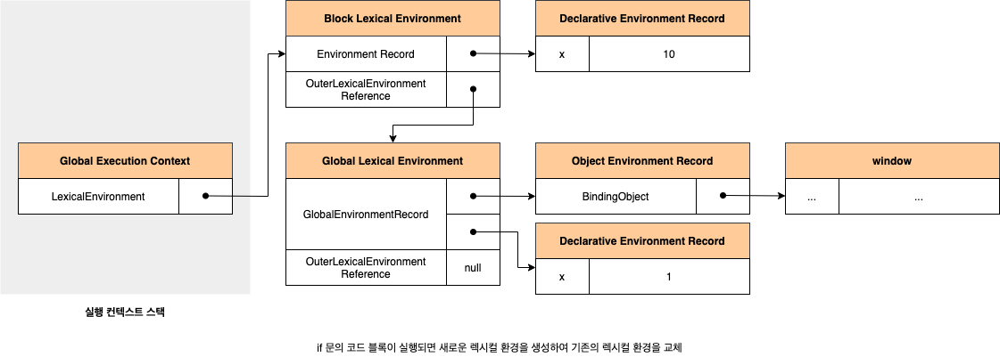

# 실행 컨텍스트

## 1. 소스코드의 타입

ECMAScript 사양은 소스코드를 4가지 타입으로 구분합니다. 4가지 타입의 소스코드는 실행 컨텍스트를 생성합니다. 소스코드를 4가지 타입으로 구분하는 이유는 소스코드의 타입에 따라 실행 컨텍스트를 생성하는 과정과 내용이 다르기 때문입니다.

| 소스코드의 타입          | 설명                                                                                                          |
| ------------------------ | ------------------------------------------------------------------------------------------------------------- |
| 전역 코드(Global Code)   | 전역에 존재하는 소스코드를 말합니다. 전역에 정의된 함수, 클래스 등의 내부 코드는 포함하지 않습니다.           |
| 함수 코드(Function Code) | 함수 내부에 존재하는 소스코드를 말합니다. 함수 내부에 중첩된 함수, 클래스 등의 내부 코드는 포함되지 않습니다. |
| eval 코드(Evval Code)    | 빌트인 전역 함수인 `eval` 함수에 인수로 전달되어 실행되는 소스코드를 말합니다.                                |
| 모듈 코드(Module Code)   | 모듈 내부에 존재하는 소스코드를 말합니다. 모듈 내부의 함수, 클래스 등의 내부 코드는 포함되지 않습니다.        |

### 1.1 전역 코드

전역 코드는 전역 변수를 관리하기 위해 최상위 스코프인 전역 스코프를 생성해야 합니다. 그리고 `var` 키워드로 선언된 전역 변수와 함수 선언문으로 정의된 전역 함수를 전역 객체의 프로퍼티와 메서드로 바인딩하고 참조하기 위해 전역 객체와 연결되어야 합니다. 이를 위해 전역 코드가 평가되면 전역 실행 컨텍스트가 생성됩니다.

### 1.2 함수 코드

함수 코드는 지역 스코프를 생성하고 지역 변수, 매개변수, arguments 객체를 관리해야 합니다. 그리고 생성한 지역 스코프를 전역 스코프에서 시작하는 스코프 체인의 일원으로 연결해야 합니다. 이를 위해 함수 코드가 평가되면 함수 실행 컨텍스트가 생성됩니다.

### 1.3 eval 코드

`eval` 코드는 strict mode(엄격 모드)에서 자신만의 독자적인 스코프를 생성합니다. 이를 위해 `eval` 코드가 평가되면 `eval` 실행 컨텍스트가 생성됩니다.

### 1.4 모듈 코드

모듈 코드는 모듈별로 독립적인 모듈 스코프를 생성합니다. 이를 위해 모듈 코드가 평가되면 모듈 실행 컨텍스트가 생성됩니다.

## 2. 소스코드의 평가와 실행

모든 소스코드는 실행에 앞서 평가 과정을 거치며 코드를 실행하기 위한 준비를 합니다. 다시 말해 자바스크립트 엔진은 소스코드를 2개의 과정, 즉 소스코드의 평가와 소스코드의 실행으로 나누어 처리합니다. 소스코드 평가 과정에서 실행 컨텍스트를 생성하고 변수, 함수 등의 선언문만 먼저 실행하여 생성된 변수나 함수 식별자를 키로 실행 컨텍스트가 관리하는 스코프(렉시컬 환경의 환경 레코드)에 등록합니다.

소스코드 평가 과정이 끝나면 비로소 선언문을 제외한 소스코드가 순차적으로 실행되기 시작합니다. 즉, 런타임이 시작됩니다. 이때 소스코드 실행에 필요한 정보, 즉 변수나 함수의 참조를 실행 컨텍스트가 관리하는 스코프에서 검색해서 취득합니다. 그리고 변수 값의 변경 등 소스코드의 실행 결과는 다시 실행 컨텍스트가 관리하는 스코프에 등록됩니다.


## 3. 실행 컨텍스트의 역할

**실행 컨텍스스트**는 소스코드를 실행하는데 필요한 환경을 제공하고 코드의 실행 결과를 실제로 관리하는 역역입니다. 좀 더 구체적으로 말해, 실행 컨텍스트는 식별자를 등록하고 관리하는 스코프와 코드 실행 순서를 관리하는 내부 메커니즘으로, 모든 코드는 실행 컨텍스트를 통해 실행되고 관리됩니다.

- 선언에 의해 생성된 모든 식별자(변수, 함수, 클래스 등)를 스코프를 구분하여 등록하고 상태 변화(식별자에 바인딩된 값의 변화)를 지속적으로 관리할 수 있어야 합니다.
- 스코프는 중첩 관계에 의해 스코프 체인을 형성해야 합니다. 즉, 스코프 체인을 통해 상위 스코프로 이동하며 식졀자를 검색할 수 있어야 합니다.
- 현재 실행 중인 코드의 실행 순서를 변경(예를 들어, 함수 호출에 의한 실행 순서 변경)할 수 있어야 하며 다시 되돌아갈 수도 있어야 합니다.

## 4. 실행 컨텍스트 스택

실행 컨텍스트는 **스택**(Stack) 자료구조로 관리됩니다. 이를 **실행 컨텍스트 스택**이라고 부릅니다. 실행 컨텍스트 스택은 코드의 실행 순서를 관리합니다. 코드를 실행하면 코드가 실행되는 시간의 흐름에 따라 실행 컨텍스트 스택에는 실행 컨텍스트가 **추가**(Push)되고 **제거**(Pop)됩니다. 실행 컨텍스트 스택의 최상위에 존재하는 실행 컨텍스트는 언제나 현재 실행 중인 코드의 실행 컨텍스트이며 **실행 중인 실행 컨텍스트**(Running Execution Context)라 부릅니다.

```javascript
const x = 1;

function foo() {
  const y = 2;

  function bar() {
    const z = 3;
    console.log(x + y + z);
  }

  bar();
}

foo(); // 6
```


1. **전역 코드 평가와 실행:** 자바스크립트 엔진은 먼저 전역 코드를 평가하여 전역 실행 컨텍스트를 생성하고 실행 컨텍스트 스택에 푸시합니다.
2. **foo 함수 코드의 평가와 실행:** 전역 함수 `foo`가 호출되면 전역 코드의 실행은 일시 중단되고 코드의 **제어권**(Control)이 `foo` 함수 내부로 이동합니다. 자바스크립트 엔진은 `foo` 함수 내부의 함수 코드를 평가하여 `foo` 실행 컨텍스트를 생성하고 실행 컨텍스트 스택에 푸시합니다.
3. **bar 함수 코드의 평가와 실행:** 중첩 함수 `bar`가 호출되면 `foo` 함수 코드의 실행은 일시 중단되고 코드 제어권이 `bar` 함수 내부로 이동합니다. 자바스크립트 엔진은 `bar` 함수 내부의 함수 코드를 평가하여 `bar` 함수 실행 컨텍스트를 생성하고 실행 컨텍스트 스택에 푸시합니다.
4. **foo 함수 코드로 복귀:** `bar` 함수가 종료되면 코드의 제어권은 다시 `foo` 함수로 이동합니다. 이때 자바스크립트 엔진은 `bar` 함수 실행 컨텍스트를 실행 컨텍스트 스택에서 팝하여 제거합니다.
5. **전역 코드로 복귀:** `foo` 함수가 종료되면 코드의 제어권은 다시 전역 코드로 이동합니다. 이대 자바스크립트 엔진은 `foo` 함수 실행 컨텍스트를 실행 컨텍스트 스택에서 팝하여 제거합니다.

## 5. 렉시컬 환경

**렉시컬 환경**(Lexical Environment)는 식별자와 식별자에 바인딩된 값, 그리고 상위 스코프에 대한 참조를 기록하는 자료구조로 실행 컨텍스트를 구성하는 컴포넌트입니다. 실행 컨텍스트 스택이 코드의 실행 순서를 관리한다면 렉시컬 환경은 스코프와 식별자를 관리합니다.

```javascript
const x = 1;

function foo() {
  const y = 2;
  console.log(x + y);
}
```



렉시컬 환경은 키와 값을 갖는 객체 형태의 스코프(전역, 함수, 블록 스코프)를 생성하여 식별자를 키로 등록하고 식별자에 바인딩된 값을 관리합니다. 즉, 렉시컬 환경은 스코프를 구분하여 식별자를 등록하고 관리하는 저장소 역할을 하는 렉시컬 스코프의 실체입니다. 실행 컨텍스트는 LexicalEnvironment 컴포넌트와 VariableEnvironment 컴포넌트로 구성됩니다. 생성 초기의 실행 컨텍스트와 렉시컬 환경을 그림으로 표현하면 다음과 같습니다.


생성 초기에 LexicalEnvironment 컴포넌트와 VariableEnvironment 컴포넌트는 하나의 동일한 렉시컬 환경을 참조합니다. 이후 몇 가지 상황을 만나면 VariableEnvironment 컴포넌트를 위한 새로운 렉시컬 환경을 생성하고, 이때부터 VariableEnvironment와 LexicalEnvironment 컴포넌트 내용이 달라지는 경우도 있습니다. 이 책에서는 strict mode와 `eval` 코드, `try/catch` 문과 같은 특수한 상황은 제외하고, LexicalEnvironment 컴포넌트와 VariableEnvironment 컴포넌트도 구분하지 않고 렉시컬 환경으로 통일해 간략하게 설명하려 합니다.

렉시컬 환경은 다음과 같이 두개의 컴포넌트로 구성됩니다.

1. **환경 레코드**(Environment Record): 스코프에 포함된 식별자를 등록하고 등록된 식별자에 바인딩된 값을 관리하는 저장소입니다. 환경 레코드는 소스코드의 타입에 따라 관리하는 내용에 차이가 있습니다.
2. **외부 렉시컬 환경에 대한 참조**(Quter Lexical Environment Reference): 외부 렉시컬 환경에 대한 참조는 상위 스코프를 가리킵니다. 이때 상위 스코프란 외부 렉시컬 환경, 즉 해당 실행 컨텍스트를 생성한 소스코드를 포함하는 상위 코드의 렉시컬 환경을 말합니다. 외부 렉시컬 환경에 대한 참조를 통해 단방향 링크드 리스트인 스코프 체인을 구현합니다.

## 6. 실행 컨텍스트의 생성과 식별자 검색 과정

```javascript
var x = 1;
const y = 2;

function foo(a) {
  var x = 3;
  const y = 4;

  function bar(b) {
    const z = 5;
    console.log(a + b + x + y + z);
  }

  bar(10);
}

foo(20); // 42
```

### 6.1 전역 객체 생성

전역 객체는 전역 코드가 평가되기 이전에 생성됩니다. 이때 전역 객체에는 빌트인 전역 프로퍼티와 빌트인 전역 함수, 그리고 표준 빌트인 객체가 추가되며 동적 환경(클라이언트 사이드 또는 서버 사이드)에 따라 클라이언트 사이드 Web API(DOM, BOM, Canvas, XMLHttpRequest, fetch, requestAnimationFrame, SVG, Web Storage, Web Component, Web Worker 등) 또는 특정 환경을 위한 호스트 객체를 포함합니다. 전역 객체도 `Object.prototype`을 상속받습니다. 즉, 전역 객체도 프로토타입 체인의 일원입니다.

### 6.2 전역 코드 평가

소스코드가 로드되면 자바스크립트 엔진은 전역 코드를 평가합니다. 전역 코드 평가는 다음과 같은 순서로 진행됩니다.

#### 6.2.1 전역 실행 컨텍스트 생성

먼저 비어있는 전역 실행 컨텍스트를 생성하여 실행 컨텍스트 스택에 푸시합니다. 이때 전역 실행 컨텍스트 스택의 최상위, 즉 **실행 중인 컨텍스트**(Running Execution Context)가 됩니다.



#### 6.2.2 전역 렉시컬 환경 생성

**전역 렉시컬 환경**(Global Lexical Environment)을 생성하고 전역 실행 컨텍스트에 바인딩합니다.



##### 1. 전역 환경 레코드 생성

전역 렉시컬 환경을 구성하는 컴포넌트의 **전역 환경 레코드**(Global Environment Record)는 전역 변수를 관리하는 전역 스코프, 전역 객체의 빌트인 전역 프로퍼티와 전역 함수, 표준 빌트인 객체를 제공합니다. 기존 `var` 키워드로 선언한 전역 변수와 ES6의 `let`, `const` 키워드로 선언한 전역 변수를 구분하여 관리하기 위해 전역 스코프 역할을 하는 전역 환경 레코드는 **객체 환경 레코드**(Object Environment Record)와 **선언적 환경 레코드**(Declariative Environment Record)로 구성되어 있습니다.

###### 1.1 객체 환경 레코드 생성

전역 환경 레코드를 구성하는 컴포넌트인 객체 환경 레코드는 `BindingObject`라고 부르는 객체와 연결됩니다. `BindingObject`는 전역 코드 평가 전에 생성된 전역 객체입니다. 전역 코드 평가 과정에서 `var` 키워드로 선언한 전역 변수와 함수 선언문으로 전의된 전역 함수는 전역 환경 레코드의 객체 환경 레코드에 연결된 `BindingObject`를 통해 전역 객체의 프로퍼티와 메서드가 됩니다. 그리고 이때 등록된 식별자를 전역 환경 레코드의 객체 완경 레코드에서 검색하면 전역 객체의 프로퍼티를 검색하여 반환합니다.

이것이 `var` 키워드로 선언된 전역 변수와 함수 선언문으로 정의된 전역 함수가 전역 객체의 프로퍼티와 메서드가 되고 전역 객체를 가리키는 식별자(window) 없이 전역 객체의 프로퍼티를 참조(예를 들어, `window.alert`을 `alert`으로 참조)할 수 있는 메커니즘입니다.


`var` 키워드로 선언한 변수는 **선언 단계**와 **초기화 단계**가 동시에 진행됩니다. 다시 말해, 전역 코드 평가 시점에 객체 환경 레코드에 바인딩된 `BindingObject`를 통해 전역 객체에 변수 식별자를 키로 등록한 다음, 암묵적으로 `undefined`를 바인딩합니다. 따라서 `var` 키워드로 선언한 변수는 코드 실행 단계에서 변수 선언문 이전에도 참조할 수 있습니다. `var` 키워드로 선언한 변수에 할당한 함수 표현식도 이와 동일하게 동작합니다. 이것이 변수 호이스팅입니다.

함수 선언문으로 정의한 함수가 평가되면 함수 이름과 동일한 이름의 식별자를 객체 환경 레코드에 바인딩된 BindingObject를 통해 전역 객체에 키로 등록하고 생성된 함수 객체를 즉시 할당합니다. 이것이 변수 호이스팅과 함수 호이스팅의 차이입니다. 즉, 함수 선언문으로 정의한 함수는 함수 선언문 이전에 호출할 수 있습니다.

###### 1.2 선언적 환경 레코드 생성

`let`, `const` 키워드로 선언한 전역 변수는 선언적 환경 레코드에 등록되고 관리됩니다.


`let`, `const` 키워드로 선언한 변수는 전역 객체의 프로퍼티가 되지 않기 때문에 `window.y`와 같이 전역 객체의 프로퍼티로서 참조할 수 없습니다. `let`, `const` 키워드로 선언한 변수도 변수 호이스팅이 발생하는 것은 변함이 없습니다. 하지만 **선언 단계**와 **초기화 단계**가 분리되어 진행합니다. 따라서 런타임 실행 흐름이 변수 선언문에 도달하기 전까지 **일시적 사각지대**(Temporal Dead Zone)에 빠지게 됩니다.

##### 2. this 바인딩

전역 환경 레코드의 `[[GlobalThisValue]]` 내부 슬롯에 `this`가 바인딩됩니다. 일반적으로 전역 코드에서 `this`는 전역 객체를 가리키므로 전역 환경 레코드의 `[[GlobalThisValue]]` 내부 슬롯에는 전역 객체가 바인딩됩니다. 전역 코드에서 `this`를 참조하면 전역 환경 레코드의 `[[GlobalThisValue]]` 내부 슬롯에 바인딩되어 있는 객체가 반환됩니다. 참고로 전역 환경 레코드를 구성하는 객체 환경 레코드와 선언적 환경 레코드에는 `this` 바인딩이 없습니다. `this` 바인딩은 전역 환경 레코드와 함수 환경 레코드에만 존재합니다.


##### 3. 외부 렉시컬 환경에 대한 참조 결정

**외부 렉시컬 환경에 대한 참조**(Outer Lexical Environment Reference)는 현재 평가 중인 소스코드를 포함하는 외부 소스코드의 렉시컬 환경, 즉 상위 스코프를 가리킵니다. 이를 통해 단방향 링크드 리스트인 스코프 체인을 구현합니다. 현재 평가 중인 소스 코드는 전역 코듸입니다. 전역 코드를 포함하는 소스코드는 없으므로 전역 레시컬 환경의 외부 렉시컬 환경에 대한 참조에 `null`이 할당됩니다. 이는 전역 렉시컬 환경이 스코프 체인의 종점에 존재함을 의미합니다.


### 6.3 전역 코드 실행

변수 할당문 또는 함수 호출문을 실행하려면 먼저 변수 또는 함수 이름이 선언된 식별자인지 확인해야 합니다. 선언되지 않은 식별자는 참조할 수 없으므로 할당이나 호출도 할 수 없기 때문입니다. 또한 식별자 스코프가 다르면 같은 이름을 가질 수 있습니다. 즉, 동일한 이름의 식별자가 다른 스코프에 여러 개 존재할 수도 있습니다. 따라서 어느 스코프의 식별자를 참조하면 되는지 결정할 필요가 있습니다. 이를 **식별자 결정**(Identifier Resolution)이라고 합니다.


식별자 결정을 위해 식별자를 검색할 때는 실행 중인 실행 컨텍스트에서 식별자를 검색하기 시작합니다. 만약 실행 중인 실행 컨텍스트의 렉시컬 환경에서 식별자를 검색할 수 없으면, 외부 렉시컬 환경에 대한 참조가 가르키는 렉시컬 환경, 즉 상위 스코프로 이동하여 식별자를 검색합니다. 이것이 바로 스코프 체인의 동작 원리입니다. 하지만 전역 렉시컬 환경은 스코프 체인의 종점이므로 전역 렉시컬 환경에서 검색할 수 없는 식별자는 **참조 에러**(ReferenceError)를 발생시킵니다.

### 6.4 foo 함수 코드 평가

`foo` 함수가 호출되면 전역 코드의 실행을 일시 중단하고 `foo` 함수 내부로 코드의 제어권이 이동합니다. 함수 코드 평가는 아래 순서로 진행됩니다.

#### 6.4.1 함수 실행 컨텍스트 생성

먼저 `foo` 함수 실행 컨텍스트를 생성합니다. 생성된 함수 실행 컨텍스트는 함수 렉시컬 환경이 완성된 다음 실행 컨텍스트 스택에 푸시됩니다.

#### 6.4.2 함수 렉시컬 환경 생성

`foo` **함수 렉시컬 환경**(Function Lexical Environment)을 생성하고 `foo` 함수 실행 컨텍스트에 바인딩합니다.


##### 1. 함수 환경 레코드 생성

함수 렉시컬 환경을 구성하는 컴포넌트 중 하나인 **함수 환경 레코드**는 매개변수, `arguments` 객체, 함수 내부에서 선언한 지역 변수와 중첩 함수를 등록하고 관리합니다.



##### 2. this 바인딩

함수 환경 레코드의 `[[ThisValue]]` 내부 슬롯에 `this`가 바인딩됩니다. `[[ThisValue]]` 내부 슬롯에 바인딩될 객체는 함수 호출 방식에 따라 결정됩니다. `foo` 함수는 일반 함수로 호출되었으므로 `this`는 전역 객체를 가리킵니다. 따라서 함수 환경 레코드의 `[[ThisValue]]` 내부 슬롯에는 전역 객체가 바인딩됩니다.



##### 3. 외부 렉시컬 환경에 대한 참조 결정

외부 렉시컬 환경에 대한 참조에 `foo` 함수 정의가 평가된 시점에 실행 중인 실행 컨텍스트의 렉시컬 환경의 참조가 할당됩니다. `foo` 함수는 전역 코드에 정의된 전역 함수입니다. 따라서 `foo` 함수 정의는 전역 코드 평가 시점에 평가됩니다. 이 시점의 실행 중인 실행 컨텍스트는 전역 실행 컨텍스트입니다. 따라서 외부 렉시컬 환경에 대한 참조에는 전역 렉시컬 환경의 참조가 할당됩니다.

자바스크립트 엔진은 함수 정의를 평가하여 함수 객체를 생성할 때 현재 실행 중인 실행 컨텍스트의 렉시컬 환경, 즉 함수의 상위 스코프를 함수 객체의 내부 슬롯 `[[Environment]]`에 저장합니다. 함수 렉시컬 환경의 외부 렉시컬 환경에 대한 참조에 할당되는 것은 바로 함쉬의 상위 스코프를 가리키는 함수 객체의 내부 슬롯 `[[Environment]]`에 저장된 렉시컬 환경의 참조입니다. 함수 객체의 내부 슬롯 `[[Environment]]`와 렉시컬 스코프는 클로저를 이해할 수 있는 중요한 단서입니다.



### 6.5 foo 함수 코드 실행

런타임이 시작되어 `foo` 함수의 소스 코드가 순차적으로 실행되기 시작합니다. 매개변수에 인수가 할당되고, 변수 할당문이 실행되어 지역 변수에 값이 할당됩니다. 그리고 함수 `bar`가 호출됩니다. 이때 식별자 결정을 위해 실행 중인 실행 컨텍스트의 렉시컬 환경에서 식별자를 검색하기 시작합니다.



### 6.6 bar 함수 코드 평가

`bar` 함수가 호출되면 `bar` 함수 내부로 코드의 제어권이 이동합니다. 그리고 `bar` 함수 코드를 평가하기 시작합니다.



### 6.7 bar 함수 코드 실행

런타임이 시작되어 `bar` 함수의 소스코드가 순차적으로 실행되기 시작합니다. 매개변수에 인수가 할당되고 변수 할당문이 실행되어 지역 변수에 값이 할당됩니다.



#### 6.7.1. console 식별자 검색

`console` 식별자를 스코프 체인에서 검색합니다. 살향 중인 실행 컨텍스트는 `bar` 함수 실행 컨텍스트입니다. 외부 렉시컬 환경에대한 참조를 이용하여 **전역 렉시컬 환경**(Global Lexical Environment)으로 이동하여 `console` 식별자를 검색합니다. 전역 렉시컬 환경은 객체 환경 레코드와 선언적 환경 레코드로 구성되어 있습니다. `console` 식별자는 객체 환경 레코드의 `BindingObject`를 통해 전역 객체에서 찾을 수 있습니다.

#### 6.7.2. log 메서드 검색

`console` 객체의 프로토타입 체인을 통해 메서드를 검색합니다. `log` 메서드는 상속된 프로로퍼티가 아니라 `console` 객체가 직접 소유하는 프로퍼티입니다.

```javascript
console.hasOwnProperty("log"); // true
```

#### 6.7.3. 표현식 a + b + x + y + z의 평가

표현식 `a + b + x + y + z`를 쳥가하기 위해 식별자를 검색합니다. 식별자는 스코프 체인, 즉 현재 실행 중인 실행 컨텍스트의 렉시컬 환경에서 시작하여 외부 렉시컬 환경에 대한 촘조로 이러지는 렉시컬 환경의 연속에서 검색합니다.

#### 6.7.4. console.log 메서드 호출

표현식 `a + b + x + y + z`가 평가되어 생성한 값 `42`를 `console.log` 메서드에 전달하여 호출합니다.

### 6.8 bar 함수 코드 실행 종료

더는 실행할 코드가 없어지면 `bar` 함수 코드의 실행이 종료됩니다. 이때 실행 컨텍스트 스택에서 `bar` 함수 실행 컨텍스트가 팝되어 제거되고 `foo` 실행 컨텍스트가 실행 중인 실행 컨텍스트가 됩니다. 실행 컨텍스트 스택에서 `bar` 함수 실행 컨텍스트가 제거되었다고 해서 `bar` 함수 렉시컬 환경까지 즉시 소멸하는 것은 아닙니다. 렉시컬 환경은 실행 컨텍스트에 의해 참조되기는 하지만 독립적인 객체입니다. 객체를 포함한 모든 값은 누군가에 의해 참조되지 않을 때 비로소 가비지 컬렉터에 의해 메모리 공간의 확보가 해제되어 소멸합니다. `bar` 함수 실행 컨텍스트가 소멸되었다 하더라도 만약 `bar` 함수 렉시컬 환경을 누군가 참조하고 있다면 `bar` 함수 렉시컬 환경은 소멸하지 않습니다.

### 6.9 foo 함수 코드 종료

더 이상 실행할 코드가 없어지면 `foo` 함수 코드의 실행이 종료됩니다. 이때 실행 컨텍스트 스택에서 `foo` 함수 실행 컨텍스트가 팝되어 제거되고 전역 실행 컨텍스트가 실행 중인 실행 컨텍스트가 됩니다.

### 6.10 전역 코드 실행 종료

더는 실행할 전역 코드가 없으면 전역 코드의 실행이 종료되고 전역 실행 컨텍스트도 실행 컨텍스트 스택에서 팝되어 실행 컨텍스트 스택에 아무것도 남아있지 않게 됩니다.

## 7. 실행 컨텍스트와 블록 레벨 스코프

`var` 키워드로 선언한 변수는 오로지 함수의 코드 블록만 지역 스코프로 인정하는 함수 레벨 스코프를 따릅니다. 하지만 `let`, `const` 키워드로 선언한 변수는 모든 코드 블록(함수, `if` 문, `for` 문, `while` 문, `try/catch` 문 등)을 지역 스코프로 인정하는 **블록 레벨 스코프**(Block-Level Scope)를 따릅니다. 블록이 실행되면 코드 블록을 위한 블록 레벨 스코프를 생성해야 합니다. 이를 위해 선언적 환경 레코드를 갖는 렉시컬 환경을 새롭게 생성하여 기존의 전역 렉시컬 환경을 교체합니다. 이때 새롭게 생성된 코드 블록을 위한 렉시컬 환경의 외부 렉시컬 환경에 대한 참조는 블록 문이 실행 되기 이전의 렉시컬 환경을 가리킵니다.

```javascript
let x = 1;

if (true) {
  let x = 10;
  console.log(x); // 10
}

console.log(x); // 1
```



`if` 문 코드 블록의 실행이 종료되면 `if` 문의 코드 블록이 실행되기 이전의 렉시컬 환경으로 되돌립니다. `for` 문의 변수 선언문에 `let` 키워드를 사용한 `for` 문은 코드 블록이 반복해서 실행될 때마다 코드 블록을 위한 새로운 렉시컬 환경을 생성합니다. 만약 `for` 문의 코드 블록 내에 정의된 함수가 있다면 이 함수의 상위 스코프는 `for` 문의 코드 블록이 생성한 렉시컬 환경입니다. 이때 함수의 상위 스코프는 `for` 문의 코드 블록이 반복해서 실행될 때마다 식별자(`for` 문의 변수 선언문 및 `for` 문의 코드 블록 내에서 선언된 지역 변수 등)의 값을 유지해야 합니다. 이를 위해 `for` 문의 코드 블록이 반복해서 실행될 때마다 독립적인 렉시컬 환경을 생성하여 식별자의 값을 유지합니다.

## 8. 출처

- 모던 자바스크립트 Deep Dive - 이웅모
